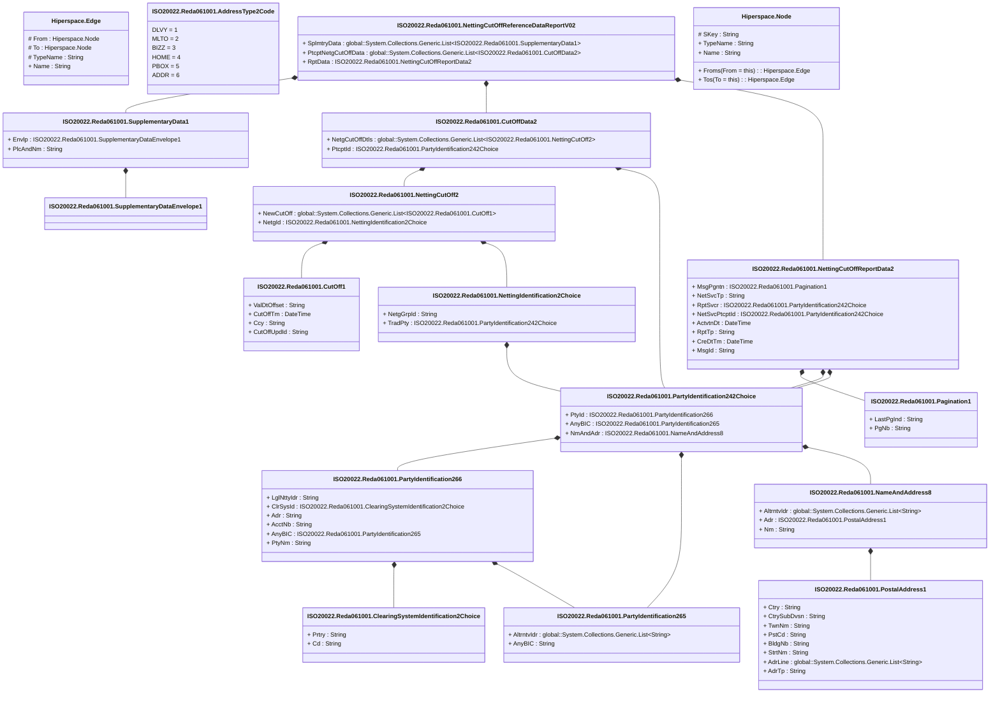

# reda.061.001.02

> The tables below contain descriptions of the members of each Element. 
> The first column indicates the type of the member:
> A ‘#’ indicates that the field is a key to the element, and a ‘+’ indicates that the field is a value.
> The ‘*’ column contains a description for the element member.  
> The ‘@’ column contains any properties for the member.
> The ‘=’ column contains calculated values; or in the case of an enum, the serialized value.

---

## View Hiperspace.Edge
edge between nodes

| |Name|Type|*|@|=|
|-|-|-|-|-|-|
|#|From|Hiperspace.Node||||
|#|To|Hiperspace.Node||||
|#|TypeName|String||||
|+|Name|String||||

---

## Enum ISO20022.Reda061001.AddressType2Code

| |Name|Type|*|@|=|
|-|-|-|-|-|-|
||DLVY|Int32||XmlEnum("""DLVY""")|1|
||MLTO|Int32||XmlEnum("""MLTO""")|2|
||BIZZ|Int32||XmlEnum("""BIZZ""")|3|
||HOME|Int32||XmlEnum("""HOME""")|4|
||PBOX|Int32||XmlEnum("""PBOX""")|5|
||ADDR|Int32||XmlEnum("""ADDR""")|6|

---

## Value ISO20022.Reda061001.ClearingSystemIdentification2Choice

| |Name|Type|*|@|=|
|-|-|-|-|-|-|
|+|Prtry|String||XmlElement()||
|+|Cd|String||XmlElement()||
||Validation|Some(String)||XmlIgnore(), JsonIgnore()|validation(validChoice(Prtry,Cd))|

---

## Value ISO20022.Reda061001.CutOff1

| |Name|Type|*|@|=|
|-|-|-|-|-|-|
|+|ValDtOffset|String||XmlElement()||
|+|CutOffTm|DateTime||XmlElement()||
|+|Ccy|String||XmlElement()||
|+|CutOffUpdId|String||XmlElement()||
||Validation|Some(String)||XmlIgnore(), JsonIgnore()|validation(validPattern("""ValDtOffset""",ValDtOffset,"""0\|-1\|-2"""),validPattern("""Ccy""",Ccy,"""[A-Z]{3,3}"""))|

---

## Value ISO20022.Reda061001.CutOffData2

| |Name|Type|*|@|=|
|-|-|-|-|-|-|
|+|NetgCutOffDtls|global::System.Collections.Generic.List<ISO20022.Reda061001.NettingCutOff2>||XmlElement()||
|+|PtcptId|ISO20022.Reda061001.PartyIdentification242Choice||XmlElement()||
||Validation|Some(String)||XmlIgnore(), JsonIgnore()|validation(validRequired("""NetgCutOffDtls""",NetgCutOffDtls),validList("""NetgCutOffDtls""",NetgCutOffDtls),validElement(NetgCutOffDtls),validElement(PtcptId))|

---

## Type ISO20022.Reda061001.Document

| |Name|Type|*|@|=|
|-|-|-|-|-|-|
|+|NetgCutOffRefDataRpt|ISO20022.Reda061001.NettingCutOffReferenceDataReportV02||XmlElement()||
||Validation|Some(String)||XmlIgnore(), JsonIgnore()|validation(validElement(NetgCutOffRefDataRpt))|

---

## Value ISO20022.Reda061001.NameAndAddress8

| |Name|Type|*|@|=|
|-|-|-|-|-|-|
|+|AltrntvIdr|global::System.Collections.Generic.List<String>||XmlElement()||
|+|Adr|ISO20022.Reda061001.PostalAddress1||XmlElement()||
|+|Nm|String||XmlElement()||
||Validation|Some(String)||XmlIgnore(), JsonIgnore()|validation(validListMax("""AltrntvIdr""",AltrntvIdr,10),validElement(Adr))|

---

## Value ISO20022.Reda061001.NettingCutOff2

| |Name|Type|*|@|=|
|-|-|-|-|-|-|
|+|NewCutOff|global::System.Collections.Generic.List<ISO20022.Reda061001.CutOff1>||XmlElement()||
|+|NetgId|ISO20022.Reda061001.NettingIdentification2Choice||XmlElement()||
||Validation|Some(String)||XmlIgnore(), JsonIgnore()|validation(validRequired("""NewCutOff""",NewCutOff),validList("""NewCutOff""",NewCutOff),validElement(NewCutOff),validElement(NetgId))|

---

## Aspect ISO20022.Reda061001.NettingCutOffReferenceDataReportV02

| |Name|Type|*|@|=|
|-|-|-|-|-|-|
|+|SplmtryData|global::System.Collections.Generic.List<ISO20022.Reda061001.SupplementaryData1>||XmlElement()||
|+|PtcptNetgCutOffData|global::System.Collections.Generic.List<ISO20022.Reda061001.CutOffData2>||XmlElement()||
|+|RptData|ISO20022.Reda061001.NettingCutOffReportData2||XmlElement()||
||Validation|Some(String)||XmlIgnore(), JsonIgnore()|validation(validList("""SplmtryData""",SplmtryData),validElement(SplmtryData),validRequired("""PtcptNetgCutOffData""",PtcptNetgCutOffData),validList("""PtcptNetgCutOffData""",PtcptNetgCutOffData),validElement(PtcptNetgCutOffData),validElement(RptData))|

---

## Value ISO20022.Reda061001.NettingCutOffReportData2

| |Name|Type|*|@|=|
|-|-|-|-|-|-|
|+|MsgPgntn|ISO20022.Reda061001.Pagination1||XmlElement()||
|+|NetSvcTp|String||XmlElement()||
|+|RptSvcr|ISO20022.Reda061001.PartyIdentification242Choice||XmlElement()||
|+|NetSvcPtcptId|ISO20022.Reda061001.PartyIdentification242Choice||XmlElement()||
|+|ActvtnDt|DateTime||XmlElement()||
|+|RptTp|String||XmlElement()||
|+|CreDtTm|DateTime||XmlElement()||
|+|MsgId|String||XmlElement()||
||Validation|Some(String)||XmlIgnore(), JsonIgnore()|validation(validElement(MsgPgntn),validElement(RptSvcr),validElement(NetSvcPtcptId))|

---

## Value ISO20022.Reda061001.NettingIdentification2Choice

| |Name|Type|*|@|=|
|-|-|-|-|-|-|
|+|NetgGrpId|String||XmlElement()||
|+|TradPty|ISO20022.Reda061001.PartyIdentification242Choice||XmlElement()||
||Validation|Some(String)||XmlIgnore(), JsonIgnore()|validation(validElement(TradPty),validChoice(NetgGrpId,TradPty))|

---

## Value ISO20022.Reda061001.Pagination1

| |Name|Type|*|@|=|
|-|-|-|-|-|-|
|+|LastPgInd|String||XmlElement()||
|+|PgNb|String||XmlElement()||
||Validation|Some(String)||XmlIgnore(), JsonIgnore()|validation(validPattern("""PgNb""",PgNb,"""[0-9]{1,5}"""))|

---

## Value ISO20022.Reda061001.PartyIdentification242Choice

| |Name|Type|*|@|=|
|-|-|-|-|-|-|
|+|PtyId|ISO20022.Reda061001.PartyIdentification266||XmlElement()||
|+|AnyBIC|ISO20022.Reda061001.PartyIdentification265||XmlElement()||
|+|NmAndAdr|ISO20022.Reda061001.NameAndAddress8||XmlElement()||
||Validation|Some(String)||XmlIgnore(), JsonIgnore()|validation(validElement(PtyId),validElement(AnyBIC),validElement(NmAndAdr),validChoice(PtyId,AnyBIC,NmAndAdr))|

---

## Value ISO20022.Reda061001.PartyIdentification265

| |Name|Type|*|@|=|
|-|-|-|-|-|-|
|+|AltrntvIdr|global::System.Collections.Generic.List<String>||XmlElement()||
|+|AnyBIC|String||XmlElement()||
||Validation|Some(String)||XmlIgnore(), JsonIgnore()|validation(validListMax("""AltrntvIdr""",AltrntvIdr,10),validPattern("""AnyBIC""",AnyBIC,"""[A-Z0-9]{4,4}[A-Z]{2,2}[A-Z0-9]{2,2}([A-Z0-9]{3,3}){0,1}"""))|

---

## Value ISO20022.Reda061001.PartyIdentification266

| |Name|Type|*|@|=|
|-|-|-|-|-|-|
|+|LglNttyIdr|String||XmlElement()||
|+|ClrSysId|ISO20022.Reda061001.ClearingSystemIdentification2Choice||XmlElement()||
|+|Adr|String||XmlElement()||
|+|AcctNb|String||XmlElement()||
|+|AnyBIC|ISO20022.Reda061001.PartyIdentification265||XmlElement()||
|+|PtyNm|String||XmlElement()||
||Validation|Some(String)||XmlIgnore(), JsonIgnore()|validation(validPattern("""LglNttyIdr""",LglNttyIdr,"""[A-Z0-9]{18,18}[0-9]{2,2}"""),validElement(ClrSysId),validElement(AnyBIC))|

---

## Value ISO20022.Reda061001.PostalAddress1

| |Name|Type|*|@|=|
|-|-|-|-|-|-|
|+|Ctry|String||XmlElement()||
|+|CtrySubDvsn|String||XmlElement()||
|+|TwnNm|String||XmlElement()||
|+|PstCd|String||XmlElement()||
|+|BldgNb|String||XmlElement()||
|+|StrtNm|String||XmlElement()||
|+|AdrLine|global::System.Collections.Generic.List<String>||XmlElement()||
|+|AdrTp|String||XmlElement()||
||Validation|Some(String)||XmlIgnore(), JsonIgnore()|validation(validPattern("""Ctry""",Ctry,"""[A-Z]{2,2}"""),validListMax("""AdrLine""",AdrLine,5))|

---

## Value ISO20022.Reda061001.SupplementaryData1

| |Name|Type|*|@|=|
|-|-|-|-|-|-|
|+|Envlp|ISO20022.Reda061001.SupplementaryDataEnvelope1||XmlElement()||
|+|PlcAndNm|String||XmlElement()||
||Validation|Some(String)||XmlIgnore(), JsonIgnore()|validation(validElement(Envlp))|

---

## Value ISO20022.Reda061001.SupplementaryDataEnvelope1

| |Name|Type|*|@|=|
|-|-|-|-|-|-|
||Validation|Some(String)||XmlIgnore(), JsonIgnore()|""|

---

## View Hiperspace.Node
node in a graph view of data

| |Name|Type|*|@|=|
|-|-|-|-|-|-|
|#|SKey|String||||
|+|TypeName|String||||
|+|Name|String||||
||Froms|Hiperspace.Edge|||From = this|
||Tos|Hiperspace.Edge|||To = this|

