# reda.065.001.02

```mermaid
classDiagram
    class Hiperspace.Edge {
        # From  : Hiperspace.Node
        # To  : Hiperspace.Node
        # TypeName  : String
        + Name  : String
    }
    class ISO20022.Reda065001.CalendarData1 {
        + SysSts  : ISO20022.Reda065001.SystemStatus3Choice
        + SysDt  : DateTime
    }
    ISO20022.Reda065001.CalendarData1 *-- ISO20022.Reda065001.SystemStatus3Choice
    class ISO20022.Reda065001.CalendarOrBusinessError1Choice {
        + BizErr  : global::System.Collections.Generic.List~ISO20022.Reda065001.ErrorHandling4~
        + CalData  : global::System.Collections.Generic.List~ISO20022.Reda065001.CalendarData1~
    }
    ISO20022.Reda065001.CalendarOrBusinessError1Choice *-- ISO20022.Reda065001.ErrorHandling4
    ISO20022.Reda065001.CalendarOrBusinessError1Choice *-- ISO20022.Reda065001.CalendarData1
    class ISO20022.Reda065001.CalendarReport1 {
        + CalOrErr  : ISO20022.Reda065001.CalendarOrBusinessError1Choice
        + Svc  : ISO20022.Reda065001.SystemAndCurrency1
    }
    ISO20022.Reda065001.CalendarReport1 *-- ISO20022.Reda065001.CalendarOrBusinessError1Choice
    ISO20022.Reda065001.CalendarReport1 *-- ISO20022.Reda065001.SystemAndCurrency1
    class ISO20022.Reda065001.CalendarReportOrError1Choice {
        + OprlErr  : global::System.Collections.Generic.List~ISO20022.Reda065001.ErrorHandling4~
        + CalRpt  : ISO20022.Reda065001.CalendarReport1
    }
    ISO20022.Reda065001.CalendarReportOrError1Choice *-- ISO20022.Reda065001.ErrorHandling4
    ISO20022.Reda065001.CalendarReportOrError1Choice *-- ISO20022.Reda065001.CalendarReport1
    class ISO20022.Reda065001.CalendarReportV02 {
        + SplmtryData  : global::System.Collections.Generic.List~ISO20022.Reda065001.SupplementaryData1~
        + RptOrErr  : ISO20022.Reda065001.CalendarReportOrError1Choice
        + MsgHdr  : ISO20022.Reda065001.MessageHeader11
    }
    ISO20022.Reda065001.CalendarReportV02 *-- ISO20022.Reda065001.SupplementaryData1
    ISO20022.Reda065001.CalendarReportV02 *-- ISO20022.Reda065001.CalendarReportOrError1Choice
    ISO20022.Reda065001.CalendarReportV02 *-- ISO20022.Reda065001.MessageHeader11
    class ISO20022.Reda065001.ErrorHandling1Code {
        X050 = 1
        X030 = 2
        X020 = 3
    }
    class ISO20022.Reda065001.ErrorHandling2Choice {
        + Prtry  : String
        + Cd  : String
    }
    class ISO20022.Reda065001.ErrorHandling4 {
        + Desc  : String
        + Err  : ISO20022.Reda065001.ErrorHandling2Choice
    }
    ISO20022.Reda065001.ErrorHandling4 *-- ISO20022.Reda065001.ErrorHandling2Choice
    class ISO20022.Reda065001.GenericIdentification1 {
        + Issr  : String
        + SchmeNm  : String
        + Id  : String
    }
    class ISO20022.Reda065001.MarketInfrastructureIdentification1Choice {
        + Prtry  : String
        + Cd  : String
    }
    class ISO20022.Reda065001.MessageHeader11 {
        + OrgnlBizQry  : ISO20022.Reda065001.OriginalBusinessQuery1
        + ReqTp  : ISO20022.Reda065001.RequestType4Choice
        + CreDtTm  : DateTime
        + MsgId  : String
    }
    ISO20022.Reda065001.MessageHeader11 *-- ISO20022.Reda065001.OriginalBusinessQuery1
    ISO20022.Reda065001.MessageHeader11 *-- ISO20022.Reda065001.RequestType4Choice
    class ISO20022.Reda065001.OriginalBusinessQuery1 {
        + CreDtTm  : DateTime
        + MsgNmId  : String
        + MsgId  : String
    }
    class ISO20022.Reda065001.RequestType4Choice {
        + Prtry  : ISO20022.Reda065001.GenericIdentification1
        + Enqry  : String
        + PmtCtrl  : String
    }
    ISO20022.Reda065001.RequestType4Choice *-- ISO20022.Reda065001.GenericIdentification1
    class ISO20022.Reda065001.SupplementaryData1 {
        + Envlp  : ISO20022.Reda065001.SupplementaryDataEnvelope1
        + PlcAndNm  : String
    }
    ISO20022.Reda065001.SupplementaryData1 *-- ISO20022.Reda065001.SupplementaryDataEnvelope1
    class ISO20022.Reda065001.SupplementaryDataEnvelope1 {
    }
    class ISO20022.Reda065001.SystemAndCurrency1 {
        + SysCcy  : String
        + SysId  : ISO20022.Reda065001.SystemIdentification2Choice
    }
    ISO20022.Reda065001.SystemAndCurrency1 *-- ISO20022.Reda065001.SystemIdentification2Choice
    class ISO20022.Reda065001.SystemIdentification2Choice {
        + Ctry  : String
        + MktInfrstrctrId  : ISO20022.Reda065001.MarketInfrastructureIdentification1Choice
    }
    ISO20022.Reda065001.SystemIdentification2Choice *-- ISO20022.Reda065001.MarketInfrastructureIdentification1Choice
    class ISO20022.Reda065001.SystemStatus3Choice {
        + Prtry  : ISO20022.Reda065001.GenericIdentification1
        + Cd  : String
    }
    ISO20022.Reda065001.SystemStatus3Choice *-- ISO20022.Reda065001.GenericIdentification1
    class ISO20022.Reda065001.SystemStatus3Code {
        RMPS = 1
        CLSD = 2
        ACTV = 3
    }
    class Hiperspace.Node {
        # SKey  : String
        + TypeName  : String
        + Name  : String
        + Froms (From = this) : Hiperspace.Edge
        + Tos (To = this) : Hiperspace.Edge
    }
```

> The tables below contain descriptions of the members of each Element. 
> The first column indicates the type of the member:
> A ‘#’ indicates that the field is a key to the element, and a ‘+’ indicates that the field is a value.
> The ‘*’ column contains a description for the element member.  
> The ‘@’ column contains any properties for the member.
> The ‘=’ column contains calculated values; or in the case of an enum, the serialized value.

---

## View Hiperspace.Edge
edge between nodes

| |Name|Type|*|@|=|
|-|-|-|-|-|-|
|#|From|Hiperspace.Node||||
|#|To|Hiperspace.Node||||
|#|TypeName|String||||
|+|Name|String||||

---

## Value ISO20022.Reda065001.CalendarData1

| |Name|Type|*|@|=|
|-|-|-|-|-|-|
|+|SysSts|ISO20022.Reda065001.SystemStatus3Choice||XmlElement()||
|+|SysDt|DateTime||XmlElement()||
||Validation|Some(String)||XmlIgnore(), JsonIgnore()|validation(validElement(SysSts))|

---

## Value ISO20022.Reda065001.CalendarOrBusinessError1Choice

| |Name|Type|*|@|=|
|-|-|-|-|-|-|
|+|BizErr|global::System.Collections.Generic.List<ISO20022.Reda065001.ErrorHandling4>||XmlElement()||
|+|CalData|global::System.Collections.Generic.List<ISO20022.Reda065001.CalendarData1>||XmlElement()||
||Validation|Some(String)||XmlIgnore(), JsonIgnore()|validation(validRequired("""BizErr""",BizErr),validList("""BizErr""",BizErr),validElement(BizErr),validRequired("""CalData""",CalData),validList("""CalData""",CalData),validElement(CalData),validChoice(BizErr,CalData))|

---

## Value ISO20022.Reda065001.CalendarReport1

| |Name|Type|*|@|=|
|-|-|-|-|-|-|
|+|CalOrErr|ISO20022.Reda065001.CalendarOrBusinessError1Choice||XmlElement()||
|+|Svc|ISO20022.Reda065001.SystemAndCurrency1||XmlElement()||
||Validation|Some(String)||XmlIgnore(), JsonIgnore()|validation(validElement(CalOrErr),validElement(Svc))|

---

## Value ISO20022.Reda065001.CalendarReportOrError1Choice

| |Name|Type|*|@|=|
|-|-|-|-|-|-|
|+|OprlErr|global::System.Collections.Generic.List<ISO20022.Reda065001.ErrorHandling4>||XmlElement()||
|+|CalRpt|ISO20022.Reda065001.CalendarReport1||XmlElement()||
||Validation|Some(String)||XmlIgnore(), JsonIgnore()|validation(validRequired("""OprlErr""",OprlErr),validList("""OprlErr""",OprlErr),validElement(OprlErr),validElement(CalRpt),validChoice(OprlErr,CalRpt))|

---

## Aspect ISO20022.Reda065001.CalendarReportV02

| |Name|Type|*|@|=|
|-|-|-|-|-|-|
|+|SplmtryData|global::System.Collections.Generic.List<ISO20022.Reda065001.SupplementaryData1>||XmlElement()||
|+|RptOrErr|ISO20022.Reda065001.CalendarReportOrError1Choice||XmlElement()||
|+|MsgHdr|ISO20022.Reda065001.MessageHeader11||XmlElement()||
||Validation|Some(String)||XmlIgnore(), JsonIgnore()|validation(validList("""SplmtryData""",SplmtryData),validElement(SplmtryData),validElement(RptOrErr),validElement(MsgHdr))|

---

## Type ISO20022.Reda065001.Document

| |Name|Type|*|@|=|
|-|-|-|-|-|-|
|+|CalRpt|ISO20022.Reda065001.CalendarReportV02||XmlElement()||
||Validation|Some(String)||XmlIgnore(), JsonIgnore()|validation(validElement(CalRpt))|

---

## Enum ISO20022.Reda065001.ErrorHandling1Code

| |Name|Type|*|@|=|
|-|-|-|-|-|-|
||X050|Int32||XmlEnum("""X050""")|1|
||X030|Int32||XmlEnum("""X030""")|2|
||X020|Int32||XmlEnum("""X020""")|3|

---

## Value ISO20022.Reda065001.ErrorHandling2Choice

| |Name|Type|*|@|=|
|-|-|-|-|-|-|
|+|Prtry|String||XmlElement()||
|+|Cd|String||XmlElement()||
||Validation|Some(String)||XmlIgnore(), JsonIgnore()|validation(validChoice(Prtry,Cd))|

---

## Value ISO20022.Reda065001.ErrorHandling4

| |Name|Type|*|@|=|
|-|-|-|-|-|-|
|+|Desc|String||XmlElement()||
|+|Err|ISO20022.Reda065001.ErrorHandling2Choice||XmlElement()||
||Validation|Some(String)||XmlIgnore(), JsonIgnore()|validation(validElement(Err))|

---

## Value ISO20022.Reda065001.GenericIdentification1

| |Name|Type|*|@|=|
|-|-|-|-|-|-|
|+|Issr|String||XmlElement()||
|+|SchmeNm|String||XmlElement()||
|+|Id|String||XmlElement()||
||Validation|Some(String)||XmlIgnore(), JsonIgnore()|""|

---

## Value ISO20022.Reda065001.MarketInfrastructureIdentification1Choice

| |Name|Type|*|@|=|
|-|-|-|-|-|-|
|+|Prtry|String||XmlElement()||
|+|Cd|String||XmlElement()||
||Validation|Some(String)||XmlIgnore(), JsonIgnore()|validation(validChoice(Prtry,Cd))|

---

## Value ISO20022.Reda065001.MessageHeader11

| |Name|Type|*|@|=|
|-|-|-|-|-|-|
|+|OrgnlBizQry|ISO20022.Reda065001.OriginalBusinessQuery1||XmlElement()||
|+|ReqTp|ISO20022.Reda065001.RequestType4Choice||XmlElement()||
|+|CreDtTm|DateTime||XmlElement()||
|+|MsgId|String||XmlElement()||
||Validation|Some(String)||XmlIgnore(), JsonIgnore()|validation(validElement(OrgnlBizQry),validElement(ReqTp))|

---

## Value ISO20022.Reda065001.OriginalBusinessQuery1

| |Name|Type|*|@|=|
|-|-|-|-|-|-|
|+|CreDtTm|DateTime||XmlElement()||
|+|MsgNmId|String||XmlElement()||
|+|MsgId|String||XmlElement()||
||Validation|Some(String)||XmlIgnore(), JsonIgnore()|""|

---

## Value ISO20022.Reda065001.RequestType4Choice

| |Name|Type|*|@|=|
|-|-|-|-|-|-|
|+|Prtry|ISO20022.Reda065001.GenericIdentification1||XmlElement()||
|+|Enqry|String||XmlElement()||
|+|PmtCtrl|String||XmlElement()||
||Validation|Some(String)||XmlIgnore(), JsonIgnore()|validation(validElement(Prtry),validChoice(Prtry,Enqry,PmtCtrl))|

---

## Value ISO20022.Reda065001.SupplementaryData1

| |Name|Type|*|@|=|
|-|-|-|-|-|-|
|+|Envlp|ISO20022.Reda065001.SupplementaryDataEnvelope1||XmlElement()||
|+|PlcAndNm|String||XmlElement()||
||Validation|Some(String)||XmlIgnore(), JsonIgnore()|validation(validElement(Envlp))|

---

## Value ISO20022.Reda065001.SupplementaryDataEnvelope1

| |Name|Type|*|@|=|
|-|-|-|-|-|-|
||Validation|Some(String)||XmlIgnore(), JsonIgnore()|""|

---

## Value ISO20022.Reda065001.SystemAndCurrency1

| |Name|Type|*|@|=|
|-|-|-|-|-|-|
|+|SysCcy|String||XmlElement()||
|+|SysId|ISO20022.Reda065001.SystemIdentification2Choice||XmlElement()||
||Validation|Some(String)||XmlIgnore(), JsonIgnore()|validation(validPattern("""SysCcy""",SysCcy,"""[A-Z]{3,3}"""),validElement(SysId))|

---

## Value ISO20022.Reda065001.SystemIdentification2Choice

| |Name|Type|*|@|=|
|-|-|-|-|-|-|
|+|Ctry|String||XmlElement()||
|+|MktInfrstrctrId|ISO20022.Reda065001.MarketInfrastructureIdentification1Choice||XmlElement()||
||Validation|Some(String)||XmlIgnore(), JsonIgnore()|validation(validPattern("""Ctry""",Ctry,"""[A-Z]{2,2}"""),validElement(MktInfrstrctrId),validChoice(Ctry,MktInfrstrctrId))|

---

## Value ISO20022.Reda065001.SystemStatus3Choice

| |Name|Type|*|@|=|
|-|-|-|-|-|-|
|+|Prtry|ISO20022.Reda065001.GenericIdentification1||XmlElement()||
|+|Cd|String||XmlElement()||
||Validation|Some(String)||XmlIgnore(), JsonIgnore()|validation(validElement(Prtry),validChoice(Prtry,Cd))|

---

## Enum ISO20022.Reda065001.SystemStatus3Code

| |Name|Type|*|@|=|
|-|-|-|-|-|-|
||RMPS|Int32||XmlEnum("""RMPS""")|1|
||CLSD|Int32||XmlEnum("""CLSD""")|2|
||ACTV|Int32||XmlEnum("""ACTV""")|3|

---

## View Hiperspace.Node
node in a graph view of data

| |Name|Type|*|@|=|
|-|-|-|-|-|-|
|#|SKey|String||||
|+|TypeName|String||||
|+|Name|String||||
||Froms|Hiperspace.Edge|||From = this|
||Tos|Hiperspace.Edge|||To = this|

