# reda.067.001.02

```mermaid
classDiagram
    class Hiperspace.Edge {
        # From  : Hiperspace.Node
        # To  : Hiperspace.Node
        # TypeName  : String
        + Name  : String
    }
    class ISO20022.Reda067001.AddressType2Code {
        DLVY = 1
        MLTO = 2
        BIZZ = 3
        HOME = 4
        PBOX = 5
        ADDR = 6
    }
    class ISO20022.Reda067001.AddressType3Choice {
        + Prtry  : ISO20022.Reda067001.GenericIdentification30
        + Cd  : String
    }
    ISO20022.Reda067001.AddressType3Choice *-- ISO20022.Reda067001.GenericIdentification30
    class ISO20022.Reda067001.Contact13 {
        + PrefrdMtd  : String
        + Othr  : global::System.Collections.Generic.List~ISO20022.Reda067001.OtherContact1~
        + Dept  : String
        + Rspnsblty  : String
        + JobTitl  : String
        + EmailPurp  : String
        + EmailAdr  : String
        + URLAdr  : String
        + FaxNb  : String
        + MobNb  : String
        + PhneNb  : String
        + Nm  : String
        + NmPrfx  : String
    }
    ISO20022.Reda067001.Contact13 *-- ISO20022.Reda067001.OtherContact1
    class ISO20022.Reda067001.CreditorEnrolment5 {
        + CdtrLogo  : String
        + MrchntCtgyCd  : String
        + UltmtCdtr  : ISO20022.Reda067001.RTPPartyIdentification2
        + Cdtr  : ISO20022.Reda067001.RTPPartyIdentification2
        + CdtrTradgNm  : String
        + Enrlmnt  : ISO20022.Reda067001.CreditorServiceEnrolment1
    }
    ISO20022.Reda067001.CreditorEnrolment5 *-- ISO20022.Reda067001.RTPPartyIdentification2
    ISO20022.Reda067001.CreditorEnrolment5 *-- ISO20022.Reda067001.RTPPartyIdentification2
    ISO20022.Reda067001.CreditorEnrolment5 *-- ISO20022.Reda067001.CreditorServiceEnrolment1
    class ISO20022.Reda067001.CreditorEnrolment6 {
        + CdtrLogo  : String
        + MrchntCtgyCd  : String
        + UltmtCdtr  : ISO20022.Reda067001.RTPPartyIdentification2
        + Cdtr  : ISO20022.Reda067001.RTPPartyIdentification2
        + CdtrTradgNm  : String
        + Enrlmnt  : ISO20022.Reda067001.CreditorServiceEnrolment1
    }
    ISO20022.Reda067001.CreditorEnrolment6 *-- ISO20022.Reda067001.RTPPartyIdentification2
    ISO20022.Reda067001.CreditorEnrolment6 *-- ISO20022.Reda067001.RTPPartyIdentification2
    ISO20022.Reda067001.CreditorEnrolment6 *-- ISO20022.Reda067001.CreditorServiceEnrolment1
    class ISO20022.Reda067001.CreditorEnrolmentAmendment5 {
        + SplmtryData  : global::System.Collections.Generic.List~ISO20022.Reda067001.SupplementaryData1~
        + OrgnlEnrlmnt  : ISO20022.Reda067001.OriginalEnrolment3Choice
        + Amdmnt  : ISO20022.Reda067001.CreditorEnrolmentAmendment6
        + AmdmntRsn  : ISO20022.Reda067001.CreditorEnrolmentAmendmentReason3
        + OrgnlBizInstr  : ISO20022.Reda067001.OriginalBusinessInstruction1
    }
    ISO20022.Reda067001.CreditorEnrolmentAmendment5 *-- ISO20022.Reda067001.SupplementaryData1
    ISO20022.Reda067001.CreditorEnrolmentAmendment5 *-- ISO20022.Reda067001.OriginalEnrolment3Choice
    ISO20022.Reda067001.CreditorEnrolmentAmendment5 *-- ISO20022.Reda067001.CreditorEnrolmentAmendment6
    ISO20022.Reda067001.CreditorEnrolmentAmendment5 *-- ISO20022.Reda067001.CreditorEnrolmentAmendmentReason3
    ISO20022.Reda067001.CreditorEnrolmentAmendment5 *-- ISO20022.Reda067001.OriginalBusinessInstruction1
    class ISO20022.Reda067001.CreditorEnrolmentAmendment6 {
        + ActvtnData  : ISO20022.Reda067001.CreditorInvoice5
        + CdtrEnrlmnt  : ISO20022.Reda067001.CreditorEnrolment6
    }
    ISO20022.Reda067001.CreditorEnrolmentAmendment6 *-- ISO20022.Reda067001.CreditorInvoice5
    ISO20022.Reda067001.CreditorEnrolmentAmendment6 *-- ISO20022.Reda067001.CreditorEnrolment6
    class ISO20022.Reda067001.CreditorEnrolmentAmendmentReason1Choice {
        + Prtry  : String
        + Cd  : String
    }
    class ISO20022.Reda067001.CreditorEnrolmentAmendmentReason3 {
        + AddtlInf  : global::System.Collections.Generic.List~String~
        + Rsn  : ISO20022.Reda067001.CreditorEnrolmentAmendmentReason1Choice
        + Orgtr  : ISO20022.Reda067001.RTPPartyIdentification2
    }
    ISO20022.Reda067001.CreditorEnrolmentAmendmentReason3 *-- ISO20022.Reda067001.CreditorEnrolmentAmendmentReason1Choice
    ISO20022.Reda067001.CreditorEnrolmentAmendmentReason3 *-- ISO20022.Reda067001.RTPPartyIdentification2
    class ISO20022.Reda067001.CreditorInvoice5 {
        + ActvtnReqDlvryPty  : ISO20022.Reda067001.RTPPartyIdentification2
        + CdtrInstr  : String
        + CtrctRefTp  : global::System.Collections.Generic.List~ISO20022.Reda067001.DocumentType1Choice~
        + CtrctFrmtTp  : global::System.Collections.Generic.List~ISO20022.Reda067001.DocumentFormat2Choice~
        + CstmrIdTp  : ISO20022.Reda067001.CustomerTypeRequest2
        + LtdPresntmntInd  : String
    }
    ISO20022.Reda067001.CreditorInvoice5 *-- ISO20022.Reda067001.RTPPartyIdentification2
    ISO20022.Reda067001.CreditorInvoice5 *-- ISO20022.Reda067001.DocumentType1Choice
    ISO20022.Reda067001.CreditorInvoice5 *-- ISO20022.Reda067001.DocumentFormat2Choice
    ISO20022.Reda067001.CreditorInvoice5 *-- ISO20022.Reda067001.CustomerTypeRequest2
    class ISO20022.Reda067001.CreditorServiceEnrolment1 {
        + CdtrSvcActvtnLk  : String
        + SvcDescLk  : String
        + SvcActvtnAllwd  : String
        + Vsblty  : ISO20022.Reda067001.Visibilty1
        + EnrlmntEndDt  : ISO20022.Reda067001.DateAndDateTime2Choice
        + EnrlmntStartDt  : ISO20022.Reda067001.DateAndDateTime2Choice
    }
    ISO20022.Reda067001.CreditorServiceEnrolment1 *-- ISO20022.Reda067001.Visibilty1
    ISO20022.Reda067001.CreditorServiceEnrolment1 *-- ISO20022.Reda067001.DateAndDateTime2Choice
    ISO20022.Reda067001.CreditorServiceEnrolment1 *-- ISO20022.Reda067001.DateAndDateTime2Choice
    class ISO20022.Reda067001.CustomerTypeRequest2 {
        + PrvtTp  : ISO20022.Reda067001.PersonType2
        + OrgTp  : ISO20022.Reda067001.OrganisationType2
        + Reqd  : String
    }
    ISO20022.Reda067001.CustomerTypeRequest2 *-- ISO20022.Reda067001.PersonType2
    ISO20022.Reda067001.CustomerTypeRequest2 *-- ISO20022.Reda067001.OrganisationType2
    class ISO20022.Reda067001.DateAndDateTime2Choice {
        + DtTm  : DateTime
        + Dt  : DateTime
    }
    class ISO20022.Reda067001.DateAndPlaceOfBirth1 {
        + CtryOfBirth  : String
        + CityOfBirth  : String
        + PrvcOfBirth  : String
        + BirthDt  : DateTime
    }
    class ISO20022.Reda067001.DocumentFormat2Choice {
        + Prtry  : ISO20022.Reda067001.GenericIdentification1
        + Cd  : String
    }
    ISO20022.Reda067001.DocumentFormat2Choice *-- ISO20022.Reda067001.GenericIdentification1
    class ISO20022.Reda067001.DocumentType1Choice {
        + Prtry  : ISO20022.Reda067001.GenericIdentification1
        + Cd  : String
    }
    ISO20022.Reda067001.DocumentType1Choice *-- ISO20022.Reda067001.GenericIdentification1
    class ISO20022.Reda067001.EnrolmentHeader3 {
        + InitgPty  : ISO20022.Reda067001.RTPPartyIdentification2
        + MsgRcpt  : ISO20022.Reda067001.RTPPartyIdentification2
        + MsgOrgtr  : ISO20022.Reda067001.RTPPartyIdentification2
        + CreDtTm  : DateTime
        + MsgId  : String
    }
    ISO20022.Reda067001.EnrolmentHeader3 *-- ISO20022.Reda067001.RTPPartyIdentification2
    ISO20022.Reda067001.EnrolmentHeader3 *-- ISO20022.Reda067001.RTPPartyIdentification2
    ISO20022.Reda067001.EnrolmentHeader3 *-- ISO20022.Reda067001.RTPPartyIdentification2
    class ISO20022.Reda067001.GenericIdentification1 {
        + Issr  : String
        + SchmeNm  : String
        + Id  : String
    }
    class ISO20022.Reda067001.GenericIdentification30 {
        + SchmeNm  : String
        + Issr  : String
        + Id  : String
    }
    class ISO20022.Reda067001.GenericOrganisationIdentification3 {
        + Issr  : String
        + SchmeNm  : ISO20022.Reda067001.OrganisationIdentificationSchemeName1Choice
        + Id  : String
    }
    ISO20022.Reda067001.GenericOrganisationIdentification3 *-- ISO20022.Reda067001.OrganisationIdentificationSchemeName1Choice
    class ISO20022.Reda067001.GenericOrganisationType1 {
        + SchmeNm  : ISO20022.Reda067001.OrganisationIdentificationSchemeName1Choice
        + Reqd  : String
    }
    ISO20022.Reda067001.GenericOrganisationType1 *-- ISO20022.Reda067001.OrganisationIdentificationSchemeName1Choice
    class ISO20022.Reda067001.GenericPersonIdentification2 {
        + Issr  : String
        + SchmeNm  : ISO20022.Reda067001.PersonIdentificationSchemeName1Choice
        + Id  : String
    }
    ISO20022.Reda067001.GenericPersonIdentification2 *-- ISO20022.Reda067001.PersonIdentificationSchemeName1Choice
    class ISO20022.Reda067001.GenericPersonType1 {
        + SchmeNm  : ISO20022.Reda067001.PersonIdentificationSchemeName1Choice
        + Reqd  : String
    }
    ISO20022.Reda067001.GenericPersonType1 *-- ISO20022.Reda067001.PersonIdentificationSchemeName1Choice
    class ISO20022.Reda067001.NamePrefix2Code {
        MIKS = 1
        MIST = 2
        MISS = 3
        MADM = 4
        DOCT = 5
    }
    class ISO20022.Reda067001.OrganisationIdentification40 {
        + Othr  : global::System.Collections.Generic.List~ISO20022.Reda067001.GenericOrganisationIdentification3~
        + EmailAdr  : String
        + LEI  : String
        + AnyBIC  : String
    }
    ISO20022.Reda067001.OrganisationIdentification40 *-- ISO20022.Reda067001.GenericOrganisationIdentification3
    class ISO20022.Reda067001.OrganisationIdentificationSchemeName1Choice {
        + Prtry  : String
        + Cd  : String
    }
    class ISO20022.Reda067001.OrganisationType2 {
        + Othr  : global::System.Collections.Generic.List~ISO20022.Reda067001.GenericOrganisationType1~
        + EmailAdr  : String
        + LEI  : String
        + AnyBIC  : String
    }
    ISO20022.Reda067001.OrganisationType2 *-- ISO20022.Reda067001.GenericOrganisationType1
    class ISO20022.Reda067001.OriginalBusinessInstruction1 {
        + CreDtTm  : DateTime
        + MsgNmId  : String
        + MsgId  : String
    }
    class ISO20022.Reda067001.OriginalEnrolment3Choice {
        + OrgnlEnrlmntData  : ISO20022.Reda067001.CreditorEnrolment5
        + OrgnlCdtrId  : ISO20022.Reda067001.Party53Choice
    }
    ISO20022.Reda067001.OriginalEnrolment3Choice *-- ISO20022.Reda067001.CreditorEnrolment5
    ISO20022.Reda067001.OriginalEnrolment3Choice *-- ISO20022.Reda067001.Party53Choice
    class ISO20022.Reda067001.OtherContact1 {
        + Id  : String
        + ChanlTp  : String
    }
    class ISO20022.Reda067001.Party53Choice {
        + PrvtId  : ISO20022.Reda067001.PersonIdentification20
        + OrgId  : ISO20022.Reda067001.OrganisationIdentification40
    }
    ISO20022.Reda067001.Party53Choice *-- ISO20022.Reda067001.PersonIdentification20
    ISO20022.Reda067001.Party53Choice *-- ISO20022.Reda067001.OrganisationIdentification40
    class ISO20022.Reda067001.PersonIdentification20 {
        + Othr  : global::System.Collections.Generic.List~ISO20022.Reda067001.GenericPersonIdentification2~
        + EmailAdr  : String
        + DtAndPlcOfBirth  : ISO20022.Reda067001.DateAndPlaceOfBirth1
    }
    ISO20022.Reda067001.PersonIdentification20 *-- ISO20022.Reda067001.GenericPersonIdentification2
    ISO20022.Reda067001.PersonIdentification20 *-- ISO20022.Reda067001.DateAndPlaceOfBirth1
    class ISO20022.Reda067001.PersonIdentificationSchemeName1Choice {
        + Prtry  : String
        + Cd  : String
    }
    class ISO20022.Reda067001.PersonType2 {
        + Othr  : global::System.Collections.Generic.List~ISO20022.Reda067001.GenericPersonType1~
        + EmailAdr  : String
        + DtAndPlcOfBirth  : String
    }
    ISO20022.Reda067001.PersonType2 *-- ISO20022.Reda067001.GenericPersonType1
    class ISO20022.Reda067001.PostalAddress27 {
        + AdrLine  : global::System.Collections.Generic.List~String~
        + Ctry  : String
        + CtrySubDvsn  : String
        + DstrctNm  : String
        + TwnLctnNm  : String
        + TwnNm  : String
        + PstCd  : String
        + Room  : String
        + PstBx  : String
        + UnitNb  : String
        + Flr  : String
        + BldgNm  : String
        + BldgNb  : String
        + StrtNm  : String
        + SubDept  : String
        + Dept  : String
        + CareOf  : String
        + AdrTp  : ISO20022.Reda067001.AddressType3Choice
    }
    ISO20022.Reda067001.PostalAddress27 *-- ISO20022.Reda067001.AddressType3Choice
    class ISO20022.Reda067001.PreferredContactMethod2Code {
        PHON = 1
        ONLI = 2
        CELL = 3
        LETT = 4
        FAXX = 5
        MAIL = 6
    }
    class ISO20022.Reda067001.RTPPartyIdentification2 {
        + CtctDtls  : ISO20022.Reda067001.Contact13
        + CtryOfRes  : String
        + Id  : ISO20022.Reda067001.Party53Choice
        + PstlAdr  : ISO20022.Reda067001.PostalAddress27
        + Nm  : String
    }
    ISO20022.Reda067001.RTPPartyIdentification2 *-- ISO20022.Reda067001.Contact13
    ISO20022.Reda067001.RTPPartyIdentification2 *-- ISO20022.Reda067001.Party53Choice
    ISO20022.Reda067001.RTPPartyIdentification2 *-- ISO20022.Reda067001.PostalAddress27
    class ISO20022.Reda067001.RequestToPayCreditorEnrolmentAmendmentRequestV02 {
        + SplmtryData  : global::System.Collections.Generic.List~ISO20022.Reda067001.SupplementaryData1~
        + AmdmntData  : global::System.Collections.Generic.List~ISO20022.Reda067001.CreditorEnrolmentAmendment5~
        + Hdr  : ISO20022.Reda067001.EnrolmentHeader3
    }
    ISO20022.Reda067001.RequestToPayCreditorEnrolmentAmendmentRequestV02 *-- ISO20022.Reda067001.SupplementaryData1
    ISO20022.Reda067001.RequestToPayCreditorEnrolmentAmendmentRequestV02 *-- ISO20022.Reda067001.CreditorEnrolmentAmendment5
    ISO20022.Reda067001.RequestToPayCreditorEnrolmentAmendmentRequestV02 *-- ISO20022.Reda067001.EnrolmentHeader3
    class ISO20022.Reda067001.SupplementaryData1 {
        + Envlp  : ISO20022.Reda067001.SupplementaryDataEnvelope1
        + PlcAndNm  : String
    }
    ISO20022.Reda067001.SupplementaryData1 *-- ISO20022.Reda067001.SupplementaryDataEnvelope1
    class ISO20022.Reda067001.SupplementaryDataEnvelope1 {
    }
    class ISO20022.Reda067001.Visibilty1 {
        + LtdVsblty  : String
        + EndDt  : ISO20022.Reda067001.DateAndDateTime2Choice
        + StartDt  : ISO20022.Reda067001.DateAndDateTime2Choice
    }
    ISO20022.Reda067001.Visibilty1 *-- ISO20022.Reda067001.DateAndDateTime2Choice
    ISO20022.Reda067001.Visibilty1 *-- ISO20022.Reda067001.DateAndDateTime2Choice
    class Hiperspace.Node {
        # SKey  : String
        + TypeName  : String
        + Name  : String
        + Froms (From = this) : Hiperspace.Edge
        + Tos (To = this) : Hiperspace.Edge
    }
```

> The tables below contain descriptions of the members of each Element. 
> The first column indicates the type of the member:
> A ‘#’ indicates that the field is a key to the element, and a ‘+’ indicates that the field is a value.
> The ‘*’ column contains a description for the element member.  
> The ‘@’ column contains any properties for the member.
> The ‘=’ column contains calculated values; or in the case of an enum, the serialized value.

---

## View Hiperspace.Edge
edge between nodes

| |Name|Type|*|@|=|
|-|-|-|-|-|-|
|#|From|Hiperspace.Node||||
|#|To|Hiperspace.Node||||
|#|TypeName|String||||
|+|Name|String||||

---

## Enum ISO20022.Reda067001.AddressType2Code

| |Name|Type|*|@|=|
|-|-|-|-|-|-|
||DLVY|Int32||XmlEnum("""DLVY""")|1|
||MLTO|Int32||XmlEnum("""MLTO""")|2|
||BIZZ|Int32||XmlEnum("""BIZZ""")|3|
||HOME|Int32||XmlEnum("""HOME""")|4|
||PBOX|Int32||XmlEnum("""PBOX""")|5|
||ADDR|Int32||XmlEnum("""ADDR""")|6|

---

## Value ISO20022.Reda067001.AddressType3Choice

| |Name|Type|*|@|=|
|-|-|-|-|-|-|
|+|Prtry|ISO20022.Reda067001.GenericIdentification30||XmlElement()||
|+|Cd|String||XmlElement()||
||Validation|Some(String)||XmlIgnore(), JsonIgnore()|validation(validElement(Prtry),validChoice(Prtry,Cd))|

---

## Value ISO20022.Reda067001.Contact13

| |Name|Type|*|@|=|
|-|-|-|-|-|-|
|+|PrefrdMtd|String||XmlElement()||
|+|Othr|global::System.Collections.Generic.List<ISO20022.Reda067001.OtherContact1>||XmlElement()||
|+|Dept|String||XmlElement()||
|+|Rspnsblty|String||XmlElement()||
|+|JobTitl|String||XmlElement()||
|+|EmailPurp|String||XmlElement()||
|+|EmailAdr|String||XmlElement()||
|+|URLAdr|String||XmlElement()||
|+|FaxNb|String||XmlElement()||
|+|MobNb|String||XmlElement()||
|+|PhneNb|String||XmlElement()||
|+|Nm|String||XmlElement()||
|+|NmPrfx|String||XmlElement()||
||Validation|Some(String)||XmlIgnore(), JsonIgnore()|validation(validList("""Othr""",Othr),validElement(Othr),validPattern("""FaxNb""",FaxNb,"""\+[0-9]{1,3}-[0-9()+\-]{1,30}"""),validPattern("""MobNb""",MobNb,"""\+[0-9]{1,3}-[0-9()+\-]{1,30}"""),validPattern("""PhneNb""",PhneNb,"""\+[0-9]{1,3}-[0-9()+\-]{1,30}"""))|

---

## Value ISO20022.Reda067001.CreditorEnrolment5

| |Name|Type|*|@|=|
|-|-|-|-|-|-|
|+|CdtrLogo|String||XmlElement()||
|+|MrchntCtgyCd|String||XmlElement()||
|+|UltmtCdtr|ISO20022.Reda067001.RTPPartyIdentification2||XmlElement()||
|+|Cdtr|ISO20022.Reda067001.RTPPartyIdentification2||XmlElement()||
|+|CdtrTradgNm|String||XmlElement()||
|+|Enrlmnt|ISO20022.Reda067001.CreditorServiceEnrolment1||XmlElement()||
||Validation|Some(String)||XmlIgnore(), JsonIgnore()|validation(validPattern("""MrchntCtgyCd""",MrchntCtgyCd,"""[0-9]{4,4}"""),validElement(UltmtCdtr),validElement(Cdtr),validElement(Enrlmnt))|

---

## Value ISO20022.Reda067001.CreditorEnrolment6

| |Name|Type|*|@|=|
|-|-|-|-|-|-|
|+|CdtrLogo|String||XmlElement()||
|+|MrchntCtgyCd|String||XmlElement()||
|+|UltmtCdtr|ISO20022.Reda067001.RTPPartyIdentification2||XmlElement()||
|+|Cdtr|ISO20022.Reda067001.RTPPartyIdentification2||XmlElement()||
|+|CdtrTradgNm|String||XmlElement()||
|+|Enrlmnt|ISO20022.Reda067001.CreditorServiceEnrolment1||XmlElement()||
||Validation|Some(String)||XmlIgnore(), JsonIgnore()|validation(validPattern("""MrchntCtgyCd""",MrchntCtgyCd,"""[0-9]{4,4}"""),validElement(UltmtCdtr),validElement(Cdtr),validElement(Enrlmnt))|

---

## Value ISO20022.Reda067001.CreditorEnrolmentAmendment5

| |Name|Type|*|@|=|
|-|-|-|-|-|-|
|+|SplmtryData|global::System.Collections.Generic.List<ISO20022.Reda067001.SupplementaryData1>||XmlElement()||
|+|OrgnlEnrlmnt|ISO20022.Reda067001.OriginalEnrolment3Choice||XmlElement()||
|+|Amdmnt|ISO20022.Reda067001.CreditorEnrolmentAmendment6||XmlElement()||
|+|AmdmntRsn|ISO20022.Reda067001.CreditorEnrolmentAmendmentReason3||XmlElement()||
|+|OrgnlBizInstr|ISO20022.Reda067001.OriginalBusinessInstruction1||XmlElement()||
||Validation|Some(String)||XmlIgnore(), JsonIgnore()|validation(validList("""SplmtryData""",SplmtryData),validElement(SplmtryData),validElement(OrgnlEnrlmnt),validElement(Amdmnt),validElement(AmdmntRsn),validElement(OrgnlBizInstr))|

---

## Value ISO20022.Reda067001.CreditorEnrolmentAmendment6

| |Name|Type|*|@|=|
|-|-|-|-|-|-|
|+|ActvtnData|ISO20022.Reda067001.CreditorInvoice5||XmlElement()||
|+|CdtrEnrlmnt|ISO20022.Reda067001.CreditorEnrolment6||XmlElement()||
||Validation|Some(String)||XmlIgnore(), JsonIgnore()|validation(validElement(ActvtnData),validElement(CdtrEnrlmnt))|

---

## Value ISO20022.Reda067001.CreditorEnrolmentAmendmentReason1Choice

| |Name|Type|*|@|=|
|-|-|-|-|-|-|
|+|Prtry|String||XmlElement()||
|+|Cd|String||XmlElement()||
||Validation|Some(String)||XmlIgnore(), JsonIgnore()|validation(validChoice(Prtry,Cd))|

---

## Value ISO20022.Reda067001.CreditorEnrolmentAmendmentReason3

| |Name|Type|*|@|=|
|-|-|-|-|-|-|
|+|AddtlInf|global::System.Collections.Generic.List<String>||XmlElement()||
|+|Rsn|ISO20022.Reda067001.CreditorEnrolmentAmendmentReason1Choice||XmlElement()||
|+|Orgtr|ISO20022.Reda067001.RTPPartyIdentification2||XmlElement()||
||Validation|Some(String)||XmlIgnore(), JsonIgnore()|validation(validElement(Rsn),validElement(Orgtr))|

---

## Value ISO20022.Reda067001.CreditorInvoice5

| |Name|Type|*|@|=|
|-|-|-|-|-|-|
|+|ActvtnReqDlvryPty|ISO20022.Reda067001.RTPPartyIdentification2||XmlElement()||
|+|CdtrInstr|String||XmlElement()||
|+|CtrctRefTp|global::System.Collections.Generic.List<ISO20022.Reda067001.DocumentType1Choice>||XmlElement()||
|+|CtrctFrmtTp|global::System.Collections.Generic.List<ISO20022.Reda067001.DocumentFormat2Choice>||XmlElement()||
|+|CstmrIdTp|ISO20022.Reda067001.CustomerTypeRequest2||XmlElement()||
|+|LtdPresntmntInd|String||XmlElement()||
||Validation|Some(String)||XmlIgnore(), JsonIgnore()|validation(validElement(ActvtnReqDlvryPty),validList("""CtrctRefTp""",CtrctRefTp),validElement(CtrctRefTp),validList("""CtrctFrmtTp""",CtrctFrmtTp),validElement(CtrctFrmtTp),validElement(CstmrIdTp))|

---

## Value ISO20022.Reda067001.CreditorServiceEnrolment1

| |Name|Type|*|@|=|
|-|-|-|-|-|-|
|+|CdtrSvcActvtnLk|String||XmlElement()||
|+|SvcDescLk|String||XmlElement()||
|+|SvcActvtnAllwd|String||XmlElement()||
|+|Vsblty|ISO20022.Reda067001.Visibilty1||XmlElement()||
|+|EnrlmntEndDt|ISO20022.Reda067001.DateAndDateTime2Choice||XmlElement()||
|+|EnrlmntStartDt|ISO20022.Reda067001.DateAndDateTime2Choice||XmlElement()||
||Validation|Some(String)||XmlIgnore(), JsonIgnore()|validation(validElement(Vsblty),validElement(EnrlmntEndDt),validElement(EnrlmntStartDt))|

---

## Value ISO20022.Reda067001.CustomerTypeRequest2

| |Name|Type|*|@|=|
|-|-|-|-|-|-|
|+|PrvtTp|ISO20022.Reda067001.PersonType2||XmlElement()||
|+|OrgTp|ISO20022.Reda067001.OrganisationType2||XmlElement()||
|+|Reqd|String||XmlElement()||
||Validation|Some(String)||XmlIgnore(), JsonIgnore()|validation(validElement(PrvtTp),validElement(OrgTp))|

---

## Value ISO20022.Reda067001.DateAndDateTime2Choice

| |Name|Type|*|@|=|
|-|-|-|-|-|-|
|+|DtTm|DateTime||XmlElement()||
|+|Dt|DateTime||XmlElement()||
||Validation|Some(String)||XmlIgnore(), JsonIgnore()|validation(validChoice(DtTm,Dt))|

---

## Value ISO20022.Reda067001.DateAndPlaceOfBirth1

| |Name|Type|*|@|=|
|-|-|-|-|-|-|
|+|CtryOfBirth|String||XmlElement()||
|+|CityOfBirth|String||XmlElement()||
|+|PrvcOfBirth|String||XmlElement()||
|+|BirthDt|DateTime||XmlElement()||
||Validation|Some(String)||XmlIgnore(), JsonIgnore()|validation(validPattern("""CtryOfBirth""",CtryOfBirth,"""[A-Z]{2,2}"""))|

---

## Type ISO20022.Reda067001.Document

| |Name|Type|*|@|=|
|-|-|-|-|-|-|
|+|ReqToPayCdtrEnrlmntAmdmntReq|ISO20022.Reda067001.RequestToPayCreditorEnrolmentAmendmentRequestV02||XmlElement()||
||Validation|Some(String)||XmlIgnore(), JsonIgnore()|validation(validElement(ReqToPayCdtrEnrlmntAmdmntReq))|

---

## Value ISO20022.Reda067001.DocumentFormat2Choice

| |Name|Type|*|@|=|
|-|-|-|-|-|-|
|+|Prtry|ISO20022.Reda067001.GenericIdentification1||XmlElement()||
|+|Cd|String||XmlElement()||
||Validation|Some(String)||XmlIgnore(), JsonIgnore()|validation(validElement(Prtry),validChoice(Prtry,Cd))|

---

## Value ISO20022.Reda067001.DocumentType1Choice

| |Name|Type|*|@|=|
|-|-|-|-|-|-|
|+|Prtry|ISO20022.Reda067001.GenericIdentification1||XmlElement()||
|+|Cd|String||XmlElement()||
||Validation|Some(String)||XmlIgnore(), JsonIgnore()|validation(validElement(Prtry),validChoice(Prtry,Cd))|

---

## Value ISO20022.Reda067001.EnrolmentHeader3

| |Name|Type|*|@|=|
|-|-|-|-|-|-|
|+|InitgPty|ISO20022.Reda067001.RTPPartyIdentification2||XmlElement()||
|+|MsgRcpt|ISO20022.Reda067001.RTPPartyIdentification2||XmlElement()||
|+|MsgOrgtr|ISO20022.Reda067001.RTPPartyIdentification2||XmlElement()||
|+|CreDtTm|DateTime||XmlElement()||
|+|MsgId|String||XmlElement()||
||Validation|Some(String)||XmlIgnore(), JsonIgnore()|validation(validElement(InitgPty),validElement(MsgRcpt),validElement(MsgOrgtr))|

---

## Value ISO20022.Reda067001.GenericIdentification1

| |Name|Type|*|@|=|
|-|-|-|-|-|-|
|+|Issr|String||XmlElement()||
|+|SchmeNm|String||XmlElement()||
|+|Id|String||XmlElement()||
||Validation|Some(String)||XmlIgnore(), JsonIgnore()|""|

---

## Value ISO20022.Reda067001.GenericIdentification30

| |Name|Type|*|@|=|
|-|-|-|-|-|-|
|+|SchmeNm|String||XmlElement()||
|+|Issr|String||XmlElement()||
|+|Id|String||XmlElement()||
||Validation|Some(String)||XmlIgnore(), JsonIgnore()|validation(validPattern("""Id""",Id,"""[a-zA-Z0-9]{4}"""))|

---

## Value ISO20022.Reda067001.GenericOrganisationIdentification3

| |Name|Type|*|@|=|
|-|-|-|-|-|-|
|+|Issr|String||XmlElement()||
|+|SchmeNm|ISO20022.Reda067001.OrganisationIdentificationSchemeName1Choice||XmlElement()||
|+|Id|String||XmlElement()||
||Validation|Some(String)||XmlIgnore(), JsonIgnore()|validation(validElement(SchmeNm))|

---

## Value ISO20022.Reda067001.GenericOrganisationType1

| |Name|Type|*|@|=|
|-|-|-|-|-|-|
|+|SchmeNm|ISO20022.Reda067001.OrganisationIdentificationSchemeName1Choice||XmlElement()||
|+|Reqd|String||XmlElement()||
||Validation|Some(String)||XmlIgnore(), JsonIgnore()|validation(validElement(SchmeNm))|

---

## Value ISO20022.Reda067001.GenericPersonIdentification2

| |Name|Type|*|@|=|
|-|-|-|-|-|-|
|+|Issr|String||XmlElement()||
|+|SchmeNm|ISO20022.Reda067001.PersonIdentificationSchemeName1Choice||XmlElement()||
|+|Id|String||XmlElement()||
||Validation|Some(String)||XmlIgnore(), JsonIgnore()|validation(validElement(SchmeNm))|

---

## Value ISO20022.Reda067001.GenericPersonType1

| |Name|Type|*|@|=|
|-|-|-|-|-|-|
|+|SchmeNm|ISO20022.Reda067001.PersonIdentificationSchemeName1Choice||XmlElement()||
|+|Reqd|String||XmlElement()||
||Validation|Some(String)||XmlIgnore(), JsonIgnore()|validation(validElement(SchmeNm))|

---

## Enum ISO20022.Reda067001.NamePrefix2Code

| |Name|Type|*|@|=|
|-|-|-|-|-|-|
||MIKS|Int32||XmlEnum("""MIKS""")|1|
||MIST|Int32||XmlEnum("""MIST""")|2|
||MISS|Int32||XmlEnum("""MISS""")|3|
||MADM|Int32||XmlEnum("""MADM""")|4|
||DOCT|Int32||XmlEnum("""DOCT""")|5|

---

## Value ISO20022.Reda067001.OrganisationIdentification40

| |Name|Type|*|@|=|
|-|-|-|-|-|-|
|+|Othr|global::System.Collections.Generic.List<ISO20022.Reda067001.GenericOrganisationIdentification3>||XmlElement()||
|+|EmailAdr|String||XmlElement()||
|+|LEI|String||XmlElement()||
|+|AnyBIC|String||XmlElement()||
||Validation|Some(String)||XmlIgnore(), JsonIgnore()|validation(validList("""Othr""",Othr),validElement(Othr),validPattern("""LEI""",LEI,"""[A-Z0-9]{18,18}[0-9]{2,2}"""),validPattern("""AnyBIC""",AnyBIC,"""[A-Z0-9]{4,4}[A-Z]{2,2}[A-Z0-9]{2,2}([A-Z0-9]{3,3}){0,1}"""))|

---

## Value ISO20022.Reda067001.OrganisationIdentificationSchemeName1Choice

| |Name|Type|*|@|=|
|-|-|-|-|-|-|
|+|Prtry|String||XmlElement()||
|+|Cd|String||XmlElement()||
||Validation|Some(String)||XmlIgnore(), JsonIgnore()|validation(validChoice(Prtry,Cd))|

---

## Value ISO20022.Reda067001.OrganisationType2

| |Name|Type|*|@|=|
|-|-|-|-|-|-|
|+|Othr|global::System.Collections.Generic.List<ISO20022.Reda067001.GenericOrganisationType1>||XmlElement()||
|+|EmailAdr|String||XmlElement()||
|+|LEI|String||XmlElement()||
|+|AnyBIC|String||XmlElement()||
||Validation|Some(String)||XmlIgnore(), JsonIgnore()|validation(validList("""Othr""",Othr),validElement(Othr))|

---

## Value ISO20022.Reda067001.OriginalBusinessInstruction1

| |Name|Type|*|@|=|
|-|-|-|-|-|-|
|+|CreDtTm|DateTime||XmlElement()||
|+|MsgNmId|String||XmlElement()||
|+|MsgId|String||XmlElement()||
||Validation|Some(String)||XmlIgnore(), JsonIgnore()|""|

---

## Value ISO20022.Reda067001.OriginalEnrolment3Choice

| |Name|Type|*|@|=|
|-|-|-|-|-|-|
|+|OrgnlEnrlmntData|ISO20022.Reda067001.CreditorEnrolment5||XmlElement()||
|+|OrgnlCdtrId|ISO20022.Reda067001.Party53Choice||XmlElement()||
||Validation|Some(String)||XmlIgnore(), JsonIgnore()|validation(validElement(OrgnlEnrlmntData),validElement(OrgnlCdtrId),validChoice(OrgnlEnrlmntData,OrgnlCdtrId))|

---

## Value ISO20022.Reda067001.OtherContact1

| |Name|Type|*|@|=|
|-|-|-|-|-|-|
|+|Id|String||XmlElement()||
|+|ChanlTp|String||XmlElement()||
||Validation|Some(String)||XmlIgnore(), JsonIgnore()|""|

---

## Value ISO20022.Reda067001.Party53Choice

| |Name|Type|*|@|=|
|-|-|-|-|-|-|
|+|PrvtId|ISO20022.Reda067001.PersonIdentification20||XmlElement()||
|+|OrgId|ISO20022.Reda067001.OrganisationIdentification40||XmlElement()||
||Validation|Some(String)||XmlIgnore(), JsonIgnore()|validation(validElement(PrvtId),validElement(OrgId),validChoice(PrvtId,OrgId))|

---

## Value ISO20022.Reda067001.PersonIdentification20

| |Name|Type|*|@|=|
|-|-|-|-|-|-|
|+|Othr|global::System.Collections.Generic.List<ISO20022.Reda067001.GenericPersonIdentification2>||XmlElement()||
|+|EmailAdr|String||XmlElement()||
|+|DtAndPlcOfBirth|ISO20022.Reda067001.DateAndPlaceOfBirth1||XmlElement()||
||Validation|Some(String)||XmlIgnore(), JsonIgnore()|validation(validList("""Othr""",Othr),validElement(Othr),validElement(DtAndPlcOfBirth))|

---

## Value ISO20022.Reda067001.PersonIdentificationSchemeName1Choice

| |Name|Type|*|@|=|
|-|-|-|-|-|-|
|+|Prtry|String||XmlElement()||
|+|Cd|String||XmlElement()||
||Validation|Some(String)||XmlIgnore(), JsonIgnore()|validation(validChoice(Prtry,Cd))|

---

## Value ISO20022.Reda067001.PersonType2

| |Name|Type|*|@|=|
|-|-|-|-|-|-|
|+|Othr|global::System.Collections.Generic.List<ISO20022.Reda067001.GenericPersonType1>||XmlElement()||
|+|EmailAdr|String||XmlElement()||
|+|DtAndPlcOfBirth|String||XmlElement()||
||Validation|Some(String)||XmlIgnore(), JsonIgnore()|validation(validList("""Othr""",Othr),validElement(Othr))|

---

## Value ISO20022.Reda067001.PostalAddress27

| |Name|Type|*|@|=|
|-|-|-|-|-|-|
|+|AdrLine|global::System.Collections.Generic.List<String>||XmlElement()||
|+|Ctry|String||XmlElement()||
|+|CtrySubDvsn|String||XmlElement()||
|+|DstrctNm|String||XmlElement()||
|+|TwnLctnNm|String||XmlElement()||
|+|TwnNm|String||XmlElement()||
|+|PstCd|String||XmlElement()||
|+|Room|String||XmlElement()||
|+|PstBx|String||XmlElement()||
|+|UnitNb|String||XmlElement()||
|+|Flr|String||XmlElement()||
|+|BldgNm|String||XmlElement()||
|+|BldgNb|String||XmlElement()||
|+|StrtNm|String||XmlElement()||
|+|SubDept|String||XmlElement()||
|+|Dept|String||XmlElement()||
|+|CareOf|String||XmlElement()||
|+|AdrTp|ISO20022.Reda067001.AddressType3Choice||XmlElement()||
||Validation|Some(String)||XmlIgnore(), JsonIgnore()|validation(validListMax("""AdrLine""",AdrLine,7),validPattern("""Ctry""",Ctry,"""[A-Z]{2,2}"""),validElement(AdrTp))|

---

## Enum ISO20022.Reda067001.PreferredContactMethod2Code

| |Name|Type|*|@|=|
|-|-|-|-|-|-|
||PHON|Int32||XmlEnum("""PHON""")|1|
||ONLI|Int32||XmlEnum("""ONLI""")|2|
||CELL|Int32||XmlEnum("""CELL""")|3|
||LETT|Int32||XmlEnum("""LETT""")|4|
||FAXX|Int32||XmlEnum("""FAXX""")|5|
||MAIL|Int32||XmlEnum("""MAIL""")|6|

---

## Value ISO20022.Reda067001.RTPPartyIdentification2

| |Name|Type|*|@|=|
|-|-|-|-|-|-|
|+|CtctDtls|ISO20022.Reda067001.Contact13||XmlElement()||
|+|CtryOfRes|String||XmlElement()||
|+|Id|ISO20022.Reda067001.Party53Choice||XmlElement()||
|+|PstlAdr|ISO20022.Reda067001.PostalAddress27||XmlElement()||
|+|Nm|String||XmlElement()||
||Validation|Some(String)||XmlIgnore(), JsonIgnore()|validation(validElement(CtctDtls),validPattern("""CtryOfRes""",CtryOfRes,"""[A-Z]{2,2}"""),validElement(Id),validElement(PstlAdr))|

---

## Aspect ISO20022.Reda067001.RequestToPayCreditorEnrolmentAmendmentRequestV02

| |Name|Type|*|@|=|
|-|-|-|-|-|-|
|+|SplmtryData|global::System.Collections.Generic.List<ISO20022.Reda067001.SupplementaryData1>||XmlElement()||
|+|AmdmntData|global::System.Collections.Generic.List<ISO20022.Reda067001.CreditorEnrolmentAmendment5>||XmlElement()||
|+|Hdr|ISO20022.Reda067001.EnrolmentHeader3||XmlElement()||
||Validation|Some(String)||XmlIgnore(), JsonIgnore()|validation(validList("""SplmtryData""",SplmtryData),validElement(SplmtryData),validRequired("""AmdmntData""",AmdmntData),validList("""AmdmntData""",AmdmntData),validElement(AmdmntData),validElement(Hdr))|

---

## Value ISO20022.Reda067001.SupplementaryData1

| |Name|Type|*|@|=|
|-|-|-|-|-|-|
|+|Envlp|ISO20022.Reda067001.SupplementaryDataEnvelope1||XmlElement()||
|+|PlcAndNm|String||XmlElement()||
||Validation|Some(String)||XmlIgnore(), JsonIgnore()|validation(validElement(Envlp))|

---

## Value ISO20022.Reda067001.SupplementaryDataEnvelope1

| |Name|Type|*|@|=|
|-|-|-|-|-|-|
||Validation|Some(String)||XmlIgnore(), JsonIgnore()|""|

---

## Value ISO20022.Reda067001.Visibilty1

| |Name|Type|*|@|=|
|-|-|-|-|-|-|
|+|LtdVsblty|String||XmlElement()||
|+|EndDt|ISO20022.Reda067001.DateAndDateTime2Choice||XmlElement()||
|+|StartDt|ISO20022.Reda067001.DateAndDateTime2Choice||XmlElement()||
||Validation|Some(String)||XmlIgnore(), JsonIgnore()|validation(validElement(EndDt),validElement(StartDt))|

---

## View Hiperspace.Node
node in a graph view of data

| |Name|Type|*|@|=|
|-|-|-|-|-|-|
|#|SKey|String||||
|+|TypeName|String||||
|+|Name|String||||
||Froms|Hiperspace.Edge|||From = this|
||Tos|Hiperspace.Edge|||To = this|

