# reda.074.001.01

```mermaid
classDiagram
    class Hiperspace.Edge {
        # From  : Hiperspace.Node
        # To  : Hiperspace.Node
        # TypeName  : String
        + Name  : String
    }
    class ISO20022.Reda074001.AddressType2Code {
        DLVY = 1
        MLTO = 2
        BIZZ = 3
        HOME = 4
        PBOX = 5
        ADDR = 6
    }
    class ISO20022.Reda074001.AlternatePartyIdentification7 {
        + AltrnId  : String
        + Ctry  : String
        + IdTp  : ISO20022.Reda074001.IdentificationType42Choice
    }
    ISO20022.Reda074001.AlternatePartyIdentification7 *-- ISO20022.Reda074001.IdentificationType42Choice
    class ISO20022.Reda074001.BlockChainAddressWallet3 {
        + Nm  : String
        + Tp  : ISO20022.Reda074001.GenericIdentification30
        + Id  : String
    }
    ISO20022.Reda074001.BlockChainAddressWallet3 *-- ISO20022.Reda074001.GenericIdentification30
    class ISO20022.Reda074001.CollateralParties4 {
        + ElgbltySetPrfl  : ISO20022.Reda074001.GenericIdentification37
        + ClntPtyB  : ISO20022.Reda074001.PartyIdentification232
        + PtyB  : ISO20022.Reda074001.PartyIdentification232
    }
    ISO20022.Reda074001.CollateralParties4 *-- ISO20022.Reda074001.GenericIdentification37
    ISO20022.Reda074001.CollateralParties4 *-- ISO20022.Reda074001.PartyIdentification232
    ISO20022.Reda074001.CollateralParties4 *-- ISO20022.Reda074001.PartyIdentification232
    class ISO20022.Reda074001.CollateralRole1Code {
        TAKE = 1
        GIVE = 2
    }
    class ISO20022.Reda074001.DateOrDateTimePeriod3Choice {
        + DtTm  : ISO20022.Reda074001.Period8Choice
        + Dt  : ISO20022.Reda074001.Period4Choice
    }
    ISO20022.Reda074001.DateOrDateTimePeriod3Choice *-- ISO20022.Reda074001.Period8Choice
    ISO20022.Reda074001.DateOrDateTimePeriod3Choice *-- ISO20022.Reda074001.Period4Choice
    class ISO20022.Reda074001.DateTimePeriod1 {
        + ToDtTm  : DateTime
        + FrDtTm  : DateTime
    }
    class ISO20022.Reda074001.FinancialInstrumentRemoval1Code {
        TERM = 1
        REMO = 2
        EXTN = 3
    }
    class ISO20022.Reda074001.GenericIdentification30 {
        + SchmeNm  : String
        + Issr  : String
        + Id  : String
    }
    class ISO20022.Reda074001.GenericIdentification36 {
        + SchmeNm  : String
        + Issr  : String
        + Id  : String
    }
    class ISO20022.Reda074001.GenericIdentification37 {
        + Issr  : String
        + Id  : String
    }
    class ISO20022.Reda074001.IdentificationSource3Choice {
        + Prtry  : String
        + Cd  : String
    }
    class ISO20022.Reda074001.IdentificationType42Choice {
        + Prtry  : ISO20022.Reda074001.GenericIdentification30
        + Cd  : String
    }
    ISO20022.Reda074001.IdentificationType42Choice *-- ISO20022.Reda074001.GenericIdentification30
    class ISO20022.Reda074001.NameAndAddress5 {
        + Adr  : ISO20022.Reda074001.PostalAddress1
        + Nm  : String
    }
    ISO20022.Reda074001.NameAndAddress5 *-- ISO20022.Reda074001.PostalAddress1
    class ISO20022.Reda074001.OtherIdentification1 {
        + Tp  : ISO20022.Reda074001.IdentificationSource3Choice
        + Sfx  : String
        + Id  : String
    }
    ISO20022.Reda074001.OtherIdentification1 *-- ISO20022.Reda074001.IdentificationSource3Choice
    class ISO20022.Reda074001.Pagination1 {
        + LastPgInd  : String
        + PgNb  : String
    }
    class ISO20022.Reda074001.PartyIdentification120Choice {
        + NmAndAdr  : ISO20022.Reda074001.NameAndAddress5
        + PrtryId  : ISO20022.Reda074001.GenericIdentification36
        + AnyBIC  : String
    }
    ISO20022.Reda074001.PartyIdentification120Choice *-- ISO20022.Reda074001.NameAndAddress5
    ISO20022.Reda074001.PartyIdentification120Choice *-- ISO20022.Reda074001.GenericIdentification36
    class ISO20022.Reda074001.PartyIdentification232 {
        + AltrnId  : ISO20022.Reda074001.AlternatePartyIdentification7
        + LEI  : String
        + Id  : ISO20022.Reda074001.PartyIdentification120Choice
    }
    ISO20022.Reda074001.PartyIdentification232 *-- ISO20022.Reda074001.AlternatePartyIdentification7
    ISO20022.Reda074001.PartyIdentification232 *-- ISO20022.Reda074001.PartyIdentification120Choice
    class ISO20022.Reda074001.Period2 {
        + ToDt  : DateTime
        + FrDt  : DateTime
    }
    class ISO20022.Reda074001.Period4Choice {
        + FrDtToDt  : ISO20022.Reda074001.Period2
        + ToDt  : DateTime
        + FrDt  : DateTime
        + Dt  : DateTime
    }
    ISO20022.Reda074001.Period4Choice *-- ISO20022.Reda074001.Period2
    class ISO20022.Reda074001.Period8Choice {
        + FrDtToDt  : ISO20022.Reda074001.DateTimePeriod1
        + ToDtTm  : DateTime
        + FrDtTm  : DateTime
        + DtTm  : DateTime
    }
    ISO20022.Reda074001.Period8Choice *-- ISO20022.Reda074001.DateTimePeriod1
    class ISO20022.Reda074001.PostalAddress1 {
        + Ctry  : String
        + CtrySubDvsn  : String
        + TwnNm  : String
        + PstCd  : String
        + BldgNb  : String
        + StrtNm  : String
        + AdrLine  : global::System.Collections.Generic.List~String~
        + AdrTp  : String
    }
    class ISO20022.Reda074001.Reference21 {
        + CmonTxId  : String
        + RcvrCollCtrctId  : String
        + SndrCollCtrctId  : String
        + RcvrCollTxId  : String
        + SndrCollTxId  : String
    }
    class ISO20022.Reda074001.Removal1Choice {
        + Prtry  : ISO20022.Reda074001.GenericIdentification30
        + Cd  : String
    }
    ISO20022.Reda074001.Removal1Choice *-- ISO20022.Reda074001.GenericIdentification30
    class ISO20022.Reda074001.RemovalProcessing2Choice {
        + IssrCtry  : String
        + IndxId  : ISO20022.Reda074001.GenericIdentification37
        + FinInstrmId  : ISO20022.Reda074001.SecurityIdentification19
    }
    ISO20022.Reda074001.RemovalProcessing2Choice *-- ISO20022.Reda074001.GenericIdentification37
    ISO20022.Reda074001.RemovalProcessing2Choice *-- ISO20022.Reda074001.SecurityIdentification19
    class ISO20022.Reda074001.RemovalTypeAndReason1 {
        + ExclsnPrd  : ISO20022.Reda074001.DateOrDateTimePeriod3Choice
        + Rsn  : ISO20022.Reda074001.GenericIdentification30
        + RmvlTp  : ISO20022.Reda074001.Removal1Choice
    }
    ISO20022.Reda074001.RemovalTypeAndReason1 *-- ISO20022.Reda074001.DateOrDateTimePeriod3Choice
    ISO20022.Reda074001.RemovalTypeAndReason1 *-- ISO20022.Reda074001.GenericIdentification30
    ISO20022.Reda074001.RemovalTypeAndReason1 *-- ISO20022.Reda074001.Removal1Choice
    class ISO20022.Reda074001.RequestDetails28 {
        + Ref  : ISO20022.Reda074001.Reference21
        + BlckChainAdrOrWllt  : ISO20022.Reda074001.BlockChainAddressWallet3
        + SfkpgAcct  : ISO20022.Reda074001.SecuritiesAccount19
        + CtrPty  : ISO20022.Reda074001.CollateralParties4
        + FinInstrmAndAttrbts  : global::System.Collections.Generic.List~ISO20022.Reda074001.RemovalProcessing2Choice~
        + Rmvl  : ISO20022.Reda074001.RemovalTypeAndReason1
    }
    ISO20022.Reda074001.RequestDetails28 *-- ISO20022.Reda074001.Reference21
    ISO20022.Reda074001.RequestDetails28 *-- ISO20022.Reda074001.BlockChainAddressWallet3
    ISO20022.Reda074001.RequestDetails28 *-- ISO20022.Reda074001.SecuritiesAccount19
    ISO20022.Reda074001.RequestDetails28 *-- ISO20022.Reda074001.CollateralParties4
    ISO20022.Reda074001.RequestDetails28 *-- ISO20022.Reda074001.RemovalProcessing2Choice
    ISO20022.Reda074001.RequestDetails28 *-- ISO20022.Reda074001.RemovalTypeAndReason1
    class ISO20022.Reda074001.SecuritiesAccount19 {
        + Nm  : String
        + Tp  : ISO20022.Reda074001.GenericIdentification30
        + Id  : String
    }
    ISO20022.Reda074001.SecuritiesAccount19 *-- ISO20022.Reda074001.GenericIdentification30
    class ISO20022.Reda074001.SecurityIdentification19 {
        + Desc  : String
        + OthrId  : global::System.Collections.Generic.List~ISO20022.Reda074001.OtherIdentification1~
        + ISIN  : String
    }
    ISO20022.Reda074001.SecurityIdentification19 *-- ISO20022.Reda074001.OtherIdentification1
    class ISO20022.Reda074001.SupplementaryData1 {
        + Envlp  : ISO20022.Reda074001.SupplementaryDataEnvelope1
        + PlcAndNm  : String
    }
    ISO20022.Reda074001.SupplementaryData1 *-- ISO20022.Reda074001.SupplementaryDataEnvelope1
    class ISO20022.Reda074001.SupplementaryDataEnvelope1 {
    }
    class ISO20022.Reda074001.TripartyCollateralUnilateralRemovalRequestV01 {
        + SplmtryData  : ISO20022.Reda074001.SupplementaryData1
        + ReqDtls  : ISO20022.Reda074001.RequestDetails28
        + CollSd  : String
        + ClntPtyA  : ISO20022.Reda074001.PartyIdentification232
        + PtyA  : ISO20022.Reda074001.PartyIdentification232
        + RmvlReqId  : String
        + Pgntn  : ISO20022.Reda074001.Pagination1
    }
    ISO20022.Reda074001.TripartyCollateralUnilateralRemovalRequestV01 *-- ISO20022.Reda074001.SupplementaryData1
    ISO20022.Reda074001.TripartyCollateralUnilateralRemovalRequestV01 *-- ISO20022.Reda074001.RequestDetails28
    ISO20022.Reda074001.TripartyCollateralUnilateralRemovalRequestV01 *-- ISO20022.Reda074001.PartyIdentification232
    ISO20022.Reda074001.TripartyCollateralUnilateralRemovalRequestV01 *-- ISO20022.Reda074001.PartyIdentification232
    ISO20022.Reda074001.TripartyCollateralUnilateralRemovalRequestV01 *-- ISO20022.Reda074001.Pagination1
    class ISO20022.Reda074001.TypeOfIdentification1Code {
        TXID = 1
        FIIN = 2
        DRLC = 3
        CORP = 4
        CHTY = 5
        CCPT = 6
        ARNU = 7
    }
    class Hiperspace.Node {
        # SKey  : String
        + TypeName  : String
        + Name  : String
        + Froms (From = this) : Hiperspace.Edge
        + Tos (To = this) : Hiperspace.Edge
    }
```

> The tables below contain descriptions of the members of each Element. 
> The first column indicates the type of the member:
> A ‘#’ indicates that the field is a key to the element, and a ‘+’ indicates that the field is a value.
> The ‘*’ column contains a description for the element member.  
> The ‘@’ column contains any properties for the member.
> The ‘=’ column contains calculated values; or in the case of an enum, the serialized value.

---

## View Hiperspace.Edge
edge between nodes

| |Name|Type|*|@|=|
|-|-|-|-|-|-|
|#|From|Hiperspace.Node||||
|#|To|Hiperspace.Node||||
|#|TypeName|String||||
|+|Name|String||||

---

## Enum ISO20022.Reda074001.AddressType2Code

| |Name|Type|*|@|=|
|-|-|-|-|-|-|
||DLVY|Int32||XmlEnum("""DLVY""")|1|
||MLTO|Int32||XmlEnum("""MLTO""")|2|
||BIZZ|Int32||XmlEnum("""BIZZ""")|3|
||HOME|Int32||XmlEnum("""HOME""")|4|
||PBOX|Int32||XmlEnum("""PBOX""")|5|
||ADDR|Int32||XmlEnum("""ADDR""")|6|

---

## Value ISO20022.Reda074001.AlternatePartyIdentification7

| |Name|Type|*|@|=|
|-|-|-|-|-|-|
|+|AltrnId|String||XmlElement()||
|+|Ctry|String||XmlElement()||
|+|IdTp|ISO20022.Reda074001.IdentificationType42Choice||XmlElement()||
||Validation|Some(String)||XmlIgnore(), JsonIgnore()|validation(validPattern("""Ctry""",Ctry,"""[A-Z]{2,2}"""),validElement(IdTp))|

---

## Value ISO20022.Reda074001.BlockChainAddressWallet3

| |Name|Type|*|@|=|
|-|-|-|-|-|-|
|+|Nm|String||XmlElement()||
|+|Tp|ISO20022.Reda074001.GenericIdentification30||XmlElement()||
|+|Id|String||XmlElement()||
||Validation|Some(String)||XmlIgnore(), JsonIgnore()|validation(validElement(Tp))|

---

## Value ISO20022.Reda074001.CollateralParties4

| |Name|Type|*|@|=|
|-|-|-|-|-|-|
|+|ElgbltySetPrfl|ISO20022.Reda074001.GenericIdentification37||XmlElement()||
|+|ClntPtyB|ISO20022.Reda074001.PartyIdentification232||XmlElement()||
|+|PtyB|ISO20022.Reda074001.PartyIdentification232||XmlElement()||
||Validation|Some(String)||XmlIgnore(), JsonIgnore()|validation(validElement(ElgbltySetPrfl),validElement(ClntPtyB),validElement(PtyB))|

---

## Enum ISO20022.Reda074001.CollateralRole1Code

| |Name|Type|*|@|=|
|-|-|-|-|-|-|
||TAKE|Int32||XmlEnum("""TAKE""")|1|
||GIVE|Int32||XmlEnum("""GIVE""")|2|

---

## Value ISO20022.Reda074001.DateOrDateTimePeriod3Choice

| |Name|Type|*|@|=|
|-|-|-|-|-|-|
|+|DtTm|ISO20022.Reda074001.Period8Choice||XmlElement()||
|+|Dt|ISO20022.Reda074001.Period4Choice||XmlElement()||
||Validation|Some(String)||XmlIgnore(), JsonIgnore()|validation(validElement(DtTm),validElement(Dt),validChoice(DtTm,Dt))|

---

## Value ISO20022.Reda074001.DateTimePeriod1

| |Name|Type|*|@|=|
|-|-|-|-|-|-|
|+|ToDtTm|DateTime||XmlElement()||
|+|FrDtTm|DateTime||XmlElement()||
||Validation|Some(String)||XmlIgnore(), JsonIgnore()|""|

---

## Type ISO20022.Reda074001.Document

| |Name|Type|*|@|=|
|-|-|-|-|-|-|
|+|TrptyCollUnltrlRmvlReq|ISO20022.Reda074001.TripartyCollateralUnilateralRemovalRequestV01||XmlElement()||
||Validation|Some(String)||XmlIgnore(), JsonIgnore()|validation(validElement(TrptyCollUnltrlRmvlReq))|

---

## Enum ISO20022.Reda074001.FinancialInstrumentRemoval1Code

| |Name|Type|*|@|=|
|-|-|-|-|-|-|
||TERM|Int32||XmlEnum("""TERM""")|1|
||REMO|Int32||XmlEnum("""REMO""")|2|
||EXTN|Int32||XmlEnum("""EXTN""")|3|

---

## Value ISO20022.Reda074001.GenericIdentification30

| |Name|Type|*|@|=|
|-|-|-|-|-|-|
|+|SchmeNm|String||XmlElement()||
|+|Issr|String||XmlElement()||
|+|Id|String||XmlElement()||
||Validation|Some(String)||XmlIgnore(), JsonIgnore()|validation(validPattern("""Id""",Id,"""[a-zA-Z0-9]{4}"""))|

---

## Value ISO20022.Reda074001.GenericIdentification36

| |Name|Type|*|@|=|
|-|-|-|-|-|-|
|+|SchmeNm|String||XmlElement()||
|+|Issr|String||XmlElement()||
|+|Id|String||XmlElement()||
||Validation|Some(String)||XmlIgnore(), JsonIgnore()|""|

---

## Value ISO20022.Reda074001.GenericIdentification37

| |Name|Type|*|@|=|
|-|-|-|-|-|-|
|+|Issr|String||XmlElement()||
|+|Id|String||XmlElement()||
||Validation|Some(String)||XmlIgnore(), JsonIgnore()|""|

---

## Value ISO20022.Reda074001.IdentificationSource3Choice

| |Name|Type|*|@|=|
|-|-|-|-|-|-|
|+|Prtry|String||XmlElement()||
|+|Cd|String||XmlElement()||
||Validation|Some(String)||XmlIgnore(), JsonIgnore()|validation(validChoice(Prtry,Cd))|

---

## Value ISO20022.Reda074001.IdentificationType42Choice

| |Name|Type|*|@|=|
|-|-|-|-|-|-|
|+|Prtry|ISO20022.Reda074001.GenericIdentification30||XmlElement()||
|+|Cd|String||XmlElement()||
||Validation|Some(String)||XmlIgnore(), JsonIgnore()|validation(validElement(Prtry),validChoice(Prtry,Cd))|

---

## Value ISO20022.Reda074001.NameAndAddress5

| |Name|Type|*|@|=|
|-|-|-|-|-|-|
|+|Adr|ISO20022.Reda074001.PostalAddress1||XmlElement()||
|+|Nm|String||XmlElement()||
||Validation|Some(String)||XmlIgnore(), JsonIgnore()|validation(validElement(Adr))|

---

## Value ISO20022.Reda074001.OtherIdentification1

| |Name|Type|*|@|=|
|-|-|-|-|-|-|
|+|Tp|ISO20022.Reda074001.IdentificationSource3Choice||XmlElement()||
|+|Sfx|String||XmlElement()||
|+|Id|String||XmlElement()||
||Validation|Some(String)||XmlIgnore(), JsonIgnore()|validation(validElement(Tp))|

---

## Value ISO20022.Reda074001.Pagination1

| |Name|Type|*|@|=|
|-|-|-|-|-|-|
|+|LastPgInd|String||XmlElement()||
|+|PgNb|String||XmlElement()||
||Validation|Some(String)||XmlIgnore(), JsonIgnore()|validation(validPattern("""PgNb""",PgNb,"""[0-9]{1,5}"""))|

---

## Value ISO20022.Reda074001.PartyIdentification120Choice

| |Name|Type|*|@|=|
|-|-|-|-|-|-|
|+|NmAndAdr|ISO20022.Reda074001.NameAndAddress5||XmlElement()||
|+|PrtryId|ISO20022.Reda074001.GenericIdentification36||XmlElement()||
|+|AnyBIC|String||XmlElement()||
||Validation|Some(String)||XmlIgnore(), JsonIgnore()|validation(validElement(NmAndAdr),validElement(PrtryId),validPattern("""AnyBIC""",AnyBIC,"""[A-Z0-9]{4,4}[A-Z]{2,2}[A-Z0-9]{2,2}([A-Z0-9]{3,3}){0,1}"""),validChoice(NmAndAdr,PrtryId,AnyBIC))|

---

## Value ISO20022.Reda074001.PartyIdentification232

| |Name|Type|*|@|=|
|-|-|-|-|-|-|
|+|AltrnId|ISO20022.Reda074001.AlternatePartyIdentification7||XmlElement()||
|+|LEI|String||XmlElement()||
|+|Id|ISO20022.Reda074001.PartyIdentification120Choice||XmlElement()||
||Validation|Some(String)||XmlIgnore(), JsonIgnore()|validation(validElement(AltrnId),validPattern("""LEI""",LEI,"""[A-Z0-9]{18,18}[0-9]{2,2}"""),validElement(Id))|

---

## Value ISO20022.Reda074001.Period2

| |Name|Type|*|@|=|
|-|-|-|-|-|-|
|+|ToDt|DateTime||XmlElement()||
|+|FrDt|DateTime||XmlElement()||
||Validation|Some(String)||XmlIgnore(), JsonIgnore()|""|

---

## Value ISO20022.Reda074001.Period4Choice

| |Name|Type|*|@|=|
|-|-|-|-|-|-|
|+|FrDtToDt|ISO20022.Reda074001.Period2||XmlElement()||
|+|ToDt|DateTime||XmlElement()||
|+|FrDt|DateTime||XmlElement()||
|+|Dt|DateTime||XmlElement()||
||Validation|Some(String)||XmlIgnore(), JsonIgnore()|validation(validElement(FrDtToDt),validChoice(FrDtToDt,ToDt,FrDt,Dt))|

---

## Value ISO20022.Reda074001.Period8Choice

| |Name|Type|*|@|=|
|-|-|-|-|-|-|
|+|FrDtToDt|ISO20022.Reda074001.DateTimePeriod1||XmlElement()||
|+|ToDtTm|DateTime||XmlElement()||
|+|FrDtTm|DateTime||XmlElement()||
|+|DtTm|DateTime||XmlElement()||
||Validation|Some(String)||XmlIgnore(), JsonIgnore()|validation(validElement(FrDtToDt),validChoice(FrDtToDt,ToDtTm,FrDtTm,DtTm))|

---

## Value ISO20022.Reda074001.PostalAddress1

| |Name|Type|*|@|=|
|-|-|-|-|-|-|
|+|Ctry|String||XmlElement()||
|+|CtrySubDvsn|String||XmlElement()||
|+|TwnNm|String||XmlElement()||
|+|PstCd|String||XmlElement()||
|+|BldgNb|String||XmlElement()||
|+|StrtNm|String||XmlElement()||
|+|AdrLine|global::System.Collections.Generic.List<String>||XmlElement()||
|+|AdrTp|String||XmlElement()||
||Validation|Some(String)||XmlIgnore(), JsonIgnore()|validation(validPattern("""Ctry""",Ctry,"""[A-Z]{2,2}"""),validListMax("""AdrLine""",AdrLine,5))|

---

## Value ISO20022.Reda074001.Reference21

| |Name|Type|*|@|=|
|-|-|-|-|-|-|
|+|CmonTxId|String||XmlElement()||
|+|RcvrCollCtrctId|String||XmlElement()||
|+|SndrCollCtrctId|String||XmlElement()||
|+|RcvrCollTxId|String||XmlElement()||
|+|SndrCollTxId|String||XmlElement()||
||Validation|Some(String)||XmlIgnore(), JsonIgnore()|""|

---

## Value ISO20022.Reda074001.Removal1Choice

| |Name|Type|*|@|=|
|-|-|-|-|-|-|
|+|Prtry|ISO20022.Reda074001.GenericIdentification30||XmlElement()||
|+|Cd|String||XmlElement()||
||Validation|Some(String)||XmlIgnore(), JsonIgnore()|validation(validElement(Prtry),validChoice(Prtry,Cd))|

---

## Value ISO20022.Reda074001.RemovalProcessing2Choice

| |Name|Type|*|@|=|
|-|-|-|-|-|-|
|+|IssrCtry|String||XmlElement()||
|+|IndxId|ISO20022.Reda074001.GenericIdentification37||XmlElement()||
|+|FinInstrmId|ISO20022.Reda074001.SecurityIdentification19||XmlElement()||
||Validation|Some(String)||XmlIgnore(), JsonIgnore()|validation(validPattern("""IssrCtry""",IssrCtry,"""[A-Z]{2,2}"""),validElement(IndxId),validElement(FinInstrmId),validChoice(IssrCtry,IndxId,FinInstrmId))|

---

## Value ISO20022.Reda074001.RemovalTypeAndReason1

| |Name|Type|*|@|=|
|-|-|-|-|-|-|
|+|ExclsnPrd|ISO20022.Reda074001.DateOrDateTimePeriod3Choice||XmlElement()||
|+|Rsn|ISO20022.Reda074001.GenericIdentification30||XmlElement()||
|+|RmvlTp|ISO20022.Reda074001.Removal1Choice||XmlElement()||
||Validation|Some(String)||XmlIgnore(), JsonIgnore()|validation(validElement(ExclsnPrd),validElement(Rsn),validElement(RmvlTp))|

---

## Value ISO20022.Reda074001.RequestDetails28

| |Name|Type|*|@|=|
|-|-|-|-|-|-|
|+|Ref|ISO20022.Reda074001.Reference21||XmlElement()||
|+|BlckChainAdrOrWllt|ISO20022.Reda074001.BlockChainAddressWallet3||XmlElement()||
|+|SfkpgAcct|ISO20022.Reda074001.SecuritiesAccount19||XmlElement()||
|+|CtrPty|ISO20022.Reda074001.CollateralParties4||XmlElement()||
|+|FinInstrmAndAttrbts|global::System.Collections.Generic.List<ISO20022.Reda074001.RemovalProcessing2Choice>||XmlElement()||
|+|Rmvl|ISO20022.Reda074001.RemovalTypeAndReason1||XmlElement()||
||Validation|Some(String)||XmlIgnore(), JsonIgnore()|validation(validElement(Ref),validElement(BlckChainAdrOrWllt),validElement(SfkpgAcct),validElement(CtrPty),validList("""FinInstrmAndAttrbts""",FinInstrmAndAttrbts),validElement(FinInstrmAndAttrbts),validElement(Rmvl))|

---

## Value ISO20022.Reda074001.SecuritiesAccount19

| |Name|Type|*|@|=|
|-|-|-|-|-|-|
|+|Nm|String||XmlElement()||
|+|Tp|ISO20022.Reda074001.GenericIdentification30||XmlElement()||
|+|Id|String||XmlElement()||
||Validation|Some(String)||XmlIgnore(), JsonIgnore()|validation(validElement(Tp))|

---

## Value ISO20022.Reda074001.SecurityIdentification19

| |Name|Type|*|@|=|
|-|-|-|-|-|-|
|+|Desc|String||XmlElement()||
|+|OthrId|global::System.Collections.Generic.List<ISO20022.Reda074001.OtherIdentification1>||XmlElement()||
|+|ISIN|String||XmlElement()||
||Validation|Some(String)||XmlIgnore(), JsonIgnore()|validation(validList("""OthrId""",OthrId),validElement(OthrId),validPattern("""ISIN""",ISIN,"""[A-Z]{2,2}[A-Z0-9]{9,9}[0-9]{1,1}"""))|

---

## Value ISO20022.Reda074001.SupplementaryData1

| |Name|Type|*|@|=|
|-|-|-|-|-|-|
|+|Envlp|ISO20022.Reda074001.SupplementaryDataEnvelope1||XmlElement()||
|+|PlcAndNm|String||XmlElement()||
||Validation|Some(String)||XmlIgnore(), JsonIgnore()|validation(validElement(Envlp))|

---

## Value ISO20022.Reda074001.SupplementaryDataEnvelope1

| |Name|Type|*|@|=|
|-|-|-|-|-|-|
||Validation|Some(String)||XmlIgnore(), JsonIgnore()|""|

---

## Aspect ISO20022.Reda074001.TripartyCollateralUnilateralRemovalRequestV01

| |Name|Type|*|@|=|
|-|-|-|-|-|-|
|+|SplmtryData|ISO20022.Reda074001.SupplementaryData1||XmlElement()||
|+|ReqDtls|ISO20022.Reda074001.RequestDetails28||XmlElement()||
|+|CollSd|String||XmlElement()||
|+|ClntPtyA|ISO20022.Reda074001.PartyIdentification232||XmlElement()||
|+|PtyA|ISO20022.Reda074001.PartyIdentification232||XmlElement()||
|+|RmvlReqId|String||XmlElement()||
|+|Pgntn|ISO20022.Reda074001.Pagination1||XmlElement()||
||Validation|Some(String)||XmlIgnore(), JsonIgnore()|validation(validElement(SplmtryData),validElement(ReqDtls),validElement(ClntPtyA),validElement(PtyA),validElement(Pgntn))|

---

## Enum ISO20022.Reda074001.TypeOfIdentification1Code

| |Name|Type|*|@|=|
|-|-|-|-|-|-|
||TXID|Int32||XmlEnum("""TXID""")|1|
||FIIN|Int32||XmlEnum("""FIIN""")|2|
||DRLC|Int32||XmlEnum("""DRLC""")|3|
||CORP|Int32||XmlEnum("""CORP""")|4|
||CHTY|Int32||XmlEnum("""CHTY""")|5|
||CCPT|Int32||XmlEnum("""CCPT""")|6|
||ARNU|Int32||XmlEnum("""ARNU""")|7|

---

## View Hiperspace.Node
node in a graph view of data

| |Name|Type|*|@|=|
|-|-|-|-|-|-|
|#|SKey|String||||
|+|TypeName|String||||
|+|Name|String||||
||Froms|Hiperspace.Edge|||From = this|
||Tos|Hiperspace.Edge|||To = this|

