# remt.002.001.03

```mermaid
classDiagram
    class Hiperspace.Edge {
        # From  : Hiperspace.Node
        # To  : Hiperspace.Node
        # TypeName  : String
        + Name  : String
    }
    class ISO20022.Remt002001.AddressType2Code {
        DLVY = 1
        MLTO = 2
        BIZZ = 3
        HOME = 4
        PBOX = 5
        ADDR = 6
    }
    class ISO20022.Remt002001.AddressType3Choice {
        + Prtry  : ISO20022.Remt002001.GenericIdentification30
        + Cd  : String
    }
    ISO20022.Remt002001.AddressType3Choice *-- ISO20022.Remt002001.GenericIdentification30
    class ISO20022.Remt002001.Authorisation1Choice {
        + Prtry  : String
        + Cd  : String
    }
    class ISO20022.Remt002001.Authorisation1Code {
        ILEV = 1
        FSUM = 2
        FDET = 3
        AUTH = 4
    }
    class ISO20022.Remt002001.BranchAndFinancialInstitutionIdentification8 {
        + BrnchId  : ISO20022.Remt002001.BranchData5
        + FinInstnId  : ISO20022.Remt002001.FinancialInstitutionIdentification23
    }
    ISO20022.Remt002001.BranchAndFinancialInstitutionIdentification8 *-- ISO20022.Remt002001.BranchData5
    ISO20022.Remt002001.BranchAndFinancialInstitutionIdentification8 *-- ISO20022.Remt002001.FinancialInstitutionIdentification23
    class ISO20022.Remt002001.BranchData5 {
        + PstlAdr  : ISO20022.Remt002001.PostalAddress27
        + Nm  : String
        + LEI  : String
        + Id  : String
    }
    ISO20022.Remt002001.BranchData5 *-- ISO20022.Remt002001.PostalAddress27
    class ISO20022.Remt002001.ClearingSystemIdentification2Choice {
        + Prtry  : String
        + Cd  : String
    }
    class ISO20022.Remt002001.ClearingSystemMemberIdentification2 {
        + MmbId  : String
        + ClrSysId  : ISO20022.Remt002001.ClearingSystemIdentification2Choice
    }
    ISO20022.Remt002001.ClearingSystemMemberIdentification2 *-- ISO20022.Remt002001.ClearingSystemIdentification2Choice
    class ISO20022.Remt002001.Contact13 {
        + PrefrdMtd  : String
        + Othr  : global::System.Collections.Generic.List~ISO20022.Remt002001.OtherContact1~
        + Dept  : String
        + Rspnsblty  : String
        + JobTitl  : String
        + EmailPurp  : String
        + EmailAdr  : String
        + URLAdr  : String
        + FaxNb  : String
        + MobNb  : String
        + PhneNb  : String
        + Nm  : String
        + NmPrfx  : String
    }
    ISO20022.Remt002001.Contact13 *-- ISO20022.Remt002001.OtherContact1
    class ISO20022.Remt002001.CopyDuplicate1Code {
        DUPL = 1
        COPY = 2
        CODU = 3
    }
    class ISO20022.Remt002001.DateAndPlaceOfBirth1 {
        + CtryOfBirth  : String
        + CityOfBirth  : String
        + PrvcOfBirth  : String
        + BirthDt  : DateTime
    }
    class ISO20022.Remt002001.FinancialIdentificationSchemeName1Choice {
        + Prtry  : String
        + Cd  : String
    }
    class ISO20022.Remt002001.FinancialInstitutionIdentification23 {
        + Othr  : ISO20022.Remt002001.GenericFinancialIdentification1
        + PstlAdr  : ISO20022.Remt002001.PostalAddress27
        + Nm  : String
        + LEI  : String
        + ClrSysMmbId  : ISO20022.Remt002001.ClearingSystemMemberIdentification2
        + BICFI  : String
    }
    ISO20022.Remt002001.FinancialInstitutionIdentification23 *-- ISO20022.Remt002001.GenericFinancialIdentification1
    ISO20022.Remt002001.FinancialInstitutionIdentification23 *-- ISO20022.Remt002001.PostalAddress27
    ISO20022.Remt002001.FinancialInstitutionIdentification23 *-- ISO20022.Remt002001.ClearingSystemMemberIdentification2
    class ISO20022.Remt002001.GenericFinancialIdentification1 {
        + Issr  : String
        + SchmeNm  : ISO20022.Remt002001.FinancialIdentificationSchemeName1Choice
        + Id  : String
    }
    ISO20022.Remt002001.GenericFinancialIdentification1 *-- ISO20022.Remt002001.FinancialIdentificationSchemeName1Choice
    class ISO20022.Remt002001.GenericIdentification30 {
        + SchmeNm  : String
        + Issr  : String
        + Id  : String
    }
    class ISO20022.Remt002001.GenericOrganisationIdentification3 {
        + Issr  : String
        + SchmeNm  : ISO20022.Remt002001.OrganisationIdentificationSchemeName1Choice
        + Id  : String
    }
    ISO20022.Remt002001.GenericOrganisationIdentification3 *-- ISO20022.Remt002001.OrganisationIdentificationSchemeName1Choice
    class ISO20022.Remt002001.GenericPersonIdentification2 {
        + Issr  : String
        + SchmeNm  : ISO20022.Remt002001.PersonIdentificationSchemeName1Choice
        + Id  : String
    }
    ISO20022.Remt002001.GenericPersonIdentification2 *-- ISO20022.Remt002001.PersonIdentificationSchemeName1Choice
    class ISO20022.Remt002001.GroupHeader122 {
        + FwdgAgt  : ISO20022.Remt002001.BranchAndFinancialInstitutionIdentification8
        + MsgRcpt  : ISO20022.Remt002001.PartyIdentification272
        + InitgPty  : ISO20022.Remt002001.PartyIdentification272
        + CpyInd  : String
        + Authstn  : global::System.Collections.Generic.List~ISO20022.Remt002001.Authorisation1Choice~
        + CreDtTm  : DateTime
        + MsgId  : String
    }
    ISO20022.Remt002001.GroupHeader122 *-- ISO20022.Remt002001.BranchAndFinancialInstitutionIdentification8
    ISO20022.Remt002001.GroupHeader122 *-- ISO20022.Remt002001.PartyIdentification272
    ISO20022.Remt002001.GroupHeader122 *-- ISO20022.Remt002001.PartyIdentification272
    ISO20022.Remt002001.GroupHeader122 *-- ISO20022.Remt002001.Authorisation1Choice
    class ISO20022.Remt002001.NameAndAddress18 {
        + Adr  : ISO20022.Remt002001.PostalAddress27
        + Nm  : String
    }
    ISO20022.Remt002001.NameAndAddress18 *-- ISO20022.Remt002001.PostalAddress27
    class ISO20022.Remt002001.NamePrefix2Code {
        MIKS = 1
        MIST = 2
        MISS = 3
        MADM = 4
        DOCT = 5
    }
    class ISO20022.Remt002001.OrganisationIdentification39 {
        + Othr  : global::System.Collections.Generic.List~ISO20022.Remt002001.GenericOrganisationIdentification3~
        + LEI  : String
        + AnyBIC  : String
    }
    ISO20022.Remt002001.OrganisationIdentification39 *-- ISO20022.Remt002001.GenericOrganisationIdentification3
    class ISO20022.Remt002001.OrganisationIdentificationSchemeName1Choice {
        + Prtry  : String
        + Cd  : String
    }
    class ISO20022.Remt002001.OtherContact1 {
        + Id  : String
        + ChanlTp  : String
    }
    class ISO20022.Remt002001.Party52Choice {
        + PrvtId  : ISO20022.Remt002001.PersonIdentification18
        + OrgId  : ISO20022.Remt002001.OrganisationIdentification39
    }
    ISO20022.Remt002001.Party52Choice *-- ISO20022.Remt002001.PersonIdentification18
    ISO20022.Remt002001.Party52Choice *-- ISO20022.Remt002001.OrganisationIdentification39
    class ISO20022.Remt002001.PartyIdentification272 {
        + CtctDtls  : ISO20022.Remt002001.Contact13
        + CtryOfRes  : String
        + Id  : ISO20022.Remt002001.Party52Choice
        + PstlAdr  : ISO20022.Remt002001.PostalAddress27
        + Nm  : String
    }
    ISO20022.Remt002001.PartyIdentification272 *-- ISO20022.Remt002001.Contact13
    ISO20022.Remt002001.PartyIdentification272 *-- ISO20022.Remt002001.Party52Choice
    ISO20022.Remt002001.PartyIdentification272 *-- ISO20022.Remt002001.PostalAddress27
    class ISO20022.Remt002001.PersonIdentification18 {
        + Othr  : global::System.Collections.Generic.List~ISO20022.Remt002001.GenericPersonIdentification2~
        + DtAndPlcOfBirth  : ISO20022.Remt002001.DateAndPlaceOfBirth1
    }
    ISO20022.Remt002001.PersonIdentification18 *-- ISO20022.Remt002001.GenericPersonIdentification2
    ISO20022.Remt002001.PersonIdentification18 *-- ISO20022.Remt002001.DateAndPlaceOfBirth1
    class ISO20022.Remt002001.PersonIdentificationSchemeName1Choice {
        + Prtry  : String
        + Cd  : String
    }
    class ISO20022.Remt002001.PostalAddress27 {
        + AdrLine  : global::System.Collections.Generic.List~String~
        + Ctry  : String
        + CtrySubDvsn  : String
        + DstrctNm  : String
        + TwnLctnNm  : String
        + TwnNm  : String
        + PstCd  : String
        + Room  : String
        + PstBx  : String
        + UnitNb  : String
        + Flr  : String
        + BldgNm  : String
        + BldgNb  : String
        + StrtNm  : String
        + SubDept  : String
        + Dept  : String
        + CareOf  : String
        + AdrTp  : ISO20022.Remt002001.AddressType3Choice
    }
    ISO20022.Remt002001.PostalAddress27 *-- ISO20022.Remt002001.AddressType3Choice
    class ISO20022.Remt002001.PreferredContactMethod2Code {
        PHON = 1
        ONLI = 2
        CELL = 3
        LETT = 4
        FAXX = 5
        MAIL = 6
    }
    class ISO20022.Remt002001.RemittanceLocation10 {
        + Refs  : ISO20022.Remt002001.TransactionReferences8
        + RmtLctnDtls  : global::System.Collections.Generic.List~ISO20022.Remt002001.RemittanceLocationData2~
        + RmtId  : String
    }
    ISO20022.Remt002001.RemittanceLocation10 *-- ISO20022.Remt002001.TransactionReferences8
    ISO20022.Remt002001.RemittanceLocation10 *-- ISO20022.Remt002001.RemittanceLocationData2
    class ISO20022.Remt002001.RemittanceLocationAdviceV03 {
        + SplmtryData  : global::System.Collections.Generic.List~ISO20022.Remt002001.SupplementaryData1~
        + RmtLctn  : global::System.Collections.Generic.List~ISO20022.Remt002001.RemittanceLocation10~
        + GrpHdr  : ISO20022.Remt002001.GroupHeader122
    }
    ISO20022.Remt002001.RemittanceLocationAdviceV03 *-- ISO20022.Remt002001.SupplementaryData1
    ISO20022.Remt002001.RemittanceLocationAdviceV03 *-- ISO20022.Remt002001.RemittanceLocation10
    ISO20022.Remt002001.RemittanceLocationAdviceV03 *-- ISO20022.Remt002001.GroupHeader122
    class ISO20022.Remt002001.RemittanceLocationData2 {
        + PstlAdr  : ISO20022.Remt002001.NameAndAddress18
        + ElctrncAdr  : String
        + Mtd  : String
    }
    ISO20022.Remt002001.RemittanceLocationData2 *-- ISO20022.Remt002001.NameAndAddress18
    class ISO20022.Remt002001.RemittanceLocationMethod2Code {
        SMSM = 1
        POST = 2
        EMAL = 3
        URID = 4
        EDIC = 5
        FAXI = 6
    }
    class ISO20022.Remt002001.SupplementaryData1 {
        + Envlp  : ISO20022.Remt002001.SupplementaryDataEnvelope1
        + PlcAndNm  : String
    }
    ISO20022.Remt002001.SupplementaryData1 *-- ISO20022.Remt002001.SupplementaryDataEnvelope1
    class ISO20022.Remt002001.SupplementaryDataEnvelope1 {
    }
    class ISO20022.Remt002001.TransactionReferences8 {
        + CdtrSchmeId  : ISO20022.Remt002001.PartyIdentification272
        + MndtId  : String
        + UETR  : String
        + TxId  : String
        + EndToEndId  : String
        + InstrId  : String
        + PmtInfId  : String
    }
    ISO20022.Remt002001.TransactionReferences8 *-- ISO20022.Remt002001.PartyIdentification272
    class Hiperspace.Node {
        # SKey  : String
        + TypeName  : String
        + Name  : String
        + Froms (From = this) : Hiperspace.Edge
        + Tos (To = this) : Hiperspace.Edge
    }
```

> The tables below contain descriptions of the members of each Element. 
> The first column indicates the type of the member:
> A ‘#’ indicates that the field is a key to the element, and a ‘+’ indicates that the field is a value.
> The ‘*’ column contains a description for the element member.  
> The ‘@’ column contains any properties for the member.
> The ‘=’ column contains calculated values; or in the case of an enum, the serialized value.

---

## View Hiperspace.Edge
edge between nodes

| |Name|Type|*|@|=|
|-|-|-|-|-|-|
|#|From|Hiperspace.Node||||
|#|To|Hiperspace.Node||||
|#|TypeName|String||||
|+|Name|String||||

---

## Enum ISO20022.Remt002001.AddressType2Code

| |Name|Type|*|@|=|
|-|-|-|-|-|-|
||DLVY|Int32||XmlEnum("""DLVY""")|1|
||MLTO|Int32||XmlEnum("""MLTO""")|2|
||BIZZ|Int32||XmlEnum("""BIZZ""")|3|
||HOME|Int32||XmlEnum("""HOME""")|4|
||PBOX|Int32||XmlEnum("""PBOX""")|5|
||ADDR|Int32||XmlEnum("""ADDR""")|6|

---

## Value ISO20022.Remt002001.AddressType3Choice

| |Name|Type|*|@|=|
|-|-|-|-|-|-|
|+|Prtry|ISO20022.Remt002001.GenericIdentification30||XmlElement()||
|+|Cd|String||XmlElement()||
||Validation|Some(String)||XmlIgnore(), JsonIgnore()|validation(validElement(Prtry),validChoice(Prtry,Cd))|

---

## Value ISO20022.Remt002001.Authorisation1Choice

| |Name|Type|*|@|=|
|-|-|-|-|-|-|
|+|Prtry|String||XmlElement()||
|+|Cd|String||XmlElement()||
||Validation|Some(String)||XmlIgnore(), JsonIgnore()|validation(validChoice(Prtry,Cd))|

---

## Enum ISO20022.Remt002001.Authorisation1Code

| |Name|Type|*|@|=|
|-|-|-|-|-|-|
||ILEV|Int32||XmlEnum("""ILEV""")|1|
||FSUM|Int32||XmlEnum("""FSUM""")|2|
||FDET|Int32||XmlEnum("""FDET""")|3|
||AUTH|Int32||XmlEnum("""AUTH""")|4|

---

## Value ISO20022.Remt002001.BranchAndFinancialInstitutionIdentification8

| |Name|Type|*|@|=|
|-|-|-|-|-|-|
|+|BrnchId|ISO20022.Remt002001.BranchData5||XmlElement()||
|+|FinInstnId|ISO20022.Remt002001.FinancialInstitutionIdentification23||XmlElement()||
||Validation|Some(String)||XmlIgnore(), JsonIgnore()|validation(validElement(BrnchId),validElement(FinInstnId))|

---

## Value ISO20022.Remt002001.BranchData5

| |Name|Type|*|@|=|
|-|-|-|-|-|-|
|+|PstlAdr|ISO20022.Remt002001.PostalAddress27||XmlElement()||
|+|Nm|String||XmlElement()||
|+|LEI|String||XmlElement()||
|+|Id|String||XmlElement()||
||Validation|Some(String)||XmlIgnore(), JsonIgnore()|validation(validElement(PstlAdr),validPattern("""LEI""",LEI,"""[A-Z0-9]{18,18}[0-9]{2,2}"""))|

---

## Value ISO20022.Remt002001.ClearingSystemIdentification2Choice

| |Name|Type|*|@|=|
|-|-|-|-|-|-|
|+|Prtry|String||XmlElement()||
|+|Cd|String||XmlElement()||
||Validation|Some(String)||XmlIgnore(), JsonIgnore()|validation(validChoice(Prtry,Cd))|

---

## Value ISO20022.Remt002001.ClearingSystemMemberIdentification2

| |Name|Type|*|@|=|
|-|-|-|-|-|-|
|+|MmbId|String||XmlElement()||
|+|ClrSysId|ISO20022.Remt002001.ClearingSystemIdentification2Choice||XmlElement()||
||Validation|Some(String)||XmlIgnore(), JsonIgnore()|validation(validElement(ClrSysId))|

---

## Value ISO20022.Remt002001.Contact13

| |Name|Type|*|@|=|
|-|-|-|-|-|-|
|+|PrefrdMtd|String||XmlElement()||
|+|Othr|global::System.Collections.Generic.List<ISO20022.Remt002001.OtherContact1>||XmlElement()||
|+|Dept|String||XmlElement()||
|+|Rspnsblty|String||XmlElement()||
|+|JobTitl|String||XmlElement()||
|+|EmailPurp|String||XmlElement()||
|+|EmailAdr|String||XmlElement()||
|+|URLAdr|String||XmlElement()||
|+|FaxNb|String||XmlElement()||
|+|MobNb|String||XmlElement()||
|+|PhneNb|String||XmlElement()||
|+|Nm|String||XmlElement()||
|+|NmPrfx|String||XmlElement()||
||Validation|Some(String)||XmlIgnore(), JsonIgnore()|validation(validList("""Othr""",Othr),validElement(Othr),validPattern("""FaxNb""",FaxNb,"""\+[0-9]{1,3}-[0-9()+\-]{1,30}"""),validPattern("""MobNb""",MobNb,"""\+[0-9]{1,3}-[0-9()+\-]{1,30}"""),validPattern("""PhneNb""",PhneNb,"""\+[0-9]{1,3}-[0-9()+\-]{1,30}"""))|

---

## Enum ISO20022.Remt002001.CopyDuplicate1Code

| |Name|Type|*|@|=|
|-|-|-|-|-|-|
||DUPL|Int32||XmlEnum("""DUPL""")|1|
||COPY|Int32||XmlEnum("""COPY""")|2|
||CODU|Int32||XmlEnum("""CODU""")|3|

---

## Value ISO20022.Remt002001.DateAndPlaceOfBirth1

| |Name|Type|*|@|=|
|-|-|-|-|-|-|
|+|CtryOfBirth|String||XmlElement()||
|+|CityOfBirth|String||XmlElement()||
|+|PrvcOfBirth|String||XmlElement()||
|+|BirthDt|DateTime||XmlElement()||
||Validation|Some(String)||XmlIgnore(), JsonIgnore()|validation(validPattern("""CtryOfBirth""",CtryOfBirth,"""[A-Z]{2,2}"""))|

---

## Type ISO20022.Remt002001.Document

| |Name|Type|*|@|=|
|-|-|-|-|-|-|
|+|RmtLctnAdvc|ISO20022.Remt002001.RemittanceLocationAdviceV03||XmlElement()||
||Validation|Some(String)||XmlIgnore(), JsonIgnore()|validation(validElement(RmtLctnAdvc))|

---

## Value ISO20022.Remt002001.FinancialIdentificationSchemeName1Choice

| |Name|Type|*|@|=|
|-|-|-|-|-|-|
|+|Prtry|String||XmlElement()||
|+|Cd|String||XmlElement()||
||Validation|Some(String)||XmlIgnore(), JsonIgnore()|validation(validChoice(Prtry,Cd))|

---

## Value ISO20022.Remt002001.FinancialInstitutionIdentification23

| |Name|Type|*|@|=|
|-|-|-|-|-|-|
|+|Othr|ISO20022.Remt002001.GenericFinancialIdentification1||XmlElement()||
|+|PstlAdr|ISO20022.Remt002001.PostalAddress27||XmlElement()||
|+|Nm|String||XmlElement()||
|+|LEI|String||XmlElement()||
|+|ClrSysMmbId|ISO20022.Remt002001.ClearingSystemMemberIdentification2||XmlElement()||
|+|BICFI|String||XmlElement()||
||Validation|Some(String)||XmlIgnore(), JsonIgnore()|validation(validElement(Othr),validElement(PstlAdr),validPattern("""LEI""",LEI,"""[A-Z0-9]{18,18}[0-9]{2,2}"""),validElement(ClrSysMmbId),validPattern("""BICFI""",BICFI,"""[A-Z0-9]{4,4}[A-Z]{2,2}[A-Z0-9]{2,2}([A-Z0-9]{3,3}){0,1}"""))|

---

## Value ISO20022.Remt002001.GenericFinancialIdentification1

| |Name|Type|*|@|=|
|-|-|-|-|-|-|
|+|Issr|String||XmlElement()||
|+|SchmeNm|ISO20022.Remt002001.FinancialIdentificationSchemeName1Choice||XmlElement()||
|+|Id|String||XmlElement()||
||Validation|Some(String)||XmlIgnore(), JsonIgnore()|validation(validElement(SchmeNm))|

---

## Value ISO20022.Remt002001.GenericIdentification30

| |Name|Type|*|@|=|
|-|-|-|-|-|-|
|+|SchmeNm|String||XmlElement()||
|+|Issr|String||XmlElement()||
|+|Id|String||XmlElement()||
||Validation|Some(String)||XmlIgnore(), JsonIgnore()|validation(validPattern("""Id""",Id,"""[a-zA-Z0-9]{4}"""))|

---

## Value ISO20022.Remt002001.GenericOrganisationIdentification3

| |Name|Type|*|@|=|
|-|-|-|-|-|-|
|+|Issr|String||XmlElement()||
|+|SchmeNm|ISO20022.Remt002001.OrganisationIdentificationSchemeName1Choice||XmlElement()||
|+|Id|String||XmlElement()||
||Validation|Some(String)||XmlIgnore(), JsonIgnore()|validation(validElement(SchmeNm))|

---

## Value ISO20022.Remt002001.GenericPersonIdentification2

| |Name|Type|*|@|=|
|-|-|-|-|-|-|
|+|Issr|String||XmlElement()||
|+|SchmeNm|ISO20022.Remt002001.PersonIdentificationSchemeName1Choice||XmlElement()||
|+|Id|String||XmlElement()||
||Validation|Some(String)||XmlIgnore(), JsonIgnore()|validation(validElement(SchmeNm))|

---

## Value ISO20022.Remt002001.GroupHeader122

| |Name|Type|*|@|=|
|-|-|-|-|-|-|
|+|FwdgAgt|ISO20022.Remt002001.BranchAndFinancialInstitutionIdentification8||XmlElement()||
|+|MsgRcpt|ISO20022.Remt002001.PartyIdentification272||XmlElement()||
|+|InitgPty|ISO20022.Remt002001.PartyIdentification272||XmlElement()||
|+|CpyInd|String||XmlElement()||
|+|Authstn|global::System.Collections.Generic.List<ISO20022.Remt002001.Authorisation1Choice>||XmlElement()||
|+|CreDtTm|DateTime||XmlElement()||
|+|MsgId|String||XmlElement()||
||Validation|Some(String)||XmlIgnore(), JsonIgnore()|validation(validElement(FwdgAgt),validElement(MsgRcpt),validElement(InitgPty),validList("""Authstn""",Authstn),validListMax("""Authstn""",Authstn,2),validElement(Authstn))|

---

## Value ISO20022.Remt002001.NameAndAddress18

| |Name|Type|*|@|=|
|-|-|-|-|-|-|
|+|Adr|ISO20022.Remt002001.PostalAddress27||XmlElement()||
|+|Nm|String||XmlElement()||
||Validation|Some(String)||XmlIgnore(), JsonIgnore()|validation(validElement(Adr))|

---

## Enum ISO20022.Remt002001.NamePrefix2Code

| |Name|Type|*|@|=|
|-|-|-|-|-|-|
||MIKS|Int32||XmlEnum("""MIKS""")|1|
||MIST|Int32||XmlEnum("""MIST""")|2|
||MISS|Int32||XmlEnum("""MISS""")|3|
||MADM|Int32||XmlEnum("""MADM""")|4|
||DOCT|Int32||XmlEnum("""DOCT""")|5|

---

## Value ISO20022.Remt002001.OrganisationIdentification39

| |Name|Type|*|@|=|
|-|-|-|-|-|-|
|+|Othr|global::System.Collections.Generic.List<ISO20022.Remt002001.GenericOrganisationIdentification3>||XmlElement()||
|+|LEI|String||XmlElement()||
|+|AnyBIC|String||XmlElement()||
||Validation|Some(String)||XmlIgnore(), JsonIgnore()|validation(validList("""Othr""",Othr),validElement(Othr),validPattern("""LEI""",LEI,"""[A-Z0-9]{18,18}[0-9]{2,2}"""),validPattern("""AnyBIC""",AnyBIC,"""[A-Z0-9]{4,4}[A-Z]{2,2}[A-Z0-9]{2,2}([A-Z0-9]{3,3}){0,1}"""))|

---

## Value ISO20022.Remt002001.OrganisationIdentificationSchemeName1Choice

| |Name|Type|*|@|=|
|-|-|-|-|-|-|
|+|Prtry|String||XmlElement()||
|+|Cd|String||XmlElement()||
||Validation|Some(String)||XmlIgnore(), JsonIgnore()|validation(validChoice(Prtry,Cd))|

---

## Value ISO20022.Remt002001.OtherContact1

| |Name|Type|*|@|=|
|-|-|-|-|-|-|
|+|Id|String||XmlElement()||
|+|ChanlTp|String||XmlElement()||
||Validation|Some(String)||XmlIgnore(), JsonIgnore()|""|

---

## Value ISO20022.Remt002001.Party52Choice

| |Name|Type|*|@|=|
|-|-|-|-|-|-|
|+|PrvtId|ISO20022.Remt002001.PersonIdentification18||XmlElement()||
|+|OrgId|ISO20022.Remt002001.OrganisationIdentification39||XmlElement()||
||Validation|Some(String)||XmlIgnore(), JsonIgnore()|validation(validElement(PrvtId),validElement(OrgId),validChoice(PrvtId,OrgId))|

---

## Value ISO20022.Remt002001.PartyIdentification272

| |Name|Type|*|@|=|
|-|-|-|-|-|-|
|+|CtctDtls|ISO20022.Remt002001.Contact13||XmlElement()||
|+|CtryOfRes|String||XmlElement()||
|+|Id|ISO20022.Remt002001.Party52Choice||XmlElement()||
|+|PstlAdr|ISO20022.Remt002001.PostalAddress27||XmlElement()||
|+|Nm|String||XmlElement()||
||Validation|Some(String)||XmlIgnore(), JsonIgnore()|validation(validElement(CtctDtls),validPattern("""CtryOfRes""",CtryOfRes,"""[A-Z]{2,2}"""),validElement(Id),validElement(PstlAdr))|

---

## Value ISO20022.Remt002001.PersonIdentification18

| |Name|Type|*|@|=|
|-|-|-|-|-|-|
|+|Othr|global::System.Collections.Generic.List<ISO20022.Remt002001.GenericPersonIdentification2>||XmlElement()||
|+|DtAndPlcOfBirth|ISO20022.Remt002001.DateAndPlaceOfBirth1||XmlElement()||
||Validation|Some(String)||XmlIgnore(), JsonIgnore()|validation(validList("""Othr""",Othr),validElement(Othr),validElement(DtAndPlcOfBirth))|

---

## Value ISO20022.Remt002001.PersonIdentificationSchemeName1Choice

| |Name|Type|*|@|=|
|-|-|-|-|-|-|
|+|Prtry|String||XmlElement()||
|+|Cd|String||XmlElement()||
||Validation|Some(String)||XmlIgnore(), JsonIgnore()|validation(validChoice(Prtry,Cd))|

---

## Value ISO20022.Remt002001.PostalAddress27

| |Name|Type|*|@|=|
|-|-|-|-|-|-|
|+|AdrLine|global::System.Collections.Generic.List<String>||XmlElement()||
|+|Ctry|String||XmlElement()||
|+|CtrySubDvsn|String||XmlElement()||
|+|DstrctNm|String||XmlElement()||
|+|TwnLctnNm|String||XmlElement()||
|+|TwnNm|String||XmlElement()||
|+|PstCd|String||XmlElement()||
|+|Room|String||XmlElement()||
|+|PstBx|String||XmlElement()||
|+|UnitNb|String||XmlElement()||
|+|Flr|String||XmlElement()||
|+|BldgNm|String||XmlElement()||
|+|BldgNb|String||XmlElement()||
|+|StrtNm|String||XmlElement()||
|+|SubDept|String||XmlElement()||
|+|Dept|String||XmlElement()||
|+|CareOf|String||XmlElement()||
|+|AdrTp|ISO20022.Remt002001.AddressType3Choice||XmlElement()||
||Validation|Some(String)||XmlIgnore(), JsonIgnore()|validation(validListMax("""AdrLine""",AdrLine,7),validPattern("""Ctry""",Ctry,"""[A-Z]{2,2}"""),validElement(AdrTp))|

---

## Enum ISO20022.Remt002001.PreferredContactMethod2Code

| |Name|Type|*|@|=|
|-|-|-|-|-|-|
||PHON|Int32||XmlEnum("""PHON""")|1|
||ONLI|Int32||XmlEnum("""ONLI""")|2|
||CELL|Int32||XmlEnum("""CELL""")|3|
||LETT|Int32||XmlEnum("""LETT""")|4|
||FAXX|Int32||XmlEnum("""FAXX""")|5|
||MAIL|Int32||XmlEnum("""MAIL""")|6|

---

## Value ISO20022.Remt002001.RemittanceLocation10

| |Name|Type|*|@|=|
|-|-|-|-|-|-|
|+|Refs|ISO20022.Remt002001.TransactionReferences8||XmlElement()||
|+|RmtLctnDtls|global::System.Collections.Generic.List<ISO20022.Remt002001.RemittanceLocationData2>||XmlElement()||
|+|RmtId|String||XmlElement()||
||Validation|Some(String)||XmlIgnore(), JsonIgnore()|validation(validElement(Refs),validRequired("""RmtLctnDtls""",RmtLctnDtls),validList("""RmtLctnDtls""",RmtLctnDtls),validElement(RmtLctnDtls))|

---

## Aspect ISO20022.Remt002001.RemittanceLocationAdviceV03

| |Name|Type|*|@|=|
|-|-|-|-|-|-|
|+|SplmtryData|global::System.Collections.Generic.List<ISO20022.Remt002001.SupplementaryData1>||XmlElement()||
|+|RmtLctn|global::System.Collections.Generic.List<ISO20022.Remt002001.RemittanceLocation10>||XmlElement()||
|+|GrpHdr|ISO20022.Remt002001.GroupHeader122||XmlElement()||
||Validation|Some(String)||XmlIgnore(), JsonIgnore()|validation(validList("""SplmtryData""",SplmtryData),validElement(SplmtryData),validRequired("""RmtLctn""",RmtLctn),validList("""RmtLctn""",RmtLctn),validElement(RmtLctn),validElement(GrpHdr))|

---

## Value ISO20022.Remt002001.RemittanceLocationData2

| |Name|Type|*|@|=|
|-|-|-|-|-|-|
|+|PstlAdr|ISO20022.Remt002001.NameAndAddress18||XmlElement()||
|+|ElctrncAdr|String||XmlElement()||
|+|Mtd|String||XmlElement()||
||Validation|Some(String)||XmlIgnore(), JsonIgnore()|validation(validElement(PstlAdr))|

---

## Enum ISO20022.Remt002001.RemittanceLocationMethod2Code

| |Name|Type|*|@|=|
|-|-|-|-|-|-|
||SMSM|Int32||XmlEnum("""SMSM""")|1|
||POST|Int32||XmlEnum("""POST""")|2|
||EMAL|Int32||XmlEnum("""EMAL""")|3|
||URID|Int32||XmlEnum("""URID""")|4|
||EDIC|Int32||XmlEnum("""EDIC""")|5|
||FAXI|Int32||XmlEnum("""FAXI""")|6|

---

## Value ISO20022.Remt002001.SupplementaryData1

| |Name|Type|*|@|=|
|-|-|-|-|-|-|
|+|Envlp|ISO20022.Remt002001.SupplementaryDataEnvelope1||XmlElement()||
|+|PlcAndNm|String||XmlElement()||
||Validation|Some(String)||XmlIgnore(), JsonIgnore()|validation(validElement(Envlp))|

---

## Value ISO20022.Remt002001.SupplementaryDataEnvelope1

| |Name|Type|*|@|=|
|-|-|-|-|-|-|
||Validation|Some(String)||XmlIgnore(), JsonIgnore()|""|

---

## Value ISO20022.Remt002001.TransactionReferences8

| |Name|Type|*|@|=|
|-|-|-|-|-|-|
|+|CdtrSchmeId|ISO20022.Remt002001.PartyIdentification272||XmlElement()||
|+|MndtId|String||XmlElement()||
|+|UETR|String||XmlElement()||
|+|TxId|String||XmlElement()||
|+|EndToEndId|String||XmlElement()||
|+|InstrId|String||XmlElement()||
|+|PmtInfId|String||XmlElement()||
||Validation|Some(String)||XmlIgnore(), JsonIgnore()|validation(validElement(CdtrSchmeId),validPattern("""UETR""",UETR,"""[a-f0-9]{8}-[a-f0-9]{4}-4[a-f0-9]{3}-[89ab][a-f0-9]{3}-[a-f0-9]{12}"""))|

---

## View Hiperspace.Node
node in a graph view of data

| |Name|Type|*|@|=|
|-|-|-|-|-|-|
|#|SKey|String||||
|+|TypeName|String||||
|+|Name|String||||
||Froms|Hiperspace.Edge|||From = this|
||Tos|Hiperspace.Edge|||To = this|

