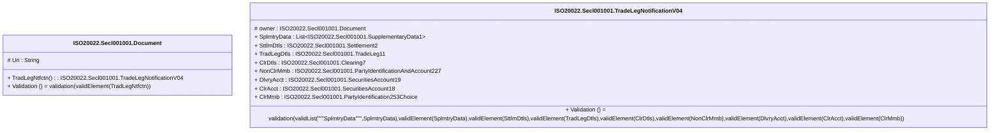

# secl.001.001.04-physical

> The tables below contain descriptions of the members of each Element. 
> The first column indicates the type of the member:
> A ‘#’ indicates that the field is a key to the element, and a ‘+’ indicates that the field is a value.
> The ‘*’ column contains a description for the element member.  
> The ‘@’ column contains any properties for the member.
> The ‘=’ column contains calculated values; or in the case of an enum, the serialized value.

---

## EntityImpl ISO20022.Secl001001.Document

| |Name|Type|*|@|=|
|-|-|-|-|-|-|
|#|Uri|String||XmlIgnore(), JsonIgnore()||
|+|TradLegNtfctn|ISO20022.Secl001001.TradeLegNotificationV04||XmlElement()||
||Validation|Some(String)||XmlIgnore(), JsonIgnore()|validation(validElement(TradLegNtfctn))|

---

## AspectImpl ISO20022.Secl001001.TradeLegNotificationV04

| |Name|Type|*|@|=|
|-|-|-|-|-|-|
|#|owner|ISO20022.Secl001001.Document||||
|+|SplmtryData|List<ISO20022.Secl001001.SupplementaryData1>||XmlElement()||
|+|SttlmDtls|ISO20022.Secl001001.Settlement2||XmlElement()||
|+|TradLegDtls|ISO20022.Secl001001.TradeLeg11||XmlElement()||
|+|ClrDtls|ISO20022.Secl001001.Clearing7||XmlElement()||
|+|NonClrMmb|ISO20022.Secl001001.PartyIdentificationAndAccount227||XmlElement()||
|+|DlvryAcct|ISO20022.Secl001001.SecuritiesAccount19||XmlElement()||
|+|ClrAcct|ISO20022.Secl001001.SecuritiesAccount18||XmlElement()||
|+|ClrMmb|ISO20022.Secl001001.PartyIdentification253Choice||XmlElement()||
||Validation|Some(String)||XmlIgnore(), JsonIgnore()|validation(validList("""SplmtryData""",SplmtryData),validElement(SplmtryData),validElement(SttlmDtls),validElement(TradLegDtls),validElement(ClrDtls),validElement(NonClrMmb),validElement(DlvryAcct),validElement(ClrAcct),validElement(ClrMmb))|

