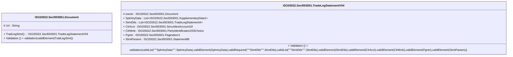

# secl.003.001.04-physical

> The tables below contain descriptions of the members of each Element. 
> The first column indicates the type of the member:
> A ‘#’ indicates that the field is a key to the element, and a ‘+’ indicates that the field is a value.
> The ‘*’ column contains a description for the element member.  
> The ‘@’ column contains any properties for the member.
> The ‘=’ column contains calculated values; or in the case of an enum, the serialized value.

---

## EntityImpl ISO20022.Secl003001.Document

| |Name|Type|*|@|=|
|-|-|-|-|-|-|
|#|Uri|String||XmlIgnore(), JsonIgnore()||
|+|TradLegStmt|ISO20022.Secl003001.TradeLegStatementV04||XmlElement()||
||Validation|Some(String)||XmlIgnore(), JsonIgnore()|validation(validElement(TradLegStmt))|

---

## AspectImpl ISO20022.Secl003001.TradeLegStatementV04

| |Name|Type|*|@|=|
|-|-|-|-|-|-|
|#|owner|ISO20022.Secl003001.Document||||
|+|SplmtryData|List<ISO20022.Secl003001.SupplementaryData1>||XmlElement()||
|+|StmtDtls|List<ISO20022.Secl003001.TradeLegStatement4>||XmlElement()||
|+|ClrAcct|ISO20022.Secl003001.SecuritiesAccount18||XmlElement()||
|+|ClrMmb|ISO20022.Secl003001.PartyIdentification253Choice||XmlElement()||
|+|Pgntn|ISO20022.Secl003001.Pagination1||XmlElement()||
|+|StmtParams|ISO20022.Secl003001.Statement86||XmlElement()||
||Validation|Some(String)||XmlIgnore(), JsonIgnore()|validation(validList("""SplmtryData""",SplmtryData),validElement(SplmtryData),validRequired("""StmtDtls""",StmtDtls),validList("""StmtDtls""",StmtDtls),validElement(StmtDtls),validElement(ClrAcct),validElement(ClrMmb),validElement(Pgntn),validElement(StmtParams))|

