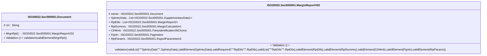

# secl.005.001.02-physical

> The tables below contain descriptions of the members of each Element. 
> The first column indicates the type of the member:
> A ‘#’ indicates that the field is a key to the element, and a ‘+’ indicates that the field is a value.
> The ‘*’ column contains a description for the element member.  
> The ‘@’ column contains any properties for the member.
> The ‘=’ column contains calculated values; or in the case of an enum, the serialized value.

---

## EntityImpl ISO20022.Secl005001.Document

| |Name|Type|*|@|=|
|-|-|-|-|-|-|
|#|Uri|String||XmlIgnore(), JsonIgnore()||
|+|MrgnRpt|ISO20022.Secl005001.MarginReportV02||XmlElement()||
||Validation|Some(String)||XmlIgnore(), JsonIgnore()|validation(validElement(MrgnRpt))|

---

## AspectImpl ISO20022.Secl005001.MarginReportV02

| |Name|Type|*|@|=|
|-|-|-|-|-|-|
|#|owner|ISO20022.Secl005001.Document||||
|+|SplmtryData|List<ISO20022.Secl005001.SupplementaryData1>||XmlElement()||
|+|RptDtls|List<ISO20022.Secl005001.MarginReport2>||XmlElement()||
|+|RptSummry|ISO20022.Secl005001.MarginCalculation1||XmlElement()||
|+|ClrMmb|ISO20022.Secl005001.PartyIdentification35Choice||XmlElement()||
|+|Pgntn|ISO20022.Secl005001.Pagination||XmlElement()||
|+|RptParams|ISO20022.Secl005001.ReportParameters3||XmlElement()||
||Validation|Some(String)||XmlIgnore(), JsonIgnore()|validation(validList("""SplmtryData""",SplmtryData),validElement(SplmtryData),validRequired("""RptDtls""",RptDtls),validList("""RptDtls""",RptDtls),validElement(RptDtls),validElement(RptSummry),validElement(ClrMmb),validElement(Pgntn),validElement(RptParams))|

