# secl.005.001.02

```mermaid
classDiagram
    class Hiperspace.Edge {
        # From  : Hiperspace.Node
        # To  : Hiperspace.Node
        # TypeName  : String
        + Name  : String
    }
    class ISO20022.Secl005001.ActiveCurrencyAndAmount {
        + Value  : Decimal
        + Ccy  : String
    }
    class ISO20022.Secl005001.ActiveOrHistoricCurrencyAndAmount {
        + Value  : Decimal
        + Ccy  : String
    }
    class ISO20022.Secl005001.AlternatePartyIdentification4 {
        + AltrnId  : String
        + Ctry  : String
        + IdTp  : ISO20022.Secl005001.IdentificationType6Choice
    }
    ISO20022.Secl005001.AlternatePartyIdentification4 *-- ISO20022.Secl005001.IdentificationType6Choice
    class ISO20022.Secl005001.Amount2 {
        + RptgAmt  : Decimal
        + OrgnlCcyAmt  : ISO20022.Secl005001.ActiveCurrencyAndAmount
    }
    ISO20022.Secl005001.Amount2 *-- ISO20022.Secl005001.ActiveCurrencyAndAmount
    class ISO20022.Secl005001.AmountAndDirection20 {
        + CdtDbtInd  : String
        + Amt  : ISO20022.Secl005001.ActiveOrHistoricCurrencyAndAmount
    }
    ISO20022.Secl005001.AmountAndDirection20 *-- ISO20022.Secl005001.ActiveOrHistoricCurrencyAndAmount
    class ISO20022.Secl005001.ClearingAccountType1Code {
        LIPR = 1
        CLIE = 2
        HOUS = 3
    }
    class ISO20022.Secl005001.Collateral6 {
        + CollTp  : String
        + MktVal  : ISO20022.Secl005001.ActiveCurrencyAndAmount
        + PstHrcutVal  : ISO20022.Secl005001.ActiveCurrencyAndAmount
    }
    ISO20022.Secl005001.Collateral6 *-- ISO20022.Secl005001.ActiveCurrencyAndAmount
    ISO20022.Secl005001.Collateral6 *-- ISO20022.Secl005001.ActiveCurrencyAndAmount
    class ISO20022.Secl005001.CollateralType1Code {
        OTHR = 1
        LCRE = 2
        SECU = 3
        CASH = 4
    }
    class ISO20022.Secl005001.CreditDebitCode {
        DBIT = 1
        CRDT = 2
    }
    class ISO20022.Secl005001.DateAndDateTimeChoice {
        + DtTm  : DateTime
        + Dt  : DateTime
    }
    class ISO20022.Secl005001.EventFrequency6Code {
        ONDE = 1
        INDA = 2
        DAIL = 3
    }
    class ISO20022.Secl005001.GenericIdentification29 {
        + SchmeNm  : String
        + Issr  : String
        + Id  : String
    }
    class ISO20022.Secl005001.GenericIdentification30 {
        + SchmeNm  : String
        + Issr  : String
        + Id  : String
    }
    class ISO20022.Secl005001.IdentificationSource3Choice {
        + Prtry  : String
        + Cd  : String
    }
    class ISO20022.Secl005001.IdentificationType6Choice {
        + Prtry  : ISO20022.Secl005001.GenericIdentification30
        + Cd  : String
    }
    ISO20022.Secl005001.IdentificationType6Choice *-- ISO20022.Secl005001.GenericIdentification30
    class ISO20022.Secl005001.Margin3 {
        + OthrMrgn  : global::System.Collections.Generic.List~ISO20022.Secl005001.Margin4~
        + VartnMrgn  : global::System.Collections.Generic.List~ISO20022.Secl005001.VariationMargin3~
        + InitlMrgn  : ISO20022.Secl005001.Amount2
    }
    ISO20022.Secl005001.Margin3 *-- ISO20022.Secl005001.Margin4
    ISO20022.Secl005001.Margin3 *-- ISO20022.Secl005001.VariationMargin3
    ISO20022.Secl005001.Margin3 *-- ISO20022.Secl005001.Amount2
    class ISO20022.Secl005001.Margin4 {
        + CdtDbtInd  : String
        + Amt  : ISO20022.Secl005001.Amount2
        + Tp  : ISO20022.Secl005001.MarginType1Choice
    }
    ISO20022.Secl005001.Margin4 *-- ISO20022.Secl005001.Amount2
    ISO20022.Secl005001.Margin4 *-- ISO20022.Secl005001.MarginType1Choice
    class ISO20022.Secl005001.MarginCalculation1 {
        + MrgnRslt  : ISO20022.Secl005001.MarginResult1Choice
        + MinRqrmntDpst  : ISO20022.Secl005001.ActiveCurrencyAndAmount
        + CollOnDpst  : global::System.Collections.Generic.List~ISO20022.Secl005001.Collateral6~
        + TtlMrgnAmt  : ISO20022.Secl005001.AmountAndDirection20
    }
    ISO20022.Secl005001.MarginCalculation1 *-- ISO20022.Secl005001.MarginResult1Choice
    ISO20022.Secl005001.MarginCalculation1 *-- ISO20022.Secl005001.ActiveCurrencyAndAmount
    ISO20022.Secl005001.MarginCalculation1 *-- ISO20022.Secl005001.Collateral6
    ISO20022.Secl005001.MarginCalculation1 *-- ISO20022.Secl005001.AmountAndDirection20
    class ISO20022.Secl005001.MarginCalculation2 {
        + MrgnTpAmt  : ISO20022.Secl005001.Margin3
        + MrgnRslt  : ISO20022.Secl005001.MarginResult1Choice
        + MinRqrmntDpst  : ISO20022.Secl005001.ActiveCurrencyAndAmount
        + CollOnDpst  : global::System.Collections.Generic.List~ISO20022.Secl005001.Collateral6~
        + TtlMrgnAmt  : ISO20022.Secl005001.AmountAndDirection20
        + XpsrAmt  : ISO20022.Secl005001.Amount2
        + FinInstrmId  : ISO20022.Secl005001.SecurityIdentification14
    }
    ISO20022.Secl005001.MarginCalculation2 *-- ISO20022.Secl005001.Margin3
    ISO20022.Secl005001.MarginCalculation2 *-- ISO20022.Secl005001.MarginResult1Choice
    ISO20022.Secl005001.MarginCalculation2 *-- ISO20022.Secl005001.ActiveCurrencyAndAmount
    ISO20022.Secl005001.MarginCalculation2 *-- ISO20022.Secl005001.Collateral6
    ISO20022.Secl005001.MarginCalculation2 *-- ISO20022.Secl005001.AmountAndDirection20
    ISO20022.Secl005001.MarginCalculation2 *-- ISO20022.Secl005001.Amount2
    ISO20022.Secl005001.MarginCalculation2 *-- ISO20022.Secl005001.SecurityIdentification14
    class ISO20022.Secl005001.MarginProduct1Code {
        FIXI = 1
        EQUI = 2
    }
    class ISO20022.Secl005001.MarginProductType1Choice {
        + Prtry  : ISO20022.Secl005001.GenericIdentification30
        + Cd  : String
    }
    ISO20022.Secl005001.MarginProductType1Choice *-- ISO20022.Secl005001.GenericIdentification30
    class ISO20022.Secl005001.MarginReport2 {
        + MrgnClctn  : global::System.Collections.Generic.List~ISO20022.Secl005001.MarginCalculation2~
        + MrgnClctnSummry  : ISO20022.Secl005001.MarginCalculation1
        + NonClrMmb  : global::System.Collections.Generic.List~ISO20022.Secl005001.PartyIdentificationAndAccount31~
        + CollsdMrgnAcctInd  : String
        + MrgnAcct  : ISO20022.Secl005001.SecuritiesAccount18
        + MrgnPdct  : global::System.Collections.Generic.List~ISO20022.Secl005001.MarginProductType1Choice~
    }
    ISO20022.Secl005001.MarginReport2 *-- ISO20022.Secl005001.MarginCalculation2
    ISO20022.Secl005001.MarginReport2 *-- ISO20022.Secl005001.MarginCalculation1
    ISO20022.Secl005001.MarginReport2 *-- ISO20022.Secl005001.PartyIdentificationAndAccount31
    ISO20022.Secl005001.MarginReport2 *-- ISO20022.Secl005001.SecuritiesAccount18
    ISO20022.Secl005001.MarginReport2 *-- ISO20022.Secl005001.MarginProductType1Choice
    class ISO20022.Secl005001.MarginReportV02 {
        + SplmtryData  : global::System.Collections.Generic.List~ISO20022.Secl005001.SupplementaryData1~
        + RptDtls  : global::System.Collections.Generic.List~ISO20022.Secl005001.MarginReport2~
        + RptSummry  : ISO20022.Secl005001.MarginCalculation1
        + ClrMmb  : ISO20022.Secl005001.PartyIdentification35Choice
        + Pgntn  : ISO20022.Secl005001.Pagination
        + RptParams  : ISO20022.Secl005001.ReportParameters3
    }
    ISO20022.Secl005001.MarginReportV02 *-- ISO20022.Secl005001.SupplementaryData1
    ISO20022.Secl005001.MarginReportV02 *-- ISO20022.Secl005001.MarginReport2
    ISO20022.Secl005001.MarginReportV02 *-- ISO20022.Secl005001.MarginCalculation1
    ISO20022.Secl005001.MarginReportV02 *-- ISO20022.Secl005001.PartyIdentification35Choice
    ISO20022.Secl005001.MarginReportV02 *-- ISO20022.Secl005001.Pagination
    ISO20022.Secl005001.MarginReportV02 *-- ISO20022.Secl005001.ReportParameters3
    class ISO20022.Secl005001.MarginResult1Choice {
        + DfcitAmt  : ISO20022.Secl005001.ActiveCurrencyAndAmount
        + XcssAmt  : ISO20022.Secl005001.ActiveCurrencyAndAmount
    }
    ISO20022.Secl005001.MarginResult1Choice *-- ISO20022.Secl005001.ActiveCurrencyAndAmount
    ISO20022.Secl005001.MarginResult1Choice *-- ISO20022.Secl005001.ActiveCurrencyAndAmount
    class ISO20022.Secl005001.MarginType1Choice {
        + Prtry  : ISO20022.Secl005001.GenericIdentification30
        + Cd  : String
    }
    ISO20022.Secl005001.MarginType1Choice *-- ISO20022.Secl005001.GenericIdentification30
    class ISO20022.Secl005001.MarginType1Code {
        INCA = 1
        VAMA = 2
        INMA = 3
        NEMA = 4
        INDE = 5
        CEMA = 6
        UFMA = 7
        COMA = 8
        SCMA = 9
        ADFM = 10
        SEMA = 11
    }
    class ISO20022.Secl005001.NameAndAddress6 {
        + Adr  : ISO20022.Secl005001.PostalAddress2
        + Nm  : String
    }
    ISO20022.Secl005001.NameAndAddress6 *-- ISO20022.Secl005001.PostalAddress2
    class ISO20022.Secl005001.OtherIdentification1 {
        + Tp  : ISO20022.Secl005001.IdentificationSource3Choice
        + Sfx  : String
        + Id  : String
    }
    ISO20022.Secl005001.OtherIdentification1 *-- ISO20022.Secl005001.IdentificationSource3Choice
    class ISO20022.Secl005001.Pagination {
        + LastPgInd  : String
        + PgNb  : String
    }
    class ISO20022.Secl005001.PartyIdentification33Choice {
        + NmAndAdr  : ISO20022.Secl005001.NameAndAddress6
        + PrtryId  : ISO20022.Secl005001.GenericIdentification29
        + AnyBIC  : String
    }
    ISO20022.Secl005001.PartyIdentification33Choice *-- ISO20022.Secl005001.NameAndAddress6
    ISO20022.Secl005001.PartyIdentification33Choice *-- ISO20022.Secl005001.GenericIdentification29
    class ISO20022.Secl005001.PartyIdentification35Choice {
        + PrtryId  : ISO20022.Secl005001.GenericIdentification29
        + BIC  : String
    }
    ISO20022.Secl005001.PartyIdentification35Choice *-- ISO20022.Secl005001.GenericIdentification29
    class ISO20022.Secl005001.PartyIdentificationAndAccount31 {
        + ClrAcct  : ISO20022.Secl005001.SecuritiesAccount18
        + AddtlInf  : ISO20022.Secl005001.PartyTextInformation1
        + AltrnId  : ISO20022.Secl005001.AlternatePartyIdentification4
        + Id  : ISO20022.Secl005001.PartyIdentification33Choice
    }
    ISO20022.Secl005001.PartyIdentificationAndAccount31 *-- ISO20022.Secl005001.SecuritiesAccount18
    ISO20022.Secl005001.PartyIdentificationAndAccount31 *-- ISO20022.Secl005001.PartyTextInformation1
    ISO20022.Secl005001.PartyIdentificationAndAccount31 *-- ISO20022.Secl005001.AlternatePartyIdentification4
    ISO20022.Secl005001.PartyIdentificationAndAccount31 *-- ISO20022.Secl005001.PartyIdentification33Choice
    class ISO20022.Secl005001.PartyTextInformation1 {
        + RegnDtls  : String
        + PtyCtctDtls  : String
        + DclrtnDtls  : String
    }
    class ISO20022.Secl005001.PostalAddress2 {
        + Ctry  : String
        + CtrySubDvsn  : String
        + TwnNm  : String
        + PstCdId  : String
        + StrtNm  : String
    }
    class ISO20022.Secl005001.ReportParameters3 {
        + RptNb  : String
        + Frqcy  : String
        + ClctnDtAndTm  : DateTime
        + RptCcy  : String
        + RptDtAndTm  : ISO20022.Secl005001.DateAndDateTimeChoice
        + RptId  : String
    }
    ISO20022.Secl005001.ReportParameters3 *-- ISO20022.Secl005001.DateAndDateTimeChoice
    class ISO20022.Secl005001.SecuritiesAccount18 {
        + Nm  : String
        + Tp  : String
        + Id  : String
    }
    class ISO20022.Secl005001.SecurityIdentification14 {
        + Desc  : String
        + OthrId  : global::System.Collections.Generic.List~ISO20022.Secl005001.OtherIdentification1~
        + ISIN  : String
    }
    ISO20022.Secl005001.SecurityIdentification14 *-- ISO20022.Secl005001.OtherIdentification1
    class ISO20022.Secl005001.ShortLong1Code {
        LONG = 1
        SHOR = 2
    }
    class ISO20022.Secl005001.SupplementaryData1 {
        + Envlp  : ISO20022.Secl005001.SupplementaryDataEnvelope1
        + PlcAndNm  : String
    }
    ISO20022.Secl005001.SupplementaryData1 *-- ISO20022.Secl005001.SupplementaryDataEnvelope1
    class ISO20022.Secl005001.SupplementaryDataEnvelope1 {
    }
    class ISO20022.Secl005001.TotalVariationMargin1 {
        + AmtDtls  : ISO20022.Secl005001.Amount2
        + ShrtLngInd  : String
    }
    ISO20022.Secl005001.TotalVariationMargin1 *-- ISO20022.Secl005001.Amount2
    class ISO20022.Secl005001.TypeOfIdentification1Code {
        TXID = 1
        FIIN = 2
        DRLC = 3
        CORP = 4
        CHTY = 5
        CCPT = 6
        ARNU = 7
    }
    class ISO20022.Secl005001.VariationMargin3 {
        + FlsHrcut  : ISO20022.Secl005001.Amount2
        + MrkToMktFls  : global::System.Collections.Generic.List~ISO20022.Secl005001.Amount2~
        + MrkToMktGrss  : global::System.Collections.Generic.List~ISO20022.Secl005001.Amount2~
        + MrkToMktNetd  : global::System.Collections.Generic.List~ISO20022.Secl005001.Amount2~
        + TtlMrkToMkt  : ISO20022.Secl005001.Amount2
        + TtlVartnMrgn  : global::System.Collections.Generic.List~ISO20022.Secl005001.TotalVariationMargin1~
        + FinInstrmId  : ISO20022.Secl005001.SecurityIdentification14
    }
    ISO20022.Secl005001.VariationMargin3 *-- ISO20022.Secl005001.Amount2
    ISO20022.Secl005001.VariationMargin3 *-- ISO20022.Secl005001.Amount2
    ISO20022.Secl005001.VariationMargin3 *-- ISO20022.Secl005001.Amount2
    ISO20022.Secl005001.VariationMargin3 *-- ISO20022.Secl005001.Amount2
    ISO20022.Secl005001.VariationMargin3 *-- ISO20022.Secl005001.Amount2
    ISO20022.Secl005001.VariationMargin3 *-- ISO20022.Secl005001.TotalVariationMargin1
    ISO20022.Secl005001.VariationMargin3 *-- ISO20022.Secl005001.SecurityIdentification14
    class Hiperspace.Node {
        # SKey  : String
        + TypeName  : String
        + Name  : String
        + Froms (From = this) : Hiperspace.Edge
        + Tos (To = this) : Hiperspace.Edge
    }
```

> The tables below contain descriptions of the members of each Element. 
> The first column indicates the type of the member:
> A ‘#’ indicates that the field is a key to the element, and a ‘+’ indicates that the field is a value.
> The ‘*’ column contains a description for the element member.  
> The ‘@’ column contains any properties for the member.
> The ‘=’ column contains calculated values; or in the case of an enum, the serialized value.

---

## View Hiperspace.Edge
edge between nodes

| |Name|Type|*|@|=|
|-|-|-|-|-|-|
|#|From|Hiperspace.Node||||
|#|To|Hiperspace.Node||||
|#|TypeName|String||||
|+|Name|String||||

---

## Value ISO20022.Secl005001.ActiveCurrencyAndAmount

| |Name|Type|*|@|=|
|-|-|-|-|-|-|
|+|Value|Decimal||XmlElement()||
|+|Ccy|String||XmlAttribute()||
||Validation|Some(String)||XmlIgnore(), JsonIgnore()|validation(validRequired("""Value""",Value),validRequired("""Ccy""",Ccy),validPattern("""Ccy""",Ccy,"""[A-Z]{3,3}"""))|

---

## Value ISO20022.Secl005001.ActiveOrHistoricCurrencyAndAmount

| |Name|Type|*|@|=|
|-|-|-|-|-|-|
|+|Value|Decimal||XmlElement()||
|+|Ccy|String||XmlAttribute()||
||Validation|Some(String)||XmlIgnore(), JsonIgnore()|validation(validRequired("""Value""",Value),validRequired("""Ccy""",Ccy),validPattern("""Ccy""",Ccy,"""[A-Z]{3,3}"""))|

---

## Value ISO20022.Secl005001.AlternatePartyIdentification4

| |Name|Type|*|@|=|
|-|-|-|-|-|-|
|+|AltrnId|String||XmlElement()||
|+|Ctry|String||XmlElement()||
|+|IdTp|ISO20022.Secl005001.IdentificationType6Choice||XmlElement()||
||Validation|Some(String)||XmlIgnore(), JsonIgnore()|validation(validPattern("""Ctry""",Ctry,"""[A-Z]{2,2}"""),validElement(IdTp))|

---

## Value ISO20022.Secl005001.Amount2

| |Name|Type|*|@|=|
|-|-|-|-|-|-|
|+|RptgAmt|Decimal||XmlElement()||
|+|OrgnlCcyAmt|ISO20022.Secl005001.ActiveCurrencyAndAmount||XmlElement()||
||Validation|Some(String)||XmlIgnore(), JsonIgnore()|validation(validElement(OrgnlCcyAmt))|

---

## Value ISO20022.Secl005001.AmountAndDirection20

| |Name|Type|*|@|=|
|-|-|-|-|-|-|
|+|CdtDbtInd|String||XmlElement()||
|+|Amt|ISO20022.Secl005001.ActiveOrHistoricCurrencyAndAmount||XmlElement()||
||Validation|Some(String)||XmlIgnore(), JsonIgnore()|validation(validElement(Amt))|

---

## Enum ISO20022.Secl005001.ClearingAccountType1Code

| |Name|Type|*|@|=|
|-|-|-|-|-|-|
||LIPR|Int32||XmlEnum("""LIPR""")|1|
||CLIE|Int32||XmlEnum("""CLIE""")|2|
||HOUS|Int32||XmlEnum("""HOUS""")|3|

---

## Value ISO20022.Secl005001.Collateral6

| |Name|Type|*|@|=|
|-|-|-|-|-|-|
|+|CollTp|String||XmlElement()||
|+|MktVal|ISO20022.Secl005001.ActiveCurrencyAndAmount||XmlElement()||
|+|PstHrcutVal|ISO20022.Secl005001.ActiveCurrencyAndAmount||XmlElement()||
||Validation|Some(String)||XmlIgnore(), JsonIgnore()|validation(validElement(MktVal),validElement(PstHrcutVal))|

---

## Enum ISO20022.Secl005001.CollateralType1Code

| |Name|Type|*|@|=|
|-|-|-|-|-|-|
||OTHR|Int32||XmlEnum("""OTHR""")|1|
||LCRE|Int32||XmlEnum("""LCRE""")|2|
||SECU|Int32||XmlEnum("""SECU""")|3|
||CASH|Int32||XmlEnum("""CASH""")|4|

---

## Enum ISO20022.Secl005001.CreditDebitCode

| |Name|Type|*|@|=|
|-|-|-|-|-|-|
||DBIT|Int32||XmlEnum("""DBIT""")|1|
||CRDT|Int32||XmlEnum("""CRDT""")|2|

---

## Value ISO20022.Secl005001.DateAndDateTimeChoice

| |Name|Type|*|@|=|
|-|-|-|-|-|-|
|+|DtTm|DateTime||XmlElement()||
|+|Dt|DateTime||XmlElement()||
||Validation|Some(String)||XmlIgnore(), JsonIgnore()|validation(validChoice(DtTm,Dt))|

---

## Type ISO20022.Secl005001.Document

| |Name|Type|*|@|=|
|-|-|-|-|-|-|
|+|MrgnRpt|ISO20022.Secl005001.MarginReportV02||XmlElement()||
||Validation|Some(String)||XmlIgnore(), JsonIgnore()|validation(validElement(MrgnRpt))|

---

## Enum ISO20022.Secl005001.EventFrequency6Code

| |Name|Type|*|@|=|
|-|-|-|-|-|-|
||ONDE|Int32||XmlEnum("""ONDE""")|1|
||INDA|Int32||XmlEnum("""INDA""")|2|
||DAIL|Int32||XmlEnum("""DAIL""")|3|

---

## Value ISO20022.Secl005001.GenericIdentification29

| |Name|Type|*|@|=|
|-|-|-|-|-|-|
|+|SchmeNm|String||XmlElement()||
|+|Issr|String||XmlElement()||
|+|Id|String||XmlElement()||
||Validation|Some(String)||XmlIgnore(), JsonIgnore()|""|

---

## Value ISO20022.Secl005001.GenericIdentification30

| |Name|Type|*|@|=|
|-|-|-|-|-|-|
|+|SchmeNm|String||XmlElement()||
|+|Issr|String||XmlElement()||
|+|Id|String||XmlElement()||
||Validation|Some(String)||XmlIgnore(), JsonIgnore()|validation(validPattern("""Id""",Id,"""[a-zA-Z0-9]{4}"""))|

---

## Value ISO20022.Secl005001.IdentificationSource3Choice

| |Name|Type|*|@|=|
|-|-|-|-|-|-|
|+|Prtry|String||XmlElement()||
|+|Cd|String||XmlElement()||
||Validation|Some(String)||XmlIgnore(), JsonIgnore()|validation(validChoice(Prtry,Cd))|

---

## Value ISO20022.Secl005001.IdentificationType6Choice

| |Name|Type|*|@|=|
|-|-|-|-|-|-|
|+|Prtry|ISO20022.Secl005001.GenericIdentification30||XmlElement()||
|+|Cd|String||XmlElement()||
||Validation|Some(String)||XmlIgnore(), JsonIgnore()|validation(validElement(Prtry),validChoice(Prtry,Cd))|

---

## Value ISO20022.Secl005001.Margin3

| |Name|Type|*|@|=|
|-|-|-|-|-|-|
|+|OthrMrgn|global::System.Collections.Generic.List<ISO20022.Secl005001.Margin4>||XmlElement()||
|+|VartnMrgn|global::System.Collections.Generic.List<ISO20022.Secl005001.VariationMargin3>||XmlElement()||
|+|InitlMrgn|ISO20022.Secl005001.Amount2||XmlElement()||
||Validation|Some(String)||XmlIgnore(), JsonIgnore()|validation(validList("""OthrMrgn""",OthrMrgn),validElement(OthrMrgn),validList("""VartnMrgn""",VartnMrgn),validElement(VartnMrgn),validElement(InitlMrgn))|

---

## Value ISO20022.Secl005001.Margin4

| |Name|Type|*|@|=|
|-|-|-|-|-|-|
|+|CdtDbtInd|String||XmlElement()||
|+|Amt|ISO20022.Secl005001.Amount2||XmlElement()||
|+|Tp|ISO20022.Secl005001.MarginType1Choice||XmlElement()||
||Validation|Some(String)||XmlIgnore(), JsonIgnore()|validation(validElement(Amt),validElement(Tp))|

---

## Value ISO20022.Secl005001.MarginCalculation1

| |Name|Type|*|@|=|
|-|-|-|-|-|-|
|+|MrgnRslt|ISO20022.Secl005001.MarginResult1Choice||XmlElement()||
|+|MinRqrmntDpst|ISO20022.Secl005001.ActiveCurrencyAndAmount||XmlElement()||
|+|CollOnDpst|global::System.Collections.Generic.List<ISO20022.Secl005001.Collateral6>||XmlElement()||
|+|TtlMrgnAmt|ISO20022.Secl005001.AmountAndDirection20||XmlElement()||
||Validation|Some(String)||XmlIgnore(), JsonIgnore()|validation(validElement(MrgnRslt),validElement(MinRqrmntDpst),validList("""CollOnDpst""",CollOnDpst),validElement(CollOnDpst),validElement(TtlMrgnAmt))|

---

## Value ISO20022.Secl005001.MarginCalculation2

| |Name|Type|*|@|=|
|-|-|-|-|-|-|
|+|MrgnTpAmt|ISO20022.Secl005001.Margin3||XmlElement()||
|+|MrgnRslt|ISO20022.Secl005001.MarginResult1Choice||XmlElement()||
|+|MinRqrmntDpst|ISO20022.Secl005001.ActiveCurrencyAndAmount||XmlElement()||
|+|CollOnDpst|global::System.Collections.Generic.List<ISO20022.Secl005001.Collateral6>||XmlElement()||
|+|TtlMrgnAmt|ISO20022.Secl005001.AmountAndDirection20||XmlElement()||
|+|XpsrAmt|ISO20022.Secl005001.Amount2||XmlElement()||
|+|FinInstrmId|ISO20022.Secl005001.SecurityIdentification14||XmlElement()||
||Validation|Some(String)||XmlIgnore(), JsonIgnore()|validation(validElement(MrgnTpAmt),validElement(MrgnRslt),validElement(MinRqrmntDpst),validList("""CollOnDpst""",CollOnDpst),validElement(CollOnDpst),validElement(TtlMrgnAmt),validElement(XpsrAmt),validElement(FinInstrmId))|

---

## Enum ISO20022.Secl005001.MarginProduct1Code

| |Name|Type|*|@|=|
|-|-|-|-|-|-|
||FIXI|Int32||XmlEnum("""FIXI""")|1|
||EQUI|Int32||XmlEnum("""EQUI""")|2|

---

## Value ISO20022.Secl005001.MarginProductType1Choice

| |Name|Type|*|@|=|
|-|-|-|-|-|-|
|+|Prtry|ISO20022.Secl005001.GenericIdentification30||XmlElement()||
|+|Cd|String||XmlElement()||
||Validation|Some(String)||XmlIgnore(), JsonIgnore()|validation(validElement(Prtry),validChoice(Prtry,Cd))|

---

## Value ISO20022.Secl005001.MarginReport2

| |Name|Type|*|@|=|
|-|-|-|-|-|-|
|+|MrgnClctn|global::System.Collections.Generic.List<ISO20022.Secl005001.MarginCalculation2>||XmlElement()||
|+|MrgnClctnSummry|ISO20022.Secl005001.MarginCalculation1||XmlElement()||
|+|NonClrMmb|global::System.Collections.Generic.List<ISO20022.Secl005001.PartyIdentificationAndAccount31>||XmlElement()||
|+|CollsdMrgnAcctInd|String||XmlElement()||
|+|MrgnAcct|ISO20022.Secl005001.SecuritiesAccount18||XmlElement()||
|+|MrgnPdct|global::System.Collections.Generic.List<ISO20022.Secl005001.MarginProductType1Choice>||XmlElement()||
||Validation|Some(String)||XmlIgnore(), JsonIgnore()|validation(validRequired("""MrgnClctn""",MrgnClctn),validList("""MrgnClctn""",MrgnClctn),validElement(MrgnClctn),validElement(MrgnClctnSummry),validList("""NonClrMmb""",NonClrMmb),validElement(NonClrMmb),validElement(MrgnAcct),validList("""MrgnPdct""",MrgnPdct),validElement(MrgnPdct))|

---

## Aspect ISO20022.Secl005001.MarginReportV02

| |Name|Type|*|@|=|
|-|-|-|-|-|-|
|+|SplmtryData|global::System.Collections.Generic.List<ISO20022.Secl005001.SupplementaryData1>||XmlElement()||
|+|RptDtls|global::System.Collections.Generic.List<ISO20022.Secl005001.MarginReport2>||XmlElement()||
|+|RptSummry|ISO20022.Secl005001.MarginCalculation1||XmlElement()||
|+|ClrMmb|ISO20022.Secl005001.PartyIdentification35Choice||XmlElement()||
|+|Pgntn|ISO20022.Secl005001.Pagination||XmlElement()||
|+|RptParams|ISO20022.Secl005001.ReportParameters3||XmlElement()||
||Validation|Some(String)||XmlIgnore(), JsonIgnore()|validation(validList("""SplmtryData""",SplmtryData),validElement(SplmtryData),validRequired("""RptDtls""",RptDtls),validList("""RptDtls""",RptDtls),validElement(RptDtls),validElement(RptSummry),validElement(ClrMmb),validElement(Pgntn),validElement(RptParams))|

---

## Value ISO20022.Secl005001.MarginResult1Choice

| |Name|Type|*|@|=|
|-|-|-|-|-|-|
|+|DfcitAmt|ISO20022.Secl005001.ActiveCurrencyAndAmount||XmlElement()||
|+|XcssAmt|ISO20022.Secl005001.ActiveCurrencyAndAmount||XmlElement()||
||Validation|Some(String)||XmlIgnore(), JsonIgnore()|validation(validElement(DfcitAmt),validElement(XcssAmt),validChoice(DfcitAmt,XcssAmt))|

---

## Value ISO20022.Secl005001.MarginType1Choice

| |Name|Type|*|@|=|
|-|-|-|-|-|-|
|+|Prtry|ISO20022.Secl005001.GenericIdentification30||XmlElement()||
|+|Cd|String||XmlElement()||
||Validation|Some(String)||XmlIgnore(), JsonIgnore()|validation(validElement(Prtry),validChoice(Prtry,Cd))|

---

## Enum ISO20022.Secl005001.MarginType1Code

| |Name|Type|*|@|=|
|-|-|-|-|-|-|
||INCA|Int32||XmlEnum("""INCA""")|1|
||VAMA|Int32||XmlEnum("""VAMA""")|2|
||INMA|Int32||XmlEnum("""INMA""")|3|
||NEMA|Int32||XmlEnum("""NEMA""")|4|
||INDE|Int32||XmlEnum("""INDE""")|5|
||CEMA|Int32||XmlEnum("""CEMA""")|6|
||UFMA|Int32||XmlEnum("""UFMA""")|7|
||COMA|Int32||XmlEnum("""COMA""")|8|
||SCMA|Int32||XmlEnum("""SCMA""")|9|
||ADFM|Int32||XmlEnum("""ADFM""")|10|
||SEMA|Int32||XmlEnum("""SEMA""")|11|

---

## Value ISO20022.Secl005001.NameAndAddress6

| |Name|Type|*|@|=|
|-|-|-|-|-|-|
|+|Adr|ISO20022.Secl005001.PostalAddress2||XmlElement()||
|+|Nm|String||XmlElement()||
||Validation|Some(String)||XmlIgnore(), JsonIgnore()|validation(validElement(Adr))|

---

## Value ISO20022.Secl005001.OtherIdentification1

| |Name|Type|*|@|=|
|-|-|-|-|-|-|
|+|Tp|ISO20022.Secl005001.IdentificationSource3Choice||XmlElement()||
|+|Sfx|String||XmlElement()||
|+|Id|String||XmlElement()||
||Validation|Some(String)||XmlIgnore(), JsonIgnore()|validation(validElement(Tp))|

---

## Value ISO20022.Secl005001.Pagination

| |Name|Type|*|@|=|
|-|-|-|-|-|-|
|+|LastPgInd|String||XmlElement()||
|+|PgNb|String||XmlElement()||
||Validation|Some(String)||XmlIgnore(), JsonIgnore()|validation(validPattern("""PgNb""",PgNb,"""[0-9]{1,5}"""))|

---

## Value ISO20022.Secl005001.PartyIdentification33Choice

| |Name|Type|*|@|=|
|-|-|-|-|-|-|
|+|NmAndAdr|ISO20022.Secl005001.NameAndAddress6||XmlElement()||
|+|PrtryId|ISO20022.Secl005001.GenericIdentification29||XmlElement()||
|+|AnyBIC|String||XmlElement()||
||Validation|Some(String)||XmlIgnore(), JsonIgnore()|validation(validElement(NmAndAdr),validElement(PrtryId),validPattern("""AnyBIC""",AnyBIC,"""[A-Z]{6,6}[A-Z2-9][A-NP-Z0-9]([A-Z0-9]{3,3}){0,1}"""),validChoice(NmAndAdr,PrtryId,AnyBIC))|

---

## Value ISO20022.Secl005001.PartyIdentification35Choice

| |Name|Type|*|@|=|
|-|-|-|-|-|-|
|+|PrtryId|ISO20022.Secl005001.GenericIdentification29||XmlElement()||
|+|BIC|String||XmlElement()||
||Validation|Some(String)||XmlIgnore(), JsonIgnore()|validation(validElement(PrtryId),validPattern("""BIC""",BIC,"""[A-Z]{6,6}[A-Z2-9][A-NP-Z0-9]([A-Z0-9]{3,3}){0,1}"""),validChoice(PrtryId,BIC))|

---

## Value ISO20022.Secl005001.PartyIdentificationAndAccount31

| |Name|Type|*|@|=|
|-|-|-|-|-|-|
|+|ClrAcct|ISO20022.Secl005001.SecuritiesAccount18||XmlElement()||
|+|AddtlInf|ISO20022.Secl005001.PartyTextInformation1||XmlElement()||
|+|AltrnId|ISO20022.Secl005001.AlternatePartyIdentification4||XmlElement()||
|+|Id|ISO20022.Secl005001.PartyIdentification33Choice||XmlElement()||
||Validation|Some(String)||XmlIgnore(), JsonIgnore()|validation(validElement(ClrAcct),validElement(AddtlInf),validElement(AltrnId),validElement(Id))|

---

## Value ISO20022.Secl005001.PartyTextInformation1

| |Name|Type|*|@|=|
|-|-|-|-|-|-|
|+|RegnDtls|String||XmlElement()||
|+|PtyCtctDtls|String||XmlElement()||
|+|DclrtnDtls|String||XmlElement()||
||Validation|Some(String)||XmlIgnore(), JsonIgnore()|""|

---

## Value ISO20022.Secl005001.PostalAddress2

| |Name|Type|*|@|=|
|-|-|-|-|-|-|
|+|Ctry|String||XmlElement()||
|+|CtrySubDvsn|String||XmlElement()||
|+|TwnNm|String||XmlElement()||
|+|PstCdId|String||XmlElement()||
|+|StrtNm|String||XmlElement()||
||Validation|Some(String)||XmlIgnore(), JsonIgnore()|validation(validPattern("""Ctry""",Ctry,"""[A-Z]{2,2}"""))|

---

## Value ISO20022.Secl005001.ReportParameters3

| |Name|Type|*|@|=|
|-|-|-|-|-|-|
|+|RptNb|String||XmlElement()||
|+|Frqcy|String||XmlElement()||
|+|ClctnDtAndTm|DateTime||XmlElement()||
|+|RptCcy|String||XmlElement()||
|+|RptDtAndTm|ISO20022.Secl005001.DateAndDateTimeChoice||XmlElement()||
|+|RptId|String||XmlElement()||
||Validation|Some(String)||XmlIgnore(), JsonIgnore()|validation(validPattern("""RptNb""",RptNb,"""[0-9]{5}"""),validPattern("""RptCcy""",RptCcy,"""[A-Z]{3,3}"""),validElement(RptDtAndTm))|

---

## Value ISO20022.Secl005001.SecuritiesAccount18

| |Name|Type|*|@|=|
|-|-|-|-|-|-|
|+|Nm|String||XmlElement()||
|+|Tp|String||XmlElement()||
|+|Id|String||XmlElement()||
||Validation|Some(String)||XmlIgnore(), JsonIgnore()|""|

---

## Value ISO20022.Secl005001.SecurityIdentification14

| |Name|Type|*|@|=|
|-|-|-|-|-|-|
|+|Desc|String||XmlElement()||
|+|OthrId|global::System.Collections.Generic.List<ISO20022.Secl005001.OtherIdentification1>||XmlElement()||
|+|ISIN|String||XmlElement()||
||Validation|Some(String)||XmlIgnore(), JsonIgnore()|validation(validList("""OthrId""",OthrId),validElement(OthrId),validPattern("""ISIN""",ISIN,"""[A-Z0-9]{12,12}"""))|

---

## Enum ISO20022.Secl005001.ShortLong1Code

| |Name|Type|*|@|=|
|-|-|-|-|-|-|
||LONG|Int32||XmlEnum("""LONG""")|1|
||SHOR|Int32||XmlEnum("""SHOR""")|2|

---

## Value ISO20022.Secl005001.SupplementaryData1

| |Name|Type|*|@|=|
|-|-|-|-|-|-|
|+|Envlp|ISO20022.Secl005001.SupplementaryDataEnvelope1||XmlElement()||
|+|PlcAndNm|String||XmlElement()||
||Validation|Some(String)||XmlIgnore(), JsonIgnore()|validation(validElement(Envlp))|

---

## Value ISO20022.Secl005001.SupplementaryDataEnvelope1

| |Name|Type|*|@|=|
|-|-|-|-|-|-|
||Validation|Some(String)||XmlIgnore(), JsonIgnore()|""|

---

## Value ISO20022.Secl005001.TotalVariationMargin1

| |Name|Type|*|@|=|
|-|-|-|-|-|-|
|+|AmtDtls|ISO20022.Secl005001.Amount2||XmlElement()||
|+|ShrtLngInd|String||XmlElement()||
||Validation|Some(String)||XmlIgnore(), JsonIgnore()|validation(validElement(AmtDtls))|

---

## Enum ISO20022.Secl005001.TypeOfIdentification1Code

| |Name|Type|*|@|=|
|-|-|-|-|-|-|
||TXID|Int32||XmlEnum("""TXID""")|1|
||FIIN|Int32||XmlEnum("""FIIN""")|2|
||DRLC|Int32||XmlEnum("""DRLC""")|3|
||CORP|Int32||XmlEnum("""CORP""")|4|
||CHTY|Int32||XmlEnum("""CHTY""")|5|
||CCPT|Int32||XmlEnum("""CCPT""")|6|
||ARNU|Int32||XmlEnum("""ARNU""")|7|

---

## Value ISO20022.Secl005001.VariationMargin3

| |Name|Type|*|@|=|
|-|-|-|-|-|-|
|+|FlsHrcut|ISO20022.Secl005001.Amount2||XmlElement()||
|+|MrkToMktFls|global::System.Collections.Generic.List<ISO20022.Secl005001.Amount2>||XmlElement()||
|+|MrkToMktGrss|global::System.Collections.Generic.List<ISO20022.Secl005001.Amount2>||XmlElement()||
|+|MrkToMktNetd|global::System.Collections.Generic.List<ISO20022.Secl005001.Amount2>||XmlElement()||
|+|TtlMrkToMkt|ISO20022.Secl005001.Amount2||XmlElement()||
|+|TtlVartnMrgn|global::System.Collections.Generic.List<ISO20022.Secl005001.TotalVariationMargin1>||XmlElement()||
|+|FinInstrmId|ISO20022.Secl005001.SecurityIdentification14||XmlElement()||
||Validation|Some(String)||XmlIgnore(), JsonIgnore()|validation(validElement(FlsHrcut),validList("""MrkToMktFls""",MrkToMktFls),validElement(MrkToMktFls),validList("""MrkToMktGrss""",MrkToMktGrss),validElement(MrkToMktGrss),validList("""MrkToMktNetd""",MrkToMktNetd),validElement(MrkToMktNetd),validElement(TtlMrkToMkt),validRequired("""TtlVartnMrgn""",TtlVartnMrgn),validList("""TtlVartnMrgn""",TtlVartnMrgn),validElement(TtlVartnMrgn),validElement(FinInstrmId))|

---

## View Hiperspace.Node
node in a graph view of data

| |Name|Type|*|@|=|
|-|-|-|-|-|-|
|#|SKey|String||||
|+|TypeName|String||||
|+|Name|String||||
||Froms|Hiperspace.Edge|||From = this|
||Tos|Hiperspace.Edge|||To = this|

