# secl.006.001.02

```mermaid
classDiagram
    class Hiperspace.Edge {
        # From  : Hiperspace.Node
        # To  : Hiperspace.Node
        # TypeName  : String
        + Name  : String
    }
    class ISO20022.Secl006001.AccountIdentification4Choice {
        + Othr  : ISO20022.Secl006001.GenericAccountIdentification1
        + IBAN  : String
    }
    ISO20022.Secl006001.AccountIdentification4Choice *-- ISO20022.Secl006001.GenericAccountIdentification1
    class ISO20022.Secl006001.AccountSchemeName1Choice {
        + Prtry  : String
        + Cd  : String
    }
    class ISO20022.Secl006001.ActiveCurrencyAndAmount {
        + Value  : Decimal
        + Ccy  : String
    }
    class ISO20022.Secl006001.ActiveOrHistoricCurrencyAndAmount {
        + Value  : Decimal
        + Ccy  : String
    }
    class ISO20022.Secl006001.AlternatePartyIdentification4 {
        + AltrnId  : String
        + Ctry  : String
        + IdTp  : ISO20022.Secl006001.IdentificationType6Choice
    }
    ISO20022.Secl006001.AlternatePartyIdentification4 *-- ISO20022.Secl006001.IdentificationType6Choice
    class ISO20022.Secl006001.AmountAndDirection21 {
        + CdtDbtInd  : String
        + Amt  : ISO20022.Secl006001.ActiveOrHistoricCurrencyAndAmount
    }
    ISO20022.Secl006001.AmountAndDirection21 *-- ISO20022.Secl006001.ActiveOrHistoricCurrencyAndAmount
    class ISO20022.Secl006001.ClearingAccountType1Code {
        LIPR = 1
        CLIE = 2
        HOUS = 3
    }
    class ISO20022.Secl006001.Collateral3 {
        + CollTp  : String
        + MktVal  : ISO20022.Secl006001.ActiveCurrencyAndAmount
        + PstHrcutVal  : ISO20022.Secl006001.ActiveCurrencyAndAmount
    }
    ISO20022.Secl006001.Collateral3 *-- ISO20022.Secl006001.ActiveCurrencyAndAmount
    ISO20022.Secl006001.Collateral3 *-- ISO20022.Secl006001.ActiveCurrencyAndAmount
    class ISO20022.Secl006001.CollateralType2Code {
        SECU = 1
        CASH = 2
    }
    class ISO20022.Secl006001.Contribution1 {
        + NonClrMmb  : ISO20022.Secl006001.PartyIdentificationAndAccount31
        + IncrCvrgAmt  : ISO20022.Secl006001.ActiveCurrencyAndAmount
        + ReqrdAmt  : ISO20022.Secl006001.ActiveCurrencyAndAmount
        + Acct  : ISO20022.Secl006001.AccountIdentification4Choice
    }
    ISO20022.Secl006001.Contribution1 *-- ISO20022.Secl006001.PartyIdentificationAndAccount31
    ISO20022.Secl006001.Contribution1 *-- ISO20022.Secl006001.ActiveCurrencyAndAmount
    ISO20022.Secl006001.Contribution1 *-- ISO20022.Secl006001.ActiveCurrencyAndAmount
    ISO20022.Secl006001.Contribution1 *-- ISO20022.Secl006001.AccountIdentification4Choice
    class ISO20022.Secl006001.CreditDebitCode {
        DBIT = 1
        CRDT = 2
    }
    class ISO20022.Secl006001.DateAndDateTimeChoice {
        + DtTm  : DateTime
        + Dt  : DateTime
    }
    class ISO20022.Secl006001.DefaultFund1 {
        + IncrCvrgAmt  : ISO20022.Secl006001.ActiveCurrencyAndAmount
        + Cntrbtn  : global::System.Collections.Generic.List~ISO20022.Secl006001.Contribution1~
        + TtlDfltFndAmt  : ISO20022.Secl006001.ActiveCurrencyAndAmount
        + DfltFndAcct  : ISO20022.Secl006001.AccountIdentification4Choice
    }
    ISO20022.Secl006001.DefaultFund1 *-- ISO20022.Secl006001.ActiveCurrencyAndAmount
    ISO20022.Secl006001.DefaultFund1 *-- ISO20022.Secl006001.Contribution1
    ISO20022.Secl006001.DefaultFund1 *-- ISO20022.Secl006001.ActiveCurrencyAndAmount
    ISO20022.Secl006001.DefaultFund1 *-- ISO20022.Secl006001.AccountIdentification4Choice
    class ISO20022.Secl006001.DefaultFundContributionReportV02 {
        + SplmtryData  : global::System.Collections.Generic.List~ISO20022.Secl006001.SupplementaryData1~
        + RptDtls  : global::System.Collections.Generic.List~ISO20022.Secl006001.DefaultFundReport1~
        + ClrMmb  : ISO20022.Secl006001.PartyIdentification35Choice
        + RptParams  : ISO20022.Secl006001.ReportParameters2
    }
    ISO20022.Secl006001.DefaultFundContributionReportV02 *-- ISO20022.Secl006001.SupplementaryData1
    ISO20022.Secl006001.DefaultFundContributionReportV02 *-- ISO20022.Secl006001.DefaultFundReport1
    ISO20022.Secl006001.DefaultFundContributionReportV02 *-- ISO20022.Secl006001.PartyIdentification35Choice
    ISO20022.Secl006001.DefaultFundContributionReportV02 *-- ISO20022.Secl006001.ReportParameters2
    class ISO20022.Secl006001.DefaultFundReport1 {
        + NetXcssOrDfcit  : ISO20022.Secl006001.AmountAndDirection21
        + CollDesc  : global::System.Collections.Generic.List~ISO20022.Secl006001.Collateral3~
        + DfltFndClctn  : global::System.Collections.Generic.List~ISO20022.Secl006001.DefaultFund1~
    }
    ISO20022.Secl006001.DefaultFundReport1 *-- ISO20022.Secl006001.AmountAndDirection21
    ISO20022.Secl006001.DefaultFundReport1 *-- ISO20022.Secl006001.Collateral3
    ISO20022.Secl006001.DefaultFundReport1 *-- ISO20022.Secl006001.DefaultFund1
    class ISO20022.Secl006001.EventFrequency6Code {
        ONDE = 1
        INDA = 2
        DAIL = 3
    }
    class ISO20022.Secl006001.GenericAccountIdentification1 {
        + Issr  : String
        + SchmeNm  : ISO20022.Secl006001.AccountSchemeName1Choice
        + Id  : String
    }
    ISO20022.Secl006001.GenericAccountIdentification1 *-- ISO20022.Secl006001.AccountSchemeName1Choice
    class ISO20022.Secl006001.GenericIdentification29 {
        + SchmeNm  : String
        + Issr  : String
        + Id  : String
    }
    class ISO20022.Secl006001.GenericIdentification30 {
        + SchmeNm  : String
        + Issr  : String
        + Id  : String
    }
    class ISO20022.Secl006001.IdentificationType6Choice {
        + Prtry  : ISO20022.Secl006001.GenericIdentification30
        + Cd  : String
    }
    ISO20022.Secl006001.IdentificationType6Choice *-- ISO20022.Secl006001.GenericIdentification30
    class ISO20022.Secl006001.NameAndAddress6 {
        + Adr  : ISO20022.Secl006001.PostalAddress2
        + Nm  : String
    }
    ISO20022.Secl006001.NameAndAddress6 *-- ISO20022.Secl006001.PostalAddress2
    class ISO20022.Secl006001.PartyIdentification33Choice {
        + NmAndAdr  : ISO20022.Secl006001.NameAndAddress6
        + PrtryId  : ISO20022.Secl006001.GenericIdentification29
        + AnyBIC  : String
    }
    ISO20022.Secl006001.PartyIdentification33Choice *-- ISO20022.Secl006001.NameAndAddress6
    ISO20022.Secl006001.PartyIdentification33Choice *-- ISO20022.Secl006001.GenericIdentification29
    class ISO20022.Secl006001.PartyIdentification35Choice {
        + PrtryId  : ISO20022.Secl006001.GenericIdentification29
        + BIC  : String
    }
    ISO20022.Secl006001.PartyIdentification35Choice *-- ISO20022.Secl006001.GenericIdentification29
    class ISO20022.Secl006001.PartyIdentificationAndAccount31 {
        + ClrAcct  : ISO20022.Secl006001.SecuritiesAccount18
        + AddtlInf  : ISO20022.Secl006001.PartyTextInformation1
        + AltrnId  : ISO20022.Secl006001.AlternatePartyIdentification4
        + Id  : ISO20022.Secl006001.PartyIdentification33Choice
    }
    ISO20022.Secl006001.PartyIdentificationAndAccount31 *-- ISO20022.Secl006001.SecuritiesAccount18
    ISO20022.Secl006001.PartyIdentificationAndAccount31 *-- ISO20022.Secl006001.PartyTextInformation1
    ISO20022.Secl006001.PartyIdentificationAndAccount31 *-- ISO20022.Secl006001.AlternatePartyIdentification4
    ISO20022.Secl006001.PartyIdentificationAndAccount31 *-- ISO20022.Secl006001.PartyIdentification33Choice
    class ISO20022.Secl006001.PartyTextInformation1 {
        + RegnDtls  : String
        + PtyCtctDtls  : String
        + DclrtnDtls  : String
    }
    class ISO20022.Secl006001.PostalAddress2 {
        + Ctry  : String
        + CtrySubDvsn  : String
        + TwnNm  : String
        + PstCdId  : String
        + StrtNm  : String
    }
    class ISO20022.Secl006001.ReportParameters2 {
        + ClctnDt  : DateTime
        + RptCcy  : String
        + Frqcy  : String
        + RptDtAndTm  : ISO20022.Secl006001.DateAndDateTimeChoice
        + RptId  : String
    }
    ISO20022.Secl006001.ReportParameters2 *-- ISO20022.Secl006001.DateAndDateTimeChoice
    class ISO20022.Secl006001.SecuritiesAccount18 {
        + Nm  : String
        + Tp  : String
        + Id  : String
    }
    class ISO20022.Secl006001.SupplementaryData1 {
        + Envlp  : ISO20022.Secl006001.SupplementaryDataEnvelope1
        + PlcAndNm  : String
    }
    ISO20022.Secl006001.SupplementaryData1 *-- ISO20022.Secl006001.SupplementaryDataEnvelope1
    class ISO20022.Secl006001.SupplementaryDataEnvelope1 {
    }
    class ISO20022.Secl006001.TypeOfIdentification1Code {
        TXID = 1
        FIIN = 2
        DRLC = 3
        CORP = 4
        CHTY = 5
        CCPT = 6
        ARNU = 7
    }
    class Hiperspace.Node {
        # SKey  : String
        + TypeName  : String
        + Name  : String
        + Froms (From = this) : Hiperspace.Edge
        + Tos (To = this) : Hiperspace.Edge
    }
```

> The tables below contain descriptions of the members of each Element. 
> The first column indicates the type of the member:
> A ‘#’ indicates that the field is a key to the element, and a ‘+’ indicates that the field is a value.
> The ‘*’ column contains a description for the element member.  
> The ‘@’ column contains any properties for the member.
> The ‘=’ column contains calculated values; or in the case of an enum, the serialized value.

---

## View Hiperspace.Edge
edge between nodes

| |Name|Type|*|@|=|
|-|-|-|-|-|-|
|#|From|Hiperspace.Node||||
|#|To|Hiperspace.Node||||
|#|TypeName|String||||
|+|Name|String||||

---

## Value ISO20022.Secl006001.AccountIdentification4Choice

| |Name|Type|*|@|=|
|-|-|-|-|-|-|
|+|Othr|ISO20022.Secl006001.GenericAccountIdentification1||XmlElement()||
|+|IBAN|String||XmlElement()||
||Validation|Some(String)||XmlIgnore(), JsonIgnore()|validation(validElement(Othr),validPattern("""IBAN""",IBAN,"""[A-Z]{2,2}[0-9]{2,2}[a-zA-Z0-9]{1,30}"""),validChoice(Othr,IBAN))|

---

## Value ISO20022.Secl006001.AccountSchemeName1Choice

| |Name|Type|*|@|=|
|-|-|-|-|-|-|
|+|Prtry|String||XmlElement()||
|+|Cd|String||XmlElement()||
||Validation|Some(String)||XmlIgnore(), JsonIgnore()|validation(validChoice(Prtry,Cd))|

---

## Value ISO20022.Secl006001.ActiveCurrencyAndAmount

| |Name|Type|*|@|=|
|-|-|-|-|-|-|
|+|Value|Decimal||XmlElement()||
|+|Ccy|String||XmlAttribute()||
||Validation|Some(String)||XmlIgnore(), JsonIgnore()|validation(validRequired("""Value""",Value),validRequired("""Ccy""",Ccy),validPattern("""Ccy""",Ccy,"""[A-Z]{3,3}"""))|

---

## Value ISO20022.Secl006001.ActiveOrHistoricCurrencyAndAmount

| |Name|Type|*|@|=|
|-|-|-|-|-|-|
|+|Value|Decimal||XmlElement()||
|+|Ccy|String||XmlAttribute()||
||Validation|Some(String)||XmlIgnore(), JsonIgnore()|validation(validRequired("""Value""",Value),validRequired("""Ccy""",Ccy),validPattern("""Ccy""",Ccy,"""[A-Z]{3,3}"""))|

---

## Value ISO20022.Secl006001.AlternatePartyIdentification4

| |Name|Type|*|@|=|
|-|-|-|-|-|-|
|+|AltrnId|String||XmlElement()||
|+|Ctry|String||XmlElement()||
|+|IdTp|ISO20022.Secl006001.IdentificationType6Choice||XmlElement()||
||Validation|Some(String)||XmlIgnore(), JsonIgnore()|validation(validPattern("""Ctry""",Ctry,"""[A-Z]{2,2}"""),validElement(IdTp))|

---

## Value ISO20022.Secl006001.AmountAndDirection21

| |Name|Type|*|@|=|
|-|-|-|-|-|-|
|+|CdtDbtInd|String||XmlElement()||
|+|Amt|ISO20022.Secl006001.ActiveOrHistoricCurrencyAndAmount||XmlElement()||
||Validation|Some(String)||XmlIgnore(), JsonIgnore()|validation(validElement(Amt))|

---

## Enum ISO20022.Secl006001.ClearingAccountType1Code

| |Name|Type|*|@|=|
|-|-|-|-|-|-|
||LIPR|Int32||XmlEnum("""LIPR""")|1|
||CLIE|Int32||XmlEnum("""CLIE""")|2|
||HOUS|Int32||XmlEnum("""HOUS""")|3|

---

## Value ISO20022.Secl006001.Collateral3

| |Name|Type|*|@|=|
|-|-|-|-|-|-|
|+|CollTp|String||XmlElement()||
|+|MktVal|ISO20022.Secl006001.ActiveCurrencyAndAmount||XmlElement()||
|+|PstHrcutVal|ISO20022.Secl006001.ActiveCurrencyAndAmount||XmlElement()||
||Validation|Some(String)||XmlIgnore(), JsonIgnore()|validation(validElement(MktVal),validElement(PstHrcutVal))|

---

## Enum ISO20022.Secl006001.CollateralType2Code

| |Name|Type|*|@|=|
|-|-|-|-|-|-|
||SECU|Int32||XmlEnum("""SECU""")|1|
||CASH|Int32||XmlEnum("""CASH""")|2|

---

## Value ISO20022.Secl006001.Contribution1

| |Name|Type|*|@|=|
|-|-|-|-|-|-|
|+|NonClrMmb|ISO20022.Secl006001.PartyIdentificationAndAccount31||XmlElement()||
|+|IncrCvrgAmt|ISO20022.Secl006001.ActiveCurrencyAndAmount||XmlElement()||
|+|ReqrdAmt|ISO20022.Secl006001.ActiveCurrencyAndAmount||XmlElement()||
|+|Acct|ISO20022.Secl006001.AccountIdentification4Choice||XmlElement()||
||Validation|Some(String)||XmlIgnore(), JsonIgnore()|validation(validElement(NonClrMmb),validElement(IncrCvrgAmt),validElement(ReqrdAmt),validElement(Acct))|

---

## Enum ISO20022.Secl006001.CreditDebitCode

| |Name|Type|*|@|=|
|-|-|-|-|-|-|
||DBIT|Int32||XmlEnum("""DBIT""")|1|
||CRDT|Int32||XmlEnum("""CRDT""")|2|

---

## Value ISO20022.Secl006001.DateAndDateTimeChoice

| |Name|Type|*|@|=|
|-|-|-|-|-|-|
|+|DtTm|DateTime||XmlElement()||
|+|Dt|DateTime||XmlElement()||
||Validation|Some(String)||XmlIgnore(), JsonIgnore()|validation(validChoice(DtTm,Dt))|

---

## Value ISO20022.Secl006001.DefaultFund1

| |Name|Type|*|@|=|
|-|-|-|-|-|-|
|+|IncrCvrgAmt|ISO20022.Secl006001.ActiveCurrencyAndAmount||XmlElement()||
|+|Cntrbtn|global::System.Collections.Generic.List<ISO20022.Secl006001.Contribution1>||XmlElement()||
|+|TtlDfltFndAmt|ISO20022.Secl006001.ActiveCurrencyAndAmount||XmlElement()||
|+|DfltFndAcct|ISO20022.Secl006001.AccountIdentification4Choice||XmlElement()||
||Validation|Some(String)||XmlIgnore(), JsonIgnore()|validation(validElement(IncrCvrgAmt),validList("""Cntrbtn""",Cntrbtn),validElement(Cntrbtn),validElement(TtlDfltFndAmt),validElement(DfltFndAcct))|

---

## Aspect ISO20022.Secl006001.DefaultFundContributionReportV02

| |Name|Type|*|@|=|
|-|-|-|-|-|-|
|+|SplmtryData|global::System.Collections.Generic.List<ISO20022.Secl006001.SupplementaryData1>||XmlElement()||
|+|RptDtls|global::System.Collections.Generic.List<ISO20022.Secl006001.DefaultFundReport1>||XmlElement()||
|+|ClrMmb|ISO20022.Secl006001.PartyIdentification35Choice||XmlElement()||
|+|RptParams|ISO20022.Secl006001.ReportParameters2||XmlElement()||
||Validation|Some(String)||XmlIgnore(), JsonIgnore()|validation(validList("""SplmtryData""",SplmtryData),validElement(SplmtryData),validRequired("""RptDtls""",RptDtls),validList("""RptDtls""",RptDtls),validElement(RptDtls),validElement(ClrMmb),validElement(RptParams))|

---

## Value ISO20022.Secl006001.DefaultFundReport1

| |Name|Type|*|@|=|
|-|-|-|-|-|-|
|+|NetXcssOrDfcit|ISO20022.Secl006001.AmountAndDirection21||XmlElement()||
|+|CollDesc|global::System.Collections.Generic.List<ISO20022.Secl006001.Collateral3>||XmlElement()||
|+|DfltFndClctn|global::System.Collections.Generic.List<ISO20022.Secl006001.DefaultFund1>||XmlElement()||
||Validation|Some(String)||XmlIgnore(), JsonIgnore()|validation(validElement(NetXcssOrDfcit),validRequired("""CollDesc""",CollDesc),validList("""CollDesc""",CollDesc),validElement(CollDesc),validRequired("""DfltFndClctn""",DfltFndClctn),validList("""DfltFndClctn""",DfltFndClctn),validElement(DfltFndClctn))|

---

## Type ISO20022.Secl006001.Document

| |Name|Type|*|@|=|
|-|-|-|-|-|-|
|+|DfltFndCntrbtnRpt|ISO20022.Secl006001.DefaultFundContributionReportV02||XmlElement()||
||Validation|Some(String)||XmlIgnore(), JsonIgnore()|validation(validElement(DfltFndCntrbtnRpt))|

---

## Enum ISO20022.Secl006001.EventFrequency6Code

| |Name|Type|*|@|=|
|-|-|-|-|-|-|
||ONDE|Int32||XmlEnum("""ONDE""")|1|
||INDA|Int32||XmlEnum("""INDA""")|2|
||DAIL|Int32||XmlEnum("""DAIL""")|3|

---

## Value ISO20022.Secl006001.GenericAccountIdentification1

| |Name|Type|*|@|=|
|-|-|-|-|-|-|
|+|Issr|String||XmlElement()||
|+|SchmeNm|ISO20022.Secl006001.AccountSchemeName1Choice||XmlElement()||
|+|Id|String||XmlElement()||
||Validation|Some(String)||XmlIgnore(), JsonIgnore()|validation(validElement(SchmeNm))|

---

## Value ISO20022.Secl006001.GenericIdentification29

| |Name|Type|*|@|=|
|-|-|-|-|-|-|
|+|SchmeNm|String||XmlElement()||
|+|Issr|String||XmlElement()||
|+|Id|String||XmlElement()||
||Validation|Some(String)||XmlIgnore(), JsonIgnore()|""|

---

## Value ISO20022.Secl006001.GenericIdentification30

| |Name|Type|*|@|=|
|-|-|-|-|-|-|
|+|SchmeNm|String||XmlElement()||
|+|Issr|String||XmlElement()||
|+|Id|String||XmlElement()||
||Validation|Some(String)||XmlIgnore(), JsonIgnore()|validation(validPattern("""Id""",Id,"""[a-zA-Z0-9]{4}"""))|

---

## Value ISO20022.Secl006001.IdentificationType6Choice

| |Name|Type|*|@|=|
|-|-|-|-|-|-|
|+|Prtry|ISO20022.Secl006001.GenericIdentification30||XmlElement()||
|+|Cd|String||XmlElement()||
||Validation|Some(String)||XmlIgnore(), JsonIgnore()|validation(validElement(Prtry),validChoice(Prtry,Cd))|

---

## Value ISO20022.Secl006001.NameAndAddress6

| |Name|Type|*|@|=|
|-|-|-|-|-|-|
|+|Adr|ISO20022.Secl006001.PostalAddress2||XmlElement()||
|+|Nm|String||XmlElement()||
||Validation|Some(String)||XmlIgnore(), JsonIgnore()|validation(validElement(Adr))|

---

## Value ISO20022.Secl006001.PartyIdentification33Choice

| |Name|Type|*|@|=|
|-|-|-|-|-|-|
|+|NmAndAdr|ISO20022.Secl006001.NameAndAddress6||XmlElement()||
|+|PrtryId|ISO20022.Secl006001.GenericIdentification29||XmlElement()||
|+|AnyBIC|String||XmlElement()||
||Validation|Some(String)||XmlIgnore(), JsonIgnore()|validation(validElement(NmAndAdr),validElement(PrtryId),validPattern("""AnyBIC""",AnyBIC,"""[A-Z]{6,6}[A-Z2-9][A-NP-Z0-9]([A-Z0-9]{3,3}){0,1}"""),validChoice(NmAndAdr,PrtryId,AnyBIC))|

---

## Value ISO20022.Secl006001.PartyIdentification35Choice

| |Name|Type|*|@|=|
|-|-|-|-|-|-|
|+|PrtryId|ISO20022.Secl006001.GenericIdentification29||XmlElement()||
|+|BIC|String||XmlElement()||
||Validation|Some(String)||XmlIgnore(), JsonIgnore()|validation(validElement(PrtryId),validPattern("""BIC""",BIC,"""[A-Z]{6,6}[A-Z2-9][A-NP-Z0-9]([A-Z0-9]{3,3}){0,1}"""),validChoice(PrtryId,BIC))|

---

## Value ISO20022.Secl006001.PartyIdentificationAndAccount31

| |Name|Type|*|@|=|
|-|-|-|-|-|-|
|+|ClrAcct|ISO20022.Secl006001.SecuritiesAccount18||XmlElement()||
|+|AddtlInf|ISO20022.Secl006001.PartyTextInformation1||XmlElement()||
|+|AltrnId|ISO20022.Secl006001.AlternatePartyIdentification4||XmlElement()||
|+|Id|ISO20022.Secl006001.PartyIdentification33Choice||XmlElement()||
||Validation|Some(String)||XmlIgnore(), JsonIgnore()|validation(validElement(ClrAcct),validElement(AddtlInf),validElement(AltrnId),validElement(Id))|

---

## Value ISO20022.Secl006001.PartyTextInformation1

| |Name|Type|*|@|=|
|-|-|-|-|-|-|
|+|RegnDtls|String||XmlElement()||
|+|PtyCtctDtls|String||XmlElement()||
|+|DclrtnDtls|String||XmlElement()||
||Validation|Some(String)||XmlIgnore(), JsonIgnore()|""|

---

## Value ISO20022.Secl006001.PostalAddress2

| |Name|Type|*|@|=|
|-|-|-|-|-|-|
|+|Ctry|String||XmlElement()||
|+|CtrySubDvsn|String||XmlElement()||
|+|TwnNm|String||XmlElement()||
|+|PstCdId|String||XmlElement()||
|+|StrtNm|String||XmlElement()||
||Validation|Some(String)||XmlIgnore(), JsonIgnore()|validation(validPattern("""Ctry""",Ctry,"""[A-Z]{2,2}"""))|

---

## Value ISO20022.Secl006001.ReportParameters2

| |Name|Type|*|@|=|
|-|-|-|-|-|-|
|+|ClctnDt|DateTime||XmlElement()||
|+|RptCcy|String||XmlElement()||
|+|Frqcy|String||XmlElement()||
|+|RptDtAndTm|ISO20022.Secl006001.DateAndDateTimeChoice||XmlElement()||
|+|RptId|String||XmlElement()||
||Validation|Some(String)||XmlIgnore(), JsonIgnore()|validation(validPattern("""RptCcy""",RptCcy,"""[A-Z]{3,3}"""),validElement(RptDtAndTm))|

---

## Value ISO20022.Secl006001.SecuritiesAccount18

| |Name|Type|*|@|=|
|-|-|-|-|-|-|
|+|Nm|String||XmlElement()||
|+|Tp|String||XmlElement()||
|+|Id|String||XmlElement()||
||Validation|Some(String)||XmlIgnore(), JsonIgnore()|""|

---

## Value ISO20022.Secl006001.SupplementaryData1

| |Name|Type|*|@|=|
|-|-|-|-|-|-|
|+|Envlp|ISO20022.Secl006001.SupplementaryDataEnvelope1||XmlElement()||
|+|PlcAndNm|String||XmlElement()||
||Validation|Some(String)||XmlIgnore(), JsonIgnore()|validation(validElement(Envlp))|

---

## Value ISO20022.Secl006001.SupplementaryDataEnvelope1

| |Name|Type|*|@|=|
|-|-|-|-|-|-|
||Validation|Some(String)||XmlIgnore(), JsonIgnore()|""|

---

## Enum ISO20022.Secl006001.TypeOfIdentification1Code

| |Name|Type|*|@|=|
|-|-|-|-|-|-|
||TXID|Int32||XmlEnum("""TXID""")|1|
||FIIN|Int32||XmlEnum("""FIIN""")|2|
||DRLC|Int32||XmlEnum("""DRLC""")|3|
||CORP|Int32||XmlEnum("""CORP""")|4|
||CHTY|Int32||XmlEnum("""CHTY""")|5|
||CCPT|Int32||XmlEnum("""CCPT""")|6|
||ARNU|Int32||XmlEnum("""ARNU""")|7|

---

## View Hiperspace.Node
node in a graph view of data

| |Name|Type|*|@|=|
|-|-|-|-|-|-|
|#|SKey|String||||
|+|TypeName|String||||
|+|Name|String||||
||Froms|Hiperspace.Edge|||From = this|
||Tos|Hiperspace.Edge|||To = this|

