# secl.007.001.03

```mermaid
classDiagram
    class Hiperspace.Edge {
        # From  : Hiperspace.Node
        # To  : Hiperspace.Node
        # TypeName  : String
        + Name  : String
    }
    class ISO20022.Secl007001.ActiveCurrencyAndAmount {
        + Value  : Decimal
        + Ccy  : String
    }
    class ISO20022.Secl007001.ActiveOrHistoricCurrencyAnd13DecimalAmount {
        + Value  : Decimal
        + Ccy  : String
    }
    class ISO20022.Secl007001.ActiveOrHistoricCurrencyAndAmount {
        + Value  : Decimal
        + Ccy  : String
    }
    class ISO20022.Secl007001.AddressType2Code {
        DLVY = 1
        MLTO = 2
        BIZZ = 3
        HOME = 4
        PBOX = 5
        ADDR = 6
    }
    class ISO20022.Secl007001.AlternatePartyIdentification4 {
        + AltrnId  : String
        + Ctry  : String
        + IdTp  : ISO20022.Secl007001.IdentificationType6Choice
    }
    ISO20022.Secl007001.AlternatePartyIdentification4 *-- ISO20022.Secl007001.IdentificationType6Choice
    class ISO20022.Secl007001.AmountAndDirection27 {
        + FXDtls  : ISO20022.Secl007001.ForeignExchangeTerms17
        + OrgnlCcyAndOrdrdAmt  : ISO20022.Secl007001.ActiveOrHistoricCurrencyAndAmount
        + CdtDbtInd  : String
        + Amt  : ISO20022.Secl007001.ActiveCurrencyAndAmount
    }
    ISO20022.Secl007001.AmountAndDirection27 *-- ISO20022.Secl007001.ForeignExchangeTerms17
    ISO20022.Secl007001.AmountAndDirection27 *-- ISO20022.Secl007001.ActiveOrHistoricCurrencyAndAmount
    ISO20022.Secl007001.AmountAndDirection27 *-- ISO20022.Secl007001.ActiveCurrencyAndAmount
    class ISO20022.Secl007001.BuyIn4 {
        + BuyInRvrsnDt  : DateTime
        + CxlLmtDt  : DateTime
        + XpctdBuyInDt  : ISO20022.Secl007001.DateFormat15Choice
        + WrngInd  : String
    }
    ISO20022.Secl007001.BuyIn4 *-- ISO20022.Secl007001.DateFormat15Choice
    class ISO20022.Secl007001.BuyInNotificationV03 {
        + SplmtryData  : global::System.Collections.Generic.List~ISO20022.Secl007001.SupplementaryData1~
        + OrgnlSttlmOblgtn  : ISO20022.Secl007001.SettlementObligation7
        + NtfctnDtls  : ISO20022.Secl007001.BuyIn4
        + ClrMmb  : ISO20022.Secl007001.PartyIdentification35Choice
        + TxId  : String
    }
    ISO20022.Secl007001.BuyInNotificationV03 *-- ISO20022.Secl007001.SupplementaryData1
    ISO20022.Secl007001.BuyInNotificationV03 *-- ISO20022.Secl007001.SettlementObligation7
    ISO20022.Secl007001.BuyInNotificationV03 *-- ISO20022.Secl007001.BuyIn4
    ISO20022.Secl007001.BuyInNotificationV03 *-- ISO20022.Secl007001.PartyIdentification35Choice
    class ISO20022.Secl007001.ClearingAccountType1Code {
        LIPR = 1
        CLIE = 2
        HOUS = 3
    }
    class ISO20022.Secl007001.CreditDebitCode {
        DBIT = 1
        CRDT = 2
    }
    class ISO20022.Secl007001.DateCode3Choice {
        + Prtry  : ISO20022.Secl007001.GenericIdentification20
        + Cd  : String
    }
    ISO20022.Secl007001.DateCode3Choice *-- ISO20022.Secl007001.GenericIdentification20
    class ISO20022.Secl007001.DateFormat15Choice {
        + DtCd  : ISO20022.Secl007001.DateCode3Choice
        + Dt  : DateTime
    }
    ISO20022.Secl007001.DateFormat15Choice *-- ISO20022.Secl007001.DateCode3Choice
    class ISO20022.Secl007001.DateType1Code {
        UKWN = 1
    }
    class ISO20022.Secl007001.FinancialInstrumentQuantity1Choice {
        + AmtsdVal  : Decimal
        + FaceAmt  : Decimal
        + Unit  : Decimal
    }
    class ISO20022.Secl007001.ForeignExchangeTerms17 {
        + RsltgAmt  : ISO20022.Secl007001.ActiveCurrencyAndAmount
        + XchgRate  : Decimal
        + QtdCcy  : String
        + UnitCcy  : String
    }
    ISO20022.Secl007001.ForeignExchangeTerms17 *-- ISO20022.Secl007001.ActiveCurrencyAndAmount
    class ISO20022.Secl007001.GenericIdentification20 {
        + SchmeNm  : String
        + Issr  : String
        + Id  : String
    }
    class ISO20022.Secl007001.GenericIdentification29 {
        + SchmeNm  : String
        + Issr  : String
        + Id  : String
    }
    class ISO20022.Secl007001.GenericIdentification30 {
        + SchmeNm  : String
        + Issr  : String
        + Id  : String
    }
    class ISO20022.Secl007001.GenericIdentification40 {
        + SchmeNm  : String
        + Issr  : String
        + Id  : String
    }
    class ISO20022.Secl007001.GenericIdentification58 {
        + Tp  : ISO20022.Secl007001.GenericIdentification40
        + Id  : String
    }
    ISO20022.Secl007001.GenericIdentification58 *-- ISO20022.Secl007001.GenericIdentification40
    class ISO20022.Secl007001.IdentificationSource3Choice {
        + Prtry  : String
        + Cd  : String
    }
    class ISO20022.Secl007001.IdentificationType6Choice {
        + Prtry  : ISO20022.Secl007001.GenericIdentification30
        + Cd  : String
    }
    ISO20022.Secl007001.IdentificationType6Choice *-- ISO20022.Secl007001.GenericIdentification30
    class ISO20022.Secl007001.NameAndAddress5 {
        + Adr  : ISO20022.Secl007001.PostalAddress1
        + Nm  : String
    }
    ISO20022.Secl007001.NameAndAddress5 *-- ISO20022.Secl007001.PostalAddress1
    class ISO20022.Secl007001.NameAndAddress6 {
        + Adr  : ISO20022.Secl007001.PostalAddress2
        + Nm  : String
    }
    ISO20022.Secl007001.NameAndAddress6 *-- ISO20022.Secl007001.PostalAddress2
    class ISO20022.Secl007001.OtherIdentification1 {
        + Tp  : ISO20022.Secl007001.IdentificationSource3Choice
        + Sfx  : String
        + Id  : String
    }
    ISO20022.Secl007001.OtherIdentification1 *-- ISO20022.Secl007001.IdentificationSource3Choice
    class ISO20022.Secl007001.PartyIdentification33Choice {
        + NmAndAdr  : ISO20022.Secl007001.NameAndAddress6
        + PrtryId  : ISO20022.Secl007001.GenericIdentification29
        + AnyBIC  : String
    }
    ISO20022.Secl007001.PartyIdentification33Choice *-- ISO20022.Secl007001.NameAndAddress6
    ISO20022.Secl007001.PartyIdentification33Choice *-- ISO20022.Secl007001.GenericIdentification29
    class ISO20022.Secl007001.PartyIdentification34Choice {
        + Ctry  : String
        + NmAndAdr  : ISO20022.Secl007001.NameAndAddress5
        + BIC  : String
    }
    ISO20022.Secl007001.PartyIdentification34Choice *-- ISO20022.Secl007001.NameAndAddress5
    class ISO20022.Secl007001.PartyIdentification35Choice {
        + PrtryId  : ISO20022.Secl007001.GenericIdentification29
        + BIC  : String
    }
    ISO20022.Secl007001.PartyIdentification35Choice *-- ISO20022.Secl007001.GenericIdentification29
    class ISO20022.Secl007001.PartyIdentificationAndAccount31 {
        + ClrAcct  : ISO20022.Secl007001.SecuritiesAccount18
        + AddtlInf  : ISO20022.Secl007001.PartyTextInformation1
        + AltrnId  : ISO20022.Secl007001.AlternatePartyIdentification4
        + Id  : ISO20022.Secl007001.PartyIdentification33Choice
    }
    ISO20022.Secl007001.PartyIdentificationAndAccount31 *-- ISO20022.Secl007001.SecuritiesAccount18
    ISO20022.Secl007001.PartyIdentificationAndAccount31 *-- ISO20022.Secl007001.PartyTextInformation1
    ISO20022.Secl007001.PartyIdentificationAndAccount31 *-- ISO20022.Secl007001.AlternatePartyIdentification4
    ISO20022.Secl007001.PartyIdentificationAndAccount31 *-- ISO20022.Secl007001.PartyIdentification33Choice
    class ISO20022.Secl007001.PartyTextInformation1 {
        + RegnDtls  : String
        + PtyCtctDtls  : String
        + DclrtnDtls  : String
    }
    class ISO20022.Secl007001.PostalAddress1 {
        + Ctry  : String
        + CtrySubDvsn  : String
        + TwnNm  : String
        + PstCd  : String
        + BldgNb  : String
        + StrtNm  : String
        + AdrLine  : global::System.Collections.Generic.List~String~
        + AdrTp  : String
    }
    class ISO20022.Secl007001.PostalAddress2 {
        + Ctry  : String
        + CtrySubDvsn  : String
        + TwnNm  : String
        + PstCdId  : String
        + StrtNm  : String
    }
    class ISO20022.Secl007001.Price4 {
        + Tp  : String
        + Val  : ISO20022.Secl007001.PriceRateOrAmountChoice
    }
    ISO20022.Secl007001.Price4 *-- ISO20022.Secl007001.PriceRateOrAmountChoice
    class ISO20022.Secl007001.PriceRateOrAmountChoice {
        + Amt  : ISO20022.Secl007001.ActiveOrHistoricCurrencyAnd13DecimalAmount
        + Rate  : Decimal
    }
    ISO20022.Secl007001.PriceRateOrAmountChoice *-- ISO20022.Secl007001.ActiveOrHistoricCurrencyAnd13DecimalAmount
    class ISO20022.Secl007001.PriceValueType7Code {
        ACTU = 1
        PRCT = 2
        VACT = 3
        FICT = 4
        TEDY = 5
        TEDP = 6
        ABSO = 7
        PEUN = 8
        SPRE = 9
        YIEL = 10
        PARV = 11
        PREM = 12
        DISC = 13
    }
    class ISO20022.Secl007001.SafekeepingPlace1Code {
        SHHE = 1
        NCSD = 2
        ICSD = 3
        CUST = 4
    }
    class ISO20022.Secl007001.SafekeepingPlace3Code {
        SHHE = 1
    }
    class ISO20022.Secl007001.SafekeepingPlaceFormat7Choice {
        + Prtry  : ISO20022.Secl007001.GenericIdentification58
        + TpAndId  : ISO20022.Secl007001.SafekeepingPlaceTypeAndAnyBICIdentifier1
        + Ctry  : String
        + Id  : ISO20022.Secl007001.SafekeepingPlaceTypeAndText1
    }
    ISO20022.Secl007001.SafekeepingPlaceFormat7Choice *-- ISO20022.Secl007001.GenericIdentification58
    ISO20022.Secl007001.SafekeepingPlaceFormat7Choice *-- ISO20022.Secl007001.SafekeepingPlaceTypeAndAnyBICIdentifier1
    ISO20022.Secl007001.SafekeepingPlaceFormat7Choice *-- ISO20022.Secl007001.SafekeepingPlaceTypeAndText1
    class ISO20022.Secl007001.SafekeepingPlaceTypeAndAnyBICIdentifier1 {
        + Id  : String
        + SfkpgPlcTp  : String
    }
    class ISO20022.Secl007001.SafekeepingPlaceTypeAndText1 {
        + Id  : String
        + SfkpgPlcTp  : String
    }
    class ISO20022.Secl007001.SecuritiesAccount18 {
        + Nm  : String
        + Tp  : String
        + Id  : String
    }
    class ISO20022.Secl007001.SecuritiesAccount19 {
        + Nm  : String
        + Tp  : ISO20022.Secl007001.GenericIdentification30
        + Id  : String
    }
    ISO20022.Secl007001.SecuritiesAccount19 *-- ISO20022.Secl007001.GenericIdentification30
    class ISO20022.Secl007001.SecurityIdentification14 {
        + Desc  : String
        + OthrId  : global::System.Collections.Generic.List~ISO20022.Secl007001.OtherIdentification1~
        + ISIN  : String
    }
    ISO20022.Secl007001.SecurityIdentification14 *-- ISO20022.Secl007001.OtherIdentification1
    class ISO20022.Secl007001.SettlementObligation7 {
        + RmngAmtToBeSttld  : ISO20022.Secl007001.AmountAndDirection27
        + SttlmAmt  : ISO20022.Secl007001.AmountAndDirection27
        + RmngQtyToBeSttld  : ISO20022.Secl007001.FinancialInstrumentQuantity1Choice
        + Dpstry  : ISO20022.Secl007001.PartyIdentification34Choice
        + Qty  : ISO20022.Secl007001.FinancialInstrumentQuantity1Choice
        + DealPric  : ISO20022.Secl007001.Price4
        + TradDt  : DateTime
        + FinInstrmId  : ISO20022.Secl007001.SecurityIdentification14
        + IntnddSttlmDt  : DateTime
        + NonClrMmb  : ISO20022.Secl007001.PartyIdentificationAndAccount31
        + ClrSgmt  : ISO20022.Secl007001.PartyIdentification35Choice
        + SfkpgAcct  : ISO20022.Secl007001.SecuritiesAccount19
        + SfkpgPlc  : ISO20022.Secl007001.SafekeepingPlaceFormat7Choice
        + DlvryAcct  : ISO20022.Secl007001.SecuritiesAccount19
        + PrvsBuyInId  : String
        + CntrlCtrPtyTxId  : String
        + CSDTxId  : String
    }
    ISO20022.Secl007001.SettlementObligation7 *-- ISO20022.Secl007001.AmountAndDirection27
    ISO20022.Secl007001.SettlementObligation7 *-- ISO20022.Secl007001.AmountAndDirection27
    ISO20022.Secl007001.SettlementObligation7 *-- ISO20022.Secl007001.FinancialInstrumentQuantity1Choice
    ISO20022.Secl007001.SettlementObligation7 *-- ISO20022.Secl007001.PartyIdentification34Choice
    ISO20022.Secl007001.SettlementObligation7 *-- ISO20022.Secl007001.FinancialInstrumentQuantity1Choice
    ISO20022.Secl007001.SettlementObligation7 *-- ISO20022.Secl007001.Price4
    ISO20022.Secl007001.SettlementObligation7 *-- ISO20022.Secl007001.SecurityIdentification14
    ISO20022.Secl007001.SettlementObligation7 *-- ISO20022.Secl007001.PartyIdentificationAndAccount31
    ISO20022.Secl007001.SettlementObligation7 *-- ISO20022.Secl007001.PartyIdentification35Choice
    ISO20022.Secl007001.SettlementObligation7 *-- ISO20022.Secl007001.SecuritiesAccount19
    ISO20022.Secl007001.SettlementObligation7 *-- ISO20022.Secl007001.SafekeepingPlaceFormat7Choice
    ISO20022.Secl007001.SettlementObligation7 *-- ISO20022.Secl007001.SecuritiesAccount19
    class ISO20022.Secl007001.SupplementaryData1 {
        + Envlp  : ISO20022.Secl007001.SupplementaryDataEnvelope1
        + PlcAndNm  : String
    }
    ISO20022.Secl007001.SupplementaryData1 *-- ISO20022.Secl007001.SupplementaryDataEnvelope1
    class ISO20022.Secl007001.SupplementaryDataEnvelope1 {
    }
    class ISO20022.Secl007001.TypeOfIdentification1Code {
        TXID = 1
        FIIN = 2
        DRLC = 3
        CORP = 4
        CHTY = 5
        CCPT = 6
        ARNU = 7
    }
    class Hiperspace.Node {
        # SKey  : String
        + TypeName  : String
        + Name  : String
        + Froms (From = this) : Hiperspace.Edge
        + Tos (To = this) : Hiperspace.Edge
    }
```

> The tables below contain descriptions of the members of each Element. 
> The first column indicates the type of the member:
> A ‘#’ indicates that the field is a key to the element, and a ‘+’ indicates that the field is a value.
> The ‘*’ column contains a description for the element member.  
> The ‘@’ column contains any properties for the member.
> The ‘=’ column contains calculated values; or in the case of an enum, the serialized value.

---

## View Hiperspace.Edge
edge between nodes

| |Name|Type|*|@|=|
|-|-|-|-|-|-|
|#|From|Hiperspace.Node||||
|#|To|Hiperspace.Node||||
|#|TypeName|String||||
|+|Name|String||||

---

## Value ISO20022.Secl007001.ActiveCurrencyAndAmount

| |Name|Type|*|@|=|
|-|-|-|-|-|-|
|+|Value|Decimal||XmlElement()||
|+|Ccy|String||XmlAttribute()||
||Validation|Some(String)||XmlIgnore(), JsonIgnore()|validation(validRequired("""Value""",Value),validRequired("""Ccy""",Ccy),validPattern("""Ccy""",Ccy,"""[A-Z]{3,3}"""))|

---

## Value ISO20022.Secl007001.ActiveOrHistoricCurrencyAnd13DecimalAmount

| |Name|Type|*|@|=|
|-|-|-|-|-|-|
|+|Value|Decimal||XmlElement()||
|+|Ccy|String||XmlAttribute()||
||Validation|Some(String)||XmlIgnore(), JsonIgnore()|validation(validRequired("""Value""",Value),validRequired("""Ccy""",Ccy),validPattern("""Ccy""",Ccy,"""[A-Z]{3,3}"""))|

---

## Value ISO20022.Secl007001.ActiveOrHistoricCurrencyAndAmount

| |Name|Type|*|@|=|
|-|-|-|-|-|-|
|+|Value|Decimal||XmlElement()||
|+|Ccy|String||XmlAttribute()||
||Validation|Some(String)||XmlIgnore(), JsonIgnore()|validation(validRequired("""Value""",Value),validRequired("""Ccy""",Ccy),validPattern("""Ccy""",Ccy,"""[A-Z]{3,3}"""))|

---

## Enum ISO20022.Secl007001.AddressType2Code

| |Name|Type|*|@|=|
|-|-|-|-|-|-|
||DLVY|Int32||XmlEnum("""DLVY""")|1|
||MLTO|Int32||XmlEnum("""MLTO""")|2|
||BIZZ|Int32||XmlEnum("""BIZZ""")|3|
||HOME|Int32||XmlEnum("""HOME""")|4|
||PBOX|Int32||XmlEnum("""PBOX""")|5|
||ADDR|Int32||XmlEnum("""ADDR""")|6|

---

## Value ISO20022.Secl007001.AlternatePartyIdentification4

| |Name|Type|*|@|=|
|-|-|-|-|-|-|
|+|AltrnId|String||XmlElement()||
|+|Ctry|String||XmlElement()||
|+|IdTp|ISO20022.Secl007001.IdentificationType6Choice||XmlElement()||
||Validation|Some(String)||XmlIgnore(), JsonIgnore()|validation(validPattern("""Ctry""",Ctry,"""[A-Z]{2,2}"""),validElement(IdTp))|

---

## Value ISO20022.Secl007001.AmountAndDirection27

| |Name|Type|*|@|=|
|-|-|-|-|-|-|
|+|FXDtls|ISO20022.Secl007001.ForeignExchangeTerms17||XmlElement()||
|+|OrgnlCcyAndOrdrdAmt|ISO20022.Secl007001.ActiveOrHistoricCurrencyAndAmount||XmlElement()||
|+|CdtDbtInd|String||XmlElement()||
|+|Amt|ISO20022.Secl007001.ActiveCurrencyAndAmount||XmlElement()||
||Validation|Some(String)||XmlIgnore(), JsonIgnore()|validation(validElement(FXDtls),validElement(OrgnlCcyAndOrdrdAmt),validElement(Amt))|

---

## Value ISO20022.Secl007001.BuyIn4

| |Name|Type|*|@|=|
|-|-|-|-|-|-|
|+|BuyInRvrsnDt|DateTime||XmlElement()||
|+|CxlLmtDt|DateTime||XmlElement()||
|+|XpctdBuyInDt|ISO20022.Secl007001.DateFormat15Choice||XmlElement()||
|+|WrngInd|String||XmlElement()||
||Validation|Some(String)||XmlIgnore(), JsonIgnore()|validation(validElement(XpctdBuyInDt))|

---

## Aspect ISO20022.Secl007001.BuyInNotificationV03

| |Name|Type|*|@|=|
|-|-|-|-|-|-|
|+|SplmtryData|global::System.Collections.Generic.List<ISO20022.Secl007001.SupplementaryData1>||XmlElement()||
|+|OrgnlSttlmOblgtn|ISO20022.Secl007001.SettlementObligation7||XmlElement()||
|+|NtfctnDtls|ISO20022.Secl007001.BuyIn4||XmlElement()||
|+|ClrMmb|ISO20022.Secl007001.PartyIdentification35Choice||XmlElement()||
|+|TxId|String||XmlElement()||
||Validation|Some(String)||XmlIgnore(), JsonIgnore()|validation(validList("""SplmtryData""",SplmtryData),validElement(SplmtryData),validElement(OrgnlSttlmOblgtn),validElement(NtfctnDtls),validElement(ClrMmb))|

---

## Enum ISO20022.Secl007001.ClearingAccountType1Code

| |Name|Type|*|@|=|
|-|-|-|-|-|-|
||LIPR|Int32||XmlEnum("""LIPR""")|1|
||CLIE|Int32||XmlEnum("""CLIE""")|2|
||HOUS|Int32||XmlEnum("""HOUS""")|3|

---

## Enum ISO20022.Secl007001.CreditDebitCode

| |Name|Type|*|@|=|
|-|-|-|-|-|-|
||DBIT|Int32||XmlEnum("""DBIT""")|1|
||CRDT|Int32||XmlEnum("""CRDT""")|2|

---

## Value ISO20022.Secl007001.DateCode3Choice

| |Name|Type|*|@|=|
|-|-|-|-|-|-|
|+|Prtry|ISO20022.Secl007001.GenericIdentification20||XmlElement()||
|+|Cd|String||XmlElement()||
||Validation|Some(String)||XmlIgnore(), JsonIgnore()|validation(validElement(Prtry),validChoice(Prtry,Cd))|

---

## Value ISO20022.Secl007001.DateFormat15Choice

| |Name|Type|*|@|=|
|-|-|-|-|-|-|
|+|DtCd|ISO20022.Secl007001.DateCode3Choice||XmlElement()||
|+|Dt|DateTime||XmlElement()||
||Validation|Some(String)||XmlIgnore(), JsonIgnore()|validation(validElement(DtCd),validChoice(DtCd,Dt))|

---

## Enum ISO20022.Secl007001.DateType1Code

| |Name|Type|*|@|=|
|-|-|-|-|-|-|
||UKWN|Int32||XmlEnum("""UKWN""")|1|

---

## Type ISO20022.Secl007001.Document

| |Name|Type|*|@|=|
|-|-|-|-|-|-|
|+|BuyInNtfctn|ISO20022.Secl007001.BuyInNotificationV03||XmlElement()||
||Validation|Some(String)||XmlIgnore(), JsonIgnore()|validation(validElement(BuyInNtfctn))|

---

## Value ISO20022.Secl007001.FinancialInstrumentQuantity1Choice

| |Name|Type|*|@|=|
|-|-|-|-|-|-|
|+|AmtsdVal|Decimal||XmlElement()||
|+|FaceAmt|Decimal||XmlElement()||
|+|Unit|Decimal||XmlElement()||
||Validation|Some(String)||XmlIgnore(), JsonIgnore()|validation(validChoice(AmtsdVal,FaceAmt,Unit))|

---

## Value ISO20022.Secl007001.ForeignExchangeTerms17

| |Name|Type|*|@|=|
|-|-|-|-|-|-|
|+|RsltgAmt|ISO20022.Secl007001.ActiveCurrencyAndAmount||XmlElement()||
|+|XchgRate|Decimal||XmlElement()||
|+|QtdCcy|String||XmlElement()||
|+|UnitCcy|String||XmlElement()||
||Validation|Some(String)||XmlIgnore(), JsonIgnore()|validation(validElement(RsltgAmt),validPattern("""QtdCcy""",QtdCcy,"""[A-Z]{3,3}"""),validPattern("""UnitCcy""",UnitCcy,"""[A-Z]{3,3}"""))|

---

## Value ISO20022.Secl007001.GenericIdentification20

| |Name|Type|*|@|=|
|-|-|-|-|-|-|
|+|SchmeNm|String||XmlElement()||
|+|Issr|String||XmlElement()||
|+|Id|String||XmlElement()||
||Validation|Some(String)||XmlIgnore(), JsonIgnore()|validation(validPattern("""Id""",Id,"""[a-zA-Z0-9]{4}"""))|

---

## Value ISO20022.Secl007001.GenericIdentification29

| |Name|Type|*|@|=|
|-|-|-|-|-|-|
|+|SchmeNm|String||XmlElement()||
|+|Issr|String||XmlElement()||
|+|Id|String||XmlElement()||
||Validation|Some(String)||XmlIgnore(), JsonIgnore()|""|

---

## Value ISO20022.Secl007001.GenericIdentification30

| |Name|Type|*|@|=|
|-|-|-|-|-|-|
|+|SchmeNm|String||XmlElement()||
|+|Issr|String||XmlElement()||
|+|Id|String||XmlElement()||
||Validation|Some(String)||XmlIgnore(), JsonIgnore()|validation(validPattern("""Id""",Id,"""[a-zA-Z0-9]{4}"""))|

---

## Value ISO20022.Secl007001.GenericIdentification40

| |Name|Type|*|@|=|
|-|-|-|-|-|-|
|+|SchmeNm|String||XmlElement()||
|+|Issr|String||XmlElement()||
|+|Id|String||XmlElement()||
||Validation|Some(String)||XmlIgnore(), JsonIgnore()|validation(validPattern("""Id""",Id,"""[a-zA-Z0-9]{4}"""))|

---

## Value ISO20022.Secl007001.GenericIdentification58

| |Name|Type|*|@|=|
|-|-|-|-|-|-|
|+|Tp|ISO20022.Secl007001.GenericIdentification40||XmlElement()||
|+|Id|String||XmlElement()||
||Validation|Some(String)||XmlIgnore(), JsonIgnore()|validation(validElement(Tp))|

---

## Value ISO20022.Secl007001.IdentificationSource3Choice

| |Name|Type|*|@|=|
|-|-|-|-|-|-|
|+|Prtry|String||XmlElement()||
|+|Cd|String||XmlElement()||
||Validation|Some(String)||XmlIgnore(), JsonIgnore()|validation(validChoice(Prtry,Cd))|

---

## Value ISO20022.Secl007001.IdentificationType6Choice

| |Name|Type|*|@|=|
|-|-|-|-|-|-|
|+|Prtry|ISO20022.Secl007001.GenericIdentification30||XmlElement()||
|+|Cd|String||XmlElement()||
||Validation|Some(String)||XmlIgnore(), JsonIgnore()|validation(validElement(Prtry),validChoice(Prtry,Cd))|

---

## Value ISO20022.Secl007001.NameAndAddress5

| |Name|Type|*|@|=|
|-|-|-|-|-|-|
|+|Adr|ISO20022.Secl007001.PostalAddress1||XmlElement()||
|+|Nm|String||XmlElement()||
||Validation|Some(String)||XmlIgnore(), JsonIgnore()|validation(validElement(Adr))|

---

## Value ISO20022.Secl007001.NameAndAddress6

| |Name|Type|*|@|=|
|-|-|-|-|-|-|
|+|Adr|ISO20022.Secl007001.PostalAddress2||XmlElement()||
|+|Nm|String||XmlElement()||
||Validation|Some(String)||XmlIgnore(), JsonIgnore()|validation(validElement(Adr))|

---

## Value ISO20022.Secl007001.OtherIdentification1

| |Name|Type|*|@|=|
|-|-|-|-|-|-|
|+|Tp|ISO20022.Secl007001.IdentificationSource3Choice||XmlElement()||
|+|Sfx|String||XmlElement()||
|+|Id|String||XmlElement()||
||Validation|Some(String)||XmlIgnore(), JsonIgnore()|validation(validElement(Tp))|

---

## Value ISO20022.Secl007001.PartyIdentification33Choice

| |Name|Type|*|@|=|
|-|-|-|-|-|-|
|+|NmAndAdr|ISO20022.Secl007001.NameAndAddress6||XmlElement()||
|+|PrtryId|ISO20022.Secl007001.GenericIdentification29||XmlElement()||
|+|AnyBIC|String||XmlElement()||
||Validation|Some(String)||XmlIgnore(), JsonIgnore()|validation(validElement(NmAndAdr),validElement(PrtryId),validPattern("""AnyBIC""",AnyBIC,"""[A-Z]{6,6}[A-Z2-9][A-NP-Z0-9]([A-Z0-9]{3,3}){0,1}"""),validChoice(NmAndAdr,PrtryId,AnyBIC))|

---

## Value ISO20022.Secl007001.PartyIdentification34Choice

| |Name|Type|*|@|=|
|-|-|-|-|-|-|
|+|Ctry|String||XmlElement()||
|+|NmAndAdr|ISO20022.Secl007001.NameAndAddress5||XmlElement()||
|+|BIC|String||XmlElement()||
||Validation|Some(String)||XmlIgnore(), JsonIgnore()|validation(validPattern("""Ctry""",Ctry,"""[A-Z]{2,2}"""),validElement(NmAndAdr),validPattern("""BIC""",BIC,"""[A-Z]{6,6}[A-Z2-9][A-NP-Z0-9]([A-Z0-9]{3,3}){0,1}"""),validChoice(Ctry,NmAndAdr,BIC))|

---

## Value ISO20022.Secl007001.PartyIdentification35Choice

| |Name|Type|*|@|=|
|-|-|-|-|-|-|
|+|PrtryId|ISO20022.Secl007001.GenericIdentification29||XmlElement()||
|+|BIC|String||XmlElement()||
||Validation|Some(String)||XmlIgnore(), JsonIgnore()|validation(validElement(PrtryId),validPattern("""BIC""",BIC,"""[A-Z]{6,6}[A-Z2-9][A-NP-Z0-9]([A-Z0-9]{3,3}){0,1}"""),validChoice(PrtryId,BIC))|

---

## Value ISO20022.Secl007001.PartyIdentificationAndAccount31

| |Name|Type|*|@|=|
|-|-|-|-|-|-|
|+|ClrAcct|ISO20022.Secl007001.SecuritiesAccount18||XmlElement()||
|+|AddtlInf|ISO20022.Secl007001.PartyTextInformation1||XmlElement()||
|+|AltrnId|ISO20022.Secl007001.AlternatePartyIdentification4||XmlElement()||
|+|Id|ISO20022.Secl007001.PartyIdentification33Choice||XmlElement()||
||Validation|Some(String)||XmlIgnore(), JsonIgnore()|validation(validElement(ClrAcct),validElement(AddtlInf),validElement(AltrnId),validElement(Id))|

---

## Value ISO20022.Secl007001.PartyTextInformation1

| |Name|Type|*|@|=|
|-|-|-|-|-|-|
|+|RegnDtls|String||XmlElement()||
|+|PtyCtctDtls|String||XmlElement()||
|+|DclrtnDtls|String||XmlElement()||
||Validation|Some(String)||XmlIgnore(), JsonIgnore()|""|

---

## Value ISO20022.Secl007001.PostalAddress1

| |Name|Type|*|@|=|
|-|-|-|-|-|-|
|+|Ctry|String||XmlElement()||
|+|CtrySubDvsn|String||XmlElement()||
|+|TwnNm|String||XmlElement()||
|+|PstCd|String||XmlElement()||
|+|BldgNb|String||XmlElement()||
|+|StrtNm|String||XmlElement()||
|+|AdrLine|global::System.Collections.Generic.List<String>||XmlElement()||
|+|AdrTp|String||XmlElement()||
||Validation|Some(String)||XmlIgnore(), JsonIgnore()|validation(validPattern("""Ctry""",Ctry,"""[A-Z]{2,2}"""),validListMax("""AdrLine""",AdrLine,5))|

---

## Value ISO20022.Secl007001.PostalAddress2

| |Name|Type|*|@|=|
|-|-|-|-|-|-|
|+|Ctry|String||XmlElement()||
|+|CtrySubDvsn|String||XmlElement()||
|+|TwnNm|String||XmlElement()||
|+|PstCdId|String||XmlElement()||
|+|StrtNm|String||XmlElement()||
||Validation|Some(String)||XmlIgnore(), JsonIgnore()|validation(validPattern("""Ctry""",Ctry,"""[A-Z]{2,2}"""))|

---

## Value ISO20022.Secl007001.Price4

| |Name|Type|*|@|=|
|-|-|-|-|-|-|
|+|Tp|String||XmlElement()||
|+|Val|ISO20022.Secl007001.PriceRateOrAmountChoice||XmlElement()||
||Validation|Some(String)||XmlIgnore(), JsonIgnore()|validation(validElement(Val))|

---

## Value ISO20022.Secl007001.PriceRateOrAmountChoice

| |Name|Type|*|@|=|
|-|-|-|-|-|-|
|+|Amt|ISO20022.Secl007001.ActiveOrHistoricCurrencyAnd13DecimalAmount||XmlElement()||
|+|Rate|Decimal||XmlElement()||
||Validation|Some(String)||XmlIgnore(), JsonIgnore()|validation(validElement(Amt),validChoice(Amt,Rate))|

---

## Enum ISO20022.Secl007001.PriceValueType7Code

| |Name|Type|*|@|=|
|-|-|-|-|-|-|
||ACTU|Int32||XmlEnum("""ACTU""")|1|
||PRCT|Int32||XmlEnum("""PRCT""")|2|
||VACT|Int32||XmlEnum("""VACT""")|3|
||FICT|Int32||XmlEnum("""FICT""")|4|
||TEDY|Int32||XmlEnum("""TEDY""")|5|
||TEDP|Int32||XmlEnum("""TEDP""")|6|
||ABSO|Int32||XmlEnum("""ABSO""")|7|
||PEUN|Int32||XmlEnum("""PEUN""")|8|
||SPRE|Int32||XmlEnum("""SPRE""")|9|
||YIEL|Int32||XmlEnum("""YIEL""")|10|
||PARV|Int32||XmlEnum("""PARV""")|11|
||PREM|Int32||XmlEnum("""PREM""")|12|
||DISC|Int32||XmlEnum("""DISC""")|13|

---

## Enum ISO20022.Secl007001.SafekeepingPlace1Code

| |Name|Type|*|@|=|
|-|-|-|-|-|-|
||SHHE|Int32||XmlEnum("""SHHE""")|1|
||NCSD|Int32||XmlEnum("""NCSD""")|2|
||ICSD|Int32||XmlEnum("""ICSD""")|3|
||CUST|Int32||XmlEnum("""CUST""")|4|

---

## Enum ISO20022.Secl007001.SafekeepingPlace3Code

| |Name|Type|*|@|=|
|-|-|-|-|-|-|
||SHHE|Int32||XmlEnum("""SHHE""")|1|

---

## Value ISO20022.Secl007001.SafekeepingPlaceFormat7Choice

| |Name|Type|*|@|=|
|-|-|-|-|-|-|
|+|Prtry|ISO20022.Secl007001.GenericIdentification58||XmlElement()||
|+|TpAndId|ISO20022.Secl007001.SafekeepingPlaceTypeAndAnyBICIdentifier1||XmlElement()||
|+|Ctry|String||XmlElement()||
|+|Id|ISO20022.Secl007001.SafekeepingPlaceTypeAndText1||XmlElement()||
||Validation|Some(String)||XmlIgnore(), JsonIgnore()|validation(validElement(Prtry),validElement(TpAndId),validPattern("""Ctry""",Ctry,"""[A-Z]{2,2}"""),validElement(Id),validChoice(Prtry,TpAndId,Ctry,Id))|

---

## Value ISO20022.Secl007001.SafekeepingPlaceTypeAndAnyBICIdentifier1

| |Name|Type|*|@|=|
|-|-|-|-|-|-|
|+|Id|String||XmlElement()||
|+|SfkpgPlcTp|String||XmlElement()||
||Validation|Some(String)||XmlIgnore(), JsonIgnore()|validation(validPattern("""Id""",Id,"""[A-Z]{6,6}[A-Z2-9][A-NP-Z0-9]([A-Z0-9]{3,3}){0,1}"""))|

---

## Value ISO20022.Secl007001.SafekeepingPlaceTypeAndText1

| |Name|Type|*|@|=|
|-|-|-|-|-|-|
|+|Id|String||XmlElement()||
|+|SfkpgPlcTp|String||XmlElement()||
||Validation|Some(String)||XmlIgnore(), JsonIgnore()|""|

---

## Value ISO20022.Secl007001.SecuritiesAccount18

| |Name|Type|*|@|=|
|-|-|-|-|-|-|
|+|Nm|String||XmlElement()||
|+|Tp|String||XmlElement()||
|+|Id|String||XmlElement()||
||Validation|Some(String)||XmlIgnore(), JsonIgnore()|""|

---

## Value ISO20022.Secl007001.SecuritiesAccount19

| |Name|Type|*|@|=|
|-|-|-|-|-|-|
|+|Nm|String||XmlElement()||
|+|Tp|ISO20022.Secl007001.GenericIdentification30||XmlElement()||
|+|Id|String||XmlElement()||
||Validation|Some(String)||XmlIgnore(), JsonIgnore()|validation(validElement(Tp))|

---

## Value ISO20022.Secl007001.SecurityIdentification14

| |Name|Type|*|@|=|
|-|-|-|-|-|-|
|+|Desc|String||XmlElement()||
|+|OthrId|global::System.Collections.Generic.List<ISO20022.Secl007001.OtherIdentification1>||XmlElement()||
|+|ISIN|String||XmlElement()||
||Validation|Some(String)||XmlIgnore(), JsonIgnore()|validation(validList("""OthrId""",OthrId),validElement(OthrId),validPattern("""ISIN""",ISIN,"""[A-Z0-9]{12,12}"""))|

---

## Value ISO20022.Secl007001.SettlementObligation7

| |Name|Type|*|@|=|
|-|-|-|-|-|-|
|+|RmngAmtToBeSttld|ISO20022.Secl007001.AmountAndDirection27||XmlElement()||
|+|SttlmAmt|ISO20022.Secl007001.AmountAndDirection27||XmlElement()||
|+|RmngQtyToBeSttld|ISO20022.Secl007001.FinancialInstrumentQuantity1Choice||XmlElement()||
|+|Dpstry|ISO20022.Secl007001.PartyIdentification34Choice||XmlElement()||
|+|Qty|ISO20022.Secl007001.FinancialInstrumentQuantity1Choice||XmlElement()||
|+|DealPric|ISO20022.Secl007001.Price4||XmlElement()||
|+|TradDt|DateTime||XmlElement()||
|+|FinInstrmId|ISO20022.Secl007001.SecurityIdentification14||XmlElement()||
|+|IntnddSttlmDt|DateTime||XmlElement()||
|+|NonClrMmb|ISO20022.Secl007001.PartyIdentificationAndAccount31||XmlElement()||
|+|ClrSgmt|ISO20022.Secl007001.PartyIdentification35Choice||XmlElement()||
|+|SfkpgAcct|ISO20022.Secl007001.SecuritiesAccount19||XmlElement()||
|+|SfkpgPlc|ISO20022.Secl007001.SafekeepingPlaceFormat7Choice||XmlElement()||
|+|DlvryAcct|ISO20022.Secl007001.SecuritiesAccount19||XmlElement()||
|+|PrvsBuyInId|String||XmlElement()||
|+|CntrlCtrPtyTxId|String||XmlElement()||
|+|CSDTxId|String||XmlElement()||
||Validation|Some(String)||XmlIgnore(), JsonIgnore()|validation(validElement(RmngAmtToBeSttld),validElement(SttlmAmt),validElement(RmngQtyToBeSttld),validElement(Dpstry),validElement(Qty),validElement(DealPric),validElement(FinInstrmId),validElement(NonClrMmb),validElement(ClrSgmt),validElement(SfkpgAcct),validElement(SfkpgPlc),validElement(DlvryAcct))|

---

## Value ISO20022.Secl007001.SupplementaryData1

| |Name|Type|*|@|=|
|-|-|-|-|-|-|
|+|Envlp|ISO20022.Secl007001.SupplementaryDataEnvelope1||XmlElement()||
|+|PlcAndNm|String||XmlElement()||
||Validation|Some(String)||XmlIgnore(), JsonIgnore()|validation(validElement(Envlp))|

---

## Value ISO20022.Secl007001.SupplementaryDataEnvelope1

| |Name|Type|*|@|=|
|-|-|-|-|-|-|
||Validation|Some(String)||XmlIgnore(), JsonIgnore()|""|

---

## Enum ISO20022.Secl007001.TypeOfIdentification1Code

| |Name|Type|*|@|=|
|-|-|-|-|-|-|
||TXID|Int32||XmlEnum("""TXID""")|1|
||FIIN|Int32||XmlEnum("""FIIN""")|2|
||DRLC|Int32||XmlEnum("""DRLC""")|3|
||CORP|Int32||XmlEnum("""CORP""")|4|
||CHTY|Int32||XmlEnum("""CHTY""")|5|
||CCPT|Int32||XmlEnum("""CCPT""")|6|
||ARNU|Int32||XmlEnum("""ARNU""")|7|

---

## View Hiperspace.Node
node in a graph view of data

| |Name|Type|*|@|=|
|-|-|-|-|-|-|
|#|SKey|String||||
|+|TypeName|String||||
|+|Name|String||||
||Froms|Hiperspace.Edge|||From = this|
||Tos|Hiperspace.Edge|||To = this|

