# secl.010.001.04-physical

```mermaid
classDiagram
    class ISO20022.Secl010001.Document {
        # Uri  : String
        + SttlmOblgtnRpt () : ISO20022.Secl010001.SettlementObligationReportV04
        + Validation () = validation(validElement(SttlmOblgtnRpt))
    }
    class ISO20022.Secl010001.SettlementObligationReportV04 {
        # owner  : ISO20022.Secl010001.Document
        + SplmtryData  : List~ISO20022.Secl010001.SupplementaryData1~
        + SttlmPties  : ISO20022.Secl010001.SettlementParties37Choice
        + RptDtls  : List~ISO20022.Secl010001.Report7~
        + DlvryAcct  : ISO20022.Secl010001.SecuritiesAccount19
        + ClrSgmt  : ISO20022.Secl010001.PartyIdentification253Choice
        + ClrMmb  : ISO20022.Secl010001.PartyIdentification253Choice
        + Pgntn  : ISO20022.Secl010001.Pagination1
        + RptParams  : ISO20022.Secl010001.ReportParameters8
        + Validation () = validation(validList("""SplmtryData""",SplmtryData),validElement(SplmtryData),validElement(SttlmPties),validRequired("""RptDtls""",RptDtls),validList("""RptDtls""",RptDtls),validElement(RptDtls),validElement(DlvryAcct),validElement(ClrSgmt),validElement(ClrMmb),validElement(Pgntn),validElement(RptParams))
    }
```

> The tables below contain descriptions of the members of each Element. 
> The first column indicates the type of the member:
> A ‘#’ indicates that the field is a key to the element, and a ‘+’ indicates that the field is a value.
> The ‘*’ column contains a description for the element member.  
> The ‘@’ column contains any properties for the member.
> The ‘=’ column contains calculated values; or in the case of an enum, the serialized value.

---

## EntityImpl ISO20022.Secl010001.Document

| |Name|Type|*|@|=|
|-|-|-|-|-|-|
|#|Uri|String||XmlIgnore(), JsonIgnore()||
|+|SttlmOblgtnRpt|ISO20022.Secl010001.SettlementObligationReportV04||XmlElement()||
||Validation|Some(String)||XmlIgnore(), JsonIgnore()|validation(validElement(SttlmOblgtnRpt))|

---

## AspectImpl ISO20022.Secl010001.SettlementObligationReportV04

| |Name|Type|*|@|=|
|-|-|-|-|-|-|
|#|owner|ISO20022.Secl010001.Document||||
|+|SplmtryData|List<ISO20022.Secl010001.SupplementaryData1>||XmlElement()||
|+|SttlmPties|ISO20022.Secl010001.SettlementParties37Choice||XmlElement()||
|+|RptDtls|List<ISO20022.Secl010001.Report7>||XmlElement()||
|+|DlvryAcct|ISO20022.Secl010001.SecuritiesAccount19||XmlElement()||
|+|ClrSgmt|ISO20022.Secl010001.PartyIdentification253Choice||XmlElement()||
|+|ClrMmb|ISO20022.Secl010001.PartyIdentification253Choice||XmlElement()||
|+|Pgntn|ISO20022.Secl010001.Pagination1||XmlElement()||
|+|RptParams|ISO20022.Secl010001.ReportParameters8||XmlElement()||
||Validation|Some(String)||XmlIgnore(), JsonIgnore()|validation(validList("""SplmtryData""",SplmtryData),validElement(SplmtryData),validElement(SttlmPties),validRequired("""RptDtls""",RptDtls),validList("""RptDtls""",RptDtls),validElement(RptDtls),validElement(DlvryAcct),validElement(ClrSgmt),validElement(ClrMmb),validElement(Pgntn),validElement(RptParams))|

