# seev.001.001.12-physical

```mermaid
classDiagram
    class ISO20022.Seev001001.Document {
        # Uri  : String
        + MtgNtfctn () : ISO20022.Seev001001.MeetingNotificationV12
        + Validation () = validation(validElement(MtgNtfctn))
    }
    class ISO20022.Seev001001.MeetingNotificationV12 {
        # owner  : ISO20022.Seev001001.Document
        + SplmtryData  : List~ISO20022.Seev001001.SupplementaryData1~
        + AddtlInf  : ISO20022.Seev001001.CorporateEventNarrative4
        + PwrOfAttnyRqrmnts  : ISO20022.Seev001001.PowerOfAttorneyRequirements4
        + Vote  : ISO20022.Seev001001.VoteParameters9
        + Rsltn  : List~ISO20022.Seev001001.Resolution8~
        + Scty  : List~ISO20022.Seev001001.SecurityPosition20~
        + IssrAgt  : List~ISO20022.Seev001001.IssuerAgent3~
        + Issr  : ISO20022.Seev001001.IssuerInformation3
        + MtgDtls  : List~ISO20022.Seev001001.Meeting7~
        + Mtg  : ISO20022.Seev001001.MeetingNotice9
        + EvtsLkg  : List~ISO20022.Seev001001.MeetingEventReference1~
        + NtfctnUpd  : ISO20022.Seev001001.NotificationUpdate2
        + NtfctnGnlInf  : ISO20022.Seev001001.NotificationGeneralInformation4
        + Pgntn  : ISO20022.Seev001001.Pagination1
        + Validation () = validation(validList("""SplmtryData""",SplmtryData),validElement(SplmtryData),validElement(AddtlInf),validElement(PwrOfAttnyRqrmnts),validElement(Vote),validList("""Rsltn""",Rsltn),validListMax("""Rsltn""",Rsltn,1000),validElement(Rsltn),validRequired("""Scty""",Scty),validList("""Scty""",Scty),validListMax("""Scty""",Scty,200),validElement(Scty),validList("""IssrAgt""",IssrAgt),validListMax("""IssrAgt""",IssrAgt,10),validElement(IssrAgt),validElement(Issr),validRequired("""MtgDtls""",MtgDtls),validList("""MtgDtls""",MtgDtls),validListMax("""MtgDtls""",MtgDtls,5),validElement(MtgDtls),validElement(Mtg),validList("""EvtsLkg""",EvtsLkg),validElement(EvtsLkg),validElement(NtfctnUpd),validElement(NtfctnGnlInf),validElement(Pgntn))
    }
```

> The tables below contain descriptions of the members of each Element. 
> The first column indicates the type of the member:
> A ‘#’ indicates that the field is a key to the element, and a ‘+’ indicates that the field is a value.
> The ‘*’ column contains a description for the element member.  
> The ‘@’ column contains any properties for the member.
> The ‘=’ column contains calculated values; or in the case of an enum, the serialized value.

---

## EntityImpl ISO20022.Seev001001.Document

| |Name|Type|*|@|=|
|-|-|-|-|-|-|
|#|Uri|String||XmlIgnore(), JsonIgnore()||
|+|MtgNtfctn|ISO20022.Seev001001.MeetingNotificationV12||XmlElement()||
||Validation|Some(String)||XmlIgnore(), JsonIgnore()|validation(validElement(MtgNtfctn))|

---

## AspectImpl ISO20022.Seev001001.MeetingNotificationV12

| |Name|Type|*|@|=|
|-|-|-|-|-|-|
|#|owner|ISO20022.Seev001001.Document||||
|+|SplmtryData|List<ISO20022.Seev001001.SupplementaryData1>||XmlElement()||
|+|AddtlInf|ISO20022.Seev001001.CorporateEventNarrative4||XmlElement()||
|+|PwrOfAttnyRqrmnts|ISO20022.Seev001001.PowerOfAttorneyRequirements4||XmlElement()||
|+|Vote|ISO20022.Seev001001.VoteParameters9||XmlElement()||
|+|Rsltn|List<ISO20022.Seev001001.Resolution8>||XmlElement()||
|+|Scty|List<ISO20022.Seev001001.SecurityPosition20>||XmlElement()||
|+|IssrAgt|List<ISO20022.Seev001001.IssuerAgent3>||XmlElement()||
|+|Issr|ISO20022.Seev001001.IssuerInformation3||XmlElement()||
|+|MtgDtls|List<ISO20022.Seev001001.Meeting7>||XmlElement()||
|+|Mtg|ISO20022.Seev001001.MeetingNotice9||XmlElement()||
|+|EvtsLkg|List<ISO20022.Seev001001.MeetingEventReference1>||XmlElement()||
|+|NtfctnUpd|ISO20022.Seev001001.NotificationUpdate2||XmlElement()||
|+|NtfctnGnlInf|ISO20022.Seev001001.NotificationGeneralInformation4||XmlElement()||
|+|Pgntn|ISO20022.Seev001001.Pagination1||XmlElement()||
||Validation|Some(String)||XmlIgnore(), JsonIgnore()|validation(validList("""SplmtryData""",SplmtryData),validElement(SplmtryData),validElement(AddtlInf),validElement(PwrOfAttnyRqrmnts),validElement(Vote),validList("""Rsltn""",Rsltn),validListMax("""Rsltn""",Rsltn,1000),validElement(Rsltn),validRequired("""Scty""",Scty),validList("""Scty""",Scty),validListMax("""Scty""",Scty,200),validElement(Scty),validList("""IssrAgt""",IssrAgt),validListMax("""IssrAgt""",IssrAgt,10),validElement(IssrAgt),validElement(Issr),validRequired("""MtgDtls""",MtgDtls),validList("""MtgDtls""",MtgDtls),validListMax("""MtgDtls""",MtgDtls,5),validElement(MtgDtls),validElement(Mtg),validList("""EvtsLkg""",EvtsLkg),validElement(EvtsLkg),validElement(NtfctnUpd),validElement(NtfctnGnlInf),validElement(Pgntn))|

