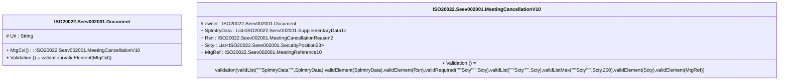

# seev.002.001.10-physical

> The tables below contain descriptions of the members of each Element. 
> The first column indicates the type of the member:
> A ‘#’ indicates that the field is a key to the element, and a ‘+’ indicates that the field is a value.
> The ‘*’ column contains a description for the element member.  
> The ‘@’ column contains any properties for the member.
> The ‘=’ column contains calculated values; or in the case of an enum, the serialized value.

---

## EntityImpl ISO20022.Seev002001.Document

| |Name|Type|*|@|=|
|-|-|-|-|-|-|
|#|Uri|String||XmlIgnore(), JsonIgnore()||
|+|MtgCxl|ISO20022.Seev002001.MeetingCancellationV10||XmlElement()||
||Validation|Some(String)||XmlIgnore(), JsonIgnore()|validation(validElement(MtgCxl))|

---

## AspectImpl ISO20022.Seev002001.MeetingCancellationV10

| |Name|Type|*|@|=|
|-|-|-|-|-|-|
|#|owner|ISO20022.Seev002001.Document||||
|+|SplmtryData|List<ISO20022.Seev002001.SupplementaryData1>||XmlElement()||
|+|Rsn|ISO20022.Seev002001.MeetingCancellationReason2||XmlElement()||
|+|Scty|List<ISO20022.Seev002001.SecurityPosition23>||XmlElement()||
|+|MtgRef|ISO20022.Seev002001.MeetingReference10||XmlElement()||
||Validation|Some(String)||XmlIgnore(), JsonIgnore()|validation(validList("""SplmtryData""",SplmtryData),validElement(SplmtryData),validElement(Rsn),validRequired("""Scty""",Scty),validList("""Scty""",Scty),validListMax("""Scty""",Scty,200),validElement(Scty),validElement(MtgRef))|

