# seev.003.001.10-physical

```mermaid
classDiagram
    class ISO20022.Seev003001.Document {
        # Uri  : String
        + MtgEntitlmntNtfctn () : ISO20022.Seev003001.MeetingEntitlementNotificationV10
        + Validation () = validation(validElement(MtgEntitlmntNtfctn))
    }
    class ISO20022.Seev003001.MeetingEntitlementNotificationV10 {
        # owner  : ISO20022.Seev003001.Document
        + SplmtryData  : List~ISO20022.Seev003001.SupplementaryData1~
        + Prxy  : ISO20022.Seev003001.PartyIdentification232Choice
        + MtgAttndee  : ISO20022.Seev003001.PartyIdentification232Choice
        + Elgblty  : ISO20022.Seev003001.EligibilityDates1
        + Scty  : List~ISO20022.Seev003001.SecurityPosition21~
        + Issr  : ISO20022.Seev003001.PartyIdentification129Choice
        + MtgRef  : ISO20022.Seev003001.MeetingReference10
        + PrvsEntitlmntNtfctnId  : String
        + NtfctnTp  : String
        + Validation () = validation(validList("""SplmtryData""",SplmtryData),validElement(SplmtryData),validElement(Prxy),validElement(MtgAttndee),validElement(Elgblty),validRequired("""Scty""",Scty),validList("""Scty""",Scty),validListMax("""Scty""",Scty,200),validElement(Scty),validElement(Issr),validElement(MtgRef))
    }
```

> The tables below contain descriptions of the members of each Element. 
> The first column indicates the type of the member:
> A ‘#’ indicates that the field is a key to the element, and a ‘+’ indicates that the field is a value.
> The ‘*’ column contains a description for the element member.  
> The ‘@’ column contains any properties for the member.
> The ‘=’ column contains calculated values; or in the case of an enum, the serialized value.

---

## EntityImpl ISO20022.Seev003001.Document

| |Name|Type|*|@|=|
|-|-|-|-|-|-|
|#|Uri|String||XmlIgnore(), JsonIgnore()||
|+|MtgEntitlmntNtfctn|ISO20022.Seev003001.MeetingEntitlementNotificationV10||XmlElement()||
||Validation|Some(String)||XmlIgnore(), JsonIgnore()|validation(validElement(MtgEntitlmntNtfctn))|

---

## AspectImpl ISO20022.Seev003001.MeetingEntitlementNotificationV10

| |Name|Type|*|@|=|
|-|-|-|-|-|-|
|#|owner|ISO20022.Seev003001.Document||||
|+|SplmtryData|List<ISO20022.Seev003001.SupplementaryData1>||XmlElement()||
|+|Prxy|ISO20022.Seev003001.PartyIdentification232Choice||XmlElement()||
|+|MtgAttndee|ISO20022.Seev003001.PartyIdentification232Choice||XmlElement()||
|+|Elgblty|ISO20022.Seev003001.EligibilityDates1||XmlElement()||
|+|Scty|List<ISO20022.Seev003001.SecurityPosition21>||XmlElement()||
|+|Issr|ISO20022.Seev003001.PartyIdentification129Choice||XmlElement()||
|+|MtgRef|ISO20022.Seev003001.MeetingReference10||XmlElement()||
|+|PrvsEntitlmntNtfctnId|String||XmlElement()||
|+|NtfctnTp|String||XmlElement()||
||Validation|Some(String)||XmlIgnore(), JsonIgnore()|validation(validList("""SplmtryData""",SplmtryData),validElement(SplmtryData),validElement(Prxy),validElement(MtgAttndee),validElement(Elgblty),validRequired("""Scty""",Scty),validList("""Scty""",Scty),validListMax("""Scty""",Scty,200),validElement(Scty),validElement(Issr),validElement(MtgRef))|

