# seev.004.001.10-physical

```mermaid
classDiagram
    class ISO20022.Seev004001.Document {
        # Uri  : String
        + MtgInstr () : ISO20022.Seev004001.MeetingInstructionV10
        + Validation () = validation(validElement(MtgInstr))
    }
    class ISO20022.Seev004001.MeetingInstructionV10 {
        # owner  : ISO20022.Seev004001.Document
        + SplmtryData  : List~ISO20022.Seev004001.SupplementaryData1~
        + Instr  : List~ISO20022.Seev004001.Instruction8~
        + OthrDocId  : List~ISO20022.Seev004001.DocumentIdentification32~
        + CancInstrId  : List~ISO20022.Seev004001.MeetingInstructionIdentification1~
        + InstrCxlReqId  : List~ISO20022.Seev004001.MeetingInstructionCancellation1~
        + FinInstrmId  : ISO20022.Seev004001.SecurityIdentification19
        + MtgRef  : ISO20022.Seev004001.MeetingReference10
        + MtgInstrId  : String
        + Pgntn  : ISO20022.Seev004001.Pagination1
        + Validation () = validation(validList("""SplmtryData""",SplmtryData),validElement(SplmtryData),validRequired("""Instr""",Instr),validList("""Instr""",Instr),validElement(Instr),validList("""OthrDocId""",OthrDocId),validElement(OthrDocId),validList("""CancInstrId""",CancInstrId),validElement(CancInstrId),validList("""InstrCxlReqId""",InstrCxlReqId),validElement(InstrCxlReqId),validElement(FinInstrmId),validElement(MtgRef),validElement(Pgntn))
    }
```

> The tables below contain descriptions of the members of each Element. 
> The first column indicates the type of the member:
> A ‘#’ indicates that the field is a key to the element, and a ‘+’ indicates that the field is a value.
> The ‘*’ column contains a description for the element member.  
> The ‘@’ column contains any properties for the member.
> The ‘=’ column contains calculated values; or in the case of an enum, the serialized value.

---

## EntityImpl ISO20022.Seev004001.Document

| |Name|Type|*|@|=|
|-|-|-|-|-|-|
|#|Uri|String||XmlIgnore(), JsonIgnore()||
|+|MtgInstr|ISO20022.Seev004001.MeetingInstructionV10||XmlElement()||
||Validation|Some(String)||XmlIgnore(), JsonIgnore()|validation(validElement(MtgInstr))|

---

## AspectImpl ISO20022.Seev004001.MeetingInstructionV10

| |Name|Type|*|@|=|
|-|-|-|-|-|-|
|#|owner|ISO20022.Seev004001.Document||||
|+|SplmtryData|List<ISO20022.Seev004001.SupplementaryData1>||XmlElement()||
|+|Instr|List<ISO20022.Seev004001.Instruction8>||XmlElement()||
|+|OthrDocId|List<ISO20022.Seev004001.DocumentIdentification32>||XmlElement()||
|+|CancInstrId|List<ISO20022.Seev004001.MeetingInstructionIdentification1>||XmlElement()||
|+|InstrCxlReqId|List<ISO20022.Seev004001.MeetingInstructionCancellation1>||XmlElement()||
|+|FinInstrmId|ISO20022.Seev004001.SecurityIdentification19||XmlElement()||
|+|MtgRef|ISO20022.Seev004001.MeetingReference10||XmlElement()||
|+|MtgInstrId|String||XmlElement()||
|+|Pgntn|ISO20022.Seev004001.Pagination1||XmlElement()||
||Validation|Some(String)||XmlIgnore(), JsonIgnore()|validation(validList("""SplmtryData""",SplmtryData),validElement(SplmtryData),validRequired("""Instr""",Instr),validList("""Instr""",Instr),validElement(Instr),validList("""OthrDocId""",OthrDocId),validElement(OthrDocId),validList("""CancInstrId""",CancInstrId),validElement(CancInstrId),validList("""InstrCxlReqId""",InstrCxlReqId),validElement(InstrCxlReqId),validElement(FinInstrmId),validElement(MtgRef),validElement(Pgntn))|

