# seev.005.001.10

```mermaid
classDiagram
    class Hiperspace.Edge {
        # From  : Hiperspace.Node
        # To  : Hiperspace.Node
        # TypeName  : String
        + Name  : String
    }
    class ISO20022.Seev005001.AddressType2Code {
        DLVY = 1
        MLTO = 2
        BIZZ = 3
        HOME = 4
        PBOX = 5
        ADDR = 6
    }
    class ISO20022.Seev005001.CancelInstruction5 {
        + InstdPos  : ISO20022.Seev005001.SafekeepingAccount18
        + SnglInstrId  : String
    }
    ISO20022.Seev005001.CancelInstruction5 *-- ISO20022.Seev005001.SafekeepingAccount18
    class ISO20022.Seev005001.DateAndPlaceOfBirth2 {
        + CtryOfBirth  : String
        + CityOfBirth  : String
        + PrvcOfBirth  : String
        + BirthDt  : DateTime
    }
    class ISO20022.Seev005001.FinancialInstrumentQuantity46Choice {
        + Cd  : String
        + DgtlTknUnit  : Decimal
        + FaceAmt  : Decimal
        + Unit  : Decimal
    }
    class ISO20022.Seev005001.GenericIdentification13 {
        + Issr  : String
        + SchmeNm  : String
        + Id  : String
    }
    class ISO20022.Seev005001.GenericIdentification30 {
        + SchmeNm  : String
        + Issr  : String
        + Id  : String
    }
    class ISO20022.Seev005001.GenericIdentification36 {
        + SchmeNm  : String
        + Issr  : String
        + Id  : String
    }
    class ISO20022.Seev005001.GenericIdentification78 {
        + Id  : String
        + Tp  : ISO20022.Seev005001.GenericIdentification30
    }
    ISO20022.Seev005001.GenericIdentification78 *-- ISO20022.Seev005001.GenericIdentification30
    class ISO20022.Seev005001.HoldingBalance15 {
        + SfkpgPlc  : ISO20022.Seev005001.SafekeepingPlaceFormat42Choice
        + BalTp  : String
        + Bal  : ISO20022.Seev005001.SignedQuantityFormat15
    }
    ISO20022.Seev005001.HoldingBalance15 *-- ISO20022.Seev005001.SafekeepingPlaceFormat42Choice
    ISO20022.Seev005001.HoldingBalance15 *-- ISO20022.Seev005001.SignedQuantityFormat15
    class ISO20022.Seev005001.IdentificationSource3Choice {
        + Prtry  : String
        + Cd  : String
    }
    class ISO20022.Seev005001.IdentificationType45Choice {
        + Prtry  : ISO20022.Seev005001.GenericIdentification30
        + Cd  : String
    }
    ISO20022.Seev005001.IdentificationType45Choice *-- ISO20022.Seev005001.GenericIdentification30
    class ISO20022.Seev005001.MeetingInstructionCancellationRequestV10 {
        + SplmtryData  : global::System.Collections.Generic.List~ISO20022.Seev005001.SupplementaryData1~
        + ToBeCancInstr  : global::System.Collections.Generic.List~ISO20022.Seev005001.CancelInstruction5~
        + FinInstrmId  : ISO20022.Seev005001.SecurityIdentification19
        + MtgRef  : ISO20022.Seev005001.MeetingReference10
        + MtgInstrId  : String
    }
    ISO20022.Seev005001.MeetingInstructionCancellationRequestV10 *-- ISO20022.Seev005001.SupplementaryData1
    ISO20022.Seev005001.MeetingInstructionCancellationRequestV10 *-- ISO20022.Seev005001.CancelInstruction5
    ISO20022.Seev005001.MeetingInstructionCancellationRequestV10 *-- ISO20022.Seev005001.SecurityIdentification19
    ISO20022.Seev005001.MeetingInstructionCancellationRequestV10 *-- ISO20022.Seev005001.MeetingReference10
    class ISO20022.Seev005001.MeetingReference10 {
        + Issr  : ISO20022.Seev005001.PartyIdentification129Choice
        + Lctn  : global::System.Collections.Generic.List~ISO20022.Seev005001.PostalAddress1~
        + Clssfctn  : ISO20022.Seev005001.MeetingTypeClassification2Choice
        + Tp  : String
        + MtgDtAndTm  : DateTime
        + IssrMtgId  : String
        + MtgId  : String
    }
    ISO20022.Seev005001.MeetingReference10 *-- ISO20022.Seev005001.PartyIdentification129Choice
    ISO20022.Seev005001.MeetingReference10 *-- ISO20022.Seev005001.PostalAddress1
    ISO20022.Seev005001.MeetingReference10 *-- ISO20022.Seev005001.MeetingTypeClassification2Choice
    class ISO20022.Seev005001.MeetingType4Code {
        CMET = 1
        BMET = 2
        SPCL = 3
        MIXD = 4
        GMET = 5
        XMET = 6
    }
    class ISO20022.Seev005001.MeetingTypeClassification2Choice {
        + Prtry  : ISO20022.Seev005001.GenericIdentification13
        + Cd  : String
    }
    ISO20022.Seev005001.MeetingTypeClassification2Choice *-- ISO20022.Seev005001.GenericIdentification13
    class ISO20022.Seev005001.MeetingTypeClassification2Code {
        VRHI = 1
        OMET = 2
        ISSU = 3
        CLAS = 4
        AMET = 5
    }
    class ISO20022.Seev005001.NameAndAddress5 {
        + Adr  : ISO20022.Seev005001.PostalAddress1
        + Nm  : String
    }
    ISO20022.Seev005001.NameAndAddress5 *-- ISO20022.Seev005001.PostalAddress1
    class ISO20022.Seev005001.NamePrefix2Code {
        MIKS = 1
        MIST = 2
        MISS = 3
        MADM = 4
        DOCT = 5
    }
    class ISO20022.Seev005001.NaturalPersonIdentification1 {
        + IdTp  : ISO20022.Seev005001.IdentificationType45Choice
        + Id  : String
    }
    ISO20022.Seev005001.NaturalPersonIdentification1 *-- ISO20022.Seev005001.IdentificationType45Choice
    class ISO20022.Seev005001.OtherIdentification1 {
        + Tp  : ISO20022.Seev005001.IdentificationSource3Choice
        + Sfx  : String
        + Id  : String
    }
    ISO20022.Seev005001.OtherIdentification1 *-- ISO20022.Seev005001.IdentificationSource3Choice
    class ISO20022.Seev005001.PartyIdentification129Choice {
        + LEI  : String
        + NmAndAdr  : ISO20022.Seev005001.NameAndAddress5
        + PrtryId  : ISO20022.Seev005001.GenericIdentification36
        + AnyBIC  : String
    }
    ISO20022.Seev005001.PartyIdentification129Choice *-- ISO20022.Seev005001.NameAndAddress5
    ISO20022.Seev005001.PartyIdentification129Choice *-- ISO20022.Seev005001.GenericIdentification36
    class ISO20022.Seev005001.PartyIdentification198Choice {
        + PrtryId  : ISO20022.Seev005001.GenericIdentification36
        + ClntId  : String
        + AnyBIC  : String
        + LEI  : String
        + NtlRegnNb  : String
    }
    ISO20022.Seev005001.PartyIdentification198Choice *-- ISO20022.Seev005001.GenericIdentification36
    class ISO20022.Seev005001.PartyIdentification221 {
        + Id  : ISO20022.Seev005001.PartyIdentification198Choice
        + EmailAdr  : String
        + NmAndAdr  : ISO20022.Seev005001.PersonName2
    }
    ISO20022.Seev005001.PartyIdentification221 *-- ISO20022.Seev005001.PartyIdentification198Choice
    ISO20022.Seev005001.PartyIdentification221 *-- ISO20022.Seev005001.PersonName2
    class ISO20022.Seev005001.PartyIdentification231Choice {
        + NtrlPrsn  : global::System.Collections.Generic.List~ISO20022.Seev005001.PartyIdentification238~
        + LglPrsn  : ISO20022.Seev005001.PartyIdentification221
    }
    ISO20022.Seev005001.PartyIdentification231Choice *-- ISO20022.Seev005001.PartyIdentification238
    ISO20022.Seev005001.PartyIdentification231Choice *-- ISO20022.Seev005001.PartyIdentification221
    class ISO20022.Seev005001.PartyIdentification238 {
        + DtAndPlcOfBirth  : ISO20022.Seev005001.DateAndPlaceOfBirth2
        + Ntlty  : String
        + Id  : ISO20022.Seev005001.NaturalPersonIdentification1
        + EmailAdr  : String
        + NmAndAdr  : ISO20022.Seev005001.PersonName3
    }
    ISO20022.Seev005001.PartyIdentification238 *-- ISO20022.Seev005001.DateAndPlaceOfBirth2
    ISO20022.Seev005001.PartyIdentification238 *-- ISO20022.Seev005001.NaturalPersonIdentification1
    ISO20022.Seev005001.PartyIdentification238 *-- ISO20022.Seev005001.PersonName3
    class ISO20022.Seev005001.PartyIdentification246Choice {
        + NtrlPrsn  : global::System.Collections.Generic.List~ISO20022.Seev005001.PartyIdentification250~
        + LglPrsn  : ISO20022.Seev005001.PartyIdentification269
    }
    ISO20022.Seev005001.PartyIdentification246Choice *-- ISO20022.Seev005001.PartyIdentification250
    ISO20022.Seev005001.PartyIdentification246Choice *-- ISO20022.Seev005001.PartyIdentification269
    class ISO20022.Seev005001.PartyIdentification250 {
        + CpnyRegrShrhldrId  : String
        + DtAndPlcOfBirth  : ISO20022.Seev005001.DateAndPlaceOfBirth2
        + Ntlty  : String
        + Id  : ISO20022.Seev005001.NaturalPersonIdentification1
        + EmailAdr  : String
        + NmAndAdr  : ISO20022.Seev005001.PersonName3
    }
    ISO20022.Seev005001.PartyIdentification250 *-- ISO20022.Seev005001.DateAndPlaceOfBirth2
    ISO20022.Seev005001.PartyIdentification250 *-- ISO20022.Seev005001.NaturalPersonIdentification1
    ISO20022.Seev005001.PartyIdentification250 *-- ISO20022.Seev005001.PersonName3
    class ISO20022.Seev005001.PartyIdentification269 {
        + CtryOfIncorprtn  : String
        + CpnyRegrShrhldrId  : String
        + Id  : ISO20022.Seev005001.PartyIdentification198Choice
        + EmailAdr  : String
        + NmAndAdr  : ISO20022.Seev005001.PersonName2
    }
    ISO20022.Seev005001.PartyIdentification269 *-- ISO20022.Seev005001.PartyIdentification198Choice
    ISO20022.Seev005001.PartyIdentification269 *-- ISO20022.Seev005001.PersonName2
    class ISO20022.Seev005001.PersonName2 {
        + Adr  : ISO20022.Seev005001.PostalAddress26
        + Nm  : String
    }
    ISO20022.Seev005001.PersonName2 *-- ISO20022.Seev005001.PostalAddress26
    class ISO20022.Seev005001.PersonName3 {
        + Adr  : ISO20022.Seev005001.PostalAddress26
        + Srnm  : String
        + FrstNm  : String
        + NmPrfx  : String
    }
    ISO20022.Seev005001.PersonName3 *-- ISO20022.Seev005001.PostalAddress26
    class ISO20022.Seev005001.PostalAddress1 {
        + Ctry  : String
        + CtrySubDvsn  : String
        + TwnNm  : String
        + PstCd  : String
        + BldgNb  : String
        + StrtNm  : String
        + AdrLine  : global::System.Collections.Generic.List~String~
        + AdrTp  : String
    }
    class ISO20022.Seev005001.PostalAddress26 {
        + Ctry  : String
        + CtrySubDvsn  : String
        + TwnNm  : String
        + PstCd  : String
        + PstBx  : String
        + BldgNb  : String
        + StrtNm  : String
        + AdrLine  : global::System.Collections.Generic.List~String~
        + AdrTp  : String
    }
    class ISO20022.Seev005001.Quantity1Code {
        QALL = 1
    }
    class ISO20022.Seev005001.SafekeepingAccount18 {
        + RghtsHldr  : global::System.Collections.Generic.List~ISO20022.Seev005001.PartyIdentification246Choice~
        + InstdBal  : global::System.Collections.Generic.List~ISO20022.Seev005001.HoldingBalance15~
        + SubAcctId  : String
        + AcctOwnr  : ISO20022.Seev005001.PartyIdentification231Choice
        + BlckChainAdrOrWllt  : String
        + AcctId  : String
    }
    ISO20022.Seev005001.SafekeepingAccount18 *-- ISO20022.Seev005001.PartyIdentification246Choice
    ISO20022.Seev005001.SafekeepingAccount18 *-- ISO20022.Seev005001.HoldingBalance15
    ISO20022.Seev005001.SafekeepingAccount18 *-- ISO20022.Seev005001.PartyIdentification231Choice
    class ISO20022.Seev005001.SafekeepingPlace1Code {
        SHHE = 1
        NCSD = 2
        ICSD = 3
        CUST = 4
    }
    class ISO20022.Seev005001.SafekeepingPlace2Code {
        ALLP = 1
        SHHE = 2
    }
    class ISO20022.Seev005001.SafekeepingPlaceFormat42Choice {
        + Prtry  : ISO20022.Seev005001.GenericIdentification78
        + TpAndId  : ISO20022.Seev005001.SafekeepingPlaceTypeAndIdentification1
        + DgtlLdgrId  : String
        + Ctry  : String
        + Id  : ISO20022.Seev005001.SafekeepingPlaceTypeAndText6
    }
    ISO20022.Seev005001.SafekeepingPlaceFormat42Choice *-- ISO20022.Seev005001.GenericIdentification78
    ISO20022.Seev005001.SafekeepingPlaceFormat42Choice *-- ISO20022.Seev005001.SafekeepingPlaceTypeAndIdentification1
    ISO20022.Seev005001.SafekeepingPlaceFormat42Choice *-- ISO20022.Seev005001.SafekeepingPlaceTypeAndText6
    class ISO20022.Seev005001.SafekeepingPlaceTypeAndIdentification1 {
        + Id  : String
        + SfkpgPlcTp  : String
    }
    class ISO20022.Seev005001.SafekeepingPlaceTypeAndText6 {
        + Id  : String
        + SfkpgPlcTp  : String
    }
    class ISO20022.Seev005001.SecuritiesEntryType2Code {
        REGO = 1
        INBA = 2
        UNBA = 3
        COLO = 4
        COLI = 5
        TRAD = 6
        SPOS = 7
        LOAN = 8
        BORR = 9
        SETD = 10
        NOMI = 11
        PENR = 12
        PEND = 13
        ELIG = 14
        BLOK = 15
    }
    class ISO20022.Seev005001.SecurityIdentification19 {
        + Desc  : String
        + OthrId  : global::System.Collections.Generic.List~ISO20022.Seev005001.OtherIdentification1~
        + ISIN  : String
    }
    ISO20022.Seev005001.SecurityIdentification19 *-- ISO20022.Seev005001.OtherIdentification1
    class ISO20022.Seev005001.ShortLong1Code {
        LONG = 1
        SHOR = 2
    }
    class ISO20022.Seev005001.SignedQuantityFormat15 {
        + Qty  : ISO20022.Seev005001.FinancialInstrumentQuantity46Choice
        + ShrtLngPos  : String
    }
    ISO20022.Seev005001.SignedQuantityFormat15 *-- ISO20022.Seev005001.FinancialInstrumentQuantity46Choice
    class ISO20022.Seev005001.SupplementaryData1 {
        + Envlp  : ISO20022.Seev005001.SupplementaryDataEnvelope1
        + PlcAndNm  : String
    }
    ISO20022.Seev005001.SupplementaryData1 *-- ISO20022.Seev005001.SupplementaryDataEnvelope1
    class ISO20022.Seev005001.SupplementaryDataEnvelope1 {
    }
    class ISO20022.Seev005001.TypeOfIdentification4Code {
        TXID = 1
        SOCS = 2
        CCPT = 3
        NRIN = 4
        IDCD = 5
        DRLC = 6
        CORP = 7
        CUST = 8
        ARNU = 9
    }
    class Hiperspace.Node {
        # SKey  : String
        + TypeName  : String
        + Name  : String
        + Froms (From = this) : Hiperspace.Edge
        + Tos (To = this) : Hiperspace.Edge
    }
```

> The tables below contain descriptions of the members of each Element. 
> The first column indicates the type of the member:
> A ‘#’ indicates that the field is a key to the element, and a ‘+’ indicates that the field is a value.
> The ‘*’ column contains a description for the element member.  
> The ‘@’ column contains any properties for the member.
> The ‘=’ column contains calculated values; or in the case of an enum, the serialized value.

---

## View Hiperspace.Edge
edge between nodes

| |Name|Type|*|@|=|
|-|-|-|-|-|-|
|#|From|Hiperspace.Node||||
|#|To|Hiperspace.Node||||
|#|TypeName|String||||
|+|Name|String||||

---

## Enum ISO20022.Seev005001.AddressType2Code

| |Name|Type|*|@|=|
|-|-|-|-|-|-|
||DLVY|Int32||XmlEnum("""DLVY""")|1|
||MLTO|Int32||XmlEnum("""MLTO""")|2|
||BIZZ|Int32||XmlEnum("""BIZZ""")|3|
||HOME|Int32||XmlEnum("""HOME""")|4|
||PBOX|Int32||XmlEnum("""PBOX""")|5|
||ADDR|Int32||XmlEnum("""ADDR""")|6|

---

## Value ISO20022.Seev005001.CancelInstruction5

| |Name|Type|*|@|=|
|-|-|-|-|-|-|
|+|InstdPos|ISO20022.Seev005001.SafekeepingAccount18||XmlElement()||
|+|SnglInstrId|String||XmlElement()||
||Validation|Some(String)||XmlIgnore(), JsonIgnore()|validation(validElement(InstdPos))|

---

## Value ISO20022.Seev005001.DateAndPlaceOfBirth2

| |Name|Type|*|@|=|
|-|-|-|-|-|-|
|+|CtryOfBirth|String||XmlElement()||
|+|CityOfBirth|String||XmlElement()||
|+|PrvcOfBirth|String||XmlElement()||
|+|BirthDt|DateTime||XmlElement()||
||Validation|Some(String)||XmlIgnore(), JsonIgnore()|validation(validPattern("""CtryOfBirth""",CtryOfBirth,"""[A-Z]{2,2}"""))|

---

## Type ISO20022.Seev005001.Document

| |Name|Type|*|@|=|
|-|-|-|-|-|-|
|+|MtgInstrCxlReq|ISO20022.Seev005001.MeetingInstructionCancellationRequestV10||XmlElement()||
||Validation|Some(String)||XmlIgnore(), JsonIgnore()|validation(validElement(MtgInstrCxlReq))|

---

## Value ISO20022.Seev005001.FinancialInstrumentQuantity46Choice

| |Name|Type|*|@|=|
|-|-|-|-|-|-|
|+|Cd|String||XmlElement()||
|+|DgtlTknUnit|Decimal||XmlElement()||
|+|FaceAmt|Decimal||XmlElement()||
|+|Unit|Decimal||XmlElement()||
||Validation|Some(String)||XmlIgnore(), JsonIgnore()|validation(validChoice(Cd,DgtlTknUnit,FaceAmt,Unit))|

---

## Value ISO20022.Seev005001.GenericIdentification13

| |Name|Type|*|@|=|
|-|-|-|-|-|-|
|+|Issr|String||XmlElement()||
|+|SchmeNm|String||XmlElement()||
|+|Id|String||XmlElement()||
||Validation|Some(String)||XmlIgnore(), JsonIgnore()|validation(validPattern("""Id""",Id,"""[a-zA-Z0-9]{1,4}"""))|

---

## Value ISO20022.Seev005001.GenericIdentification30

| |Name|Type|*|@|=|
|-|-|-|-|-|-|
|+|SchmeNm|String||XmlElement()||
|+|Issr|String||XmlElement()||
|+|Id|String||XmlElement()||
||Validation|Some(String)||XmlIgnore(), JsonIgnore()|validation(validPattern("""Id""",Id,"""[a-zA-Z0-9]{4}"""))|

---

## Value ISO20022.Seev005001.GenericIdentification36

| |Name|Type|*|@|=|
|-|-|-|-|-|-|
|+|SchmeNm|String||XmlElement()||
|+|Issr|String||XmlElement()||
|+|Id|String||XmlElement()||
||Validation|Some(String)||XmlIgnore(), JsonIgnore()|""|

---

## Value ISO20022.Seev005001.GenericIdentification78

| |Name|Type|*|@|=|
|-|-|-|-|-|-|
|+|Id|String||XmlElement()||
|+|Tp|ISO20022.Seev005001.GenericIdentification30||XmlElement()||
||Validation|Some(String)||XmlIgnore(), JsonIgnore()|validation(validElement(Tp))|

---

## Value ISO20022.Seev005001.HoldingBalance15

| |Name|Type|*|@|=|
|-|-|-|-|-|-|
|+|SfkpgPlc|ISO20022.Seev005001.SafekeepingPlaceFormat42Choice||XmlElement()||
|+|BalTp|String||XmlElement()||
|+|Bal|ISO20022.Seev005001.SignedQuantityFormat15||XmlElement()||
||Validation|Some(String)||XmlIgnore(), JsonIgnore()|validation(validElement(SfkpgPlc),validElement(Bal))|

---

## Value ISO20022.Seev005001.IdentificationSource3Choice

| |Name|Type|*|@|=|
|-|-|-|-|-|-|
|+|Prtry|String||XmlElement()||
|+|Cd|String||XmlElement()||
||Validation|Some(String)||XmlIgnore(), JsonIgnore()|validation(validChoice(Prtry,Cd))|

---

## Value ISO20022.Seev005001.IdentificationType45Choice

| |Name|Type|*|@|=|
|-|-|-|-|-|-|
|+|Prtry|ISO20022.Seev005001.GenericIdentification30||XmlElement()||
|+|Cd|String||XmlElement()||
||Validation|Some(String)||XmlIgnore(), JsonIgnore()|validation(validElement(Prtry),validChoice(Prtry,Cd))|

---

## Aspect ISO20022.Seev005001.MeetingInstructionCancellationRequestV10

| |Name|Type|*|@|=|
|-|-|-|-|-|-|
|+|SplmtryData|global::System.Collections.Generic.List<ISO20022.Seev005001.SupplementaryData1>||XmlElement()||
|+|ToBeCancInstr|global::System.Collections.Generic.List<ISO20022.Seev005001.CancelInstruction5>||XmlElement()||
|+|FinInstrmId|ISO20022.Seev005001.SecurityIdentification19||XmlElement()||
|+|MtgRef|ISO20022.Seev005001.MeetingReference10||XmlElement()||
|+|MtgInstrId|String||XmlElement()||
||Validation|Some(String)||XmlIgnore(), JsonIgnore()|validation(validList("""SplmtryData""",SplmtryData),validElement(SplmtryData),validList("""ToBeCancInstr""",ToBeCancInstr),validElement(ToBeCancInstr),validElement(FinInstrmId),validElement(MtgRef))|

---

## Value ISO20022.Seev005001.MeetingReference10

| |Name|Type|*|@|=|
|-|-|-|-|-|-|
|+|Issr|ISO20022.Seev005001.PartyIdentification129Choice||XmlElement()||
|+|Lctn|global::System.Collections.Generic.List<ISO20022.Seev005001.PostalAddress1>||XmlElement()||
|+|Clssfctn|ISO20022.Seev005001.MeetingTypeClassification2Choice||XmlElement()||
|+|Tp|String||XmlElement()||
|+|MtgDtAndTm|DateTime||XmlElement()||
|+|IssrMtgId|String||XmlElement()||
|+|MtgId|String||XmlElement()||
||Validation|Some(String)||XmlIgnore(), JsonIgnore()|validation(validElement(Issr),validList("""Lctn""",Lctn),validListMax("""Lctn""",Lctn,5),validElement(Lctn),validElement(Clssfctn))|

---

## Enum ISO20022.Seev005001.MeetingType4Code

| |Name|Type|*|@|=|
|-|-|-|-|-|-|
||CMET|Int32||XmlEnum("""CMET""")|1|
||BMET|Int32||XmlEnum("""BMET""")|2|
||SPCL|Int32||XmlEnum("""SPCL""")|3|
||MIXD|Int32||XmlEnum("""MIXD""")|4|
||GMET|Int32||XmlEnum("""GMET""")|5|
||XMET|Int32||XmlEnum("""XMET""")|6|

---

## Value ISO20022.Seev005001.MeetingTypeClassification2Choice

| |Name|Type|*|@|=|
|-|-|-|-|-|-|
|+|Prtry|ISO20022.Seev005001.GenericIdentification13||XmlElement()||
|+|Cd|String||XmlElement()||
||Validation|Some(String)||XmlIgnore(), JsonIgnore()|validation(validElement(Prtry),validChoice(Prtry,Cd))|

---

## Enum ISO20022.Seev005001.MeetingTypeClassification2Code

| |Name|Type|*|@|=|
|-|-|-|-|-|-|
||VRHI|Int32||XmlEnum("""VRHI""")|1|
||OMET|Int32||XmlEnum("""OMET""")|2|
||ISSU|Int32||XmlEnum("""ISSU""")|3|
||CLAS|Int32||XmlEnum("""CLAS""")|4|
||AMET|Int32||XmlEnum("""AMET""")|5|

---

## Value ISO20022.Seev005001.NameAndAddress5

| |Name|Type|*|@|=|
|-|-|-|-|-|-|
|+|Adr|ISO20022.Seev005001.PostalAddress1||XmlElement()||
|+|Nm|String||XmlElement()||
||Validation|Some(String)||XmlIgnore(), JsonIgnore()|validation(validElement(Adr))|

---

## Enum ISO20022.Seev005001.NamePrefix2Code

| |Name|Type|*|@|=|
|-|-|-|-|-|-|
||MIKS|Int32||XmlEnum("""MIKS""")|1|
||MIST|Int32||XmlEnum("""MIST""")|2|
||MISS|Int32||XmlEnum("""MISS""")|3|
||MADM|Int32||XmlEnum("""MADM""")|4|
||DOCT|Int32||XmlEnum("""DOCT""")|5|

---

## Value ISO20022.Seev005001.NaturalPersonIdentification1

| |Name|Type|*|@|=|
|-|-|-|-|-|-|
|+|IdTp|ISO20022.Seev005001.IdentificationType45Choice||XmlElement()||
|+|Id|String||XmlElement()||
||Validation|Some(String)||XmlIgnore(), JsonIgnore()|validation(validElement(IdTp))|

---

## Value ISO20022.Seev005001.OtherIdentification1

| |Name|Type|*|@|=|
|-|-|-|-|-|-|
|+|Tp|ISO20022.Seev005001.IdentificationSource3Choice||XmlElement()||
|+|Sfx|String||XmlElement()||
|+|Id|String||XmlElement()||
||Validation|Some(String)||XmlIgnore(), JsonIgnore()|validation(validElement(Tp))|

---

## Value ISO20022.Seev005001.PartyIdentification129Choice

| |Name|Type|*|@|=|
|-|-|-|-|-|-|
|+|LEI|String||XmlElement()||
|+|NmAndAdr|ISO20022.Seev005001.NameAndAddress5||XmlElement()||
|+|PrtryId|ISO20022.Seev005001.GenericIdentification36||XmlElement()||
|+|AnyBIC|String||XmlElement()||
||Validation|Some(String)||XmlIgnore(), JsonIgnore()|validation(validPattern("""LEI""",LEI,"""[A-Z0-9]{18,18}[0-9]{2,2}"""),validElement(NmAndAdr),validElement(PrtryId),validPattern("""AnyBIC""",AnyBIC,"""[A-Z0-9]{4,4}[A-Z]{2,2}[A-Z0-9]{2,2}([A-Z0-9]{3,3}){0,1}"""),validChoice(LEI,NmAndAdr,PrtryId,AnyBIC))|

---

## Value ISO20022.Seev005001.PartyIdentification198Choice

| |Name|Type|*|@|=|
|-|-|-|-|-|-|
|+|PrtryId|ISO20022.Seev005001.GenericIdentification36||XmlElement()||
|+|ClntId|String||XmlElement()||
|+|AnyBIC|String||XmlElement()||
|+|LEI|String||XmlElement()||
|+|NtlRegnNb|String||XmlElement()||
||Validation|Some(String)||XmlIgnore(), JsonIgnore()|validation(validElement(PrtryId),validPattern("""AnyBIC""",AnyBIC,"""[A-Z0-9]{4,4}[A-Z]{2,2}[A-Z0-9]{2,2}([A-Z0-9]{3,3}){0,1}"""),validPattern("""LEI""",LEI,"""[A-Z0-9]{18,18}[0-9]{2,2}"""),validChoice(PrtryId,ClntId,AnyBIC,LEI,NtlRegnNb))|

---

## Value ISO20022.Seev005001.PartyIdentification221

| |Name|Type|*|@|=|
|-|-|-|-|-|-|
|+|Id|ISO20022.Seev005001.PartyIdentification198Choice||XmlElement()||
|+|EmailAdr|String||XmlElement()||
|+|NmAndAdr|ISO20022.Seev005001.PersonName2||XmlElement()||
||Validation|Some(String)||XmlIgnore(), JsonIgnore()|validation(validElement(Id),validElement(NmAndAdr))|

---

## Value ISO20022.Seev005001.PartyIdentification231Choice

| |Name|Type|*|@|=|
|-|-|-|-|-|-|
|+|NtrlPrsn|global::System.Collections.Generic.List<ISO20022.Seev005001.PartyIdentification238>||XmlElement()||
|+|LglPrsn|ISO20022.Seev005001.PartyIdentification221||XmlElement()||
||Validation|Some(String)||XmlIgnore(), JsonIgnore()|validation(validRequired("""NtrlPrsn""",NtrlPrsn),validList("""NtrlPrsn""",NtrlPrsn),validElement(NtrlPrsn),validElement(LglPrsn),validChoice(NtrlPrsn,LglPrsn))|

---

## Value ISO20022.Seev005001.PartyIdentification238

| |Name|Type|*|@|=|
|-|-|-|-|-|-|
|+|DtAndPlcOfBirth|ISO20022.Seev005001.DateAndPlaceOfBirth2||XmlElement()||
|+|Ntlty|String||XmlElement()||
|+|Id|ISO20022.Seev005001.NaturalPersonIdentification1||XmlElement()||
|+|EmailAdr|String||XmlElement()||
|+|NmAndAdr|ISO20022.Seev005001.PersonName3||XmlElement()||
||Validation|Some(String)||XmlIgnore(), JsonIgnore()|validation(validElement(DtAndPlcOfBirth),validPattern("""Ntlty""",Ntlty,"""[A-Z]{2,2}"""),validElement(Id),validElement(NmAndAdr))|

---

## Value ISO20022.Seev005001.PartyIdentification246Choice

| |Name|Type|*|@|=|
|-|-|-|-|-|-|
|+|NtrlPrsn|global::System.Collections.Generic.List<ISO20022.Seev005001.PartyIdentification250>||XmlElement()||
|+|LglPrsn|ISO20022.Seev005001.PartyIdentification269||XmlElement()||
||Validation|Some(String)||XmlIgnore(), JsonIgnore()|validation(validRequired("""NtrlPrsn""",NtrlPrsn),validList("""NtrlPrsn""",NtrlPrsn),validElement(NtrlPrsn),validElement(LglPrsn),validChoice(NtrlPrsn,LglPrsn))|

---

## Value ISO20022.Seev005001.PartyIdentification250

| |Name|Type|*|@|=|
|-|-|-|-|-|-|
|+|CpnyRegrShrhldrId|String||XmlElement()||
|+|DtAndPlcOfBirth|ISO20022.Seev005001.DateAndPlaceOfBirth2||XmlElement()||
|+|Ntlty|String||XmlElement()||
|+|Id|ISO20022.Seev005001.NaturalPersonIdentification1||XmlElement()||
|+|EmailAdr|String||XmlElement()||
|+|NmAndAdr|ISO20022.Seev005001.PersonName3||XmlElement()||
||Validation|Some(String)||XmlIgnore(), JsonIgnore()|validation(validElement(DtAndPlcOfBirth),validPattern("""Ntlty""",Ntlty,"""[A-Z]{2,2}"""),validElement(Id),validElement(NmAndAdr))|

---

## Value ISO20022.Seev005001.PartyIdentification269

| |Name|Type|*|@|=|
|-|-|-|-|-|-|
|+|CtryOfIncorprtn|String||XmlElement()||
|+|CpnyRegrShrhldrId|String||XmlElement()||
|+|Id|ISO20022.Seev005001.PartyIdentification198Choice||XmlElement()||
|+|EmailAdr|String||XmlElement()||
|+|NmAndAdr|ISO20022.Seev005001.PersonName2||XmlElement()||
||Validation|Some(String)||XmlIgnore(), JsonIgnore()|validation(validPattern("""CtryOfIncorprtn""",CtryOfIncorprtn,"""[A-Z]{2,2}"""),validElement(Id),validElement(NmAndAdr))|

---

## Value ISO20022.Seev005001.PersonName2

| |Name|Type|*|@|=|
|-|-|-|-|-|-|
|+|Adr|ISO20022.Seev005001.PostalAddress26||XmlElement()||
|+|Nm|String||XmlElement()||
||Validation|Some(String)||XmlIgnore(), JsonIgnore()|validation(validElement(Adr))|

---

## Value ISO20022.Seev005001.PersonName3

| |Name|Type|*|@|=|
|-|-|-|-|-|-|
|+|Adr|ISO20022.Seev005001.PostalAddress26||XmlElement()||
|+|Srnm|String||XmlElement()||
|+|FrstNm|String||XmlElement()||
|+|NmPrfx|String||XmlElement()||
||Validation|Some(String)||XmlIgnore(), JsonIgnore()|validation(validElement(Adr))|

---

## Value ISO20022.Seev005001.PostalAddress1

| |Name|Type|*|@|=|
|-|-|-|-|-|-|
|+|Ctry|String||XmlElement()||
|+|CtrySubDvsn|String||XmlElement()||
|+|TwnNm|String||XmlElement()||
|+|PstCd|String||XmlElement()||
|+|BldgNb|String||XmlElement()||
|+|StrtNm|String||XmlElement()||
|+|AdrLine|global::System.Collections.Generic.List<String>||XmlElement()||
|+|AdrTp|String||XmlElement()||
||Validation|Some(String)||XmlIgnore(), JsonIgnore()|validation(validPattern("""Ctry""",Ctry,"""[A-Z]{2,2}"""),validListMax("""AdrLine""",AdrLine,5))|

---

## Value ISO20022.Seev005001.PostalAddress26

| |Name|Type|*|@|=|
|-|-|-|-|-|-|
|+|Ctry|String||XmlElement()||
|+|CtrySubDvsn|String||XmlElement()||
|+|TwnNm|String||XmlElement()||
|+|PstCd|String||XmlElement()||
|+|PstBx|String||XmlElement()||
|+|BldgNb|String||XmlElement()||
|+|StrtNm|String||XmlElement()||
|+|AdrLine|global::System.Collections.Generic.List<String>||XmlElement()||
|+|AdrTp|String||XmlElement()||
||Validation|Some(String)||XmlIgnore(), JsonIgnore()|validation(validPattern("""Ctry""",Ctry,"""[A-Z]{2,2}"""),validListMax("""AdrLine""",AdrLine,5))|

---

## Enum ISO20022.Seev005001.Quantity1Code

| |Name|Type|*|@|=|
|-|-|-|-|-|-|
||QALL|Int32||XmlEnum("""QALL""")|1|

---

## Value ISO20022.Seev005001.SafekeepingAccount18

| |Name|Type|*|@|=|
|-|-|-|-|-|-|
|+|RghtsHldr|global::System.Collections.Generic.List<ISO20022.Seev005001.PartyIdentification246Choice>||XmlElement()||
|+|InstdBal|global::System.Collections.Generic.List<ISO20022.Seev005001.HoldingBalance15>||XmlElement()||
|+|SubAcctId|String||XmlElement()||
|+|AcctOwnr|ISO20022.Seev005001.PartyIdentification231Choice||XmlElement()||
|+|BlckChainAdrOrWllt|String||XmlElement()||
|+|AcctId|String||XmlElement()||
||Validation|Some(String)||XmlIgnore(), JsonIgnore()|validation(validList("""RghtsHldr""",RghtsHldr),validListMax("""RghtsHldr""",RghtsHldr,250),validElement(RghtsHldr),validRequired("""InstdBal""",InstdBal),validList("""InstdBal""",InstdBal),validListMax("""InstdBal""",InstdBal,15),validElement(InstdBal),validElement(AcctOwnr))|

---

## Enum ISO20022.Seev005001.SafekeepingPlace1Code

| |Name|Type|*|@|=|
|-|-|-|-|-|-|
||SHHE|Int32||XmlEnum("""SHHE""")|1|
||NCSD|Int32||XmlEnum("""NCSD""")|2|
||ICSD|Int32||XmlEnum("""ICSD""")|3|
||CUST|Int32||XmlEnum("""CUST""")|4|

---

## Enum ISO20022.Seev005001.SafekeepingPlace2Code

| |Name|Type|*|@|=|
|-|-|-|-|-|-|
||ALLP|Int32||XmlEnum("""ALLP""")|1|
||SHHE|Int32||XmlEnum("""SHHE""")|2|

---

## Value ISO20022.Seev005001.SafekeepingPlaceFormat42Choice

| |Name|Type|*|@|=|
|-|-|-|-|-|-|
|+|Prtry|ISO20022.Seev005001.GenericIdentification78||XmlElement()||
|+|TpAndId|ISO20022.Seev005001.SafekeepingPlaceTypeAndIdentification1||XmlElement()||
|+|DgtlLdgrId|String||XmlElement()||
|+|Ctry|String||XmlElement()||
|+|Id|ISO20022.Seev005001.SafekeepingPlaceTypeAndText6||XmlElement()||
||Validation|Some(String)||XmlIgnore(), JsonIgnore()|validation(validElement(Prtry),validElement(TpAndId),validPattern("""DgtlLdgrId""",DgtlLdgrId,"""[1-9B-DF-HJ-NP-TV-XZ][0-9B-DF-HJ-NP-TV-XZ]{8,8}"""),validPattern("""Ctry""",Ctry,"""[A-Z]{2,2}"""),validElement(Id),validChoice(Prtry,TpAndId,DgtlLdgrId,Ctry,Id))|

---

## Value ISO20022.Seev005001.SafekeepingPlaceTypeAndIdentification1

| |Name|Type|*|@|=|
|-|-|-|-|-|-|
|+|Id|String||XmlElement()||
|+|SfkpgPlcTp|String||XmlElement()||
||Validation|Some(String)||XmlIgnore(), JsonIgnore()|validation(validPattern("""Id""",Id,"""[A-Z0-9]{4,4}[A-Z]{2,2}[A-Z0-9]{2,2}([A-Z0-9]{3,3}){0,1}"""))|

---

## Value ISO20022.Seev005001.SafekeepingPlaceTypeAndText6

| |Name|Type|*|@|=|
|-|-|-|-|-|-|
|+|Id|String||XmlElement()||
|+|SfkpgPlcTp|String||XmlElement()||
||Validation|Some(String)||XmlIgnore(), JsonIgnore()|""|

---

## Enum ISO20022.Seev005001.SecuritiesEntryType2Code

| |Name|Type|*|@|=|
|-|-|-|-|-|-|
||REGO|Int32||XmlEnum("""REGO""")|1|
||INBA|Int32||XmlEnum("""INBA""")|2|
||UNBA|Int32||XmlEnum("""UNBA""")|3|
||COLO|Int32||XmlEnum("""COLO""")|4|
||COLI|Int32||XmlEnum("""COLI""")|5|
||TRAD|Int32||XmlEnum("""TRAD""")|6|
||SPOS|Int32||XmlEnum("""SPOS""")|7|
||LOAN|Int32||XmlEnum("""LOAN""")|8|
||BORR|Int32||XmlEnum("""BORR""")|9|
||SETD|Int32||XmlEnum("""SETD""")|10|
||NOMI|Int32||XmlEnum("""NOMI""")|11|
||PENR|Int32||XmlEnum("""PENR""")|12|
||PEND|Int32||XmlEnum("""PEND""")|13|
||ELIG|Int32||XmlEnum("""ELIG""")|14|
||BLOK|Int32||XmlEnum("""BLOK""")|15|

---

## Value ISO20022.Seev005001.SecurityIdentification19

| |Name|Type|*|@|=|
|-|-|-|-|-|-|
|+|Desc|String||XmlElement()||
|+|OthrId|global::System.Collections.Generic.List<ISO20022.Seev005001.OtherIdentification1>||XmlElement()||
|+|ISIN|String||XmlElement()||
||Validation|Some(String)||XmlIgnore(), JsonIgnore()|validation(validList("""OthrId""",OthrId),validElement(OthrId),validPattern("""ISIN""",ISIN,"""[A-Z]{2,2}[A-Z0-9]{9,9}[0-9]{1,1}"""))|

---

## Enum ISO20022.Seev005001.ShortLong1Code

| |Name|Type|*|@|=|
|-|-|-|-|-|-|
||LONG|Int32||XmlEnum("""LONG""")|1|
||SHOR|Int32||XmlEnum("""SHOR""")|2|

---

## Value ISO20022.Seev005001.SignedQuantityFormat15

| |Name|Type|*|@|=|
|-|-|-|-|-|-|
|+|Qty|ISO20022.Seev005001.FinancialInstrumentQuantity46Choice||XmlElement()||
|+|ShrtLngPos|String||XmlElement()||
||Validation|Some(String)||XmlIgnore(), JsonIgnore()|validation(validElement(Qty))|

---

## Value ISO20022.Seev005001.SupplementaryData1

| |Name|Type|*|@|=|
|-|-|-|-|-|-|
|+|Envlp|ISO20022.Seev005001.SupplementaryDataEnvelope1||XmlElement()||
|+|PlcAndNm|String||XmlElement()||
||Validation|Some(String)||XmlIgnore(), JsonIgnore()|validation(validElement(Envlp))|

---

## Value ISO20022.Seev005001.SupplementaryDataEnvelope1

| |Name|Type|*|@|=|
|-|-|-|-|-|-|
||Validation|Some(String)||XmlIgnore(), JsonIgnore()|""|

---

## Enum ISO20022.Seev005001.TypeOfIdentification4Code

| |Name|Type|*|@|=|
|-|-|-|-|-|-|
||TXID|Int32||XmlEnum("""TXID""")|1|
||SOCS|Int32||XmlEnum("""SOCS""")|2|
||CCPT|Int32||XmlEnum("""CCPT""")|3|
||NRIN|Int32||XmlEnum("""NRIN""")|4|
||IDCD|Int32||XmlEnum("""IDCD""")|5|
||DRLC|Int32||XmlEnum("""DRLC""")|6|
||CORP|Int32||XmlEnum("""CORP""")|7|
||CUST|Int32||XmlEnum("""CUST""")|8|
||ARNU|Int32||XmlEnum("""ARNU""")|9|

---

## View Hiperspace.Node
node in a graph view of data

| |Name|Type|*|@|=|
|-|-|-|-|-|-|
|#|SKey|String||||
|+|TypeName|String||||
|+|Name|String||||
||Froms|Hiperspace.Edge|||From = this|
||Tos|Hiperspace.Edge|||To = this|

