# seev.006.001.11-physical

```mermaid
classDiagram
    class ISO20022.Seev006001.Document {
        # Uri  : String
        + MtgInstrSts () : ISO20022.Seev006001.MeetingInstructionStatusV11
        + Validation () = validation(validElement(MtgInstrSts))
    }
    class ISO20022.Seev006001.MeetingInstructionStatusV11 {
        # owner  : ISO20022.Seev006001.Document
        + SplmtryData  : List~ISO20022.Seev006001.SupplementaryData1~
        + RghtsHldr  : List~ISO20022.Seev006001.PartyIdentification246Choice~
        + VoteCstgPty  : ISO20022.Seev006001.PartyIdentification226Choice
        + CnfrmgPty  : ISO20022.Seev006001.PartyIdentification226Choice
        + Pos  : ISO20022.Seev006001.EligiblePosition17
        + InstrTpSts  : ISO20022.Seev006001.InstructionTypeStatus7Choice
        + FinInstrmId  : ISO20022.Seev006001.SecurityIdentification19
        + MtgRef  : ISO20022.Seev006001.MeetingReference10
        + InstrTp  : ISO20022.Seev006001.InstructionType2Choice
        + Validation () = validation(validList("""SplmtryData""",SplmtryData),validElement(SplmtryData),validList("""RghtsHldr""",RghtsHldr),validListMax("""RghtsHldr""",RghtsHldr,250),validElement(RghtsHldr),validElement(VoteCstgPty),validElement(CnfrmgPty),validElement(Pos),validElement(InstrTpSts),validElement(FinInstrmId),validElement(MtgRef),validElement(InstrTp))
    }
```

> The tables below contain descriptions of the members of each Element. 
> The first column indicates the type of the member:
> A ‘#’ indicates that the field is a key to the element, and a ‘+’ indicates that the field is a value.
> The ‘*’ column contains a description for the element member.  
> The ‘@’ column contains any properties for the member.
> The ‘=’ column contains calculated values; or in the case of an enum, the serialized value.

---

## EntityImpl ISO20022.Seev006001.Document

| |Name|Type|*|@|=|
|-|-|-|-|-|-|
|#|Uri|String||XmlIgnore(), JsonIgnore()||
|+|MtgInstrSts|ISO20022.Seev006001.MeetingInstructionStatusV11||XmlElement()||
||Validation|Some(String)||XmlIgnore(), JsonIgnore()|validation(validElement(MtgInstrSts))|

---

## AspectImpl ISO20022.Seev006001.MeetingInstructionStatusV11

| |Name|Type|*|@|=|
|-|-|-|-|-|-|
|#|owner|ISO20022.Seev006001.Document||||
|+|SplmtryData|List<ISO20022.Seev006001.SupplementaryData1>||XmlElement()||
|+|RghtsHldr|List<ISO20022.Seev006001.PartyIdentification246Choice>||XmlElement()||
|+|VoteCstgPty|ISO20022.Seev006001.PartyIdentification226Choice||XmlElement()||
|+|CnfrmgPty|ISO20022.Seev006001.PartyIdentification226Choice||XmlElement()||
|+|Pos|ISO20022.Seev006001.EligiblePosition17||XmlElement()||
|+|InstrTpSts|ISO20022.Seev006001.InstructionTypeStatus7Choice||XmlElement()||
|+|FinInstrmId|ISO20022.Seev006001.SecurityIdentification19||XmlElement()||
|+|MtgRef|ISO20022.Seev006001.MeetingReference10||XmlElement()||
|+|InstrTp|ISO20022.Seev006001.InstructionType2Choice||XmlElement()||
||Validation|Some(String)||XmlIgnore(), JsonIgnore()|validation(validList("""SplmtryData""",SplmtryData),validElement(SplmtryData),validList("""RghtsHldr""",RghtsHldr),validListMax("""RghtsHldr""",RghtsHldr,250),validElement(RghtsHldr),validElement(VoteCstgPty),validElement(CnfrmgPty),validElement(Pos),validElement(InstrTpSts),validElement(FinInstrmId),validElement(MtgRef),validElement(InstrTp))|

