# seev.007.001.11

```mermaid
classDiagram
    class Hiperspace.Edge {
        # From  : Hiperspace.Node
        # To  : Hiperspace.Node
        # TypeName  : String
        + Name  : String
    }
    class ISO20022.Seev007001.AddressType2Code {
        DLVY = 1
        MLTO = 2
        BIZZ = 3
        HOME = 4
        PBOX = 5
        ADDR = 6
    }
    class ISO20022.Seev007001.DateAndDateTime1Choice {
        + DtTm  : DateTime
        + Dt  : DateTime
    }
    class ISO20022.Seev007001.DateAndPlaceOfBirth2 {
        + CtryOfBirth  : String
        + CityOfBirth  : String
        + PrvcOfBirth  : String
        + BirthDt  : DateTime
    }
    class ISO20022.Seev007001.DetailedInstructionStatus19 {
        + VotePerRsltn  : global::System.Collections.Generic.List~ISO20022.Seev007001.Vote19~
        + VoteRctDtTm  : ISO20022.Seev007001.DateAndDateTime1Choice
        + ModltyOfCntg  : ISO20022.Seev007001.ModalityOfCounting1Choice
        + StgInstr  : String
        + Prxy  : ISO20022.Seev007001.PartyIdentification232Choice
        + RghtsHldr  : global::System.Collections.Generic.List~ISO20022.Seev007001.PartyIdentification246Choice~
        + SubAcctId  : String
        + AcctOwnr  : ISO20022.Seev007001.PartyIdentification231Choice
        + AcctId  : String
        + SnglInstrId  : String
    }
    ISO20022.Seev007001.DetailedInstructionStatus19 *-- ISO20022.Seev007001.Vote19
    ISO20022.Seev007001.DetailedInstructionStatus19 *-- ISO20022.Seev007001.DateAndDateTime1Choice
    ISO20022.Seev007001.DetailedInstructionStatus19 *-- ISO20022.Seev007001.ModalityOfCounting1Choice
    ISO20022.Seev007001.DetailedInstructionStatus19 *-- ISO20022.Seev007001.PartyIdentification232Choice
    ISO20022.Seev007001.DetailedInstructionStatus19 *-- ISO20022.Seev007001.PartyIdentification246Choice
    ISO20022.Seev007001.DetailedInstructionStatus19 *-- ISO20022.Seev007001.PartyIdentification231Choice
    class ISO20022.Seev007001.FinancialInstrumentQuantity18Choice {
        + FaceAmt  : Decimal
        + Unit  : Decimal
    }
    class ISO20022.Seev007001.GenericIdentification13 {
        + Issr  : String
        + SchmeNm  : String
        + Id  : String
    }
    class ISO20022.Seev007001.GenericIdentification30 {
        + SchmeNm  : String
        + Issr  : String
        + Id  : String
    }
    class ISO20022.Seev007001.GenericIdentification36 {
        + SchmeNm  : String
        + Issr  : String
        + Id  : String
    }
    class ISO20022.Seev007001.IdentificationSource3Choice {
        + Prtry  : String
        + Cd  : String
    }
    class ISO20022.Seev007001.IdentificationType45Choice {
        + Prtry  : ISO20022.Seev007001.GenericIdentification30
        + Cd  : String
    }
    ISO20022.Seev007001.IdentificationType45Choice *-- ISO20022.Seev007001.GenericIdentification30
    class ISO20022.Seev007001.ItemDescription2 {
        + Desc  : global::System.Collections.Generic.List~String~
        + Titl  : String
        + Lang  : String
    }
    class ISO20022.Seev007001.MeetingReference10 {
        + Issr  : ISO20022.Seev007001.PartyIdentification129Choice
        + Lctn  : global::System.Collections.Generic.List~ISO20022.Seev007001.PostalAddress1~
        + Clssfctn  : ISO20022.Seev007001.MeetingTypeClassification2Choice
        + Tp  : String
        + MtgDtAndTm  : DateTime
        + IssrMtgId  : String
        + MtgId  : String
    }
    ISO20022.Seev007001.MeetingReference10 *-- ISO20022.Seev007001.PartyIdentification129Choice
    ISO20022.Seev007001.MeetingReference10 *-- ISO20022.Seev007001.PostalAddress1
    ISO20022.Seev007001.MeetingReference10 *-- ISO20022.Seev007001.MeetingTypeClassification2Choice
    class ISO20022.Seev007001.MeetingType4Code {
        CMET = 1
        BMET = 2
        SPCL = 3
        MIXD = 4
        GMET = 5
        XMET = 6
    }
    class ISO20022.Seev007001.MeetingTypeClassification2Choice {
        + Prtry  : ISO20022.Seev007001.GenericIdentification13
        + Cd  : String
    }
    ISO20022.Seev007001.MeetingTypeClassification2Choice *-- ISO20022.Seev007001.GenericIdentification13
    class ISO20022.Seev007001.MeetingTypeClassification2Code {
        VRHI = 1
        OMET = 2
        ISSU = 3
        CLAS = 4
        AMET = 5
    }
    class ISO20022.Seev007001.MeetingVoteExecutionConfirmationV11 {
        + SplmtryData  : global::System.Collections.Generic.List~ISO20022.Seev007001.SupplementaryData1~
        + VoteInstrsConfURLAdr  : String
        + VoteInstrs  : global::System.Collections.Generic.List~ISO20022.Seev007001.DetailedInstructionStatus19~
        + FinInstrmId  : ISO20022.Seev007001.SecurityIdentification19
        + MtgRef  : ISO20022.Seev007001.MeetingReference10
        + MtgInstrId  : String
        + VoteExctnConfId  : String
        + Pgntn  : ISO20022.Seev007001.Pagination1
    }
    ISO20022.Seev007001.MeetingVoteExecutionConfirmationV11 *-- ISO20022.Seev007001.SupplementaryData1
    ISO20022.Seev007001.MeetingVoteExecutionConfirmationV11 *-- ISO20022.Seev007001.DetailedInstructionStatus19
    ISO20022.Seev007001.MeetingVoteExecutionConfirmationV11 *-- ISO20022.Seev007001.SecurityIdentification19
    ISO20022.Seev007001.MeetingVoteExecutionConfirmationV11 *-- ISO20022.Seev007001.MeetingReference10
    ISO20022.Seev007001.MeetingVoteExecutionConfirmationV11 *-- ISO20022.Seev007001.Pagination1
    class ISO20022.Seev007001.ModalityOfCounting1Choice {
        + Prtry  : ISO20022.Seev007001.GenericIdentification30
        + Cd  : String
    }
    ISO20022.Seev007001.ModalityOfCounting1Choice *-- ISO20022.Seev007001.GenericIdentification30
    class ISO20022.Seev007001.ModalityOfCounting1Code {
        PVAM = 1
        PVBM = 2
        EVBM = 3
        EVAM = 4
    }
    class ISO20022.Seev007001.NameAndAddress5 {
        + Adr  : ISO20022.Seev007001.PostalAddress1
        + Nm  : String
    }
    ISO20022.Seev007001.NameAndAddress5 *-- ISO20022.Seev007001.PostalAddress1
    class ISO20022.Seev007001.NamePrefix2Code {
        MIKS = 1
        MIST = 2
        MISS = 3
        MADM = 4
        DOCT = 5
    }
    class ISO20022.Seev007001.NaturalPersonIdentification1 {
        + IdTp  : ISO20022.Seev007001.IdentificationType45Choice
        + Id  : String
    }
    ISO20022.Seev007001.NaturalPersonIdentification1 *-- ISO20022.Seev007001.IdentificationType45Choice
    class ISO20022.Seev007001.OtherIdentification1 {
        + Tp  : ISO20022.Seev007001.IdentificationSource3Choice
        + Sfx  : String
        + Id  : String
    }
    ISO20022.Seev007001.OtherIdentification1 *-- ISO20022.Seev007001.IdentificationSource3Choice
    class ISO20022.Seev007001.Pagination1 {
        + LastPgInd  : String
        + PgNb  : String
    }
    class ISO20022.Seev007001.PartyIdentification129Choice {
        + LEI  : String
        + NmAndAdr  : ISO20022.Seev007001.NameAndAddress5
        + PrtryId  : ISO20022.Seev007001.GenericIdentification36
        + AnyBIC  : String
    }
    ISO20022.Seev007001.PartyIdentification129Choice *-- ISO20022.Seev007001.NameAndAddress5
    ISO20022.Seev007001.PartyIdentification129Choice *-- ISO20022.Seev007001.GenericIdentification36
    class ISO20022.Seev007001.PartyIdentification198Choice {
        + PrtryId  : ISO20022.Seev007001.GenericIdentification36
        + ClntId  : String
        + AnyBIC  : String
        + LEI  : String
        + NtlRegnNb  : String
    }
    ISO20022.Seev007001.PartyIdentification198Choice *-- ISO20022.Seev007001.GenericIdentification36
    class ISO20022.Seev007001.PartyIdentification221 {
        + Id  : ISO20022.Seev007001.PartyIdentification198Choice
        + EmailAdr  : String
        + NmAndAdr  : ISO20022.Seev007001.PersonName2
    }
    ISO20022.Seev007001.PartyIdentification221 *-- ISO20022.Seev007001.PartyIdentification198Choice
    ISO20022.Seev007001.PartyIdentification221 *-- ISO20022.Seev007001.PersonName2
    class ISO20022.Seev007001.PartyIdentification231Choice {
        + NtrlPrsn  : global::System.Collections.Generic.List~ISO20022.Seev007001.PartyIdentification238~
        + LglPrsn  : ISO20022.Seev007001.PartyIdentification221
    }
    ISO20022.Seev007001.PartyIdentification231Choice *-- ISO20022.Seev007001.PartyIdentification238
    ISO20022.Seev007001.PartyIdentification231Choice *-- ISO20022.Seev007001.PartyIdentification221
    class ISO20022.Seev007001.PartyIdentification232Choice {
        + NtrlPrsn  : ISO20022.Seev007001.PartyIdentification238
        + LglPrsn  : ISO20022.Seev007001.PartyIdentification221
    }
    ISO20022.Seev007001.PartyIdentification232Choice *-- ISO20022.Seev007001.PartyIdentification238
    ISO20022.Seev007001.PartyIdentification232Choice *-- ISO20022.Seev007001.PartyIdentification221
    class ISO20022.Seev007001.PartyIdentification238 {
        + DtAndPlcOfBirth  : ISO20022.Seev007001.DateAndPlaceOfBirth2
        + Ntlty  : String
        + Id  : ISO20022.Seev007001.NaturalPersonIdentification1
        + EmailAdr  : String
        + NmAndAdr  : ISO20022.Seev007001.PersonName3
    }
    ISO20022.Seev007001.PartyIdentification238 *-- ISO20022.Seev007001.DateAndPlaceOfBirth2
    ISO20022.Seev007001.PartyIdentification238 *-- ISO20022.Seev007001.NaturalPersonIdentification1
    ISO20022.Seev007001.PartyIdentification238 *-- ISO20022.Seev007001.PersonName3
    class ISO20022.Seev007001.PartyIdentification246Choice {
        + NtrlPrsn  : global::System.Collections.Generic.List~ISO20022.Seev007001.PartyIdentification250~
        + LglPrsn  : ISO20022.Seev007001.PartyIdentification269
    }
    ISO20022.Seev007001.PartyIdentification246Choice *-- ISO20022.Seev007001.PartyIdentification250
    ISO20022.Seev007001.PartyIdentification246Choice *-- ISO20022.Seev007001.PartyIdentification269
    class ISO20022.Seev007001.PartyIdentification250 {
        + CpnyRegrShrhldrId  : String
        + DtAndPlcOfBirth  : ISO20022.Seev007001.DateAndPlaceOfBirth2
        + Ntlty  : String
        + Id  : ISO20022.Seev007001.NaturalPersonIdentification1
        + EmailAdr  : String
        + NmAndAdr  : ISO20022.Seev007001.PersonName3
    }
    ISO20022.Seev007001.PartyIdentification250 *-- ISO20022.Seev007001.DateAndPlaceOfBirth2
    ISO20022.Seev007001.PartyIdentification250 *-- ISO20022.Seev007001.NaturalPersonIdentification1
    ISO20022.Seev007001.PartyIdentification250 *-- ISO20022.Seev007001.PersonName3
    class ISO20022.Seev007001.PartyIdentification269 {
        + CtryOfIncorprtn  : String
        + CpnyRegrShrhldrId  : String
        + Id  : ISO20022.Seev007001.PartyIdentification198Choice
        + EmailAdr  : String
        + NmAndAdr  : ISO20022.Seev007001.PersonName2
    }
    ISO20022.Seev007001.PartyIdentification269 *-- ISO20022.Seev007001.PartyIdentification198Choice
    ISO20022.Seev007001.PartyIdentification269 *-- ISO20022.Seev007001.PersonName2
    class ISO20022.Seev007001.PersonName2 {
        + Adr  : ISO20022.Seev007001.PostalAddress26
        + Nm  : String
    }
    ISO20022.Seev007001.PersonName2 *-- ISO20022.Seev007001.PostalAddress26
    class ISO20022.Seev007001.PersonName3 {
        + Adr  : ISO20022.Seev007001.PostalAddress26
        + Srnm  : String
        + FrstNm  : String
        + NmPrfx  : String
    }
    ISO20022.Seev007001.PersonName3 *-- ISO20022.Seev007001.PostalAddress26
    class ISO20022.Seev007001.PostalAddress1 {
        + Ctry  : String
        + CtrySubDvsn  : String
        + TwnNm  : String
        + PstCd  : String
        + BldgNb  : String
        + StrtNm  : String
        + AdrLine  : global::System.Collections.Generic.List~String~
        + AdrTp  : String
    }
    class ISO20022.Seev007001.PostalAddress26 {
        + Ctry  : String
        + CtrySubDvsn  : String
        + TwnNm  : String
        + PstCd  : String
        + PstBx  : String
        + BldgNb  : String
        + StrtNm  : String
        + AdrLine  : global::System.Collections.Generic.List~String~
        + AdrTp  : String
    }
    class ISO20022.Seev007001.ProprietaryVote2 {
        + Qty  : ISO20022.Seev007001.FinancialInstrumentQuantity18Choice
        + Cd  : ISO20022.Seev007001.GenericIdentification30
    }
    ISO20022.Seev007001.ProprietaryVote2 *-- ISO20022.Seev007001.FinancialInstrumentQuantity18Choice
    ISO20022.Seev007001.ProprietaryVote2 *-- ISO20022.Seev007001.GenericIdentification30
    class ISO20022.Seev007001.ResolutionSubStatus1Code {
        NEWR = 1
        AMDR = 2
    }
    class ISO20022.Seev007001.SecurityIdentification19 {
        + Desc  : String
        + OthrId  : global::System.Collections.Generic.List~ISO20022.Seev007001.OtherIdentification1~
        + ISIN  : String
    }
    ISO20022.Seev007001.SecurityIdentification19 *-- ISO20022.Seev007001.OtherIdentification1
    class ISO20022.Seev007001.SupplementaryData1 {
        + Envlp  : ISO20022.Seev007001.SupplementaryDataEnvelope1
        + PlcAndNm  : String
    }
    ISO20022.Seev007001.SupplementaryData1 *-- ISO20022.Seev007001.SupplementaryDataEnvelope1
    class ISO20022.Seev007001.SupplementaryDataEnvelope1 {
    }
    class ISO20022.Seev007001.TypeOfIdentification4Code {
        TXID = 1
        SOCS = 2
        CCPT = 3
        NRIN = 4
        IDCD = 5
        DRLC = 6
        CORP = 7
        CUST = 8
        ARNU = 9
    }
    class ISO20022.Seev007001.Vote19 {
        + Wdrwn  : String
        + Prtry  : global::System.Collections.Generic.List~ISO20022.Seev007001.ProprietaryVote2~
        + Blnk  : ISO20022.Seev007001.FinancialInstrumentQuantity18Choice
        + NoActn  : ISO20022.Seev007001.FinancialInstrumentQuantity18Choice
        + ThreeYrs  : ISO20022.Seev007001.FinancialInstrumentQuantity18Choice
        + TwoYrs  : ISO20022.Seev007001.FinancialInstrumentQuantity18Choice
        + OneYr  : ISO20022.Seev007001.FinancialInstrumentQuantity18Choice
        + Dscrtnry  : ISO20022.Seev007001.FinancialInstrumentQuantity18Choice
        + AgnstMgmt  : ISO20022.Seev007001.FinancialInstrumentQuantity18Choice
        + WthMgmt  : ISO20022.Seev007001.FinancialInstrumentQuantity18Choice
        + Wthhld  : ISO20022.Seev007001.FinancialInstrumentQuantity18Choice
        + Abstn  : ISO20022.Seev007001.FinancialInstrumentQuantity18Choice
        + Agnst  : ISO20022.Seev007001.FinancialInstrumentQuantity18Choice
        + For  : ISO20022.Seev007001.FinancialInstrumentQuantity18Choice
        + SubSts  : String
        + Desc  : global::System.Collections.Generic.List~ISO20022.Seev007001.ItemDescription2~
        + IssrLabl  : String
    }
    ISO20022.Seev007001.Vote19 *-- ISO20022.Seev007001.ProprietaryVote2
    ISO20022.Seev007001.Vote19 *-- ISO20022.Seev007001.FinancialInstrumentQuantity18Choice
    ISO20022.Seev007001.Vote19 *-- ISO20022.Seev007001.FinancialInstrumentQuantity18Choice
    ISO20022.Seev007001.Vote19 *-- ISO20022.Seev007001.FinancialInstrumentQuantity18Choice
    ISO20022.Seev007001.Vote19 *-- ISO20022.Seev007001.FinancialInstrumentQuantity18Choice
    ISO20022.Seev007001.Vote19 *-- ISO20022.Seev007001.FinancialInstrumentQuantity18Choice
    ISO20022.Seev007001.Vote19 *-- ISO20022.Seev007001.FinancialInstrumentQuantity18Choice
    ISO20022.Seev007001.Vote19 *-- ISO20022.Seev007001.FinancialInstrumentQuantity18Choice
    ISO20022.Seev007001.Vote19 *-- ISO20022.Seev007001.FinancialInstrumentQuantity18Choice
    ISO20022.Seev007001.Vote19 *-- ISO20022.Seev007001.FinancialInstrumentQuantity18Choice
    ISO20022.Seev007001.Vote19 *-- ISO20022.Seev007001.FinancialInstrumentQuantity18Choice
    ISO20022.Seev007001.Vote19 *-- ISO20022.Seev007001.FinancialInstrumentQuantity18Choice
    ISO20022.Seev007001.Vote19 *-- ISO20022.Seev007001.FinancialInstrumentQuantity18Choice
    ISO20022.Seev007001.Vote19 *-- ISO20022.Seev007001.ItemDescription2
    class Hiperspace.Node {
        # SKey  : String
        + TypeName  : String
        + Name  : String
        + Froms (From = this) : Hiperspace.Edge
        + Tos (To = this) : Hiperspace.Edge
    }
```

> The tables below contain descriptions of the members of each Element. 
> The first column indicates the type of the member:
> A ‘#’ indicates that the field is a key to the element, and a ‘+’ indicates that the field is a value.
> The ‘*’ column contains a description for the element member.  
> The ‘@’ column contains any properties for the member.
> The ‘=’ column contains calculated values; or in the case of an enum, the serialized value.

---

## View Hiperspace.Edge
edge between nodes

| |Name|Type|*|@|=|
|-|-|-|-|-|-|
|#|From|Hiperspace.Node||||
|#|To|Hiperspace.Node||||
|#|TypeName|String||||
|+|Name|String||||

---

## Enum ISO20022.Seev007001.AddressType2Code

| |Name|Type|*|@|=|
|-|-|-|-|-|-|
||DLVY|Int32||XmlEnum("""DLVY""")|1|
||MLTO|Int32||XmlEnum("""MLTO""")|2|
||BIZZ|Int32||XmlEnum("""BIZZ""")|3|
||HOME|Int32||XmlEnum("""HOME""")|4|
||PBOX|Int32||XmlEnum("""PBOX""")|5|
||ADDR|Int32||XmlEnum("""ADDR""")|6|

---

## Value ISO20022.Seev007001.DateAndDateTime1Choice

| |Name|Type|*|@|=|
|-|-|-|-|-|-|
|+|DtTm|DateTime||XmlElement()||
|+|Dt|DateTime||XmlElement()||
||Validation|Some(String)||XmlIgnore(), JsonIgnore()|validation(validChoice(DtTm,Dt))|

---

## Value ISO20022.Seev007001.DateAndPlaceOfBirth2

| |Name|Type|*|@|=|
|-|-|-|-|-|-|
|+|CtryOfBirth|String||XmlElement()||
|+|CityOfBirth|String||XmlElement()||
|+|PrvcOfBirth|String||XmlElement()||
|+|BirthDt|DateTime||XmlElement()||
||Validation|Some(String)||XmlIgnore(), JsonIgnore()|validation(validPattern("""CtryOfBirth""",CtryOfBirth,"""[A-Z]{2,2}"""))|

---

## Value ISO20022.Seev007001.DetailedInstructionStatus19

| |Name|Type|*|@|=|
|-|-|-|-|-|-|
|+|VotePerRsltn|global::System.Collections.Generic.List<ISO20022.Seev007001.Vote19>||XmlElement()||
|+|VoteRctDtTm|ISO20022.Seev007001.DateAndDateTime1Choice||XmlElement()||
|+|ModltyOfCntg|ISO20022.Seev007001.ModalityOfCounting1Choice||XmlElement()||
|+|StgInstr|String||XmlElement()||
|+|Prxy|ISO20022.Seev007001.PartyIdentification232Choice||XmlElement()||
|+|RghtsHldr|global::System.Collections.Generic.List<ISO20022.Seev007001.PartyIdentification246Choice>||XmlElement()||
|+|SubAcctId|String||XmlElement()||
|+|AcctOwnr|ISO20022.Seev007001.PartyIdentification231Choice||XmlElement()||
|+|AcctId|String||XmlElement()||
|+|SnglInstrId|String||XmlElement()||
||Validation|Some(String)||XmlIgnore(), JsonIgnore()|validation(validList("""VotePerRsltn""",VotePerRsltn),validListMax("""VotePerRsltn""",VotePerRsltn,1000),validElement(VotePerRsltn),validElement(VoteRctDtTm),validElement(ModltyOfCntg),validElement(Prxy),validList("""RghtsHldr""",RghtsHldr),validListMax("""RghtsHldr""",RghtsHldr,250),validElement(RghtsHldr),validElement(AcctOwnr))|

---

## Type ISO20022.Seev007001.Document

| |Name|Type|*|@|=|
|-|-|-|-|-|-|
|+|MtgVoteExctnConf|ISO20022.Seev007001.MeetingVoteExecutionConfirmationV11||XmlElement()||
||Validation|Some(String)||XmlIgnore(), JsonIgnore()|validation(validElement(MtgVoteExctnConf))|

---

## Value ISO20022.Seev007001.FinancialInstrumentQuantity18Choice

| |Name|Type|*|@|=|
|-|-|-|-|-|-|
|+|FaceAmt|Decimal||XmlElement()||
|+|Unit|Decimal||XmlElement()||
||Validation|Some(String)||XmlIgnore(), JsonIgnore()|validation(validChoice(FaceAmt,Unit))|

---

## Value ISO20022.Seev007001.GenericIdentification13

| |Name|Type|*|@|=|
|-|-|-|-|-|-|
|+|Issr|String||XmlElement()||
|+|SchmeNm|String||XmlElement()||
|+|Id|String||XmlElement()||
||Validation|Some(String)||XmlIgnore(), JsonIgnore()|validation(validPattern("""Id""",Id,"""[a-zA-Z0-9]{1,4}"""))|

---

## Value ISO20022.Seev007001.GenericIdentification30

| |Name|Type|*|@|=|
|-|-|-|-|-|-|
|+|SchmeNm|String||XmlElement()||
|+|Issr|String||XmlElement()||
|+|Id|String||XmlElement()||
||Validation|Some(String)||XmlIgnore(), JsonIgnore()|validation(validPattern("""Id""",Id,"""[a-zA-Z0-9]{4}"""))|

---

## Value ISO20022.Seev007001.GenericIdentification36

| |Name|Type|*|@|=|
|-|-|-|-|-|-|
|+|SchmeNm|String||XmlElement()||
|+|Issr|String||XmlElement()||
|+|Id|String||XmlElement()||
||Validation|Some(String)||XmlIgnore(), JsonIgnore()|""|

---

## Value ISO20022.Seev007001.IdentificationSource3Choice

| |Name|Type|*|@|=|
|-|-|-|-|-|-|
|+|Prtry|String||XmlElement()||
|+|Cd|String||XmlElement()||
||Validation|Some(String)||XmlIgnore(), JsonIgnore()|validation(validChoice(Prtry,Cd))|

---

## Value ISO20022.Seev007001.IdentificationType45Choice

| |Name|Type|*|@|=|
|-|-|-|-|-|-|
|+|Prtry|ISO20022.Seev007001.GenericIdentification30||XmlElement()||
|+|Cd|String||XmlElement()||
||Validation|Some(String)||XmlIgnore(), JsonIgnore()|validation(validElement(Prtry),validChoice(Prtry,Cd))|

---

## Value ISO20022.Seev007001.ItemDescription2

| |Name|Type|*|@|=|
|-|-|-|-|-|-|
|+|Desc|global::System.Collections.Generic.List<String>||XmlElement()||
|+|Titl|String||XmlElement()||
|+|Lang|String||XmlElement()||
||Validation|Some(String)||XmlIgnore(), JsonIgnore()|validation(validPattern("""Lang""",Lang,"""[a-z]{2,2}"""))|

---

## Value ISO20022.Seev007001.MeetingReference10

| |Name|Type|*|@|=|
|-|-|-|-|-|-|
|+|Issr|ISO20022.Seev007001.PartyIdentification129Choice||XmlElement()||
|+|Lctn|global::System.Collections.Generic.List<ISO20022.Seev007001.PostalAddress1>||XmlElement()||
|+|Clssfctn|ISO20022.Seev007001.MeetingTypeClassification2Choice||XmlElement()||
|+|Tp|String||XmlElement()||
|+|MtgDtAndTm|DateTime||XmlElement()||
|+|IssrMtgId|String||XmlElement()||
|+|MtgId|String||XmlElement()||
||Validation|Some(String)||XmlIgnore(), JsonIgnore()|validation(validElement(Issr),validList("""Lctn""",Lctn),validListMax("""Lctn""",Lctn,5),validElement(Lctn),validElement(Clssfctn))|

---

## Enum ISO20022.Seev007001.MeetingType4Code

| |Name|Type|*|@|=|
|-|-|-|-|-|-|
||CMET|Int32||XmlEnum("""CMET""")|1|
||BMET|Int32||XmlEnum("""BMET""")|2|
||SPCL|Int32||XmlEnum("""SPCL""")|3|
||MIXD|Int32||XmlEnum("""MIXD""")|4|
||GMET|Int32||XmlEnum("""GMET""")|5|
||XMET|Int32||XmlEnum("""XMET""")|6|

---

## Value ISO20022.Seev007001.MeetingTypeClassification2Choice

| |Name|Type|*|@|=|
|-|-|-|-|-|-|
|+|Prtry|ISO20022.Seev007001.GenericIdentification13||XmlElement()||
|+|Cd|String||XmlElement()||
||Validation|Some(String)||XmlIgnore(), JsonIgnore()|validation(validElement(Prtry),validChoice(Prtry,Cd))|

---

## Enum ISO20022.Seev007001.MeetingTypeClassification2Code

| |Name|Type|*|@|=|
|-|-|-|-|-|-|
||VRHI|Int32||XmlEnum("""VRHI""")|1|
||OMET|Int32||XmlEnum("""OMET""")|2|
||ISSU|Int32||XmlEnum("""ISSU""")|3|
||CLAS|Int32||XmlEnum("""CLAS""")|4|
||AMET|Int32||XmlEnum("""AMET""")|5|

---

## Aspect ISO20022.Seev007001.MeetingVoteExecutionConfirmationV11

| |Name|Type|*|@|=|
|-|-|-|-|-|-|
|+|SplmtryData|global::System.Collections.Generic.List<ISO20022.Seev007001.SupplementaryData1>||XmlElement()||
|+|VoteInstrsConfURLAdr|String||XmlElement()||
|+|VoteInstrs|global::System.Collections.Generic.List<ISO20022.Seev007001.DetailedInstructionStatus19>||XmlElement()||
|+|FinInstrmId|ISO20022.Seev007001.SecurityIdentification19||XmlElement()||
|+|MtgRef|ISO20022.Seev007001.MeetingReference10||XmlElement()||
|+|MtgInstrId|String||XmlElement()||
|+|VoteExctnConfId|String||XmlElement()||
|+|Pgntn|ISO20022.Seev007001.Pagination1||XmlElement()||
||Validation|Some(String)||XmlIgnore(), JsonIgnore()|validation(validList("""SplmtryData""",SplmtryData),validElement(SplmtryData),validList("""VoteInstrs""",VoteInstrs),validElement(VoteInstrs),validElement(FinInstrmId),validElement(MtgRef),validElement(Pgntn))|

---

## Value ISO20022.Seev007001.ModalityOfCounting1Choice

| |Name|Type|*|@|=|
|-|-|-|-|-|-|
|+|Prtry|ISO20022.Seev007001.GenericIdentification30||XmlElement()||
|+|Cd|String||XmlElement()||
||Validation|Some(String)||XmlIgnore(), JsonIgnore()|validation(validElement(Prtry),validChoice(Prtry,Cd))|

---

## Enum ISO20022.Seev007001.ModalityOfCounting1Code

| |Name|Type|*|@|=|
|-|-|-|-|-|-|
||PVAM|Int32||XmlEnum("""PVAM""")|1|
||PVBM|Int32||XmlEnum("""PVBM""")|2|
||EVBM|Int32||XmlEnum("""EVBM""")|3|
||EVAM|Int32||XmlEnum("""EVAM""")|4|

---

## Value ISO20022.Seev007001.NameAndAddress5

| |Name|Type|*|@|=|
|-|-|-|-|-|-|
|+|Adr|ISO20022.Seev007001.PostalAddress1||XmlElement()||
|+|Nm|String||XmlElement()||
||Validation|Some(String)||XmlIgnore(), JsonIgnore()|validation(validElement(Adr))|

---

## Enum ISO20022.Seev007001.NamePrefix2Code

| |Name|Type|*|@|=|
|-|-|-|-|-|-|
||MIKS|Int32||XmlEnum("""MIKS""")|1|
||MIST|Int32||XmlEnum("""MIST""")|2|
||MISS|Int32||XmlEnum("""MISS""")|3|
||MADM|Int32||XmlEnum("""MADM""")|4|
||DOCT|Int32||XmlEnum("""DOCT""")|5|

---

## Value ISO20022.Seev007001.NaturalPersonIdentification1

| |Name|Type|*|@|=|
|-|-|-|-|-|-|
|+|IdTp|ISO20022.Seev007001.IdentificationType45Choice||XmlElement()||
|+|Id|String||XmlElement()||
||Validation|Some(String)||XmlIgnore(), JsonIgnore()|validation(validElement(IdTp))|

---

## Value ISO20022.Seev007001.OtherIdentification1

| |Name|Type|*|@|=|
|-|-|-|-|-|-|
|+|Tp|ISO20022.Seev007001.IdentificationSource3Choice||XmlElement()||
|+|Sfx|String||XmlElement()||
|+|Id|String||XmlElement()||
||Validation|Some(String)||XmlIgnore(), JsonIgnore()|validation(validElement(Tp))|

---

## Value ISO20022.Seev007001.Pagination1

| |Name|Type|*|@|=|
|-|-|-|-|-|-|
|+|LastPgInd|String||XmlElement()||
|+|PgNb|String||XmlElement()||
||Validation|Some(String)||XmlIgnore(), JsonIgnore()|validation(validPattern("""PgNb""",PgNb,"""[0-9]{1,5}"""))|

---

## Value ISO20022.Seev007001.PartyIdentification129Choice

| |Name|Type|*|@|=|
|-|-|-|-|-|-|
|+|LEI|String||XmlElement()||
|+|NmAndAdr|ISO20022.Seev007001.NameAndAddress5||XmlElement()||
|+|PrtryId|ISO20022.Seev007001.GenericIdentification36||XmlElement()||
|+|AnyBIC|String||XmlElement()||
||Validation|Some(String)||XmlIgnore(), JsonIgnore()|validation(validPattern("""LEI""",LEI,"""[A-Z0-9]{18,18}[0-9]{2,2}"""),validElement(NmAndAdr),validElement(PrtryId),validPattern("""AnyBIC""",AnyBIC,"""[A-Z0-9]{4,4}[A-Z]{2,2}[A-Z0-9]{2,2}([A-Z0-9]{3,3}){0,1}"""),validChoice(LEI,NmAndAdr,PrtryId,AnyBIC))|

---

## Value ISO20022.Seev007001.PartyIdentification198Choice

| |Name|Type|*|@|=|
|-|-|-|-|-|-|
|+|PrtryId|ISO20022.Seev007001.GenericIdentification36||XmlElement()||
|+|ClntId|String||XmlElement()||
|+|AnyBIC|String||XmlElement()||
|+|LEI|String||XmlElement()||
|+|NtlRegnNb|String||XmlElement()||
||Validation|Some(String)||XmlIgnore(), JsonIgnore()|validation(validElement(PrtryId),validPattern("""AnyBIC""",AnyBIC,"""[A-Z0-9]{4,4}[A-Z]{2,2}[A-Z0-9]{2,2}([A-Z0-9]{3,3}){0,1}"""),validPattern("""LEI""",LEI,"""[A-Z0-9]{18,18}[0-9]{2,2}"""),validChoice(PrtryId,ClntId,AnyBIC,LEI,NtlRegnNb))|

---

## Value ISO20022.Seev007001.PartyIdentification221

| |Name|Type|*|@|=|
|-|-|-|-|-|-|
|+|Id|ISO20022.Seev007001.PartyIdentification198Choice||XmlElement()||
|+|EmailAdr|String||XmlElement()||
|+|NmAndAdr|ISO20022.Seev007001.PersonName2||XmlElement()||
||Validation|Some(String)||XmlIgnore(), JsonIgnore()|validation(validElement(Id),validElement(NmAndAdr))|

---

## Value ISO20022.Seev007001.PartyIdentification231Choice

| |Name|Type|*|@|=|
|-|-|-|-|-|-|
|+|NtrlPrsn|global::System.Collections.Generic.List<ISO20022.Seev007001.PartyIdentification238>||XmlElement()||
|+|LglPrsn|ISO20022.Seev007001.PartyIdentification221||XmlElement()||
||Validation|Some(String)||XmlIgnore(), JsonIgnore()|validation(validRequired("""NtrlPrsn""",NtrlPrsn),validList("""NtrlPrsn""",NtrlPrsn),validElement(NtrlPrsn),validElement(LglPrsn),validChoice(NtrlPrsn,LglPrsn))|

---

## Value ISO20022.Seev007001.PartyIdentification232Choice

| |Name|Type|*|@|=|
|-|-|-|-|-|-|
|+|NtrlPrsn|ISO20022.Seev007001.PartyIdentification238||XmlElement()||
|+|LglPrsn|ISO20022.Seev007001.PartyIdentification221||XmlElement()||
||Validation|Some(String)||XmlIgnore(), JsonIgnore()|validation(validElement(NtrlPrsn),validElement(LglPrsn),validChoice(NtrlPrsn,LglPrsn))|

---

## Value ISO20022.Seev007001.PartyIdentification238

| |Name|Type|*|@|=|
|-|-|-|-|-|-|
|+|DtAndPlcOfBirth|ISO20022.Seev007001.DateAndPlaceOfBirth2||XmlElement()||
|+|Ntlty|String||XmlElement()||
|+|Id|ISO20022.Seev007001.NaturalPersonIdentification1||XmlElement()||
|+|EmailAdr|String||XmlElement()||
|+|NmAndAdr|ISO20022.Seev007001.PersonName3||XmlElement()||
||Validation|Some(String)||XmlIgnore(), JsonIgnore()|validation(validElement(DtAndPlcOfBirth),validPattern("""Ntlty""",Ntlty,"""[A-Z]{2,2}"""),validElement(Id),validElement(NmAndAdr))|

---

## Value ISO20022.Seev007001.PartyIdentification246Choice

| |Name|Type|*|@|=|
|-|-|-|-|-|-|
|+|NtrlPrsn|global::System.Collections.Generic.List<ISO20022.Seev007001.PartyIdentification250>||XmlElement()||
|+|LglPrsn|ISO20022.Seev007001.PartyIdentification269||XmlElement()||
||Validation|Some(String)||XmlIgnore(), JsonIgnore()|validation(validRequired("""NtrlPrsn""",NtrlPrsn),validList("""NtrlPrsn""",NtrlPrsn),validElement(NtrlPrsn),validElement(LglPrsn),validChoice(NtrlPrsn,LglPrsn))|

---

## Value ISO20022.Seev007001.PartyIdentification250

| |Name|Type|*|@|=|
|-|-|-|-|-|-|
|+|CpnyRegrShrhldrId|String||XmlElement()||
|+|DtAndPlcOfBirth|ISO20022.Seev007001.DateAndPlaceOfBirth2||XmlElement()||
|+|Ntlty|String||XmlElement()||
|+|Id|ISO20022.Seev007001.NaturalPersonIdentification1||XmlElement()||
|+|EmailAdr|String||XmlElement()||
|+|NmAndAdr|ISO20022.Seev007001.PersonName3||XmlElement()||
||Validation|Some(String)||XmlIgnore(), JsonIgnore()|validation(validElement(DtAndPlcOfBirth),validPattern("""Ntlty""",Ntlty,"""[A-Z]{2,2}"""),validElement(Id),validElement(NmAndAdr))|

---

## Value ISO20022.Seev007001.PartyIdentification269

| |Name|Type|*|@|=|
|-|-|-|-|-|-|
|+|CtryOfIncorprtn|String||XmlElement()||
|+|CpnyRegrShrhldrId|String||XmlElement()||
|+|Id|ISO20022.Seev007001.PartyIdentification198Choice||XmlElement()||
|+|EmailAdr|String||XmlElement()||
|+|NmAndAdr|ISO20022.Seev007001.PersonName2||XmlElement()||
||Validation|Some(String)||XmlIgnore(), JsonIgnore()|validation(validPattern("""CtryOfIncorprtn""",CtryOfIncorprtn,"""[A-Z]{2,2}"""),validElement(Id),validElement(NmAndAdr))|

---

## Value ISO20022.Seev007001.PersonName2

| |Name|Type|*|@|=|
|-|-|-|-|-|-|
|+|Adr|ISO20022.Seev007001.PostalAddress26||XmlElement()||
|+|Nm|String||XmlElement()||
||Validation|Some(String)||XmlIgnore(), JsonIgnore()|validation(validElement(Adr))|

---

## Value ISO20022.Seev007001.PersonName3

| |Name|Type|*|@|=|
|-|-|-|-|-|-|
|+|Adr|ISO20022.Seev007001.PostalAddress26||XmlElement()||
|+|Srnm|String||XmlElement()||
|+|FrstNm|String||XmlElement()||
|+|NmPrfx|String||XmlElement()||
||Validation|Some(String)||XmlIgnore(), JsonIgnore()|validation(validElement(Adr))|

---

## Value ISO20022.Seev007001.PostalAddress1

| |Name|Type|*|@|=|
|-|-|-|-|-|-|
|+|Ctry|String||XmlElement()||
|+|CtrySubDvsn|String||XmlElement()||
|+|TwnNm|String||XmlElement()||
|+|PstCd|String||XmlElement()||
|+|BldgNb|String||XmlElement()||
|+|StrtNm|String||XmlElement()||
|+|AdrLine|global::System.Collections.Generic.List<String>||XmlElement()||
|+|AdrTp|String||XmlElement()||
||Validation|Some(String)||XmlIgnore(), JsonIgnore()|validation(validPattern("""Ctry""",Ctry,"""[A-Z]{2,2}"""),validListMax("""AdrLine""",AdrLine,5))|

---

## Value ISO20022.Seev007001.PostalAddress26

| |Name|Type|*|@|=|
|-|-|-|-|-|-|
|+|Ctry|String||XmlElement()||
|+|CtrySubDvsn|String||XmlElement()||
|+|TwnNm|String||XmlElement()||
|+|PstCd|String||XmlElement()||
|+|PstBx|String||XmlElement()||
|+|BldgNb|String||XmlElement()||
|+|StrtNm|String||XmlElement()||
|+|AdrLine|global::System.Collections.Generic.List<String>||XmlElement()||
|+|AdrTp|String||XmlElement()||
||Validation|Some(String)||XmlIgnore(), JsonIgnore()|validation(validPattern("""Ctry""",Ctry,"""[A-Z]{2,2}"""),validListMax("""AdrLine""",AdrLine,5))|

---

## Value ISO20022.Seev007001.ProprietaryVote2

| |Name|Type|*|@|=|
|-|-|-|-|-|-|
|+|Qty|ISO20022.Seev007001.FinancialInstrumentQuantity18Choice||XmlElement()||
|+|Cd|ISO20022.Seev007001.GenericIdentification30||XmlElement()||
||Validation|Some(String)||XmlIgnore(), JsonIgnore()|validation(validElement(Qty),validElement(Cd))|

---

## Enum ISO20022.Seev007001.ResolutionSubStatus1Code

| |Name|Type|*|@|=|
|-|-|-|-|-|-|
||NEWR|Int32||XmlEnum("""NEWR""")|1|
||AMDR|Int32||XmlEnum("""AMDR""")|2|

---

## Value ISO20022.Seev007001.SecurityIdentification19

| |Name|Type|*|@|=|
|-|-|-|-|-|-|
|+|Desc|String||XmlElement()||
|+|OthrId|global::System.Collections.Generic.List<ISO20022.Seev007001.OtherIdentification1>||XmlElement()||
|+|ISIN|String||XmlElement()||
||Validation|Some(String)||XmlIgnore(), JsonIgnore()|validation(validList("""OthrId""",OthrId),validElement(OthrId),validPattern("""ISIN""",ISIN,"""[A-Z]{2,2}[A-Z0-9]{9,9}[0-9]{1,1}"""))|

---

## Value ISO20022.Seev007001.SupplementaryData1

| |Name|Type|*|@|=|
|-|-|-|-|-|-|
|+|Envlp|ISO20022.Seev007001.SupplementaryDataEnvelope1||XmlElement()||
|+|PlcAndNm|String||XmlElement()||
||Validation|Some(String)||XmlIgnore(), JsonIgnore()|validation(validElement(Envlp))|

---

## Value ISO20022.Seev007001.SupplementaryDataEnvelope1

| |Name|Type|*|@|=|
|-|-|-|-|-|-|
||Validation|Some(String)||XmlIgnore(), JsonIgnore()|""|

---

## Enum ISO20022.Seev007001.TypeOfIdentification4Code

| |Name|Type|*|@|=|
|-|-|-|-|-|-|
||TXID|Int32||XmlEnum("""TXID""")|1|
||SOCS|Int32||XmlEnum("""SOCS""")|2|
||CCPT|Int32||XmlEnum("""CCPT""")|3|
||NRIN|Int32||XmlEnum("""NRIN""")|4|
||IDCD|Int32||XmlEnum("""IDCD""")|5|
||DRLC|Int32||XmlEnum("""DRLC""")|6|
||CORP|Int32||XmlEnum("""CORP""")|7|
||CUST|Int32||XmlEnum("""CUST""")|8|
||ARNU|Int32||XmlEnum("""ARNU""")|9|

---

## Value ISO20022.Seev007001.Vote19

| |Name|Type|*|@|=|
|-|-|-|-|-|-|
|+|Wdrwn|String||XmlElement()||
|+|Prtry|global::System.Collections.Generic.List<ISO20022.Seev007001.ProprietaryVote2>||XmlElement()||
|+|Blnk|ISO20022.Seev007001.FinancialInstrumentQuantity18Choice||XmlElement()||
|+|NoActn|ISO20022.Seev007001.FinancialInstrumentQuantity18Choice||XmlElement()||
|+|ThreeYrs|ISO20022.Seev007001.FinancialInstrumentQuantity18Choice||XmlElement()||
|+|TwoYrs|ISO20022.Seev007001.FinancialInstrumentQuantity18Choice||XmlElement()||
|+|OneYr|ISO20022.Seev007001.FinancialInstrumentQuantity18Choice||XmlElement()||
|+|Dscrtnry|ISO20022.Seev007001.FinancialInstrumentQuantity18Choice||XmlElement()||
|+|AgnstMgmt|ISO20022.Seev007001.FinancialInstrumentQuantity18Choice||XmlElement()||
|+|WthMgmt|ISO20022.Seev007001.FinancialInstrumentQuantity18Choice||XmlElement()||
|+|Wthhld|ISO20022.Seev007001.FinancialInstrumentQuantity18Choice||XmlElement()||
|+|Abstn|ISO20022.Seev007001.FinancialInstrumentQuantity18Choice||XmlElement()||
|+|Agnst|ISO20022.Seev007001.FinancialInstrumentQuantity18Choice||XmlElement()||
|+|For|ISO20022.Seev007001.FinancialInstrumentQuantity18Choice||XmlElement()||
|+|SubSts|String||XmlElement()||
|+|Desc|global::System.Collections.Generic.List<ISO20022.Seev007001.ItemDescription2>||XmlElement()||
|+|IssrLabl|String||XmlElement()||
||Validation|Some(String)||XmlIgnore(), JsonIgnore()|validation(validList("""Prtry""",Prtry),validListMax("""Prtry""",Prtry,4),validElement(Prtry),validElement(Blnk),validElement(NoActn),validElement(ThreeYrs),validElement(TwoYrs),validElement(OneYr),validElement(Dscrtnry),validElement(AgnstMgmt),validElement(WthMgmt),validElement(Wthhld),validElement(Abstn),validElement(Agnst),validElement(For),validList("""Desc""",Desc),validElement(Desc))|

---

## View Hiperspace.Node
node in a graph view of data

| |Name|Type|*|@|=|
|-|-|-|-|-|-|
|#|SKey|String||||
|+|TypeName|String||||
|+|Name|String||||
||Froms|Hiperspace.Edge|||From = this|
||Tos|Hiperspace.Edge|||To = this|

