# seev.008.001.10-physical

```mermaid
classDiagram
    class ISO20022.Seev008001.Document {
        # Uri  : String
        + MtgRsltDssmntn () : ISO20022.Seev008001.MeetingResultDisseminationV10
        + Validation () = validation(validElement(MtgRsltDssmntn))
    }
    class ISO20022.Seev008001.MeetingResultDisseminationV10 {
        # owner  : ISO20022.Seev008001.Document
        + SplmtryData  : List~ISO20022.Seev008001.SupplementaryData1~
        + AddtlInf  : ISO20022.Seev008001.CommunicationAddress11
        + Prtcptn  : ISO20022.Seev008001.Participation6
        + VoteRslt  : List~ISO20022.Seev008001.Vote20~
        + Scty  : List~ISO20022.Seev008001.SecurityPosition22~
        + MtgRef  : ISO20022.Seev008001.MeetingReference10
        + PrvsMtgRsltsDssmntnId  : String
        + MtgRsltsDssmntnTp  : String
        + MtgRsltDssmntnId  : String
        + Pgntn  : ISO20022.Seev008001.Pagination1
        + Validation () = validation(validList("""SplmtryData""",SplmtryData),validElement(SplmtryData),validElement(AddtlInf),validElement(Prtcptn),validRequired("""VoteRslt""",VoteRslt),validList("""VoteRslt""",VoteRslt),validListMax("""VoteRslt""",VoteRslt,1000),validElement(VoteRslt),validRequired("""Scty""",Scty),validList("""Scty""",Scty),validListMax("""Scty""",Scty,200),validElement(Scty),validElement(MtgRef),validElement(Pgntn))
    }
```

> The tables below contain descriptions of the members of each Element. 
> The first column indicates the type of the member:
> A ‘#’ indicates that the field is a key to the element, and a ‘+’ indicates that the field is a value.
> The ‘*’ column contains a description for the element member.  
> The ‘@’ column contains any properties for the member.
> The ‘=’ column contains calculated values; or in the case of an enum, the serialized value.

---

## EntityImpl ISO20022.Seev008001.Document

| |Name|Type|*|@|=|
|-|-|-|-|-|-|
|#|Uri|String||XmlIgnore(), JsonIgnore()||
|+|MtgRsltDssmntn|ISO20022.Seev008001.MeetingResultDisseminationV10||XmlElement()||
||Validation|Some(String)||XmlIgnore(), JsonIgnore()|validation(validElement(MtgRsltDssmntn))|

---

## AspectImpl ISO20022.Seev008001.MeetingResultDisseminationV10

| |Name|Type|*|@|=|
|-|-|-|-|-|-|
|#|owner|ISO20022.Seev008001.Document||||
|+|SplmtryData|List<ISO20022.Seev008001.SupplementaryData1>||XmlElement()||
|+|AddtlInf|ISO20022.Seev008001.CommunicationAddress11||XmlElement()||
|+|Prtcptn|ISO20022.Seev008001.Participation6||XmlElement()||
|+|VoteRslt|List<ISO20022.Seev008001.Vote20>||XmlElement()||
|+|Scty|List<ISO20022.Seev008001.SecurityPosition22>||XmlElement()||
|+|MtgRef|ISO20022.Seev008001.MeetingReference10||XmlElement()||
|+|PrvsMtgRsltsDssmntnId|String||XmlElement()||
|+|MtgRsltsDssmntnTp|String||XmlElement()||
|+|MtgRsltDssmntnId|String||XmlElement()||
|+|Pgntn|ISO20022.Seev008001.Pagination1||XmlElement()||
||Validation|Some(String)||XmlIgnore(), JsonIgnore()|validation(validList("""SplmtryData""",SplmtryData),validElement(SplmtryData),validElement(AddtlInf),validElement(Prtcptn),validRequired("""VoteRslt""",VoteRslt),validList("""VoteRslt""",VoteRslt),validListMax("""VoteRslt""",VoteRslt,1000),validElement(VoteRslt),validRequired("""Scty""",Scty),validList("""Scty""",Scty),validListMax("""Scty""",Scty,200),validElement(Scty),validElement(MtgRef),validElement(Pgntn))|

