# seev.009.001.02-physical

```mermaid
classDiagram
    class ISO20022.Seev009001.Document {
        # Uri  : String
        + AgtCANtfctnAdvc () : ISO20022.Seev009001.AgentCANotificationAdviceV02
        + Validation () = validation(validElement(AgtCANtfctnAdvc))
    }
    class ISO20022.Seev009001.AgentCANotificationAdviceV02 {
        # owner  : ISO20022.Seev009001.Document
        + AddtlInf  : ISO20022.Seev009001.CorporateActionNarrative2
        + CorpActnOptnDtls  : List~ISO20022.Seev009001.CorporateActionOption235~
        + CorpActnDtls  : ISO20022.Seev009001.CorporateAction83
        + CorpActnGnlInf  : ISO20022.Seev009001.CorporateActionGeneralInformation172
        + AgtInf  : List~ISO20022.Seev009001.CorporateActionAgent2~
        + PrvsNtfctnId  : ISO20022.Seev009001.DocumentIdentification31
        + NtfctnGnlInf  : ISO20022.Seev009001.CorporateActionNotification12
        + Pgntn  : ISO20022.Seev009001.Pagination1
        + Validation () = validation(validElement(AddtlInf),validList("""CorpActnOptnDtls""",CorpActnOptnDtls),validElement(CorpActnOptnDtls),validElement(CorpActnDtls),validElement(CorpActnGnlInf),validRequired("""AgtInf""",AgtInf),validList("""AgtInf""",AgtInf),validElement(AgtInf),validElement(PrvsNtfctnId),validElement(NtfctnGnlInf),validElement(Pgntn))
    }
```

> The tables below contain descriptions of the members of each Element. 
> The first column indicates the type of the member:
> A ‘#’ indicates that the field is a key to the element, and a ‘+’ indicates that the field is a value.
> The ‘*’ column contains a description for the element member.  
> The ‘@’ column contains any properties for the member.
> The ‘=’ column contains calculated values; or in the case of an enum, the serialized value.

---

## EntityImpl ISO20022.Seev009001.Document

| |Name|Type|*|@|=|
|-|-|-|-|-|-|
|#|Uri|String||XmlIgnore(), JsonIgnore()||
|+|AgtCANtfctnAdvc|ISO20022.Seev009001.AgentCANotificationAdviceV02||XmlElement()||
||Validation|Some(String)||XmlIgnore(), JsonIgnore()|validation(validElement(AgtCANtfctnAdvc))|

---

## AspectImpl ISO20022.Seev009001.AgentCANotificationAdviceV02

| |Name|Type|*|@|=|
|-|-|-|-|-|-|
|#|owner|ISO20022.Seev009001.Document||||
|+|AddtlInf|ISO20022.Seev009001.CorporateActionNarrative2||XmlElement()||
|+|CorpActnOptnDtls|List<ISO20022.Seev009001.CorporateActionOption235>||XmlElement()||
|+|CorpActnDtls|ISO20022.Seev009001.CorporateAction83||XmlElement()||
|+|CorpActnGnlInf|ISO20022.Seev009001.CorporateActionGeneralInformation172||XmlElement()||
|+|AgtInf|List<ISO20022.Seev009001.CorporateActionAgent2>||XmlElement()||
|+|PrvsNtfctnId|ISO20022.Seev009001.DocumentIdentification31||XmlElement()||
|+|NtfctnGnlInf|ISO20022.Seev009001.CorporateActionNotification12||XmlElement()||
|+|Pgntn|ISO20022.Seev009001.Pagination1||XmlElement()||
||Validation|Some(String)||XmlIgnore(), JsonIgnore()|validation(validElement(AddtlInf),validList("""CorpActnOptnDtls""",CorpActnOptnDtls),validElement(CorpActnOptnDtls),validElement(CorpActnDtls),validElement(CorpActnGnlInf),validRequired("""AgtInf""",AgtInf),validList("""AgtInf""",AgtInf),validElement(AgtInf),validElement(PrvsNtfctnId),validElement(NtfctnGnlInf),validElement(Pgntn))|

