# seev.011.001.03

```mermaid
classDiagram
    class Hiperspace.Edge {
        # From  : Hiperspace.Node
        # To  : Hiperspace.Node
        # TypeName  : String
        + Name  : String
    }
    class ISO20022.Seev011001.AddressType2Code {
        DLVY = 1
        MLTO = 2
        BIZZ = 3
        HOME = 4
        PBOX = 5
        ADDR = 6
    }
    class ISO20022.Seev011001.AgentCANotificationStatusAdviceV03 {
        + CorpActnGnlInf  : ISO20022.Seev011001.CorporateActionGeneralInformation175
        + AgtDocIdAndSts  : ISO20022.Seev011001.AgentDocumentIdentificationAndStatus1Choice
    }
    ISO20022.Seev011001.AgentCANotificationStatusAdviceV03 *-- ISO20022.Seev011001.CorporateActionGeneralInformation175
    ISO20022.Seev011001.AgentCANotificationStatusAdviceV03 *-- ISO20022.Seev011001.AgentDocumentIdentificationAndStatus1Choice
    class ISO20022.Seev011001.AgentDocumentIdentificationAndStatus1Choice {
        + AgtCANtfctnCxlReqIdAndSts  : ISO20022.Seev011001.AgentNotificationCancellationIdentificationAndStatus1
        + AgtCANtfctnAdvcIdAndSts  : ISO20022.Seev011001.AgentNotificationIdentificationAndStatus1
    }
    ISO20022.Seev011001.AgentDocumentIdentificationAndStatus1Choice *-- ISO20022.Seev011001.AgentNotificationCancellationIdentificationAndStatus1
    ISO20022.Seev011001.AgentDocumentIdentificationAndStatus1Choice *-- ISO20022.Seev011001.AgentNotificationIdentificationAndStatus1
    class ISO20022.Seev011001.AgentNotificationCancellationIdentificationAndStatus1 {
        + Sts  : ISO20022.Seev011001.NotificationCancellationRequestStatus2Choice
        + CreDtTm  : DateTime
        + Id  : String
    }
    ISO20022.Seev011001.AgentNotificationCancellationIdentificationAndStatus1 *-- ISO20022.Seev011001.NotificationCancellationRequestStatus2Choice
    class ISO20022.Seev011001.AgentNotificationIdentificationAndStatus1 {
        + Sts  : ISO20022.Seev011001.NotificationAdviceStatus2Choice
        + CreDtTm  : DateTime
        + Id  : String
    }
    ISO20022.Seev011001.AgentNotificationIdentificationAndStatus1 *-- ISO20022.Seev011001.NotificationAdviceStatus2Choice
    class ISO20022.Seev011001.CorporateActionEventProcessingType2Code {
        REOR = 1
        REDM = 2
        GENL = 3
        DISN = 4
    }
    class ISO20022.Seev011001.CorporateActionEventProcessingType4Choice {
        + Prtry  : ISO20022.Seev011001.GenericIdentification30
        + Cd  : String
    }
    ISO20022.Seev011001.CorporateActionEventProcessingType4Choice *-- ISO20022.Seev011001.GenericIdentification30
    class ISO20022.Seev011001.CorporateActionEventType107Choice {
        + Prtry  : ISO20022.Seev011001.GenericIdentification30
        + Cd  : String
    }
    ISO20022.Seev011001.CorporateActionEventType107Choice *-- ISO20022.Seev011001.GenericIdentification30
    class ISO20022.Seev011001.CorporateActionEventType35Code {
        RCLA = 1
        TNDP = 2
        INFO = 3
        ACCU = 4
        WRTH = 5
        WTRC = 6
        EXWA = 7
        SUSP = 8
        DLST = 9
        TEND = 10
        TREC = 11
        SPLF = 12
        DVSE = 13
        SOFF = 14
        SMAL = 15
        SHPR = 16
        DVSC = 17
        RHTS = 18
        SPLR = 19
        BIDS = 20
        REMK = 21
        REDO = 22
        BPUT = 23
        PRIO = 24
        PDEF = 25
        PLAC = 26
        PINK = 27
        PRED = 28
        PCAL = 29
        PARI = 30
        OTHR = 31
        ODLT = 32
        CERT = 33
        NOOF = 34
        MRGR = 35
        EXTM = 36
        LIQU = 37
        RHDI = 38
        INTR = 39
        PPMT = 40
        INCR = 41
        MCAL = 42
        REDM = 43
        EXOF = 44
        DTCH = 45
        DRAW = 46
        DRIP = 47
        DVOP = 48
        DSCL = 49
        DETI = 50
        DECR = 51
        CREV = 52
        CONV = 53
        CONS = 54
        CLSA = 55
        COOP = 56
        CHAN = 57
        DVCA = 58
        DRCA = 59
        CAPI = 60
        CAPG = 61
        CAPD = 62
        EXRI = 63
        BONU = 64
        DFLT = 65
        BRUP = 66
        ATTI = 67
        ACTV = 68
    }
    class ISO20022.Seev011001.CorporateActionGeneralInformation175 {
        + UndrlygScty  : ISO20022.Seev011001.FinancialInstrumentDescription5
        + MndtryVlntryEvtTp  : ISO20022.Seev011001.CorporateActionMandatoryVoluntary3Choice
        + EvtTp  : ISO20022.Seev011001.CorporateActionEventType107Choice
        + EvtPrcgTp  : ISO20022.Seev011001.CorporateActionEventProcessingType4Choice
        + OffclCorpActnEvtId  : String
        + CorpActnEvtId  : String
        + AgtId  : ISO20022.Seev011001.PartyIdentification129Choice
    }
    ISO20022.Seev011001.CorporateActionGeneralInformation175 *-- ISO20022.Seev011001.FinancialInstrumentDescription5
    ISO20022.Seev011001.CorporateActionGeneralInformation175 *-- ISO20022.Seev011001.CorporateActionMandatoryVoluntary3Choice
    ISO20022.Seev011001.CorporateActionGeneralInformation175 *-- ISO20022.Seev011001.CorporateActionEventType107Choice
    ISO20022.Seev011001.CorporateActionGeneralInformation175 *-- ISO20022.Seev011001.CorporateActionEventProcessingType4Choice
    ISO20022.Seev011001.CorporateActionGeneralInformation175 *-- ISO20022.Seev011001.PartyIdentification129Choice
    class ISO20022.Seev011001.CorporateActionMandatoryVoluntary1Code {
        VOLU = 1
        CHOS = 2
        MAND = 3
    }
    class ISO20022.Seev011001.CorporateActionMandatoryVoluntary3Choice {
        + Prtry  : ISO20022.Seev011001.GenericIdentification30
        + Cd  : String
    }
    ISO20022.Seev011001.CorporateActionMandatoryVoluntary3Choice *-- ISO20022.Seev011001.GenericIdentification30
    class ISO20022.Seev011001.FinancialInstrumentDescription5 {
        + SfkpgPlc  : ISO20022.Seev011001.SafekeepingPlaceFormat42Choice
        + PlcOfListg  : ISO20022.Seev011001.MarketIdentification3Choice
        + FinInstrmId  : ISO20022.Seev011001.SecurityIdentification19
    }
    ISO20022.Seev011001.FinancialInstrumentDescription5 *-- ISO20022.Seev011001.SafekeepingPlaceFormat42Choice
    ISO20022.Seev011001.FinancialInstrumentDescription5 *-- ISO20022.Seev011001.MarketIdentification3Choice
    ISO20022.Seev011001.FinancialInstrumentDescription5 *-- ISO20022.Seev011001.SecurityIdentification19
    class ISO20022.Seev011001.GenericIdentification30 {
        + SchmeNm  : String
        + Issr  : String
        + Id  : String
    }
    class ISO20022.Seev011001.GenericIdentification36 {
        + SchmeNm  : String
        + Issr  : String
        + Id  : String
    }
    class ISO20022.Seev011001.GenericIdentification78 {
        + Id  : String
        + Tp  : ISO20022.Seev011001.GenericIdentification30
    }
    ISO20022.Seev011001.GenericIdentification78 *-- ISO20022.Seev011001.GenericIdentification30
    class ISO20022.Seev011001.IdentificationSource3Choice {
        + Prtry  : String
        + Cd  : String
    }
    class ISO20022.Seev011001.MarketIdentification3Choice {
        + Desc  : String
        + MktIdrCd  : String
    }
    class ISO20022.Seev011001.NameAndAddress5 {
        + Adr  : ISO20022.Seev011001.PostalAddress1
        + Nm  : String
    }
    ISO20022.Seev011001.NameAndAddress5 *-- ISO20022.Seev011001.PostalAddress1
    class ISO20022.Seev011001.NotificationAdviceStatus2Choice {
        + RjctdSts  : ISO20022.Seev011001.NotificationRejectionReason2
        + PrcdSts  : ISO20022.Seev011001.NotificationProcessingStatus2
    }
    ISO20022.Seev011001.NotificationAdviceStatus2Choice *-- ISO20022.Seev011001.NotificationRejectionReason2
    ISO20022.Seev011001.NotificationAdviceStatus2Choice *-- ISO20022.Seev011001.NotificationProcessingStatus2
    class ISO20022.Seev011001.NotificationCancellationProcessingStatus2 {
        + AddtlInf  : String
        + Sts  : ISO20022.Seev011001.ProcessedStatus2Format1Choice
    }
    ISO20022.Seev011001.NotificationCancellationProcessingStatus2 *-- ISO20022.Seev011001.ProcessedStatus2Format1Choice
    class ISO20022.Seev011001.NotificationCancellationRejectionReason2 {
        + AddtlInf  : String
        + Rsn  : global::System.Collections.Generic.List~ISO20022.Seev011001.RejectionReason11Format1Choice~
    }
    ISO20022.Seev011001.NotificationCancellationRejectionReason2 *-- ISO20022.Seev011001.RejectionReason11Format1Choice
    class ISO20022.Seev011001.NotificationCancellationRequestStatus2Choice {
        + RjctdSts  : ISO20022.Seev011001.NotificationCancellationRejectionReason2
        + PrcdSts  : ISO20022.Seev011001.NotificationCancellationProcessingStatus2
    }
    ISO20022.Seev011001.NotificationCancellationRequestStatus2Choice *-- ISO20022.Seev011001.NotificationCancellationRejectionReason2
    ISO20022.Seev011001.NotificationCancellationRequestStatus2Choice *-- ISO20022.Seev011001.NotificationCancellationProcessingStatus2
    class ISO20022.Seev011001.NotificationProcessingStatus2 {
        + AddtlInf  : String
        + Sts  : ISO20022.Seev011001.ProcessedStatus1Format1Choice
    }
    ISO20022.Seev011001.NotificationProcessingStatus2 *-- ISO20022.Seev011001.ProcessedStatus1Format1Choice
    class ISO20022.Seev011001.NotificationRejectionReason2 {
        + AddtlInf  : String
        + Rsn  : global::System.Collections.Generic.List~ISO20022.Seev011001.RejectionReason6Format1Choice~
    }
    ISO20022.Seev011001.NotificationRejectionReason2 *-- ISO20022.Seev011001.RejectionReason6Format1Choice
    class ISO20022.Seev011001.OtherIdentification1 {
        + Tp  : ISO20022.Seev011001.IdentificationSource3Choice
        + Sfx  : String
        + Id  : String
    }
    ISO20022.Seev011001.OtherIdentification1 *-- ISO20022.Seev011001.IdentificationSource3Choice
    class ISO20022.Seev011001.PartyIdentification129Choice {
        + LEI  : String
        + NmAndAdr  : ISO20022.Seev011001.NameAndAddress5
        + PrtryId  : ISO20022.Seev011001.GenericIdentification36
        + AnyBIC  : String
    }
    ISO20022.Seev011001.PartyIdentification129Choice *-- ISO20022.Seev011001.NameAndAddress5
    ISO20022.Seev011001.PartyIdentification129Choice *-- ISO20022.Seev011001.GenericIdentification36
    class ISO20022.Seev011001.PostalAddress1 {
        + Ctry  : String
        + CtrySubDvsn  : String
        + TwnNm  : String
        + PstCd  : String
        + BldgNb  : String
        + StrtNm  : String
        + AdrLine  : global::System.Collections.Generic.List~String~
        + AdrTp  : String
    }
    class ISO20022.Seev011001.ProcessedStatus1Format1Choice {
        + Prtry  : ISO20022.Seev011001.GenericIdentification30
        + Cd  : String
    }
    ISO20022.Seev011001.ProcessedStatus1Format1Choice *-- ISO20022.Seev011001.GenericIdentification30
    class ISO20022.Seev011001.ProcessedStatus2Code {
        COMP = 1
        RECE = 2
    }
    class ISO20022.Seev011001.ProcessedStatus2Format1Choice {
        + Prtry  : ISO20022.Seev011001.GenericIdentification30
        + Cd  : String
    }
    ISO20022.Seev011001.ProcessedStatus2Format1Choice *-- ISO20022.Seev011001.GenericIdentification30
    class ISO20022.Seev011001.ProcessedStatus7Code {
        PEND = 1
        PACK = 2
        WARN = 3
        SNAV = 4
        SENT = 5
        RECE = 6
    }
    class ISO20022.Seev011001.RejectionReason11Format1Choice {
        + Prtry  : ISO20022.Seev011001.GenericIdentification30
        + Cd  : String
    }
    ISO20022.Seev011001.RejectionReason11Format1Choice *-- ISO20022.Seev011001.GenericIdentification30
    class ISO20022.Seev011001.RejectionReason6Format1Choice {
        + Prtry  : ISO20022.Seev011001.GenericIdentification30
        + Cd  : String
    }
    ISO20022.Seev011001.RejectionReason6Format1Choice *-- ISO20022.Seev011001.GenericIdentification30
    class ISO20022.Seev011001.RejectionReason80Code {
        ISSC = 1
        ISSR = 2
        ROUN = 3
        PBAS = 4
        FRAC = 5
        IDIS = 6
        MDIS = 7
        CINL = 8
        PTYP = 9
        SERT = 10
        CSRT = 11
        UNSP = 12
        SUCH = 13
        SUPR = 14
        PRCH = 15
        MPRI = 16
        ODLT = 17
        MFCF = 18
        COND = 19
        BACK = 20
        SFEE = 21
        RITR = 22
        OVFL = 23
        OVCH = 24
        OVPR = 25
        LAST = 26
        FIRS = 27
        MAXP = 28
        MINP = 29
        BIDI = 30
        PROR = 31
        SECT = 32
        VALU = 33
        ACRU = 34
        RDTE = 35
        PERI = 36
        DISP = 37
        AGID = 38
        BDAY = 39
        ELIG = 40
        NPAT = 41
        NOAC = 42
        RESU = 43
        STAR = 44
        ENDP = 45
        SECO = 46
        XRAT = 47
        DFLT = 48
        MCER = 49
        GAMN = 50
        FAIL = 51
        PDAY = 52
    }
    class ISO20022.Seev011001.RejectionReason81Code {
        DPRG = 1
        DCAN = 2
        REFI = 3
        FAIL = 4
    }
    class ISO20022.Seev011001.SafekeepingPlace1Code {
        SHHE = 1
        NCSD = 2
        ICSD = 3
        CUST = 4
    }
    class ISO20022.Seev011001.SafekeepingPlace2Code {
        ALLP = 1
        SHHE = 2
    }
    class ISO20022.Seev011001.SafekeepingPlaceFormat42Choice {
        + Prtry  : ISO20022.Seev011001.GenericIdentification78
        + TpAndId  : ISO20022.Seev011001.SafekeepingPlaceTypeAndIdentification1
        + DgtlLdgrId  : String
        + Ctry  : String
        + Id  : ISO20022.Seev011001.SafekeepingPlaceTypeAndText6
    }
    ISO20022.Seev011001.SafekeepingPlaceFormat42Choice *-- ISO20022.Seev011001.GenericIdentification78
    ISO20022.Seev011001.SafekeepingPlaceFormat42Choice *-- ISO20022.Seev011001.SafekeepingPlaceTypeAndIdentification1
    ISO20022.Seev011001.SafekeepingPlaceFormat42Choice *-- ISO20022.Seev011001.SafekeepingPlaceTypeAndText6
    class ISO20022.Seev011001.SafekeepingPlaceTypeAndIdentification1 {
        + Id  : String
        + SfkpgPlcTp  : String
    }
    class ISO20022.Seev011001.SafekeepingPlaceTypeAndText6 {
        + Id  : String
        + SfkpgPlcTp  : String
    }
    class ISO20022.Seev011001.SecurityIdentification19 {
        + Desc  : String
        + OthrId  : global::System.Collections.Generic.List~ISO20022.Seev011001.OtherIdentification1~
        + ISIN  : String
    }
    ISO20022.Seev011001.SecurityIdentification19 *-- ISO20022.Seev011001.OtherIdentification1
    class Hiperspace.Node {
        # SKey  : String
        + TypeName  : String
        + Name  : String
        + Froms (From = this) : Hiperspace.Edge
        + Tos (To = this) : Hiperspace.Edge
    }
```

> The tables below contain descriptions of the members of each Element. 
> The first column indicates the type of the member:
> A ‘#’ indicates that the field is a key to the element, and a ‘+’ indicates that the field is a value.
> The ‘*’ column contains a description for the element member.  
> The ‘@’ column contains any properties for the member.
> The ‘=’ column contains calculated values; or in the case of an enum, the serialized value.

---

## View Hiperspace.Edge
edge between nodes

| |Name|Type|*|@|=|
|-|-|-|-|-|-|
|#|From|Hiperspace.Node||||
|#|To|Hiperspace.Node||||
|#|TypeName|String||||
|+|Name|String||||

---

## Enum ISO20022.Seev011001.AddressType2Code

| |Name|Type|*|@|=|
|-|-|-|-|-|-|
||DLVY|Int32||XmlEnum("""DLVY""")|1|
||MLTO|Int32||XmlEnum("""MLTO""")|2|
||BIZZ|Int32||XmlEnum("""BIZZ""")|3|
||HOME|Int32||XmlEnum("""HOME""")|4|
||PBOX|Int32||XmlEnum("""PBOX""")|5|
||ADDR|Int32||XmlEnum("""ADDR""")|6|

---

## Aspect ISO20022.Seev011001.AgentCANotificationStatusAdviceV03

| |Name|Type|*|@|=|
|-|-|-|-|-|-|
|+|CorpActnGnlInf|ISO20022.Seev011001.CorporateActionGeneralInformation175||XmlElement()||
|+|AgtDocIdAndSts|ISO20022.Seev011001.AgentDocumentIdentificationAndStatus1Choice||XmlElement()||
||Validation|Some(String)||XmlIgnore(), JsonIgnore()|validation(validElement(CorpActnGnlInf),validElement(AgtDocIdAndSts))|

---

## Value ISO20022.Seev011001.AgentDocumentIdentificationAndStatus1Choice

| |Name|Type|*|@|=|
|-|-|-|-|-|-|
|+|AgtCANtfctnCxlReqIdAndSts|ISO20022.Seev011001.AgentNotificationCancellationIdentificationAndStatus1||XmlElement()||
|+|AgtCANtfctnAdvcIdAndSts|ISO20022.Seev011001.AgentNotificationIdentificationAndStatus1||XmlElement()||
||Validation|Some(String)||XmlIgnore(), JsonIgnore()|validation(validElement(AgtCANtfctnCxlReqIdAndSts),validElement(AgtCANtfctnAdvcIdAndSts),validChoice(AgtCANtfctnCxlReqIdAndSts,AgtCANtfctnAdvcIdAndSts))|

---

## Value ISO20022.Seev011001.AgentNotificationCancellationIdentificationAndStatus1

| |Name|Type|*|@|=|
|-|-|-|-|-|-|
|+|Sts|ISO20022.Seev011001.NotificationCancellationRequestStatus2Choice||XmlElement()||
|+|CreDtTm|DateTime||XmlElement()||
|+|Id|String||XmlElement()||
||Validation|Some(String)||XmlIgnore(), JsonIgnore()|validation(validElement(Sts))|

---

## Value ISO20022.Seev011001.AgentNotificationIdentificationAndStatus1

| |Name|Type|*|@|=|
|-|-|-|-|-|-|
|+|Sts|ISO20022.Seev011001.NotificationAdviceStatus2Choice||XmlElement()||
|+|CreDtTm|DateTime||XmlElement()||
|+|Id|String||XmlElement()||
||Validation|Some(String)||XmlIgnore(), JsonIgnore()|validation(validElement(Sts))|

---

## Enum ISO20022.Seev011001.CorporateActionEventProcessingType2Code

| |Name|Type|*|@|=|
|-|-|-|-|-|-|
||REOR|Int32||XmlEnum("""REOR""")|1|
||REDM|Int32||XmlEnum("""REDM""")|2|
||GENL|Int32||XmlEnum("""GENL""")|3|
||DISN|Int32||XmlEnum("""DISN""")|4|

---

## Value ISO20022.Seev011001.CorporateActionEventProcessingType4Choice

| |Name|Type|*|@|=|
|-|-|-|-|-|-|
|+|Prtry|ISO20022.Seev011001.GenericIdentification30||XmlElement()||
|+|Cd|String||XmlElement()||
||Validation|Some(String)||XmlIgnore(), JsonIgnore()|validation(validElement(Prtry),validChoice(Prtry,Cd))|

---

## Value ISO20022.Seev011001.CorporateActionEventType107Choice

| |Name|Type|*|@|=|
|-|-|-|-|-|-|
|+|Prtry|ISO20022.Seev011001.GenericIdentification30||XmlElement()||
|+|Cd|String||XmlElement()||
||Validation|Some(String)||XmlIgnore(), JsonIgnore()|validation(validElement(Prtry),validChoice(Prtry,Cd))|

---

## Enum ISO20022.Seev011001.CorporateActionEventType35Code

| |Name|Type|*|@|=|
|-|-|-|-|-|-|
||RCLA|Int32||XmlEnum("""RCLA""")|1|
||TNDP|Int32||XmlEnum("""TNDP""")|2|
||INFO|Int32||XmlEnum("""INFO""")|3|
||ACCU|Int32||XmlEnum("""ACCU""")|4|
||WRTH|Int32||XmlEnum("""WRTH""")|5|
||WTRC|Int32||XmlEnum("""WTRC""")|6|
||EXWA|Int32||XmlEnum("""EXWA""")|7|
||SUSP|Int32||XmlEnum("""SUSP""")|8|
||DLST|Int32||XmlEnum("""DLST""")|9|
||TEND|Int32||XmlEnum("""TEND""")|10|
||TREC|Int32||XmlEnum("""TREC""")|11|
||SPLF|Int32||XmlEnum("""SPLF""")|12|
||DVSE|Int32||XmlEnum("""DVSE""")|13|
||SOFF|Int32||XmlEnum("""SOFF""")|14|
||SMAL|Int32||XmlEnum("""SMAL""")|15|
||SHPR|Int32||XmlEnum("""SHPR""")|16|
||DVSC|Int32||XmlEnum("""DVSC""")|17|
||RHTS|Int32||XmlEnum("""RHTS""")|18|
||SPLR|Int32||XmlEnum("""SPLR""")|19|
||BIDS|Int32||XmlEnum("""BIDS""")|20|
||REMK|Int32||XmlEnum("""REMK""")|21|
||REDO|Int32||XmlEnum("""REDO""")|22|
||BPUT|Int32||XmlEnum("""BPUT""")|23|
||PRIO|Int32||XmlEnum("""PRIO""")|24|
||PDEF|Int32||XmlEnum("""PDEF""")|25|
||PLAC|Int32||XmlEnum("""PLAC""")|26|
||PINK|Int32||XmlEnum("""PINK""")|27|
||PRED|Int32||XmlEnum("""PRED""")|28|
||PCAL|Int32||XmlEnum("""PCAL""")|29|
||PARI|Int32||XmlEnum("""PARI""")|30|
||OTHR|Int32||XmlEnum("""OTHR""")|31|
||ODLT|Int32||XmlEnum("""ODLT""")|32|
||CERT|Int32||XmlEnum("""CERT""")|33|
||NOOF|Int32||XmlEnum("""NOOF""")|34|
||MRGR|Int32||XmlEnum("""MRGR""")|35|
||EXTM|Int32||XmlEnum("""EXTM""")|36|
||LIQU|Int32||XmlEnum("""LIQU""")|37|
||RHDI|Int32||XmlEnum("""RHDI""")|38|
||INTR|Int32||XmlEnum("""INTR""")|39|
||PPMT|Int32||XmlEnum("""PPMT""")|40|
||INCR|Int32||XmlEnum("""INCR""")|41|
||MCAL|Int32||XmlEnum("""MCAL""")|42|
||REDM|Int32||XmlEnum("""REDM""")|43|
||EXOF|Int32||XmlEnum("""EXOF""")|44|
||DTCH|Int32||XmlEnum("""DTCH""")|45|
||DRAW|Int32||XmlEnum("""DRAW""")|46|
||DRIP|Int32||XmlEnum("""DRIP""")|47|
||DVOP|Int32||XmlEnum("""DVOP""")|48|
||DSCL|Int32||XmlEnum("""DSCL""")|49|
||DETI|Int32||XmlEnum("""DETI""")|50|
||DECR|Int32||XmlEnum("""DECR""")|51|
||CREV|Int32||XmlEnum("""CREV""")|52|
||CONV|Int32||XmlEnum("""CONV""")|53|
||CONS|Int32||XmlEnum("""CONS""")|54|
||CLSA|Int32||XmlEnum("""CLSA""")|55|
||COOP|Int32||XmlEnum("""COOP""")|56|
||CHAN|Int32||XmlEnum("""CHAN""")|57|
||DVCA|Int32||XmlEnum("""DVCA""")|58|
||DRCA|Int32||XmlEnum("""DRCA""")|59|
||CAPI|Int32||XmlEnum("""CAPI""")|60|
||CAPG|Int32||XmlEnum("""CAPG""")|61|
||CAPD|Int32||XmlEnum("""CAPD""")|62|
||EXRI|Int32||XmlEnum("""EXRI""")|63|
||BONU|Int32||XmlEnum("""BONU""")|64|
||DFLT|Int32||XmlEnum("""DFLT""")|65|
||BRUP|Int32||XmlEnum("""BRUP""")|66|
||ATTI|Int32||XmlEnum("""ATTI""")|67|
||ACTV|Int32||XmlEnum("""ACTV""")|68|

---

## Value ISO20022.Seev011001.CorporateActionGeneralInformation175

| |Name|Type|*|@|=|
|-|-|-|-|-|-|
|+|UndrlygScty|ISO20022.Seev011001.FinancialInstrumentDescription5||XmlElement()||
|+|MndtryVlntryEvtTp|ISO20022.Seev011001.CorporateActionMandatoryVoluntary3Choice||XmlElement()||
|+|EvtTp|ISO20022.Seev011001.CorporateActionEventType107Choice||XmlElement()||
|+|EvtPrcgTp|ISO20022.Seev011001.CorporateActionEventProcessingType4Choice||XmlElement()||
|+|OffclCorpActnEvtId|String||XmlElement()||
|+|CorpActnEvtId|String||XmlElement()||
|+|AgtId|ISO20022.Seev011001.PartyIdentification129Choice||XmlElement()||
||Validation|Some(String)||XmlIgnore(), JsonIgnore()|validation(validElement(UndrlygScty),validElement(MndtryVlntryEvtTp),validElement(EvtTp),validElement(EvtPrcgTp),validElement(AgtId))|

---

## Enum ISO20022.Seev011001.CorporateActionMandatoryVoluntary1Code

| |Name|Type|*|@|=|
|-|-|-|-|-|-|
||VOLU|Int32||XmlEnum("""VOLU""")|1|
||CHOS|Int32||XmlEnum("""CHOS""")|2|
||MAND|Int32||XmlEnum("""MAND""")|3|

---

## Value ISO20022.Seev011001.CorporateActionMandatoryVoluntary3Choice

| |Name|Type|*|@|=|
|-|-|-|-|-|-|
|+|Prtry|ISO20022.Seev011001.GenericIdentification30||XmlElement()||
|+|Cd|String||XmlElement()||
||Validation|Some(String)||XmlIgnore(), JsonIgnore()|validation(validElement(Prtry),validChoice(Prtry,Cd))|

---

## Type ISO20022.Seev011001.Document

| |Name|Type|*|@|=|
|-|-|-|-|-|-|
|+|AgtCANtfctnStsAdvc|ISO20022.Seev011001.AgentCANotificationStatusAdviceV03||XmlElement()||
||Validation|Some(String)||XmlIgnore(), JsonIgnore()|validation(validElement(AgtCANtfctnStsAdvc))|

---

## Value ISO20022.Seev011001.FinancialInstrumentDescription5

| |Name|Type|*|@|=|
|-|-|-|-|-|-|
|+|SfkpgPlc|ISO20022.Seev011001.SafekeepingPlaceFormat42Choice||XmlElement()||
|+|PlcOfListg|ISO20022.Seev011001.MarketIdentification3Choice||XmlElement()||
|+|FinInstrmId|ISO20022.Seev011001.SecurityIdentification19||XmlElement()||
||Validation|Some(String)||XmlIgnore(), JsonIgnore()|validation(validElement(SfkpgPlc),validElement(PlcOfListg),validElement(FinInstrmId))|

---

## Value ISO20022.Seev011001.GenericIdentification30

| |Name|Type|*|@|=|
|-|-|-|-|-|-|
|+|SchmeNm|String||XmlElement()||
|+|Issr|String||XmlElement()||
|+|Id|String||XmlElement()||
||Validation|Some(String)||XmlIgnore(), JsonIgnore()|validation(validPattern("""Id""",Id,"""[a-zA-Z0-9]{4}"""))|

---

## Value ISO20022.Seev011001.GenericIdentification36

| |Name|Type|*|@|=|
|-|-|-|-|-|-|
|+|SchmeNm|String||XmlElement()||
|+|Issr|String||XmlElement()||
|+|Id|String||XmlElement()||
||Validation|Some(String)||XmlIgnore(), JsonIgnore()|""|

---

## Value ISO20022.Seev011001.GenericIdentification78

| |Name|Type|*|@|=|
|-|-|-|-|-|-|
|+|Id|String||XmlElement()||
|+|Tp|ISO20022.Seev011001.GenericIdentification30||XmlElement()||
||Validation|Some(String)||XmlIgnore(), JsonIgnore()|validation(validElement(Tp))|

---

## Value ISO20022.Seev011001.IdentificationSource3Choice

| |Name|Type|*|@|=|
|-|-|-|-|-|-|
|+|Prtry|String||XmlElement()||
|+|Cd|String||XmlElement()||
||Validation|Some(String)||XmlIgnore(), JsonIgnore()|validation(validChoice(Prtry,Cd))|

---

## Value ISO20022.Seev011001.MarketIdentification3Choice

| |Name|Type|*|@|=|
|-|-|-|-|-|-|
|+|Desc|String||XmlElement()||
|+|MktIdrCd|String||XmlElement()||
||Validation|Some(String)||XmlIgnore(), JsonIgnore()|validation(validPattern("""MktIdrCd""",MktIdrCd,"""[A-Z0-9]{4,4}"""),validChoice(Desc,MktIdrCd))|

---

## Value ISO20022.Seev011001.NameAndAddress5

| |Name|Type|*|@|=|
|-|-|-|-|-|-|
|+|Adr|ISO20022.Seev011001.PostalAddress1||XmlElement()||
|+|Nm|String||XmlElement()||
||Validation|Some(String)||XmlIgnore(), JsonIgnore()|validation(validElement(Adr))|

---

## Value ISO20022.Seev011001.NotificationAdviceStatus2Choice

| |Name|Type|*|@|=|
|-|-|-|-|-|-|
|+|RjctdSts|ISO20022.Seev011001.NotificationRejectionReason2||XmlElement()||
|+|PrcdSts|ISO20022.Seev011001.NotificationProcessingStatus2||XmlElement()||
||Validation|Some(String)||XmlIgnore(), JsonIgnore()|validation(validElement(RjctdSts),validElement(PrcdSts),validChoice(RjctdSts,PrcdSts))|

---

## Value ISO20022.Seev011001.NotificationCancellationProcessingStatus2

| |Name|Type|*|@|=|
|-|-|-|-|-|-|
|+|AddtlInf|String||XmlElement()||
|+|Sts|ISO20022.Seev011001.ProcessedStatus2Format1Choice||XmlElement()||
||Validation|Some(String)||XmlIgnore(), JsonIgnore()|validation(validElement(Sts))|

---

## Value ISO20022.Seev011001.NotificationCancellationRejectionReason2

| |Name|Type|*|@|=|
|-|-|-|-|-|-|
|+|AddtlInf|String||XmlElement()||
|+|Rsn|global::System.Collections.Generic.List<ISO20022.Seev011001.RejectionReason11Format1Choice>||XmlElement()||
||Validation|Some(String)||XmlIgnore(), JsonIgnore()|validation(validRequired("""Rsn""",Rsn),validList("""Rsn""",Rsn),validElement(Rsn))|

---

## Value ISO20022.Seev011001.NotificationCancellationRequestStatus2Choice

| |Name|Type|*|@|=|
|-|-|-|-|-|-|
|+|RjctdSts|ISO20022.Seev011001.NotificationCancellationRejectionReason2||XmlElement()||
|+|PrcdSts|ISO20022.Seev011001.NotificationCancellationProcessingStatus2||XmlElement()||
||Validation|Some(String)||XmlIgnore(), JsonIgnore()|validation(validElement(RjctdSts),validElement(PrcdSts),validChoice(RjctdSts,PrcdSts))|

---

## Value ISO20022.Seev011001.NotificationProcessingStatus2

| |Name|Type|*|@|=|
|-|-|-|-|-|-|
|+|AddtlInf|String||XmlElement()||
|+|Sts|ISO20022.Seev011001.ProcessedStatus1Format1Choice||XmlElement()||
||Validation|Some(String)||XmlIgnore(), JsonIgnore()|validation(validElement(Sts))|

---

## Value ISO20022.Seev011001.NotificationRejectionReason2

| |Name|Type|*|@|=|
|-|-|-|-|-|-|
|+|AddtlInf|String||XmlElement()||
|+|Rsn|global::System.Collections.Generic.List<ISO20022.Seev011001.RejectionReason6Format1Choice>||XmlElement()||
||Validation|Some(String)||XmlIgnore(), JsonIgnore()|validation(validRequired("""Rsn""",Rsn),validList("""Rsn""",Rsn),validElement(Rsn))|

---

## Value ISO20022.Seev011001.OtherIdentification1

| |Name|Type|*|@|=|
|-|-|-|-|-|-|
|+|Tp|ISO20022.Seev011001.IdentificationSource3Choice||XmlElement()||
|+|Sfx|String||XmlElement()||
|+|Id|String||XmlElement()||
||Validation|Some(String)||XmlIgnore(), JsonIgnore()|validation(validElement(Tp))|

---

## Value ISO20022.Seev011001.PartyIdentification129Choice

| |Name|Type|*|@|=|
|-|-|-|-|-|-|
|+|LEI|String||XmlElement()||
|+|NmAndAdr|ISO20022.Seev011001.NameAndAddress5||XmlElement()||
|+|PrtryId|ISO20022.Seev011001.GenericIdentification36||XmlElement()||
|+|AnyBIC|String||XmlElement()||
||Validation|Some(String)||XmlIgnore(), JsonIgnore()|validation(validPattern("""LEI""",LEI,"""[A-Z0-9]{18,18}[0-9]{2,2}"""),validElement(NmAndAdr),validElement(PrtryId),validPattern("""AnyBIC""",AnyBIC,"""[A-Z0-9]{4,4}[A-Z]{2,2}[A-Z0-9]{2,2}([A-Z0-9]{3,3}){0,1}"""),validChoice(LEI,NmAndAdr,PrtryId,AnyBIC))|

---

## Value ISO20022.Seev011001.PostalAddress1

| |Name|Type|*|@|=|
|-|-|-|-|-|-|
|+|Ctry|String||XmlElement()||
|+|CtrySubDvsn|String||XmlElement()||
|+|TwnNm|String||XmlElement()||
|+|PstCd|String||XmlElement()||
|+|BldgNb|String||XmlElement()||
|+|StrtNm|String||XmlElement()||
|+|AdrLine|global::System.Collections.Generic.List<String>||XmlElement()||
|+|AdrTp|String||XmlElement()||
||Validation|Some(String)||XmlIgnore(), JsonIgnore()|validation(validPattern("""Ctry""",Ctry,"""[A-Z]{2,2}"""),validListMax("""AdrLine""",AdrLine,5))|

---

## Value ISO20022.Seev011001.ProcessedStatus1Format1Choice

| |Name|Type|*|@|=|
|-|-|-|-|-|-|
|+|Prtry|ISO20022.Seev011001.GenericIdentification30||XmlElement()||
|+|Cd|String||XmlElement()||
||Validation|Some(String)||XmlIgnore(), JsonIgnore()|validation(validElement(Prtry),validChoice(Prtry,Cd))|

---

## Enum ISO20022.Seev011001.ProcessedStatus2Code

| |Name|Type|*|@|=|
|-|-|-|-|-|-|
||COMP|Int32||XmlEnum("""COMP""")|1|
||RECE|Int32||XmlEnum("""RECE""")|2|

---

## Value ISO20022.Seev011001.ProcessedStatus2Format1Choice

| |Name|Type|*|@|=|
|-|-|-|-|-|-|
|+|Prtry|ISO20022.Seev011001.GenericIdentification30||XmlElement()||
|+|Cd|String||XmlElement()||
||Validation|Some(String)||XmlIgnore(), JsonIgnore()|validation(validElement(Prtry),validChoice(Prtry,Cd))|

---

## Enum ISO20022.Seev011001.ProcessedStatus7Code

| |Name|Type|*|@|=|
|-|-|-|-|-|-|
||PEND|Int32||XmlEnum("""PEND""")|1|
||PACK|Int32||XmlEnum("""PACK""")|2|
||WARN|Int32||XmlEnum("""WARN""")|3|
||SNAV|Int32||XmlEnum("""SNAV""")|4|
||SENT|Int32||XmlEnum("""SENT""")|5|
||RECE|Int32||XmlEnum("""RECE""")|6|

---

## Value ISO20022.Seev011001.RejectionReason11Format1Choice

| |Name|Type|*|@|=|
|-|-|-|-|-|-|
|+|Prtry|ISO20022.Seev011001.GenericIdentification30||XmlElement()||
|+|Cd|String||XmlElement()||
||Validation|Some(String)||XmlIgnore(), JsonIgnore()|validation(validElement(Prtry),validChoice(Prtry,Cd))|

---

## Value ISO20022.Seev011001.RejectionReason6Format1Choice

| |Name|Type|*|@|=|
|-|-|-|-|-|-|
|+|Prtry|ISO20022.Seev011001.GenericIdentification30||XmlElement()||
|+|Cd|String||XmlElement()||
||Validation|Some(String)||XmlIgnore(), JsonIgnore()|validation(validElement(Prtry),validChoice(Prtry,Cd))|

---

## Enum ISO20022.Seev011001.RejectionReason80Code

| |Name|Type|*|@|=|
|-|-|-|-|-|-|
||ISSC|Int32||XmlEnum("""ISSC""")|1|
||ISSR|Int32||XmlEnum("""ISSR""")|2|
||ROUN|Int32||XmlEnum("""ROUN""")|3|
||PBAS|Int32||XmlEnum("""PBAS""")|4|
||FRAC|Int32||XmlEnum("""FRAC""")|5|
||IDIS|Int32||XmlEnum("""IDIS""")|6|
||MDIS|Int32||XmlEnum("""MDIS""")|7|
||CINL|Int32||XmlEnum("""CINL""")|8|
||PTYP|Int32||XmlEnum("""PTYP""")|9|
||SERT|Int32||XmlEnum("""SERT""")|10|
||CSRT|Int32||XmlEnum("""CSRT""")|11|
||UNSP|Int32||XmlEnum("""UNSP""")|12|
||SUCH|Int32||XmlEnum("""SUCH""")|13|
||SUPR|Int32||XmlEnum("""SUPR""")|14|
||PRCH|Int32||XmlEnum("""PRCH""")|15|
||MPRI|Int32||XmlEnum("""MPRI""")|16|
||ODLT|Int32||XmlEnum("""ODLT""")|17|
||MFCF|Int32||XmlEnum("""MFCF""")|18|
||COND|Int32||XmlEnum("""COND""")|19|
||BACK|Int32||XmlEnum("""BACK""")|20|
||SFEE|Int32||XmlEnum("""SFEE""")|21|
||RITR|Int32||XmlEnum("""RITR""")|22|
||OVFL|Int32||XmlEnum("""OVFL""")|23|
||OVCH|Int32||XmlEnum("""OVCH""")|24|
||OVPR|Int32||XmlEnum("""OVPR""")|25|
||LAST|Int32||XmlEnum("""LAST""")|26|
||FIRS|Int32||XmlEnum("""FIRS""")|27|
||MAXP|Int32||XmlEnum("""MAXP""")|28|
||MINP|Int32||XmlEnum("""MINP""")|29|
||BIDI|Int32||XmlEnum("""BIDI""")|30|
||PROR|Int32||XmlEnum("""PROR""")|31|
||SECT|Int32||XmlEnum("""SECT""")|32|
||VALU|Int32||XmlEnum("""VALU""")|33|
||ACRU|Int32||XmlEnum("""ACRU""")|34|
||RDTE|Int32||XmlEnum("""RDTE""")|35|
||PERI|Int32||XmlEnum("""PERI""")|36|
||DISP|Int32||XmlEnum("""DISP""")|37|
||AGID|Int32||XmlEnum("""AGID""")|38|
||BDAY|Int32||XmlEnum("""BDAY""")|39|
||ELIG|Int32||XmlEnum("""ELIG""")|40|
||NPAT|Int32||XmlEnum("""NPAT""")|41|
||NOAC|Int32||XmlEnum("""NOAC""")|42|
||RESU|Int32||XmlEnum("""RESU""")|43|
||STAR|Int32||XmlEnum("""STAR""")|44|
||ENDP|Int32||XmlEnum("""ENDP""")|45|
||SECO|Int32||XmlEnum("""SECO""")|46|
||XRAT|Int32||XmlEnum("""XRAT""")|47|
||DFLT|Int32||XmlEnum("""DFLT""")|48|
||MCER|Int32||XmlEnum("""MCER""")|49|
||GAMN|Int32||XmlEnum("""GAMN""")|50|
||FAIL|Int32||XmlEnum("""FAIL""")|51|
||PDAY|Int32||XmlEnum("""PDAY""")|52|

---

## Enum ISO20022.Seev011001.RejectionReason81Code

| |Name|Type|*|@|=|
|-|-|-|-|-|-|
||DPRG|Int32||XmlEnum("""DPRG""")|1|
||DCAN|Int32||XmlEnum("""DCAN""")|2|
||REFI|Int32||XmlEnum("""REFI""")|3|
||FAIL|Int32||XmlEnum("""FAIL""")|4|

---

## Enum ISO20022.Seev011001.SafekeepingPlace1Code

| |Name|Type|*|@|=|
|-|-|-|-|-|-|
||SHHE|Int32||XmlEnum("""SHHE""")|1|
||NCSD|Int32||XmlEnum("""NCSD""")|2|
||ICSD|Int32||XmlEnum("""ICSD""")|3|
||CUST|Int32||XmlEnum("""CUST""")|4|

---

## Enum ISO20022.Seev011001.SafekeepingPlace2Code

| |Name|Type|*|@|=|
|-|-|-|-|-|-|
||ALLP|Int32||XmlEnum("""ALLP""")|1|
||SHHE|Int32||XmlEnum("""SHHE""")|2|

---

## Value ISO20022.Seev011001.SafekeepingPlaceFormat42Choice

| |Name|Type|*|@|=|
|-|-|-|-|-|-|
|+|Prtry|ISO20022.Seev011001.GenericIdentification78||XmlElement()||
|+|TpAndId|ISO20022.Seev011001.SafekeepingPlaceTypeAndIdentification1||XmlElement()||
|+|DgtlLdgrId|String||XmlElement()||
|+|Ctry|String||XmlElement()||
|+|Id|ISO20022.Seev011001.SafekeepingPlaceTypeAndText6||XmlElement()||
||Validation|Some(String)||XmlIgnore(), JsonIgnore()|validation(validElement(Prtry),validElement(TpAndId),validPattern("""DgtlLdgrId""",DgtlLdgrId,"""[1-9B-DF-HJ-NP-TV-XZ][0-9B-DF-HJ-NP-TV-XZ]{8,8}"""),validPattern("""Ctry""",Ctry,"""[A-Z]{2,2}"""),validElement(Id),validChoice(Prtry,TpAndId,DgtlLdgrId,Ctry,Id))|

---

## Value ISO20022.Seev011001.SafekeepingPlaceTypeAndIdentification1

| |Name|Type|*|@|=|
|-|-|-|-|-|-|
|+|Id|String||XmlElement()||
|+|SfkpgPlcTp|String||XmlElement()||
||Validation|Some(String)||XmlIgnore(), JsonIgnore()|validation(validPattern("""Id""",Id,"""[A-Z0-9]{4,4}[A-Z]{2,2}[A-Z0-9]{2,2}([A-Z0-9]{3,3}){0,1}"""))|

---

## Value ISO20022.Seev011001.SafekeepingPlaceTypeAndText6

| |Name|Type|*|@|=|
|-|-|-|-|-|-|
|+|Id|String||XmlElement()||
|+|SfkpgPlcTp|String||XmlElement()||
||Validation|Some(String)||XmlIgnore(), JsonIgnore()|""|

---

## Value ISO20022.Seev011001.SecurityIdentification19

| |Name|Type|*|@|=|
|-|-|-|-|-|-|
|+|Desc|String||XmlElement()||
|+|OthrId|global::System.Collections.Generic.List<ISO20022.Seev011001.OtherIdentification1>||XmlElement()||
|+|ISIN|String||XmlElement()||
||Validation|Some(String)||XmlIgnore(), JsonIgnore()|validation(validList("""OthrId""",OthrId),validElement(OthrId),validPattern("""ISIN""",ISIN,"""[A-Z]{2,2}[A-Z0-9]{9,9}[0-9]{1,1}"""))|

---

## View Hiperspace.Node
node in a graph view of data

| |Name|Type|*|@|=|
|-|-|-|-|-|-|
|#|SKey|String||||
|+|TypeName|String||||
|+|Name|String||||
||Froms|Hiperspace.Edge|||From = this|
||Tos|Hiperspace.Edge|||To = this|

