# seev.015.001.01-physical

```mermaid
classDiagram
    class ISO20022.Seev015001.Document {
        # Uri  : String
        + AgtCAElctnStsAdvc () : ISO20022.Seev015001.AgentCAElectionStatusAdviceV01
        + Validation () = validation(validElement(AgtCAElctnStsAdvc))
    }
    class ISO20022.Seev015001.AgentCAElectionStatusAdviceV01 {
        # owner  : ISO20022.Seev015001.Document
        + ElctnAmdmntReqSts  : ISO20022.Seev015001.ElectionAmendmentStatus1Choice
        + ElctnCxlReqSts  : ISO20022.Seev015001.ElectionCancellationStatus1Choice
        + ElctnAdvcSts  : ISO20022.Seev015001.ElectionAdviceStatus1Choice
        + CorpActnGnlInf  : ISO20022.Seev015001.CorporateActionInformation1
        + AgtCAElctnAmdmntReqId  : ISO20022.Seev015001.DocumentIdentification8
        + AgtCAElctnCxlReqId  : ISO20022.Seev015001.DocumentIdentification8
        + AgtCAElctnAdvcId  : ISO20022.Seev015001.DocumentIdentification8
        + Id  : ISO20022.Seev015001.DocumentIdentification8
        + Validation () = validation(validElement(ElctnAmdmntReqSts),validElement(ElctnCxlReqSts),validElement(ElctnAdvcSts),validElement(CorpActnGnlInf),validElement(AgtCAElctnAmdmntReqId),validElement(AgtCAElctnCxlReqId),validElement(AgtCAElctnAdvcId),validElement(Id),validChoice(ElctnAmdmntReqSts,ElctnCxlReqSts,ElctnAdvcSts,CorpActnGnlInf,AgtCAElctnAmdmntReqId,AgtCAElctnCxlReqId,AgtCAElctnAdvcId,Id))
    }
```

> The tables below contain descriptions of the members of each Element. 
> The first column indicates the type of the member:
> A ‘#’ indicates that the field is a key to the element, and a ‘+’ indicates that the field is a value.
> The ‘*’ column contains a description for the element member.  
> The ‘@’ column contains any properties for the member.
> The ‘=’ column contains calculated values; or in the case of an enum, the serialized value.

---

## EntityImpl ISO20022.Seev015001.Document

| |Name|Type|*|@|=|
|-|-|-|-|-|-|
|#|Uri|String||XmlIgnore(), JsonIgnore()||
|+|AgtCAElctnStsAdvc|ISO20022.Seev015001.AgentCAElectionStatusAdviceV01||XmlElement()||
||Validation|Some(String)||XmlIgnore(), JsonIgnore()|validation(validElement(AgtCAElctnStsAdvc))|

---

## AspectImpl ISO20022.Seev015001.AgentCAElectionStatusAdviceV01

| |Name|Type|*|@|=|
|-|-|-|-|-|-|
|#|owner|ISO20022.Seev015001.Document||||
|+|ElctnAmdmntReqSts|ISO20022.Seev015001.ElectionAmendmentStatus1Choice||XmlElement()||
|+|ElctnCxlReqSts|ISO20022.Seev015001.ElectionCancellationStatus1Choice||XmlElement()||
|+|ElctnAdvcSts|ISO20022.Seev015001.ElectionAdviceStatus1Choice||XmlElement()||
|+|CorpActnGnlInf|ISO20022.Seev015001.CorporateActionInformation1||XmlElement()||
|+|AgtCAElctnAmdmntReqId|ISO20022.Seev015001.DocumentIdentification8||XmlElement()||
|+|AgtCAElctnCxlReqId|ISO20022.Seev015001.DocumentIdentification8||XmlElement()||
|+|AgtCAElctnAdvcId|ISO20022.Seev015001.DocumentIdentification8||XmlElement()||
|+|Id|ISO20022.Seev015001.DocumentIdentification8||XmlElement()||
||Validation|Some(String)||XmlIgnore(), JsonIgnore()|validation(validElement(ElctnAmdmntReqSts),validElement(ElctnCxlReqSts),validElement(ElctnAdvcSts),validElement(CorpActnGnlInf),validElement(AgtCAElctnAmdmntReqId),validElement(AgtCAElctnCxlReqId),validElement(AgtCAElctnAdvcId),validElement(Id),validChoice(ElctnAmdmntReqSts,ElctnCxlReqSts,ElctnAdvcSts,CorpActnGnlInf,AgtCAElctnAmdmntReqId,AgtCAElctnCxlReqId,AgtCAElctnAdvcId,Id))|

