# seev.019.001.01-physical

```mermaid
classDiagram
    class ISO20022.Seev019001.Document {
        # Uri  : String
        + AgtCAMvmntInstr () : ISO20022.Seev019001.AgentCAMovementInstructionV01
        + Validation () = validation(validElement(AgtCAMvmntInstr))
    }
    class ISO20022.Seev019001.AgentCAMovementInstructionV01 {
        # owner  : ISO20022.Seev019001.Document
        + PrcdsMvmntDtls  : ISO20022.Seev019001.ProceedsMovement1
        + UndrlygCshMvmntDtls  : List~ISO20022.Seev019001.CashMovement2~
        + UndrlygSctiesMvmntDtls  : List~ISO20022.Seev019001.UnderlyingSecurityMovement1~
        + MvmntGnlInf  : ISO20022.Seev019001.CorporateActionMovement1
        + CorpActnGnlInf  : ISO20022.Seev019001.CorporateActionInformation1
        + AgtCAElctnAdvcId  : ISO20022.Seev019001.DocumentIdentification8
        + Id  : ISO20022.Seev019001.DocumentIdentification8
        + Validation () = validation(validElement(PrcdsMvmntDtls),validList("""UndrlygCshMvmntDtls""",UndrlygCshMvmntDtls),validElement(UndrlygCshMvmntDtls),validList("""UndrlygSctiesMvmntDtls""",UndrlygSctiesMvmntDtls),validElement(UndrlygSctiesMvmntDtls),validElement(MvmntGnlInf),validElement(CorpActnGnlInf),validElement(AgtCAElctnAdvcId),validElement(Id))
    }
```

> The tables below contain descriptions of the members of each Element. 
> The first column indicates the type of the member:
> A ‘#’ indicates that the field is a key to the element, and a ‘+’ indicates that the field is a value.
> The ‘*’ column contains a description for the element member.  
> The ‘@’ column contains any properties for the member.
> The ‘=’ column contains calculated values; or in the case of an enum, the serialized value.

---

## EntityImpl ISO20022.Seev019001.Document

| |Name|Type|*|@|=|
|-|-|-|-|-|-|
|#|Uri|String||XmlIgnore(), JsonIgnore()||
|+|AgtCAMvmntInstr|ISO20022.Seev019001.AgentCAMovementInstructionV01||XmlElement()||
||Validation|Some(String)||XmlIgnore(), JsonIgnore()|validation(validElement(AgtCAMvmntInstr))|

---

## AspectImpl ISO20022.Seev019001.AgentCAMovementInstructionV01

| |Name|Type|*|@|=|
|-|-|-|-|-|-|
|#|owner|ISO20022.Seev019001.Document||||
|+|PrcdsMvmntDtls|ISO20022.Seev019001.ProceedsMovement1||XmlElement()||
|+|UndrlygCshMvmntDtls|List<ISO20022.Seev019001.CashMovement2>||XmlElement()||
|+|UndrlygSctiesMvmntDtls|List<ISO20022.Seev019001.UnderlyingSecurityMovement1>||XmlElement()||
|+|MvmntGnlInf|ISO20022.Seev019001.CorporateActionMovement1||XmlElement()||
|+|CorpActnGnlInf|ISO20022.Seev019001.CorporateActionInformation1||XmlElement()||
|+|AgtCAElctnAdvcId|ISO20022.Seev019001.DocumentIdentification8||XmlElement()||
|+|Id|ISO20022.Seev019001.DocumentIdentification8||XmlElement()||
||Validation|Some(String)||XmlIgnore(), JsonIgnore()|validation(validElement(PrcdsMvmntDtls),validList("""UndrlygCshMvmntDtls""",UndrlygCshMvmntDtls),validElement(UndrlygCshMvmntDtls),validList("""UndrlygSctiesMvmntDtls""",UndrlygSctiesMvmntDtls),validElement(UndrlygSctiesMvmntDtls),validElement(MvmntGnlInf),validElement(CorpActnGnlInf),validElement(AgtCAElctnAdvcId),validElement(Id))|

