# seev.021.001.01-physical

```mermaid
classDiagram
    class ISO20022.Seev021001.Document {
        # Uri  : String
        + AgtCAMvmntConf () : ISO20022.Seev021001.AgentCAMovementConfirmationV01
        + Validation () = validation(validElement(AgtCAMvmntConf))
    }
    class ISO20022.Seev021001.AgentCAMovementConfirmationV01 {
        # owner  : ISO20022.Seev021001.Document
        + CshMvmntDtls  : List~ISO20022.Seev021001.CashMovement3~
        + SctiesMvmntDtls  : List~ISO20022.Seev021001.CorporateActionSecuritiesMovement1~
        + CorpActnGnlInf  : ISO20022.Seev021001.CorporateActionInformation1
        + AgtCAGblDstrbtnStsAdvcId  : ISO20022.Seev021001.DocumentIdentification8
        + AgtCAElctnStsAdvcId  : ISO20022.Seev021001.DocumentIdentification8
        + AgtCAMvmntInstrId  : ISO20022.Seev021001.DocumentIdentification8
        + Id  : ISO20022.Seev021001.DocumentIdentification8
        + Validation () = validation(validList("""CshMvmntDtls""",CshMvmntDtls),validElement(CshMvmntDtls),validList("""SctiesMvmntDtls""",SctiesMvmntDtls),validElement(SctiesMvmntDtls),validElement(CorpActnGnlInf),validElement(AgtCAGblDstrbtnStsAdvcId),validElement(AgtCAElctnStsAdvcId),validElement(AgtCAMvmntInstrId),validElement(Id),validChoice(CshMvmntDtls,SctiesMvmntDtls,CorpActnGnlInf,AgtCAGblDstrbtnStsAdvcId,AgtCAElctnStsAdvcId,AgtCAMvmntInstrId,Id))
    }
```

> The tables below contain descriptions of the members of each Element. 
> The first column indicates the type of the member:
> A ‘#’ indicates that the field is a key to the element, and a ‘+’ indicates that the field is a value.
> The ‘*’ column contains a description for the element member.  
> The ‘@’ column contains any properties for the member.
> The ‘=’ column contains calculated values; or in the case of an enum, the serialized value.

---

## EntityImpl ISO20022.Seev021001.Document

| |Name|Type|*|@|=|
|-|-|-|-|-|-|
|#|Uri|String||XmlIgnore(), JsonIgnore()||
|+|AgtCAMvmntConf|ISO20022.Seev021001.AgentCAMovementConfirmationV01||XmlElement()||
||Validation|Some(String)||XmlIgnore(), JsonIgnore()|validation(validElement(AgtCAMvmntConf))|

---

## AspectImpl ISO20022.Seev021001.AgentCAMovementConfirmationV01

| |Name|Type|*|@|=|
|-|-|-|-|-|-|
|#|owner|ISO20022.Seev021001.Document||||
|+|CshMvmntDtls|List<ISO20022.Seev021001.CashMovement3>||XmlElement()||
|+|SctiesMvmntDtls|List<ISO20022.Seev021001.CorporateActionSecuritiesMovement1>||XmlElement()||
|+|CorpActnGnlInf|ISO20022.Seev021001.CorporateActionInformation1||XmlElement()||
|+|AgtCAGblDstrbtnStsAdvcId|ISO20022.Seev021001.DocumentIdentification8||XmlElement()||
|+|AgtCAElctnStsAdvcId|ISO20022.Seev021001.DocumentIdentification8||XmlElement()||
|+|AgtCAMvmntInstrId|ISO20022.Seev021001.DocumentIdentification8||XmlElement()||
|+|Id|ISO20022.Seev021001.DocumentIdentification8||XmlElement()||
||Validation|Some(String)||XmlIgnore(), JsonIgnore()|validation(validList("""CshMvmntDtls""",CshMvmntDtls),validElement(CshMvmntDtls),validList("""SctiesMvmntDtls""",SctiesMvmntDtls),validElement(SctiesMvmntDtls),validElement(CorpActnGnlInf),validElement(AgtCAGblDstrbtnStsAdvcId),validElement(AgtCAElctnStsAdvcId),validElement(AgtCAMvmntInstrId),validElement(Id),validChoice(CshMvmntDtls,SctiesMvmntDtls,CorpActnGnlInf,AgtCAGblDstrbtnStsAdvcId,AgtCAElctnStsAdvcId,AgtCAMvmntInstrId,Id))|

