# seev.022.001.01-physical

```mermaid
classDiagram
    class ISO20022.Seev022001.Document {
        # Uri  : String
        + AgtCAMvmntStsAdvc () : ISO20022.Seev022001.AgentCAMovementStatusAdviceV01
        + Validation () = validation(validElement(AgtCAMvmntStsAdvc))
    }
    class ISO20022.Seev022001.AgentCAMovementStatusAdviceV01 {
        # owner  : ISO20022.Seev022001.Document
        + MvmntCxlStsDtls  : ISO20022.Seev022001.CorporateMovementStatus2
        + MvmntStsDtls  : ISO20022.Seev022001.CorporateActionMovementStatus1Choice
        + CorpActnGnlInf  : ISO20022.Seev022001.CorporateActionInformation1
        + AgtCAMvmntCxlReqId  : ISO20022.Seev022001.DocumentIdentification8
        + AgtCAMvmntInstrId  : ISO20022.Seev022001.DocumentIdentification8
        + AgtCAGblDstrbtnStsAdvcId  : ISO20022.Seev022001.DocumentIdentification8
        + AgtCAElctnStsAdvcId  : ISO20022.Seev022001.DocumentIdentification8
        + Id  : ISO20022.Seev022001.DocumentIdentification8
        + Validation () = validation(validElement(MvmntCxlStsDtls),validElement(MvmntStsDtls),validElement(CorpActnGnlInf),validElement(AgtCAMvmntCxlReqId),validElement(AgtCAMvmntInstrId),validElement(AgtCAGblDstrbtnStsAdvcId),validElement(AgtCAElctnStsAdvcId),validElement(Id),validChoice(MvmntCxlStsDtls,MvmntStsDtls,CorpActnGnlInf,AgtCAMvmntCxlReqId,AgtCAMvmntInstrId,AgtCAGblDstrbtnStsAdvcId,AgtCAElctnStsAdvcId,Id))
    }
```

> The tables below contain descriptions of the members of each Element. 
> The first column indicates the type of the member:
> A ‘#’ indicates that the field is a key to the element, and a ‘+’ indicates that the field is a value.
> The ‘*’ column contains a description for the element member.  
> The ‘@’ column contains any properties for the member.
> The ‘=’ column contains calculated values; or in the case of an enum, the serialized value.

---

## EntityImpl ISO20022.Seev022001.Document

| |Name|Type|*|@|=|
|-|-|-|-|-|-|
|#|Uri|String||XmlIgnore(), JsonIgnore()||
|+|AgtCAMvmntStsAdvc|ISO20022.Seev022001.AgentCAMovementStatusAdviceV01||XmlElement()||
||Validation|Some(String)||XmlIgnore(), JsonIgnore()|validation(validElement(AgtCAMvmntStsAdvc))|

---

## AspectImpl ISO20022.Seev022001.AgentCAMovementStatusAdviceV01

| |Name|Type|*|@|=|
|-|-|-|-|-|-|
|#|owner|ISO20022.Seev022001.Document||||
|+|MvmntCxlStsDtls|ISO20022.Seev022001.CorporateMovementStatus2||XmlElement()||
|+|MvmntStsDtls|ISO20022.Seev022001.CorporateActionMovementStatus1Choice||XmlElement()||
|+|CorpActnGnlInf|ISO20022.Seev022001.CorporateActionInformation1||XmlElement()||
|+|AgtCAMvmntCxlReqId|ISO20022.Seev022001.DocumentIdentification8||XmlElement()||
|+|AgtCAMvmntInstrId|ISO20022.Seev022001.DocumentIdentification8||XmlElement()||
|+|AgtCAGblDstrbtnStsAdvcId|ISO20022.Seev022001.DocumentIdentification8||XmlElement()||
|+|AgtCAElctnStsAdvcId|ISO20022.Seev022001.DocumentIdentification8||XmlElement()||
|+|Id|ISO20022.Seev022001.DocumentIdentification8||XmlElement()||
||Validation|Some(String)||XmlIgnore(), JsonIgnore()|validation(validElement(MvmntCxlStsDtls),validElement(MvmntStsDtls),validElement(CorpActnGnlInf),validElement(AgtCAMvmntCxlReqId),validElement(AgtCAMvmntInstrId),validElement(AgtCAGblDstrbtnStsAdvcId),validElement(AgtCAElctnStsAdvcId),validElement(Id),validChoice(MvmntCxlStsDtls,MvmntStsDtls,CorpActnGnlInf,AgtCAMvmntCxlReqId,AgtCAMvmntInstrId,AgtCAGblDstrbtnStsAdvcId,AgtCAElctnStsAdvcId,Id))|

