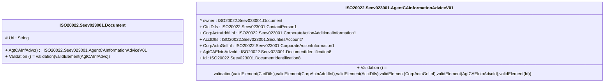

# seev.023.001.01-physical

> The tables below contain descriptions of the members of each Element. 
> The first column indicates the type of the member:
> A ‘#’ indicates that the field is a key to the element, and a ‘+’ indicates that the field is a value.
> The ‘*’ column contains a description for the element member.  
> The ‘@’ column contains any properties for the member.
> The ‘=’ column contains calculated values; or in the case of an enum, the serialized value.

---

## EntityImpl ISO20022.Seev023001.Document

| |Name|Type|*|@|=|
|-|-|-|-|-|-|
|#|Uri|String||XmlIgnore(), JsonIgnore()||
|+|AgtCAInfAdvc|ISO20022.Seev023001.AgentCAInformationAdviceV01||XmlElement()||
||Validation|Some(String)||XmlIgnore(), JsonIgnore()|validation(validElement(AgtCAInfAdvc))|

---

## AspectImpl ISO20022.Seev023001.AgentCAInformationAdviceV01

| |Name|Type|*|@|=|
|-|-|-|-|-|-|
|#|owner|ISO20022.Seev023001.Document||||
|+|CtctDtls|ISO20022.Seev023001.ContactPerson1||XmlElement()||
|+|CorpActnAddtlInf|ISO20022.Seev023001.CorporateActionAdditionalInformation1||XmlElement()||
|+|AcctDtls|ISO20022.Seev023001.SecuritiesAccount7||XmlElement()||
|+|CorpActnGnlInf|ISO20022.Seev023001.CorporateActionInformation1||XmlElement()||
|+|AgtCAElctnAdvcId|ISO20022.Seev023001.DocumentIdentification8||XmlElement()||
|+|Id|ISO20022.Seev023001.DocumentIdentification8||XmlElement()||
||Validation|Some(String)||XmlIgnore(), JsonIgnore()|validation(validElement(CtctDtls),validElement(CorpActnAddtlInf),validElement(AcctDtls),validElement(CorpActnGnlInf),validElement(AgtCAElctnAdvcId),validElement(Id))|

