# seev.023.001.01

```mermaid
classDiagram
    class Hiperspace.Edge {
        # From  : Hiperspace.Node
        # To  : Hiperspace.Node
        # TypeName  : String
        + Name  : String
    }
    class ISO20022.Seev023001.ActiveCurrencyAndAmount {
        + Value  : Decimal
        + Ccy  : String
    }
    class ISO20022.Seev023001.AddressType2Code {
        DLVY = 1
        MLTO = 2
        BIZZ = 3
        HOME = 4
        PBOX = 5
        ADDR = 6
    }
    class ISO20022.Seev023001.AgentCAInformationAdviceV01 {
        + CtctDtls  : ISO20022.Seev023001.ContactPerson1
        + CorpActnAddtlInf  : ISO20022.Seev023001.CorporateActionAdditionalInformation1
        + AcctDtls  : ISO20022.Seev023001.SecuritiesAccount7
        + CorpActnGnlInf  : ISO20022.Seev023001.CorporateActionInformation1
        + AgtCAElctnAdvcId  : ISO20022.Seev023001.DocumentIdentification8
        + Id  : ISO20022.Seev023001.DocumentIdentification8
    }
    ISO20022.Seev023001.AgentCAInformationAdviceV01 *-- ISO20022.Seev023001.ContactPerson1
    ISO20022.Seev023001.AgentCAInformationAdviceV01 *-- ISO20022.Seev023001.CorporateActionAdditionalInformation1
    ISO20022.Seev023001.AgentCAInformationAdviceV01 *-- ISO20022.Seev023001.SecuritiesAccount7
    ISO20022.Seev023001.AgentCAInformationAdviceV01 *-- ISO20022.Seev023001.CorporateActionInformation1
    ISO20022.Seev023001.AgentCAInformationAdviceV01 *-- ISO20022.Seev023001.DocumentIdentification8
    ISO20022.Seev023001.AgentCAInformationAdviceV01 *-- ISO20022.Seev023001.DocumentIdentification8
    class ISO20022.Seev023001.AlternateSecurityIdentification3 {
        + PrtryIdSrc  : String
        + DmstIdSrc  : String
        + Id  : String
    }
    class ISO20022.Seev023001.BeneficialOwner1 {
        + ElctdSctiesQty  : ISO20022.Seev023001.UnitOrFaceAmount1Choice
        + SctyId  : ISO20022.Seev023001.SecurityIdentification7
        + DclrtnDtls  : String
        + CertfctnTp  : ISO20022.Seev023001.BeneficiaryCertificationType1FormatChoice
        + CertfctnInd  : String
        + NonDmclCtry  : String
        + DmclCtry  : String
        + Ntlty  : String
        + AddtlId  : ISO20022.Seev023001.GenericIdentification16
        + BnfclOwnrId  : ISO20022.Seev023001.PartyIdentification2Choice
    }
    ISO20022.Seev023001.BeneficialOwner1 *-- ISO20022.Seev023001.UnitOrFaceAmount1Choice
    ISO20022.Seev023001.BeneficialOwner1 *-- ISO20022.Seev023001.SecurityIdentification7
    ISO20022.Seev023001.BeneficialOwner1 *-- ISO20022.Seev023001.BeneficiaryCertificationType1FormatChoice
    ISO20022.Seev023001.BeneficialOwner1 *-- ISO20022.Seev023001.GenericIdentification16
    ISO20022.Seev023001.BeneficialOwner1 *-- ISO20022.Seev023001.PartyIdentification2Choice
    class ISO20022.Seev023001.BeneficiaryCertificationType1Code {
        NCOM = 1
        TRBD = 2
        QIBB = 3
        FULL = 4
        DOMI = 5
        ACCI = 6
    }
    class ISO20022.Seev023001.BeneficiaryCertificationType1FormatChoice {
        + Prtry  : ISO20022.Seev023001.GenericIdentification13
        + Cd  : String
    }
    ISO20022.Seev023001.BeneficiaryCertificationType1FormatChoice *-- ISO20022.Seev023001.GenericIdentification13
    class ISO20022.Seev023001.CashAccountIdentification1Choice {
        + DmstAcct  : ISO20022.Seev023001.SimpleIdentificationInformation
        + UPIC  : String
        + BBAN  : String
        + IBAN  : String
    }
    ISO20022.Seev023001.CashAccountIdentification1Choice *-- ISO20022.Seev023001.SimpleIdentificationInformation
    class ISO20022.Seev023001.ContactIdentification4 {
        + EmailAdr  : String
        + FaxNb  : String
        + PhneNb  : String
        + Role  : String
        + GvnNm  : String
        + NmPrfx  : String
        + Nm  : String
    }
    class ISO20022.Seev023001.ContactPerson1 {
        + InstnId  : ISO20022.Seev023001.PartyIdentification2Choice
        + CtctPrsn  : ISO20022.Seev023001.ContactIdentification4
    }
    ISO20022.Seev023001.ContactPerson1 *-- ISO20022.Seev023001.PartyIdentification2Choice
    ISO20022.Seev023001.ContactPerson1 *-- ISO20022.Seev023001.ContactIdentification4
    class ISO20022.Seev023001.CorporateActionAdditionalInformation1 {
        + AddtlInstr  : String
        + DlvryDtls  : global::System.Collections.Generic.List~ISO20022.Seev023001.ProceedsDelivery1~
        + CertfctnTp  : ISO20022.Seev023001.BeneficiaryCertificationType1FormatChoice
        + CertfctnInd  : String
        + RcvrId  : ISO20022.Seev023001.PartyIdentification2Choice
        + RegnDtls  : String
        + BnfclOwnrDtls  : global::System.Collections.Generic.List~ISO20022.Seev023001.BeneficialOwner1~
    }
    ISO20022.Seev023001.CorporateActionAdditionalInformation1 *-- ISO20022.Seev023001.ProceedsDelivery1
    ISO20022.Seev023001.CorporateActionAdditionalInformation1 *-- ISO20022.Seev023001.BeneficiaryCertificationType1FormatChoice
    ISO20022.Seev023001.CorporateActionAdditionalInformation1 *-- ISO20022.Seev023001.PartyIdentification2Choice
    ISO20022.Seev023001.CorporateActionAdditionalInformation1 *-- ISO20022.Seev023001.BeneficialOwner1
    class ISO20022.Seev023001.CorporateActionEventProcessingType1Code {
        REOR = 1
        DISN = 2
        GENL = 3
    }
    class ISO20022.Seev023001.CorporateActionEventProcessingType1FormatChoice {
        + Prtry  : ISO20022.Seev023001.GenericIdentification13
        + Cd  : String
    }
    ISO20022.Seev023001.CorporateActionEventProcessingType1FormatChoice *-- ISO20022.Seev023001.GenericIdentification13
    class ISO20022.Seev023001.CorporateActionEventType2Code {
        OTHR = 1
        WTRC = 2
        WRTH = 3
        TREC = 4
        TEND = 5
        SUSP = 6
        SPLR = 7
        SPLF = 8
        SOFF = 9
        SMAL = 10
        SHPR = 11
        RHTS = 12
        RHDI = 13
        REMK = 14
        REDO = 15
        REDM = 16
        PRIO = 17
        PRII = 18
        PRED = 19
        PPMT = 20
        PLAC = 21
        PINK = 22
        PDEF = 23
        PCAL = 24
        PARI = 25
        ODLT = 26
        MRGR = 27
        MCAL = 28
        LIQU = 29
        INTR = 30
        INCR = 31
        EXWA = 32
        EXTM = 33
        EXRI = 34
        EXOF = 35
        DVSE = 36
        DVSC = 37
        DVOP = 38
        DVCA = 39
        DTCH = 40
        DSCL = 41
        DRIP = 42
        DRAW = 43
        DLST = 44
        DFLT = 45
        DETI = 46
        DECR = 47
        COOP = 48
        CONV = 49
        CONS = 50
        CLSA = 51
        CHAN = 52
        CERT = 53
        CAPI = 54
        CAPG = 55
        BRUP = 56
        BPUT = 57
        BONU = 58
        BIDS = 59
        ATTI = 60
        ACTV = 61
    }
    class ISO20022.Seev023001.CorporateActionEventType2FormatChoice {
        + Prtry  : ISO20022.Seev023001.GenericIdentification13
        + Cd  : String
    }
    ISO20022.Seev023001.CorporateActionEventType2FormatChoice *-- ISO20022.Seev023001.GenericIdentification13
    class ISO20022.Seev023001.CorporateActionInformation1 {
        + UndrlygScty  : ISO20022.Seev023001.FinancialInstrumentDescription3
        + EvtPrcgTp  : ISO20022.Seev023001.CorporateActionEventProcessingType1FormatChoice
        + MndtryVlntryEvtTp  : ISO20022.Seev023001.CorporateActionMandatoryVoluntary1FormatChoice
        + EvtTp  : ISO20022.Seev023001.CorporateActionEventType2FormatChoice
        + CorpActnPrcgId  : String
        + IssrCorpActnId  : String
        + AgtId  : ISO20022.Seev023001.PartyIdentification2Choice
    }
    ISO20022.Seev023001.CorporateActionInformation1 *-- ISO20022.Seev023001.FinancialInstrumentDescription3
    ISO20022.Seev023001.CorporateActionInformation1 *-- ISO20022.Seev023001.CorporateActionEventProcessingType1FormatChoice
    ISO20022.Seev023001.CorporateActionInformation1 *-- ISO20022.Seev023001.CorporateActionMandatoryVoluntary1FormatChoice
    ISO20022.Seev023001.CorporateActionInformation1 *-- ISO20022.Seev023001.CorporateActionEventType2FormatChoice
    ISO20022.Seev023001.CorporateActionInformation1 *-- ISO20022.Seev023001.PartyIdentification2Choice
    class ISO20022.Seev023001.CorporateActionMandatoryVoluntary1Code {
        VOLU = 1
        CHOS = 2
        MAND = 3
    }
    class ISO20022.Seev023001.CorporateActionMandatoryVoluntary1FormatChoice {
        + Prtry  : ISO20022.Seev023001.GenericIdentification13
        + Cd  : String
    }
    ISO20022.Seev023001.CorporateActionMandatoryVoluntary1FormatChoice *-- ISO20022.Seev023001.GenericIdentification13
    class ISO20022.Seev023001.DocumentIdentification8 {
        + CreDtTm  : DateTime
        + Id  : String
    }
    class ISO20022.Seev023001.FinancialInstrumentDescription3 {
        + SfkpgPlc  : ISO20022.Seev023001.PartyIdentification2Choice
        + PlcOfListg  : String
        + SctyId  : ISO20022.Seev023001.SecurityIdentification7
    }
    ISO20022.Seev023001.FinancialInstrumentDescription3 *-- ISO20022.Seev023001.PartyIdentification2Choice
    ISO20022.Seev023001.FinancialInstrumentDescription3 *-- ISO20022.Seev023001.SecurityIdentification7
    class ISO20022.Seev023001.GenericIdentification1 {
        + Issr  : String
        + SchmeNm  : String
        + Id  : String
    }
    class ISO20022.Seev023001.GenericIdentification13 {
        + Issr  : String
        + SchmeNm  : String
        + Id  : String
    }
    class ISO20022.Seev023001.GenericIdentification16 {
        + Issr  : String
        + IdTp  : ISO20022.Seev023001.PersonIdentificationType3Choice
        + Id  : String
    }
    ISO20022.Seev023001.GenericIdentification16 *-- ISO20022.Seev023001.PersonIdentificationType3Choice
    class ISO20022.Seev023001.NameAndAddress5 {
        + Adr  : ISO20022.Seev023001.PostalAddress1
        + Nm  : String
    }
    ISO20022.Seev023001.NameAndAddress5 *-- ISO20022.Seev023001.PostalAddress1
    class ISO20022.Seev023001.NamePrefix1Code {
        MADM = 1
        MISS = 2
        MIST = 3
        DOCT = 4
    }
    class ISO20022.Seev023001.PartyIdentification2Choice {
        + NmAndAdr  : ISO20022.Seev023001.NameAndAddress5
        + PrtryId  : ISO20022.Seev023001.GenericIdentification1
        + BICOrBEI  : String
    }
    ISO20022.Seev023001.PartyIdentification2Choice *-- ISO20022.Seev023001.NameAndAddress5
    ISO20022.Seev023001.PartyIdentification2Choice *-- ISO20022.Seev023001.GenericIdentification1
    class ISO20022.Seev023001.PersonIdentificationType3Choice {
        + Prtry  : ISO20022.Seev023001.GenericIdentification13
        + Cd  : String
    }
    ISO20022.Seev023001.PersonIdentificationType3Choice *-- ISO20022.Seev023001.GenericIdentification13
    class ISO20022.Seev023001.PersonIdentificationType3Code {
        TXID = 1
        FINN = 2
        DRLC = 3
        EMID = 4
        CCPT = 5
        ARNU = 6
    }
    class ISO20022.Seev023001.PostalAddress1 {
        + Ctry  : String
        + CtrySubDvsn  : String
        + TwnNm  : String
        + PstCd  : String
        + BldgNb  : String
        + StrtNm  : String
        + AdrLine  : global::System.Collections.Generic.List~String~
        + AdrTp  : String
    }
    class ISO20022.Seev023001.ProceedsDelivery1 {
        + AcctSvcrId  : ISO20022.Seev023001.PartyIdentification2Choice
        + AcctOwnrId  : ISO20022.Seev023001.PartyIdentification2Choice
        + CshAcctId  : ISO20022.Seev023001.CashAccountIdentification1Choice
        + SctiesAcctId  : String
    }
    ISO20022.Seev023001.ProceedsDelivery1 *-- ISO20022.Seev023001.PartyIdentification2Choice
    ISO20022.Seev023001.ProceedsDelivery1 *-- ISO20022.Seev023001.PartyIdentification2Choice
    ISO20022.Seev023001.ProceedsDelivery1 *-- ISO20022.Seev023001.CashAccountIdentification1Choice
    class ISO20022.Seev023001.SecuritiesAccount7 {
        + AcctId  : String
        + AcctOwnrId  : ISO20022.Seev023001.PartyIdentification2Choice
    }
    ISO20022.Seev023001.SecuritiesAccount7 *-- ISO20022.Seev023001.PartyIdentification2Choice
    class ISO20022.Seev023001.SecurityIdentification7 {
        + Desc  : String
        + OthrId  : ISO20022.Seev023001.AlternateSecurityIdentification3
        + ISIN  : String
    }
    ISO20022.Seev023001.SecurityIdentification7 *-- ISO20022.Seev023001.AlternateSecurityIdentification3
    class ISO20022.Seev023001.SimpleIdentificationInformation {
        + Id  : String
    }
    class ISO20022.Seev023001.UnitOrFaceAmount1Choice {
        + FaceAmt  : ISO20022.Seev023001.ActiveCurrencyAndAmount
        + Unit  : Decimal
    }
    ISO20022.Seev023001.UnitOrFaceAmount1Choice *-- ISO20022.Seev023001.ActiveCurrencyAndAmount
    class Hiperspace.Node {
        # SKey  : String
        + TypeName  : String
        + Name  : String
        + Froms (From = this) : Hiperspace.Edge
        + Tos (To = this) : Hiperspace.Edge
    }
```

> The tables below contain descriptions of the members of each Element. 
> The first column indicates the type of the member:
> A ‘#’ indicates that the field is a key to the element, and a ‘+’ indicates that the field is a value.
> The ‘*’ column contains a description for the element member.  
> The ‘@’ column contains any properties for the member.
> The ‘=’ column contains calculated values; or in the case of an enum, the serialized value.

---

## View Hiperspace.Edge
edge between nodes

| |Name|Type|*|@|=|
|-|-|-|-|-|-|
|#|From|Hiperspace.Node||||
|#|To|Hiperspace.Node||||
|#|TypeName|String||||
|+|Name|String||||

---

## Value ISO20022.Seev023001.ActiveCurrencyAndAmount

| |Name|Type|*|@|=|
|-|-|-|-|-|-|
|+|Value|Decimal||XmlElement()||
|+|Ccy|String||XmlAttribute()||
||Validation|Some(String)||XmlIgnore(), JsonIgnore()|validation(validRequired("""Value""",Value),validRequired("""Ccy""",Ccy),validPattern("""Ccy""",Ccy,"""[A-Z]{3,3}"""))|

---

## Enum ISO20022.Seev023001.AddressType2Code

| |Name|Type|*|@|=|
|-|-|-|-|-|-|
||DLVY|Int32||XmlEnum("""DLVY""")|1|
||MLTO|Int32||XmlEnum("""MLTO""")|2|
||BIZZ|Int32||XmlEnum("""BIZZ""")|3|
||HOME|Int32||XmlEnum("""HOME""")|4|
||PBOX|Int32||XmlEnum("""PBOX""")|5|
||ADDR|Int32||XmlEnum("""ADDR""")|6|

---

## Aspect ISO20022.Seev023001.AgentCAInformationAdviceV01

| |Name|Type|*|@|=|
|-|-|-|-|-|-|
|+|CtctDtls|ISO20022.Seev023001.ContactPerson1||XmlElement()||
|+|CorpActnAddtlInf|ISO20022.Seev023001.CorporateActionAdditionalInformation1||XmlElement()||
|+|AcctDtls|ISO20022.Seev023001.SecuritiesAccount7||XmlElement()||
|+|CorpActnGnlInf|ISO20022.Seev023001.CorporateActionInformation1||XmlElement()||
|+|AgtCAElctnAdvcId|ISO20022.Seev023001.DocumentIdentification8||XmlElement()||
|+|Id|ISO20022.Seev023001.DocumentIdentification8||XmlElement()||
||Validation|Some(String)||XmlIgnore(), JsonIgnore()|validation(validElement(CtctDtls),validElement(CorpActnAddtlInf),validElement(AcctDtls),validElement(CorpActnGnlInf),validElement(AgtCAElctnAdvcId),validElement(Id))|

---

## Value ISO20022.Seev023001.AlternateSecurityIdentification3

| |Name|Type|*|@|=|
|-|-|-|-|-|-|
|+|PrtryIdSrc|String||XmlElement()||
|+|DmstIdSrc|String||XmlElement()||
|+|Id|String||XmlElement()||
||Validation|Some(String)||XmlIgnore(), JsonIgnore()|validation(validPattern("""DmstIdSrc""",DmstIdSrc,"""[A-Z]{2,2}"""),validChoice(PrtryIdSrc,DmstIdSrc,Id))|

---

## Value ISO20022.Seev023001.BeneficialOwner1

| |Name|Type|*|@|=|
|-|-|-|-|-|-|
|+|ElctdSctiesQty|ISO20022.Seev023001.UnitOrFaceAmount1Choice||XmlElement()||
|+|SctyId|ISO20022.Seev023001.SecurityIdentification7||XmlElement()||
|+|DclrtnDtls|String||XmlElement()||
|+|CertfctnTp|ISO20022.Seev023001.BeneficiaryCertificationType1FormatChoice||XmlElement()||
|+|CertfctnInd|String||XmlElement()||
|+|NonDmclCtry|String||XmlElement()||
|+|DmclCtry|String||XmlElement()||
|+|Ntlty|String||XmlElement()||
|+|AddtlId|ISO20022.Seev023001.GenericIdentification16||XmlElement()||
|+|BnfclOwnrId|ISO20022.Seev023001.PartyIdentification2Choice||XmlElement()||
||Validation|Some(String)||XmlIgnore(), JsonIgnore()|validation(validElement(ElctdSctiesQty),validElement(SctyId),validElement(CertfctnTp),validPattern("""NonDmclCtry""",NonDmclCtry,"""[A-Z]{2,2}"""),validPattern("""DmclCtry""",DmclCtry,"""[A-Z]{2,2}"""),validPattern("""Ntlty""",Ntlty,"""[A-Z]{2,2}"""),validElement(AddtlId),validElement(BnfclOwnrId))|

---

## Enum ISO20022.Seev023001.BeneficiaryCertificationType1Code

| |Name|Type|*|@|=|
|-|-|-|-|-|-|
||NCOM|Int32||XmlEnum("""NCOM""")|1|
||TRBD|Int32||XmlEnum("""TRBD""")|2|
||QIBB|Int32||XmlEnum("""QIBB""")|3|
||FULL|Int32||XmlEnum("""FULL""")|4|
||DOMI|Int32||XmlEnum("""DOMI""")|5|
||ACCI|Int32||XmlEnum("""ACCI""")|6|

---

## Value ISO20022.Seev023001.BeneficiaryCertificationType1FormatChoice

| |Name|Type|*|@|=|
|-|-|-|-|-|-|
|+|Prtry|ISO20022.Seev023001.GenericIdentification13||XmlElement()||
|+|Cd|String||XmlElement()||
||Validation|Some(String)||XmlIgnore(), JsonIgnore()|validation(validElement(Prtry),validChoice(Prtry,Cd))|

---

## Value ISO20022.Seev023001.CashAccountIdentification1Choice

| |Name|Type|*|@|=|
|-|-|-|-|-|-|
|+|DmstAcct|ISO20022.Seev023001.SimpleIdentificationInformation||XmlElement()||
|+|UPIC|String||XmlElement()||
|+|BBAN|String||XmlElement()||
|+|IBAN|String||XmlElement()||
||Validation|Some(String)||XmlIgnore(), JsonIgnore()|validation(validElement(DmstAcct),validPattern("""UPIC""",UPIC,"""[0-9]{8,17}"""),validPattern("""BBAN""",BBAN,"""[a-zA-Z0-9]{1,30}"""),validPattern("""IBAN""",IBAN,"""[a-zA-Z]{2,2}[0-9]{2,2}[a-zA-Z0-9]{1,30}"""),validChoice(DmstAcct,UPIC,BBAN,IBAN))|

---

## Value ISO20022.Seev023001.ContactIdentification4

| |Name|Type|*|@|=|
|-|-|-|-|-|-|
|+|EmailAdr|String||XmlElement()||
|+|FaxNb|String||XmlElement()||
|+|PhneNb|String||XmlElement()||
|+|Role|String||XmlElement()||
|+|GvnNm|String||XmlElement()||
|+|NmPrfx|String||XmlElement()||
|+|Nm|String||XmlElement()||
||Validation|Some(String)||XmlIgnore(), JsonIgnore()|validation(validPattern("""FaxNb""",FaxNb,"""\+[0-9]{1,3}-[0-9()+\-]{1,30}"""),validPattern("""PhneNb""",PhneNb,"""\+[0-9]{1,3}-[0-9()+\-]{1,30}"""))|

---

## Value ISO20022.Seev023001.ContactPerson1

| |Name|Type|*|@|=|
|-|-|-|-|-|-|
|+|InstnId|ISO20022.Seev023001.PartyIdentification2Choice||XmlElement()||
|+|CtctPrsn|ISO20022.Seev023001.ContactIdentification4||XmlElement()||
||Validation|Some(String)||XmlIgnore(), JsonIgnore()|validation(validElement(InstnId),validElement(CtctPrsn))|

---

## Value ISO20022.Seev023001.CorporateActionAdditionalInformation1

| |Name|Type|*|@|=|
|-|-|-|-|-|-|
|+|AddtlInstr|String||XmlElement()||
|+|DlvryDtls|global::System.Collections.Generic.List<ISO20022.Seev023001.ProceedsDelivery1>||XmlElement()||
|+|CertfctnTp|ISO20022.Seev023001.BeneficiaryCertificationType1FormatChoice||XmlElement()||
|+|CertfctnInd|String||XmlElement()||
|+|RcvrId|ISO20022.Seev023001.PartyIdentification2Choice||XmlElement()||
|+|RegnDtls|String||XmlElement()||
|+|BnfclOwnrDtls|global::System.Collections.Generic.List<ISO20022.Seev023001.BeneficialOwner1>||XmlElement()||
||Validation|Some(String)||XmlIgnore(), JsonIgnore()|validation(validList("""DlvryDtls""",DlvryDtls),validElement(DlvryDtls),validElement(CertfctnTp),validElement(RcvrId),validList("""BnfclOwnrDtls""",BnfclOwnrDtls),validElement(BnfclOwnrDtls))|

---

## Enum ISO20022.Seev023001.CorporateActionEventProcessingType1Code

| |Name|Type|*|@|=|
|-|-|-|-|-|-|
||REOR|Int32||XmlEnum("""REOR""")|1|
||DISN|Int32||XmlEnum("""DISN""")|2|
||GENL|Int32||XmlEnum("""GENL""")|3|

---

## Value ISO20022.Seev023001.CorporateActionEventProcessingType1FormatChoice

| |Name|Type|*|@|=|
|-|-|-|-|-|-|
|+|Prtry|ISO20022.Seev023001.GenericIdentification13||XmlElement()||
|+|Cd|String||XmlElement()||
||Validation|Some(String)||XmlIgnore(), JsonIgnore()|validation(validElement(Prtry),validChoice(Prtry,Cd))|

---

## Enum ISO20022.Seev023001.CorporateActionEventType2Code

| |Name|Type|*|@|=|
|-|-|-|-|-|-|
||OTHR|Int32||XmlEnum("""OTHR""")|1|
||WTRC|Int32||XmlEnum("""WTRC""")|2|
||WRTH|Int32||XmlEnum("""WRTH""")|3|
||TREC|Int32||XmlEnum("""TREC""")|4|
||TEND|Int32||XmlEnum("""TEND""")|5|
||SUSP|Int32||XmlEnum("""SUSP""")|6|
||SPLR|Int32||XmlEnum("""SPLR""")|7|
||SPLF|Int32||XmlEnum("""SPLF""")|8|
||SOFF|Int32||XmlEnum("""SOFF""")|9|
||SMAL|Int32||XmlEnum("""SMAL""")|10|
||SHPR|Int32||XmlEnum("""SHPR""")|11|
||RHTS|Int32||XmlEnum("""RHTS""")|12|
||RHDI|Int32||XmlEnum("""RHDI""")|13|
||REMK|Int32||XmlEnum("""REMK""")|14|
||REDO|Int32||XmlEnum("""REDO""")|15|
||REDM|Int32||XmlEnum("""REDM""")|16|
||PRIO|Int32||XmlEnum("""PRIO""")|17|
||PRII|Int32||XmlEnum("""PRII""")|18|
||PRED|Int32||XmlEnum("""PRED""")|19|
||PPMT|Int32||XmlEnum("""PPMT""")|20|
||PLAC|Int32||XmlEnum("""PLAC""")|21|
||PINK|Int32||XmlEnum("""PINK""")|22|
||PDEF|Int32||XmlEnum("""PDEF""")|23|
||PCAL|Int32||XmlEnum("""PCAL""")|24|
||PARI|Int32||XmlEnum("""PARI""")|25|
||ODLT|Int32||XmlEnum("""ODLT""")|26|
||MRGR|Int32||XmlEnum("""MRGR""")|27|
||MCAL|Int32||XmlEnum("""MCAL""")|28|
||LIQU|Int32||XmlEnum("""LIQU""")|29|
||INTR|Int32||XmlEnum("""INTR""")|30|
||INCR|Int32||XmlEnum("""INCR""")|31|
||EXWA|Int32||XmlEnum("""EXWA""")|32|
||EXTM|Int32||XmlEnum("""EXTM""")|33|
||EXRI|Int32||XmlEnum("""EXRI""")|34|
||EXOF|Int32||XmlEnum("""EXOF""")|35|
||DVSE|Int32||XmlEnum("""DVSE""")|36|
||DVSC|Int32||XmlEnum("""DVSC""")|37|
||DVOP|Int32||XmlEnum("""DVOP""")|38|
||DVCA|Int32||XmlEnum("""DVCA""")|39|
||DTCH|Int32||XmlEnum("""DTCH""")|40|
||DSCL|Int32||XmlEnum("""DSCL""")|41|
||DRIP|Int32||XmlEnum("""DRIP""")|42|
||DRAW|Int32||XmlEnum("""DRAW""")|43|
||DLST|Int32||XmlEnum("""DLST""")|44|
||DFLT|Int32||XmlEnum("""DFLT""")|45|
||DETI|Int32||XmlEnum("""DETI""")|46|
||DECR|Int32||XmlEnum("""DECR""")|47|
||COOP|Int32||XmlEnum("""COOP""")|48|
||CONV|Int32||XmlEnum("""CONV""")|49|
||CONS|Int32||XmlEnum("""CONS""")|50|
||CLSA|Int32||XmlEnum("""CLSA""")|51|
||CHAN|Int32||XmlEnum("""CHAN""")|52|
||CERT|Int32||XmlEnum("""CERT""")|53|
||CAPI|Int32||XmlEnum("""CAPI""")|54|
||CAPG|Int32||XmlEnum("""CAPG""")|55|
||BRUP|Int32||XmlEnum("""BRUP""")|56|
||BPUT|Int32||XmlEnum("""BPUT""")|57|
||BONU|Int32||XmlEnum("""BONU""")|58|
||BIDS|Int32||XmlEnum("""BIDS""")|59|
||ATTI|Int32||XmlEnum("""ATTI""")|60|
||ACTV|Int32||XmlEnum("""ACTV""")|61|

---

## Value ISO20022.Seev023001.CorporateActionEventType2FormatChoice

| |Name|Type|*|@|=|
|-|-|-|-|-|-|
|+|Prtry|ISO20022.Seev023001.GenericIdentification13||XmlElement()||
|+|Cd|String||XmlElement()||
||Validation|Some(String)||XmlIgnore(), JsonIgnore()|validation(validElement(Prtry),validChoice(Prtry,Cd))|

---

## Value ISO20022.Seev023001.CorporateActionInformation1

| |Name|Type|*|@|=|
|-|-|-|-|-|-|
|+|UndrlygScty|ISO20022.Seev023001.FinancialInstrumentDescription3||XmlElement()||
|+|EvtPrcgTp|ISO20022.Seev023001.CorporateActionEventProcessingType1FormatChoice||XmlElement()||
|+|MndtryVlntryEvtTp|ISO20022.Seev023001.CorporateActionMandatoryVoluntary1FormatChoice||XmlElement()||
|+|EvtTp|ISO20022.Seev023001.CorporateActionEventType2FormatChoice||XmlElement()||
|+|CorpActnPrcgId|String||XmlElement()||
|+|IssrCorpActnId|String||XmlElement()||
|+|AgtId|ISO20022.Seev023001.PartyIdentification2Choice||XmlElement()||
||Validation|Some(String)||XmlIgnore(), JsonIgnore()|validation(validElement(UndrlygScty),validElement(EvtPrcgTp),validElement(MndtryVlntryEvtTp),validElement(EvtTp),validElement(AgtId))|

---

## Enum ISO20022.Seev023001.CorporateActionMandatoryVoluntary1Code

| |Name|Type|*|@|=|
|-|-|-|-|-|-|
||VOLU|Int32||XmlEnum("""VOLU""")|1|
||CHOS|Int32||XmlEnum("""CHOS""")|2|
||MAND|Int32||XmlEnum("""MAND""")|3|

---

## Value ISO20022.Seev023001.CorporateActionMandatoryVoluntary1FormatChoice

| |Name|Type|*|@|=|
|-|-|-|-|-|-|
|+|Prtry|ISO20022.Seev023001.GenericIdentification13||XmlElement()||
|+|Cd|String||XmlElement()||
||Validation|Some(String)||XmlIgnore(), JsonIgnore()|validation(validElement(Prtry),validChoice(Prtry,Cd))|

---

## Type ISO20022.Seev023001.Document

| |Name|Type|*|@|=|
|-|-|-|-|-|-|
|+|AgtCAInfAdvc|ISO20022.Seev023001.AgentCAInformationAdviceV01||XmlElement()||
||Validation|Some(String)||XmlIgnore(), JsonIgnore()|validation(validElement(AgtCAInfAdvc))|

---

## Value ISO20022.Seev023001.DocumentIdentification8

| |Name|Type|*|@|=|
|-|-|-|-|-|-|
|+|CreDtTm|DateTime||XmlElement()||
|+|Id|String||XmlElement()||
||Validation|Some(String)||XmlIgnore(), JsonIgnore()|""|

---

## Value ISO20022.Seev023001.FinancialInstrumentDescription3

| |Name|Type|*|@|=|
|-|-|-|-|-|-|
|+|SfkpgPlc|ISO20022.Seev023001.PartyIdentification2Choice||XmlElement()||
|+|PlcOfListg|String||XmlElement()||
|+|SctyId|ISO20022.Seev023001.SecurityIdentification7||XmlElement()||
||Validation|Some(String)||XmlIgnore(), JsonIgnore()|validation(validElement(SfkpgPlc),validPattern("""PlcOfListg""",PlcOfListg,"""[A-Z0-9]{4,4}"""),validElement(SctyId))|

---

## Value ISO20022.Seev023001.GenericIdentification1

| |Name|Type|*|@|=|
|-|-|-|-|-|-|
|+|Issr|String||XmlElement()||
|+|SchmeNm|String||XmlElement()||
|+|Id|String||XmlElement()||
||Validation|Some(String)||XmlIgnore(), JsonIgnore()|""|

---

## Value ISO20022.Seev023001.GenericIdentification13

| |Name|Type|*|@|=|
|-|-|-|-|-|-|
|+|Issr|String||XmlElement()||
|+|SchmeNm|String||XmlElement()||
|+|Id|String||XmlElement()||
||Validation|Some(String)||XmlIgnore(), JsonIgnore()|validation(validPattern("""Id""",Id,"""[a-zA-Z0-9]{1,4}"""))|

---

## Value ISO20022.Seev023001.GenericIdentification16

| |Name|Type|*|@|=|
|-|-|-|-|-|-|
|+|Issr|String||XmlElement()||
|+|IdTp|ISO20022.Seev023001.PersonIdentificationType3Choice||XmlElement()||
|+|Id|String||XmlElement()||
||Validation|Some(String)||XmlIgnore(), JsonIgnore()|validation(validElement(IdTp))|

---

## Value ISO20022.Seev023001.NameAndAddress5

| |Name|Type|*|@|=|
|-|-|-|-|-|-|
|+|Adr|ISO20022.Seev023001.PostalAddress1||XmlElement()||
|+|Nm|String||XmlElement()||
||Validation|Some(String)||XmlIgnore(), JsonIgnore()|validation(validElement(Adr))|

---

## Enum ISO20022.Seev023001.NamePrefix1Code

| |Name|Type|*|@|=|
|-|-|-|-|-|-|
||MADM|Int32||XmlEnum("""MADM""")|1|
||MISS|Int32||XmlEnum("""MISS""")|2|
||MIST|Int32||XmlEnum("""MIST""")|3|
||DOCT|Int32||XmlEnum("""DOCT""")|4|

---

## Value ISO20022.Seev023001.PartyIdentification2Choice

| |Name|Type|*|@|=|
|-|-|-|-|-|-|
|+|NmAndAdr|ISO20022.Seev023001.NameAndAddress5||XmlElement()||
|+|PrtryId|ISO20022.Seev023001.GenericIdentification1||XmlElement()||
|+|BICOrBEI|String||XmlElement()||
||Validation|Some(String)||XmlIgnore(), JsonIgnore()|validation(validElement(NmAndAdr),validElement(PrtryId),validPattern("""BICOrBEI""",BICOrBEI,"""[A-Z]{6,6}[A-Z2-9][A-NP-Z0-9]([A-Z0-9]{3,3}){0,1}"""),validChoice(NmAndAdr,PrtryId,BICOrBEI))|

---

## Value ISO20022.Seev023001.PersonIdentificationType3Choice

| |Name|Type|*|@|=|
|-|-|-|-|-|-|
|+|Prtry|ISO20022.Seev023001.GenericIdentification13||XmlElement()||
|+|Cd|String||XmlElement()||
||Validation|Some(String)||XmlIgnore(), JsonIgnore()|validation(validElement(Prtry),validChoice(Prtry,Cd))|

---

## Enum ISO20022.Seev023001.PersonIdentificationType3Code

| |Name|Type|*|@|=|
|-|-|-|-|-|-|
||TXID|Int32||XmlEnum("""TXID""")|1|
||FINN|Int32||XmlEnum("""FINN""")|2|
||DRLC|Int32||XmlEnum("""DRLC""")|3|
||EMID|Int32||XmlEnum("""EMID""")|4|
||CCPT|Int32||XmlEnum("""CCPT""")|5|
||ARNU|Int32||XmlEnum("""ARNU""")|6|

---

## Value ISO20022.Seev023001.PostalAddress1

| |Name|Type|*|@|=|
|-|-|-|-|-|-|
|+|Ctry|String||XmlElement()||
|+|CtrySubDvsn|String||XmlElement()||
|+|TwnNm|String||XmlElement()||
|+|PstCd|String||XmlElement()||
|+|BldgNb|String||XmlElement()||
|+|StrtNm|String||XmlElement()||
|+|AdrLine|global::System.Collections.Generic.List<String>||XmlElement()||
|+|AdrTp|String||XmlElement()||
||Validation|Some(String)||XmlIgnore(), JsonIgnore()|validation(validPattern("""Ctry""",Ctry,"""[A-Z]{2,2}"""),validListMax("""AdrLine""",AdrLine,5))|

---

## Value ISO20022.Seev023001.ProceedsDelivery1

| |Name|Type|*|@|=|
|-|-|-|-|-|-|
|+|AcctSvcrId|ISO20022.Seev023001.PartyIdentification2Choice||XmlElement()||
|+|AcctOwnrId|ISO20022.Seev023001.PartyIdentification2Choice||XmlElement()||
|+|CshAcctId|ISO20022.Seev023001.CashAccountIdentification1Choice||XmlElement()||
|+|SctiesAcctId|String||XmlElement()||
||Validation|Some(String)||XmlIgnore(), JsonIgnore()|validation(validElement(AcctSvcrId),validElement(AcctOwnrId),validElement(CshAcctId),validChoice(AcctSvcrId,AcctOwnrId,CshAcctId,SctiesAcctId))|

---

## Value ISO20022.Seev023001.SecuritiesAccount7

| |Name|Type|*|@|=|
|-|-|-|-|-|-|
|+|AcctId|String||XmlElement()||
|+|AcctOwnrId|ISO20022.Seev023001.PartyIdentification2Choice||XmlElement()||
||Validation|Some(String)||XmlIgnore(), JsonIgnore()|validation(validElement(AcctOwnrId))|

---

## Value ISO20022.Seev023001.SecurityIdentification7

| |Name|Type|*|@|=|
|-|-|-|-|-|-|
|+|Desc|String||XmlElement()||
|+|OthrId|ISO20022.Seev023001.AlternateSecurityIdentification3||XmlElement()||
|+|ISIN|String||XmlElement()||
||Validation|Some(String)||XmlIgnore(), JsonIgnore()|validation(validElement(OthrId),validPattern("""ISIN""",ISIN,"""[A-Z0-9]{12,12}"""),validChoice(Desc,OthrId,ISIN))|

---

## Value ISO20022.Seev023001.SimpleIdentificationInformation

| |Name|Type|*|@|=|
|-|-|-|-|-|-|
|+|Id|String||XmlElement()||
||Validation|Some(String)||XmlIgnore(), JsonIgnore()|""|

---

## Value ISO20022.Seev023001.UnitOrFaceAmount1Choice

| |Name|Type|*|@|=|
|-|-|-|-|-|-|
|+|FaceAmt|ISO20022.Seev023001.ActiveCurrencyAndAmount||XmlElement()||
|+|Unit|Decimal||XmlElement()||
||Validation|Some(String)||XmlIgnore(), JsonIgnore()|validation(validElement(FaceAmt),validChoice(FaceAmt,Unit))|

---

## View Hiperspace.Node
node in a graph view of data

| |Name|Type|*|@|=|
|-|-|-|-|-|-|
|#|SKey|String||||
|+|TypeName|String||||
|+|Name|String||||
||Froms|Hiperspace.Edge|||From = this|
||Tos|Hiperspace.Edge|||To = this|

