# seev.024.001.01

```mermaid
classDiagram
    class Hiperspace.Edge {
        # From  : Hiperspace.Node
        # To  : Hiperspace.Node
        # TypeName  : String
        + Name  : String
    }
    class ISO20022.Seev024001.ActiveCurrencyAndAmount {
        + Value  : Decimal
        + Ccy  : String
    }
    class ISO20022.Seev024001.AddressType2Code {
        DLVY = 1
        MLTO = 2
        BIZZ = 3
        HOME = 4
        PBOX = 5
        ADDR = 6
    }
    class ISO20022.Seev024001.AgentCAInformationStatusAdviceV01 {
        + InfStsDtls  : ISO20022.Seev024001.CorporateActionInformationStatus1Choice
        + CorpActnAddtlInf  : ISO20022.Seev024001.CorporateActionAdditionalInformation1
        + AgtCAInfAdvcId  : ISO20022.Seev024001.DocumentIdentification8
        + Id  : ISO20022.Seev024001.DocumentIdentification8
    }
    ISO20022.Seev024001.AgentCAInformationStatusAdviceV01 *-- ISO20022.Seev024001.CorporateActionInformationStatus1Choice
    ISO20022.Seev024001.AgentCAInformationStatusAdviceV01 *-- ISO20022.Seev024001.CorporateActionAdditionalInformation1
    ISO20022.Seev024001.AgentCAInformationStatusAdviceV01 *-- ISO20022.Seev024001.DocumentIdentification8
    ISO20022.Seev024001.AgentCAInformationStatusAdviceV01 *-- ISO20022.Seev024001.DocumentIdentification8
    class ISO20022.Seev024001.AlternateSecurityIdentification3 {
        + PrtryIdSrc  : String
        + DmstIdSrc  : String
        + Id  : String
    }
    class ISO20022.Seev024001.BeneficialOwner1 {
        + ElctdSctiesQty  : ISO20022.Seev024001.UnitOrFaceAmount1Choice
        + SctyId  : ISO20022.Seev024001.SecurityIdentification7
        + DclrtnDtls  : String
        + CertfctnTp  : ISO20022.Seev024001.BeneficiaryCertificationType1FormatChoice
        + CertfctnInd  : String
        + NonDmclCtry  : String
        + DmclCtry  : String
        + Ntlty  : String
        + AddtlId  : ISO20022.Seev024001.GenericIdentification16
        + BnfclOwnrId  : ISO20022.Seev024001.PartyIdentification2Choice
    }
    ISO20022.Seev024001.BeneficialOwner1 *-- ISO20022.Seev024001.UnitOrFaceAmount1Choice
    ISO20022.Seev024001.BeneficialOwner1 *-- ISO20022.Seev024001.SecurityIdentification7
    ISO20022.Seev024001.BeneficialOwner1 *-- ISO20022.Seev024001.BeneficiaryCertificationType1FormatChoice
    ISO20022.Seev024001.BeneficialOwner1 *-- ISO20022.Seev024001.GenericIdentification16
    ISO20022.Seev024001.BeneficialOwner1 *-- ISO20022.Seev024001.PartyIdentification2Choice
    class ISO20022.Seev024001.BeneficiaryCertificationType1Code {
        NCOM = 1
        TRBD = 2
        QIBB = 3
        FULL = 4
        DOMI = 5
        ACCI = 6
    }
    class ISO20022.Seev024001.BeneficiaryCertificationType1FormatChoice {
        + Prtry  : ISO20022.Seev024001.GenericIdentification13
        + Cd  : String
    }
    ISO20022.Seev024001.BeneficiaryCertificationType1FormatChoice *-- ISO20022.Seev024001.GenericIdentification13
    class ISO20022.Seev024001.CashAccountIdentification1Choice {
        + DmstAcct  : ISO20022.Seev024001.SimpleIdentificationInformation
        + UPIC  : String
        + BBAN  : String
        + IBAN  : String
    }
    ISO20022.Seev024001.CashAccountIdentification1Choice *-- ISO20022.Seev024001.SimpleIdentificationInformation
    class ISO20022.Seev024001.CorporateActionAdditionalInformation1 {
        + AddtlInstr  : String
        + DlvryDtls  : global::System.Collections.Generic.List~ISO20022.Seev024001.ProceedsDelivery1~
        + CertfctnTp  : ISO20022.Seev024001.BeneficiaryCertificationType1FormatChoice
        + CertfctnInd  : String
        + RcvrId  : ISO20022.Seev024001.PartyIdentification2Choice
        + RegnDtls  : String
        + BnfclOwnrDtls  : global::System.Collections.Generic.List~ISO20022.Seev024001.BeneficialOwner1~
    }
    ISO20022.Seev024001.CorporateActionAdditionalInformation1 *-- ISO20022.Seev024001.ProceedsDelivery1
    ISO20022.Seev024001.CorporateActionAdditionalInformation1 *-- ISO20022.Seev024001.BeneficiaryCertificationType1FormatChoice
    ISO20022.Seev024001.CorporateActionAdditionalInformation1 *-- ISO20022.Seev024001.PartyIdentification2Choice
    ISO20022.Seev024001.CorporateActionAdditionalInformation1 *-- ISO20022.Seev024001.BeneficialOwner1
    class ISO20022.Seev024001.CorporateActionInformationProcessingStatus1 {
        + AddtlInf  : String
        + Sts  : ISO20022.Seev024001.ProcessedStatus5FormatChoice
    }
    ISO20022.Seev024001.CorporateActionInformationProcessingStatus1 *-- ISO20022.Seev024001.ProcessedStatus5FormatChoice
    class ISO20022.Seev024001.CorporateActionInformationRejectedStatus1 {
        + AddtlInf  : String
        + Rsn  : global::System.Collections.Generic.List~ISO20022.Seev024001.RejectionReason15FormatChoice~
    }
    ISO20022.Seev024001.CorporateActionInformationRejectedStatus1 *-- ISO20022.Seev024001.RejectionReason15FormatChoice
    class ISO20022.Seev024001.CorporateActionInformationStatus1Choice {
        + RjctdSts  : ISO20022.Seev024001.CorporateActionInformationRejectedStatus1
        + PrcdSts  : ISO20022.Seev024001.CorporateActionInformationProcessingStatus1
    }
    ISO20022.Seev024001.CorporateActionInformationStatus1Choice *-- ISO20022.Seev024001.CorporateActionInformationRejectedStatus1
    ISO20022.Seev024001.CorporateActionInformationStatus1Choice *-- ISO20022.Seev024001.CorporateActionInformationProcessingStatus1
    class ISO20022.Seev024001.DocumentIdentification8 {
        + CreDtTm  : DateTime
        + Id  : String
    }
    class ISO20022.Seev024001.GenericIdentification1 {
        + Issr  : String
        + SchmeNm  : String
        + Id  : String
    }
    class ISO20022.Seev024001.GenericIdentification13 {
        + Issr  : String
        + SchmeNm  : String
        + Id  : String
    }
    class ISO20022.Seev024001.GenericIdentification16 {
        + Issr  : String
        + IdTp  : ISO20022.Seev024001.PersonIdentificationType3Choice
        + Id  : String
    }
    ISO20022.Seev024001.GenericIdentification16 *-- ISO20022.Seev024001.PersonIdentificationType3Choice
    class ISO20022.Seev024001.NameAndAddress5 {
        + Adr  : ISO20022.Seev024001.PostalAddress1
        + Nm  : String
    }
    ISO20022.Seev024001.NameAndAddress5 *-- ISO20022.Seev024001.PostalAddress1
    class ISO20022.Seev024001.PartyIdentification2Choice {
        + NmAndAdr  : ISO20022.Seev024001.NameAndAddress5
        + PrtryId  : ISO20022.Seev024001.GenericIdentification1
        + BICOrBEI  : String
    }
    ISO20022.Seev024001.PartyIdentification2Choice *-- ISO20022.Seev024001.NameAndAddress5
    ISO20022.Seev024001.PartyIdentification2Choice *-- ISO20022.Seev024001.GenericIdentification1
    class ISO20022.Seev024001.PersonIdentificationType3Choice {
        + Prtry  : ISO20022.Seev024001.GenericIdentification13
        + Cd  : String
    }
    ISO20022.Seev024001.PersonIdentificationType3Choice *-- ISO20022.Seev024001.GenericIdentification13
    class ISO20022.Seev024001.PersonIdentificationType3Code {
        TXID = 1
        FINN = 2
        DRLC = 3
        EMID = 4
        CCPT = 5
        ARNU = 6
    }
    class ISO20022.Seev024001.PostalAddress1 {
        + Ctry  : String
        + CtrySubDvsn  : String
        + TwnNm  : String
        + PstCd  : String
        + BldgNb  : String
        + StrtNm  : String
        + AdrLine  : global::System.Collections.Generic.List~String~
        + AdrTp  : String
    }
    class ISO20022.Seev024001.ProceedsDelivery1 {
        + AcctSvcrId  : ISO20022.Seev024001.PartyIdentification2Choice
        + AcctOwnrId  : ISO20022.Seev024001.PartyIdentification2Choice
        + CshAcctId  : ISO20022.Seev024001.CashAccountIdentification1Choice
        + SctiesAcctId  : String
    }
    ISO20022.Seev024001.ProceedsDelivery1 *-- ISO20022.Seev024001.PartyIdentification2Choice
    ISO20022.Seev024001.ProceedsDelivery1 *-- ISO20022.Seev024001.PartyIdentification2Choice
    ISO20022.Seev024001.ProceedsDelivery1 *-- ISO20022.Seev024001.CashAccountIdentification1Choice
    class ISO20022.Seev024001.ProcessedStatus5Code {
        PACK = 1
        RECE = 2
    }
    class ISO20022.Seev024001.ProcessedStatus5FormatChoice {
        + Prtry  : ISO20022.Seev024001.GenericIdentification13
        + Cd  : String
    }
    ISO20022.Seev024001.ProcessedStatus5FormatChoice *-- ISO20022.Seev024001.GenericIdentification13
    class ISO20022.Seev024001.RejectionReason15Code {
        FAIL = 1
    }
    class ISO20022.Seev024001.RejectionReason15FormatChoice {
        + Prtry  : ISO20022.Seev024001.GenericIdentification13
        + Cd  : String
    }
    ISO20022.Seev024001.RejectionReason15FormatChoice *-- ISO20022.Seev024001.GenericIdentification13
    class ISO20022.Seev024001.SecurityIdentification7 {
        + Desc  : String
        + OthrId  : ISO20022.Seev024001.AlternateSecurityIdentification3
        + ISIN  : String
    }
    ISO20022.Seev024001.SecurityIdentification7 *-- ISO20022.Seev024001.AlternateSecurityIdentification3
    class ISO20022.Seev024001.SimpleIdentificationInformation {
        + Id  : String
    }
    class ISO20022.Seev024001.UnitOrFaceAmount1Choice {
        + FaceAmt  : ISO20022.Seev024001.ActiveCurrencyAndAmount
        + Unit  : Decimal
    }
    ISO20022.Seev024001.UnitOrFaceAmount1Choice *-- ISO20022.Seev024001.ActiveCurrencyAndAmount
    class Hiperspace.Node {
        # SKey  : String
        + TypeName  : String
        + Name  : String
        + Froms (From = this) : Hiperspace.Edge
        + Tos (To = this) : Hiperspace.Edge
    }
```

> The tables below contain descriptions of the members of each Element. 
> The first column indicates the type of the member:
> A ‘#’ indicates that the field is a key to the element, and a ‘+’ indicates that the field is a value.
> The ‘*’ column contains a description for the element member.  
> The ‘@’ column contains any properties for the member.
> The ‘=’ column contains calculated values; or in the case of an enum, the serialized value.

---

## View Hiperspace.Edge
edge between nodes

| |Name|Type|*|@|=|
|-|-|-|-|-|-|
|#|From|Hiperspace.Node||||
|#|To|Hiperspace.Node||||
|#|TypeName|String||||
|+|Name|String||||

---

## Value ISO20022.Seev024001.ActiveCurrencyAndAmount

| |Name|Type|*|@|=|
|-|-|-|-|-|-|
|+|Value|Decimal||XmlElement()||
|+|Ccy|String||XmlAttribute()||
||Validation|Some(String)||XmlIgnore(), JsonIgnore()|validation(validRequired("""Value""",Value),validRequired("""Ccy""",Ccy),validPattern("""Ccy""",Ccy,"""[A-Z]{3,3}"""))|

---

## Enum ISO20022.Seev024001.AddressType2Code

| |Name|Type|*|@|=|
|-|-|-|-|-|-|
||DLVY|Int32||XmlEnum("""DLVY""")|1|
||MLTO|Int32||XmlEnum("""MLTO""")|2|
||BIZZ|Int32||XmlEnum("""BIZZ""")|3|
||HOME|Int32||XmlEnum("""HOME""")|4|
||PBOX|Int32||XmlEnum("""PBOX""")|5|
||ADDR|Int32||XmlEnum("""ADDR""")|6|

---

## Aspect ISO20022.Seev024001.AgentCAInformationStatusAdviceV01

| |Name|Type|*|@|=|
|-|-|-|-|-|-|
|+|InfStsDtls|ISO20022.Seev024001.CorporateActionInformationStatus1Choice||XmlElement()||
|+|CorpActnAddtlInf|ISO20022.Seev024001.CorporateActionAdditionalInformation1||XmlElement()||
|+|AgtCAInfAdvcId|ISO20022.Seev024001.DocumentIdentification8||XmlElement()||
|+|Id|ISO20022.Seev024001.DocumentIdentification8||XmlElement()||
||Validation|Some(String)||XmlIgnore(), JsonIgnore()|validation(validElement(InfStsDtls),validElement(CorpActnAddtlInf),validElement(AgtCAInfAdvcId),validElement(Id))|

---

## Value ISO20022.Seev024001.AlternateSecurityIdentification3

| |Name|Type|*|@|=|
|-|-|-|-|-|-|
|+|PrtryIdSrc|String||XmlElement()||
|+|DmstIdSrc|String||XmlElement()||
|+|Id|String||XmlElement()||
||Validation|Some(String)||XmlIgnore(), JsonIgnore()|validation(validPattern("""DmstIdSrc""",DmstIdSrc,"""[A-Z]{2,2}"""),validChoice(PrtryIdSrc,DmstIdSrc,Id))|

---

## Value ISO20022.Seev024001.BeneficialOwner1

| |Name|Type|*|@|=|
|-|-|-|-|-|-|
|+|ElctdSctiesQty|ISO20022.Seev024001.UnitOrFaceAmount1Choice||XmlElement()||
|+|SctyId|ISO20022.Seev024001.SecurityIdentification7||XmlElement()||
|+|DclrtnDtls|String||XmlElement()||
|+|CertfctnTp|ISO20022.Seev024001.BeneficiaryCertificationType1FormatChoice||XmlElement()||
|+|CertfctnInd|String||XmlElement()||
|+|NonDmclCtry|String||XmlElement()||
|+|DmclCtry|String||XmlElement()||
|+|Ntlty|String||XmlElement()||
|+|AddtlId|ISO20022.Seev024001.GenericIdentification16||XmlElement()||
|+|BnfclOwnrId|ISO20022.Seev024001.PartyIdentification2Choice||XmlElement()||
||Validation|Some(String)||XmlIgnore(), JsonIgnore()|validation(validElement(ElctdSctiesQty),validElement(SctyId),validElement(CertfctnTp),validPattern("""NonDmclCtry""",NonDmclCtry,"""[A-Z]{2,2}"""),validPattern("""DmclCtry""",DmclCtry,"""[A-Z]{2,2}"""),validPattern("""Ntlty""",Ntlty,"""[A-Z]{2,2}"""),validElement(AddtlId),validElement(BnfclOwnrId))|

---

## Enum ISO20022.Seev024001.BeneficiaryCertificationType1Code

| |Name|Type|*|@|=|
|-|-|-|-|-|-|
||NCOM|Int32||XmlEnum("""NCOM""")|1|
||TRBD|Int32||XmlEnum("""TRBD""")|2|
||QIBB|Int32||XmlEnum("""QIBB""")|3|
||FULL|Int32||XmlEnum("""FULL""")|4|
||DOMI|Int32||XmlEnum("""DOMI""")|5|
||ACCI|Int32||XmlEnum("""ACCI""")|6|

---

## Value ISO20022.Seev024001.BeneficiaryCertificationType1FormatChoice

| |Name|Type|*|@|=|
|-|-|-|-|-|-|
|+|Prtry|ISO20022.Seev024001.GenericIdentification13||XmlElement()||
|+|Cd|String||XmlElement()||
||Validation|Some(String)||XmlIgnore(), JsonIgnore()|validation(validElement(Prtry),validChoice(Prtry,Cd))|

---

## Value ISO20022.Seev024001.CashAccountIdentification1Choice

| |Name|Type|*|@|=|
|-|-|-|-|-|-|
|+|DmstAcct|ISO20022.Seev024001.SimpleIdentificationInformation||XmlElement()||
|+|UPIC|String||XmlElement()||
|+|BBAN|String||XmlElement()||
|+|IBAN|String||XmlElement()||
||Validation|Some(String)||XmlIgnore(), JsonIgnore()|validation(validElement(DmstAcct),validPattern("""UPIC""",UPIC,"""[0-9]{8,17}"""),validPattern("""BBAN""",BBAN,"""[a-zA-Z0-9]{1,30}"""),validPattern("""IBAN""",IBAN,"""[a-zA-Z]{2,2}[0-9]{2,2}[a-zA-Z0-9]{1,30}"""),validChoice(DmstAcct,UPIC,BBAN,IBAN))|

---

## Value ISO20022.Seev024001.CorporateActionAdditionalInformation1

| |Name|Type|*|@|=|
|-|-|-|-|-|-|
|+|AddtlInstr|String||XmlElement()||
|+|DlvryDtls|global::System.Collections.Generic.List<ISO20022.Seev024001.ProceedsDelivery1>||XmlElement()||
|+|CertfctnTp|ISO20022.Seev024001.BeneficiaryCertificationType1FormatChoice||XmlElement()||
|+|CertfctnInd|String||XmlElement()||
|+|RcvrId|ISO20022.Seev024001.PartyIdentification2Choice||XmlElement()||
|+|RegnDtls|String||XmlElement()||
|+|BnfclOwnrDtls|global::System.Collections.Generic.List<ISO20022.Seev024001.BeneficialOwner1>||XmlElement()||
||Validation|Some(String)||XmlIgnore(), JsonIgnore()|validation(validList("""DlvryDtls""",DlvryDtls),validElement(DlvryDtls),validElement(CertfctnTp),validElement(RcvrId),validList("""BnfclOwnrDtls""",BnfclOwnrDtls),validElement(BnfclOwnrDtls))|

---

## Value ISO20022.Seev024001.CorporateActionInformationProcessingStatus1

| |Name|Type|*|@|=|
|-|-|-|-|-|-|
|+|AddtlInf|String||XmlElement()||
|+|Sts|ISO20022.Seev024001.ProcessedStatus5FormatChoice||XmlElement()||
||Validation|Some(String)||XmlIgnore(), JsonIgnore()|validation(validElement(Sts))|

---

## Value ISO20022.Seev024001.CorporateActionInformationRejectedStatus1

| |Name|Type|*|@|=|
|-|-|-|-|-|-|
|+|AddtlInf|String||XmlElement()||
|+|Rsn|global::System.Collections.Generic.List<ISO20022.Seev024001.RejectionReason15FormatChoice>||XmlElement()||
||Validation|Some(String)||XmlIgnore(), JsonIgnore()|validation(validRequired("""Rsn""",Rsn),validList("""Rsn""",Rsn),validElement(Rsn))|

---

## Value ISO20022.Seev024001.CorporateActionInformationStatus1Choice

| |Name|Type|*|@|=|
|-|-|-|-|-|-|
|+|RjctdSts|ISO20022.Seev024001.CorporateActionInformationRejectedStatus1||XmlElement()||
|+|PrcdSts|ISO20022.Seev024001.CorporateActionInformationProcessingStatus1||XmlElement()||
||Validation|Some(String)||XmlIgnore(), JsonIgnore()|validation(validElement(RjctdSts),validElement(PrcdSts),validChoice(RjctdSts,PrcdSts))|

---

## Type ISO20022.Seev024001.Document

| |Name|Type|*|@|=|
|-|-|-|-|-|-|
|+|AgtCAInfStsAdvc|ISO20022.Seev024001.AgentCAInformationStatusAdviceV01||XmlElement()||
||Validation|Some(String)||XmlIgnore(), JsonIgnore()|validation(validElement(AgtCAInfStsAdvc))|

---

## Value ISO20022.Seev024001.DocumentIdentification8

| |Name|Type|*|@|=|
|-|-|-|-|-|-|
|+|CreDtTm|DateTime||XmlElement()||
|+|Id|String||XmlElement()||
||Validation|Some(String)||XmlIgnore(), JsonIgnore()|""|

---

## Value ISO20022.Seev024001.GenericIdentification1

| |Name|Type|*|@|=|
|-|-|-|-|-|-|
|+|Issr|String||XmlElement()||
|+|SchmeNm|String||XmlElement()||
|+|Id|String||XmlElement()||
||Validation|Some(String)||XmlIgnore(), JsonIgnore()|""|

---

## Value ISO20022.Seev024001.GenericIdentification13

| |Name|Type|*|@|=|
|-|-|-|-|-|-|
|+|Issr|String||XmlElement()||
|+|SchmeNm|String||XmlElement()||
|+|Id|String||XmlElement()||
||Validation|Some(String)||XmlIgnore(), JsonIgnore()|validation(validPattern("""Id""",Id,"""[a-zA-Z0-9]{1,4}"""))|

---

## Value ISO20022.Seev024001.GenericIdentification16

| |Name|Type|*|@|=|
|-|-|-|-|-|-|
|+|Issr|String||XmlElement()||
|+|IdTp|ISO20022.Seev024001.PersonIdentificationType3Choice||XmlElement()||
|+|Id|String||XmlElement()||
||Validation|Some(String)||XmlIgnore(), JsonIgnore()|validation(validElement(IdTp))|

---

## Value ISO20022.Seev024001.NameAndAddress5

| |Name|Type|*|@|=|
|-|-|-|-|-|-|
|+|Adr|ISO20022.Seev024001.PostalAddress1||XmlElement()||
|+|Nm|String||XmlElement()||
||Validation|Some(String)||XmlIgnore(), JsonIgnore()|validation(validElement(Adr))|

---

## Value ISO20022.Seev024001.PartyIdentification2Choice

| |Name|Type|*|@|=|
|-|-|-|-|-|-|
|+|NmAndAdr|ISO20022.Seev024001.NameAndAddress5||XmlElement()||
|+|PrtryId|ISO20022.Seev024001.GenericIdentification1||XmlElement()||
|+|BICOrBEI|String||XmlElement()||
||Validation|Some(String)||XmlIgnore(), JsonIgnore()|validation(validElement(NmAndAdr),validElement(PrtryId),validPattern("""BICOrBEI""",BICOrBEI,"""[A-Z]{6,6}[A-Z2-9][A-NP-Z0-9]([A-Z0-9]{3,3}){0,1}"""),validChoice(NmAndAdr,PrtryId,BICOrBEI))|

---

## Value ISO20022.Seev024001.PersonIdentificationType3Choice

| |Name|Type|*|@|=|
|-|-|-|-|-|-|
|+|Prtry|ISO20022.Seev024001.GenericIdentification13||XmlElement()||
|+|Cd|String||XmlElement()||
||Validation|Some(String)||XmlIgnore(), JsonIgnore()|validation(validElement(Prtry),validChoice(Prtry,Cd))|

---

## Enum ISO20022.Seev024001.PersonIdentificationType3Code

| |Name|Type|*|@|=|
|-|-|-|-|-|-|
||TXID|Int32||XmlEnum("""TXID""")|1|
||FINN|Int32||XmlEnum("""FINN""")|2|
||DRLC|Int32||XmlEnum("""DRLC""")|3|
||EMID|Int32||XmlEnum("""EMID""")|4|
||CCPT|Int32||XmlEnum("""CCPT""")|5|
||ARNU|Int32||XmlEnum("""ARNU""")|6|

---

## Value ISO20022.Seev024001.PostalAddress1

| |Name|Type|*|@|=|
|-|-|-|-|-|-|
|+|Ctry|String||XmlElement()||
|+|CtrySubDvsn|String||XmlElement()||
|+|TwnNm|String||XmlElement()||
|+|PstCd|String||XmlElement()||
|+|BldgNb|String||XmlElement()||
|+|StrtNm|String||XmlElement()||
|+|AdrLine|global::System.Collections.Generic.List<String>||XmlElement()||
|+|AdrTp|String||XmlElement()||
||Validation|Some(String)||XmlIgnore(), JsonIgnore()|validation(validPattern("""Ctry""",Ctry,"""[A-Z]{2,2}"""),validListMax("""AdrLine""",AdrLine,5))|

---

## Value ISO20022.Seev024001.ProceedsDelivery1

| |Name|Type|*|@|=|
|-|-|-|-|-|-|
|+|AcctSvcrId|ISO20022.Seev024001.PartyIdentification2Choice||XmlElement()||
|+|AcctOwnrId|ISO20022.Seev024001.PartyIdentification2Choice||XmlElement()||
|+|CshAcctId|ISO20022.Seev024001.CashAccountIdentification1Choice||XmlElement()||
|+|SctiesAcctId|String||XmlElement()||
||Validation|Some(String)||XmlIgnore(), JsonIgnore()|validation(validElement(AcctSvcrId),validElement(AcctOwnrId),validElement(CshAcctId),validChoice(AcctSvcrId,AcctOwnrId,CshAcctId,SctiesAcctId))|

---

## Enum ISO20022.Seev024001.ProcessedStatus5Code

| |Name|Type|*|@|=|
|-|-|-|-|-|-|
||PACK|Int32||XmlEnum("""PACK""")|1|
||RECE|Int32||XmlEnum("""RECE""")|2|

---

## Value ISO20022.Seev024001.ProcessedStatus5FormatChoice

| |Name|Type|*|@|=|
|-|-|-|-|-|-|
|+|Prtry|ISO20022.Seev024001.GenericIdentification13||XmlElement()||
|+|Cd|String||XmlElement()||
||Validation|Some(String)||XmlIgnore(), JsonIgnore()|validation(validElement(Prtry),validChoice(Prtry,Cd))|

---

## Enum ISO20022.Seev024001.RejectionReason15Code

| |Name|Type|*|@|=|
|-|-|-|-|-|-|
||FAIL|Int32||XmlEnum("""FAIL""")|1|

---

## Value ISO20022.Seev024001.RejectionReason15FormatChoice

| |Name|Type|*|@|=|
|-|-|-|-|-|-|
|+|Prtry|ISO20022.Seev024001.GenericIdentification13||XmlElement()||
|+|Cd|String||XmlElement()||
||Validation|Some(String)||XmlIgnore(), JsonIgnore()|validation(validElement(Prtry),validChoice(Prtry,Cd))|

---

## Value ISO20022.Seev024001.SecurityIdentification7

| |Name|Type|*|@|=|
|-|-|-|-|-|-|
|+|Desc|String||XmlElement()||
|+|OthrId|ISO20022.Seev024001.AlternateSecurityIdentification3||XmlElement()||
|+|ISIN|String||XmlElement()||
||Validation|Some(String)||XmlIgnore(), JsonIgnore()|validation(validElement(OthrId),validPattern("""ISIN""",ISIN,"""[A-Z0-9]{12,12}"""),validChoice(Desc,OthrId,ISIN))|

---

## Value ISO20022.Seev024001.SimpleIdentificationInformation

| |Name|Type|*|@|=|
|-|-|-|-|-|-|
|+|Id|String||XmlElement()||
||Validation|Some(String)||XmlIgnore(), JsonIgnore()|""|

---

## Value ISO20022.Seev024001.UnitOrFaceAmount1Choice

| |Name|Type|*|@|=|
|-|-|-|-|-|-|
|+|FaceAmt|ISO20022.Seev024001.ActiveCurrencyAndAmount||XmlElement()||
|+|Unit|Decimal||XmlElement()||
||Validation|Some(String)||XmlIgnore(), JsonIgnore()|validation(validElement(FaceAmt),validChoice(FaceAmt,Unit))|

---

## View Hiperspace.Node
node in a graph view of data

| |Name|Type|*|@|=|
|-|-|-|-|-|-|
|#|SKey|String||||
|+|TypeName|String||||
|+|Name|String||||
||Froms|Hiperspace.Edge|||From = this|
||Tos|Hiperspace.Edge|||To = this|

