# seev.030.001.01

```mermaid
classDiagram
    class Hiperspace.Edge {
        # From  : Hiperspace.Node
        # To  : Hiperspace.Node
        # TypeName  : String
        + Name  : String
    }
    class ISO20022.Seev030001.AddressType2Code {
        DLVY = 1
        MLTO = 2
        BIZZ = 3
        HOME = 4
        PBOX = 5
        ADDR = 6
    }
    class ISO20022.Seev030001.AgentCADeactivationStatusAdviceV01 {
        + DeactvtnCxlReqSts  : ISO20022.Seev030001.CorporateActionDeactivationCancellationStatus1Choice
        + DeactvtnInstrSts  : global::System.Collections.Generic.List~ISO20022.Seev030001.CorporateActionDeactivationInstructionStatus1~
        + CorpActnGnlInf  : ISO20022.Seev030001.CorporateActionInformation1
        + AgtCADeactvtnCxlReqId  : ISO20022.Seev030001.DocumentIdentification8
        + AgtCADeactvtnInstrId  : ISO20022.Seev030001.DocumentIdentification8
        + Id  : ISO20022.Seev030001.DocumentIdentification8
    }
    ISO20022.Seev030001.AgentCADeactivationStatusAdviceV01 *-- ISO20022.Seev030001.CorporateActionDeactivationCancellationStatus1Choice
    ISO20022.Seev030001.AgentCADeactivationStatusAdviceV01 *-- ISO20022.Seev030001.CorporateActionDeactivationInstructionStatus1
    ISO20022.Seev030001.AgentCADeactivationStatusAdviceV01 *-- ISO20022.Seev030001.CorporateActionInformation1
    ISO20022.Seev030001.AgentCADeactivationStatusAdviceV01 *-- ISO20022.Seev030001.DocumentIdentification8
    ISO20022.Seev030001.AgentCADeactivationStatusAdviceV01 *-- ISO20022.Seev030001.DocumentIdentification8
    ISO20022.Seev030001.AgentCADeactivationStatusAdviceV01 *-- ISO20022.Seev030001.DocumentIdentification8
    class ISO20022.Seev030001.AlternateSecurityIdentification3 {
        + PrtryIdSrc  : String
        + DmstIdSrc  : String
        + Id  : String
    }
    class ISO20022.Seev030001.CorporateActionDeactivationCancellationProcessingStatus1 {
        + AddtlInf  : String
        + Sts  : ISO20022.Seev030001.ProcessedStatus2FormatChoice
    }
    ISO20022.Seev030001.CorporateActionDeactivationCancellationProcessingStatus1 *-- ISO20022.Seev030001.ProcessedStatus2FormatChoice
    class ISO20022.Seev030001.CorporateActionDeactivationCancellationRejectionStatus1 {
        + AddtlInf  : String
        + Rsn  : global::System.Collections.Generic.List~ISO20022.Seev030001.RejectionReason7FormatChoice~
    }
    ISO20022.Seev030001.CorporateActionDeactivationCancellationRejectionStatus1 *-- ISO20022.Seev030001.RejectionReason7FormatChoice
    class ISO20022.Seev030001.CorporateActionDeactivationCancellationStatus1Choice {
        + RjctdSts  : ISO20022.Seev030001.CorporateActionDeactivationCancellationRejectionStatus1
        + PrcdSts  : ISO20022.Seev030001.CorporateActionDeactivationCancellationProcessingStatus1
    }
    ISO20022.Seev030001.CorporateActionDeactivationCancellationStatus1Choice *-- ISO20022.Seev030001.CorporateActionDeactivationCancellationRejectionStatus1
    ISO20022.Seev030001.CorporateActionDeactivationCancellationStatus1Choice *-- ISO20022.Seev030001.CorporateActionDeactivationCancellationProcessingStatus1
    class ISO20022.Seev030001.CorporateActionDeactivationInstructionProcessingStatus1 {
        + AddtlInf  : String
        + Sts  : ISO20022.Seev030001.ProcessedStatus6FormatChoice
    }
    ISO20022.Seev030001.CorporateActionDeactivationInstructionProcessingStatus1 *-- ISO20022.Seev030001.ProcessedStatus6FormatChoice
    class ISO20022.Seev030001.CorporateActionDeactivationInstructionRejectionStatus1 {
        + AddtlInf  : String
        + Rsn  : global::System.Collections.Generic.List~ISO20022.Seev030001.RejectionReason12FormatChoice~
    }
    ISO20022.Seev030001.CorporateActionDeactivationInstructionRejectionStatus1 *-- ISO20022.Seev030001.RejectionReason12FormatChoice
    class ISO20022.Seev030001.CorporateActionDeactivationInstructionStatus1 {
        + RjctdSts  : ISO20022.Seev030001.CorporateActionDeactivationInstructionRejectionStatus1
        + PrcdSts  : ISO20022.Seev030001.CorporateActionDeactivationInstructionProcessingStatus1
        + OptnNb  : String
        + OptnTp  : ISO20022.Seev030001.CorporateActionOption1FormatChoice
    }
    ISO20022.Seev030001.CorporateActionDeactivationInstructionStatus1 *-- ISO20022.Seev030001.CorporateActionDeactivationInstructionRejectionStatus1
    ISO20022.Seev030001.CorporateActionDeactivationInstructionStatus1 *-- ISO20022.Seev030001.CorporateActionDeactivationInstructionProcessingStatus1
    ISO20022.Seev030001.CorporateActionDeactivationInstructionStatus1 *-- ISO20022.Seev030001.CorporateActionOption1FormatChoice
    class ISO20022.Seev030001.CorporateActionEventProcessingType1Code {
        REOR = 1
        DISN = 2
        GENL = 3
    }
    class ISO20022.Seev030001.CorporateActionEventProcessingType1FormatChoice {
        + Prtry  : ISO20022.Seev030001.GenericIdentification13
        + Cd  : String
    }
    ISO20022.Seev030001.CorporateActionEventProcessingType1FormatChoice *-- ISO20022.Seev030001.GenericIdentification13
    class ISO20022.Seev030001.CorporateActionEventType2Code {
        OTHR = 1
        WTRC = 2
        WRTH = 3
        TREC = 4
        TEND = 5
        SUSP = 6
        SPLR = 7
        SPLF = 8
        SOFF = 9
        SMAL = 10
        SHPR = 11
        RHTS = 12
        RHDI = 13
        REMK = 14
        REDO = 15
        REDM = 16
        PRIO = 17
        PRII = 18
        PRED = 19
        PPMT = 20
        PLAC = 21
        PINK = 22
        PDEF = 23
        PCAL = 24
        PARI = 25
        ODLT = 26
        MRGR = 27
        MCAL = 28
        LIQU = 29
        INTR = 30
        INCR = 31
        EXWA = 32
        EXTM = 33
        EXRI = 34
        EXOF = 35
        DVSE = 36
        DVSC = 37
        DVOP = 38
        DVCA = 39
        DTCH = 40
        DSCL = 41
        DRIP = 42
        DRAW = 43
        DLST = 44
        DFLT = 45
        DETI = 46
        DECR = 47
        COOP = 48
        CONV = 49
        CONS = 50
        CLSA = 51
        CHAN = 52
        CERT = 53
        CAPI = 54
        CAPG = 55
        BRUP = 56
        BPUT = 57
        BONU = 58
        BIDS = 59
        ATTI = 60
        ACTV = 61
    }
    class ISO20022.Seev030001.CorporateActionEventType2FormatChoice {
        + Prtry  : ISO20022.Seev030001.GenericIdentification13
        + Cd  : String
    }
    ISO20022.Seev030001.CorporateActionEventType2FormatChoice *-- ISO20022.Seev030001.GenericIdentification13
    class ISO20022.Seev030001.CorporateActionInformation1 {
        + UndrlygScty  : ISO20022.Seev030001.FinancialInstrumentDescription3
        + EvtPrcgTp  : ISO20022.Seev030001.CorporateActionEventProcessingType1FormatChoice
        + MndtryVlntryEvtTp  : ISO20022.Seev030001.CorporateActionMandatoryVoluntary1FormatChoice
        + EvtTp  : ISO20022.Seev030001.CorporateActionEventType2FormatChoice
        + CorpActnPrcgId  : String
        + IssrCorpActnId  : String
        + AgtId  : ISO20022.Seev030001.PartyIdentification2Choice
    }
    ISO20022.Seev030001.CorporateActionInformation1 *-- ISO20022.Seev030001.FinancialInstrumentDescription3
    ISO20022.Seev030001.CorporateActionInformation1 *-- ISO20022.Seev030001.CorporateActionEventProcessingType1FormatChoice
    ISO20022.Seev030001.CorporateActionInformation1 *-- ISO20022.Seev030001.CorporateActionMandatoryVoluntary1FormatChoice
    ISO20022.Seev030001.CorporateActionInformation1 *-- ISO20022.Seev030001.CorporateActionEventType2FormatChoice
    ISO20022.Seev030001.CorporateActionInformation1 *-- ISO20022.Seev030001.PartyIdentification2Choice
    class ISO20022.Seev030001.CorporateActionMandatoryVoluntary1Code {
        VOLU = 1
        CHOS = 2
        MAND = 3
    }
    class ISO20022.Seev030001.CorporateActionMandatoryVoluntary1FormatChoice {
        + Prtry  : ISO20022.Seev030001.GenericIdentification13
        + Cd  : String
    }
    ISO20022.Seev030001.CorporateActionMandatoryVoluntary1FormatChoice *-- ISO20022.Seev030001.GenericIdentification13
    class ISO20022.Seev030001.CorporateActionOption1FormatChoice {
        + Prtry  : ISO20022.Seev030001.GenericIdentification13
        + Cd  : String
    }
    ISO20022.Seev030001.CorporateActionOption1FormatChoice *-- ISO20022.Seev030001.GenericIdentification13
    class ISO20022.Seev030001.CorporateActionOptionType1Code {
        QINV = 1
        OTHR = 2
        NOQU = 3
        SPLI = 4
        SLLE = 5
        SECU = 6
        OVER = 7
        OFFR = 8
        NOAC = 9
        MPUT = 10
        LAPS = 11
        EXER = 12
        CONY = 13
        CONN = 14
        CTEN = 15
        CEXC = 16
        CASH = 17
        CASE = 18
        BUYA = 19
        BSPL = 20
    }
    class ISO20022.Seev030001.DocumentIdentification8 {
        + CreDtTm  : DateTime
        + Id  : String
    }
    class ISO20022.Seev030001.FinancialInstrumentDescription3 {
        + SfkpgPlc  : ISO20022.Seev030001.PartyIdentification2Choice
        + PlcOfListg  : String
        + SctyId  : ISO20022.Seev030001.SecurityIdentification7
    }
    ISO20022.Seev030001.FinancialInstrumentDescription3 *-- ISO20022.Seev030001.PartyIdentification2Choice
    ISO20022.Seev030001.FinancialInstrumentDescription3 *-- ISO20022.Seev030001.SecurityIdentification7
    class ISO20022.Seev030001.GenericIdentification1 {
        + Issr  : String
        + SchmeNm  : String
        + Id  : String
    }
    class ISO20022.Seev030001.GenericIdentification13 {
        + Issr  : String
        + SchmeNm  : String
        + Id  : String
    }
    class ISO20022.Seev030001.NameAndAddress5 {
        + Adr  : ISO20022.Seev030001.PostalAddress1
        + Nm  : String
    }
    ISO20022.Seev030001.NameAndAddress5 *-- ISO20022.Seev030001.PostalAddress1
    class ISO20022.Seev030001.PartyIdentification2Choice {
        + NmAndAdr  : ISO20022.Seev030001.NameAndAddress5
        + PrtryId  : ISO20022.Seev030001.GenericIdentification1
        + BICOrBEI  : String
    }
    ISO20022.Seev030001.PartyIdentification2Choice *-- ISO20022.Seev030001.NameAndAddress5
    ISO20022.Seev030001.PartyIdentification2Choice *-- ISO20022.Seev030001.GenericIdentification1
    class ISO20022.Seev030001.PostalAddress1 {
        + Ctry  : String
        + CtrySubDvsn  : String
        + TwnNm  : String
        + PstCd  : String
        + BldgNb  : String
        + StrtNm  : String
        + AdrLine  : global::System.Collections.Generic.List~String~
        + AdrTp  : String
    }
    class ISO20022.Seev030001.ProcessedStatus2Code {
        COMP = 1
        RECE = 2
    }
    class ISO20022.Seev030001.ProcessedStatus2FormatChoice {
        + Prtry  : ISO20022.Seev030001.GenericIdentification13
        + Cd  : String
    }
    ISO20022.Seev030001.ProcessedStatus2FormatChoice *-- ISO20022.Seev030001.GenericIdentification13
    class ISO20022.Seev030001.ProcessedStatus6Code {
        COMP = 1
        DEAC = 2
        RECE = 3
    }
    class ISO20022.Seev030001.ProcessedStatus6FormatChoice {
        + Prtry  : ISO20022.Seev030001.GenericIdentification13
        + Cd  : String
    }
    ISO20022.Seev030001.ProcessedStatus6FormatChoice *-- ISO20022.Seev030001.GenericIdentification13
    class ISO20022.Seev030001.RejectionReason12Code {
        NOAP = 1
        MICA = 2
        SAID = 3
        INMV = 4
        INPT = 5
        INUS = 6
        INET = 7
        NORO = 8
        PEDA = 9
        OPTI = 10
        MAIN = 11
        AGIN = 12
        REFI = 13
        SAME = 14
        FAIL = 15
        DEAC = 16
    }
    class ISO20022.Seev030001.RejectionReason12FormatChoice {
        + Prtry  : ISO20022.Seev030001.GenericIdentification13
        + Cd  : String
    }
    ISO20022.Seev030001.RejectionReason12FormatChoice *-- ISO20022.Seev030001.GenericIdentification13
    class ISO20022.Seev030001.RejectionReason7Code {
        INDT = 1
        INDE = 2
        INMV = 3
        INPT = 4
        INUS = 5
        INET = 6
        DEAO = 7
        SAID = 8
        AGIN = 9
        REFI = 10
        INID = 11
        PDEA = 12
        FAIL = 13
        DEAC = 14
    }
    class ISO20022.Seev030001.RejectionReason7FormatChoice {
        + Prtry  : ISO20022.Seev030001.GenericIdentification13
        + Cd  : String
    }
    ISO20022.Seev030001.RejectionReason7FormatChoice *-- ISO20022.Seev030001.GenericIdentification13
    class ISO20022.Seev030001.SecurityIdentification7 {
        + Desc  : String
        + OthrId  : ISO20022.Seev030001.AlternateSecurityIdentification3
        + ISIN  : String
    }
    ISO20022.Seev030001.SecurityIdentification7 *-- ISO20022.Seev030001.AlternateSecurityIdentification3
    class Hiperspace.Node {
        # SKey  : String
        + TypeName  : String
        + Name  : String
        + Froms (From = this) : Hiperspace.Edge
        + Tos (To = this) : Hiperspace.Edge
    }
```

> The tables below contain descriptions of the members of each Element. 
> The first column indicates the type of the member:
> A ‘#’ indicates that the field is a key to the element, and a ‘+’ indicates that the field is a value.
> The ‘*’ column contains a description for the element member.  
> The ‘@’ column contains any properties for the member.
> The ‘=’ column contains calculated values; or in the case of an enum, the serialized value.

---

## View Hiperspace.Edge
edge between nodes

| |Name|Type|*|@|=|
|-|-|-|-|-|-|
|#|From|Hiperspace.Node||||
|#|To|Hiperspace.Node||||
|#|TypeName|String||||
|+|Name|String||||

---

## Enum ISO20022.Seev030001.AddressType2Code

| |Name|Type|*|@|=|
|-|-|-|-|-|-|
||DLVY|Int32||XmlEnum("""DLVY""")|1|
||MLTO|Int32||XmlEnum("""MLTO""")|2|
||BIZZ|Int32||XmlEnum("""BIZZ""")|3|
||HOME|Int32||XmlEnum("""HOME""")|4|
||PBOX|Int32||XmlEnum("""PBOX""")|5|
||ADDR|Int32||XmlEnum("""ADDR""")|6|

---

## Aspect ISO20022.Seev030001.AgentCADeactivationStatusAdviceV01

| |Name|Type|*|@|=|
|-|-|-|-|-|-|
|+|DeactvtnCxlReqSts|ISO20022.Seev030001.CorporateActionDeactivationCancellationStatus1Choice||XmlElement()||
|+|DeactvtnInstrSts|global::System.Collections.Generic.List<ISO20022.Seev030001.CorporateActionDeactivationInstructionStatus1>||XmlElement()||
|+|CorpActnGnlInf|ISO20022.Seev030001.CorporateActionInformation1||XmlElement()||
|+|AgtCADeactvtnCxlReqId|ISO20022.Seev030001.DocumentIdentification8||XmlElement()||
|+|AgtCADeactvtnInstrId|ISO20022.Seev030001.DocumentIdentification8||XmlElement()||
|+|Id|ISO20022.Seev030001.DocumentIdentification8||XmlElement()||
||Validation|Some(String)||XmlIgnore(), JsonIgnore()|validation(validElement(DeactvtnCxlReqSts),validRequired("""DeactvtnInstrSts""",DeactvtnInstrSts),validList("""DeactvtnInstrSts""",DeactvtnInstrSts),validElement(DeactvtnInstrSts),validElement(CorpActnGnlInf),validElement(AgtCADeactvtnCxlReqId),validElement(AgtCADeactvtnInstrId),validElement(Id),validChoice(DeactvtnCxlReqSts,DeactvtnInstrSts,CorpActnGnlInf,AgtCADeactvtnCxlReqId,AgtCADeactvtnInstrId,Id))|

---

## Value ISO20022.Seev030001.AlternateSecurityIdentification3

| |Name|Type|*|@|=|
|-|-|-|-|-|-|
|+|PrtryIdSrc|String||XmlElement()||
|+|DmstIdSrc|String||XmlElement()||
|+|Id|String||XmlElement()||
||Validation|Some(String)||XmlIgnore(), JsonIgnore()|validation(validPattern("""DmstIdSrc""",DmstIdSrc,"""[A-Z]{2,2}"""),validChoice(PrtryIdSrc,DmstIdSrc,Id))|

---

## Value ISO20022.Seev030001.CorporateActionDeactivationCancellationProcessingStatus1

| |Name|Type|*|@|=|
|-|-|-|-|-|-|
|+|AddtlInf|String||XmlElement()||
|+|Sts|ISO20022.Seev030001.ProcessedStatus2FormatChoice||XmlElement()||
||Validation|Some(String)||XmlIgnore(), JsonIgnore()|validation(validElement(Sts))|

---

## Value ISO20022.Seev030001.CorporateActionDeactivationCancellationRejectionStatus1

| |Name|Type|*|@|=|
|-|-|-|-|-|-|
|+|AddtlInf|String||XmlElement()||
|+|Rsn|global::System.Collections.Generic.List<ISO20022.Seev030001.RejectionReason7FormatChoice>||XmlElement()||
||Validation|Some(String)||XmlIgnore(), JsonIgnore()|validation(validRequired("""Rsn""",Rsn),validList("""Rsn""",Rsn),validElement(Rsn))|

---

## Value ISO20022.Seev030001.CorporateActionDeactivationCancellationStatus1Choice

| |Name|Type|*|@|=|
|-|-|-|-|-|-|
|+|RjctdSts|ISO20022.Seev030001.CorporateActionDeactivationCancellationRejectionStatus1||XmlElement()||
|+|PrcdSts|ISO20022.Seev030001.CorporateActionDeactivationCancellationProcessingStatus1||XmlElement()||
||Validation|Some(String)||XmlIgnore(), JsonIgnore()|validation(validElement(RjctdSts),validElement(PrcdSts),validChoice(RjctdSts,PrcdSts))|

---

## Value ISO20022.Seev030001.CorporateActionDeactivationInstructionProcessingStatus1

| |Name|Type|*|@|=|
|-|-|-|-|-|-|
|+|AddtlInf|String||XmlElement()||
|+|Sts|ISO20022.Seev030001.ProcessedStatus6FormatChoice||XmlElement()||
||Validation|Some(String)||XmlIgnore(), JsonIgnore()|validation(validElement(Sts))|

---

## Value ISO20022.Seev030001.CorporateActionDeactivationInstructionRejectionStatus1

| |Name|Type|*|@|=|
|-|-|-|-|-|-|
|+|AddtlInf|String||XmlElement()||
|+|Rsn|global::System.Collections.Generic.List<ISO20022.Seev030001.RejectionReason12FormatChoice>||XmlElement()||
||Validation|Some(String)||XmlIgnore(), JsonIgnore()|validation(validRequired("""Rsn""",Rsn),validList("""Rsn""",Rsn),validElement(Rsn))|

---

## Value ISO20022.Seev030001.CorporateActionDeactivationInstructionStatus1

| |Name|Type|*|@|=|
|-|-|-|-|-|-|
|+|RjctdSts|ISO20022.Seev030001.CorporateActionDeactivationInstructionRejectionStatus1||XmlElement()||
|+|PrcdSts|ISO20022.Seev030001.CorporateActionDeactivationInstructionProcessingStatus1||XmlElement()||
|+|OptnNb|String||XmlElement()||
|+|OptnTp|ISO20022.Seev030001.CorporateActionOption1FormatChoice||XmlElement()||
||Validation|Some(String)||XmlIgnore(), JsonIgnore()|validation(validElement(RjctdSts),validElement(PrcdSts),validPattern("""OptnNb""",OptnNb,"""[0-9]{3}"""),validElement(OptnTp),validChoice(RjctdSts,PrcdSts,OptnNb,OptnTp))|

---

## Enum ISO20022.Seev030001.CorporateActionEventProcessingType1Code

| |Name|Type|*|@|=|
|-|-|-|-|-|-|
||REOR|Int32||XmlEnum("""REOR""")|1|
||DISN|Int32||XmlEnum("""DISN""")|2|
||GENL|Int32||XmlEnum("""GENL""")|3|

---

## Value ISO20022.Seev030001.CorporateActionEventProcessingType1FormatChoice

| |Name|Type|*|@|=|
|-|-|-|-|-|-|
|+|Prtry|ISO20022.Seev030001.GenericIdentification13||XmlElement()||
|+|Cd|String||XmlElement()||
||Validation|Some(String)||XmlIgnore(), JsonIgnore()|validation(validElement(Prtry),validChoice(Prtry,Cd))|

---

## Enum ISO20022.Seev030001.CorporateActionEventType2Code

| |Name|Type|*|@|=|
|-|-|-|-|-|-|
||OTHR|Int32||XmlEnum("""OTHR""")|1|
||WTRC|Int32||XmlEnum("""WTRC""")|2|
||WRTH|Int32||XmlEnum("""WRTH""")|3|
||TREC|Int32||XmlEnum("""TREC""")|4|
||TEND|Int32||XmlEnum("""TEND""")|5|
||SUSP|Int32||XmlEnum("""SUSP""")|6|
||SPLR|Int32||XmlEnum("""SPLR""")|7|
||SPLF|Int32||XmlEnum("""SPLF""")|8|
||SOFF|Int32||XmlEnum("""SOFF""")|9|
||SMAL|Int32||XmlEnum("""SMAL""")|10|
||SHPR|Int32||XmlEnum("""SHPR""")|11|
||RHTS|Int32||XmlEnum("""RHTS""")|12|
||RHDI|Int32||XmlEnum("""RHDI""")|13|
||REMK|Int32||XmlEnum("""REMK""")|14|
||REDO|Int32||XmlEnum("""REDO""")|15|
||REDM|Int32||XmlEnum("""REDM""")|16|
||PRIO|Int32||XmlEnum("""PRIO""")|17|
||PRII|Int32||XmlEnum("""PRII""")|18|
||PRED|Int32||XmlEnum("""PRED""")|19|
||PPMT|Int32||XmlEnum("""PPMT""")|20|
||PLAC|Int32||XmlEnum("""PLAC""")|21|
||PINK|Int32||XmlEnum("""PINK""")|22|
||PDEF|Int32||XmlEnum("""PDEF""")|23|
||PCAL|Int32||XmlEnum("""PCAL""")|24|
||PARI|Int32||XmlEnum("""PARI""")|25|
||ODLT|Int32||XmlEnum("""ODLT""")|26|
||MRGR|Int32||XmlEnum("""MRGR""")|27|
||MCAL|Int32||XmlEnum("""MCAL""")|28|
||LIQU|Int32||XmlEnum("""LIQU""")|29|
||INTR|Int32||XmlEnum("""INTR""")|30|
||INCR|Int32||XmlEnum("""INCR""")|31|
||EXWA|Int32||XmlEnum("""EXWA""")|32|
||EXTM|Int32||XmlEnum("""EXTM""")|33|
||EXRI|Int32||XmlEnum("""EXRI""")|34|
||EXOF|Int32||XmlEnum("""EXOF""")|35|
||DVSE|Int32||XmlEnum("""DVSE""")|36|
||DVSC|Int32||XmlEnum("""DVSC""")|37|
||DVOP|Int32||XmlEnum("""DVOP""")|38|
||DVCA|Int32||XmlEnum("""DVCA""")|39|
||DTCH|Int32||XmlEnum("""DTCH""")|40|
||DSCL|Int32||XmlEnum("""DSCL""")|41|
||DRIP|Int32||XmlEnum("""DRIP""")|42|
||DRAW|Int32||XmlEnum("""DRAW""")|43|
||DLST|Int32||XmlEnum("""DLST""")|44|
||DFLT|Int32||XmlEnum("""DFLT""")|45|
||DETI|Int32||XmlEnum("""DETI""")|46|
||DECR|Int32||XmlEnum("""DECR""")|47|
||COOP|Int32||XmlEnum("""COOP""")|48|
||CONV|Int32||XmlEnum("""CONV""")|49|
||CONS|Int32||XmlEnum("""CONS""")|50|
||CLSA|Int32||XmlEnum("""CLSA""")|51|
||CHAN|Int32||XmlEnum("""CHAN""")|52|
||CERT|Int32||XmlEnum("""CERT""")|53|
||CAPI|Int32||XmlEnum("""CAPI""")|54|
||CAPG|Int32||XmlEnum("""CAPG""")|55|
||BRUP|Int32||XmlEnum("""BRUP""")|56|
||BPUT|Int32||XmlEnum("""BPUT""")|57|
||BONU|Int32||XmlEnum("""BONU""")|58|
||BIDS|Int32||XmlEnum("""BIDS""")|59|
||ATTI|Int32||XmlEnum("""ATTI""")|60|
||ACTV|Int32||XmlEnum("""ACTV""")|61|

---

## Value ISO20022.Seev030001.CorporateActionEventType2FormatChoice

| |Name|Type|*|@|=|
|-|-|-|-|-|-|
|+|Prtry|ISO20022.Seev030001.GenericIdentification13||XmlElement()||
|+|Cd|String||XmlElement()||
||Validation|Some(String)||XmlIgnore(), JsonIgnore()|validation(validElement(Prtry),validChoice(Prtry,Cd))|

---

## Value ISO20022.Seev030001.CorporateActionInformation1

| |Name|Type|*|@|=|
|-|-|-|-|-|-|
|+|UndrlygScty|ISO20022.Seev030001.FinancialInstrumentDescription3||XmlElement()||
|+|EvtPrcgTp|ISO20022.Seev030001.CorporateActionEventProcessingType1FormatChoice||XmlElement()||
|+|MndtryVlntryEvtTp|ISO20022.Seev030001.CorporateActionMandatoryVoluntary1FormatChoice||XmlElement()||
|+|EvtTp|ISO20022.Seev030001.CorporateActionEventType2FormatChoice||XmlElement()||
|+|CorpActnPrcgId|String||XmlElement()||
|+|IssrCorpActnId|String||XmlElement()||
|+|AgtId|ISO20022.Seev030001.PartyIdentification2Choice||XmlElement()||
||Validation|Some(String)||XmlIgnore(), JsonIgnore()|validation(validElement(UndrlygScty),validElement(EvtPrcgTp),validElement(MndtryVlntryEvtTp),validElement(EvtTp),validElement(AgtId))|

---

## Enum ISO20022.Seev030001.CorporateActionMandatoryVoluntary1Code

| |Name|Type|*|@|=|
|-|-|-|-|-|-|
||VOLU|Int32||XmlEnum("""VOLU""")|1|
||CHOS|Int32||XmlEnum("""CHOS""")|2|
||MAND|Int32||XmlEnum("""MAND""")|3|

---

## Value ISO20022.Seev030001.CorporateActionMandatoryVoluntary1FormatChoice

| |Name|Type|*|@|=|
|-|-|-|-|-|-|
|+|Prtry|ISO20022.Seev030001.GenericIdentification13||XmlElement()||
|+|Cd|String||XmlElement()||
||Validation|Some(String)||XmlIgnore(), JsonIgnore()|validation(validElement(Prtry),validChoice(Prtry,Cd))|

---

## Value ISO20022.Seev030001.CorporateActionOption1FormatChoice

| |Name|Type|*|@|=|
|-|-|-|-|-|-|
|+|Prtry|ISO20022.Seev030001.GenericIdentification13||XmlElement()||
|+|Cd|String||XmlElement()||
||Validation|Some(String)||XmlIgnore(), JsonIgnore()|validation(validElement(Prtry),validChoice(Prtry,Cd))|

---

## Enum ISO20022.Seev030001.CorporateActionOptionType1Code

| |Name|Type|*|@|=|
|-|-|-|-|-|-|
||QINV|Int32||XmlEnum("""QINV""")|1|
||OTHR|Int32||XmlEnum("""OTHR""")|2|
||NOQU|Int32||XmlEnum("""NOQU""")|3|
||SPLI|Int32||XmlEnum("""SPLI""")|4|
||SLLE|Int32||XmlEnum("""SLLE""")|5|
||SECU|Int32||XmlEnum("""SECU""")|6|
||OVER|Int32||XmlEnum("""OVER""")|7|
||OFFR|Int32||XmlEnum("""OFFR""")|8|
||NOAC|Int32||XmlEnum("""NOAC""")|9|
||MPUT|Int32||XmlEnum("""MPUT""")|10|
||LAPS|Int32||XmlEnum("""LAPS""")|11|
||EXER|Int32||XmlEnum("""EXER""")|12|
||CONY|Int32||XmlEnum("""CONY""")|13|
||CONN|Int32||XmlEnum("""CONN""")|14|
||CTEN|Int32||XmlEnum("""CTEN""")|15|
||CEXC|Int32||XmlEnum("""CEXC""")|16|
||CASH|Int32||XmlEnum("""CASH""")|17|
||CASE|Int32||XmlEnum("""CASE""")|18|
||BUYA|Int32||XmlEnum("""BUYA""")|19|
||BSPL|Int32||XmlEnum("""BSPL""")|20|

---

## Type ISO20022.Seev030001.Document

| |Name|Type|*|@|=|
|-|-|-|-|-|-|
|+|AgtCADeactvtnStsAdvc|ISO20022.Seev030001.AgentCADeactivationStatusAdviceV01||XmlElement()||
||Validation|Some(String)||XmlIgnore(), JsonIgnore()|validation(validElement(AgtCADeactvtnStsAdvc))|

---

## Value ISO20022.Seev030001.DocumentIdentification8

| |Name|Type|*|@|=|
|-|-|-|-|-|-|
|+|CreDtTm|DateTime||XmlElement()||
|+|Id|String||XmlElement()||
||Validation|Some(String)||XmlIgnore(), JsonIgnore()|""|

---

## Value ISO20022.Seev030001.FinancialInstrumentDescription3

| |Name|Type|*|@|=|
|-|-|-|-|-|-|
|+|SfkpgPlc|ISO20022.Seev030001.PartyIdentification2Choice||XmlElement()||
|+|PlcOfListg|String||XmlElement()||
|+|SctyId|ISO20022.Seev030001.SecurityIdentification7||XmlElement()||
||Validation|Some(String)||XmlIgnore(), JsonIgnore()|validation(validElement(SfkpgPlc),validPattern("""PlcOfListg""",PlcOfListg,"""[A-Z0-9]{4,4}"""),validElement(SctyId))|

---

## Value ISO20022.Seev030001.GenericIdentification1

| |Name|Type|*|@|=|
|-|-|-|-|-|-|
|+|Issr|String||XmlElement()||
|+|SchmeNm|String||XmlElement()||
|+|Id|String||XmlElement()||
||Validation|Some(String)||XmlIgnore(), JsonIgnore()|""|

---

## Value ISO20022.Seev030001.GenericIdentification13

| |Name|Type|*|@|=|
|-|-|-|-|-|-|
|+|Issr|String||XmlElement()||
|+|SchmeNm|String||XmlElement()||
|+|Id|String||XmlElement()||
||Validation|Some(String)||XmlIgnore(), JsonIgnore()|validation(validPattern("""Id""",Id,"""[a-zA-Z0-9]{1,4}"""))|

---

## Value ISO20022.Seev030001.NameAndAddress5

| |Name|Type|*|@|=|
|-|-|-|-|-|-|
|+|Adr|ISO20022.Seev030001.PostalAddress1||XmlElement()||
|+|Nm|String||XmlElement()||
||Validation|Some(String)||XmlIgnore(), JsonIgnore()|validation(validElement(Adr))|

---

## Value ISO20022.Seev030001.PartyIdentification2Choice

| |Name|Type|*|@|=|
|-|-|-|-|-|-|
|+|NmAndAdr|ISO20022.Seev030001.NameAndAddress5||XmlElement()||
|+|PrtryId|ISO20022.Seev030001.GenericIdentification1||XmlElement()||
|+|BICOrBEI|String||XmlElement()||
||Validation|Some(String)||XmlIgnore(), JsonIgnore()|validation(validElement(NmAndAdr),validElement(PrtryId),validPattern("""BICOrBEI""",BICOrBEI,"""[A-Z]{6,6}[A-Z2-9][A-NP-Z0-9]([A-Z0-9]{3,3}){0,1}"""),validChoice(NmAndAdr,PrtryId,BICOrBEI))|

---

## Value ISO20022.Seev030001.PostalAddress1

| |Name|Type|*|@|=|
|-|-|-|-|-|-|
|+|Ctry|String||XmlElement()||
|+|CtrySubDvsn|String||XmlElement()||
|+|TwnNm|String||XmlElement()||
|+|PstCd|String||XmlElement()||
|+|BldgNb|String||XmlElement()||
|+|StrtNm|String||XmlElement()||
|+|AdrLine|global::System.Collections.Generic.List<String>||XmlElement()||
|+|AdrTp|String||XmlElement()||
||Validation|Some(String)||XmlIgnore(), JsonIgnore()|validation(validPattern("""Ctry""",Ctry,"""[A-Z]{2,2}"""),validListMax("""AdrLine""",AdrLine,5))|

---

## Enum ISO20022.Seev030001.ProcessedStatus2Code

| |Name|Type|*|@|=|
|-|-|-|-|-|-|
||COMP|Int32||XmlEnum("""COMP""")|1|
||RECE|Int32||XmlEnum("""RECE""")|2|

---

## Value ISO20022.Seev030001.ProcessedStatus2FormatChoice

| |Name|Type|*|@|=|
|-|-|-|-|-|-|
|+|Prtry|ISO20022.Seev030001.GenericIdentification13||XmlElement()||
|+|Cd|String||XmlElement()||
||Validation|Some(String)||XmlIgnore(), JsonIgnore()|validation(validElement(Prtry),validChoice(Prtry,Cd))|

---

## Enum ISO20022.Seev030001.ProcessedStatus6Code

| |Name|Type|*|@|=|
|-|-|-|-|-|-|
||COMP|Int32||XmlEnum("""COMP""")|1|
||DEAC|Int32||XmlEnum("""DEAC""")|2|
||RECE|Int32||XmlEnum("""RECE""")|3|

---

## Value ISO20022.Seev030001.ProcessedStatus6FormatChoice

| |Name|Type|*|@|=|
|-|-|-|-|-|-|
|+|Prtry|ISO20022.Seev030001.GenericIdentification13||XmlElement()||
|+|Cd|String||XmlElement()||
||Validation|Some(String)||XmlIgnore(), JsonIgnore()|validation(validElement(Prtry),validChoice(Prtry,Cd))|

---

## Enum ISO20022.Seev030001.RejectionReason12Code

| |Name|Type|*|@|=|
|-|-|-|-|-|-|
||NOAP|Int32||XmlEnum("""NOAP""")|1|
||MICA|Int32||XmlEnum("""MICA""")|2|
||SAID|Int32||XmlEnum("""SAID""")|3|
||INMV|Int32||XmlEnum("""INMV""")|4|
||INPT|Int32||XmlEnum("""INPT""")|5|
||INUS|Int32||XmlEnum("""INUS""")|6|
||INET|Int32||XmlEnum("""INET""")|7|
||NORO|Int32||XmlEnum("""NORO""")|8|
||PEDA|Int32||XmlEnum("""PEDA""")|9|
||OPTI|Int32||XmlEnum("""OPTI""")|10|
||MAIN|Int32||XmlEnum("""MAIN""")|11|
||AGIN|Int32||XmlEnum("""AGIN""")|12|
||REFI|Int32||XmlEnum("""REFI""")|13|
||SAME|Int32||XmlEnum("""SAME""")|14|
||FAIL|Int32||XmlEnum("""FAIL""")|15|
||DEAC|Int32||XmlEnum("""DEAC""")|16|

---

## Value ISO20022.Seev030001.RejectionReason12FormatChoice

| |Name|Type|*|@|=|
|-|-|-|-|-|-|
|+|Prtry|ISO20022.Seev030001.GenericIdentification13||XmlElement()||
|+|Cd|String||XmlElement()||
||Validation|Some(String)||XmlIgnore(), JsonIgnore()|validation(validElement(Prtry),validChoice(Prtry,Cd))|

---

## Enum ISO20022.Seev030001.RejectionReason7Code

| |Name|Type|*|@|=|
|-|-|-|-|-|-|
||INDT|Int32||XmlEnum("""INDT""")|1|
||INDE|Int32||XmlEnum("""INDE""")|2|
||INMV|Int32||XmlEnum("""INMV""")|3|
||INPT|Int32||XmlEnum("""INPT""")|4|
||INUS|Int32||XmlEnum("""INUS""")|5|
||INET|Int32||XmlEnum("""INET""")|6|
||DEAO|Int32||XmlEnum("""DEAO""")|7|
||SAID|Int32||XmlEnum("""SAID""")|8|
||AGIN|Int32||XmlEnum("""AGIN""")|9|
||REFI|Int32||XmlEnum("""REFI""")|10|
||INID|Int32||XmlEnum("""INID""")|11|
||PDEA|Int32||XmlEnum("""PDEA""")|12|
||FAIL|Int32||XmlEnum("""FAIL""")|13|
||DEAC|Int32||XmlEnum("""DEAC""")|14|

---

## Value ISO20022.Seev030001.RejectionReason7FormatChoice

| |Name|Type|*|@|=|
|-|-|-|-|-|-|
|+|Prtry|ISO20022.Seev030001.GenericIdentification13||XmlElement()||
|+|Cd|String||XmlElement()||
||Validation|Some(String)||XmlIgnore(), JsonIgnore()|validation(validElement(Prtry),validChoice(Prtry,Cd))|

---

## Value ISO20022.Seev030001.SecurityIdentification7

| |Name|Type|*|@|=|
|-|-|-|-|-|-|
|+|Desc|String||XmlElement()||
|+|OthrId|ISO20022.Seev030001.AlternateSecurityIdentification3||XmlElement()||
|+|ISIN|String||XmlElement()||
||Validation|Some(String)||XmlIgnore(), JsonIgnore()|validation(validElement(OthrId),validPattern("""ISIN""",ISIN,"""[A-Z0-9]{12,12}"""),validChoice(Desc,OthrId,ISIN))|

---

## View Hiperspace.Node
node in a graph view of data

| |Name|Type|*|@|=|
|-|-|-|-|-|-|
|#|SKey|String||||
|+|TypeName|String||||
|+|Name|String||||
||Froms|Hiperspace.Edge|||From = this|
||Tos|Hiperspace.Edge|||To = this|

