# seev.031.001.15-physical

```mermaid
classDiagram
    class ISO20022.Seev031001.Document {
        # Uri  : String
        + CorpActnNtfctn () : ISO20022.Seev031001.CorporateActionNotificationV15
        + Validation () = validation(validElement(CorpActnNtfctn))
    }
    class ISO20022.Seev031001.CorporateActionNotificationV15 {
        # owner  : ISO20022.Seev031001.Document
        + SplmtryData  : List~ISO20022.Seev031001.SupplementaryData1~
        + TrfAgt  : ISO20022.Seev031001.PartyIdentification129Choice
        + Offerr  : List~ISO20022.Seev031001.PartyIdentification129Choice~
        + Issr  : ISO20022.Seev031001.PartyIdentification129Choice
        + InfAgt  : ISO20022.Seev031001.PartyIdentification120Choice
        + SlctnAgt  : List~ISO20022.Seev031001.PartyIdentification120Choice~
        + DrpAgt  : ISO20022.Seev031001.PartyIdentification120Choice
        + PhysSctiesAgt  : ISO20022.Seev031001.PartyIdentification120Choice
        + RsellngAgt  : List~ISO20022.Seev031001.PartyIdentification120Choice~
        + Regar  : ISO20022.Seev031001.PartyIdentification120Choice
        + SubPngAgt  : List~ISO20022.Seev031001.PartyIdentification120Choice~
        + PngAgt  : List~ISO20022.Seev031001.PartyIdentification120Choice~
        + IssrAgt  : List~ISO20022.Seev031001.PartyIdentification129Choice~
        + AddtlInf  : ISO20022.Seev031001.CorporateActionNarrative60
        + CorpActnOptnDtls  : List~ISO20022.Seev031001.CorporateActionOption236~
        + CorpActnDtls  : ISO20022.Seev031001.CorporateAction84
        + IntrmdtScty  : ISO20022.Seev031001.FinancialInstrumentAttributes110
        + AcctDtls  : ISO20022.Seev031001.AccountIdentification71Choice
        + CorpActnGnlInf  : ISO20022.Seev031001.CorporateActionGeneralInformation176
        + EvtsLkg  : List~ISO20022.Seev031001.CorporateActionEventReference3~
        + OthrDocId  : List~ISO20022.Seev031001.DocumentIdentification32~
        + InstrId  : ISO20022.Seev031001.DocumentIdentification9
        + PrvsNtfctnId  : ISO20022.Seev031001.DocumentIdentification31
        + NtfctnGnlInf  : ISO20022.Seev031001.CorporateActionNotification9
        + Pgntn  : ISO20022.Seev031001.Pagination1
        + Validation () = validation(validList("""SplmtryData""",SplmtryData),validElement(SplmtryData),validElement(TrfAgt),validList("""Offerr""",Offerr),validElement(Offerr),validElement(Issr),validElement(InfAgt),validList("""SlctnAgt""",SlctnAgt),validElement(SlctnAgt),validElement(DrpAgt),validElement(PhysSctiesAgt),validList("""RsellngAgt""",RsellngAgt),validElement(RsellngAgt),validElement(Regar),validList("""SubPngAgt""",SubPngAgt),validElement(SubPngAgt),validList("""PngAgt""",PngAgt),validElement(PngAgt),validList("""IssrAgt""",IssrAgt),validElement(IssrAgt),validElement(AddtlInf),validList("""CorpActnOptnDtls""",CorpActnOptnDtls),validElement(CorpActnOptnDtls),validElement(CorpActnDtls),validElement(IntrmdtScty),validElement(AcctDtls),validElement(CorpActnGnlInf),validList("""EvtsLkg""",EvtsLkg),validElement(EvtsLkg),validList("""OthrDocId""",OthrDocId),validElement(OthrDocId),validElement(InstrId),validElement(PrvsNtfctnId),validElement(NtfctnGnlInf),validElement(Pgntn))
    }
```

> The tables below contain descriptions of the members of each Element. 
> The first column indicates the type of the member:
> A ‘#’ indicates that the field is a key to the element, and a ‘+’ indicates that the field is a value.
> The ‘*’ column contains a description for the element member.  
> The ‘@’ column contains any properties for the member.
> The ‘=’ column contains calculated values; or in the case of an enum, the serialized value.

---

## EntityImpl ISO20022.Seev031001.Document

| |Name|Type|*|@|=|
|-|-|-|-|-|-|
|#|Uri|String||XmlIgnore(), JsonIgnore()||
|+|CorpActnNtfctn|ISO20022.Seev031001.CorporateActionNotificationV15||XmlElement()||
||Validation|Some(String)||XmlIgnore(), JsonIgnore()|validation(validElement(CorpActnNtfctn))|

---

## AspectImpl ISO20022.Seev031001.CorporateActionNotificationV15

| |Name|Type|*|@|=|
|-|-|-|-|-|-|
|#|owner|ISO20022.Seev031001.Document||||
|+|SplmtryData|List<ISO20022.Seev031001.SupplementaryData1>||XmlElement()||
|+|TrfAgt|ISO20022.Seev031001.PartyIdentification129Choice||XmlElement()||
|+|Offerr|List<ISO20022.Seev031001.PartyIdentification129Choice>||XmlElement()||
|+|Issr|ISO20022.Seev031001.PartyIdentification129Choice||XmlElement()||
|+|InfAgt|ISO20022.Seev031001.PartyIdentification120Choice||XmlElement()||
|+|SlctnAgt|List<ISO20022.Seev031001.PartyIdentification120Choice>||XmlElement()||
|+|DrpAgt|ISO20022.Seev031001.PartyIdentification120Choice||XmlElement()||
|+|PhysSctiesAgt|ISO20022.Seev031001.PartyIdentification120Choice||XmlElement()||
|+|RsellngAgt|List<ISO20022.Seev031001.PartyIdentification120Choice>||XmlElement()||
|+|Regar|ISO20022.Seev031001.PartyIdentification120Choice||XmlElement()||
|+|SubPngAgt|List<ISO20022.Seev031001.PartyIdentification120Choice>||XmlElement()||
|+|PngAgt|List<ISO20022.Seev031001.PartyIdentification120Choice>||XmlElement()||
|+|IssrAgt|List<ISO20022.Seev031001.PartyIdentification129Choice>||XmlElement()||
|+|AddtlInf|ISO20022.Seev031001.CorporateActionNarrative60||XmlElement()||
|+|CorpActnOptnDtls|List<ISO20022.Seev031001.CorporateActionOption236>||XmlElement()||
|+|CorpActnDtls|ISO20022.Seev031001.CorporateAction84||XmlElement()||
|+|IntrmdtScty|ISO20022.Seev031001.FinancialInstrumentAttributes110||XmlElement()||
|+|AcctDtls|ISO20022.Seev031001.AccountIdentification71Choice||XmlElement()||
|+|CorpActnGnlInf|ISO20022.Seev031001.CorporateActionGeneralInformation176||XmlElement()||
|+|EvtsLkg|List<ISO20022.Seev031001.CorporateActionEventReference3>||XmlElement()||
|+|OthrDocId|List<ISO20022.Seev031001.DocumentIdentification32>||XmlElement()||
|+|InstrId|ISO20022.Seev031001.DocumentIdentification9||XmlElement()||
|+|PrvsNtfctnId|ISO20022.Seev031001.DocumentIdentification31||XmlElement()||
|+|NtfctnGnlInf|ISO20022.Seev031001.CorporateActionNotification9||XmlElement()||
|+|Pgntn|ISO20022.Seev031001.Pagination1||XmlElement()||
||Validation|Some(String)||XmlIgnore(), JsonIgnore()|validation(validList("""SplmtryData""",SplmtryData),validElement(SplmtryData),validElement(TrfAgt),validList("""Offerr""",Offerr),validElement(Offerr),validElement(Issr),validElement(InfAgt),validList("""SlctnAgt""",SlctnAgt),validElement(SlctnAgt),validElement(DrpAgt),validElement(PhysSctiesAgt),validList("""RsellngAgt""",RsellngAgt),validElement(RsellngAgt),validElement(Regar),validList("""SubPngAgt""",SubPngAgt),validElement(SubPngAgt),validList("""PngAgt""",PngAgt),validElement(PngAgt),validList("""IssrAgt""",IssrAgt),validElement(IssrAgt),validElement(AddtlInf),validList("""CorpActnOptnDtls""",CorpActnOptnDtls),validElement(CorpActnOptnDtls),validElement(CorpActnDtls),validElement(IntrmdtScty),validElement(AcctDtls),validElement(CorpActnGnlInf),validList("""EvtsLkg""",EvtsLkg),validElement(EvtsLkg),validList("""OthrDocId""",OthrDocId),validElement(OthrDocId),validElement(InstrId),validElement(PrvsNtfctnId),validElement(NtfctnGnlInf),validElement(Pgntn))|

