# seev.032.001.09

```mermaid
classDiagram
    class Hiperspace.Edge {
        # From  : Hiperspace.Node
        # To  : Hiperspace.Node
        # TypeName  : String
        + Name  : String
    }
    class ISO20022.Seev032001.CorporateActionEventProcessingStatusAdviceV09 {
        + SplmtryData  : global::System.Collections.Generic.List~ISO20022.Seev032001.SupplementaryData1~
        + AddtlInf  : ISO20022.Seev032001.CorporateActionNarrative10
        + EvtPrcgSts  : global::System.Collections.Generic.List~ISO20022.Seev032001.EventProcessingStatus7Choice~
        + CorpActnGnlInf  : ISO20022.Seev032001.CorporateActionGeneralInformation182
        + OthrDocId  : global::System.Collections.Generic.List~ISO20022.Seev032001.DocumentIdentification33~
        + NtfctnId  : ISO20022.Seev032001.DocumentIdentification9
    }
    ISO20022.Seev032001.CorporateActionEventProcessingStatusAdviceV09 *-- ISO20022.Seev032001.SupplementaryData1
    ISO20022.Seev032001.CorporateActionEventProcessingStatusAdviceV09 *-- ISO20022.Seev032001.CorporateActionNarrative10
    ISO20022.Seev032001.CorporateActionEventProcessingStatusAdviceV09 *-- ISO20022.Seev032001.EventProcessingStatus7Choice
    ISO20022.Seev032001.CorporateActionEventProcessingStatusAdviceV09 *-- ISO20022.Seev032001.CorporateActionGeneralInformation182
    ISO20022.Seev032001.CorporateActionEventProcessingStatusAdviceV09 *-- ISO20022.Seev032001.DocumentIdentification33
    ISO20022.Seev032001.CorporateActionEventProcessingStatusAdviceV09 *-- ISO20022.Seev032001.DocumentIdentification9
    class ISO20022.Seev032001.CorporateActionEventType112Choice {
        + Prtry  : ISO20022.Seev032001.GenericIdentification30
        + Cd  : String
    }
    ISO20022.Seev032001.CorporateActionEventType112Choice *-- ISO20022.Seev032001.GenericIdentification30
    class ISO20022.Seev032001.CorporateActionEventType40Code {
        ACCU = 1
        WRTH = 2
        WTRC = 3
        EXWA = 4
        SUSP = 5
        DLST = 6
        TEND = 7
        TREC = 8
        SPLF = 9
        DVSE = 10
        SOFF = 11
        SMAL = 12
        SHPR = 13
        DVSC = 14
        RHTS = 15
        SPLR = 16
        BIDS = 17
        REMK = 18
        REDO = 19
        BPUT = 20
        PRIO = 21
        PDEF = 22
        PLAC = 23
        PINK = 24
        PRED = 25
        PCAL = 26
        PARI = 27
        OTHR = 28
        ODLT = 29
        CERT = 30
        NOOF = 31
        MRGR = 32
        EXTM = 33
        LIQU = 34
        RHDI = 35
        INTR = 36
        PPMT = 37
        INCR = 38
        MCAL = 39
        REDM = 40
        EXOF = 41
        DTCH = 42
        DRAW = 43
        DRIP = 44
        DVOP = 45
        DSCL = 46
        DETI = 47
        DECR = 48
        CREV = 49
        CONV = 50
        CONS = 51
        CLSA = 52
        COOP = 53
        CHAN = 54
        DVCA = 55
        DRCA = 56
        CAPI = 57
        CAPG = 58
        CAPD = 59
        EXRI = 60
        BONU = 61
        DFLT = 62
        BRUP = 63
        ATTI = 64
        ACTV = 65
    }
    class ISO20022.Seev032001.CorporateActionGeneralInformation182 {
        + EvtTp  : ISO20022.Seev032001.CorporateActionEventType112Choice
        + ClssActnNb  : String
        + OffclCorpActnEvtId  : String
        + CorpActnEvtId  : String
    }
    ISO20022.Seev032001.CorporateActionGeneralInformation182 *-- ISO20022.Seev032001.CorporateActionEventType112Choice
    class ISO20022.Seev032001.CorporateActionNarrative10 {
        + PtyCtctNrrtv  : global::System.Collections.Generic.List~String~
        + AddtlTxt  : global::System.Collections.Generic.List~String~
    }
    class ISO20022.Seev032001.DocumentIdentification33 {
        + DocNb  : ISO20022.Seev032001.DocumentNumber5Choice
        + Id  : ISO20022.Seev032001.DocumentIdentification3Choice
    }
    ISO20022.Seev032001.DocumentIdentification33 *-- ISO20022.Seev032001.DocumentNumber5Choice
    ISO20022.Seev032001.DocumentIdentification33 *-- ISO20022.Seev032001.DocumentIdentification3Choice
    class ISO20022.Seev032001.DocumentIdentification3Choice {
        + AcctOwnrDocId  : String
        + AcctSvcrDocId  : String
    }
    class ISO20022.Seev032001.DocumentIdentification9 {
        + Id  : String
    }
    class ISO20022.Seev032001.DocumentNumber5Choice {
        + PrtryNb  : ISO20022.Seev032001.GenericIdentification36
        + LngNb  : String
        + ShrtNb  : String
    }
    ISO20022.Seev032001.DocumentNumber5Choice *-- ISO20022.Seev032001.GenericIdentification36
    class ISO20022.Seev032001.EventProcessingStatus7Choice {
        + PrtrySts  : ISO20022.Seev032001.ProprietaryStatusAndReason6
        + Pdg  : ISO20022.Seev032001.PendingStatus74Choice
        + Rcncld  : ISO20022.Seev032001.NoSpecifiedReason1
        + Cmplt  : ISO20022.Seev032001.NoSpecifiedReason1
    }
    ISO20022.Seev032001.EventProcessingStatus7Choice *-- ISO20022.Seev032001.ProprietaryStatusAndReason6
    ISO20022.Seev032001.EventProcessingStatus7Choice *-- ISO20022.Seev032001.PendingStatus74Choice
    ISO20022.Seev032001.EventProcessingStatus7Choice *-- ISO20022.Seev032001.NoSpecifiedReason1
    ISO20022.Seev032001.EventProcessingStatus7Choice *-- ISO20022.Seev032001.NoSpecifiedReason1
    class ISO20022.Seev032001.GenericIdentification30 {
        + SchmeNm  : String
        + Issr  : String
        + Id  : String
    }
    class ISO20022.Seev032001.GenericIdentification36 {
        + SchmeNm  : String
        + Issr  : String
        + Id  : String
    }
    class ISO20022.Seev032001.NoReasonCode {
        NORE = 1
    }
    class ISO20022.Seev032001.NoSpecifiedReason1 {
        + NoSpcfdRsn  : String
    }
    class ISO20022.Seev032001.PendingReason29Code {
        AUTH = 1
        OTHR = 2
        NSEC = 3
        NPAY = 4
    }
    class ISO20022.Seev032001.PendingReason70Choice {
        + Prtry  : ISO20022.Seev032001.GenericIdentification30
        + Cd  : String
    }
    ISO20022.Seev032001.PendingReason70Choice *-- ISO20022.Seev032001.GenericIdentification30
    class ISO20022.Seev032001.PendingStatus74Choice {
        + Rsn  : global::System.Collections.Generic.List~ISO20022.Seev032001.PendingStatusReason29~
        + NoSpcfdRsn  : String
    }
    ISO20022.Seev032001.PendingStatus74Choice *-- ISO20022.Seev032001.PendingStatusReason29
    class ISO20022.Seev032001.PendingStatusReason29 {
        + AddtlRsnInf  : String
        + RsnCd  : ISO20022.Seev032001.PendingReason70Choice
    }
    ISO20022.Seev032001.PendingStatusReason29 *-- ISO20022.Seev032001.PendingReason70Choice
    class ISO20022.Seev032001.ProprietaryReason4 {
        + AddtlRsnInf  : String
        + Rsn  : ISO20022.Seev032001.GenericIdentification30
    }
    ISO20022.Seev032001.ProprietaryReason4 *-- ISO20022.Seev032001.GenericIdentification30
    class ISO20022.Seev032001.ProprietaryStatusAndReason6 {
        + PrtryRsn  : global::System.Collections.Generic.List~ISO20022.Seev032001.ProprietaryReason4~
        + PrtrySts  : ISO20022.Seev032001.GenericIdentification30
    }
    ISO20022.Seev032001.ProprietaryStatusAndReason6 *-- ISO20022.Seev032001.ProprietaryReason4
    ISO20022.Seev032001.ProprietaryStatusAndReason6 *-- ISO20022.Seev032001.GenericIdentification30
    class ISO20022.Seev032001.SupplementaryData1 {
        + Envlp  : ISO20022.Seev032001.SupplementaryDataEnvelope1
        + PlcAndNm  : String
    }
    ISO20022.Seev032001.SupplementaryData1 *-- ISO20022.Seev032001.SupplementaryDataEnvelope1
    class ISO20022.Seev032001.SupplementaryDataEnvelope1 {
    }
    class Hiperspace.Node {
        # SKey  : String
        + TypeName  : String
        + Name  : String
        + Froms (From = this) : Hiperspace.Edge
        + Tos (To = this) : Hiperspace.Edge
    }
```

> The tables below contain descriptions of the members of each Element. 
> The first column indicates the type of the member:
> A ‘#’ indicates that the field is a key to the element, and a ‘+’ indicates that the field is a value.
> The ‘*’ column contains a description for the element member.  
> The ‘@’ column contains any properties for the member.
> The ‘=’ column contains calculated values; or in the case of an enum, the serialized value.

---

## View Hiperspace.Edge
edge between nodes

| |Name|Type|*|@|=|
|-|-|-|-|-|-|
|#|From|Hiperspace.Node||||
|#|To|Hiperspace.Node||||
|#|TypeName|String||||
|+|Name|String||||

---

## Aspect ISO20022.Seev032001.CorporateActionEventProcessingStatusAdviceV09

| |Name|Type|*|@|=|
|-|-|-|-|-|-|
|+|SplmtryData|global::System.Collections.Generic.List<ISO20022.Seev032001.SupplementaryData1>||XmlElement()||
|+|AddtlInf|ISO20022.Seev032001.CorporateActionNarrative10||XmlElement()||
|+|EvtPrcgSts|global::System.Collections.Generic.List<ISO20022.Seev032001.EventProcessingStatus7Choice>||XmlElement()||
|+|CorpActnGnlInf|ISO20022.Seev032001.CorporateActionGeneralInformation182||XmlElement()||
|+|OthrDocId|global::System.Collections.Generic.List<ISO20022.Seev032001.DocumentIdentification33>||XmlElement()||
|+|NtfctnId|ISO20022.Seev032001.DocumentIdentification9||XmlElement()||
||Validation|Some(String)||XmlIgnore(), JsonIgnore()|validation(validList("""SplmtryData""",SplmtryData),validElement(SplmtryData),validElement(AddtlInf),validRequired("""EvtPrcgSts""",EvtPrcgSts),validList("""EvtPrcgSts""",EvtPrcgSts),validElement(EvtPrcgSts),validElement(CorpActnGnlInf),validList("""OthrDocId""",OthrDocId),validElement(OthrDocId),validElement(NtfctnId))|

---

## Value ISO20022.Seev032001.CorporateActionEventType112Choice

| |Name|Type|*|@|=|
|-|-|-|-|-|-|
|+|Prtry|ISO20022.Seev032001.GenericIdentification30||XmlElement()||
|+|Cd|String||XmlElement()||
||Validation|Some(String)||XmlIgnore(), JsonIgnore()|validation(validElement(Prtry),validChoice(Prtry,Cd))|

---

## Enum ISO20022.Seev032001.CorporateActionEventType40Code

| |Name|Type|*|@|=|
|-|-|-|-|-|-|
||ACCU|Int32||XmlEnum("""ACCU""")|1|
||WRTH|Int32||XmlEnum("""WRTH""")|2|
||WTRC|Int32||XmlEnum("""WTRC""")|3|
||EXWA|Int32||XmlEnum("""EXWA""")|4|
||SUSP|Int32||XmlEnum("""SUSP""")|5|
||DLST|Int32||XmlEnum("""DLST""")|6|
||TEND|Int32||XmlEnum("""TEND""")|7|
||TREC|Int32||XmlEnum("""TREC""")|8|
||SPLF|Int32||XmlEnum("""SPLF""")|9|
||DVSE|Int32||XmlEnum("""DVSE""")|10|
||SOFF|Int32||XmlEnum("""SOFF""")|11|
||SMAL|Int32||XmlEnum("""SMAL""")|12|
||SHPR|Int32||XmlEnum("""SHPR""")|13|
||DVSC|Int32||XmlEnum("""DVSC""")|14|
||RHTS|Int32||XmlEnum("""RHTS""")|15|
||SPLR|Int32||XmlEnum("""SPLR""")|16|
||BIDS|Int32||XmlEnum("""BIDS""")|17|
||REMK|Int32||XmlEnum("""REMK""")|18|
||REDO|Int32||XmlEnum("""REDO""")|19|
||BPUT|Int32||XmlEnum("""BPUT""")|20|
||PRIO|Int32||XmlEnum("""PRIO""")|21|
||PDEF|Int32||XmlEnum("""PDEF""")|22|
||PLAC|Int32||XmlEnum("""PLAC""")|23|
||PINK|Int32||XmlEnum("""PINK""")|24|
||PRED|Int32||XmlEnum("""PRED""")|25|
||PCAL|Int32||XmlEnum("""PCAL""")|26|
||PARI|Int32||XmlEnum("""PARI""")|27|
||OTHR|Int32||XmlEnum("""OTHR""")|28|
||ODLT|Int32||XmlEnum("""ODLT""")|29|
||CERT|Int32||XmlEnum("""CERT""")|30|
||NOOF|Int32||XmlEnum("""NOOF""")|31|
||MRGR|Int32||XmlEnum("""MRGR""")|32|
||EXTM|Int32||XmlEnum("""EXTM""")|33|
||LIQU|Int32||XmlEnum("""LIQU""")|34|
||RHDI|Int32||XmlEnum("""RHDI""")|35|
||INTR|Int32||XmlEnum("""INTR""")|36|
||PPMT|Int32||XmlEnum("""PPMT""")|37|
||INCR|Int32||XmlEnum("""INCR""")|38|
||MCAL|Int32||XmlEnum("""MCAL""")|39|
||REDM|Int32||XmlEnum("""REDM""")|40|
||EXOF|Int32||XmlEnum("""EXOF""")|41|
||DTCH|Int32||XmlEnum("""DTCH""")|42|
||DRAW|Int32||XmlEnum("""DRAW""")|43|
||DRIP|Int32||XmlEnum("""DRIP""")|44|
||DVOP|Int32||XmlEnum("""DVOP""")|45|
||DSCL|Int32||XmlEnum("""DSCL""")|46|
||DETI|Int32||XmlEnum("""DETI""")|47|
||DECR|Int32||XmlEnum("""DECR""")|48|
||CREV|Int32||XmlEnum("""CREV""")|49|
||CONV|Int32||XmlEnum("""CONV""")|50|
||CONS|Int32||XmlEnum("""CONS""")|51|
||CLSA|Int32||XmlEnum("""CLSA""")|52|
||COOP|Int32||XmlEnum("""COOP""")|53|
||CHAN|Int32||XmlEnum("""CHAN""")|54|
||DVCA|Int32||XmlEnum("""DVCA""")|55|
||DRCA|Int32||XmlEnum("""DRCA""")|56|
||CAPI|Int32||XmlEnum("""CAPI""")|57|
||CAPG|Int32||XmlEnum("""CAPG""")|58|
||CAPD|Int32||XmlEnum("""CAPD""")|59|
||EXRI|Int32||XmlEnum("""EXRI""")|60|
||BONU|Int32||XmlEnum("""BONU""")|61|
||DFLT|Int32||XmlEnum("""DFLT""")|62|
||BRUP|Int32||XmlEnum("""BRUP""")|63|
||ATTI|Int32||XmlEnum("""ATTI""")|64|
||ACTV|Int32||XmlEnum("""ACTV""")|65|

---

## Value ISO20022.Seev032001.CorporateActionGeneralInformation182

| |Name|Type|*|@|=|
|-|-|-|-|-|-|
|+|EvtTp|ISO20022.Seev032001.CorporateActionEventType112Choice||XmlElement()||
|+|ClssActnNb|String||XmlElement()||
|+|OffclCorpActnEvtId|String||XmlElement()||
|+|CorpActnEvtId|String||XmlElement()||
||Validation|Some(String)||XmlIgnore(), JsonIgnore()|validation(validElement(EvtTp))|

---

## Value ISO20022.Seev032001.CorporateActionNarrative10

| |Name|Type|*|@|=|
|-|-|-|-|-|-|
|+|PtyCtctNrrtv|global::System.Collections.Generic.List<String>||XmlElement()||
|+|AddtlTxt|global::System.Collections.Generic.List<String>||XmlElement()||
||Validation|Some(String)||XmlIgnore(), JsonIgnore()|""|

---

## Type ISO20022.Seev032001.Document

| |Name|Type|*|@|=|
|-|-|-|-|-|-|
|+|CorpActnEvtPrcgStsAdvc|ISO20022.Seev032001.CorporateActionEventProcessingStatusAdviceV09||XmlElement()||
||Validation|Some(String)||XmlIgnore(), JsonIgnore()|validation(validElement(CorpActnEvtPrcgStsAdvc))|

---

## Value ISO20022.Seev032001.DocumentIdentification33

| |Name|Type|*|@|=|
|-|-|-|-|-|-|
|+|DocNb|ISO20022.Seev032001.DocumentNumber5Choice||XmlElement()||
|+|Id|ISO20022.Seev032001.DocumentIdentification3Choice||XmlElement()||
||Validation|Some(String)||XmlIgnore(), JsonIgnore()|validation(validElement(DocNb),validElement(Id))|

---

## Value ISO20022.Seev032001.DocumentIdentification3Choice

| |Name|Type|*|@|=|
|-|-|-|-|-|-|
|+|AcctOwnrDocId|String||XmlElement()||
|+|AcctSvcrDocId|String||XmlElement()||
||Validation|Some(String)||XmlIgnore(), JsonIgnore()|validation(validChoice(AcctOwnrDocId,AcctSvcrDocId))|

---

## Value ISO20022.Seev032001.DocumentIdentification9

| |Name|Type|*|@|=|
|-|-|-|-|-|-|
|+|Id|String||XmlElement()||
||Validation|Some(String)||XmlIgnore(), JsonIgnore()|""|

---

## Value ISO20022.Seev032001.DocumentNumber5Choice

| |Name|Type|*|@|=|
|-|-|-|-|-|-|
|+|PrtryNb|ISO20022.Seev032001.GenericIdentification36||XmlElement()||
|+|LngNb|String||XmlElement()||
|+|ShrtNb|String||XmlElement()||
||Validation|Some(String)||XmlIgnore(), JsonIgnore()|validation(validElement(PrtryNb),validPattern("""LngNb""",LngNb,"""[a-z]{4}\.[0-9]{3}\.[0-9]{3}\.[0-9]{2}"""),validPattern("""ShrtNb""",ShrtNb,"""[0-9]{3}"""),validChoice(PrtryNb,LngNb,ShrtNb))|

---

## Value ISO20022.Seev032001.EventProcessingStatus7Choice

| |Name|Type|*|@|=|
|-|-|-|-|-|-|
|+|PrtrySts|ISO20022.Seev032001.ProprietaryStatusAndReason6||XmlElement()||
|+|Pdg|ISO20022.Seev032001.PendingStatus74Choice||XmlElement()||
|+|Rcncld|ISO20022.Seev032001.NoSpecifiedReason1||XmlElement()||
|+|Cmplt|ISO20022.Seev032001.NoSpecifiedReason1||XmlElement()||
||Validation|Some(String)||XmlIgnore(), JsonIgnore()|validation(validElement(PrtrySts),validElement(Pdg),validElement(Rcncld),validElement(Cmplt),validChoice(PrtrySts,Pdg,Rcncld,Cmplt))|

---

## Value ISO20022.Seev032001.GenericIdentification30

| |Name|Type|*|@|=|
|-|-|-|-|-|-|
|+|SchmeNm|String||XmlElement()||
|+|Issr|String||XmlElement()||
|+|Id|String||XmlElement()||
||Validation|Some(String)||XmlIgnore(), JsonIgnore()|validation(validPattern("""Id""",Id,"""[a-zA-Z0-9]{4}"""))|

---

## Value ISO20022.Seev032001.GenericIdentification36

| |Name|Type|*|@|=|
|-|-|-|-|-|-|
|+|SchmeNm|String||XmlElement()||
|+|Issr|String||XmlElement()||
|+|Id|String||XmlElement()||
||Validation|Some(String)||XmlIgnore(), JsonIgnore()|""|

---

## Enum ISO20022.Seev032001.NoReasonCode

| |Name|Type|*|@|=|
|-|-|-|-|-|-|
||NORE|Int32||XmlEnum("""NORE""")|1|

---

## Value ISO20022.Seev032001.NoSpecifiedReason1

| |Name|Type|*|@|=|
|-|-|-|-|-|-|
|+|NoSpcfdRsn|String||XmlElement()||
||Validation|Some(String)||XmlIgnore(), JsonIgnore()|""|

---

## Enum ISO20022.Seev032001.PendingReason29Code

| |Name|Type|*|@|=|
|-|-|-|-|-|-|
||AUTH|Int32||XmlEnum("""AUTH""")|1|
||OTHR|Int32||XmlEnum("""OTHR""")|2|
||NSEC|Int32||XmlEnum("""NSEC""")|3|
||NPAY|Int32||XmlEnum("""NPAY""")|4|

---

## Value ISO20022.Seev032001.PendingReason70Choice

| |Name|Type|*|@|=|
|-|-|-|-|-|-|
|+|Prtry|ISO20022.Seev032001.GenericIdentification30||XmlElement()||
|+|Cd|String||XmlElement()||
||Validation|Some(String)||XmlIgnore(), JsonIgnore()|validation(validElement(Prtry),validChoice(Prtry,Cd))|

---

## Value ISO20022.Seev032001.PendingStatus74Choice

| |Name|Type|*|@|=|
|-|-|-|-|-|-|
|+|Rsn|global::System.Collections.Generic.List<ISO20022.Seev032001.PendingStatusReason29>||XmlElement()||
|+|NoSpcfdRsn|String||XmlElement()||
||Validation|Some(String)||XmlIgnore(), JsonIgnore()|validation(validRequired("""Rsn""",Rsn),validList("""Rsn""",Rsn),validElement(Rsn),validChoice(Rsn,NoSpcfdRsn))|

---

## Value ISO20022.Seev032001.PendingStatusReason29

| |Name|Type|*|@|=|
|-|-|-|-|-|-|
|+|AddtlRsnInf|String||XmlElement()||
|+|RsnCd|ISO20022.Seev032001.PendingReason70Choice||XmlElement()||
||Validation|Some(String)||XmlIgnore(), JsonIgnore()|validation(validElement(RsnCd))|

---

## Value ISO20022.Seev032001.ProprietaryReason4

| |Name|Type|*|@|=|
|-|-|-|-|-|-|
|+|AddtlRsnInf|String||XmlElement()||
|+|Rsn|ISO20022.Seev032001.GenericIdentification30||XmlElement()||
||Validation|Some(String)||XmlIgnore(), JsonIgnore()|validation(validElement(Rsn))|

---

## Value ISO20022.Seev032001.ProprietaryStatusAndReason6

| |Name|Type|*|@|=|
|-|-|-|-|-|-|
|+|PrtryRsn|global::System.Collections.Generic.List<ISO20022.Seev032001.ProprietaryReason4>||XmlElement()||
|+|PrtrySts|ISO20022.Seev032001.GenericIdentification30||XmlElement()||
||Validation|Some(String)||XmlIgnore(), JsonIgnore()|validation(validList("""PrtryRsn""",PrtryRsn),validElement(PrtryRsn),validElement(PrtrySts))|

---

## Value ISO20022.Seev032001.SupplementaryData1

| |Name|Type|*|@|=|
|-|-|-|-|-|-|
|+|Envlp|ISO20022.Seev032001.SupplementaryDataEnvelope1||XmlElement()||
|+|PlcAndNm|String||XmlElement()||
||Validation|Some(String)||XmlIgnore(), JsonIgnore()|validation(validElement(Envlp))|

---

## Value ISO20022.Seev032001.SupplementaryDataEnvelope1

| |Name|Type|*|@|=|
|-|-|-|-|-|-|
||Validation|Some(String)||XmlIgnore(), JsonIgnore()|""|

---

## View Hiperspace.Node
node in a graph view of data

| |Name|Type|*|@|=|
|-|-|-|-|-|-|
|#|SKey|String||||
|+|TypeName|String||||
|+|Name|String||||
||Froms|Hiperspace.Edge|||From = this|
||Tos|Hiperspace.Edge|||To = this|

