# seev.033.002.13-physical

```mermaid
classDiagram
    class ISO20022.Seev033002.Document {
        # Uri  : String
        + CorpActnInstr () : ISO20022.Seev033002.CorporateActionInstruction002V13
        + Validation () = validation(validElement(CorpActnInstr))
    }
    class ISO20022.Seev033002.CorporateActionInstruction002V13 {
        # owner  : ISO20022.Seev033002.Document
        + SplmtryData  : List~ISO20022.Seev033002.SupplementaryData1~
        + AddtlInf  : ISO20022.Seev033002.CorporateActionNarrative34
        + PrtctInstr  : ISO20022.Seev033002.ProtectInstruction5
        + CorpActnInstr  : ISO20022.Seev033002.CorporateActionOption243
        + BnfclOwnrDtls  : List~ISO20022.Seev033002.PartyIdentification317~
        + AcctDtls  : ISO20022.Seev033002.AccountAndBalance62
        + CorpActnGnlInf  : ISO20022.Seev033002.CorporateActionGeneralInformation189
        + EvtsLkg  : List~ISO20022.Seev033002.CorporateActionEventReference4~
        + OthrDocId  : List~ISO20022.Seev033002.DocumentIdentification38~
        + InstrCxlReqId  : ISO20022.Seev033002.DocumentIdentification37
        + CancInstrId  : ISO20022.Seev033002.DocumentIdentification37
        + ChngInstrInd  : String
        + Validation () = validation(validList("""SplmtryData""",SplmtryData),validElement(SplmtryData),validElement(AddtlInf),validElement(PrtctInstr),validElement(CorpActnInstr),validList("""BnfclOwnrDtls""",BnfclOwnrDtls),validElement(BnfclOwnrDtls),validElement(AcctDtls),validElement(CorpActnGnlInf),validList("""EvtsLkg""",EvtsLkg),validElement(EvtsLkg),validList("""OthrDocId""",OthrDocId),validElement(OthrDocId),validElement(InstrCxlReqId),validElement(CancInstrId))
    }
```

> The tables below contain descriptions of the members of each Element. 
> The first column indicates the type of the member:
> A ‘#’ indicates that the field is a key to the element, and a ‘+’ indicates that the field is a value.
> The ‘*’ column contains a description for the element member.  
> The ‘@’ column contains any properties for the member.
> The ‘=’ column contains calculated values; or in the case of an enum, the serialized value.

---

## EntityImpl ISO20022.Seev033002.Document

| |Name|Type|*|@|=|
|-|-|-|-|-|-|
|#|Uri|String||XmlIgnore(), JsonIgnore()||
|+|CorpActnInstr|ISO20022.Seev033002.CorporateActionInstruction002V13||XmlElement()||
||Validation|Some(String)||XmlIgnore(), JsonIgnore()|validation(validElement(CorpActnInstr))|

---

## AspectImpl ISO20022.Seev033002.CorporateActionInstruction002V13

| |Name|Type|*|@|=|
|-|-|-|-|-|-|
|#|owner|ISO20022.Seev033002.Document||||
|+|SplmtryData|List<ISO20022.Seev033002.SupplementaryData1>||XmlElement()||
|+|AddtlInf|ISO20022.Seev033002.CorporateActionNarrative34||XmlElement()||
|+|PrtctInstr|ISO20022.Seev033002.ProtectInstruction5||XmlElement()||
|+|CorpActnInstr|ISO20022.Seev033002.CorporateActionOption243||XmlElement()||
|+|BnfclOwnrDtls|List<ISO20022.Seev033002.PartyIdentification317>||XmlElement()||
|+|AcctDtls|ISO20022.Seev033002.AccountAndBalance62||XmlElement()||
|+|CorpActnGnlInf|ISO20022.Seev033002.CorporateActionGeneralInformation189||XmlElement()||
|+|EvtsLkg|List<ISO20022.Seev033002.CorporateActionEventReference4>||XmlElement()||
|+|OthrDocId|List<ISO20022.Seev033002.DocumentIdentification38>||XmlElement()||
|+|InstrCxlReqId|ISO20022.Seev033002.DocumentIdentification37||XmlElement()||
|+|CancInstrId|ISO20022.Seev033002.DocumentIdentification37||XmlElement()||
|+|ChngInstrInd|String||XmlElement()||
||Validation|Some(String)||XmlIgnore(), JsonIgnore()|validation(validList("""SplmtryData""",SplmtryData),validElement(SplmtryData),validElement(AddtlInf),validElement(PrtctInstr),validElement(CorpActnInstr),validList("""BnfclOwnrDtls""",BnfclOwnrDtls),validElement(BnfclOwnrDtls),validElement(AcctDtls),validElement(CorpActnGnlInf),validList("""EvtsLkg""",EvtsLkg),validElement(EvtsLkg),validList("""OthrDocId""",OthrDocId),validElement(OthrDocId),validElement(InstrCxlReqId),validElement(CancInstrId))|

