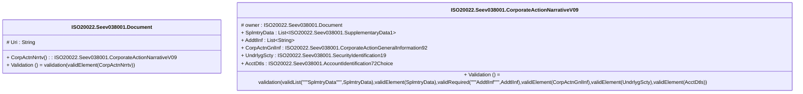

# seev.038.001.09-physical

> The tables below contain descriptions of the members of each Element. 
> The first column indicates the type of the member:
> A ‘#’ indicates that the field is a key to the element, and a ‘+’ indicates that the field is a value.
> The ‘*’ column contains a description for the element member.  
> The ‘@’ column contains any properties for the member.
> The ‘=’ column contains calculated values; or in the case of an enum, the serialized value.

---

## EntityImpl ISO20022.Seev038001.Document

| |Name|Type|*|@|=|
|-|-|-|-|-|-|
|#|Uri|String||XmlIgnore(), JsonIgnore()||
|+|CorpActnNrrtv|ISO20022.Seev038001.CorporateActionNarrativeV09||XmlElement()||
||Validation|Some(String)||XmlIgnore(), JsonIgnore()|validation(validElement(CorpActnNrrtv))|

---

## AspectImpl ISO20022.Seev038001.CorporateActionNarrativeV09

| |Name|Type|*|@|=|
|-|-|-|-|-|-|
|#|owner|ISO20022.Seev038001.Document||||
|+|SplmtryData|List<ISO20022.Seev038001.SupplementaryData1>||XmlElement()||
|+|AddtlInf|List<String>||XmlElement()||
|+|CorpActnGnlInf|ISO20022.Seev038001.CorporateActionGeneralInformation92||XmlElement()||
|+|UndrlygScty|ISO20022.Seev038001.SecurityIdentification19||XmlElement()||
|+|AcctDtls|ISO20022.Seev038001.AccountIdentification72Choice||XmlElement()||
||Validation|Some(String)||XmlIgnore(), JsonIgnore()|validation(validList("""SplmtryData""",SplmtryData),validElement(SplmtryData),validRequired("""AddtlInf""",AddtlInf),validElement(CorpActnGnlInf),validElement(UndrlygScty),validElement(AcctDtls))|

