# seev.038.001.09

```mermaid
classDiagram
    class Hiperspace.Edge {
        # From  : Hiperspace.Node
        # To  : Hiperspace.Node
        # TypeName  : String
        + Name  : String
    }
    class ISO20022.Seev038001.AccountIdentification10 {
        + IdCd  : String
    }
    class ISO20022.Seev038001.AccountIdentification71 {
        + ConfdBal  : ISO20022.Seev038001.BalanceFormat11Choice
        + SfkpgPlc  : ISO20022.Seev038001.SafekeepingPlaceFormat42Choice
        + AcctOwnr  : ISO20022.Seev038001.PartyIdentification127Choice
        + BlckChainAdrOrWllt  : String
        + SfkpgAcct  : String
    }
    ISO20022.Seev038001.AccountIdentification71 *-- ISO20022.Seev038001.BalanceFormat11Choice
    ISO20022.Seev038001.AccountIdentification71 *-- ISO20022.Seev038001.SafekeepingPlaceFormat42Choice
    ISO20022.Seev038001.AccountIdentification71 *-- ISO20022.Seev038001.PartyIdentification127Choice
    class ISO20022.Seev038001.AccountIdentification72Choice {
        + AcctsListAndBalDtls  : global::System.Collections.Generic.List~ISO20022.Seev038001.AccountIdentification71~
        + ForAllAccts  : ISO20022.Seev038001.AccountIdentification10
    }
    ISO20022.Seev038001.AccountIdentification72Choice *-- ISO20022.Seev038001.AccountIdentification71
    ISO20022.Seev038001.AccountIdentification72Choice *-- ISO20022.Seev038001.AccountIdentification10
    class ISO20022.Seev038001.BalanceFormat11Choice {
        + NotElgblBal  : ISO20022.Seev038001.SignedQuantityFormat10
        + ElgblBal  : ISO20022.Seev038001.SignedQuantityFormat10
        + Bal  : ISO20022.Seev038001.SignedQuantityFormat11
    }
    ISO20022.Seev038001.BalanceFormat11Choice *-- ISO20022.Seev038001.SignedQuantityFormat10
    ISO20022.Seev038001.BalanceFormat11Choice *-- ISO20022.Seev038001.SignedQuantityFormat10
    ISO20022.Seev038001.BalanceFormat11Choice *-- ISO20022.Seev038001.SignedQuantityFormat11
    class ISO20022.Seev038001.CorporateActionGeneralInformation92 {
        + NrrtvTp  : ISO20022.Seev038001.CorporateActionNarrative3Choice
        + OffclCorpActnEvtId  : String
        + CorpActnEvtId  : String
    }
    ISO20022.Seev038001.CorporateActionGeneralInformation92 *-- ISO20022.Seev038001.CorporateActionNarrative3Choice
    class ISO20022.Seev038001.CorporateActionNarrative1Code {
        CTIN = 1
        PAUT = 2
        RFMC = 3
        WTRC = 4
        REGI = 5
        TAXE = 6
    }
    class ISO20022.Seev038001.CorporateActionNarrative3Choice {
        + Prtry  : ISO20022.Seev038001.GenericIdentification30
        + Cd  : String
    }
    ISO20022.Seev038001.CorporateActionNarrative3Choice *-- ISO20022.Seev038001.GenericIdentification30
    class ISO20022.Seev038001.CorporateActionNarrativeV09 {
        + SplmtryData  : global::System.Collections.Generic.List~ISO20022.Seev038001.SupplementaryData1~
        + AddtlInf  : global::System.Collections.Generic.List~String~
        + CorpActnGnlInf  : ISO20022.Seev038001.CorporateActionGeneralInformation92
        + UndrlygScty  : ISO20022.Seev038001.SecurityIdentification19
        + AcctDtls  : ISO20022.Seev038001.AccountIdentification72Choice
    }
    ISO20022.Seev038001.CorporateActionNarrativeV09 *-- ISO20022.Seev038001.SupplementaryData1
    ISO20022.Seev038001.CorporateActionNarrativeV09 *-- ISO20022.Seev038001.CorporateActionGeneralInformation92
    ISO20022.Seev038001.CorporateActionNarrativeV09 *-- ISO20022.Seev038001.SecurityIdentification19
    ISO20022.Seev038001.CorporateActionNarrativeV09 *-- ISO20022.Seev038001.AccountIdentification72Choice
    class ISO20022.Seev038001.FinancialInstrumentQuantity33Choice {
        + DgtlTknUnit  : Decimal
        + AmtsdVal  : Decimal
        + FaceAmt  : Decimal
        + Unit  : Decimal
    }
    class ISO20022.Seev038001.GenericIdentification30 {
        + SchmeNm  : String
        + Issr  : String
        + Id  : String
    }
    class ISO20022.Seev038001.GenericIdentification36 {
        + SchmeNm  : String
        + Issr  : String
        + Id  : String
    }
    class ISO20022.Seev038001.GenericIdentification78 {
        + Id  : String
        + Tp  : ISO20022.Seev038001.GenericIdentification30
    }
    ISO20022.Seev038001.GenericIdentification78 *-- ISO20022.Seev038001.GenericIdentification30
    class ISO20022.Seev038001.IdentificationSource3Choice {
        + Prtry  : String
        + Cd  : String
    }
    class ISO20022.Seev038001.OtherIdentification1 {
        + Tp  : ISO20022.Seev038001.IdentificationSource3Choice
        + Sfx  : String
        + Id  : String
    }
    ISO20022.Seev038001.OtherIdentification1 *-- ISO20022.Seev038001.IdentificationSource3Choice
    class ISO20022.Seev038001.PartyIdentification127Choice {
        + PrtryId  : ISO20022.Seev038001.GenericIdentification36
        + AnyBIC  : String
    }
    ISO20022.Seev038001.PartyIdentification127Choice *-- ISO20022.Seev038001.GenericIdentification36
    class ISO20022.Seev038001.ProprietaryQuantity8 {
        + SchmeNm  : String
        + Issr  : String
        + QtyTp  : String
        + Qty  : Decimal
    }
    class ISO20022.Seev038001.Quantity48Choice {
        + PrtryQty  : ISO20022.Seev038001.ProprietaryQuantity8
        + Qty  : ISO20022.Seev038001.FinancialInstrumentQuantity33Choice
    }
    ISO20022.Seev038001.Quantity48Choice *-- ISO20022.Seev038001.ProprietaryQuantity8
    ISO20022.Seev038001.Quantity48Choice *-- ISO20022.Seev038001.FinancialInstrumentQuantity33Choice
    class ISO20022.Seev038001.SafekeepingAccountIdentification1Code {
        GENR = 1
    }
    class ISO20022.Seev038001.SafekeepingPlace1Code {
        SHHE = 1
        NCSD = 2
        ICSD = 3
        CUST = 4
    }
    class ISO20022.Seev038001.SafekeepingPlace2Code {
        ALLP = 1
        SHHE = 2
    }
    class ISO20022.Seev038001.SafekeepingPlaceFormat42Choice {
        + Prtry  : ISO20022.Seev038001.GenericIdentification78
        + TpAndId  : ISO20022.Seev038001.SafekeepingPlaceTypeAndIdentification1
        + DgtlLdgrId  : String
        + Ctry  : String
        + Id  : ISO20022.Seev038001.SafekeepingPlaceTypeAndText6
    }
    ISO20022.Seev038001.SafekeepingPlaceFormat42Choice *-- ISO20022.Seev038001.GenericIdentification78
    ISO20022.Seev038001.SafekeepingPlaceFormat42Choice *-- ISO20022.Seev038001.SafekeepingPlaceTypeAndIdentification1
    ISO20022.Seev038001.SafekeepingPlaceFormat42Choice *-- ISO20022.Seev038001.SafekeepingPlaceTypeAndText6
    class ISO20022.Seev038001.SafekeepingPlaceTypeAndIdentification1 {
        + Id  : String
        + SfkpgPlcTp  : String
    }
    class ISO20022.Seev038001.SafekeepingPlaceTypeAndText6 {
        + Id  : String
        + SfkpgPlcTp  : String
    }
    class ISO20022.Seev038001.SecurityIdentification19 {
        + Desc  : String
        + OthrId  : global::System.Collections.Generic.List~ISO20022.Seev038001.OtherIdentification1~
        + ISIN  : String
    }
    ISO20022.Seev038001.SecurityIdentification19 *-- ISO20022.Seev038001.OtherIdentification1
    class ISO20022.Seev038001.ShortLong1Code {
        LONG = 1
        SHOR = 2
    }
    class ISO20022.Seev038001.SignedQuantityFormat10 {
        + Qty  : ISO20022.Seev038001.FinancialInstrumentQuantity33Choice
        + ShrtLngPos  : String
    }
    ISO20022.Seev038001.SignedQuantityFormat10 *-- ISO20022.Seev038001.FinancialInstrumentQuantity33Choice
    class ISO20022.Seev038001.SignedQuantityFormat11 {
        + QtyChc  : ISO20022.Seev038001.Quantity48Choice
        + ShrtLngPos  : String
    }
    ISO20022.Seev038001.SignedQuantityFormat11 *-- ISO20022.Seev038001.Quantity48Choice
    class ISO20022.Seev038001.SupplementaryData1 {
        + Envlp  : ISO20022.Seev038001.SupplementaryDataEnvelope1
        + PlcAndNm  : String
    }
    ISO20022.Seev038001.SupplementaryData1 *-- ISO20022.Seev038001.SupplementaryDataEnvelope1
    class ISO20022.Seev038001.SupplementaryDataEnvelope1 {
    }
    class Hiperspace.Node {
        # SKey  : String
        + TypeName  : String
        + Name  : String
        + Froms (From = this) : Hiperspace.Edge
        + Tos (To = this) : Hiperspace.Edge
    }
```

> The tables below contain descriptions of the members of each Element. 
> The first column indicates the type of the member:
> A ‘#’ indicates that the field is a key to the element, and a ‘+’ indicates that the field is a value.
> The ‘*’ column contains a description for the element member.  
> The ‘@’ column contains any properties for the member.
> The ‘=’ column contains calculated values; or in the case of an enum, the serialized value.

---

## View Hiperspace.Edge
edge between nodes

| |Name|Type|*|@|=|
|-|-|-|-|-|-|
|#|From|Hiperspace.Node||||
|#|To|Hiperspace.Node||||
|#|TypeName|String||||
|+|Name|String||||

---

## Value ISO20022.Seev038001.AccountIdentification10

| |Name|Type|*|@|=|
|-|-|-|-|-|-|
|+|IdCd|String||XmlElement()||
||Validation|Some(String)||XmlIgnore(), JsonIgnore()|""|

---

## Value ISO20022.Seev038001.AccountIdentification71

| |Name|Type|*|@|=|
|-|-|-|-|-|-|
|+|ConfdBal|ISO20022.Seev038001.BalanceFormat11Choice||XmlElement()||
|+|SfkpgPlc|ISO20022.Seev038001.SafekeepingPlaceFormat42Choice||XmlElement()||
|+|AcctOwnr|ISO20022.Seev038001.PartyIdentification127Choice||XmlElement()||
|+|BlckChainAdrOrWllt|String||XmlElement()||
|+|SfkpgAcct|String||XmlElement()||
||Validation|Some(String)||XmlIgnore(), JsonIgnore()|validation(validElement(ConfdBal),validElement(SfkpgPlc),validElement(AcctOwnr))|

---

## Value ISO20022.Seev038001.AccountIdentification72Choice

| |Name|Type|*|@|=|
|-|-|-|-|-|-|
|+|AcctsListAndBalDtls|global::System.Collections.Generic.List<ISO20022.Seev038001.AccountIdentification71>||XmlElement()||
|+|ForAllAccts|ISO20022.Seev038001.AccountIdentification10||XmlElement()||
||Validation|Some(String)||XmlIgnore(), JsonIgnore()|validation(validRequired("""AcctsListAndBalDtls""",AcctsListAndBalDtls),validList("""AcctsListAndBalDtls""",AcctsListAndBalDtls),validElement(AcctsListAndBalDtls),validElement(ForAllAccts),validChoice(AcctsListAndBalDtls,ForAllAccts))|

---

## Value ISO20022.Seev038001.BalanceFormat11Choice

| |Name|Type|*|@|=|
|-|-|-|-|-|-|
|+|NotElgblBal|ISO20022.Seev038001.SignedQuantityFormat10||XmlElement()||
|+|ElgblBal|ISO20022.Seev038001.SignedQuantityFormat10||XmlElement()||
|+|Bal|ISO20022.Seev038001.SignedQuantityFormat11||XmlElement()||
||Validation|Some(String)||XmlIgnore(), JsonIgnore()|validation(validElement(NotElgblBal),validElement(ElgblBal),validElement(Bal),validChoice(NotElgblBal,ElgblBal,Bal))|

---

## Value ISO20022.Seev038001.CorporateActionGeneralInformation92

| |Name|Type|*|@|=|
|-|-|-|-|-|-|
|+|NrrtvTp|ISO20022.Seev038001.CorporateActionNarrative3Choice||XmlElement()||
|+|OffclCorpActnEvtId|String||XmlElement()||
|+|CorpActnEvtId|String||XmlElement()||
||Validation|Some(String)||XmlIgnore(), JsonIgnore()|validation(validElement(NrrtvTp))|

---

## Enum ISO20022.Seev038001.CorporateActionNarrative1Code

| |Name|Type|*|@|=|
|-|-|-|-|-|-|
||CTIN|Int32||XmlEnum("""CTIN""")|1|
||PAUT|Int32||XmlEnum("""PAUT""")|2|
||RFMC|Int32||XmlEnum("""RFMC""")|3|
||WTRC|Int32||XmlEnum("""WTRC""")|4|
||REGI|Int32||XmlEnum("""REGI""")|5|
||TAXE|Int32||XmlEnum("""TAXE""")|6|

---

## Value ISO20022.Seev038001.CorporateActionNarrative3Choice

| |Name|Type|*|@|=|
|-|-|-|-|-|-|
|+|Prtry|ISO20022.Seev038001.GenericIdentification30||XmlElement()||
|+|Cd|String||XmlElement()||
||Validation|Some(String)||XmlIgnore(), JsonIgnore()|validation(validElement(Prtry),validChoice(Prtry,Cd))|

---

## Aspect ISO20022.Seev038001.CorporateActionNarrativeV09

| |Name|Type|*|@|=|
|-|-|-|-|-|-|
|+|SplmtryData|global::System.Collections.Generic.List<ISO20022.Seev038001.SupplementaryData1>||XmlElement()||
|+|AddtlInf|global::System.Collections.Generic.List<String>||XmlElement()||
|+|CorpActnGnlInf|ISO20022.Seev038001.CorporateActionGeneralInformation92||XmlElement()||
|+|UndrlygScty|ISO20022.Seev038001.SecurityIdentification19||XmlElement()||
|+|AcctDtls|ISO20022.Seev038001.AccountIdentification72Choice||XmlElement()||
||Validation|Some(String)||XmlIgnore(), JsonIgnore()|validation(validList("""SplmtryData""",SplmtryData),validElement(SplmtryData),validRequired("""AddtlInf""",AddtlInf),validElement(CorpActnGnlInf),validElement(UndrlygScty),validElement(AcctDtls))|

---

## Type ISO20022.Seev038001.Document

| |Name|Type|*|@|=|
|-|-|-|-|-|-|
|+|CorpActnNrrtv|ISO20022.Seev038001.CorporateActionNarrativeV09||XmlElement()||
||Validation|Some(String)||XmlIgnore(), JsonIgnore()|validation(validElement(CorpActnNrrtv))|

---

## Value ISO20022.Seev038001.FinancialInstrumentQuantity33Choice

| |Name|Type|*|@|=|
|-|-|-|-|-|-|
|+|DgtlTknUnit|Decimal||XmlElement()||
|+|AmtsdVal|Decimal||XmlElement()||
|+|FaceAmt|Decimal||XmlElement()||
|+|Unit|Decimal||XmlElement()||
||Validation|Some(String)||XmlIgnore(), JsonIgnore()|validation(validChoice(DgtlTknUnit,AmtsdVal,FaceAmt,Unit))|

---

## Value ISO20022.Seev038001.GenericIdentification30

| |Name|Type|*|@|=|
|-|-|-|-|-|-|
|+|SchmeNm|String||XmlElement()||
|+|Issr|String||XmlElement()||
|+|Id|String||XmlElement()||
||Validation|Some(String)||XmlIgnore(), JsonIgnore()|validation(validPattern("""Id""",Id,"""[a-zA-Z0-9]{4}"""))|

---

## Value ISO20022.Seev038001.GenericIdentification36

| |Name|Type|*|@|=|
|-|-|-|-|-|-|
|+|SchmeNm|String||XmlElement()||
|+|Issr|String||XmlElement()||
|+|Id|String||XmlElement()||
||Validation|Some(String)||XmlIgnore(), JsonIgnore()|""|

---

## Value ISO20022.Seev038001.GenericIdentification78

| |Name|Type|*|@|=|
|-|-|-|-|-|-|
|+|Id|String||XmlElement()||
|+|Tp|ISO20022.Seev038001.GenericIdentification30||XmlElement()||
||Validation|Some(String)||XmlIgnore(), JsonIgnore()|validation(validElement(Tp))|

---

## Value ISO20022.Seev038001.IdentificationSource3Choice

| |Name|Type|*|@|=|
|-|-|-|-|-|-|
|+|Prtry|String||XmlElement()||
|+|Cd|String||XmlElement()||
||Validation|Some(String)||XmlIgnore(), JsonIgnore()|validation(validChoice(Prtry,Cd))|

---

## Value ISO20022.Seev038001.OtherIdentification1

| |Name|Type|*|@|=|
|-|-|-|-|-|-|
|+|Tp|ISO20022.Seev038001.IdentificationSource3Choice||XmlElement()||
|+|Sfx|String||XmlElement()||
|+|Id|String||XmlElement()||
||Validation|Some(String)||XmlIgnore(), JsonIgnore()|validation(validElement(Tp))|

---

## Value ISO20022.Seev038001.PartyIdentification127Choice

| |Name|Type|*|@|=|
|-|-|-|-|-|-|
|+|PrtryId|ISO20022.Seev038001.GenericIdentification36||XmlElement()||
|+|AnyBIC|String||XmlElement()||
||Validation|Some(String)||XmlIgnore(), JsonIgnore()|validation(validElement(PrtryId),validPattern("""AnyBIC""",AnyBIC,"""[A-Z0-9]{4,4}[A-Z]{2,2}[A-Z0-9]{2,2}([A-Z0-9]{3,3}){0,1}"""),validChoice(PrtryId,AnyBIC))|

---

## Value ISO20022.Seev038001.ProprietaryQuantity8

| |Name|Type|*|@|=|
|-|-|-|-|-|-|
|+|SchmeNm|String||XmlElement()||
|+|Issr|String||XmlElement()||
|+|QtyTp|String||XmlElement()||
|+|Qty|Decimal||XmlElement()||
||Validation|Some(String)||XmlIgnore(), JsonIgnore()|validation(validPattern("""QtyTp""",QtyTp,"""[a-zA-Z0-9]{4}"""))|

---

## Value ISO20022.Seev038001.Quantity48Choice

| |Name|Type|*|@|=|
|-|-|-|-|-|-|
|+|PrtryQty|ISO20022.Seev038001.ProprietaryQuantity8||XmlElement()||
|+|Qty|ISO20022.Seev038001.FinancialInstrumentQuantity33Choice||XmlElement()||
||Validation|Some(String)||XmlIgnore(), JsonIgnore()|validation(validElement(PrtryQty),validElement(Qty),validChoice(PrtryQty,Qty))|

---

## Enum ISO20022.Seev038001.SafekeepingAccountIdentification1Code

| |Name|Type|*|@|=|
|-|-|-|-|-|-|
||GENR|Int32||XmlEnum("""GENR""")|1|

---

## Enum ISO20022.Seev038001.SafekeepingPlace1Code

| |Name|Type|*|@|=|
|-|-|-|-|-|-|
||SHHE|Int32||XmlEnum("""SHHE""")|1|
||NCSD|Int32||XmlEnum("""NCSD""")|2|
||ICSD|Int32||XmlEnum("""ICSD""")|3|
||CUST|Int32||XmlEnum("""CUST""")|4|

---

## Enum ISO20022.Seev038001.SafekeepingPlace2Code

| |Name|Type|*|@|=|
|-|-|-|-|-|-|
||ALLP|Int32||XmlEnum("""ALLP""")|1|
||SHHE|Int32||XmlEnum("""SHHE""")|2|

---

## Value ISO20022.Seev038001.SafekeepingPlaceFormat42Choice

| |Name|Type|*|@|=|
|-|-|-|-|-|-|
|+|Prtry|ISO20022.Seev038001.GenericIdentification78||XmlElement()||
|+|TpAndId|ISO20022.Seev038001.SafekeepingPlaceTypeAndIdentification1||XmlElement()||
|+|DgtlLdgrId|String||XmlElement()||
|+|Ctry|String||XmlElement()||
|+|Id|ISO20022.Seev038001.SafekeepingPlaceTypeAndText6||XmlElement()||
||Validation|Some(String)||XmlIgnore(), JsonIgnore()|validation(validElement(Prtry),validElement(TpAndId),validPattern("""DgtlLdgrId""",DgtlLdgrId,"""[1-9B-DF-HJ-NP-TV-XZ][0-9B-DF-HJ-NP-TV-XZ]{8,8}"""),validPattern("""Ctry""",Ctry,"""[A-Z]{2,2}"""),validElement(Id),validChoice(Prtry,TpAndId,DgtlLdgrId,Ctry,Id))|

---

## Value ISO20022.Seev038001.SafekeepingPlaceTypeAndIdentification1

| |Name|Type|*|@|=|
|-|-|-|-|-|-|
|+|Id|String||XmlElement()||
|+|SfkpgPlcTp|String||XmlElement()||
||Validation|Some(String)||XmlIgnore(), JsonIgnore()|validation(validPattern("""Id""",Id,"""[A-Z0-9]{4,4}[A-Z]{2,2}[A-Z0-9]{2,2}([A-Z0-9]{3,3}){0,1}"""))|

---

## Value ISO20022.Seev038001.SafekeepingPlaceTypeAndText6

| |Name|Type|*|@|=|
|-|-|-|-|-|-|
|+|Id|String||XmlElement()||
|+|SfkpgPlcTp|String||XmlElement()||
||Validation|Some(String)||XmlIgnore(), JsonIgnore()|""|

---

## Value ISO20022.Seev038001.SecurityIdentification19

| |Name|Type|*|@|=|
|-|-|-|-|-|-|
|+|Desc|String||XmlElement()||
|+|OthrId|global::System.Collections.Generic.List<ISO20022.Seev038001.OtherIdentification1>||XmlElement()||
|+|ISIN|String||XmlElement()||
||Validation|Some(String)||XmlIgnore(), JsonIgnore()|validation(validList("""OthrId""",OthrId),validElement(OthrId),validPattern("""ISIN""",ISIN,"""[A-Z]{2,2}[A-Z0-9]{9,9}[0-9]{1,1}"""))|

---

## Enum ISO20022.Seev038001.ShortLong1Code

| |Name|Type|*|@|=|
|-|-|-|-|-|-|
||LONG|Int32||XmlEnum("""LONG""")|1|
||SHOR|Int32||XmlEnum("""SHOR""")|2|

---

## Value ISO20022.Seev038001.SignedQuantityFormat10

| |Name|Type|*|@|=|
|-|-|-|-|-|-|
|+|Qty|ISO20022.Seev038001.FinancialInstrumentQuantity33Choice||XmlElement()||
|+|ShrtLngPos|String||XmlElement()||
||Validation|Some(String)||XmlIgnore(), JsonIgnore()|validation(validElement(Qty))|

---

## Value ISO20022.Seev038001.SignedQuantityFormat11

| |Name|Type|*|@|=|
|-|-|-|-|-|-|
|+|QtyChc|ISO20022.Seev038001.Quantity48Choice||XmlElement()||
|+|ShrtLngPos|String||XmlElement()||
||Validation|Some(String)||XmlIgnore(), JsonIgnore()|validation(validElement(QtyChc))|

---

## Value ISO20022.Seev038001.SupplementaryData1

| |Name|Type|*|@|=|
|-|-|-|-|-|-|
|+|Envlp|ISO20022.Seev038001.SupplementaryDataEnvelope1||XmlElement()||
|+|PlcAndNm|String||XmlElement()||
||Validation|Some(String)||XmlIgnore(), JsonIgnore()|validation(validElement(Envlp))|

---

## Value ISO20022.Seev038001.SupplementaryDataEnvelope1

| |Name|Type|*|@|=|
|-|-|-|-|-|-|
||Validation|Some(String)||XmlIgnore(), JsonIgnore()|""|

---

## View Hiperspace.Node
node in a graph view of data

| |Name|Type|*|@|=|
|-|-|-|-|-|-|
|#|SKey|String||||
|+|TypeName|String||||
|+|Name|String||||
||Froms|Hiperspace.Edge|||From = this|
||Tos|Hiperspace.Edge|||To = this|

