# seev.038.002.09

```mermaid
classDiagram
    class Hiperspace.Edge {
        # From  : Hiperspace.Node
        # To  : Hiperspace.Node
        # TypeName  : String
        + Name  : String
    }
    class ISO20022.Seev038002.AccountIdentification10 {
        + IdCd  : String
    }
    class ISO20022.Seev038002.AccountIdentification76 {
        + ConfdBal  : ISO20022.Seev038002.BalanceFormat14Choice
        + SfkpgPlc  : ISO20022.Seev038002.SafekeepingPlaceFormat54Choice
        + AcctOwnr  : ISO20022.Seev038002.PartyIdentification136Choice
        + BlckChainAdrOrWllt  : String
        + SfkpgAcct  : String
    }
    ISO20022.Seev038002.AccountIdentification76 *-- ISO20022.Seev038002.BalanceFormat14Choice
    ISO20022.Seev038002.AccountIdentification76 *-- ISO20022.Seev038002.SafekeepingPlaceFormat54Choice
    ISO20022.Seev038002.AccountIdentification76 *-- ISO20022.Seev038002.PartyIdentification136Choice
    class ISO20022.Seev038002.AccountIdentification77Choice {
        + AcctsListAndBalDtls  : global::System.Collections.Generic.List~ISO20022.Seev038002.AccountIdentification76~
        + ForAllAccts  : ISO20022.Seev038002.AccountIdentification10
    }
    ISO20022.Seev038002.AccountIdentification77Choice *-- ISO20022.Seev038002.AccountIdentification76
    ISO20022.Seev038002.AccountIdentification77Choice *-- ISO20022.Seev038002.AccountIdentification10
    class ISO20022.Seev038002.BalanceFormat14Choice {
        + NotElgblBal  : ISO20022.Seev038002.SignedQuantityFormat13
        + ElgblBal  : ISO20022.Seev038002.SignedQuantityFormat13
        + Bal  : ISO20022.Seev038002.SignedQuantityFormat12
    }
    ISO20022.Seev038002.BalanceFormat14Choice *-- ISO20022.Seev038002.SignedQuantityFormat13
    ISO20022.Seev038002.BalanceFormat14Choice *-- ISO20022.Seev038002.SignedQuantityFormat13
    ISO20022.Seev038002.BalanceFormat14Choice *-- ISO20022.Seev038002.SignedQuantityFormat12
    class ISO20022.Seev038002.CorporateActionGeneralInformation102 {
        + NrrtvTp  : ISO20022.Seev038002.CorporateActionNarrative4Choice
        + OffclCorpActnEvtId  : String
        + CorpActnEvtId  : String
    }
    ISO20022.Seev038002.CorporateActionGeneralInformation102 *-- ISO20022.Seev038002.CorporateActionNarrative4Choice
    class ISO20022.Seev038002.CorporateActionNarrative002V09 {
        + SplmtryData  : global::System.Collections.Generic.List~ISO20022.Seev038002.SupplementaryData1~
        + AddtlInf  : global::System.Collections.Generic.List~String~
        + CorpActnGnlInf  : ISO20022.Seev038002.CorporateActionGeneralInformation102
        + UndrlygScty  : ISO20022.Seev038002.SecurityIdentification20
        + AcctDtls  : ISO20022.Seev038002.AccountIdentification77Choice
    }
    ISO20022.Seev038002.CorporateActionNarrative002V09 *-- ISO20022.Seev038002.SupplementaryData1
    ISO20022.Seev038002.CorporateActionNarrative002V09 *-- ISO20022.Seev038002.CorporateActionGeneralInformation102
    ISO20022.Seev038002.CorporateActionNarrative002V09 *-- ISO20022.Seev038002.SecurityIdentification20
    ISO20022.Seev038002.CorporateActionNarrative002V09 *-- ISO20022.Seev038002.AccountIdentification77Choice
    class ISO20022.Seev038002.CorporateActionNarrative1Code {
        CTIN = 1
        PAUT = 2
        RFMC = 3
        WTRC = 4
        REGI = 5
        TAXE = 6
    }
    class ISO20022.Seev038002.CorporateActionNarrative4Choice {
        + Prtry  : ISO20022.Seev038002.GenericIdentification47
        + Cd  : String
    }
    ISO20022.Seev038002.CorporateActionNarrative4Choice *-- ISO20022.Seev038002.GenericIdentification47
    class ISO20022.Seev038002.FinancialInstrumentQuantity36Choice {
        + DgtlTknUnit  : Decimal
        + AmtsdVal  : Decimal
        + FaceAmt  : Decimal
        + Unit  : Decimal
    }
    class ISO20022.Seev038002.GenericIdentification47 {
        + SchmeNm  : String
        + Issr  : String
        + Id  : String
    }
    class ISO20022.Seev038002.GenericIdentification84 {
        + SchmeNm  : String
        + Issr  : String
        + Id  : String
    }
    class ISO20022.Seev038002.GenericIdentification85 {
        + Id  : String
        + Tp  : ISO20022.Seev038002.GenericIdentification47
    }
    ISO20022.Seev038002.GenericIdentification85 *-- ISO20022.Seev038002.GenericIdentification47
    class ISO20022.Seev038002.IdentificationSource4Choice {
        + Prtry  : String
        + Cd  : String
    }
    class ISO20022.Seev038002.OtherIdentification2 {
        + Tp  : ISO20022.Seev038002.IdentificationSource4Choice
        + Sfx  : String
        + Id  : String
    }
    ISO20022.Seev038002.OtherIdentification2 *-- ISO20022.Seev038002.IdentificationSource4Choice
    class ISO20022.Seev038002.PartyIdentification136Choice {
        + PrtryId  : ISO20022.Seev038002.GenericIdentification84
        + AnyBIC  : String
    }
    ISO20022.Seev038002.PartyIdentification136Choice *-- ISO20022.Seev038002.GenericIdentification84
    class ISO20022.Seev038002.ProprietaryQuantity9 {
        + SchmeNm  : String
        + Issr  : String
        + QtyTp  : String
        + Qty  : Decimal
    }
    class ISO20022.Seev038002.Quantity53Choice {
        + PrtryQty  : ISO20022.Seev038002.ProprietaryQuantity9
        + Qty  : ISO20022.Seev038002.FinancialInstrumentQuantity36Choice
    }
    ISO20022.Seev038002.Quantity53Choice *-- ISO20022.Seev038002.ProprietaryQuantity9
    ISO20022.Seev038002.Quantity53Choice *-- ISO20022.Seev038002.FinancialInstrumentQuantity36Choice
    class ISO20022.Seev038002.SafekeepingAccountIdentification1Code {
        GENR = 1
    }
    class ISO20022.Seev038002.SafekeepingPlace1Code {
        SHHE = 1
        NCSD = 2
        ICSD = 3
        CUST = 4
    }
    class ISO20022.Seev038002.SafekeepingPlace2Code {
        ALLP = 1
        SHHE = 2
    }
    class ISO20022.Seev038002.SafekeepingPlaceFormat54Choice {
        + Prtry  : ISO20022.Seev038002.GenericIdentification85
        + TpAndId  : ISO20022.Seev038002.SafekeepingPlaceTypeAndIdentification1
        + DgtlLdgrId  : String
        + Ctry  : String
        + Id  : ISO20022.Seev038002.SafekeepingPlaceTypeAndText9
    }
    ISO20022.Seev038002.SafekeepingPlaceFormat54Choice *-- ISO20022.Seev038002.GenericIdentification85
    ISO20022.Seev038002.SafekeepingPlaceFormat54Choice *-- ISO20022.Seev038002.SafekeepingPlaceTypeAndIdentification1
    ISO20022.Seev038002.SafekeepingPlaceFormat54Choice *-- ISO20022.Seev038002.SafekeepingPlaceTypeAndText9
    class ISO20022.Seev038002.SafekeepingPlaceTypeAndIdentification1 {
        + Id  : String
        + SfkpgPlcTp  : String
    }
    class ISO20022.Seev038002.SafekeepingPlaceTypeAndText9 {
        + Id  : String
        + SfkpgPlcTp  : String
    }
    class ISO20022.Seev038002.SecurityIdentification20 {
        + Desc  : String
        + OthrId  : global::System.Collections.Generic.List~ISO20022.Seev038002.OtherIdentification2~
        + ISIN  : String
    }
    ISO20022.Seev038002.SecurityIdentification20 *-- ISO20022.Seev038002.OtherIdentification2
    class ISO20022.Seev038002.ShortLong1Code {
        LONG = 1
        SHOR = 2
    }
    class ISO20022.Seev038002.SignedQuantityFormat12 {
        + QtyChc  : ISO20022.Seev038002.Quantity53Choice
        + ShrtLngPos  : String
    }
    ISO20022.Seev038002.SignedQuantityFormat12 *-- ISO20022.Seev038002.Quantity53Choice
    class ISO20022.Seev038002.SignedQuantityFormat13 {
        + Qty  : ISO20022.Seev038002.FinancialInstrumentQuantity36Choice
        + ShrtLngPos  : String
    }
    ISO20022.Seev038002.SignedQuantityFormat13 *-- ISO20022.Seev038002.FinancialInstrumentQuantity36Choice
    class ISO20022.Seev038002.SupplementaryData1 {
        + Envlp  : ISO20022.Seev038002.SupplementaryDataEnvelope1
        + PlcAndNm  : String
    }
    ISO20022.Seev038002.SupplementaryData1 *-- ISO20022.Seev038002.SupplementaryDataEnvelope1
    class ISO20022.Seev038002.SupplementaryDataEnvelope1 {
    }
    class Hiperspace.Node {
        # SKey  : String
        + TypeName  : String
        + Name  : String
        + Froms (From = this) : Hiperspace.Edge
        + Tos (To = this) : Hiperspace.Edge
    }
```

> The tables below contain descriptions of the members of each Element. 
> The first column indicates the type of the member:
> A ‘#’ indicates that the field is a key to the element, and a ‘+’ indicates that the field is a value.
> The ‘*’ column contains a description for the element member.  
> The ‘@’ column contains any properties for the member.
> The ‘=’ column contains calculated values; or in the case of an enum, the serialized value.

---

## View Hiperspace.Edge
edge between nodes

| |Name|Type|*|@|=|
|-|-|-|-|-|-|
|#|From|Hiperspace.Node||||
|#|To|Hiperspace.Node||||
|#|TypeName|String||||
|+|Name|String||||

---

## Value ISO20022.Seev038002.AccountIdentification10

| |Name|Type|*|@|=|
|-|-|-|-|-|-|
|+|IdCd|String||XmlElement()||
||Validation|Some(String)||XmlIgnore(), JsonIgnore()|""|

---

## Value ISO20022.Seev038002.AccountIdentification76

| |Name|Type|*|@|=|
|-|-|-|-|-|-|
|+|ConfdBal|ISO20022.Seev038002.BalanceFormat14Choice||XmlElement()||
|+|SfkpgPlc|ISO20022.Seev038002.SafekeepingPlaceFormat54Choice||XmlElement()||
|+|AcctOwnr|ISO20022.Seev038002.PartyIdentification136Choice||XmlElement()||
|+|BlckChainAdrOrWllt|String||XmlElement()||
|+|SfkpgAcct|String||XmlElement()||
||Validation|Some(String)||XmlIgnore(), JsonIgnore()|validation(validElement(ConfdBal),validElement(SfkpgPlc),validElement(AcctOwnr),validPattern("""BlckChainAdrOrWllt""",BlckChainAdrOrWllt,"""[0-9a-zA-Z/\-\?:\(\)\.\n\r,'\+ ]{1,140}"""),validPattern("""SfkpgAcct""",SfkpgAcct,"""[0-9a-zA-Z/\-\?:\(\)\.,'\+ ]{1,35}"""))|

---

## Value ISO20022.Seev038002.AccountIdentification77Choice

| |Name|Type|*|@|=|
|-|-|-|-|-|-|
|+|AcctsListAndBalDtls|global::System.Collections.Generic.List<ISO20022.Seev038002.AccountIdentification76>||XmlElement()||
|+|ForAllAccts|ISO20022.Seev038002.AccountIdentification10||XmlElement()||
||Validation|Some(String)||XmlIgnore(), JsonIgnore()|validation(validRequired("""AcctsListAndBalDtls""",AcctsListAndBalDtls),validList("""AcctsListAndBalDtls""",AcctsListAndBalDtls),validElement(AcctsListAndBalDtls),validElement(ForAllAccts),validChoice(AcctsListAndBalDtls,ForAllAccts))|

---

## Value ISO20022.Seev038002.BalanceFormat14Choice

| |Name|Type|*|@|=|
|-|-|-|-|-|-|
|+|NotElgblBal|ISO20022.Seev038002.SignedQuantityFormat13||XmlElement()||
|+|ElgblBal|ISO20022.Seev038002.SignedQuantityFormat13||XmlElement()||
|+|Bal|ISO20022.Seev038002.SignedQuantityFormat12||XmlElement()||
||Validation|Some(String)||XmlIgnore(), JsonIgnore()|validation(validElement(NotElgblBal),validElement(ElgblBal),validElement(Bal),validChoice(NotElgblBal,ElgblBal,Bal))|

---

## Value ISO20022.Seev038002.CorporateActionGeneralInformation102

| |Name|Type|*|@|=|
|-|-|-|-|-|-|
|+|NrrtvTp|ISO20022.Seev038002.CorporateActionNarrative4Choice||XmlElement()||
|+|OffclCorpActnEvtId|String||XmlElement()||
|+|CorpActnEvtId|String||XmlElement()||
||Validation|Some(String)||XmlIgnore(), JsonIgnore()|validation(validElement(NrrtvTp),validPattern("""OffclCorpActnEvtId""",OffclCorpActnEvtId,"""([0-9a-zA-Z\-\?:\(\)\.,'\+ ]([0-9a-zA-Z\-\?:\(\)\.,'\+ ]*(/[0-9a-zA-Z\-\?:\(\)\.,'\+ ])?)*)"""),validPattern("""CorpActnEvtId""",CorpActnEvtId,"""([0-9a-zA-Z\-\?:\(\)\.,'\+ ]([0-9a-zA-Z\-\?:\(\)\.,'\+ ]*(/[0-9a-zA-Z\-\?:\(\)\.,'\+ ])?)*)"""))|

---

## Aspect ISO20022.Seev038002.CorporateActionNarrative002V09

| |Name|Type|*|@|=|
|-|-|-|-|-|-|
|+|SplmtryData|global::System.Collections.Generic.List<ISO20022.Seev038002.SupplementaryData1>||XmlElement()||
|+|AddtlInf|global::System.Collections.Generic.List<String>||XmlElement()||
|+|CorpActnGnlInf|ISO20022.Seev038002.CorporateActionGeneralInformation102||XmlElement()||
|+|UndrlygScty|ISO20022.Seev038002.SecurityIdentification20||XmlElement()||
|+|AcctDtls|ISO20022.Seev038002.AccountIdentification77Choice||XmlElement()||
||Validation|Some(String)||XmlIgnore(), JsonIgnore()|validation(validList("""SplmtryData""",SplmtryData),validElement(SplmtryData),validRequired("""AddtlInf""",AddtlInf),validPattern("""AddtlInf""",AddtlInf,"""[0-9a-zA-Z!"%&\*;<> \.,\(\)\n\r/='\+:\?@#\{\-_]{1,8000}"""),validElement(CorpActnGnlInf),validElement(UndrlygScty),validElement(AcctDtls))|

---

## Enum ISO20022.Seev038002.CorporateActionNarrative1Code

| |Name|Type|*|@|=|
|-|-|-|-|-|-|
||CTIN|Int32||XmlEnum("""CTIN""")|1|
||PAUT|Int32||XmlEnum("""PAUT""")|2|
||RFMC|Int32||XmlEnum("""RFMC""")|3|
||WTRC|Int32||XmlEnum("""WTRC""")|4|
||REGI|Int32||XmlEnum("""REGI""")|5|
||TAXE|Int32||XmlEnum("""TAXE""")|6|

---

## Value ISO20022.Seev038002.CorporateActionNarrative4Choice

| |Name|Type|*|@|=|
|-|-|-|-|-|-|
|+|Prtry|ISO20022.Seev038002.GenericIdentification47||XmlElement()||
|+|Cd|String||XmlElement()||
||Validation|Some(String)||XmlIgnore(), JsonIgnore()|validation(validElement(Prtry),validChoice(Prtry,Cd))|

---

## Type ISO20022.Seev038002.Document

| |Name|Type|*|@|=|
|-|-|-|-|-|-|
|+|CorpActnNrrtv|ISO20022.Seev038002.CorporateActionNarrative002V09||XmlElement()||
||Validation|Some(String)||XmlIgnore(), JsonIgnore()|validation(validElement(CorpActnNrrtv))|

---

## Value ISO20022.Seev038002.FinancialInstrumentQuantity36Choice

| |Name|Type|*|@|=|
|-|-|-|-|-|-|
|+|DgtlTknUnit|Decimal||XmlElement()||
|+|AmtsdVal|Decimal||XmlElement()||
|+|FaceAmt|Decimal||XmlElement()||
|+|Unit|Decimal||XmlElement()||
||Validation|Some(String)||XmlIgnore(), JsonIgnore()|validation(validChoice(DgtlTknUnit,AmtsdVal,FaceAmt,Unit))|

---

## Value ISO20022.Seev038002.GenericIdentification47

| |Name|Type|*|@|=|
|-|-|-|-|-|-|
|+|SchmeNm|String||XmlElement()||
|+|Issr|String||XmlElement()||
|+|Id|String||XmlElement()||
||Validation|Some(String)||XmlIgnore(), JsonIgnore()|validation(validPattern("""SchmeNm""",SchmeNm,"""[a-zA-Z0-9]{1,4}"""),validPattern("""Issr""",Issr,"""[a-zA-Z0-9]{1,4}"""),validPattern("""Id""",Id,"""[a-zA-Z0-9]{4}"""))|

---

## Value ISO20022.Seev038002.GenericIdentification84

| |Name|Type|*|@|=|
|-|-|-|-|-|-|
|+|SchmeNm|String||XmlElement()||
|+|Issr|String||XmlElement()||
|+|Id|String||XmlElement()||
||Validation|Some(String)||XmlIgnore(), JsonIgnore()|validation(validPattern("""SchmeNm""",SchmeNm,"""[a-zA-Z0-9]{1,4}"""),validPattern("""Issr""",Issr,"""[a-zA-Z0-9]{1,4}"""),validPattern("""Id""",Id,"""([0-9a-zA-Z\-\?:\(\)\.,'\+ ]([0-9a-zA-Z\-\?:\(\)\.,'\+ ]*(/[0-9a-zA-Z\-\?:\(\)\.,'\+ ])?)*)"""))|

---

## Value ISO20022.Seev038002.GenericIdentification85

| |Name|Type|*|@|=|
|-|-|-|-|-|-|
|+|Id|String||XmlElement()||
|+|Tp|ISO20022.Seev038002.GenericIdentification47||XmlElement()||
||Validation|Some(String)||XmlIgnore(), JsonIgnore()|validation(validPattern("""Id""",Id,"""([0-9a-zA-Z\-\?:\(\)\.,'\+ ]([0-9a-zA-Z\-\?:\(\)\.,'\+ ]*(/[0-9a-zA-Z\-\?:\(\)\.,'\+ ])?)*)"""),validElement(Tp))|

---

## Value ISO20022.Seev038002.IdentificationSource4Choice

| |Name|Type|*|@|=|
|-|-|-|-|-|-|
|+|Prtry|String||XmlElement()||
|+|Cd|String||XmlElement()||
||Validation|Some(String)||XmlIgnore(), JsonIgnore()|validation(validPattern("""Prtry""",Prtry,"""XX\|TS"""),validChoice(Prtry,Cd))|

---

## Value ISO20022.Seev038002.OtherIdentification2

| |Name|Type|*|@|=|
|-|-|-|-|-|-|
|+|Tp|ISO20022.Seev038002.IdentificationSource4Choice||XmlElement()||
|+|Sfx|String||XmlElement()||
|+|Id|String||XmlElement()||
||Validation|Some(String)||XmlIgnore(), JsonIgnore()|validation(validElement(Tp),validPattern("""Id""",Id,"""[0-9a-zA-Z/\-\?:\(\)\.,'\+ ]{1,31}"""))|

---

## Value ISO20022.Seev038002.PartyIdentification136Choice

| |Name|Type|*|@|=|
|-|-|-|-|-|-|
|+|PrtryId|ISO20022.Seev038002.GenericIdentification84||XmlElement()||
|+|AnyBIC|String||XmlElement()||
||Validation|Some(String)||XmlIgnore(), JsonIgnore()|validation(validElement(PrtryId),validPattern("""AnyBIC""",AnyBIC,"""[A-Z0-9]{4,4}[A-Z]{2,2}[A-Z0-9]{2,2}([A-Z0-9]{3,3}){0,1}"""),validChoice(PrtryId,AnyBIC))|

---

## Value ISO20022.Seev038002.ProprietaryQuantity9

| |Name|Type|*|@|=|
|-|-|-|-|-|-|
|+|SchmeNm|String||XmlElement()||
|+|Issr|String||XmlElement()||
|+|QtyTp|String||XmlElement()||
|+|Qty|Decimal||XmlElement()||
||Validation|Some(String)||XmlIgnore(), JsonIgnore()|validation(validPattern("""SchmeNm""",SchmeNm,"""[a-zA-Z0-9]{1,4}"""),validPattern("""Issr""",Issr,"""[a-zA-Z0-9]{1,4}"""),validPattern("""QtyTp""",QtyTp,"""[a-zA-Z0-9]{4}"""))|

---

## Value ISO20022.Seev038002.Quantity53Choice

| |Name|Type|*|@|=|
|-|-|-|-|-|-|
|+|PrtryQty|ISO20022.Seev038002.ProprietaryQuantity9||XmlElement()||
|+|Qty|ISO20022.Seev038002.FinancialInstrumentQuantity36Choice||XmlElement()||
||Validation|Some(String)||XmlIgnore(), JsonIgnore()|validation(validElement(PrtryQty),validElement(Qty),validChoice(PrtryQty,Qty))|

---

## Enum ISO20022.Seev038002.SafekeepingAccountIdentification1Code

| |Name|Type|*|@|=|
|-|-|-|-|-|-|
||GENR|Int32||XmlEnum("""GENR""")|1|

---

## Enum ISO20022.Seev038002.SafekeepingPlace1Code

| |Name|Type|*|@|=|
|-|-|-|-|-|-|
||SHHE|Int32||XmlEnum("""SHHE""")|1|
||NCSD|Int32||XmlEnum("""NCSD""")|2|
||ICSD|Int32||XmlEnum("""ICSD""")|3|
||CUST|Int32||XmlEnum("""CUST""")|4|

---

## Enum ISO20022.Seev038002.SafekeepingPlace2Code

| |Name|Type|*|@|=|
|-|-|-|-|-|-|
||ALLP|Int32||XmlEnum("""ALLP""")|1|
||SHHE|Int32||XmlEnum("""SHHE""")|2|

---

## Value ISO20022.Seev038002.SafekeepingPlaceFormat54Choice

| |Name|Type|*|@|=|
|-|-|-|-|-|-|
|+|Prtry|ISO20022.Seev038002.GenericIdentification85||XmlElement()||
|+|TpAndId|ISO20022.Seev038002.SafekeepingPlaceTypeAndIdentification1||XmlElement()||
|+|DgtlLdgrId|String||XmlElement()||
|+|Ctry|String||XmlElement()||
|+|Id|ISO20022.Seev038002.SafekeepingPlaceTypeAndText9||XmlElement()||
||Validation|Some(String)||XmlIgnore(), JsonIgnore()|validation(validElement(Prtry),validElement(TpAndId),validPattern("""DgtlLdgrId""",DgtlLdgrId,"""[1-9B-DF-HJ-NP-TV-XZ][0-9B-DF-HJ-NP-TV-XZ]{8,8}"""),validPattern("""Ctry""",Ctry,"""[A-Z]{2,2}"""),validElement(Id),validChoice(Prtry,TpAndId,DgtlLdgrId,Ctry,Id))|

---

## Value ISO20022.Seev038002.SafekeepingPlaceTypeAndIdentification1

| |Name|Type|*|@|=|
|-|-|-|-|-|-|
|+|Id|String||XmlElement()||
|+|SfkpgPlcTp|String||XmlElement()||
||Validation|Some(String)||XmlIgnore(), JsonIgnore()|validation(validPattern("""Id""",Id,"""[A-Z0-9]{4,4}[A-Z]{2,2}[A-Z0-9]{2,2}([A-Z0-9]{3,3}){0,1}"""))|

---

## Value ISO20022.Seev038002.SafekeepingPlaceTypeAndText9

| |Name|Type|*|@|=|
|-|-|-|-|-|-|
|+|Id|String||XmlElement()||
|+|SfkpgPlcTp|String||XmlElement()||
||Validation|Some(String)||XmlIgnore(), JsonIgnore()|validation(validPattern("""Id""",Id,"""([0-9a-zA-Z\-\?:\(\)\.,'\+ ]([0-9a-zA-Z\-\?:\(\)\.,'\+ ]*(/[0-9a-zA-Z\-\?:\(\)\.,'\+ ])?)*)"""))|

---

## Value ISO20022.Seev038002.SecurityIdentification20

| |Name|Type|*|@|=|
|-|-|-|-|-|-|
|+|Desc|String||XmlElement()||
|+|OthrId|global::System.Collections.Generic.List<ISO20022.Seev038002.OtherIdentification2>||XmlElement()||
|+|ISIN|String||XmlElement()||
||Validation|Some(String)||XmlIgnore(), JsonIgnore()|validation(validPattern("""Desc""",Desc,"""[0-9a-zA-Z/\-\?:\(\)\.\n\r,'\+ ]{1,140}"""),validList("""OthrId""",OthrId),validElement(OthrId),validPattern("""ISIN""",ISIN,"""[A-Z]{2,2}[A-Z0-9]{9,9}[0-9]{1,1}"""))|

---

## Enum ISO20022.Seev038002.ShortLong1Code

| |Name|Type|*|@|=|
|-|-|-|-|-|-|
||LONG|Int32||XmlEnum("""LONG""")|1|
||SHOR|Int32||XmlEnum("""SHOR""")|2|

---

## Value ISO20022.Seev038002.SignedQuantityFormat12

| |Name|Type|*|@|=|
|-|-|-|-|-|-|
|+|QtyChc|ISO20022.Seev038002.Quantity53Choice||XmlElement()||
|+|ShrtLngPos|String||XmlElement()||
||Validation|Some(String)||XmlIgnore(), JsonIgnore()|validation(validElement(QtyChc))|

---

## Value ISO20022.Seev038002.SignedQuantityFormat13

| |Name|Type|*|@|=|
|-|-|-|-|-|-|
|+|Qty|ISO20022.Seev038002.FinancialInstrumentQuantity36Choice||XmlElement()||
|+|ShrtLngPos|String||XmlElement()||
||Validation|Some(String)||XmlIgnore(), JsonIgnore()|validation(validElement(Qty))|

---

## Value ISO20022.Seev038002.SupplementaryData1

| |Name|Type|*|@|=|
|-|-|-|-|-|-|
|+|Envlp|ISO20022.Seev038002.SupplementaryDataEnvelope1||XmlElement()||
|+|PlcAndNm|String||XmlElement()||
||Validation|Some(String)||XmlIgnore(), JsonIgnore()|validation(validElement(Envlp))|

---

## Value ISO20022.Seev038002.SupplementaryDataEnvelope1

| |Name|Type|*|@|=|
|-|-|-|-|-|-|
||Validation|Some(String)||XmlIgnore(), JsonIgnore()|""|

---

## View Hiperspace.Node
node in a graph view of data

| |Name|Type|*|@|=|
|-|-|-|-|-|-|
|#|SKey|String||||
|+|TypeName|String||||
|+|Name|String||||
||Froms|Hiperspace.Edge|||From = this|
||Tos|Hiperspace.Edge|||To = this|

