# seev.039.002.13

```mermaid
classDiagram
    class Hiperspace.Edge {
        # From  : Hiperspace.Node
        # To  : Hiperspace.Node
        # TypeName  : String
        + Name  : String
    }
    class ISO20022.Seev039002.AccountIdentification10 {
        + IdCd  : String
    }
    class ISO20022.Seev039002.AccountIdentification72 {
        + SfkpgPlc  : ISO20022.Seev039002.SafekeepingPlaceFormat57Choice
        + AcctOwnr  : ISO20022.Seev039002.PartyIdentification136Choice
        + BlckChainAdrOrWllt  : String
        + SfkpgAcct  : String
    }
    ISO20022.Seev039002.AccountIdentification72 *-- ISO20022.Seev039002.SafekeepingPlaceFormat57Choice
    ISO20022.Seev039002.AccountIdentification72 *-- ISO20022.Seev039002.PartyIdentification136Choice
    class ISO20022.Seev039002.AccountIdentification74Choice {
        + AcctsList  : global::System.Collections.Generic.List~ISO20022.Seev039002.AccountIdentification72~
        + ForAllAccts  : ISO20022.Seev039002.AccountIdentification10
    }
    ISO20022.Seev039002.AccountIdentification74Choice *-- ISO20022.Seev039002.AccountIdentification72
    ISO20022.Seev039002.AccountIdentification74Choice *-- ISO20022.Seev039002.AccountIdentification10
    class ISO20022.Seev039002.AdditionalBusinessProcess8Code {
        PPRE = 1
        PPUT = 2
        FPRE = 3
        CONS = 4
    }
    class ISO20022.Seev039002.AdditionalBusinessProcessFormat16Choice {
        + Prtry  : ISO20022.Seev039002.GenericIdentification47
        + Cd  : String
    }
    ISO20022.Seev039002.AdditionalBusinessProcessFormat16Choice *-- ISO20022.Seev039002.GenericIdentification47
    class ISO20022.Seev039002.CorporateAction74 {
        + LtryTp  : ISO20022.Seev039002.LotteryTypeFormat5Choice
        + AddtlBizPrcInd  : global::System.Collections.Generic.List~ISO20022.Seev039002.AdditionalBusinessProcessFormat16Choice~
        + EvtStag  : ISO20022.Seev039002.CorporateActionEventStageFormat15Choice
        + DtDtls  : ISO20022.Seev039002.CorporateActionDate89
    }
    ISO20022.Seev039002.CorporateAction74 *-- ISO20022.Seev039002.LotteryTypeFormat5Choice
    ISO20022.Seev039002.CorporateAction74 *-- ISO20022.Seev039002.AdditionalBusinessProcessFormat16Choice
    ISO20022.Seev039002.CorporateAction74 *-- ISO20022.Seev039002.CorporateActionEventStageFormat15Choice
    ISO20022.Seev039002.CorporateAction74 *-- ISO20022.Seev039002.CorporateActionDate89
    class ISO20022.Seev039002.CorporateActionCancellation4 {
        + PrcgSts  : ISO20022.Seev039002.CorporateActionEventStatus1
        + CxlRsn  : String
        + CxlRsnCd  : String
    }
    ISO20022.Seev039002.CorporateActionCancellation4 *-- ISO20022.Seev039002.CorporateActionEventStatus1
    class ISO20022.Seev039002.CorporateActionCancellationAdvice002V13 {
        + SplmtryData  : global::System.Collections.Generic.List~ISO20022.Seev039002.SupplementaryData1~
        + InfAgt  : ISO20022.Seev039002.PartyIdentification137Choice
        + SlctnAgt  : global::System.Collections.Generic.List~ISO20022.Seev039002.PartyIdentification137Choice~
        + DrpAgt  : ISO20022.Seev039002.PartyIdentification137Choice
        + PhysSctiesAgt  : ISO20022.Seev039002.PartyIdentification137Choice
        + RsellngAgt  : global::System.Collections.Generic.List~ISO20022.Seev039002.PartyIdentification137Choice~
        + Regar  : ISO20022.Seev039002.PartyIdentification137Choice
        + SubPngAgt  : global::System.Collections.Generic.List~ISO20022.Seev039002.PartyIdentification137Choice~
        + PngAgt  : global::System.Collections.Generic.List~ISO20022.Seev039002.PartyIdentification137Choice~
        + IssrAgt  : global::System.Collections.Generic.List~ISO20022.Seev039002.PartyIdentification137Choice~
        + AddtlTxt  : global::System.Collections.Generic.List~String~
        + CorpActnDtls  : ISO20022.Seev039002.CorporateAction74
        + AcctsDtls  : ISO20022.Seev039002.AccountIdentification74Choice
        + CorpActnGnlInf  : ISO20022.Seev039002.CorporateActionGeneralInformation184
        + CxlAdvcGnlInf  : ISO20022.Seev039002.CorporateActionCancellation4
    }
    ISO20022.Seev039002.CorporateActionCancellationAdvice002V13 *-- ISO20022.Seev039002.SupplementaryData1
    ISO20022.Seev039002.CorporateActionCancellationAdvice002V13 *-- ISO20022.Seev039002.PartyIdentification137Choice
    ISO20022.Seev039002.CorporateActionCancellationAdvice002V13 *-- ISO20022.Seev039002.PartyIdentification137Choice
    ISO20022.Seev039002.CorporateActionCancellationAdvice002V13 *-- ISO20022.Seev039002.PartyIdentification137Choice
    ISO20022.Seev039002.CorporateActionCancellationAdvice002V13 *-- ISO20022.Seev039002.PartyIdentification137Choice
    ISO20022.Seev039002.CorporateActionCancellationAdvice002V13 *-- ISO20022.Seev039002.PartyIdentification137Choice
    ISO20022.Seev039002.CorporateActionCancellationAdvice002V13 *-- ISO20022.Seev039002.PartyIdentification137Choice
    ISO20022.Seev039002.CorporateActionCancellationAdvice002V13 *-- ISO20022.Seev039002.PartyIdentification137Choice
    ISO20022.Seev039002.CorporateActionCancellationAdvice002V13 *-- ISO20022.Seev039002.PartyIdentification137Choice
    ISO20022.Seev039002.CorporateActionCancellationAdvice002V13 *-- ISO20022.Seev039002.PartyIdentification137Choice
    ISO20022.Seev039002.CorporateActionCancellationAdvice002V13 *-- ISO20022.Seev039002.CorporateAction74
    ISO20022.Seev039002.CorporateActionCancellationAdvice002V13 *-- ISO20022.Seev039002.AccountIdentification74Choice
    ISO20022.Seev039002.CorporateActionCancellationAdvice002V13 *-- ISO20022.Seev039002.CorporateActionGeneralInformation184
    ISO20022.Seev039002.CorporateActionCancellationAdvice002V13 *-- ISO20022.Seev039002.CorporateActionCancellation4
    class ISO20022.Seev039002.CorporateActionCancellationReason1Code {
        PROC = 1
        WITH = 2
    }
    class ISO20022.Seev039002.CorporateActionDate89 {
        + ExDvddDt  : ISO20022.Seev039002.DateFormat41Choice
        + RcrdDt  : ISO20022.Seev039002.DateFormat41Choice
    }
    ISO20022.Seev039002.CorporateActionDate89 *-- ISO20022.Seev039002.DateFormat41Choice
    ISO20022.Seev039002.CorporateActionDate89 *-- ISO20022.Seev039002.DateFormat41Choice
    class ISO20022.Seev039002.CorporateActionEventStage4Code {
        RESC = 1
        PART = 2
        FULL = 3
    }
    class ISO20022.Seev039002.CorporateActionEventStageFormat15Choice {
        + Prtry  : ISO20022.Seev039002.GenericIdentification47
        + Cd  : String
    }
    ISO20022.Seev039002.CorporateActionEventStageFormat15Choice *-- ISO20022.Seev039002.GenericIdentification47
    class ISO20022.Seev039002.CorporateActionEventStatus1 {
        + EvtConfSts  : String
        + EvtCmpltnsSts  : String
    }
    class ISO20022.Seev039002.CorporateActionEventType113Choice {
        + Prtry  : ISO20022.Seev039002.GenericIdentification47
        + Cd  : String
    }
    ISO20022.Seev039002.CorporateActionEventType113Choice *-- ISO20022.Seev039002.GenericIdentification47
    class ISO20022.Seev039002.CorporateActionEventType35Code {
        RCLA = 1
        TNDP = 2
        INFO = 3
        ACCU = 4
        WRTH = 5
        WTRC = 6
        EXWA = 7
        SUSP = 8
        DLST = 9
        TEND = 10
        TREC = 11
        SPLF = 12
        DVSE = 13
        SOFF = 14
        SMAL = 15
        SHPR = 16
        DVSC = 17
        RHTS = 18
        SPLR = 19
        BIDS = 20
        REMK = 21
        REDO = 22
        BPUT = 23
        PRIO = 24
        PDEF = 25
        PLAC = 26
        PINK = 27
        PRED = 28
        PCAL = 29
        PARI = 30
        OTHR = 31
        ODLT = 32
        CERT = 33
        NOOF = 34
        MRGR = 35
        EXTM = 36
        LIQU = 37
        RHDI = 38
        INTR = 39
        PPMT = 40
        INCR = 41
        MCAL = 42
        REDM = 43
        EXOF = 44
        DTCH = 45
        DRAW = 46
        DRIP = 47
        DVOP = 48
        DSCL = 49
        DETI = 50
        DECR = 51
        CREV = 52
        CONV = 53
        CONS = 54
        CLSA = 55
        COOP = 56
        CHAN = 57
        DVCA = 58
        DRCA = 59
        CAPI = 60
        CAPG = 61
        CAPD = 62
        EXRI = 63
        BONU = 64
        DFLT = 65
        BRUP = 66
        ATTI = 67
        ACTV = 68
    }
    class ISO20022.Seev039002.CorporateActionGeneralInformation184 {
        + FinInstrmId  : ISO20022.Seev039002.SecurityIdentification20
        + MndtryVlntryEvtTp  : ISO20022.Seev039002.CorporateActionMandatoryVoluntary4Choice
        + EvtTp  : ISO20022.Seev039002.CorporateActionEventType113Choice
        + ClssActnNb  : String
        + OffclCorpActnEvtId  : String
        + CorpActnEvtId  : String
    }
    ISO20022.Seev039002.CorporateActionGeneralInformation184 *-- ISO20022.Seev039002.SecurityIdentification20
    ISO20022.Seev039002.CorporateActionGeneralInformation184 *-- ISO20022.Seev039002.CorporateActionMandatoryVoluntary4Choice
    ISO20022.Seev039002.CorporateActionGeneralInformation184 *-- ISO20022.Seev039002.CorporateActionEventType113Choice
    class ISO20022.Seev039002.CorporateActionMandatoryVoluntary1Code {
        VOLU = 1
        CHOS = 2
        MAND = 3
    }
    class ISO20022.Seev039002.CorporateActionMandatoryVoluntary4Choice {
        + Prtry  : ISO20022.Seev039002.GenericIdentification47
        + Cd  : String
    }
    ISO20022.Seev039002.CorporateActionMandatoryVoluntary4Choice *-- ISO20022.Seev039002.GenericIdentification47
    class ISO20022.Seev039002.DateCode22Choice {
        + Prtry  : ISO20022.Seev039002.GenericIdentification47
        + Cd  : String
    }
    ISO20022.Seev039002.DateCode22Choice *-- ISO20022.Seev039002.GenericIdentification47
    class ISO20022.Seev039002.DateFormat41Choice {
        + DtCd  : ISO20022.Seev039002.DateCode22Choice
        + Dt  : DateTime
    }
    ISO20022.Seev039002.DateFormat41Choice *-- ISO20022.Seev039002.DateCode22Choice
    class ISO20022.Seev039002.DateType8Code {
        ONGO = 1
        UKWN = 2
    }
    class ISO20022.Seev039002.EventCompletenessStatus1Code {
        INCO = 1
        COMP = 2
    }
    class ISO20022.Seev039002.EventConfirmationStatus1Code {
        UCON = 1
        CONF = 2
    }
    class ISO20022.Seev039002.GenericIdentification47 {
        + SchmeNm  : String
        + Issr  : String
        + Id  : String
    }
    class ISO20022.Seev039002.GenericIdentification84 {
        + SchmeNm  : String
        + Issr  : String
        + Id  : String
    }
    class ISO20022.Seev039002.GenericIdentification85 {
        + Id  : String
        + Tp  : ISO20022.Seev039002.GenericIdentification47
    }
    ISO20022.Seev039002.GenericIdentification85 *-- ISO20022.Seev039002.GenericIdentification47
    class ISO20022.Seev039002.IdentificationSource4Choice {
        + Prtry  : String
        + Cd  : String
    }
    class ISO20022.Seev039002.LotteryType1Code {
        SUPP = 1
        ORIG = 2
    }
    class ISO20022.Seev039002.LotteryTypeFormat5Choice {
        + Prtry  : ISO20022.Seev039002.GenericIdentification47
        + Cd  : String
    }
    ISO20022.Seev039002.LotteryTypeFormat5Choice *-- ISO20022.Seev039002.GenericIdentification47
    class ISO20022.Seev039002.NameAndAddress12 {
        + Nm  : String
    }
    class ISO20022.Seev039002.OtherIdentification2 {
        + Tp  : ISO20022.Seev039002.IdentificationSource4Choice
        + Sfx  : String
        + Id  : String
    }
    ISO20022.Seev039002.OtherIdentification2 *-- ISO20022.Seev039002.IdentificationSource4Choice
    class ISO20022.Seev039002.PartyIdentification136Choice {
        + PrtryId  : ISO20022.Seev039002.GenericIdentification84
        + AnyBIC  : String
    }
    ISO20022.Seev039002.PartyIdentification136Choice *-- ISO20022.Seev039002.GenericIdentification84
    class ISO20022.Seev039002.PartyIdentification137Choice {
        + NmAndAdr  : ISO20022.Seev039002.NameAndAddress12
        + PrtryId  : ISO20022.Seev039002.GenericIdentification84
        + AnyBIC  : String
    }
    ISO20022.Seev039002.PartyIdentification137Choice *-- ISO20022.Seev039002.NameAndAddress12
    ISO20022.Seev039002.PartyIdentification137Choice *-- ISO20022.Seev039002.GenericIdentification84
    class ISO20022.Seev039002.SafekeepingAccountIdentification1Code {
        GENR = 1
    }
    class ISO20022.Seev039002.SafekeepingPlace1Code {
        SHHE = 1
        NCSD = 2
        ICSD = 3
        CUST = 4
    }
    class ISO20022.Seev039002.SafekeepingPlace2Code {
        ALLP = 1
        SHHE = 2
    }
    class ISO20022.Seev039002.SafekeepingPlaceFormat57Choice {
        + Prtry  : ISO20022.Seev039002.GenericIdentification85
        + TpAndId  : ISO20022.Seev039002.SafekeepingPlaceTypeAndIdentification1
        + DgtlLdgrId  : String
        + Ctry  : String
        + Id  : ISO20022.Seev039002.SafekeepingPlaceTypeAndText9
    }
    ISO20022.Seev039002.SafekeepingPlaceFormat57Choice *-- ISO20022.Seev039002.GenericIdentification85
    ISO20022.Seev039002.SafekeepingPlaceFormat57Choice *-- ISO20022.Seev039002.SafekeepingPlaceTypeAndIdentification1
    ISO20022.Seev039002.SafekeepingPlaceFormat57Choice *-- ISO20022.Seev039002.SafekeepingPlaceTypeAndText9
    class ISO20022.Seev039002.SafekeepingPlaceTypeAndIdentification1 {
        + Id  : String
        + SfkpgPlcTp  : String
    }
    class ISO20022.Seev039002.SafekeepingPlaceTypeAndText9 {
        + Id  : String
        + SfkpgPlcTp  : String
    }
    class ISO20022.Seev039002.SecurityIdentification20 {
        + Desc  : String
        + OthrId  : global::System.Collections.Generic.List~ISO20022.Seev039002.OtherIdentification2~
        + ISIN  : String
    }
    ISO20022.Seev039002.SecurityIdentification20 *-- ISO20022.Seev039002.OtherIdentification2
    class ISO20022.Seev039002.SupplementaryData1 {
        + Envlp  : ISO20022.Seev039002.SupplementaryDataEnvelope1
        + PlcAndNm  : String
    }
    ISO20022.Seev039002.SupplementaryData1 *-- ISO20022.Seev039002.SupplementaryDataEnvelope1
    class ISO20022.Seev039002.SupplementaryDataEnvelope1 {
    }
    class Hiperspace.Node {
        # SKey  : String
        + TypeName  : String
        + Name  : String
        + Froms (From = this) : Hiperspace.Edge
        + Tos (To = this) : Hiperspace.Edge
    }
```

> The tables below contain descriptions of the members of each Element. 
> The first column indicates the type of the member:
> A ‘#’ indicates that the field is a key to the element, and a ‘+’ indicates that the field is a value.
> The ‘*’ column contains a description for the element member.  
> The ‘@’ column contains any properties for the member.
> The ‘=’ column contains calculated values; or in the case of an enum, the serialized value.

---

## View Hiperspace.Edge
edge between nodes

| |Name|Type|*|@|=|
|-|-|-|-|-|-|
|#|From|Hiperspace.Node||||
|#|To|Hiperspace.Node||||
|#|TypeName|String||||
|+|Name|String||||

---

## Value ISO20022.Seev039002.AccountIdentification10

| |Name|Type|*|@|=|
|-|-|-|-|-|-|
|+|IdCd|String||XmlElement()||
||Validation|Some(String)||XmlIgnore(), JsonIgnore()|""|

---

## Value ISO20022.Seev039002.AccountIdentification72

| |Name|Type|*|@|=|
|-|-|-|-|-|-|
|+|SfkpgPlc|ISO20022.Seev039002.SafekeepingPlaceFormat57Choice||XmlElement()||
|+|AcctOwnr|ISO20022.Seev039002.PartyIdentification136Choice||XmlElement()||
|+|BlckChainAdrOrWllt|String||XmlElement()||
|+|SfkpgAcct|String||XmlElement()||
||Validation|Some(String)||XmlIgnore(), JsonIgnore()|validation(validElement(SfkpgPlc),validElement(AcctOwnr),validPattern("""BlckChainAdrOrWllt""",BlckChainAdrOrWllt,"""[0-9a-zA-Z/\-\?:\(\)\.\n\r,'\+ ]{1,140}"""),validPattern("""SfkpgAcct""",SfkpgAcct,"""[0-9a-zA-Z/\-\?:\(\)\.,'\+ ]{1,35}"""))|

---

## Value ISO20022.Seev039002.AccountIdentification74Choice

| |Name|Type|*|@|=|
|-|-|-|-|-|-|
|+|AcctsList|global::System.Collections.Generic.List<ISO20022.Seev039002.AccountIdentification72>||XmlElement()||
|+|ForAllAccts|ISO20022.Seev039002.AccountIdentification10||XmlElement()||
||Validation|Some(String)||XmlIgnore(), JsonIgnore()|validation(validRequired("""AcctsList""",AcctsList),validList("""AcctsList""",AcctsList),validElement(AcctsList),validElement(ForAllAccts),validChoice(AcctsList,ForAllAccts))|

---

## Enum ISO20022.Seev039002.AdditionalBusinessProcess8Code

| |Name|Type|*|@|=|
|-|-|-|-|-|-|
||PPRE|Int32||XmlEnum("""PPRE""")|1|
||PPUT|Int32||XmlEnum("""PPUT""")|2|
||FPRE|Int32||XmlEnum("""FPRE""")|3|
||CONS|Int32||XmlEnum("""CONS""")|4|

---

## Value ISO20022.Seev039002.AdditionalBusinessProcessFormat16Choice

| |Name|Type|*|@|=|
|-|-|-|-|-|-|
|+|Prtry|ISO20022.Seev039002.GenericIdentification47||XmlElement()||
|+|Cd|String||XmlElement()||
||Validation|Some(String)||XmlIgnore(), JsonIgnore()|validation(validElement(Prtry),validChoice(Prtry,Cd))|

---

## Value ISO20022.Seev039002.CorporateAction74

| |Name|Type|*|@|=|
|-|-|-|-|-|-|
|+|LtryTp|ISO20022.Seev039002.LotteryTypeFormat5Choice||XmlElement()||
|+|AddtlBizPrcInd|global::System.Collections.Generic.List<ISO20022.Seev039002.AdditionalBusinessProcessFormat16Choice>||XmlElement()||
|+|EvtStag|ISO20022.Seev039002.CorporateActionEventStageFormat15Choice||XmlElement()||
|+|DtDtls|ISO20022.Seev039002.CorporateActionDate89||XmlElement()||
||Validation|Some(String)||XmlIgnore(), JsonIgnore()|validation(validElement(LtryTp),validList("""AddtlBizPrcInd""",AddtlBizPrcInd),validElement(AddtlBizPrcInd),validElement(EvtStag),validElement(DtDtls))|

---

## Value ISO20022.Seev039002.CorporateActionCancellation4

| |Name|Type|*|@|=|
|-|-|-|-|-|-|
|+|PrcgSts|ISO20022.Seev039002.CorporateActionEventStatus1||XmlElement()||
|+|CxlRsn|String||XmlElement()||
|+|CxlRsnCd|String||XmlElement()||
||Validation|Some(String)||XmlIgnore(), JsonIgnore()|validation(validElement(PrcgSts),validPattern("""CxlRsn""",CxlRsn,"""[0-9a-zA-Z/\-\?:\(\)\.\n\r,'\+ ]{1,140}"""))|

---

## Aspect ISO20022.Seev039002.CorporateActionCancellationAdvice002V13

| |Name|Type|*|@|=|
|-|-|-|-|-|-|
|+|SplmtryData|global::System.Collections.Generic.List<ISO20022.Seev039002.SupplementaryData1>||XmlElement()||
|+|InfAgt|ISO20022.Seev039002.PartyIdentification137Choice||XmlElement()||
|+|SlctnAgt|global::System.Collections.Generic.List<ISO20022.Seev039002.PartyIdentification137Choice>||XmlElement()||
|+|DrpAgt|ISO20022.Seev039002.PartyIdentification137Choice||XmlElement()||
|+|PhysSctiesAgt|ISO20022.Seev039002.PartyIdentification137Choice||XmlElement()||
|+|RsellngAgt|global::System.Collections.Generic.List<ISO20022.Seev039002.PartyIdentification137Choice>||XmlElement()||
|+|Regar|ISO20022.Seev039002.PartyIdentification137Choice||XmlElement()||
|+|SubPngAgt|global::System.Collections.Generic.List<ISO20022.Seev039002.PartyIdentification137Choice>||XmlElement()||
|+|PngAgt|global::System.Collections.Generic.List<ISO20022.Seev039002.PartyIdentification137Choice>||XmlElement()||
|+|IssrAgt|global::System.Collections.Generic.List<ISO20022.Seev039002.PartyIdentification137Choice>||XmlElement()||
|+|AddtlTxt|global::System.Collections.Generic.List<String>||XmlElement()||
|+|CorpActnDtls|ISO20022.Seev039002.CorporateAction74||XmlElement()||
|+|AcctsDtls|ISO20022.Seev039002.AccountIdentification74Choice||XmlElement()||
|+|CorpActnGnlInf|ISO20022.Seev039002.CorporateActionGeneralInformation184||XmlElement()||
|+|CxlAdvcGnlInf|ISO20022.Seev039002.CorporateActionCancellation4||XmlElement()||
||Validation|Some(String)||XmlIgnore(), JsonIgnore()|validation(validList("""SplmtryData""",SplmtryData),validElement(SplmtryData),validElement(InfAgt),validList("""SlctnAgt""",SlctnAgt),validElement(SlctnAgt),validElement(DrpAgt),validElement(PhysSctiesAgt),validList("""RsellngAgt""",RsellngAgt),validElement(RsellngAgt),validElement(Regar),validList("""SubPngAgt""",SubPngAgt),validElement(SubPngAgt),validList("""PngAgt""",PngAgt),validElement(PngAgt),validList("""IssrAgt""",IssrAgt),validElement(IssrAgt),validPattern("""AddtlTxt""",AddtlTxt,"""[0-9a-zA-Z!"%&\*;<> \.,\(\)\n\r/='\+:\?@#\{\-_]{1,8000}"""),validElement(CorpActnDtls),validElement(AcctsDtls),validElement(CorpActnGnlInf),validElement(CxlAdvcGnlInf))|

---

## Enum ISO20022.Seev039002.CorporateActionCancellationReason1Code

| |Name|Type|*|@|=|
|-|-|-|-|-|-|
||PROC|Int32||XmlEnum("""PROC""")|1|
||WITH|Int32||XmlEnum("""WITH""")|2|

---

## Value ISO20022.Seev039002.CorporateActionDate89

| |Name|Type|*|@|=|
|-|-|-|-|-|-|
|+|ExDvddDt|ISO20022.Seev039002.DateFormat41Choice||XmlElement()||
|+|RcrdDt|ISO20022.Seev039002.DateFormat41Choice||XmlElement()||
||Validation|Some(String)||XmlIgnore(), JsonIgnore()|validation(validElement(ExDvddDt),validElement(RcrdDt))|

---

## Enum ISO20022.Seev039002.CorporateActionEventStage4Code

| |Name|Type|*|@|=|
|-|-|-|-|-|-|
||RESC|Int32||XmlEnum("""RESC""")|1|
||PART|Int32||XmlEnum("""PART""")|2|
||FULL|Int32||XmlEnum("""FULL""")|3|

---

## Value ISO20022.Seev039002.CorporateActionEventStageFormat15Choice

| |Name|Type|*|@|=|
|-|-|-|-|-|-|
|+|Prtry|ISO20022.Seev039002.GenericIdentification47||XmlElement()||
|+|Cd|String||XmlElement()||
||Validation|Some(String)||XmlIgnore(), JsonIgnore()|validation(validElement(Prtry),validChoice(Prtry,Cd))|

---

## Value ISO20022.Seev039002.CorporateActionEventStatus1

| |Name|Type|*|@|=|
|-|-|-|-|-|-|
|+|EvtConfSts|String||XmlElement()||
|+|EvtCmpltnsSts|String||XmlElement()||
||Validation|Some(String)||XmlIgnore(), JsonIgnore()|""|

---

## Value ISO20022.Seev039002.CorporateActionEventType113Choice

| |Name|Type|*|@|=|
|-|-|-|-|-|-|
|+|Prtry|ISO20022.Seev039002.GenericIdentification47||XmlElement()||
|+|Cd|String||XmlElement()||
||Validation|Some(String)||XmlIgnore(), JsonIgnore()|validation(validElement(Prtry),validChoice(Prtry,Cd))|

---

## Enum ISO20022.Seev039002.CorporateActionEventType35Code

| |Name|Type|*|@|=|
|-|-|-|-|-|-|
||RCLA|Int32||XmlEnum("""RCLA""")|1|
||TNDP|Int32||XmlEnum("""TNDP""")|2|
||INFO|Int32||XmlEnum("""INFO""")|3|
||ACCU|Int32||XmlEnum("""ACCU""")|4|
||WRTH|Int32||XmlEnum("""WRTH""")|5|
||WTRC|Int32||XmlEnum("""WTRC""")|6|
||EXWA|Int32||XmlEnum("""EXWA""")|7|
||SUSP|Int32||XmlEnum("""SUSP""")|8|
||DLST|Int32||XmlEnum("""DLST""")|9|
||TEND|Int32||XmlEnum("""TEND""")|10|
||TREC|Int32||XmlEnum("""TREC""")|11|
||SPLF|Int32||XmlEnum("""SPLF""")|12|
||DVSE|Int32||XmlEnum("""DVSE""")|13|
||SOFF|Int32||XmlEnum("""SOFF""")|14|
||SMAL|Int32||XmlEnum("""SMAL""")|15|
||SHPR|Int32||XmlEnum("""SHPR""")|16|
||DVSC|Int32||XmlEnum("""DVSC""")|17|
||RHTS|Int32||XmlEnum("""RHTS""")|18|
||SPLR|Int32||XmlEnum("""SPLR""")|19|
||BIDS|Int32||XmlEnum("""BIDS""")|20|
||REMK|Int32||XmlEnum("""REMK""")|21|
||REDO|Int32||XmlEnum("""REDO""")|22|
||BPUT|Int32||XmlEnum("""BPUT""")|23|
||PRIO|Int32||XmlEnum("""PRIO""")|24|
||PDEF|Int32||XmlEnum("""PDEF""")|25|
||PLAC|Int32||XmlEnum("""PLAC""")|26|
||PINK|Int32||XmlEnum("""PINK""")|27|
||PRED|Int32||XmlEnum("""PRED""")|28|
||PCAL|Int32||XmlEnum("""PCAL""")|29|
||PARI|Int32||XmlEnum("""PARI""")|30|
||OTHR|Int32||XmlEnum("""OTHR""")|31|
||ODLT|Int32||XmlEnum("""ODLT""")|32|
||CERT|Int32||XmlEnum("""CERT""")|33|
||NOOF|Int32||XmlEnum("""NOOF""")|34|
||MRGR|Int32||XmlEnum("""MRGR""")|35|
||EXTM|Int32||XmlEnum("""EXTM""")|36|
||LIQU|Int32||XmlEnum("""LIQU""")|37|
||RHDI|Int32||XmlEnum("""RHDI""")|38|
||INTR|Int32||XmlEnum("""INTR""")|39|
||PPMT|Int32||XmlEnum("""PPMT""")|40|
||INCR|Int32||XmlEnum("""INCR""")|41|
||MCAL|Int32||XmlEnum("""MCAL""")|42|
||REDM|Int32||XmlEnum("""REDM""")|43|
||EXOF|Int32||XmlEnum("""EXOF""")|44|
||DTCH|Int32||XmlEnum("""DTCH""")|45|
||DRAW|Int32||XmlEnum("""DRAW""")|46|
||DRIP|Int32||XmlEnum("""DRIP""")|47|
||DVOP|Int32||XmlEnum("""DVOP""")|48|
||DSCL|Int32||XmlEnum("""DSCL""")|49|
||DETI|Int32||XmlEnum("""DETI""")|50|
||DECR|Int32||XmlEnum("""DECR""")|51|
||CREV|Int32||XmlEnum("""CREV""")|52|
||CONV|Int32||XmlEnum("""CONV""")|53|
||CONS|Int32||XmlEnum("""CONS""")|54|
||CLSA|Int32||XmlEnum("""CLSA""")|55|
||COOP|Int32||XmlEnum("""COOP""")|56|
||CHAN|Int32||XmlEnum("""CHAN""")|57|
||DVCA|Int32||XmlEnum("""DVCA""")|58|
||DRCA|Int32||XmlEnum("""DRCA""")|59|
||CAPI|Int32||XmlEnum("""CAPI""")|60|
||CAPG|Int32||XmlEnum("""CAPG""")|61|
||CAPD|Int32||XmlEnum("""CAPD""")|62|
||EXRI|Int32||XmlEnum("""EXRI""")|63|
||BONU|Int32||XmlEnum("""BONU""")|64|
||DFLT|Int32||XmlEnum("""DFLT""")|65|
||BRUP|Int32||XmlEnum("""BRUP""")|66|
||ATTI|Int32||XmlEnum("""ATTI""")|67|
||ACTV|Int32||XmlEnum("""ACTV""")|68|

---

## Value ISO20022.Seev039002.CorporateActionGeneralInformation184

| |Name|Type|*|@|=|
|-|-|-|-|-|-|
|+|FinInstrmId|ISO20022.Seev039002.SecurityIdentification20||XmlElement()||
|+|MndtryVlntryEvtTp|ISO20022.Seev039002.CorporateActionMandatoryVoluntary4Choice||XmlElement()||
|+|EvtTp|ISO20022.Seev039002.CorporateActionEventType113Choice||XmlElement()||
|+|ClssActnNb|String||XmlElement()||
|+|OffclCorpActnEvtId|String||XmlElement()||
|+|CorpActnEvtId|String||XmlElement()||
||Validation|Some(String)||XmlIgnore(), JsonIgnore()|validation(validElement(FinInstrmId),validElement(MndtryVlntryEvtTp),validElement(EvtTp),validPattern("""ClssActnNb""",ClssActnNb,"""([0-9a-zA-Z\-\?:\(\)\.,'\+ ]([0-9a-zA-Z\-\?:\(\)\.,'\+ ]*(/[0-9a-zA-Z\-\?:\(\)\.,'\+ ])?)*)"""),validPattern("""OffclCorpActnEvtId""",OffclCorpActnEvtId,"""([0-9a-zA-Z\-\?:\(\)\.,'\+ ]([0-9a-zA-Z\-\?:\(\)\.,'\+ ]*(/[0-9a-zA-Z\-\?:\(\)\.,'\+ ])?)*)"""),validPattern("""CorpActnEvtId""",CorpActnEvtId,"""([0-9a-zA-Z\-\?:\(\)\.,'\+ ]([0-9a-zA-Z\-\?:\(\)\.,'\+ ]*(/[0-9a-zA-Z\-\?:\(\)\.,'\+ ])?)*)"""))|

---

## Enum ISO20022.Seev039002.CorporateActionMandatoryVoluntary1Code

| |Name|Type|*|@|=|
|-|-|-|-|-|-|
||VOLU|Int32||XmlEnum("""VOLU""")|1|
||CHOS|Int32||XmlEnum("""CHOS""")|2|
||MAND|Int32||XmlEnum("""MAND""")|3|

---

## Value ISO20022.Seev039002.CorporateActionMandatoryVoluntary4Choice

| |Name|Type|*|@|=|
|-|-|-|-|-|-|
|+|Prtry|ISO20022.Seev039002.GenericIdentification47||XmlElement()||
|+|Cd|String||XmlElement()||
||Validation|Some(String)||XmlIgnore(), JsonIgnore()|validation(validElement(Prtry),validChoice(Prtry,Cd))|

---

## Value ISO20022.Seev039002.DateCode22Choice

| |Name|Type|*|@|=|
|-|-|-|-|-|-|
|+|Prtry|ISO20022.Seev039002.GenericIdentification47||XmlElement()||
|+|Cd|String||XmlElement()||
||Validation|Some(String)||XmlIgnore(), JsonIgnore()|validation(validElement(Prtry),validChoice(Prtry,Cd))|

---

## Value ISO20022.Seev039002.DateFormat41Choice

| |Name|Type|*|@|=|
|-|-|-|-|-|-|
|+|DtCd|ISO20022.Seev039002.DateCode22Choice||XmlElement()||
|+|Dt|DateTime||XmlElement()||
||Validation|Some(String)||XmlIgnore(), JsonIgnore()|validation(validElement(DtCd),validChoice(DtCd,Dt))|

---

## Enum ISO20022.Seev039002.DateType8Code

| |Name|Type|*|@|=|
|-|-|-|-|-|-|
||ONGO|Int32||XmlEnum("""ONGO""")|1|
||UKWN|Int32||XmlEnum("""UKWN""")|2|

---

## Type ISO20022.Seev039002.Document

| |Name|Type|*|@|=|
|-|-|-|-|-|-|
|+|CorpActnCxlAdvc|ISO20022.Seev039002.CorporateActionCancellationAdvice002V13||XmlElement()||
||Validation|Some(String)||XmlIgnore(), JsonIgnore()|validation(validElement(CorpActnCxlAdvc))|

---

## Enum ISO20022.Seev039002.EventCompletenessStatus1Code

| |Name|Type|*|@|=|
|-|-|-|-|-|-|
||INCO|Int32||XmlEnum("""INCO""")|1|
||COMP|Int32||XmlEnum("""COMP""")|2|

---

## Enum ISO20022.Seev039002.EventConfirmationStatus1Code

| |Name|Type|*|@|=|
|-|-|-|-|-|-|
||UCON|Int32||XmlEnum("""UCON""")|1|
||CONF|Int32||XmlEnum("""CONF""")|2|

---

## Value ISO20022.Seev039002.GenericIdentification47

| |Name|Type|*|@|=|
|-|-|-|-|-|-|
|+|SchmeNm|String||XmlElement()||
|+|Issr|String||XmlElement()||
|+|Id|String||XmlElement()||
||Validation|Some(String)||XmlIgnore(), JsonIgnore()|validation(validPattern("""SchmeNm""",SchmeNm,"""[a-zA-Z0-9]{1,4}"""),validPattern("""Issr""",Issr,"""[a-zA-Z0-9]{1,4}"""),validPattern("""Id""",Id,"""[a-zA-Z0-9]{4}"""))|

---

## Value ISO20022.Seev039002.GenericIdentification84

| |Name|Type|*|@|=|
|-|-|-|-|-|-|
|+|SchmeNm|String||XmlElement()||
|+|Issr|String||XmlElement()||
|+|Id|String||XmlElement()||
||Validation|Some(String)||XmlIgnore(), JsonIgnore()|validation(validPattern("""SchmeNm""",SchmeNm,"""[a-zA-Z0-9]{1,4}"""),validPattern("""Issr""",Issr,"""[a-zA-Z0-9]{1,4}"""),validPattern("""Id""",Id,"""([0-9a-zA-Z\-\?:\(\)\.,'\+ ]([0-9a-zA-Z\-\?:\(\)\.,'\+ ]*(/[0-9a-zA-Z\-\?:\(\)\.,'\+ ])?)*)"""))|

---

## Value ISO20022.Seev039002.GenericIdentification85

| |Name|Type|*|@|=|
|-|-|-|-|-|-|
|+|Id|String||XmlElement()||
|+|Tp|ISO20022.Seev039002.GenericIdentification47||XmlElement()||
||Validation|Some(String)||XmlIgnore(), JsonIgnore()|validation(validPattern("""Id""",Id,"""([0-9a-zA-Z\-\?:\(\)\.,'\+ ]([0-9a-zA-Z\-\?:\(\)\.,'\+ ]*(/[0-9a-zA-Z\-\?:\(\)\.,'\+ ])?)*)"""),validElement(Tp))|

---

## Value ISO20022.Seev039002.IdentificationSource4Choice

| |Name|Type|*|@|=|
|-|-|-|-|-|-|
|+|Prtry|String||XmlElement()||
|+|Cd|String||XmlElement()||
||Validation|Some(String)||XmlIgnore(), JsonIgnore()|validation(validPattern("""Prtry""",Prtry,"""XX\|TS"""),validChoice(Prtry,Cd))|

---

## Enum ISO20022.Seev039002.LotteryType1Code

| |Name|Type|*|@|=|
|-|-|-|-|-|-|
||SUPP|Int32||XmlEnum("""SUPP""")|1|
||ORIG|Int32||XmlEnum("""ORIG""")|2|

---

## Value ISO20022.Seev039002.LotteryTypeFormat5Choice

| |Name|Type|*|@|=|
|-|-|-|-|-|-|
|+|Prtry|ISO20022.Seev039002.GenericIdentification47||XmlElement()||
|+|Cd|String||XmlElement()||
||Validation|Some(String)||XmlIgnore(), JsonIgnore()|validation(validElement(Prtry),validChoice(Prtry,Cd))|

---

## Value ISO20022.Seev039002.NameAndAddress12

| |Name|Type|*|@|=|
|-|-|-|-|-|-|
|+|Nm|String||XmlElement()||
||Validation|Some(String)||XmlIgnore(), JsonIgnore()|validation(validPattern("""Nm""",Nm,"""[0-9a-zA-Z/\-\?:\(\)\.\n\r,'\+ ]{1,140}"""))|

---

## Value ISO20022.Seev039002.OtherIdentification2

| |Name|Type|*|@|=|
|-|-|-|-|-|-|
|+|Tp|ISO20022.Seev039002.IdentificationSource4Choice||XmlElement()||
|+|Sfx|String||XmlElement()||
|+|Id|String||XmlElement()||
||Validation|Some(String)||XmlIgnore(), JsonIgnore()|validation(validElement(Tp),validPattern("""Id""",Id,"""[0-9a-zA-Z/\-\?:\(\)\.,'\+ ]{1,31}"""))|

---

## Value ISO20022.Seev039002.PartyIdentification136Choice

| |Name|Type|*|@|=|
|-|-|-|-|-|-|
|+|PrtryId|ISO20022.Seev039002.GenericIdentification84||XmlElement()||
|+|AnyBIC|String||XmlElement()||
||Validation|Some(String)||XmlIgnore(), JsonIgnore()|validation(validElement(PrtryId),validPattern("""AnyBIC""",AnyBIC,"""[A-Z0-9]{4,4}[A-Z]{2,2}[A-Z0-9]{2,2}([A-Z0-9]{3,3}){0,1}"""),validChoice(PrtryId,AnyBIC))|

---

## Value ISO20022.Seev039002.PartyIdentification137Choice

| |Name|Type|*|@|=|
|-|-|-|-|-|-|
|+|NmAndAdr|ISO20022.Seev039002.NameAndAddress12||XmlElement()||
|+|PrtryId|ISO20022.Seev039002.GenericIdentification84||XmlElement()||
|+|AnyBIC|String||XmlElement()||
||Validation|Some(String)||XmlIgnore(), JsonIgnore()|validation(validElement(NmAndAdr),validElement(PrtryId),validPattern("""AnyBIC""",AnyBIC,"""[A-Z0-9]{4,4}[A-Z]{2,2}[A-Z0-9]{2,2}([A-Z0-9]{3,3}){0,1}"""),validChoice(NmAndAdr,PrtryId,AnyBIC))|

---

## Enum ISO20022.Seev039002.SafekeepingAccountIdentification1Code

| |Name|Type|*|@|=|
|-|-|-|-|-|-|
||GENR|Int32||XmlEnum("""GENR""")|1|

---

## Enum ISO20022.Seev039002.SafekeepingPlace1Code

| |Name|Type|*|@|=|
|-|-|-|-|-|-|
||SHHE|Int32||XmlEnum("""SHHE""")|1|
||NCSD|Int32||XmlEnum("""NCSD""")|2|
||ICSD|Int32||XmlEnum("""ICSD""")|3|
||CUST|Int32||XmlEnum("""CUST""")|4|

---

## Enum ISO20022.Seev039002.SafekeepingPlace2Code

| |Name|Type|*|@|=|
|-|-|-|-|-|-|
||ALLP|Int32||XmlEnum("""ALLP""")|1|
||SHHE|Int32||XmlEnum("""SHHE""")|2|

---

## Value ISO20022.Seev039002.SafekeepingPlaceFormat57Choice

| |Name|Type|*|@|=|
|-|-|-|-|-|-|
|+|Prtry|ISO20022.Seev039002.GenericIdentification85||XmlElement()||
|+|TpAndId|ISO20022.Seev039002.SafekeepingPlaceTypeAndIdentification1||XmlElement()||
|+|DgtlLdgrId|String||XmlElement()||
|+|Ctry|String||XmlElement()||
|+|Id|ISO20022.Seev039002.SafekeepingPlaceTypeAndText9||XmlElement()||
||Validation|Some(String)||XmlIgnore(), JsonIgnore()|validation(validElement(Prtry),validElement(TpAndId),validPattern("""DgtlLdgrId""",DgtlLdgrId,"""[1-9B-DF-HJ-NP-TV-XZ][0-9B-DF-HJ-NP-TV-XZ]{8,8}"""),validPattern("""Ctry""",Ctry,"""[A-Z]{2,2}"""),validElement(Id),validChoice(Prtry,TpAndId,DgtlLdgrId,Ctry,Id))|

---

## Value ISO20022.Seev039002.SafekeepingPlaceTypeAndIdentification1

| |Name|Type|*|@|=|
|-|-|-|-|-|-|
|+|Id|String||XmlElement()||
|+|SfkpgPlcTp|String||XmlElement()||
||Validation|Some(String)||XmlIgnore(), JsonIgnore()|validation(validPattern("""Id""",Id,"""[A-Z0-9]{4,4}[A-Z]{2,2}[A-Z0-9]{2,2}([A-Z0-9]{3,3}){0,1}"""))|

---

## Value ISO20022.Seev039002.SafekeepingPlaceTypeAndText9

| |Name|Type|*|@|=|
|-|-|-|-|-|-|
|+|Id|String||XmlElement()||
|+|SfkpgPlcTp|String||XmlElement()||
||Validation|Some(String)||XmlIgnore(), JsonIgnore()|validation(validPattern("""Id""",Id,"""([0-9a-zA-Z\-\?:\(\)\.,'\+ ]([0-9a-zA-Z\-\?:\(\)\.,'\+ ]*(/[0-9a-zA-Z\-\?:\(\)\.,'\+ ])?)*)"""))|

---

## Value ISO20022.Seev039002.SecurityIdentification20

| |Name|Type|*|@|=|
|-|-|-|-|-|-|
|+|Desc|String||XmlElement()||
|+|OthrId|global::System.Collections.Generic.List<ISO20022.Seev039002.OtherIdentification2>||XmlElement()||
|+|ISIN|String||XmlElement()||
||Validation|Some(String)||XmlIgnore(), JsonIgnore()|validation(validPattern("""Desc""",Desc,"""[0-9a-zA-Z/\-\?:\(\)\.\n\r,'\+ ]{1,140}"""),validList("""OthrId""",OthrId),validElement(OthrId),validPattern("""ISIN""",ISIN,"""[A-Z]{2,2}[A-Z0-9]{9,9}[0-9]{1,1}"""))|

---

## Value ISO20022.Seev039002.SupplementaryData1

| |Name|Type|*|@|=|
|-|-|-|-|-|-|
|+|Envlp|ISO20022.Seev039002.SupplementaryDataEnvelope1||XmlElement()||
|+|PlcAndNm|String||XmlElement()||
||Validation|Some(String)||XmlIgnore(), JsonIgnore()|validation(validElement(Envlp))|

---

## Value ISO20022.Seev039002.SupplementaryDataEnvelope1

| |Name|Type|*|@|=|
|-|-|-|-|-|-|
||Validation|Some(String)||XmlIgnore(), JsonIgnore()|""|

---

## View Hiperspace.Node
node in a graph view of data

| |Name|Type|*|@|=|
|-|-|-|-|-|-|
|#|SKey|String||||
|+|TypeName|String||||
|+|Name|String||||
||Froms|Hiperspace.Edge|||From = this|
||Tos|Hiperspace.Edge|||To = this|

