# seev.040.001.13

```mermaid
classDiagram
    class Hiperspace.Edge {
        # From  : Hiperspace.Node
        # To  : Hiperspace.Node
        # TypeName  : String
        + Name  : String
    }
    class ISO20022.Seev040001.AccountIdentification69 {
        + SfkpgPlc  : ISO20022.Seev040001.SafekeepingPlaceFormat42Choice
        + AcctOwnr  : ISO20022.Seev040001.PartyIdentification127Choice
        + BlckChainAdrOrWllt  : String
        + SfkpgAcct  : String
    }
    ISO20022.Seev040001.AccountIdentification69 *-- ISO20022.Seev040001.SafekeepingPlaceFormat42Choice
    ISO20022.Seev040001.AccountIdentification69 *-- ISO20022.Seev040001.PartyIdentification127Choice
    class ISO20022.Seev040001.CorporateActionEventType112Choice {
        + Prtry  : ISO20022.Seev040001.GenericIdentification30
        + Cd  : String
    }
    ISO20022.Seev040001.CorporateActionEventType112Choice *-- ISO20022.Seev040001.GenericIdentification30
    class ISO20022.Seev040001.CorporateActionEventType40Code {
        ACCU = 1
        WRTH = 2
        WTRC = 3
        EXWA = 4
        SUSP = 5
        DLST = 6
        TEND = 7
        TREC = 8
        SPLF = 9
        DVSE = 10
        SOFF = 11
        SMAL = 12
        SHPR = 13
        DVSC = 14
        RHTS = 15
        SPLR = 16
        BIDS = 17
        REMK = 18
        REDO = 19
        BPUT = 20
        PRIO = 21
        PDEF = 22
        PLAC = 23
        PINK = 24
        PRED = 25
        PCAL = 26
        PARI = 27
        OTHR = 28
        ODLT = 29
        CERT = 30
        NOOF = 31
        MRGR = 32
        EXTM = 33
        LIQU = 34
        RHDI = 35
        INTR = 36
        PPMT = 37
        INCR = 38
        MCAL = 39
        REDM = 40
        EXOF = 41
        DTCH = 42
        DRAW = 43
        DRIP = 44
        DVOP = 45
        DSCL = 46
        DETI = 47
        DECR = 48
        CREV = 49
        CONV = 50
        CONS = 51
        CLSA = 52
        COOP = 53
        CHAN = 54
        DVCA = 55
        DRCA = 56
        CAPI = 57
        CAPG = 58
        CAPD = 59
        EXRI = 60
        BONU = 61
        DFLT = 62
        BRUP = 63
        ATTI = 64
        ACTV = 65
    }
    class ISO20022.Seev040001.CorporateActionGeneralInformation183 {
        + FinInstrmId  : ISO20022.Seev040001.SecurityIdentification19
        + EvtTp  : ISO20022.Seev040001.CorporateActionEventType112Choice
        + OffclCorpActnEvtId  : String
        + CorpActnEvtId  : String
    }
    ISO20022.Seev040001.CorporateActionGeneralInformation183 *-- ISO20022.Seev040001.SecurityIdentification19
    ISO20022.Seev040001.CorporateActionGeneralInformation183 *-- ISO20022.Seev040001.CorporateActionEventType112Choice
    class ISO20022.Seev040001.CorporateActionInstructionCancellationRequestV13 {
        + SplmtryData  : global::System.Collections.Generic.List~ISO20022.Seev040001.SupplementaryData1~
        + AddtlInf  : ISO20022.Seev040001.CorporateActionNarrative10
        + PrtctInstr  : ISO20022.Seev040001.ProtectInstruction3
        + CorpActnInstr  : ISO20022.Seev040001.CorporateActionOption200
        + AcctDtls  : ISO20022.Seev040001.AccountIdentification69
        + CorpActnGnlInf  : ISO20022.Seev040001.CorporateActionGeneralInformation183
        + InstrId  : ISO20022.Seev040001.DocumentIdentification31
        + ChngInstrInd  : String
    }
    ISO20022.Seev040001.CorporateActionInstructionCancellationRequestV13 *-- ISO20022.Seev040001.SupplementaryData1
    ISO20022.Seev040001.CorporateActionInstructionCancellationRequestV13 *-- ISO20022.Seev040001.CorporateActionNarrative10
    ISO20022.Seev040001.CorporateActionInstructionCancellationRequestV13 *-- ISO20022.Seev040001.ProtectInstruction3
    ISO20022.Seev040001.CorporateActionInstructionCancellationRequestV13 *-- ISO20022.Seev040001.CorporateActionOption200
    ISO20022.Seev040001.CorporateActionInstructionCancellationRequestV13 *-- ISO20022.Seev040001.AccountIdentification69
    ISO20022.Seev040001.CorporateActionInstructionCancellationRequestV13 *-- ISO20022.Seev040001.CorporateActionGeneralInformation183
    ISO20022.Seev040001.CorporateActionInstructionCancellationRequestV13 *-- ISO20022.Seev040001.DocumentIdentification31
    class ISO20022.Seev040001.CorporateActionNarrative10 {
        + PtyCtctNrrtv  : global::System.Collections.Generic.List~String~
        + AddtlTxt  : global::System.Collections.Generic.List~String~
    }
    class ISO20022.Seev040001.CorporateActionOption16Code {
        BOBD = 1
        PRUN = 2
        TAXI = 3
        SLLE = 4
        SECU = 5
        QINV = 6
        OVER = 7
        OTHR = 8
        OFFR = 9
        NOQU = 10
        NOAC = 11
        MPUT = 12
        MKUP = 13
        MKDW = 14
        LAPS = 15
        EXER = 16
        CTEN = 17
        CONY = 18
        CONN = 19
        CEXC = 20
        CERT = 21
        CASH = 22
        CASE = 23
        BUYA = 24
        BSPL = 25
        ABST = 26
    }
    class ISO20022.Seev040001.CorporateActionOption200 {
        + InstdQty  : ISO20022.Seev040001.Quantity52Choice
        + OptnTp  : ISO20022.Seev040001.CorporateActionOption40Choice
        + OptnNb  : ISO20022.Seev040001.OptionNumber1Choice
    }
    ISO20022.Seev040001.CorporateActionOption200 *-- ISO20022.Seev040001.Quantity52Choice
    ISO20022.Seev040001.CorporateActionOption200 *-- ISO20022.Seev040001.CorporateActionOption40Choice
    ISO20022.Seev040001.CorporateActionOption200 *-- ISO20022.Seev040001.OptionNumber1Choice
    class ISO20022.Seev040001.CorporateActionOption40Choice {
        + Prtry  : ISO20022.Seev040001.GenericIdentification30
        + Cd  : String
    }
    ISO20022.Seev040001.CorporateActionOption40Choice *-- ISO20022.Seev040001.GenericIdentification30
    class ISO20022.Seev040001.DocumentIdentification31 {
        + LkgTp  : ISO20022.Seev040001.ProcessingPosition7Choice
        + Id  : String
    }
    ISO20022.Seev040001.DocumentIdentification31 *-- ISO20022.Seev040001.ProcessingPosition7Choice
    class ISO20022.Seev040001.FinancialInstrumentQuantity33Choice {
        + DgtlTknUnit  : Decimal
        + AmtsdVal  : Decimal
        + FaceAmt  : Decimal
        + Unit  : Decimal
    }
    class ISO20022.Seev040001.GenericIdentification30 {
        + SchmeNm  : String
        + Issr  : String
        + Id  : String
    }
    class ISO20022.Seev040001.GenericIdentification36 {
        + SchmeNm  : String
        + Issr  : String
        + Id  : String
    }
    class ISO20022.Seev040001.GenericIdentification78 {
        + Id  : String
        + Tp  : ISO20022.Seev040001.GenericIdentification30
    }
    ISO20022.Seev040001.GenericIdentification78 *-- ISO20022.Seev040001.GenericIdentification30
    class ISO20022.Seev040001.IdentificationSource3Choice {
        + Prtry  : String
        + Cd  : String
    }
    class ISO20022.Seev040001.OptionNumber1Choice {
        + Cd  : String
        + Nb  : String
    }
    class ISO20022.Seev040001.OptionNumber1Code {
        UNSO = 1
    }
    class ISO20022.Seev040001.OriginalAndCurrentQuantities1 {
        + AmtsdVal  : Decimal
        + FaceAmt  : Decimal
    }
    class ISO20022.Seev040001.OtherIdentification1 {
        + Tp  : ISO20022.Seev040001.IdentificationSource3Choice
        + Sfx  : String
        + Id  : String
    }
    ISO20022.Seev040001.OtherIdentification1 *-- ISO20022.Seev040001.IdentificationSource3Choice
    class ISO20022.Seev040001.PartyIdentification127Choice {
        + PrtryId  : ISO20022.Seev040001.GenericIdentification36
        + AnyBIC  : String
    }
    ISO20022.Seev040001.PartyIdentification127Choice *-- ISO20022.Seev040001.GenericIdentification36
    class ISO20022.Seev040001.ProcessingPosition3Code {
        INFO = 1
        BEFO = 2
        WITH = 3
        AFTE = 4
    }
    class ISO20022.Seev040001.ProcessingPosition7Choice {
        + Prtry  : ISO20022.Seev040001.GenericIdentification30
        + Cd  : String
    }
    ISO20022.Seev040001.ProcessingPosition7Choice *-- ISO20022.Seev040001.GenericIdentification30
    class ISO20022.Seev040001.ProtectInstruction3 {
        + PrtctDt  : DateTime
        + TxId  : String
        + TxTp  : String
    }
    class ISO20022.Seev040001.ProtectTransactionType3Code {
        PROT = 1
    }
    class ISO20022.Seev040001.Quantity1Code {
        QALL = 1
    }
    class ISO20022.Seev040001.Quantity52Choice {
        + Qty  : ISO20022.Seev040001.FinancialInstrumentQuantity33Choice
        + OrgnlAndCurFaceAmt  : ISO20022.Seev040001.OriginalAndCurrentQuantities1
        + Cd  : String
    }
    ISO20022.Seev040001.Quantity52Choice *-- ISO20022.Seev040001.FinancialInstrumentQuantity33Choice
    ISO20022.Seev040001.Quantity52Choice *-- ISO20022.Seev040001.OriginalAndCurrentQuantities1
    class ISO20022.Seev040001.SafekeepingPlace1Code {
        SHHE = 1
        NCSD = 2
        ICSD = 3
        CUST = 4
    }
    class ISO20022.Seev040001.SafekeepingPlace2Code {
        ALLP = 1
        SHHE = 2
    }
    class ISO20022.Seev040001.SafekeepingPlaceFormat42Choice {
        + Prtry  : ISO20022.Seev040001.GenericIdentification78
        + TpAndId  : ISO20022.Seev040001.SafekeepingPlaceTypeAndIdentification1
        + DgtlLdgrId  : String
        + Ctry  : String
        + Id  : ISO20022.Seev040001.SafekeepingPlaceTypeAndText6
    }
    ISO20022.Seev040001.SafekeepingPlaceFormat42Choice *-- ISO20022.Seev040001.GenericIdentification78
    ISO20022.Seev040001.SafekeepingPlaceFormat42Choice *-- ISO20022.Seev040001.SafekeepingPlaceTypeAndIdentification1
    ISO20022.Seev040001.SafekeepingPlaceFormat42Choice *-- ISO20022.Seev040001.SafekeepingPlaceTypeAndText6
    class ISO20022.Seev040001.SafekeepingPlaceTypeAndIdentification1 {
        + Id  : String
        + SfkpgPlcTp  : String
    }
    class ISO20022.Seev040001.SafekeepingPlaceTypeAndText6 {
        + Id  : String
        + SfkpgPlcTp  : String
    }
    class ISO20022.Seev040001.SecurityIdentification19 {
        + Desc  : String
        + OthrId  : global::System.Collections.Generic.List~ISO20022.Seev040001.OtherIdentification1~
        + ISIN  : String
    }
    ISO20022.Seev040001.SecurityIdentification19 *-- ISO20022.Seev040001.OtherIdentification1
    class ISO20022.Seev040001.SupplementaryData1 {
        + Envlp  : ISO20022.Seev040001.SupplementaryDataEnvelope1
        + PlcAndNm  : String
    }
    ISO20022.Seev040001.SupplementaryData1 *-- ISO20022.Seev040001.SupplementaryDataEnvelope1
    class ISO20022.Seev040001.SupplementaryDataEnvelope1 {
    }
    class Hiperspace.Node {
        # SKey  : String
        + TypeName  : String
        + Name  : String
        + Froms (From = this) : Hiperspace.Edge
        + Tos (To = this) : Hiperspace.Edge
    }
```

> The tables below contain descriptions of the members of each Element. 
> The first column indicates the type of the member:
> A ‘#’ indicates that the field is a key to the element, and a ‘+’ indicates that the field is a value.
> The ‘*’ column contains a description for the element member.  
> The ‘@’ column contains any properties for the member.
> The ‘=’ column contains calculated values; or in the case of an enum, the serialized value.

---

## View Hiperspace.Edge
edge between nodes

| |Name|Type|*|@|=|
|-|-|-|-|-|-|
|#|From|Hiperspace.Node||||
|#|To|Hiperspace.Node||||
|#|TypeName|String||||
|+|Name|String||||

---

## Value ISO20022.Seev040001.AccountIdentification69

| |Name|Type|*|@|=|
|-|-|-|-|-|-|
|+|SfkpgPlc|ISO20022.Seev040001.SafekeepingPlaceFormat42Choice||XmlElement()||
|+|AcctOwnr|ISO20022.Seev040001.PartyIdentification127Choice||XmlElement()||
|+|BlckChainAdrOrWllt|String||XmlElement()||
|+|SfkpgAcct|String||XmlElement()||
||Validation|Some(String)||XmlIgnore(), JsonIgnore()|validation(validElement(SfkpgPlc),validElement(AcctOwnr))|

---

## Value ISO20022.Seev040001.CorporateActionEventType112Choice

| |Name|Type|*|@|=|
|-|-|-|-|-|-|
|+|Prtry|ISO20022.Seev040001.GenericIdentification30||XmlElement()||
|+|Cd|String||XmlElement()||
||Validation|Some(String)||XmlIgnore(), JsonIgnore()|validation(validElement(Prtry),validChoice(Prtry,Cd))|

---

## Enum ISO20022.Seev040001.CorporateActionEventType40Code

| |Name|Type|*|@|=|
|-|-|-|-|-|-|
||ACCU|Int32||XmlEnum("""ACCU""")|1|
||WRTH|Int32||XmlEnum("""WRTH""")|2|
||WTRC|Int32||XmlEnum("""WTRC""")|3|
||EXWA|Int32||XmlEnum("""EXWA""")|4|
||SUSP|Int32||XmlEnum("""SUSP""")|5|
||DLST|Int32||XmlEnum("""DLST""")|6|
||TEND|Int32||XmlEnum("""TEND""")|7|
||TREC|Int32||XmlEnum("""TREC""")|8|
||SPLF|Int32||XmlEnum("""SPLF""")|9|
||DVSE|Int32||XmlEnum("""DVSE""")|10|
||SOFF|Int32||XmlEnum("""SOFF""")|11|
||SMAL|Int32||XmlEnum("""SMAL""")|12|
||SHPR|Int32||XmlEnum("""SHPR""")|13|
||DVSC|Int32||XmlEnum("""DVSC""")|14|
||RHTS|Int32||XmlEnum("""RHTS""")|15|
||SPLR|Int32||XmlEnum("""SPLR""")|16|
||BIDS|Int32||XmlEnum("""BIDS""")|17|
||REMK|Int32||XmlEnum("""REMK""")|18|
||REDO|Int32||XmlEnum("""REDO""")|19|
||BPUT|Int32||XmlEnum("""BPUT""")|20|
||PRIO|Int32||XmlEnum("""PRIO""")|21|
||PDEF|Int32||XmlEnum("""PDEF""")|22|
||PLAC|Int32||XmlEnum("""PLAC""")|23|
||PINK|Int32||XmlEnum("""PINK""")|24|
||PRED|Int32||XmlEnum("""PRED""")|25|
||PCAL|Int32||XmlEnum("""PCAL""")|26|
||PARI|Int32||XmlEnum("""PARI""")|27|
||OTHR|Int32||XmlEnum("""OTHR""")|28|
||ODLT|Int32||XmlEnum("""ODLT""")|29|
||CERT|Int32||XmlEnum("""CERT""")|30|
||NOOF|Int32||XmlEnum("""NOOF""")|31|
||MRGR|Int32||XmlEnum("""MRGR""")|32|
||EXTM|Int32||XmlEnum("""EXTM""")|33|
||LIQU|Int32||XmlEnum("""LIQU""")|34|
||RHDI|Int32||XmlEnum("""RHDI""")|35|
||INTR|Int32||XmlEnum("""INTR""")|36|
||PPMT|Int32||XmlEnum("""PPMT""")|37|
||INCR|Int32||XmlEnum("""INCR""")|38|
||MCAL|Int32||XmlEnum("""MCAL""")|39|
||REDM|Int32||XmlEnum("""REDM""")|40|
||EXOF|Int32||XmlEnum("""EXOF""")|41|
||DTCH|Int32||XmlEnum("""DTCH""")|42|
||DRAW|Int32||XmlEnum("""DRAW""")|43|
||DRIP|Int32||XmlEnum("""DRIP""")|44|
||DVOP|Int32||XmlEnum("""DVOP""")|45|
||DSCL|Int32||XmlEnum("""DSCL""")|46|
||DETI|Int32||XmlEnum("""DETI""")|47|
||DECR|Int32||XmlEnum("""DECR""")|48|
||CREV|Int32||XmlEnum("""CREV""")|49|
||CONV|Int32||XmlEnum("""CONV""")|50|
||CONS|Int32||XmlEnum("""CONS""")|51|
||CLSA|Int32||XmlEnum("""CLSA""")|52|
||COOP|Int32||XmlEnum("""COOP""")|53|
||CHAN|Int32||XmlEnum("""CHAN""")|54|
||DVCA|Int32||XmlEnum("""DVCA""")|55|
||DRCA|Int32||XmlEnum("""DRCA""")|56|
||CAPI|Int32||XmlEnum("""CAPI""")|57|
||CAPG|Int32||XmlEnum("""CAPG""")|58|
||CAPD|Int32||XmlEnum("""CAPD""")|59|
||EXRI|Int32||XmlEnum("""EXRI""")|60|
||BONU|Int32||XmlEnum("""BONU""")|61|
||DFLT|Int32||XmlEnum("""DFLT""")|62|
||BRUP|Int32||XmlEnum("""BRUP""")|63|
||ATTI|Int32||XmlEnum("""ATTI""")|64|
||ACTV|Int32||XmlEnum("""ACTV""")|65|

---

## Value ISO20022.Seev040001.CorporateActionGeneralInformation183

| |Name|Type|*|@|=|
|-|-|-|-|-|-|
|+|FinInstrmId|ISO20022.Seev040001.SecurityIdentification19||XmlElement()||
|+|EvtTp|ISO20022.Seev040001.CorporateActionEventType112Choice||XmlElement()||
|+|OffclCorpActnEvtId|String||XmlElement()||
|+|CorpActnEvtId|String||XmlElement()||
||Validation|Some(String)||XmlIgnore(), JsonIgnore()|validation(validElement(FinInstrmId),validElement(EvtTp))|

---

## Aspect ISO20022.Seev040001.CorporateActionInstructionCancellationRequestV13

| |Name|Type|*|@|=|
|-|-|-|-|-|-|
|+|SplmtryData|global::System.Collections.Generic.List<ISO20022.Seev040001.SupplementaryData1>||XmlElement()||
|+|AddtlInf|ISO20022.Seev040001.CorporateActionNarrative10||XmlElement()||
|+|PrtctInstr|ISO20022.Seev040001.ProtectInstruction3||XmlElement()||
|+|CorpActnInstr|ISO20022.Seev040001.CorporateActionOption200||XmlElement()||
|+|AcctDtls|ISO20022.Seev040001.AccountIdentification69||XmlElement()||
|+|CorpActnGnlInf|ISO20022.Seev040001.CorporateActionGeneralInformation183||XmlElement()||
|+|InstrId|ISO20022.Seev040001.DocumentIdentification31||XmlElement()||
|+|ChngInstrInd|String||XmlElement()||
||Validation|Some(String)||XmlIgnore(), JsonIgnore()|validation(validList("""SplmtryData""",SplmtryData),validElement(SplmtryData),validElement(AddtlInf),validElement(PrtctInstr),validElement(CorpActnInstr),validElement(AcctDtls),validElement(CorpActnGnlInf),validElement(InstrId))|

---

## Value ISO20022.Seev040001.CorporateActionNarrative10

| |Name|Type|*|@|=|
|-|-|-|-|-|-|
|+|PtyCtctNrrtv|global::System.Collections.Generic.List<String>||XmlElement()||
|+|AddtlTxt|global::System.Collections.Generic.List<String>||XmlElement()||
||Validation|Some(String)||XmlIgnore(), JsonIgnore()|""|

---

## Enum ISO20022.Seev040001.CorporateActionOption16Code

| |Name|Type|*|@|=|
|-|-|-|-|-|-|
||BOBD|Int32||XmlEnum("""BOBD""")|1|
||PRUN|Int32||XmlEnum("""PRUN""")|2|
||TAXI|Int32||XmlEnum("""TAXI""")|3|
||SLLE|Int32||XmlEnum("""SLLE""")|4|
||SECU|Int32||XmlEnum("""SECU""")|5|
||QINV|Int32||XmlEnum("""QINV""")|6|
||OVER|Int32||XmlEnum("""OVER""")|7|
||OTHR|Int32||XmlEnum("""OTHR""")|8|
||OFFR|Int32||XmlEnum("""OFFR""")|9|
||NOQU|Int32||XmlEnum("""NOQU""")|10|
||NOAC|Int32||XmlEnum("""NOAC""")|11|
||MPUT|Int32||XmlEnum("""MPUT""")|12|
||MKUP|Int32||XmlEnum("""MKUP""")|13|
||MKDW|Int32||XmlEnum("""MKDW""")|14|
||LAPS|Int32||XmlEnum("""LAPS""")|15|
||EXER|Int32||XmlEnum("""EXER""")|16|
||CTEN|Int32||XmlEnum("""CTEN""")|17|
||CONY|Int32||XmlEnum("""CONY""")|18|
||CONN|Int32||XmlEnum("""CONN""")|19|
||CEXC|Int32||XmlEnum("""CEXC""")|20|
||CERT|Int32||XmlEnum("""CERT""")|21|
||CASH|Int32||XmlEnum("""CASH""")|22|
||CASE|Int32||XmlEnum("""CASE""")|23|
||BUYA|Int32||XmlEnum("""BUYA""")|24|
||BSPL|Int32||XmlEnum("""BSPL""")|25|
||ABST|Int32||XmlEnum("""ABST""")|26|

---

## Value ISO20022.Seev040001.CorporateActionOption200

| |Name|Type|*|@|=|
|-|-|-|-|-|-|
|+|InstdQty|ISO20022.Seev040001.Quantity52Choice||XmlElement()||
|+|OptnTp|ISO20022.Seev040001.CorporateActionOption40Choice||XmlElement()||
|+|OptnNb|ISO20022.Seev040001.OptionNumber1Choice||XmlElement()||
||Validation|Some(String)||XmlIgnore(), JsonIgnore()|validation(validElement(InstdQty),validElement(OptnTp),validElement(OptnNb))|

---

## Value ISO20022.Seev040001.CorporateActionOption40Choice

| |Name|Type|*|@|=|
|-|-|-|-|-|-|
|+|Prtry|ISO20022.Seev040001.GenericIdentification30||XmlElement()||
|+|Cd|String||XmlElement()||
||Validation|Some(String)||XmlIgnore(), JsonIgnore()|validation(validElement(Prtry),validChoice(Prtry,Cd))|

---

## Type ISO20022.Seev040001.Document

| |Name|Type|*|@|=|
|-|-|-|-|-|-|
|+|CorpActnInstrCxlReq|ISO20022.Seev040001.CorporateActionInstructionCancellationRequestV13||XmlElement()||
||Validation|Some(String)||XmlIgnore(), JsonIgnore()|validation(validElement(CorpActnInstrCxlReq))|

---

## Value ISO20022.Seev040001.DocumentIdentification31

| |Name|Type|*|@|=|
|-|-|-|-|-|-|
|+|LkgTp|ISO20022.Seev040001.ProcessingPosition7Choice||XmlElement()||
|+|Id|String||XmlElement()||
||Validation|Some(String)||XmlIgnore(), JsonIgnore()|validation(validElement(LkgTp))|

---

## Value ISO20022.Seev040001.FinancialInstrumentQuantity33Choice

| |Name|Type|*|@|=|
|-|-|-|-|-|-|
|+|DgtlTknUnit|Decimal||XmlElement()||
|+|AmtsdVal|Decimal||XmlElement()||
|+|FaceAmt|Decimal||XmlElement()||
|+|Unit|Decimal||XmlElement()||
||Validation|Some(String)||XmlIgnore(), JsonIgnore()|validation(validChoice(DgtlTknUnit,AmtsdVal,FaceAmt,Unit))|

---

## Value ISO20022.Seev040001.GenericIdentification30

| |Name|Type|*|@|=|
|-|-|-|-|-|-|
|+|SchmeNm|String||XmlElement()||
|+|Issr|String||XmlElement()||
|+|Id|String||XmlElement()||
||Validation|Some(String)||XmlIgnore(), JsonIgnore()|validation(validPattern("""Id""",Id,"""[a-zA-Z0-9]{4}"""))|

---

## Value ISO20022.Seev040001.GenericIdentification36

| |Name|Type|*|@|=|
|-|-|-|-|-|-|
|+|SchmeNm|String||XmlElement()||
|+|Issr|String||XmlElement()||
|+|Id|String||XmlElement()||
||Validation|Some(String)||XmlIgnore(), JsonIgnore()|""|

---

## Value ISO20022.Seev040001.GenericIdentification78

| |Name|Type|*|@|=|
|-|-|-|-|-|-|
|+|Id|String||XmlElement()||
|+|Tp|ISO20022.Seev040001.GenericIdentification30||XmlElement()||
||Validation|Some(String)||XmlIgnore(), JsonIgnore()|validation(validElement(Tp))|

---

## Value ISO20022.Seev040001.IdentificationSource3Choice

| |Name|Type|*|@|=|
|-|-|-|-|-|-|
|+|Prtry|String||XmlElement()||
|+|Cd|String||XmlElement()||
||Validation|Some(String)||XmlIgnore(), JsonIgnore()|validation(validChoice(Prtry,Cd))|

---

## Value ISO20022.Seev040001.OptionNumber1Choice

| |Name|Type|*|@|=|
|-|-|-|-|-|-|
|+|Cd|String||XmlElement()||
|+|Nb|String||XmlElement()||
||Validation|Some(String)||XmlIgnore(), JsonIgnore()|validation(validPattern("""Nb""",Nb,"""[0-9]{3}"""),validChoice(Cd,Nb))|

---

## Enum ISO20022.Seev040001.OptionNumber1Code

| |Name|Type|*|@|=|
|-|-|-|-|-|-|
||UNSO|Int32||XmlEnum("""UNSO""")|1|

---

## Value ISO20022.Seev040001.OriginalAndCurrentQuantities1

| |Name|Type|*|@|=|
|-|-|-|-|-|-|
|+|AmtsdVal|Decimal||XmlElement()||
|+|FaceAmt|Decimal||XmlElement()||
||Validation|Some(String)||XmlIgnore(), JsonIgnore()|""|

---

## Value ISO20022.Seev040001.OtherIdentification1

| |Name|Type|*|@|=|
|-|-|-|-|-|-|
|+|Tp|ISO20022.Seev040001.IdentificationSource3Choice||XmlElement()||
|+|Sfx|String||XmlElement()||
|+|Id|String||XmlElement()||
||Validation|Some(String)||XmlIgnore(), JsonIgnore()|validation(validElement(Tp))|

---

## Value ISO20022.Seev040001.PartyIdentification127Choice

| |Name|Type|*|@|=|
|-|-|-|-|-|-|
|+|PrtryId|ISO20022.Seev040001.GenericIdentification36||XmlElement()||
|+|AnyBIC|String||XmlElement()||
||Validation|Some(String)||XmlIgnore(), JsonIgnore()|validation(validElement(PrtryId),validPattern("""AnyBIC""",AnyBIC,"""[A-Z0-9]{4,4}[A-Z]{2,2}[A-Z0-9]{2,2}([A-Z0-9]{3,3}){0,1}"""),validChoice(PrtryId,AnyBIC))|

---

## Enum ISO20022.Seev040001.ProcessingPosition3Code

| |Name|Type|*|@|=|
|-|-|-|-|-|-|
||INFO|Int32||XmlEnum("""INFO""")|1|
||BEFO|Int32||XmlEnum("""BEFO""")|2|
||WITH|Int32||XmlEnum("""WITH""")|3|
||AFTE|Int32||XmlEnum("""AFTE""")|4|

---

## Value ISO20022.Seev040001.ProcessingPosition7Choice

| |Name|Type|*|@|=|
|-|-|-|-|-|-|
|+|Prtry|ISO20022.Seev040001.GenericIdentification30||XmlElement()||
|+|Cd|String||XmlElement()||
||Validation|Some(String)||XmlIgnore(), JsonIgnore()|validation(validElement(Prtry),validChoice(Prtry,Cd))|

---

## Value ISO20022.Seev040001.ProtectInstruction3

| |Name|Type|*|@|=|
|-|-|-|-|-|-|
|+|PrtctDt|DateTime||XmlElement()||
|+|TxId|String||XmlElement()||
|+|TxTp|String||XmlElement()||
||Validation|Some(String)||XmlIgnore(), JsonIgnore()|""|

---

## Enum ISO20022.Seev040001.ProtectTransactionType3Code

| |Name|Type|*|@|=|
|-|-|-|-|-|-|
||PROT|Int32||XmlEnum("""PROT""")|1|

---

## Enum ISO20022.Seev040001.Quantity1Code

| |Name|Type|*|@|=|
|-|-|-|-|-|-|
||QALL|Int32||XmlEnum("""QALL""")|1|

---

## Value ISO20022.Seev040001.Quantity52Choice

| |Name|Type|*|@|=|
|-|-|-|-|-|-|
|+|Qty|ISO20022.Seev040001.FinancialInstrumentQuantity33Choice||XmlElement()||
|+|OrgnlAndCurFaceAmt|ISO20022.Seev040001.OriginalAndCurrentQuantities1||XmlElement()||
|+|Cd|String||XmlElement()||
||Validation|Some(String)||XmlIgnore(), JsonIgnore()|validation(validElement(Qty),validElement(OrgnlAndCurFaceAmt),validChoice(Qty,OrgnlAndCurFaceAmt,Cd))|

---

## Enum ISO20022.Seev040001.SafekeepingPlace1Code

| |Name|Type|*|@|=|
|-|-|-|-|-|-|
||SHHE|Int32||XmlEnum("""SHHE""")|1|
||NCSD|Int32||XmlEnum("""NCSD""")|2|
||ICSD|Int32||XmlEnum("""ICSD""")|3|
||CUST|Int32||XmlEnum("""CUST""")|4|

---

## Enum ISO20022.Seev040001.SafekeepingPlace2Code

| |Name|Type|*|@|=|
|-|-|-|-|-|-|
||ALLP|Int32||XmlEnum("""ALLP""")|1|
||SHHE|Int32||XmlEnum("""SHHE""")|2|

---

## Value ISO20022.Seev040001.SafekeepingPlaceFormat42Choice

| |Name|Type|*|@|=|
|-|-|-|-|-|-|
|+|Prtry|ISO20022.Seev040001.GenericIdentification78||XmlElement()||
|+|TpAndId|ISO20022.Seev040001.SafekeepingPlaceTypeAndIdentification1||XmlElement()||
|+|DgtlLdgrId|String||XmlElement()||
|+|Ctry|String||XmlElement()||
|+|Id|ISO20022.Seev040001.SafekeepingPlaceTypeAndText6||XmlElement()||
||Validation|Some(String)||XmlIgnore(), JsonIgnore()|validation(validElement(Prtry),validElement(TpAndId),validPattern("""DgtlLdgrId""",DgtlLdgrId,"""[1-9B-DF-HJ-NP-TV-XZ][0-9B-DF-HJ-NP-TV-XZ]{8,8}"""),validPattern("""Ctry""",Ctry,"""[A-Z]{2,2}"""),validElement(Id),validChoice(Prtry,TpAndId,DgtlLdgrId,Ctry,Id))|

---

## Value ISO20022.Seev040001.SafekeepingPlaceTypeAndIdentification1

| |Name|Type|*|@|=|
|-|-|-|-|-|-|
|+|Id|String||XmlElement()||
|+|SfkpgPlcTp|String||XmlElement()||
||Validation|Some(String)||XmlIgnore(), JsonIgnore()|validation(validPattern("""Id""",Id,"""[A-Z0-9]{4,4}[A-Z]{2,2}[A-Z0-9]{2,2}([A-Z0-9]{3,3}){0,1}"""))|

---

## Value ISO20022.Seev040001.SafekeepingPlaceTypeAndText6

| |Name|Type|*|@|=|
|-|-|-|-|-|-|
|+|Id|String||XmlElement()||
|+|SfkpgPlcTp|String||XmlElement()||
||Validation|Some(String)||XmlIgnore(), JsonIgnore()|""|

---

## Value ISO20022.Seev040001.SecurityIdentification19

| |Name|Type|*|@|=|
|-|-|-|-|-|-|
|+|Desc|String||XmlElement()||
|+|OthrId|global::System.Collections.Generic.List<ISO20022.Seev040001.OtherIdentification1>||XmlElement()||
|+|ISIN|String||XmlElement()||
||Validation|Some(String)||XmlIgnore(), JsonIgnore()|validation(validList("""OthrId""",OthrId),validElement(OthrId),validPattern("""ISIN""",ISIN,"""[A-Z]{2,2}[A-Z0-9]{9,9}[0-9]{1,1}"""))|

---

## Value ISO20022.Seev040001.SupplementaryData1

| |Name|Type|*|@|=|
|-|-|-|-|-|-|
|+|Envlp|ISO20022.Seev040001.SupplementaryDataEnvelope1||XmlElement()||
|+|PlcAndNm|String||XmlElement()||
||Validation|Some(String)||XmlIgnore(), JsonIgnore()|validation(validElement(Envlp))|

---

## Value ISO20022.Seev040001.SupplementaryDataEnvelope1

| |Name|Type|*|@|=|
|-|-|-|-|-|-|
||Validation|Some(String)||XmlIgnore(), JsonIgnore()|""|

---

## View Hiperspace.Node
node in a graph view of data

| |Name|Type|*|@|=|
|-|-|-|-|-|-|
|#|SKey|String||||
|+|TypeName|String||||
|+|Name|String||||
||Froms|Hiperspace.Edge|||From = this|
||Tos|Hiperspace.Edge|||To = this|

