# seev.044.001.13

```mermaid
classDiagram
    class Hiperspace.Edge {
        # From  : Hiperspace.Node
        # To  : Hiperspace.Node
        # TypeName  : String
        + Name  : String
    }
    class ISO20022.Seev044001.AccountIdentification10 {
        + IdCd  : String
    }
    class ISO20022.Seev044001.AccountIdentification69 {
        + SfkpgPlc  : ISO20022.Seev044001.SafekeepingPlaceFormat42Choice
        + AcctOwnr  : ISO20022.Seev044001.PartyIdentification127Choice
        + BlckChainAdrOrWllt  : String
        + SfkpgAcct  : String
    }
    ISO20022.Seev044001.AccountIdentification69 *-- ISO20022.Seev044001.SafekeepingPlaceFormat42Choice
    ISO20022.Seev044001.AccountIdentification69 *-- ISO20022.Seev044001.PartyIdentification127Choice
    class ISO20022.Seev044001.AccountIdentification73Choice {
        + AcctsList  : global::System.Collections.Generic.List~ISO20022.Seev044001.AccountIdentification69~
        + ForAllAccts  : ISO20022.Seev044001.AccountIdentification10
    }
    ISO20022.Seev044001.AccountIdentification73Choice *-- ISO20022.Seev044001.AccountIdentification69
    ISO20022.Seev044001.AccountIdentification73Choice *-- ISO20022.Seev044001.AccountIdentification10
    class ISO20022.Seev044001.AddressType2Code {
        DLVY = 1
        MLTO = 2
        BIZZ = 3
        HOME = 4
        PBOX = 5
        ADDR = 6
    }
    class ISO20022.Seev044001.CorporateAction71 {
        + LtryTp  : ISO20022.Seev044001.LotteryTypeFormat4Choice
        + EvtStag  : ISO20022.Seev044001.CorporateActionEventStageFormat14Choice
        + DtDtls  : ISO20022.Seev044001.CorporateActionDate86
    }
    ISO20022.Seev044001.CorporateAction71 *-- ISO20022.Seev044001.LotteryTypeFormat4Choice
    ISO20022.Seev044001.CorporateAction71 *-- ISO20022.Seev044001.CorporateActionEventStageFormat14Choice
    ISO20022.Seev044001.CorporateAction71 *-- ISO20022.Seev044001.CorporateActionDate86
    class ISO20022.Seev044001.CorporateActionDate86 {
        + ExDvddDt  : ISO20022.Seev044001.DateFormat30Choice
        + RcrdDt  : ISO20022.Seev044001.DateFormat30Choice
    }
    ISO20022.Seev044001.CorporateActionDate86 *-- ISO20022.Seev044001.DateFormat30Choice
    ISO20022.Seev044001.CorporateActionDate86 *-- ISO20022.Seev044001.DateFormat30Choice
    class ISO20022.Seev044001.CorporateActionEventStage4Code {
        RESC = 1
        PART = 2
        FULL = 3
    }
    class ISO20022.Seev044001.CorporateActionEventStageFormat14Choice {
        + Prtry  : ISO20022.Seev044001.GenericIdentification30
        + Cd  : String
    }
    ISO20022.Seev044001.CorporateActionEventStageFormat14Choice *-- ISO20022.Seev044001.GenericIdentification30
    class ISO20022.Seev044001.CorporateActionEventType108Choice {
        + Prtry  : ISO20022.Seev044001.GenericIdentification30
        + Cd  : String
    }
    ISO20022.Seev044001.CorporateActionEventType108Choice *-- ISO20022.Seev044001.GenericIdentification30
    class ISO20022.Seev044001.CorporateActionEventType36Code {
        RCLA = 1
        TNDP = 2
        ACCU = 3
        WRTH = 4
        WTRC = 5
        EXWA = 6
        SUSP = 7
        DLST = 8
        TEND = 9
        TREC = 10
        SPLF = 11
        DVSE = 12
        SOFF = 13
        SMAL = 14
        SHPR = 15
        DVSC = 16
        RHTS = 17
        SPLR = 18
        BIDS = 19
        REMK = 20
        REDO = 21
        BPUT = 22
        PRIO = 23
        PDEF = 24
        PLAC = 25
        PINK = 26
        PRED = 27
        PCAL = 28
        PARI = 29
        OTHR = 30
        ODLT = 31
        CERT = 32
        NOOF = 33
        MRGR = 34
        EXTM = 35
        LIQU = 36
        RHDI = 37
        INTR = 38
        PPMT = 39
        INCR = 40
        MCAL = 41
        REDM = 42
        EXOF = 43
        DTCH = 44
        DRAW = 45
        DRIP = 46
        DVOP = 47
        DSCL = 48
        DETI = 49
        DECR = 50
        CREV = 51
        CONV = 52
        CONS = 53
        CLSA = 54
        COOP = 55
        CHAN = 56
        DVCA = 57
        DRCA = 58
        CAPI = 59
        CAPG = 60
        CAPD = 61
        EXRI = 62
        BONU = 63
        DFLT = 64
        BRUP = 65
        ATTI = 66
        ACTV = 67
    }
    class ISO20022.Seev044001.CorporateActionGeneralInformation177 {
        + FinInstrmId  : ISO20022.Seev044001.SecurityIdentification19
        + MndtryVlntryEvtTp  : ISO20022.Seev044001.CorporateActionMandatoryVoluntary3Choice
        + EvtTp  : ISO20022.Seev044001.CorporateActionEventType108Choice
        + ClssActnNb  : String
        + OffclCorpActnEvtId  : String
        + CorpActnEvtId  : String
    }
    ISO20022.Seev044001.CorporateActionGeneralInformation177 *-- ISO20022.Seev044001.SecurityIdentification19
    ISO20022.Seev044001.CorporateActionGeneralInformation177 *-- ISO20022.Seev044001.CorporateActionMandatoryVoluntary3Choice
    ISO20022.Seev044001.CorporateActionGeneralInformation177 *-- ISO20022.Seev044001.CorporateActionEventType108Choice
    class ISO20022.Seev044001.CorporateActionMandatoryVoluntary1Code {
        VOLU = 1
        CHOS = 2
        MAND = 3
    }
    class ISO20022.Seev044001.CorporateActionMandatoryVoluntary3Choice {
        + Prtry  : ISO20022.Seev044001.GenericIdentification30
        + Cd  : String
    }
    ISO20022.Seev044001.CorporateActionMandatoryVoluntary3Choice *-- ISO20022.Seev044001.GenericIdentification30
    class ISO20022.Seev044001.CorporateActionMovementPreliminaryAdviceCancellationAdviceV13 {
        + SplmtryData  : global::System.Collections.Generic.List~ISO20022.Seev044001.SupplementaryData1~
        + InfAgt  : ISO20022.Seev044001.PartyIdentification120Choice
        + SlctnAgt  : global::System.Collections.Generic.List~ISO20022.Seev044001.PartyIdentification120Choice~
        + DrpAgt  : ISO20022.Seev044001.PartyIdentification120Choice
        + PhysSctiesAgt  : ISO20022.Seev044001.PartyIdentification120Choice
        + RsellngAgt  : global::System.Collections.Generic.List~ISO20022.Seev044001.PartyIdentification120Choice~
        + Regar  : ISO20022.Seev044001.PartyIdentification120Choice
        + SubPngAgt  : global::System.Collections.Generic.List~ISO20022.Seev044001.PartyIdentification120Choice~
        + PngAgt  : global::System.Collections.Generic.List~ISO20022.Seev044001.PartyIdentification120Choice~
        + IssrAgt  : global::System.Collections.Generic.List~ISO20022.Seev044001.PartyIdentification120Choice~
        + CorpActnDtls  : ISO20022.Seev044001.CorporateAction71
        + AcctDtls  : ISO20022.Seev044001.AccountIdentification73Choice
        + CorpActnGnlInf  : ISO20022.Seev044001.CorporateActionGeneralInformation177
        + MvmntPrlimryAdvcId  : ISO20022.Seev044001.DocumentIdentification31
    }
    ISO20022.Seev044001.CorporateActionMovementPreliminaryAdviceCancellationAdviceV13 *-- ISO20022.Seev044001.SupplementaryData1
    ISO20022.Seev044001.CorporateActionMovementPreliminaryAdviceCancellationAdviceV13 *-- ISO20022.Seev044001.PartyIdentification120Choice
    ISO20022.Seev044001.CorporateActionMovementPreliminaryAdviceCancellationAdviceV13 *-- ISO20022.Seev044001.PartyIdentification120Choice
    ISO20022.Seev044001.CorporateActionMovementPreliminaryAdviceCancellationAdviceV13 *-- ISO20022.Seev044001.PartyIdentification120Choice
    ISO20022.Seev044001.CorporateActionMovementPreliminaryAdviceCancellationAdviceV13 *-- ISO20022.Seev044001.PartyIdentification120Choice
    ISO20022.Seev044001.CorporateActionMovementPreliminaryAdviceCancellationAdviceV13 *-- ISO20022.Seev044001.PartyIdentification120Choice
    ISO20022.Seev044001.CorporateActionMovementPreliminaryAdviceCancellationAdviceV13 *-- ISO20022.Seev044001.PartyIdentification120Choice
    ISO20022.Seev044001.CorporateActionMovementPreliminaryAdviceCancellationAdviceV13 *-- ISO20022.Seev044001.PartyIdentification120Choice
    ISO20022.Seev044001.CorporateActionMovementPreliminaryAdviceCancellationAdviceV13 *-- ISO20022.Seev044001.PartyIdentification120Choice
    ISO20022.Seev044001.CorporateActionMovementPreliminaryAdviceCancellationAdviceV13 *-- ISO20022.Seev044001.PartyIdentification120Choice
    ISO20022.Seev044001.CorporateActionMovementPreliminaryAdviceCancellationAdviceV13 *-- ISO20022.Seev044001.CorporateAction71
    ISO20022.Seev044001.CorporateActionMovementPreliminaryAdviceCancellationAdviceV13 *-- ISO20022.Seev044001.AccountIdentification73Choice
    ISO20022.Seev044001.CorporateActionMovementPreliminaryAdviceCancellationAdviceV13 *-- ISO20022.Seev044001.CorporateActionGeneralInformation177
    ISO20022.Seev044001.CorporateActionMovementPreliminaryAdviceCancellationAdviceV13 *-- ISO20022.Seev044001.DocumentIdentification31
    class ISO20022.Seev044001.DateCode19Choice {
        + Prtry  : ISO20022.Seev044001.GenericIdentification30
        + Cd  : String
    }
    ISO20022.Seev044001.DateCode19Choice *-- ISO20022.Seev044001.GenericIdentification30
    class ISO20022.Seev044001.DateFormat30Choice {
        + DtCd  : ISO20022.Seev044001.DateCode19Choice
        + Dt  : DateTime
    }
    ISO20022.Seev044001.DateFormat30Choice *-- ISO20022.Seev044001.DateCode19Choice
    class ISO20022.Seev044001.DateType8Code {
        ONGO = 1
        UKWN = 2
    }
    class ISO20022.Seev044001.DocumentIdentification31 {
        + LkgTp  : ISO20022.Seev044001.ProcessingPosition7Choice
        + Id  : String
    }
    ISO20022.Seev044001.DocumentIdentification31 *-- ISO20022.Seev044001.ProcessingPosition7Choice
    class ISO20022.Seev044001.GenericIdentification30 {
        + SchmeNm  : String
        + Issr  : String
        + Id  : String
    }
    class ISO20022.Seev044001.GenericIdentification36 {
        + SchmeNm  : String
        + Issr  : String
        + Id  : String
    }
    class ISO20022.Seev044001.GenericIdentification78 {
        + Id  : String
        + Tp  : ISO20022.Seev044001.GenericIdentification30
    }
    ISO20022.Seev044001.GenericIdentification78 *-- ISO20022.Seev044001.GenericIdentification30
    class ISO20022.Seev044001.IdentificationSource3Choice {
        + Prtry  : String
        + Cd  : String
    }
    class ISO20022.Seev044001.LotteryType1Code {
        SUPP = 1
        ORIG = 2
    }
    class ISO20022.Seev044001.LotteryTypeFormat4Choice {
        + Prtry  : ISO20022.Seev044001.GenericIdentification30
        + Cd  : String
    }
    ISO20022.Seev044001.LotteryTypeFormat4Choice *-- ISO20022.Seev044001.GenericIdentification30
    class ISO20022.Seev044001.NameAndAddress5 {
        + Adr  : ISO20022.Seev044001.PostalAddress1
        + Nm  : String
    }
    ISO20022.Seev044001.NameAndAddress5 *-- ISO20022.Seev044001.PostalAddress1
    class ISO20022.Seev044001.OtherIdentification1 {
        + Tp  : ISO20022.Seev044001.IdentificationSource3Choice
        + Sfx  : String
        + Id  : String
    }
    ISO20022.Seev044001.OtherIdentification1 *-- ISO20022.Seev044001.IdentificationSource3Choice
    class ISO20022.Seev044001.PartyIdentification120Choice {
        + NmAndAdr  : ISO20022.Seev044001.NameAndAddress5
        + PrtryId  : ISO20022.Seev044001.GenericIdentification36
        + AnyBIC  : String
    }
    ISO20022.Seev044001.PartyIdentification120Choice *-- ISO20022.Seev044001.NameAndAddress5
    ISO20022.Seev044001.PartyIdentification120Choice *-- ISO20022.Seev044001.GenericIdentification36
    class ISO20022.Seev044001.PartyIdentification127Choice {
        + PrtryId  : ISO20022.Seev044001.GenericIdentification36
        + AnyBIC  : String
    }
    ISO20022.Seev044001.PartyIdentification127Choice *-- ISO20022.Seev044001.GenericIdentification36
    class ISO20022.Seev044001.PostalAddress1 {
        + Ctry  : String
        + CtrySubDvsn  : String
        + TwnNm  : String
        + PstCd  : String
        + BldgNb  : String
        + StrtNm  : String
        + AdrLine  : global::System.Collections.Generic.List~String~
        + AdrTp  : String
    }
    class ISO20022.Seev044001.ProcessingPosition3Code {
        INFO = 1
        BEFO = 2
        WITH = 3
        AFTE = 4
    }
    class ISO20022.Seev044001.ProcessingPosition7Choice {
        + Prtry  : ISO20022.Seev044001.GenericIdentification30
        + Cd  : String
    }
    ISO20022.Seev044001.ProcessingPosition7Choice *-- ISO20022.Seev044001.GenericIdentification30
    class ISO20022.Seev044001.SafekeepingAccountIdentification1Code {
        GENR = 1
    }
    class ISO20022.Seev044001.SafekeepingPlace1Code {
        SHHE = 1
        NCSD = 2
        ICSD = 3
        CUST = 4
    }
    class ISO20022.Seev044001.SafekeepingPlace2Code {
        ALLP = 1
        SHHE = 2
    }
    class ISO20022.Seev044001.SafekeepingPlaceFormat42Choice {
        + Prtry  : ISO20022.Seev044001.GenericIdentification78
        + TpAndId  : ISO20022.Seev044001.SafekeepingPlaceTypeAndIdentification1
        + DgtlLdgrId  : String
        + Ctry  : String
        + Id  : ISO20022.Seev044001.SafekeepingPlaceTypeAndText6
    }
    ISO20022.Seev044001.SafekeepingPlaceFormat42Choice *-- ISO20022.Seev044001.GenericIdentification78
    ISO20022.Seev044001.SafekeepingPlaceFormat42Choice *-- ISO20022.Seev044001.SafekeepingPlaceTypeAndIdentification1
    ISO20022.Seev044001.SafekeepingPlaceFormat42Choice *-- ISO20022.Seev044001.SafekeepingPlaceTypeAndText6
    class ISO20022.Seev044001.SafekeepingPlaceTypeAndIdentification1 {
        + Id  : String
        + SfkpgPlcTp  : String
    }
    class ISO20022.Seev044001.SafekeepingPlaceTypeAndText6 {
        + Id  : String
        + SfkpgPlcTp  : String
    }
    class ISO20022.Seev044001.SecurityIdentification19 {
        + Desc  : String
        + OthrId  : global::System.Collections.Generic.List~ISO20022.Seev044001.OtherIdentification1~
        + ISIN  : String
    }
    ISO20022.Seev044001.SecurityIdentification19 *-- ISO20022.Seev044001.OtherIdentification1
    class ISO20022.Seev044001.SupplementaryData1 {
        + Envlp  : ISO20022.Seev044001.SupplementaryDataEnvelope1
        + PlcAndNm  : String
    }
    ISO20022.Seev044001.SupplementaryData1 *-- ISO20022.Seev044001.SupplementaryDataEnvelope1
    class ISO20022.Seev044001.SupplementaryDataEnvelope1 {
    }
    class Hiperspace.Node {
        # SKey  : String
        + TypeName  : String
        + Name  : String
        + Froms (From = this) : Hiperspace.Edge
        + Tos (To = this) : Hiperspace.Edge
    }
```

> The tables below contain descriptions of the members of each Element. 
> The first column indicates the type of the member:
> A ‘#’ indicates that the field is a key to the element, and a ‘+’ indicates that the field is a value.
> The ‘*’ column contains a description for the element member.  
> The ‘@’ column contains any properties for the member.
> The ‘=’ column contains calculated values; or in the case of an enum, the serialized value.

---

## View Hiperspace.Edge
edge between nodes

| |Name|Type|*|@|=|
|-|-|-|-|-|-|
|#|From|Hiperspace.Node||||
|#|To|Hiperspace.Node||||
|#|TypeName|String||||
|+|Name|String||||

---

## Value ISO20022.Seev044001.AccountIdentification10

| |Name|Type|*|@|=|
|-|-|-|-|-|-|
|+|IdCd|String||XmlElement()||
||Validation|Some(String)||XmlIgnore(), JsonIgnore()|""|

---

## Value ISO20022.Seev044001.AccountIdentification69

| |Name|Type|*|@|=|
|-|-|-|-|-|-|
|+|SfkpgPlc|ISO20022.Seev044001.SafekeepingPlaceFormat42Choice||XmlElement()||
|+|AcctOwnr|ISO20022.Seev044001.PartyIdentification127Choice||XmlElement()||
|+|BlckChainAdrOrWllt|String||XmlElement()||
|+|SfkpgAcct|String||XmlElement()||
||Validation|Some(String)||XmlIgnore(), JsonIgnore()|validation(validElement(SfkpgPlc),validElement(AcctOwnr))|

---

## Value ISO20022.Seev044001.AccountIdentification73Choice

| |Name|Type|*|@|=|
|-|-|-|-|-|-|
|+|AcctsList|global::System.Collections.Generic.List<ISO20022.Seev044001.AccountIdentification69>||XmlElement()||
|+|ForAllAccts|ISO20022.Seev044001.AccountIdentification10||XmlElement()||
||Validation|Some(String)||XmlIgnore(), JsonIgnore()|validation(validRequired("""AcctsList""",AcctsList),validList("""AcctsList""",AcctsList),validElement(AcctsList),validElement(ForAllAccts),validChoice(AcctsList,ForAllAccts))|

---

## Enum ISO20022.Seev044001.AddressType2Code

| |Name|Type|*|@|=|
|-|-|-|-|-|-|
||DLVY|Int32||XmlEnum("""DLVY""")|1|
||MLTO|Int32||XmlEnum("""MLTO""")|2|
||BIZZ|Int32||XmlEnum("""BIZZ""")|3|
||HOME|Int32||XmlEnum("""HOME""")|4|
||PBOX|Int32||XmlEnum("""PBOX""")|5|
||ADDR|Int32||XmlEnum("""ADDR""")|6|

---

## Value ISO20022.Seev044001.CorporateAction71

| |Name|Type|*|@|=|
|-|-|-|-|-|-|
|+|LtryTp|ISO20022.Seev044001.LotteryTypeFormat4Choice||XmlElement()||
|+|EvtStag|ISO20022.Seev044001.CorporateActionEventStageFormat14Choice||XmlElement()||
|+|DtDtls|ISO20022.Seev044001.CorporateActionDate86||XmlElement()||
||Validation|Some(String)||XmlIgnore(), JsonIgnore()|validation(validElement(LtryTp),validElement(EvtStag),validElement(DtDtls))|

---

## Value ISO20022.Seev044001.CorporateActionDate86

| |Name|Type|*|@|=|
|-|-|-|-|-|-|
|+|ExDvddDt|ISO20022.Seev044001.DateFormat30Choice||XmlElement()||
|+|RcrdDt|ISO20022.Seev044001.DateFormat30Choice||XmlElement()||
||Validation|Some(String)||XmlIgnore(), JsonIgnore()|validation(validElement(ExDvddDt),validElement(RcrdDt))|

---

## Enum ISO20022.Seev044001.CorporateActionEventStage4Code

| |Name|Type|*|@|=|
|-|-|-|-|-|-|
||RESC|Int32||XmlEnum("""RESC""")|1|
||PART|Int32||XmlEnum("""PART""")|2|
||FULL|Int32||XmlEnum("""FULL""")|3|

---

## Value ISO20022.Seev044001.CorporateActionEventStageFormat14Choice

| |Name|Type|*|@|=|
|-|-|-|-|-|-|
|+|Prtry|ISO20022.Seev044001.GenericIdentification30||XmlElement()||
|+|Cd|String||XmlElement()||
||Validation|Some(String)||XmlIgnore(), JsonIgnore()|validation(validElement(Prtry),validChoice(Prtry,Cd))|

---

## Value ISO20022.Seev044001.CorporateActionEventType108Choice

| |Name|Type|*|@|=|
|-|-|-|-|-|-|
|+|Prtry|ISO20022.Seev044001.GenericIdentification30||XmlElement()||
|+|Cd|String||XmlElement()||
||Validation|Some(String)||XmlIgnore(), JsonIgnore()|validation(validElement(Prtry),validChoice(Prtry,Cd))|

---

## Enum ISO20022.Seev044001.CorporateActionEventType36Code

| |Name|Type|*|@|=|
|-|-|-|-|-|-|
||RCLA|Int32||XmlEnum("""RCLA""")|1|
||TNDP|Int32||XmlEnum("""TNDP""")|2|
||ACCU|Int32||XmlEnum("""ACCU""")|3|
||WRTH|Int32||XmlEnum("""WRTH""")|4|
||WTRC|Int32||XmlEnum("""WTRC""")|5|
||EXWA|Int32||XmlEnum("""EXWA""")|6|
||SUSP|Int32||XmlEnum("""SUSP""")|7|
||DLST|Int32||XmlEnum("""DLST""")|8|
||TEND|Int32||XmlEnum("""TEND""")|9|
||TREC|Int32||XmlEnum("""TREC""")|10|
||SPLF|Int32||XmlEnum("""SPLF""")|11|
||DVSE|Int32||XmlEnum("""DVSE""")|12|
||SOFF|Int32||XmlEnum("""SOFF""")|13|
||SMAL|Int32||XmlEnum("""SMAL""")|14|
||SHPR|Int32||XmlEnum("""SHPR""")|15|
||DVSC|Int32||XmlEnum("""DVSC""")|16|
||RHTS|Int32||XmlEnum("""RHTS""")|17|
||SPLR|Int32||XmlEnum("""SPLR""")|18|
||BIDS|Int32||XmlEnum("""BIDS""")|19|
||REMK|Int32||XmlEnum("""REMK""")|20|
||REDO|Int32||XmlEnum("""REDO""")|21|
||BPUT|Int32||XmlEnum("""BPUT""")|22|
||PRIO|Int32||XmlEnum("""PRIO""")|23|
||PDEF|Int32||XmlEnum("""PDEF""")|24|
||PLAC|Int32||XmlEnum("""PLAC""")|25|
||PINK|Int32||XmlEnum("""PINK""")|26|
||PRED|Int32||XmlEnum("""PRED""")|27|
||PCAL|Int32||XmlEnum("""PCAL""")|28|
||PARI|Int32||XmlEnum("""PARI""")|29|
||OTHR|Int32||XmlEnum("""OTHR""")|30|
||ODLT|Int32||XmlEnum("""ODLT""")|31|
||CERT|Int32||XmlEnum("""CERT""")|32|
||NOOF|Int32||XmlEnum("""NOOF""")|33|
||MRGR|Int32||XmlEnum("""MRGR""")|34|
||EXTM|Int32||XmlEnum("""EXTM""")|35|
||LIQU|Int32||XmlEnum("""LIQU""")|36|
||RHDI|Int32||XmlEnum("""RHDI""")|37|
||INTR|Int32||XmlEnum("""INTR""")|38|
||PPMT|Int32||XmlEnum("""PPMT""")|39|
||INCR|Int32||XmlEnum("""INCR""")|40|
||MCAL|Int32||XmlEnum("""MCAL""")|41|
||REDM|Int32||XmlEnum("""REDM""")|42|
||EXOF|Int32||XmlEnum("""EXOF""")|43|
||DTCH|Int32||XmlEnum("""DTCH""")|44|
||DRAW|Int32||XmlEnum("""DRAW""")|45|
||DRIP|Int32||XmlEnum("""DRIP""")|46|
||DVOP|Int32||XmlEnum("""DVOP""")|47|
||DSCL|Int32||XmlEnum("""DSCL""")|48|
||DETI|Int32||XmlEnum("""DETI""")|49|
||DECR|Int32||XmlEnum("""DECR""")|50|
||CREV|Int32||XmlEnum("""CREV""")|51|
||CONV|Int32||XmlEnum("""CONV""")|52|
||CONS|Int32||XmlEnum("""CONS""")|53|
||CLSA|Int32||XmlEnum("""CLSA""")|54|
||COOP|Int32||XmlEnum("""COOP""")|55|
||CHAN|Int32||XmlEnum("""CHAN""")|56|
||DVCA|Int32||XmlEnum("""DVCA""")|57|
||DRCA|Int32||XmlEnum("""DRCA""")|58|
||CAPI|Int32||XmlEnum("""CAPI""")|59|
||CAPG|Int32||XmlEnum("""CAPG""")|60|
||CAPD|Int32||XmlEnum("""CAPD""")|61|
||EXRI|Int32||XmlEnum("""EXRI""")|62|
||BONU|Int32||XmlEnum("""BONU""")|63|
||DFLT|Int32||XmlEnum("""DFLT""")|64|
||BRUP|Int32||XmlEnum("""BRUP""")|65|
||ATTI|Int32||XmlEnum("""ATTI""")|66|
||ACTV|Int32||XmlEnum("""ACTV""")|67|

---

## Value ISO20022.Seev044001.CorporateActionGeneralInformation177

| |Name|Type|*|@|=|
|-|-|-|-|-|-|
|+|FinInstrmId|ISO20022.Seev044001.SecurityIdentification19||XmlElement()||
|+|MndtryVlntryEvtTp|ISO20022.Seev044001.CorporateActionMandatoryVoluntary3Choice||XmlElement()||
|+|EvtTp|ISO20022.Seev044001.CorporateActionEventType108Choice||XmlElement()||
|+|ClssActnNb|String||XmlElement()||
|+|OffclCorpActnEvtId|String||XmlElement()||
|+|CorpActnEvtId|String||XmlElement()||
||Validation|Some(String)||XmlIgnore(), JsonIgnore()|validation(validElement(FinInstrmId),validElement(MndtryVlntryEvtTp),validElement(EvtTp))|

---

## Enum ISO20022.Seev044001.CorporateActionMandatoryVoluntary1Code

| |Name|Type|*|@|=|
|-|-|-|-|-|-|
||VOLU|Int32||XmlEnum("""VOLU""")|1|
||CHOS|Int32||XmlEnum("""CHOS""")|2|
||MAND|Int32||XmlEnum("""MAND""")|3|

---

## Value ISO20022.Seev044001.CorporateActionMandatoryVoluntary3Choice

| |Name|Type|*|@|=|
|-|-|-|-|-|-|
|+|Prtry|ISO20022.Seev044001.GenericIdentification30||XmlElement()||
|+|Cd|String||XmlElement()||
||Validation|Some(String)||XmlIgnore(), JsonIgnore()|validation(validElement(Prtry),validChoice(Prtry,Cd))|

---

## Aspect ISO20022.Seev044001.CorporateActionMovementPreliminaryAdviceCancellationAdviceV13

| |Name|Type|*|@|=|
|-|-|-|-|-|-|
|+|SplmtryData|global::System.Collections.Generic.List<ISO20022.Seev044001.SupplementaryData1>||XmlElement()||
|+|InfAgt|ISO20022.Seev044001.PartyIdentification120Choice||XmlElement()||
|+|SlctnAgt|global::System.Collections.Generic.List<ISO20022.Seev044001.PartyIdentification120Choice>||XmlElement()||
|+|DrpAgt|ISO20022.Seev044001.PartyIdentification120Choice||XmlElement()||
|+|PhysSctiesAgt|ISO20022.Seev044001.PartyIdentification120Choice||XmlElement()||
|+|RsellngAgt|global::System.Collections.Generic.List<ISO20022.Seev044001.PartyIdentification120Choice>||XmlElement()||
|+|Regar|ISO20022.Seev044001.PartyIdentification120Choice||XmlElement()||
|+|SubPngAgt|global::System.Collections.Generic.List<ISO20022.Seev044001.PartyIdentification120Choice>||XmlElement()||
|+|PngAgt|global::System.Collections.Generic.List<ISO20022.Seev044001.PartyIdentification120Choice>||XmlElement()||
|+|IssrAgt|global::System.Collections.Generic.List<ISO20022.Seev044001.PartyIdentification120Choice>||XmlElement()||
|+|CorpActnDtls|ISO20022.Seev044001.CorporateAction71||XmlElement()||
|+|AcctDtls|ISO20022.Seev044001.AccountIdentification73Choice||XmlElement()||
|+|CorpActnGnlInf|ISO20022.Seev044001.CorporateActionGeneralInformation177||XmlElement()||
|+|MvmntPrlimryAdvcId|ISO20022.Seev044001.DocumentIdentification31||XmlElement()||
||Validation|Some(String)||XmlIgnore(), JsonIgnore()|validation(validList("""SplmtryData""",SplmtryData),validElement(SplmtryData),validElement(InfAgt),validList("""SlctnAgt""",SlctnAgt),validElement(SlctnAgt),validElement(DrpAgt),validElement(PhysSctiesAgt),validList("""RsellngAgt""",RsellngAgt),validElement(RsellngAgt),validElement(Regar),validList("""SubPngAgt""",SubPngAgt),validElement(SubPngAgt),validList("""PngAgt""",PngAgt),validElement(PngAgt),validList("""IssrAgt""",IssrAgt),validElement(IssrAgt),validElement(CorpActnDtls),validElement(AcctDtls),validElement(CorpActnGnlInf),validElement(MvmntPrlimryAdvcId))|

---

## Value ISO20022.Seev044001.DateCode19Choice

| |Name|Type|*|@|=|
|-|-|-|-|-|-|
|+|Prtry|ISO20022.Seev044001.GenericIdentification30||XmlElement()||
|+|Cd|String||XmlElement()||
||Validation|Some(String)||XmlIgnore(), JsonIgnore()|validation(validElement(Prtry),validChoice(Prtry,Cd))|

---

## Value ISO20022.Seev044001.DateFormat30Choice

| |Name|Type|*|@|=|
|-|-|-|-|-|-|
|+|DtCd|ISO20022.Seev044001.DateCode19Choice||XmlElement()||
|+|Dt|DateTime||XmlElement()||
||Validation|Some(String)||XmlIgnore(), JsonIgnore()|validation(validElement(DtCd),validChoice(DtCd,Dt))|

---

## Enum ISO20022.Seev044001.DateType8Code

| |Name|Type|*|@|=|
|-|-|-|-|-|-|
||ONGO|Int32||XmlEnum("""ONGO""")|1|
||UKWN|Int32||XmlEnum("""UKWN""")|2|

---

## Type ISO20022.Seev044001.Document

| |Name|Type|*|@|=|
|-|-|-|-|-|-|
|+|CorpActnMvmntPrlimryAdvcCxlAdvc|ISO20022.Seev044001.CorporateActionMovementPreliminaryAdviceCancellationAdviceV13||XmlElement()||
||Validation|Some(String)||XmlIgnore(), JsonIgnore()|validation(validElement(CorpActnMvmntPrlimryAdvcCxlAdvc))|

---

## Value ISO20022.Seev044001.DocumentIdentification31

| |Name|Type|*|@|=|
|-|-|-|-|-|-|
|+|LkgTp|ISO20022.Seev044001.ProcessingPosition7Choice||XmlElement()||
|+|Id|String||XmlElement()||
||Validation|Some(String)||XmlIgnore(), JsonIgnore()|validation(validElement(LkgTp))|

---

## Value ISO20022.Seev044001.GenericIdentification30

| |Name|Type|*|@|=|
|-|-|-|-|-|-|
|+|SchmeNm|String||XmlElement()||
|+|Issr|String||XmlElement()||
|+|Id|String||XmlElement()||
||Validation|Some(String)||XmlIgnore(), JsonIgnore()|validation(validPattern("""Id""",Id,"""[a-zA-Z0-9]{4}"""))|

---

## Value ISO20022.Seev044001.GenericIdentification36

| |Name|Type|*|@|=|
|-|-|-|-|-|-|
|+|SchmeNm|String||XmlElement()||
|+|Issr|String||XmlElement()||
|+|Id|String||XmlElement()||
||Validation|Some(String)||XmlIgnore(), JsonIgnore()|""|

---

## Value ISO20022.Seev044001.GenericIdentification78

| |Name|Type|*|@|=|
|-|-|-|-|-|-|
|+|Id|String||XmlElement()||
|+|Tp|ISO20022.Seev044001.GenericIdentification30||XmlElement()||
||Validation|Some(String)||XmlIgnore(), JsonIgnore()|validation(validElement(Tp))|

---

## Value ISO20022.Seev044001.IdentificationSource3Choice

| |Name|Type|*|@|=|
|-|-|-|-|-|-|
|+|Prtry|String||XmlElement()||
|+|Cd|String||XmlElement()||
||Validation|Some(String)||XmlIgnore(), JsonIgnore()|validation(validChoice(Prtry,Cd))|

---

## Enum ISO20022.Seev044001.LotteryType1Code

| |Name|Type|*|@|=|
|-|-|-|-|-|-|
||SUPP|Int32||XmlEnum("""SUPP""")|1|
||ORIG|Int32||XmlEnum("""ORIG""")|2|

---

## Value ISO20022.Seev044001.LotteryTypeFormat4Choice

| |Name|Type|*|@|=|
|-|-|-|-|-|-|
|+|Prtry|ISO20022.Seev044001.GenericIdentification30||XmlElement()||
|+|Cd|String||XmlElement()||
||Validation|Some(String)||XmlIgnore(), JsonIgnore()|validation(validElement(Prtry),validChoice(Prtry,Cd))|

---

## Value ISO20022.Seev044001.NameAndAddress5

| |Name|Type|*|@|=|
|-|-|-|-|-|-|
|+|Adr|ISO20022.Seev044001.PostalAddress1||XmlElement()||
|+|Nm|String||XmlElement()||
||Validation|Some(String)||XmlIgnore(), JsonIgnore()|validation(validElement(Adr))|

---

## Value ISO20022.Seev044001.OtherIdentification1

| |Name|Type|*|@|=|
|-|-|-|-|-|-|
|+|Tp|ISO20022.Seev044001.IdentificationSource3Choice||XmlElement()||
|+|Sfx|String||XmlElement()||
|+|Id|String||XmlElement()||
||Validation|Some(String)||XmlIgnore(), JsonIgnore()|validation(validElement(Tp))|

---

## Value ISO20022.Seev044001.PartyIdentification120Choice

| |Name|Type|*|@|=|
|-|-|-|-|-|-|
|+|NmAndAdr|ISO20022.Seev044001.NameAndAddress5||XmlElement()||
|+|PrtryId|ISO20022.Seev044001.GenericIdentification36||XmlElement()||
|+|AnyBIC|String||XmlElement()||
||Validation|Some(String)||XmlIgnore(), JsonIgnore()|validation(validElement(NmAndAdr),validElement(PrtryId),validPattern("""AnyBIC""",AnyBIC,"""[A-Z0-9]{4,4}[A-Z]{2,2}[A-Z0-9]{2,2}([A-Z0-9]{3,3}){0,1}"""),validChoice(NmAndAdr,PrtryId,AnyBIC))|

---

## Value ISO20022.Seev044001.PartyIdentification127Choice

| |Name|Type|*|@|=|
|-|-|-|-|-|-|
|+|PrtryId|ISO20022.Seev044001.GenericIdentification36||XmlElement()||
|+|AnyBIC|String||XmlElement()||
||Validation|Some(String)||XmlIgnore(), JsonIgnore()|validation(validElement(PrtryId),validPattern("""AnyBIC""",AnyBIC,"""[A-Z0-9]{4,4}[A-Z]{2,2}[A-Z0-9]{2,2}([A-Z0-9]{3,3}){0,1}"""),validChoice(PrtryId,AnyBIC))|

---

## Value ISO20022.Seev044001.PostalAddress1

| |Name|Type|*|@|=|
|-|-|-|-|-|-|
|+|Ctry|String||XmlElement()||
|+|CtrySubDvsn|String||XmlElement()||
|+|TwnNm|String||XmlElement()||
|+|PstCd|String||XmlElement()||
|+|BldgNb|String||XmlElement()||
|+|StrtNm|String||XmlElement()||
|+|AdrLine|global::System.Collections.Generic.List<String>||XmlElement()||
|+|AdrTp|String||XmlElement()||
||Validation|Some(String)||XmlIgnore(), JsonIgnore()|validation(validPattern("""Ctry""",Ctry,"""[A-Z]{2,2}"""),validListMax("""AdrLine""",AdrLine,5))|

---

## Enum ISO20022.Seev044001.ProcessingPosition3Code

| |Name|Type|*|@|=|
|-|-|-|-|-|-|
||INFO|Int32||XmlEnum("""INFO""")|1|
||BEFO|Int32||XmlEnum("""BEFO""")|2|
||WITH|Int32||XmlEnum("""WITH""")|3|
||AFTE|Int32||XmlEnum("""AFTE""")|4|

---

## Value ISO20022.Seev044001.ProcessingPosition7Choice

| |Name|Type|*|@|=|
|-|-|-|-|-|-|
|+|Prtry|ISO20022.Seev044001.GenericIdentification30||XmlElement()||
|+|Cd|String||XmlElement()||
||Validation|Some(String)||XmlIgnore(), JsonIgnore()|validation(validElement(Prtry),validChoice(Prtry,Cd))|

---

## Enum ISO20022.Seev044001.SafekeepingAccountIdentification1Code

| |Name|Type|*|@|=|
|-|-|-|-|-|-|
||GENR|Int32||XmlEnum("""GENR""")|1|

---

## Enum ISO20022.Seev044001.SafekeepingPlace1Code

| |Name|Type|*|@|=|
|-|-|-|-|-|-|
||SHHE|Int32||XmlEnum("""SHHE""")|1|
||NCSD|Int32||XmlEnum("""NCSD""")|2|
||ICSD|Int32||XmlEnum("""ICSD""")|3|
||CUST|Int32||XmlEnum("""CUST""")|4|

---

## Enum ISO20022.Seev044001.SafekeepingPlace2Code

| |Name|Type|*|@|=|
|-|-|-|-|-|-|
||ALLP|Int32||XmlEnum("""ALLP""")|1|
||SHHE|Int32||XmlEnum("""SHHE""")|2|

---

## Value ISO20022.Seev044001.SafekeepingPlaceFormat42Choice

| |Name|Type|*|@|=|
|-|-|-|-|-|-|
|+|Prtry|ISO20022.Seev044001.GenericIdentification78||XmlElement()||
|+|TpAndId|ISO20022.Seev044001.SafekeepingPlaceTypeAndIdentification1||XmlElement()||
|+|DgtlLdgrId|String||XmlElement()||
|+|Ctry|String||XmlElement()||
|+|Id|ISO20022.Seev044001.SafekeepingPlaceTypeAndText6||XmlElement()||
||Validation|Some(String)||XmlIgnore(), JsonIgnore()|validation(validElement(Prtry),validElement(TpAndId),validPattern("""DgtlLdgrId""",DgtlLdgrId,"""[1-9B-DF-HJ-NP-TV-XZ][0-9B-DF-HJ-NP-TV-XZ]{8,8}"""),validPattern("""Ctry""",Ctry,"""[A-Z]{2,2}"""),validElement(Id),validChoice(Prtry,TpAndId,DgtlLdgrId,Ctry,Id))|

---

## Value ISO20022.Seev044001.SafekeepingPlaceTypeAndIdentification1

| |Name|Type|*|@|=|
|-|-|-|-|-|-|
|+|Id|String||XmlElement()||
|+|SfkpgPlcTp|String||XmlElement()||
||Validation|Some(String)||XmlIgnore(), JsonIgnore()|validation(validPattern("""Id""",Id,"""[A-Z0-9]{4,4}[A-Z]{2,2}[A-Z0-9]{2,2}([A-Z0-9]{3,3}){0,1}"""))|

---

## Value ISO20022.Seev044001.SafekeepingPlaceTypeAndText6

| |Name|Type|*|@|=|
|-|-|-|-|-|-|
|+|Id|String||XmlElement()||
|+|SfkpgPlcTp|String||XmlElement()||
||Validation|Some(String)||XmlIgnore(), JsonIgnore()|""|

---

## Value ISO20022.Seev044001.SecurityIdentification19

| |Name|Type|*|@|=|
|-|-|-|-|-|-|
|+|Desc|String||XmlElement()||
|+|OthrId|global::System.Collections.Generic.List<ISO20022.Seev044001.OtherIdentification1>||XmlElement()||
|+|ISIN|String||XmlElement()||
||Validation|Some(String)||XmlIgnore(), JsonIgnore()|validation(validList("""OthrId""",OthrId),validElement(OthrId),validPattern("""ISIN""",ISIN,"""[A-Z]{2,2}[A-Z0-9]{9,9}[0-9]{1,1}"""))|

---

## Value ISO20022.Seev044001.SupplementaryData1

| |Name|Type|*|@|=|
|-|-|-|-|-|-|
|+|Envlp|ISO20022.Seev044001.SupplementaryDataEnvelope1||XmlElement()||
|+|PlcAndNm|String||XmlElement()||
||Validation|Some(String)||XmlIgnore(), JsonIgnore()|validation(validElement(Envlp))|

---

## Value ISO20022.Seev044001.SupplementaryDataEnvelope1

| |Name|Type|*|@|=|
|-|-|-|-|-|-|
||Validation|Some(String)||XmlIgnore(), JsonIgnore()|""|

---

## View Hiperspace.Node
node in a graph view of data

| |Name|Type|*|@|=|
|-|-|-|-|-|-|
|#|SKey|String||||
|+|TypeName|String||||
|+|Name|String||||
||Froms|Hiperspace.Edge|||From = this|
||Tos|Hiperspace.Edge|||To = this|

