# seev.045.001.04

```mermaid
classDiagram
    class Hiperspace.Edge {
        # From  : Hiperspace.Node
        # To  : Hiperspace.Node
        # TypeName  : String
        + Name  : String
    }
    class ISO20022.Seev045001.AddressType2Code {
        DLVY = 1
        MLTO = 2
        BIZZ = 3
        HOME = 4
        PBOX = 5
        ADDR = 6
    }
    class ISO20022.Seev045001.DateAndDateTime2Choice {
        + DtTm  : DateTime
        + Dt  : DateTime
    }
    class ISO20022.Seev045001.DateCalculationMethod1Code {
        LIFO = 1
        FIFO = 2
    }
    class ISO20022.Seev045001.DateCode20Choice {
        + Prtry  : ISO20022.Seev045001.GenericIdentification30
        + Cd  : String
    }
    ISO20022.Seev045001.DateCode20Choice *-- ISO20022.Seev045001.GenericIdentification30
    class ISO20022.Seev045001.DateFormat46Choice {
        + DtCd  : ISO20022.Seev045001.DateCode20Choice
        + Dt  : ISO20022.Seev045001.DateAndDateTime2Choice
    }
    ISO20022.Seev045001.DateFormat46Choice *-- ISO20022.Seev045001.DateCode20Choice
    ISO20022.Seev045001.DateFormat46Choice *-- ISO20022.Seev045001.DateAndDateTime2Choice
    class ISO20022.Seev045001.DateType1Code {
        UKWN = 1
    }
    class ISO20022.Seev045001.DisclosureRequestType1Code {
        REPL = 1
        NEWM = 2
    }
    class ISO20022.Seev045001.GenericIdentification30 {
        + SchmeNm  : String
        + Issr  : String
        + Id  : String
    }
    class ISO20022.Seev045001.GenericIdentification36 {
        + SchmeNm  : String
        + Issr  : String
        + Id  : String
    }
    class ISO20022.Seev045001.IdentificationSource3Choice {
        + Prtry  : String
        + Cd  : String
    }
    class ISO20022.Seev045001.NameAndAddress5 {
        + Adr  : ISO20022.Seev045001.PostalAddress1
        + Nm  : String
    }
    ISO20022.Seev045001.NameAndAddress5 *-- ISO20022.Seev045001.PostalAddress1
    class ISO20022.Seev045001.OtherIdentification1 {
        + Tp  : ISO20022.Seev045001.IdentificationSource3Choice
        + Sfx  : String
        + Id  : String
    }
    ISO20022.Seev045001.OtherIdentification1 *-- ISO20022.Seev045001.IdentificationSource3Choice
    class ISO20022.Seev045001.PartyAddress1 {
        + URLAdr  : String
        + EmailAdr  : String
        + PstlAdr  : ISO20022.Seev045001.PostalAddress26
        + AnyBIC  : String
    }
    ISO20022.Seev045001.PartyAddress1 *-- ISO20022.Seev045001.PostalAddress26
    class ISO20022.Seev045001.PartyIdentification129Choice {
        + LEI  : String
        + NmAndAdr  : ISO20022.Seev045001.NameAndAddress5
        + PrtryId  : ISO20022.Seev045001.GenericIdentification36
        + AnyBIC  : String
    }
    ISO20022.Seev045001.PartyIdentification129Choice *-- ISO20022.Seev045001.NameAndAddress5
    ISO20022.Seev045001.PartyIdentification129Choice *-- ISO20022.Seev045001.GenericIdentification36
    class ISO20022.Seev045001.PartyIdentification203Choice {
        + LEI  : String
        + PrtryId  : ISO20022.Seev045001.GenericIdentification36
    }
    ISO20022.Seev045001.PartyIdentification203Choice *-- ISO20022.Seev045001.GenericIdentification36
    class ISO20022.Seev045001.PartyIdentification214 {
        + RspnRcptAdr  : ISO20022.Seev045001.PartyAddress1
        + RcptNm  : String
        + Id  : ISO20022.Seev045001.PartyIdentification203Choice
    }
    ISO20022.Seev045001.PartyIdentification214 *-- ISO20022.Seev045001.PartyAddress1
    ISO20022.Seev045001.PartyIdentification214 *-- ISO20022.Seev045001.PartyIdentification203Choice
    class ISO20022.Seev045001.PostalAddress1 {
        + Ctry  : String
        + CtrySubDvsn  : String
        + TwnNm  : String
        + PstCd  : String
        + BldgNb  : String
        + StrtNm  : String
        + AdrLine  : global::System.Collections.Generic.List~String~
        + AdrTp  : String
    }
    class ISO20022.Seev045001.PostalAddress26 {
        + Ctry  : String
        + CtrySubDvsn  : String
        + TwnNm  : String
        + PstCd  : String
        + PstBx  : String
        + BldgNb  : String
        + StrtNm  : String
        + AdrLine  : global::System.Collections.Generic.List~String~
        + AdrTp  : String
    }
    class ISO20022.Seev045001.RequestShareHeldDate1Choice {
        + DtClctnDesc  : String
        + DtClctnMtd  : String
    }
    class ISO20022.Seev045001.SecurityIdentification19 {
        + Desc  : String
        + OthrId  : global::System.Collections.Generic.List~ISO20022.Seev045001.OtherIdentification1~
        + ISIN  : String
    }
    ISO20022.Seev045001.SecurityIdentification19 *-- ISO20022.Seev045001.OtherIdentification1
    class ISO20022.Seev045001.ShareholdersIdentificationDisclosureRequestV04 {
        + SplmtryData  : global::System.Collections.Generic.List~ISO20022.Seev045001.SupplementaryData1~
        + Issr  : ISO20022.Seev045001.PartyIdentification129Choice
        + DsclsrRspnDdln  : ISO20022.Seev045001.DateFormat46Choice
        + IssrDsclsrDdln  : ISO20022.Seev045001.DateFormat46Choice
        + DsclsrRspnRcpt  : ISO20022.Seev045001.PartyIdentification214
        + ReqShrHeldDt  : ISO20022.Seev045001.RequestShareHeldDate1Choice
        + ShrsQtyThrshld  : Decimal
        + ShrhldrsDsclsrRcrdDt  : ISO20022.Seev045001.DateFormat46Choice
        + FinInstrmId  : ISO20022.Seev045001.SecurityIdentification19
        + AplblLaw  : String
        + PlcOfJursdctn  : String
        + ShrhldrRghtsDrctvInd  : String
        + RspnThrghChainInd  : String
        + FwdReqInd  : String
        + PrvsDsclsrReqId  : String
        + DsclsrReqTp  : String
        + IssrDsclsrReqId  : String
    }
    ISO20022.Seev045001.ShareholdersIdentificationDisclosureRequestV04 *-- ISO20022.Seev045001.SupplementaryData1
    ISO20022.Seev045001.ShareholdersIdentificationDisclosureRequestV04 *-- ISO20022.Seev045001.PartyIdentification129Choice
    ISO20022.Seev045001.ShareholdersIdentificationDisclosureRequestV04 *-- ISO20022.Seev045001.DateFormat46Choice
    ISO20022.Seev045001.ShareholdersIdentificationDisclosureRequestV04 *-- ISO20022.Seev045001.DateFormat46Choice
    ISO20022.Seev045001.ShareholdersIdentificationDisclosureRequestV04 *-- ISO20022.Seev045001.PartyIdentification214
    ISO20022.Seev045001.ShareholdersIdentificationDisclosureRequestV04 *-- ISO20022.Seev045001.RequestShareHeldDate1Choice
    ISO20022.Seev045001.ShareholdersIdentificationDisclosureRequestV04 *-- ISO20022.Seev045001.DateFormat46Choice
    ISO20022.Seev045001.ShareholdersIdentificationDisclosureRequestV04 *-- ISO20022.Seev045001.SecurityIdentification19
    class ISO20022.Seev045001.SupplementaryData1 {
        + Envlp  : ISO20022.Seev045001.SupplementaryDataEnvelope1
        + PlcAndNm  : String
    }
    ISO20022.Seev045001.SupplementaryData1 *-- ISO20022.Seev045001.SupplementaryDataEnvelope1
    class ISO20022.Seev045001.SupplementaryDataEnvelope1 {
    }
    class Hiperspace.Node {
        # SKey  : String
        + TypeName  : String
        + Name  : String
        + Froms (From = this) : Hiperspace.Edge
        + Tos (To = this) : Hiperspace.Edge
    }
```

> The tables below contain descriptions of the members of each Element. 
> The first column indicates the type of the member:
> A ‘#’ indicates that the field is a key to the element, and a ‘+’ indicates that the field is a value.
> The ‘*’ column contains a description for the element member.  
> The ‘@’ column contains any properties for the member.
> The ‘=’ column contains calculated values; or in the case of an enum, the serialized value.

---

## View Hiperspace.Edge
edge between nodes

| |Name|Type|*|@|=|
|-|-|-|-|-|-|
|#|From|Hiperspace.Node||||
|#|To|Hiperspace.Node||||
|#|TypeName|String||||
|+|Name|String||||

---

## Enum ISO20022.Seev045001.AddressType2Code

| |Name|Type|*|@|=|
|-|-|-|-|-|-|
||DLVY|Int32||XmlEnum("""DLVY""")|1|
||MLTO|Int32||XmlEnum("""MLTO""")|2|
||BIZZ|Int32||XmlEnum("""BIZZ""")|3|
||HOME|Int32||XmlEnum("""HOME""")|4|
||PBOX|Int32||XmlEnum("""PBOX""")|5|
||ADDR|Int32||XmlEnum("""ADDR""")|6|

---

## Value ISO20022.Seev045001.DateAndDateTime2Choice

| |Name|Type|*|@|=|
|-|-|-|-|-|-|
|+|DtTm|DateTime||XmlElement()||
|+|Dt|DateTime||XmlElement()||
||Validation|Some(String)||XmlIgnore(), JsonIgnore()|validation(validChoice(DtTm,Dt))|

---

## Enum ISO20022.Seev045001.DateCalculationMethod1Code

| |Name|Type|*|@|=|
|-|-|-|-|-|-|
||LIFO|Int32||XmlEnum("""LIFO""")|1|
||FIFO|Int32||XmlEnum("""FIFO""")|2|

---

## Value ISO20022.Seev045001.DateCode20Choice

| |Name|Type|*|@|=|
|-|-|-|-|-|-|
|+|Prtry|ISO20022.Seev045001.GenericIdentification30||XmlElement()||
|+|Cd|String||XmlElement()||
||Validation|Some(String)||XmlIgnore(), JsonIgnore()|validation(validElement(Prtry),validChoice(Prtry,Cd))|

---

## Value ISO20022.Seev045001.DateFormat46Choice

| |Name|Type|*|@|=|
|-|-|-|-|-|-|
|+|DtCd|ISO20022.Seev045001.DateCode20Choice||XmlElement()||
|+|Dt|ISO20022.Seev045001.DateAndDateTime2Choice||XmlElement()||
||Validation|Some(String)||XmlIgnore(), JsonIgnore()|validation(validElement(DtCd),validElement(Dt),validChoice(DtCd,Dt))|

---

## Enum ISO20022.Seev045001.DateType1Code

| |Name|Type|*|@|=|
|-|-|-|-|-|-|
||UKWN|Int32||XmlEnum("""UKWN""")|1|

---

## Enum ISO20022.Seev045001.DisclosureRequestType1Code

| |Name|Type|*|@|=|
|-|-|-|-|-|-|
||REPL|Int32||XmlEnum("""REPL""")|1|
||NEWM|Int32||XmlEnum("""NEWM""")|2|

---

## Type ISO20022.Seev045001.Document

| |Name|Type|*|@|=|
|-|-|-|-|-|-|
|+|ShrhldrsIdDsclsrReq|ISO20022.Seev045001.ShareholdersIdentificationDisclosureRequestV04||XmlElement()||
||Validation|Some(String)||XmlIgnore(), JsonIgnore()|validation(validElement(ShrhldrsIdDsclsrReq))|

---

## Value ISO20022.Seev045001.GenericIdentification30

| |Name|Type|*|@|=|
|-|-|-|-|-|-|
|+|SchmeNm|String||XmlElement()||
|+|Issr|String||XmlElement()||
|+|Id|String||XmlElement()||
||Validation|Some(String)||XmlIgnore(), JsonIgnore()|validation(validPattern("""Id""",Id,"""[a-zA-Z0-9]{4}"""))|

---

## Value ISO20022.Seev045001.GenericIdentification36

| |Name|Type|*|@|=|
|-|-|-|-|-|-|
|+|SchmeNm|String||XmlElement()||
|+|Issr|String||XmlElement()||
|+|Id|String||XmlElement()||
||Validation|Some(String)||XmlIgnore(), JsonIgnore()|""|

---

## Value ISO20022.Seev045001.IdentificationSource3Choice

| |Name|Type|*|@|=|
|-|-|-|-|-|-|
|+|Prtry|String||XmlElement()||
|+|Cd|String||XmlElement()||
||Validation|Some(String)||XmlIgnore(), JsonIgnore()|validation(validChoice(Prtry,Cd))|

---

## Value ISO20022.Seev045001.NameAndAddress5

| |Name|Type|*|@|=|
|-|-|-|-|-|-|
|+|Adr|ISO20022.Seev045001.PostalAddress1||XmlElement()||
|+|Nm|String||XmlElement()||
||Validation|Some(String)||XmlIgnore(), JsonIgnore()|validation(validElement(Adr))|

---

## Value ISO20022.Seev045001.OtherIdentification1

| |Name|Type|*|@|=|
|-|-|-|-|-|-|
|+|Tp|ISO20022.Seev045001.IdentificationSource3Choice||XmlElement()||
|+|Sfx|String||XmlElement()||
|+|Id|String||XmlElement()||
||Validation|Some(String)||XmlIgnore(), JsonIgnore()|validation(validElement(Tp))|

---

## Value ISO20022.Seev045001.PartyAddress1

| |Name|Type|*|@|=|
|-|-|-|-|-|-|
|+|URLAdr|String||XmlElement()||
|+|EmailAdr|String||XmlElement()||
|+|PstlAdr|ISO20022.Seev045001.PostalAddress26||XmlElement()||
|+|AnyBIC|String||XmlElement()||
||Validation|Some(String)||XmlIgnore(), JsonIgnore()|validation(validElement(PstlAdr),validPattern("""AnyBIC""",AnyBIC,"""[A-Z0-9]{4,4}[A-Z]{2,2}[A-Z0-9]{2,2}([A-Z0-9]{3,3}){0,1}"""))|

---

## Value ISO20022.Seev045001.PartyIdentification129Choice

| |Name|Type|*|@|=|
|-|-|-|-|-|-|
|+|LEI|String||XmlElement()||
|+|NmAndAdr|ISO20022.Seev045001.NameAndAddress5||XmlElement()||
|+|PrtryId|ISO20022.Seev045001.GenericIdentification36||XmlElement()||
|+|AnyBIC|String||XmlElement()||
||Validation|Some(String)||XmlIgnore(), JsonIgnore()|validation(validPattern("""LEI""",LEI,"""[A-Z0-9]{18,18}[0-9]{2,2}"""),validElement(NmAndAdr),validElement(PrtryId),validPattern("""AnyBIC""",AnyBIC,"""[A-Z0-9]{4,4}[A-Z]{2,2}[A-Z0-9]{2,2}([A-Z0-9]{3,3}){0,1}"""),validChoice(LEI,NmAndAdr,PrtryId,AnyBIC))|

---

## Value ISO20022.Seev045001.PartyIdentification203Choice

| |Name|Type|*|@|=|
|-|-|-|-|-|-|
|+|LEI|String||XmlElement()||
|+|PrtryId|ISO20022.Seev045001.GenericIdentification36||XmlElement()||
||Validation|Some(String)||XmlIgnore(), JsonIgnore()|validation(validPattern("""LEI""",LEI,"""[A-Z0-9]{18,18}[0-9]{2,2}"""),validElement(PrtryId),validChoice(LEI,PrtryId))|

---

## Value ISO20022.Seev045001.PartyIdentification214

| |Name|Type|*|@|=|
|-|-|-|-|-|-|
|+|RspnRcptAdr|ISO20022.Seev045001.PartyAddress1||XmlElement()||
|+|RcptNm|String||XmlElement()||
|+|Id|ISO20022.Seev045001.PartyIdentification203Choice||XmlElement()||
||Validation|Some(String)||XmlIgnore(), JsonIgnore()|validation(validElement(RspnRcptAdr),validElement(Id))|

---

## Value ISO20022.Seev045001.PostalAddress1

| |Name|Type|*|@|=|
|-|-|-|-|-|-|
|+|Ctry|String||XmlElement()||
|+|CtrySubDvsn|String||XmlElement()||
|+|TwnNm|String||XmlElement()||
|+|PstCd|String||XmlElement()||
|+|BldgNb|String||XmlElement()||
|+|StrtNm|String||XmlElement()||
|+|AdrLine|global::System.Collections.Generic.List<String>||XmlElement()||
|+|AdrTp|String||XmlElement()||
||Validation|Some(String)||XmlIgnore(), JsonIgnore()|validation(validPattern("""Ctry""",Ctry,"""[A-Z]{2,2}"""),validListMax("""AdrLine""",AdrLine,5))|

---

## Value ISO20022.Seev045001.PostalAddress26

| |Name|Type|*|@|=|
|-|-|-|-|-|-|
|+|Ctry|String||XmlElement()||
|+|CtrySubDvsn|String||XmlElement()||
|+|TwnNm|String||XmlElement()||
|+|PstCd|String||XmlElement()||
|+|PstBx|String||XmlElement()||
|+|BldgNb|String||XmlElement()||
|+|StrtNm|String||XmlElement()||
|+|AdrLine|global::System.Collections.Generic.List<String>||XmlElement()||
|+|AdrTp|String||XmlElement()||
||Validation|Some(String)||XmlIgnore(), JsonIgnore()|validation(validPattern("""Ctry""",Ctry,"""[A-Z]{2,2}"""),validListMax("""AdrLine""",AdrLine,5))|

---

## Value ISO20022.Seev045001.RequestShareHeldDate1Choice

| |Name|Type|*|@|=|
|-|-|-|-|-|-|
|+|DtClctnDesc|String||XmlElement()||
|+|DtClctnMtd|String||XmlElement()||
||Validation|Some(String)||XmlIgnore(), JsonIgnore()|validation(validChoice(DtClctnDesc,DtClctnMtd))|

---

## Value ISO20022.Seev045001.SecurityIdentification19

| |Name|Type|*|@|=|
|-|-|-|-|-|-|
|+|Desc|String||XmlElement()||
|+|OthrId|global::System.Collections.Generic.List<ISO20022.Seev045001.OtherIdentification1>||XmlElement()||
|+|ISIN|String||XmlElement()||
||Validation|Some(String)||XmlIgnore(), JsonIgnore()|validation(validList("""OthrId""",OthrId),validElement(OthrId),validPattern("""ISIN""",ISIN,"""[A-Z]{2,2}[A-Z0-9]{9,9}[0-9]{1,1}"""))|

---

## Aspect ISO20022.Seev045001.ShareholdersIdentificationDisclosureRequestV04

| |Name|Type|*|@|=|
|-|-|-|-|-|-|
|+|SplmtryData|global::System.Collections.Generic.List<ISO20022.Seev045001.SupplementaryData1>||XmlElement()||
|+|Issr|ISO20022.Seev045001.PartyIdentification129Choice||XmlElement()||
|+|DsclsrRspnDdln|ISO20022.Seev045001.DateFormat46Choice||XmlElement()||
|+|IssrDsclsrDdln|ISO20022.Seev045001.DateFormat46Choice||XmlElement()||
|+|DsclsrRspnRcpt|ISO20022.Seev045001.PartyIdentification214||XmlElement()||
|+|ReqShrHeldDt|ISO20022.Seev045001.RequestShareHeldDate1Choice||XmlElement()||
|+|ShrsQtyThrshld|Decimal||XmlElement()||
|+|ShrhldrsDsclsrRcrdDt|ISO20022.Seev045001.DateFormat46Choice||XmlElement()||
|+|FinInstrmId|ISO20022.Seev045001.SecurityIdentification19||XmlElement()||
|+|AplblLaw|String||XmlElement()||
|+|PlcOfJursdctn|String||XmlElement()||
|+|ShrhldrRghtsDrctvInd|String||XmlElement()||
|+|RspnThrghChainInd|String||XmlElement()||
|+|FwdReqInd|String||XmlElement()||
|+|PrvsDsclsrReqId|String||XmlElement()||
|+|DsclsrReqTp|String||XmlElement()||
|+|IssrDsclsrReqId|String||XmlElement()||
||Validation|Some(String)||XmlIgnore(), JsonIgnore()|validation(validList("""SplmtryData""",SplmtryData),validElement(SplmtryData),validElement(Issr),validElement(DsclsrRspnDdln),validElement(IssrDsclsrDdln),validElement(DsclsrRspnRcpt),validElement(ReqShrHeldDt),validElement(ShrhldrsDsclsrRcrdDt),validElement(FinInstrmId),validPattern("""PlcOfJursdctn""",PlcOfJursdctn,"""[A-Z]{2,2}"""))|

---

## Value ISO20022.Seev045001.SupplementaryData1

| |Name|Type|*|@|=|
|-|-|-|-|-|-|
|+|Envlp|ISO20022.Seev045001.SupplementaryDataEnvelope1||XmlElement()||
|+|PlcAndNm|String||XmlElement()||
||Validation|Some(String)||XmlIgnore(), JsonIgnore()|validation(validElement(Envlp))|

---

## Value ISO20022.Seev045001.SupplementaryDataEnvelope1

| |Name|Type|*|@|=|
|-|-|-|-|-|-|
||Validation|Some(String)||XmlIgnore(), JsonIgnore()|""|

---

## View Hiperspace.Node
node in a graph view of data

| |Name|Type|*|@|=|
|-|-|-|-|-|-|
|#|SKey|String||||
|+|TypeName|String||||
|+|Name|String||||
||Froms|Hiperspace.Edge|||From = this|
||Tos|Hiperspace.Edge|||To = this|

