# seev.048.001.01

```mermaid
classDiagram
    class Hiperspace.Edge {
        # From  : Hiperspace.Node
        # To  : Hiperspace.Node
        # TypeName  : String
        + Name  : String
    }
    class ISO20022.Seev048001.DateAndDateTime2Choice {
        + DtTm  : DateTime
        + Dt  : DateTime
    }
    class ISO20022.Seev048001.DateCode20Choice {
        + Prtry  : ISO20022.Seev048001.GenericIdentification30
        + Cd  : String
    }
    ISO20022.Seev048001.DateCode20Choice *-- ISO20022.Seev048001.GenericIdentification30
    class ISO20022.Seev048001.DateFormat46Choice {
        + DtCd  : ISO20022.Seev048001.DateCode20Choice
        + Dt  : ISO20022.Seev048001.DateAndDateTime2Choice
    }
    ISO20022.Seev048001.DateFormat46Choice *-- ISO20022.Seev048001.DateCode20Choice
    ISO20022.Seev048001.DateFormat46Choice *-- ISO20022.Seev048001.DateAndDateTime2Choice
    class ISO20022.Seev048001.DateType1Code {
        UKWN = 1
    }
    class ISO20022.Seev048001.DisclosureRequestIdentification1 {
        + ShrhldrsDsclsrRcrdDt  : ISO20022.Seev048001.DateFormat46Choice
        + FinInstrmId  : ISO20022.Seev048001.SecurityIdentification19
        + IssrDsclsrReqId  : String
    }
    ISO20022.Seev048001.DisclosureRequestIdentification1 *-- ISO20022.Seev048001.DateFormat46Choice
    ISO20022.Seev048001.DisclosureRequestIdentification1 *-- ISO20022.Seev048001.SecurityIdentification19
    class ISO20022.Seev048001.GenericIdentification30 {
        + SchmeNm  : String
        + Issr  : String
        + Id  : String
    }
    class ISO20022.Seev048001.GenericIdentification36 {
        + SchmeNm  : String
        + Issr  : String
        + Id  : String
    }
    class ISO20022.Seev048001.IdentificationSource3Choice {
        + Prtry  : String
        + Cd  : String
    }
    class ISO20022.Seev048001.OtherIdentification1 {
        + Tp  : ISO20022.Seev048001.IdentificationSource3Choice
        + Sfx  : String
        + Id  : String
    }
    ISO20022.Seev048001.OtherIdentification1 *-- ISO20022.Seev048001.IdentificationSource3Choice
    class ISO20022.Seev048001.PartyIdentification195Choice {
        + LEI  : String
        + PrtryId  : ISO20022.Seev048001.GenericIdentification36
        + AnyBIC  : String
    }
    ISO20022.Seev048001.PartyIdentification195Choice *-- ISO20022.Seev048001.GenericIdentification36
    class ISO20022.Seev048001.PartyIdentification215 {
        + Id  : ISO20022.Seev048001.PartyIdentification195Choice
        + Nm  : String
    }
    ISO20022.Seev048001.PartyIdentification215 *-- ISO20022.Seev048001.PartyIdentification195Choice
    class ISO20022.Seev048001.SecurityIdentification19 {
        + Desc  : String
        + OthrId  : global::System.Collections.Generic.List~ISO20022.Seev048001.OtherIdentification1~
        + ISIN  : String
    }
    ISO20022.Seev048001.SecurityIdentification19 *-- ISO20022.Seev048001.OtherIdentification1
    class ISO20022.Seev048001.ShareholderIdentificationDisclosureResponseCancellationAdviceV01 {
        + SplmtryData  : global::System.Collections.Generic.List~ISO20022.Seev048001.SupplementaryData1~
        + RspndgIntrmy  : ISO20022.Seev048001.PartyIdentification215
        + IssrDsclsrReqRef  : ISO20022.Seev048001.DisclosureRequestIdentification1
        + DsclsrRspnId  : String
    }
    ISO20022.Seev048001.ShareholderIdentificationDisclosureResponseCancellationAdviceV01 *-- ISO20022.Seev048001.SupplementaryData1
    ISO20022.Seev048001.ShareholderIdentificationDisclosureResponseCancellationAdviceV01 *-- ISO20022.Seev048001.PartyIdentification215
    ISO20022.Seev048001.ShareholderIdentificationDisclosureResponseCancellationAdviceV01 *-- ISO20022.Seev048001.DisclosureRequestIdentification1
    class ISO20022.Seev048001.SupplementaryData1 {
        + Envlp  : ISO20022.Seev048001.SupplementaryDataEnvelope1
        + PlcAndNm  : String
    }
    ISO20022.Seev048001.SupplementaryData1 *-- ISO20022.Seev048001.SupplementaryDataEnvelope1
    class ISO20022.Seev048001.SupplementaryDataEnvelope1 {
    }
    class Hiperspace.Node {
        # SKey  : String
        + TypeName  : String
        + Name  : String
        + Froms (From = this) : Hiperspace.Edge
        + Tos (To = this) : Hiperspace.Edge
    }
```

> The tables below contain descriptions of the members of each Element. 
> The first column indicates the type of the member:
> A ‘#’ indicates that the field is a key to the element, and a ‘+’ indicates that the field is a value.
> The ‘*’ column contains a description for the element member.  
> The ‘@’ column contains any properties for the member.
> The ‘=’ column contains calculated values; or in the case of an enum, the serialized value.

---

## View Hiperspace.Edge
edge between nodes

| |Name|Type|*|@|=|
|-|-|-|-|-|-|
|#|From|Hiperspace.Node||||
|#|To|Hiperspace.Node||||
|#|TypeName|String||||
|+|Name|String||||

---

## Value ISO20022.Seev048001.DateAndDateTime2Choice

| |Name|Type|*|@|=|
|-|-|-|-|-|-|
|+|DtTm|DateTime||XmlElement()||
|+|Dt|DateTime||XmlElement()||
||Validation|Some(String)||XmlIgnore(), JsonIgnore()|validation(validChoice(DtTm,Dt))|

---

## Value ISO20022.Seev048001.DateCode20Choice

| |Name|Type|*|@|=|
|-|-|-|-|-|-|
|+|Prtry|ISO20022.Seev048001.GenericIdentification30||XmlElement()||
|+|Cd|String||XmlElement()||
||Validation|Some(String)||XmlIgnore(), JsonIgnore()|validation(validElement(Prtry),validChoice(Prtry,Cd))|

---

## Value ISO20022.Seev048001.DateFormat46Choice

| |Name|Type|*|@|=|
|-|-|-|-|-|-|
|+|DtCd|ISO20022.Seev048001.DateCode20Choice||XmlElement()||
|+|Dt|ISO20022.Seev048001.DateAndDateTime2Choice||XmlElement()||
||Validation|Some(String)||XmlIgnore(), JsonIgnore()|validation(validElement(DtCd),validElement(Dt),validChoice(DtCd,Dt))|

---

## Enum ISO20022.Seev048001.DateType1Code

| |Name|Type|*|@|=|
|-|-|-|-|-|-|
||UKWN|Int32||XmlEnum("""UKWN""")|1|

---

## Value ISO20022.Seev048001.DisclosureRequestIdentification1

| |Name|Type|*|@|=|
|-|-|-|-|-|-|
|+|ShrhldrsDsclsrRcrdDt|ISO20022.Seev048001.DateFormat46Choice||XmlElement()||
|+|FinInstrmId|ISO20022.Seev048001.SecurityIdentification19||XmlElement()||
|+|IssrDsclsrReqId|String||XmlElement()||
||Validation|Some(String)||XmlIgnore(), JsonIgnore()|validation(validElement(ShrhldrsDsclsrRcrdDt),validElement(FinInstrmId))|

---

## Type ISO20022.Seev048001.Document

| |Name|Type|*|@|=|
|-|-|-|-|-|-|
|+|ShrhldrIdDsclsrRspnCxlAdvc|ISO20022.Seev048001.ShareholderIdentificationDisclosureResponseCancellationAdviceV01||XmlElement()||
||Validation|Some(String)||XmlIgnore(), JsonIgnore()|validation(validElement(ShrhldrIdDsclsrRspnCxlAdvc))|

---

## Value ISO20022.Seev048001.GenericIdentification30

| |Name|Type|*|@|=|
|-|-|-|-|-|-|
|+|SchmeNm|String||XmlElement()||
|+|Issr|String||XmlElement()||
|+|Id|String||XmlElement()||
||Validation|Some(String)||XmlIgnore(), JsonIgnore()|validation(validPattern("""Id""",Id,"""[a-zA-Z0-9]{4}"""))|

---

## Value ISO20022.Seev048001.GenericIdentification36

| |Name|Type|*|@|=|
|-|-|-|-|-|-|
|+|SchmeNm|String||XmlElement()||
|+|Issr|String||XmlElement()||
|+|Id|String||XmlElement()||
||Validation|Some(String)||XmlIgnore(), JsonIgnore()|""|

---

## Value ISO20022.Seev048001.IdentificationSource3Choice

| |Name|Type|*|@|=|
|-|-|-|-|-|-|
|+|Prtry|String||XmlElement()||
|+|Cd|String||XmlElement()||
||Validation|Some(String)||XmlIgnore(), JsonIgnore()|validation(validChoice(Prtry,Cd))|

---

## Value ISO20022.Seev048001.OtherIdentification1

| |Name|Type|*|@|=|
|-|-|-|-|-|-|
|+|Tp|ISO20022.Seev048001.IdentificationSource3Choice||XmlElement()||
|+|Sfx|String||XmlElement()||
|+|Id|String||XmlElement()||
||Validation|Some(String)||XmlIgnore(), JsonIgnore()|validation(validElement(Tp))|

---

## Value ISO20022.Seev048001.PartyIdentification195Choice

| |Name|Type|*|@|=|
|-|-|-|-|-|-|
|+|LEI|String||XmlElement()||
|+|PrtryId|ISO20022.Seev048001.GenericIdentification36||XmlElement()||
|+|AnyBIC|String||XmlElement()||
||Validation|Some(String)||XmlIgnore(), JsonIgnore()|validation(validPattern("""LEI""",LEI,"""[A-Z0-9]{18,18}[0-9]{2,2}"""),validElement(PrtryId),validPattern("""AnyBIC""",AnyBIC,"""[A-Z0-9]{4,4}[A-Z]{2,2}[A-Z0-9]{2,2}([A-Z0-9]{3,3}){0,1}"""),validChoice(LEI,PrtryId,AnyBIC))|

---

## Value ISO20022.Seev048001.PartyIdentification215

| |Name|Type|*|@|=|
|-|-|-|-|-|-|
|+|Id|ISO20022.Seev048001.PartyIdentification195Choice||XmlElement()||
|+|Nm|String||XmlElement()||
||Validation|Some(String)||XmlIgnore(), JsonIgnore()|validation(validElement(Id))|

---

## Value ISO20022.Seev048001.SecurityIdentification19

| |Name|Type|*|@|=|
|-|-|-|-|-|-|
|+|Desc|String||XmlElement()||
|+|OthrId|global::System.Collections.Generic.List<ISO20022.Seev048001.OtherIdentification1>||XmlElement()||
|+|ISIN|String||XmlElement()||
||Validation|Some(String)||XmlIgnore(), JsonIgnore()|validation(validList("""OthrId""",OthrId),validElement(OthrId),validPattern("""ISIN""",ISIN,"""[A-Z]{2,2}[A-Z0-9]{9,9}[0-9]{1,1}"""))|

---

## Aspect ISO20022.Seev048001.ShareholderIdentificationDisclosureResponseCancellationAdviceV01

| |Name|Type|*|@|=|
|-|-|-|-|-|-|
|+|SplmtryData|global::System.Collections.Generic.List<ISO20022.Seev048001.SupplementaryData1>||XmlElement()||
|+|RspndgIntrmy|ISO20022.Seev048001.PartyIdentification215||XmlElement()||
|+|IssrDsclsrReqRef|ISO20022.Seev048001.DisclosureRequestIdentification1||XmlElement()||
|+|DsclsrRspnId|String||XmlElement()||
||Validation|Some(String)||XmlIgnore(), JsonIgnore()|validation(validList("""SplmtryData""",SplmtryData),validElement(SplmtryData),validElement(RspndgIntrmy),validElement(IssrDsclsrReqRef))|

---

## Value ISO20022.Seev048001.SupplementaryData1

| |Name|Type|*|@|=|
|-|-|-|-|-|-|
|+|Envlp|ISO20022.Seev048001.SupplementaryDataEnvelope1||XmlElement()||
|+|PlcAndNm|String||XmlElement()||
||Validation|Some(String)||XmlIgnore(), JsonIgnore()|validation(validElement(Envlp))|

---

## Value ISO20022.Seev048001.SupplementaryDataEnvelope1

| |Name|Type|*|@|=|
|-|-|-|-|-|-|
||Validation|Some(String)||XmlIgnore(), JsonIgnore()|""|

---

## View Hiperspace.Node
node in a graph view of data

| |Name|Type|*|@|=|
|-|-|-|-|-|-|
|#|SKey|String||||
|+|TypeName|String||||
|+|Name|String||||
||Froms|Hiperspace.Edge|||From = this|
||Tos|Hiperspace.Edge|||To = this|

