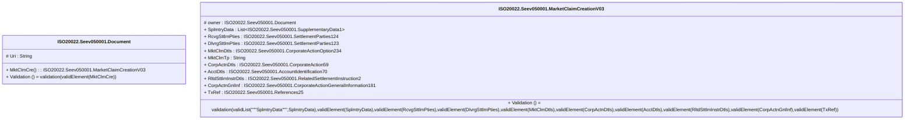

# seev.050.001.03-physical

> The tables below contain descriptions of the members of each Element. 
> The first column indicates the type of the member:
> A ‘#’ indicates that the field is a key to the element, and a ‘+’ indicates that the field is a value.
> The ‘*’ column contains a description for the element member.  
> The ‘@’ column contains any properties for the member.
> The ‘=’ column contains calculated values; or in the case of an enum, the serialized value.

---

## EntityImpl ISO20022.Seev050001.Document

| |Name|Type|*|@|=|
|-|-|-|-|-|-|
|#|Uri|String||XmlIgnore(), JsonIgnore()||
|+|MktClmCre|ISO20022.Seev050001.MarketClaimCreationV03||XmlElement()||
||Validation|Some(String)||XmlIgnore(), JsonIgnore()|validation(validElement(MktClmCre))|

---

## AspectImpl ISO20022.Seev050001.MarketClaimCreationV03

| |Name|Type|*|@|=|
|-|-|-|-|-|-|
|#|owner|ISO20022.Seev050001.Document||||
|+|SplmtryData|List<ISO20022.Seev050001.SupplementaryData1>||XmlElement()||
|+|RcvgSttlmPties|ISO20022.Seev050001.SettlementParties124||XmlElement()||
|+|DlvrgSttlmPties|ISO20022.Seev050001.SettlementParties123||XmlElement()||
|+|MktClmDtls|ISO20022.Seev050001.CorporateActionOption234||XmlElement()||
|+|MktClmTp|String||XmlElement()||
|+|CorpActnDtls|ISO20022.Seev050001.CorporateAction59||XmlElement()||
|+|AcctDtls|ISO20022.Seev050001.AccountIdentification70||XmlElement()||
|+|RltdSttlmInstrDtls|ISO20022.Seev050001.RelatedSettlementInstruction2||XmlElement()||
|+|CorpActnGnlInf|ISO20022.Seev050001.CorporateActionGeneralInformation181||XmlElement()||
|+|TxRef|ISO20022.Seev050001.References25||XmlElement()||
||Validation|Some(String)||XmlIgnore(), JsonIgnore()|validation(validList("""SplmtryData""",SplmtryData),validElement(SplmtryData),validElement(RcvgSttlmPties),validElement(DlvrgSttlmPties),validElement(MktClmDtls),validElement(CorpActnDtls),validElement(AcctDtls),validElement(RltdSttlmInstrDtls),validElement(CorpActnGnlInf),validElement(TxRef))|

