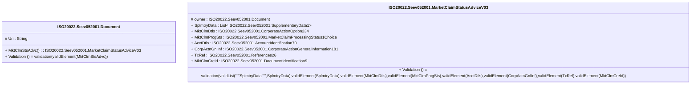

# seev.052.001.03-physical

> The tables below contain descriptions of the members of each Element. 
> The first column indicates the type of the member:
> A ‘#’ indicates that the field is a key to the element, and a ‘+’ indicates that the field is a value.
> The ‘*’ column contains a description for the element member.  
> The ‘@’ column contains any properties for the member.
> The ‘=’ column contains calculated values; or in the case of an enum, the serialized value.

---

## EntityImpl ISO20022.Seev052001.Document

| |Name|Type|*|@|=|
|-|-|-|-|-|-|
|#|Uri|String||XmlIgnore(), JsonIgnore()||
|+|MktClmStsAdvc|ISO20022.Seev052001.MarketClaimStatusAdviceV03||XmlElement()||
||Validation|Some(String)||XmlIgnore(), JsonIgnore()|validation(validElement(MktClmStsAdvc))|

---

## AspectImpl ISO20022.Seev052001.MarketClaimStatusAdviceV03

| |Name|Type|*|@|=|
|-|-|-|-|-|-|
|#|owner|ISO20022.Seev052001.Document||||
|+|SplmtryData|List<ISO20022.Seev052001.SupplementaryData1>||XmlElement()||
|+|MktClmDtls|ISO20022.Seev052001.CorporateActionOption234||XmlElement()||
|+|MktClmPrcgSts|ISO20022.Seev052001.MarketClaimProcessingStatus1Choice||XmlElement()||
|+|AcctDtls|ISO20022.Seev052001.AccountIdentification70||XmlElement()||
|+|CorpActnGnlInf|ISO20022.Seev052001.CorporateActionGeneralInformation181||XmlElement()||
|+|TxRef|ISO20022.Seev052001.References26||XmlElement()||
|+|MktClmCreId|ISO20022.Seev052001.DocumentIdentification9||XmlElement()||
||Validation|Some(String)||XmlIgnore(), JsonIgnore()|validation(validList("""SplmtryData""",SplmtryData),validElement(SplmtryData),validElement(MktClmDtls),validElement(MktClmPrcgSts),validElement(AcctDtls),validElement(CorpActnGnlInf),validElement(TxRef),validElement(MktClmCreId))|

