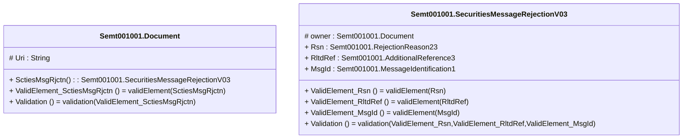

# semt.001.001.03-physical

> The tables below contain descriptions of the members of each Element. 
> The first column indicates the type of the member:
> A ‘#’ indicates that the field is a key to the element, and a ‘+’ indicates that the field is a value.
> The ‘*’ column contains a description for the element member.  
> The ‘@’ column contains any properties for the member.
> The ‘=’ column contains calculated values; or in the case of an enum, the serialized value.

---

## EntityImpl Semt001001.Document

| |Name|Type|*|@|=|
|-|-|-|-|-|-|
|#|Uri|String||XmlIgnore(), JsonIgnore()||
|+|SctiesMsgRjctn|Semt001001.SecuritiesMessageRejectionV03||XmlElement()||
||ValidElement_SctiesMsgRjctn|Some(String)||XmlIgnore(), JsonIgnore()|validElement(SctiesMsgRjctn)|
||Validation|Some(String)||XmlIgnore(), JsonIgnore()|validation(ValidElement_SctiesMsgRjctn)|

---

## AspectImpl Semt001001.SecuritiesMessageRejectionV03

| |Name|Type|*|@|=|
|-|-|-|-|-|-|
|#|owner|Semt001001.Document||||
|+|Rsn|Semt001001.RejectionReason23||XmlElement()||
|+|RltdRef|Semt001001.AdditionalReference3||XmlElement()||
|+|MsgId|Semt001001.MessageIdentification1||XmlElement()||
||ValidElement_Rsn|Some(String)||XmlIgnore(), JsonIgnore()|validElement(Rsn)|
||ValidElement_RltdRef|Some(String)||XmlIgnore(), JsonIgnore()|validElement(RltdRef)|
||ValidElement_MsgId|Some(String)||XmlIgnore(), JsonIgnore()|validElement(MsgId)|
||Validation|Some(String)||XmlIgnore(), JsonIgnore()|validation(ValidElement_Rsn,ValidElement_RltdRef,ValidElement_MsgId)|

