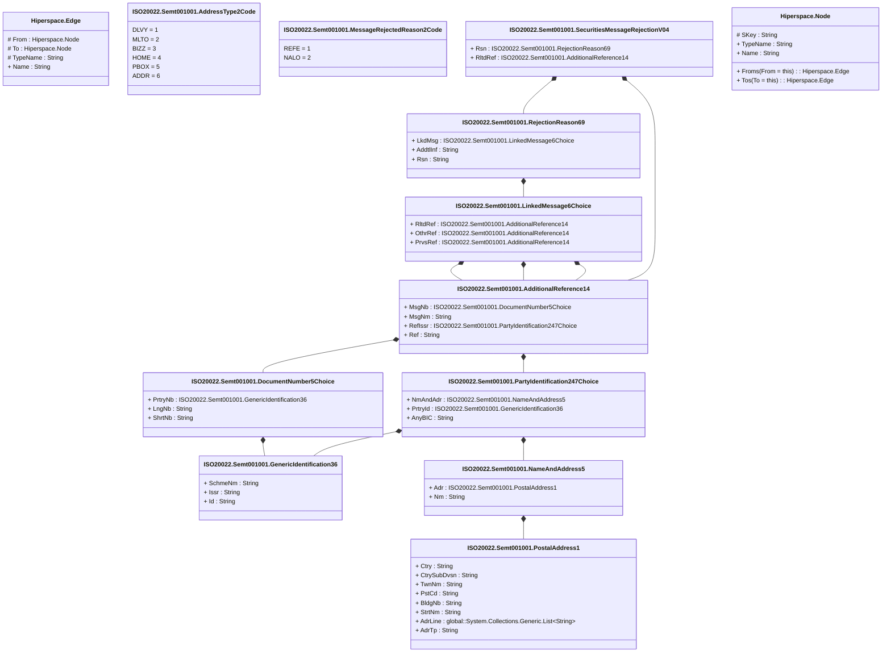

# semt.001.001.04

> The tables below contain descriptions of the members of each Element. 
> The first column indicates the type of the member:
> A ‘#’ indicates that the field is a key to the element, and a ‘+’ indicates that the field is a value.
> The ‘*’ column contains a description for the element member.  
> The ‘@’ column contains any properties for the member.
> The ‘=’ column contains calculated values; or in the case of an enum, the serialized value.

---

## View Hiperspace.Edge
edge between nodes

| |Name|Type|*|@|=|
|-|-|-|-|-|-|
|#|From|Hiperspace.Node||||
|#|To|Hiperspace.Node||||
|#|TypeName|String||||
|+|Name|String||||

---

## Value ISO20022.Semt001001.AdditionalReference14

| |Name|Type|*|@|=|
|-|-|-|-|-|-|
|+|MsgNb|ISO20022.Semt001001.DocumentNumber5Choice||XmlElement()||
|+|MsgNm|String||XmlElement()||
|+|RefIssr|ISO20022.Semt001001.PartyIdentification247Choice||XmlElement()||
|+|Ref|String||XmlElement()||
||Validation|Some(String)||XmlIgnore(), JsonIgnore()|validation(validElement(MsgNb),validElement(RefIssr))|

---

## Enum ISO20022.Semt001001.AddressType2Code

| |Name|Type|*|@|=|
|-|-|-|-|-|-|
||DLVY|Int32||XmlEnum("""DLVY""")|1|
||MLTO|Int32||XmlEnum("""MLTO""")|2|
||BIZZ|Int32||XmlEnum("""BIZZ""")|3|
||HOME|Int32||XmlEnum("""HOME""")|4|
||PBOX|Int32||XmlEnum("""PBOX""")|5|
||ADDR|Int32||XmlEnum("""ADDR""")|6|

---

## Type ISO20022.Semt001001.Document

| |Name|Type|*|@|=|
|-|-|-|-|-|-|
|+|SctiesMsgRjctn|ISO20022.Semt001001.SecuritiesMessageRejectionV04||XmlElement()||
||Validation|Some(String)||XmlIgnore(), JsonIgnore()|validation(validElement(SctiesMsgRjctn))|

---

## Value ISO20022.Semt001001.DocumentNumber5Choice

| |Name|Type|*|@|=|
|-|-|-|-|-|-|
|+|PrtryNb|ISO20022.Semt001001.GenericIdentification36||XmlElement()||
|+|LngNb|String||XmlElement()||
|+|ShrtNb|String||XmlElement()||
||Validation|Some(String)||XmlIgnore(), JsonIgnore()|validation(validElement(PrtryNb),validPattern("""LngNb""",LngNb,"""[a-z]{4}\.[0-9]{3}\.[0-9]{3}\.[0-9]{2}"""),validPattern("""ShrtNb""",ShrtNb,"""[0-9]{3}"""),validChoice(PrtryNb,LngNb,ShrtNb))|

---

## Value ISO20022.Semt001001.GenericIdentification36

| |Name|Type|*|@|=|
|-|-|-|-|-|-|
|+|SchmeNm|String||XmlElement()||
|+|Issr|String||XmlElement()||
|+|Id|String||XmlElement()||
||Validation|Some(String)||XmlIgnore(), JsonIgnore()|""|

---

## Value ISO20022.Semt001001.LinkedMessage6Choice

| |Name|Type|*|@|=|
|-|-|-|-|-|-|
|+|RltdRef|ISO20022.Semt001001.AdditionalReference14||XmlElement()||
|+|OthrRef|ISO20022.Semt001001.AdditionalReference14||XmlElement()||
|+|PrvsRef|ISO20022.Semt001001.AdditionalReference14||XmlElement()||
||Validation|Some(String)||XmlIgnore(), JsonIgnore()|validation(validElement(RltdRef),validElement(OthrRef),validElement(PrvsRef),validChoice(RltdRef,OthrRef,PrvsRef))|

---

## Enum ISO20022.Semt001001.MessageRejectedReason2Code

| |Name|Type|*|@|=|
|-|-|-|-|-|-|
||REFE|Int32||XmlEnum("""REFE""")|1|
||NALO|Int32||XmlEnum("""NALO""")|2|

---

## Value ISO20022.Semt001001.NameAndAddress5

| |Name|Type|*|@|=|
|-|-|-|-|-|-|
|+|Adr|ISO20022.Semt001001.PostalAddress1||XmlElement()||
|+|Nm|String||XmlElement()||
||Validation|Some(String)||XmlIgnore(), JsonIgnore()|validation(validElement(Adr))|

---

## Value ISO20022.Semt001001.PartyIdentification247Choice

| |Name|Type|*|@|=|
|-|-|-|-|-|-|
|+|NmAndAdr|ISO20022.Semt001001.NameAndAddress5||XmlElement()||
|+|PrtryId|ISO20022.Semt001001.GenericIdentification36||XmlElement()||
|+|AnyBIC|String||XmlElement()||
||Validation|Some(String)||XmlIgnore(), JsonIgnore()|validation(validElement(NmAndAdr),validElement(PrtryId),validPattern("""AnyBIC""",AnyBIC,"""[A-Z0-9]{4,4}[A-Z]{2,2}[A-Z0-9]{2,2}([A-Z0-9]{3,3}){0,1}"""),validChoice(NmAndAdr,PrtryId,AnyBIC))|

---

## Value ISO20022.Semt001001.PostalAddress1

| |Name|Type|*|@|=|
|-|-|-|-|-|-|
|+|Ctry|String||XmlElement()||
|+|CtrySubDvsn|String||XmlElement()||
|+|TwnNm|String||XmlElement()||
|+|PstCd|String||XmlElement()||
|+|BldgNb|String||XmlElement()||
|+|StrtNm|String||XmlElement()||
|+|AdrLine|global::System.Collections.Generic.List<String>||XmlElement()||
|+|AdrTp|String||XmlElement()||
||Validation|Some(String)||XmlIgnore(), JsonIgnore()|validation(validPattern("""Ctry""",Ctry,"""[A-Z]{2,2}"""),validListMax("""AdrLine""",AdrLine,5))|

---

## Value ISO20022.Semt001001.RejectionReason69

| |Name|Type|*|@|=|
|-|-|-|-|-|-|
|+|LkdMsg|ISO20022.Semt001001.LinkedMessage6Choice||XmlElement()||
|+|AddtlInf|String||XmlElement()||
|+|Rsn|String||XmlElement()||
||Validation|Some(String)||XmlIgnore(), JsonIgnore()|validation(validElement(LkdMsg))|

---

## Aspect ISO20022.Semt001001.SecuritiesMessageRejectionV04

| |Name|Type|*|@|=|
|-|-|-|-|-|-|
|+|Rsn|ISO20022.Semt001001.RejectionReason69||XmlElement()||
|+|RltdRef|ISO20022.Semt001001.AdditionalReference14||XmlElement()||
||Validation|Some(String)||XmlIgnore(), JsonIgnore()|validation(validElement(Rsn),validElement(RltdRef))|

---

## View Hiperspace.Node
node in a graph view of data

| |Name|Type|*|@|=|
|-|-|-|-|-|-|
|#|SKey|String||||
|+|TypeName|String||||
|+|Name|String||||
||Froms|Hiperspace.Edge|||From = this|
||Tos|Hiperspace.Edge|||To = this|

