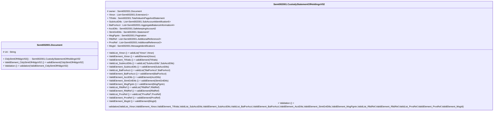

# semt.002.001.02-physical

> The tables below contain descriptions of the members of each Element. 
> The first column indicates the type of the member:
> A ‘#’ indicates that the field is a key to the element, and a ‘+’ indicates that the field is a value.
> The ‘*’ column contains a description for the element member.  
> The ‘@’ column contains any properties for the member.
> The ‘=’ column contains calculated values; or in the case of an enum, the serialized value.

---

## EntityImpl Semt002001.Document

| |Name|Type|*|@|=|
|-|-|-|-|-|-|
|#|Uri|String||XmlIgnore(), JsonIgnore()||
|+|CtdyStmtOfHldgsV02|Semt002001.CustodyStatementOfHoldingsV02||XmlElement()||
||ValidElement_CtdyStmtOfHldgsV02|Some(String)||XmlIgnore(), JsonIgnore()|validElement(CtdyStmtOfHldgsV02)|
||Validation|Some(String)||XmlIgnore(), JsonIgnore()|validation(ValidElement_CtdyStmtOfHldgsV02)|

---

## AspectImpl Semt002001.CustodyStatementOfHoldingsV02

| |Name|Type|*|@|=|
|-|-|-|-|-|-|
|#|owner|Semt002001.Document||||
|+|Xtnsn|List<Semt002001.Extension1>||XmlElement()||
|+|TtlVals|Semt002001.TotalValueInPageAndStatement||XmlElement()||
|+|SubAcctDtls|List<Semt002001.SubAccountIdentification5>||XmlElement()||
|+|BalForAcct|List<Semt002001.AggregateBalanceInformation4>||XmlElement()||
|+|AcctDtls|Semt002001.SafekeepingAccount2||XmlElement()||
|+|StmtGnlDtls|Semt002001.Statement7||XmlElement()||
|+|MsgPgntn|Semt002001.Pagination||XmlElement()||
|+|RltdRef|List<Semt002001.AdditionalReference2>||XmlElement()||
|+|PrvsRef|List<Semt002001.AdditionalReference2>||XmlElement()||
|+|MsgId|Semt002001.MessageIdentification1||XmlElement()||
||ValidList_Xtnsn|Some(String)||XmlIgnore(), JsonIgnore()|validList("Xtnsn",Xtnsn)|
||ValidElement_Xtnsn|Some(String)||XmlIgnore(), JsonIgnore()|validElement(Xtnsn)|
||ValidElement_TtlVals|Some(String)||XmlIgnore(), JsonIgnore()|validElement(TtlVals)|
||ValidList_SubAcctDtls|Some(String)||XmlIgnore(), JsonIgnore()|validList("SubAcctDtls",SubAcctDtls)|
||ValidElement_SubAcctDtls|Some(String)||XmlIgnore(), JsonIgnore()|validElement(SubAcctDtls)|
||ValidList_BalForAcct|Some(String)||XmlIgnore(), JsonIgnore()|validList("BalForAcct",BalForAcct)|
||ValidElement_BalForAcct|Some(String)||XmlIgnore(), JsonIgnore()|validElement(BalForAcct)|
||ValidElement_AcctDtls|Some(String)||XmlIgnore(), JsonIgnore()|validElement(AcctDtls)|
||ValidElement_StmtGnlDtls|Some(String)||XmlIgnore(), JsonIgnore()|validElement(StmtGnlDtls)|
||ValidElement_MsgPgntn|Some(String)||XmlIgnore(), JsonIgnore()|validElement(MsgPgntn)|
||ValidList_RltdRef|Some(String)||XmlIgnore(), JsonIgnore()|validList("RltdRef",RltdRef)|
||ValidElement_RltdRef|Some(String)||XmlIgnore(), JsonIgnore()|validElement(RltdRef)|
||ValidList_PrvsRef|Some(String)||XmlIgnore(), JsonIgnore()|validList("PrvsRef",PrvsRef)|
||ValidElement_PrvsRef|Some(String)||XmlIgnore(), JsonIgnore()|validElement(PrvsRef)|
||ValidElement_MsgId|Some(String)||XmlIgnore(), JsonIgnore()|validElement(MsgId)|
||Validation|Some(String)||XmlIgnore(), JsonIgnore()|validation(ValidList_Xtnsn,ValidElement_Xtnsn,ValidElement_TtlVals,ValidList_SubAcctDtls,ValidElement_SubAcctDtls,ValidList_BalForAcct,ValidElement_BalForAcct,ValidElement_AcctDtls,ValidElement_StmtGnlDtls,ValidElement_MsgPgntn,ValidList_RltdRef,ValidElement_RltdRef,ValidList_PrvsRef,ValidElement_PrvsRef,ValidElement_MsgId)|

