# semt.002.001.12-physical

```mermaid
classDiagram
    class ISO20022.Semt002001.Document {
        # Uri  : String
        + SctiesBalCtdyRpt () : ISO20022.Semt002001.SecuritiesBalanceCustodyReportV12
        + Validation () = validation(validElement(SctiesBalCtdyRpt))
    }
    class ISO20022.Semt002001.SecuritiesBalanceCustodyReportV12 {
        # owner  : ISO20022.Semt002001.Document
        + AcctBaseCcyTtlAmts  : ISO20022.Semt002001.TotalValueInPageAndStatement1
        + SubAcctDtls  : List~ISO20022.Semt002001.SubAccountIdentification71~
        + BalForAcct  : List~ISO20022.Semt002001.AggregateBalanceInformation46~
        + IntrmyInf  : List~ISO20022.Semt002001.Intermediary44~
        + BlckChainAdrOrWllt  : ISO20022.Semt002001.BlockChainAddressWallet1
        + SfkpgAcct  : ISO20022.Semt002001.SecuritiesAccount26
        + AcctSvcr  : ISO20022.Semt002001.PartyIdentification136
        + AcctOwnr  : ISO20022.Semt002001.PartyIdentification144
        + StmtGnlDtls  : ISO20022.Semt002001.Statement73
        + Pgntn  : ISO20022.Semt002001.Pagination1
        + Validation () = validation(validElement(AcctBaseCcyTtlAmts),validList("""SubAcctDtls""",SubAcctDtls),validElement(SubAcctDtls),validList("""BalForAcct""",BalForAcct),validElement(BalForAcct),validList("""IntrmyInf""",IntrmyInf),validListMax("""IntrmyInf""",IntrmyInf,10),validElement(IntrmyInf),validElement(BlckChainAdrOrWllt),validElement(SfkpgAcct),validElement(AcctSvcr),validElement(AcctOwnr),validElement(StmtGnlDtls),validElement(Pgntn))
    }
```

> The tables below contain descriptions of the members of each Element. 
> The first column indicates the type of the member:
> A ‘#’ indicates that the field is a key to the element, and a ‘+’ indicates that the field is a value.
> The ‘*’ column contains a description for the element member.  
> The ‘@’ column contains any properties for the member.
> The ‘=’ column contains calculated values; or in the case of an enum, the serialized value.

---

## EntityImpl ISO20022.Semt002001.Document

| |Name|Type|*|@|=|
|-|-|-|-|-|-|
|#|Uri|String||XmlIgnore(), JsonIgnore()||
|+|SctiesBalCtdyRpt|ISO20022.Semt002001.SecuritiesBalanceCustodyReportV12||XmlElement()||
||Validation|Some(String)||XmlIgnore(), JsonIgnore()|validation(validElement(SctiesBalCtdyRpt))|

---

## AspectImpl ISO20022.Semt002001.SecuritiesBalanceCustodyReportV12

| |Name|Type|*|@|=|
|-|-|-|-|-|-|
|#|owner|ISO20022.Semt002001.Document||||
|+|AcctBaseCcyTtlAmts|ISO20022.Semt002001.TotalValueInPageAndStatement1||XmlElement()||
|+|SubAcctDtls|List<ISO20022.Semt002001.SubAccountIdentification71>||XmlElement()||
|+|BalForAcct|List<ISO20022.Semt002001.AggregateBalanceInformation46>||XmlElement()||
|+|IntrmyInf|List<ISO20022.Semt002001.Intermediary44>||XmlElement()||
|+|BlckChainAdrOrWllt|ISO20022.Semt002001.BlockChainAddressWallet1||XmlElement()||
|+|SfkpgAcct|ISO20022.Semt002001.SecuritiesAccount26||XmlElement()||
|+|AcctSvcr|ISO20022.Semt002001.PartyIdentification136||XmlElement()||
|+|AcctOwnr|ISO20022.Semt002001.PartyIdentification144||XmlElement()||
|+|StmtGnlDtls|ISO20022.Semt002001.Statement73||XmlElement()||
|+|Pgntn|ISO20022.Semt002001.Pagination1||XmlElement()||
||Validation|Some(String)||XmlIgnore(), JsonIgnore()|validation(validElement(AcctBaseCcyTtlAmts),validList("""SubAcctDtls""",SubAcctDtls),validElement(SubAcctDtls),validList("""BalForAcct""",BalForAcct),validElement(BalForAcct),validList("""IntrmyInf""",IntrmyInf),validListMax("""IntrmyInf""",IntrmyInf,10),validElement(IntrmyInf),validElement(BlckChainAdrOrWllt),validElement(SfkpgAcct),validElement(AcctSvcr),validElement(AcctOwnr),validElement(StmtGnlDtls),validElement(Pgntn))|

