# semt.003.001.02-physical

```mermaid
classDiagram
    class Semt003001.Document {
        # Uri  : String
        + AcctgStmtOfHldgsV02 () : Semt003001.AccountingStatementOfHoldingsV02
        + ValidElement_AcctgStmtOfHldgsV02 () = validElement(AcctgStmtOfHldgsV02)
        + Validation () = validation(ValidElement_AcctgStmtOfHldgsV02)
    }
    class Semt003001.AccountingStatementOfHoldingsV02 {
        # owner  : Semt003001.Document
        + Xtnsn  : List~Semt003001.Extension1~
        + TtlVals  : Semt003001.TotalValueInPageAndStatement
        + SubAcctDtls  : List~Semt003001.SubAccountIdentification3~
        + BalForAcct  : List~Semt003001.AggregateBalanceInformation3~
        + AcctDtls  : Semt003001.SafekeepingAccount2
        + StmtGnlDtls  : Semt003001.Statement6
        + MsgPgntn  : Semt003001.Pagination
        + RltdRef  : List~Semt003001.AdditionalReference2~
        + PrvsRef  : List~Semt003001.AdditionalReference2~
        + MsgId  : Semt003001.MessageIdentification1
        + ValidList_Xtnsn () = validList("Xtnsn",Xtnsn)
        + ValidElement_Xtnsn () = validElement(Xtnsn)
        + ValidElement_TtlVals () = validElement(TtlVals)
        + ValidList_SubAcctDtls () = validList("SubAcctDtls",SubAcctDtls)
        + ValidElement_SubAcctDtls () = validElement(SubAcctDtls)
        + ValidList_BalForAcct () = validList("BalForAcct",BalForAcct)
        + ValidElement_BalForAcct () = validElement(BalForAcct)
        + ValidElement_AcctDtls () = validElement(AcctDtls)
        + ValidElement_StmtGnlDtls () = validElement(StmtGnlDtls)
        + ValidElement_MsgPgntn () = validElement(MsgPgntn)
        + ValidList_RltdRef () = validList("RltdRef",RltdRef)
        + ValidElement_RltdRef () = validElement(RltdRef)
        + ValidList_PrvsRef () = validList("PrvsRef",PrvsRef)
        + ValidElement_PrvsRef () = validElement(PrvsRef)
        + ValidElement_MsgId () = validElement(MsgId)
        + Validation () = validation(ValidList_Xtnsn,ValidElement_Xtnsn,ValidElement_TtlVals,ValidList_SubAcctDtls,ValidElement_SubAcctDtls,ValidList_BalForAcct,ValidElement_BalForAcct,ValidElement_AcctDtls,ValidElement_StmtGnlDtls,ValidElement_MsgPgntn,ValidList_RltdRef,ValidElement_RltdRef,ValidList_PrvsRef,ValidElement_PrvsRef,ValidElement_MsgId)
    }
```

> The tables below contain descriptions of the members of each Element. 
> The first column indicates the type of the member:
> A ‘#’ indicates that the field is a key to the element, and a ‘+’ indicates that the field is a value.
> The ‘*’ column contains a description for the element member.  
> The ‘@’ column contains any properties for the member.
> The ‘=’ column contains calculated values; or in the case of an enum, the serialized value.

---

## EntityImpl Semt003001.Document

| |Name|Type|*|@|=|
|-|-|-|-|-|-|
|#|Uri|String||XmlIgnore(), JsonIgnore()||
|+|AcctgStmtOfHldgsV02|Semt003001.AccountingStatementOfHoldingsV02||XmlElement()||
||ValidElement_AcctgStmtOfHldgsV02|Some(String)||XmlIgnore(), JsonIgnore()|validElement(AcctgStmtOfHldgsV02)|
||Validation|Some(String)||XmlIgnore(), JsonIgnore()|validation(ValidElement_AcctgStmtOfHldgsV02)|

---

## AspectImpl Semt003001.AccountingStatementOfHoldingsV02

| |Name|Type|*|@|=|
|-|-|-|-|-|-|
|#|owner|Semt003001.Document||||
|+|Xtnsn|List<Semt003001.Extension1>||XmlElement()||
|+|TtlVals|Semt003001.TotalValueInPageAndStatement||XmlElement()||
|+|SubAcctDtls|List<Semt003001.SubAccountIdentification3>||XmlElement()||
|+|BalForAcct|List<Semt003001.AggregateBalanceInformation3>||XmlElement()||
|+|AcctDtls|Semt003001.SafekeepingAccount2||XmlElement()||
|+|StmtGnlDtls|Semt003001.Statement6||XmlElement()||
|+|MsgPgntn|Semt003001.Pagination||XmlElement()||
|+|RltdRef|List<Semt003001.AdditionalReference2>||XmlElement()||
|+|PrvsRef|List<Semt003001.AdditionalReference2>||XmlElement()||
|+|MsgId|Semt003001.MessageIdentification1||XmlElement()||
||ValidList_Xtnsn|Some(String)||XmlIgnore(), JsonIgnore()|validList("Xtnsn",Xtnsn)|
||ValidElement_Xtnsn|Some(String)||XmlIgnore(), JsonIgnore()|validElement(Xtnsn)|
||ValidElement_TtlVals|Some(String)||XmlIgnore(), JsonIgnore()|validElement(TtlVals)|
||ValidList_SubAcctDtls|Some(String)||XmlIgnore(), JsonIgnore()|validList("SubAcctDtls",SubAcctDtls)|
||ValidElement_SubAcctDtls|Some(String)||XmlIgnore(), JsonIgnore()|validElement(SubAcctDtls)|
||ValidList_BalForAcct|Some(String)||XmlIgnore(), JsonIgnore()|validList("BalForAcct",BalForAcct)|
||ValidElement_BalForAcct|Some(String)||XmlIgnore(), JsonIgnore()|validElement(BalForAcct)|
||ValidElement_AcctDtls|Some(String)||XmlIgnore(), JsonIgnore()|validElement(AcctDtls)|
||ValidElement_StmtGnlDtls|Some(String)||XmlIgnore(), JsonIgnore()|validElement(StmtGnlDtls)|
||ValidElement_MsgPgntn|Some(String)||XmlIgnore(), JsonIgnore()|validElement(MsgPgntn)|
||ValidList_RltdRef|Some(String)||XmlIgnore(), JsonIgnore()|validList("RltdRef",RltdRef)|
||ValidElement_RltdRef|Some(String)||XmlIgnore(), JsonIgnore()|validElement(RltdRef)|
||ValidList_PrvsRef|Some(String)||XmlIgnore(), JsonIgnore()|validList("PrvsRef",PrvsRef)|
||ValidElement_PrvsRef|Some(String)||XmlIgnore(), JsonIgnore()|validElement(PrvsRef)|
||ValidElement_MsgId|Some(String)||XmlIgnore(), JsonIgnore()|validElement(MsgId)|
||Validation|Some(String)||XmlIgnore(), JsonIgnore()|validation(ValidList_Xtnsn,ValidElement_Xtnsn,ValidElement_TtlVals,ValidList_SubAcctDtls,ValidElement_SubAcctDtls,ValidList_BalForAcct,ValidElement_BalForAcct,ValidElement_AcctDtls,ValidElement_StmtGnlDtls,ValidElement_MsgPgntn,ValidList_RltdRef,ValidElement_RltdRef,ValidList_PrvsRef,ValidElement_PrvsRef,ValidElement_MsgId)|

