# semt.014.001.08

```mermaid
classDiagram
    class Hiperspace.Edge {
        # From  : Hiperspace.Node
        # To  : Hiperspace.Node
        # TypeName  : String
        + Name  : String
    }
    class ISO20022.Semt014001.AcknowledgedAcceptedStatus21Choice {
        + Rsn  : global::System.Collections.Generic.List~ISO20022.Semt014001.AcknowledgementReason9~
        + NoSpcfdRsn  : String
    }
    ISO20022.Semt014001.AcknowledgedAcceptedStatus21Choice *-- ISO20022.Semt014001.AcknowledgementReason9
    class ISO20022.Semt014001.AcknowledgementReason12Choice {
        + Prtry  : ISO20022.Semt014001.GenericIdentification30
        + Cd  : String
    }
    ISO20022.Semt014001.AcknowledgementReason12Choice *-- ISO20022.Semt014001.GenericIdentification30
    class ISO20022.Semt014001.AcknowledgementReason5Code {
        LATE = 1
        RQWV = 2
        NSTP = 3
        CDRE = 4
        CDRG = 5
        CDCY = 6
        OTHR = 7
        SMPG = 8
        ADEA = 9
    }
    class ISO20022.Semt014001.AcknowledgementReason9 {
        + AddtlRsnInf  : String
        + Cd  : ISO20022.Semt014001.AcknowledgementReason12Choice
    }
    ISO20022.Semt014001.AcknowledgementReason9 *-- ISO20022.Semt014001.AcknowledgementReason12Choice
    class ISO20022.Semt014001.BlockChainAddressWallet3 {
        + Nm  : String
        + Tp  : ISO20022.Semt014001.GenericIdentification30
        + Id  : String
    }
    ISO20022.Semt014001.BlockChainAddressWallet3 *-- ISO20022.Semt014001.GenericIdentification30
    class ISO20022.Semt014001.CancellationReason22 {
        + AddtlRsnInf  : String
        + Cd  : ISO20022.Semt014001.CancellationReason36Choice
    }
    ISO20022.Semt014001.CancellationReason22 *-- ISO20022.Semt014001.CancellationReason36Choice
    class ISO20022.Semt014001.CancellationReason36Choice {
        + Prtry  : ISO20022.Semt014001.GenericIdentification30
        + Cd  : String
    }
    ISO20022.Semt014001.CancellationReason36Choice *-- ISO20022.Semt014001.GenericIdentification30
    class ISO20022.Semt014001.CancellationStatus24Choice {
        + Rsn  : global::System.Collections.Generic.List~ISO20022.Semt014001.CancellationReason22~
        + NoSpcfdRsn  : String
    }
    ISO20022.Semt014001.CancellationStatus24Choice *-- ISO20022.Semt014001.CancellationReason22
    class ISO20022.Semt014001.CancelledStatusReason16Code {
        CORP = 1
        CANI = 2
        CANS = 3
        CSUB = 4
        CANT = 5
        CANZ = 6
        CTHP = 7
        BYIY = 8
        CXLR = 9
        OTHR = 10
        SCEX = 11
    }
    class ISO20022.Semt014001.DateAndDateTime2Choice {
        + DtTm  : DateTime
        + Dt  : DateTime
    }
    class ISO20022.Semt014001.FailingReason3Code {
        INBC = 1
        PRSY = 2
        CERT = 3
        SETS = 4
        REGT = 5
        PRCY = 6
        LIQU = 7
        LATE = 8
        LAAW = 9
        FROZ = 10
        DKNY = 11
        DISA = 12
        DENO = 13
        CLHT = 14
        BOTH = 15
        BENO = 16
        PHCK = 17
        OTHR = 18
        IAAD = 19
        MINO = 20
        CPEC = 21
        SBLO = 22
        CYCL = 23
        BATC = 24
        SDUT = 25
        REFS = 26
        NCON = 27
        MONY = 28
        LALO = 29
        LACK = 30
        LINK = 31
        INCA = 32
        FLIM = 33
        DEPO = 34
        COLL = 35
        YCOL = 36
        CMON = 37
        NOFX = 38
        PART = 39
        PREA = 40
        GLOB = 41
        MUNO = 42
        CLAC = 43
        NEWI = 44
        CHAS = 45
        BLOC = 46
        DOCC = 47
        MLAT = 48
        DOCY = 49
        STCD = 50
        PHSE = 51
        AWSH = 52
        OBJT = 53
        CAIS = 54
        CANR = 55
        ADEA = 56
        CLAT = 57
        BYIY = 58
        AWMO = 59
    }
    class ISO20022.Semt014001.FailingReason7 {
        + AddtlRsnInf  : String
        + Cd  : ISO20022.Semt014001.FailingReason7Choice
    }
    ISO20022.Semt014001.FailingReason7 *-- ISO20022.Semt014001.FailingReason7Choice
    class ISO20022.Semt014001.FailingReason7Choice {
        + Prtry  : ISO20022.Semt014001.GenericIdentification30
        + Cd  : String
    }
    ISO20022.Semt014001.FailingReason7Choice *-- ISO20022.Semt014001.GenericIdentification30
    class ISO20022.Semt014001.FailingStatus9Choice {
        + Rsn  : global::System.Collections.Generic.List~ISO20022.Semt014001.FailingReason7~
        + NoSpcfdRsn  : String
    }
    ISO20022.Semt014001.FailingStatus9Choice *-- ISO20022.Semt014001.FailingReason7
    class ISO20022.Semt014001.FinancialInstrumentQuantity33Choice {
        + DgtlTknUnit  : Decimal
        + AmtsdVal  : Decimal
        + FaceAmt  : Decimal
        + Unit  : Decimal
    }
    class ISO20022.Semt014001.GenericIdentification30 {
        + SchmeNm  : String
        + Issr  : String
        + Id  : String
    }
    class ISO20022.Semt014001.GenericIdentification36 {
        + SchmeNm  : String
        + Issr  : String
        + Id  : String
    }
    class ISO20022.Semt014001.GenericIdentification37 {
        + Issr  : String
        + Id  : String
    }
    class ISO20022.Semt014001.IdentificationSource3Choice {
        + Prtry  : String
        + Cd  : String
    }
    class ISO20022.Semt014001.IntraPositionDetails60 {
        + BalTo  : ISO20022.Semt014001.SecuritiesBalanceType7Choice
        + BalFr  : ISO20022.Semt014001.SecuritiesBalanceType7Choice
        + AckdStsTmStmp  : DateTime
        + SttlmDt  : ISO20022.Semt014001.DateAndDateTime2Choice
        + LotNb  : ISO20022.Semt014001.GenericIdentification37
        + SttlmQty  : ISO20022.Semt014001.FinancialInstrumentQuantity33Choice
        + FinInstrmId  : ISO20022.Semt014001.SecurityIdentification19
        + BlckChainAdrOrWllt  : ISO20022.Semt014001.BlockChainAddressWallet3
        + SfkpgAcct  : ISO20022.Semt014001.SecuritiesAccount19
        + AcctOwnr  : ISO20022.Semt014001.PartyIdentification127Choice
        + PoolId  : String
    }
    ISO20022.Semt014001.IntraPositionDetails60 *-- ISO20022.Semt014001.SecuritiesBalanceType7Choice
    ISO20022.Semt014001.IntraPositionDetails60 *-- ISO20022.Semt014001.SecuritiesBalanceType7Choice
    ISO20022.Semt014001.IntraPositionDetails60 *-- ISO20022.Semt014001.DateAndDateTime2Choice
    ISO20022.Semt014001.IntraPositionDetails60 *-- ISO20022.Semt014001.GenericIdentification37
    ISO20022.Semt014001.IntraPositionDetails60 *-- ISO20022.Semt014001.FinancialInstrumentQuantity33Choice
    ISO20022.Semt014001.IntraPositionDetails60 *-- ISO20022.Semt014001.SecurityIdentification19
    ISO20022.Semt014001.IntraPositionDetails60 *-- ISO20022.Semt014001.BlockChainAddressWallet3
    ISO20022.Semt014001.IntraPositionDetails60 *-- ISO20022.Semt014001.SecuritiesAccount19
    ISO20022.Semt014001.IntraPositionDetails60 *-- ISO20022.Semt014001.PartyIdentification127Choice
    class ISO20022.Semt014001.IntraPositionMovementStatusAdviceV08 {
        + SplmtryData  : global::System.Collections.Generic.List~ISO20022.Semt014001.SupplementaryData1~
        + TxDtls  : ISO20022.Semt014001.IntraPositionDetails60
        + SttlmSts  : ISO20022.Semt014001.SettlementStatus16Choice
        + PrcgSts  : ISO20022.Semt014001.IntraPositionProcessingStatus9Choice
        + Lkg  : ISO20022.Semt014001.Linkages75
        + TxId  : ISO20022.Semt014001.TransactionIdentifications29
    }
    ISO20022.Semt014001.IntraPositionMovementStatusAdviceV08 *-- ISO20022.Semt014001.SupplementaryData1
    ISO20022.Semt014001.IntraPositionMovementStatusAdviceV08 *-- ISO20022.Semt014001.IntraPositionDetails60
    ISO20022.Semt014001.IntraPositionMovementStatusAdviceV08 *-- ISO20022.Semt014001.SettlementStatus16Choice
    ISO20022.Semt014001.IntraPositionMovementStatusAdviceV08 *-- ISO20022.Semt014001.IntraPositionProcessingStatus9Choice
    ISO20022.Semt014001.IntraPositionMovementStatusAdviceV08 *-- ISO20022.Semt014001.Linkages75
    ISO20022.Semt014001.IntraPositionMovementStatusAdviceV08 *-- ISO20022.Semt014001.TransactionIdentifications29
    class ISO20022.Semt014001.IntraPositionProcessingStatus9Choice {
        + Prtry  : ISO20022.Semt014001.ProprietaryStatusAndReason6
        + AckdAccptd  : ISO20022.Semt014001.AcknowledgedAcceptedStatus21Choice
        + Canc  : ISO20022.Semt014001.CancellationStatus24Choice
        + Rpr  : ISO20022.Semt014001.RejectionOrRepairStatus41Choice
        + Rjctd  : ISO20022.Semt014001.RejectionOrRepairStatus41Choice
    }
    ISO20022.Semt014001.IntraPositionProcessingStatus9Choice *-- ISO20022.Semt014001.ProprietaryStatusAndReason6
    ISO20022.Semt014001.IntraPositionProcessingStatus9Choice *-- ISO20022.Semt014001.AcknowledgedAcceptedStatus21Choice
    ISO20022.Semt014001.IntraPositionProcessingStatus9Choice *-- ISO20022.Semt014001.CancellationStatus24Choice
    ISO20022.Semt014001.IntraPositionProcessingStatus9Choice *-- ISO20022.Semt014001.RejectionOrRepairStatus41Choice
    ISO20022.Semt014001.IntraPositionProcessingStatus9Choice *-- ISO20022.Semt014001.RejectionOrRepairStatus41Choice
    class ISO20022.Semt014001.Linkages75 {
        + SctiesSttlmTxId  : String
    }
    class ISO20022.Semt014001.NoReasonCode {
        NORE = 1
    }
    class ISO20022.Semt014001.OtherIdentification1 {
        + Tp  : ISO20022.Semt014001.IdentificationSource3Choice
        + Sfx  : String
        + Id  : String
    }
    ISO20022.Semt014001.OtherIdentification1 *-- ISO20022.Semt014001.IdentificationSource3Choice
    class ISO20022.Semt014001.PartyIdentification127Choice {
        + PrtryId  : ISO20022.Semt014001.GenericIdentification36
        + AnyBIC  : String
    }
    ISO20022.Semt014001.PartyIdentification127Choice *-- ISO20022.Semt014001.GenericIdentification36
    class ISO20022.Semt014001.PendingReason10Code {
        INBC = 1
        PRSY = 2
        CERT = 3
        SETS = 4
        REGT = 5
        PRCY = 6
        LIQU = 7
        LATE = 8
        LAAW = 9
        FROZ = 10
        DKNY = 11
        DISA = 12
        DENO = 13
        CLHT = 14
        BOTH = 15
        BENO = 16
        PHCK = 17
        OTHR = 18
        IAAD = 19
        MINO = 20
        CPEC = 21
        SBLO = 22
        CYCL = 23
        BATC = 24
        SDUT = 25
        REFS = 26
        NCON = 27
        MONY = 28
        LALO = 29
        LACK = 30
        FUTU = 31
        LINK = 32
        INCA = 33
        FLIM = 34
        DEPO = 35
        COLL = 36
        YCOL = 37
        CMON = 38
        NOFX = 39
        NMAS = 40
        PART = 41
        PREA = 42
        GLOB = 43
        MUNO = 44
        CLAC = 45
        NEWI = 46
        CHAS = 47
        BLOC = 48
        DOCC = 49
        DOCY = 50
        TAMM = 51
        PHSE = 52
        AWSH = 53
        REFU = 54
        CAIS = 55
        ADEA = 56
        AWMO = 57
    }
    class ISO20022.Semt014001.PendingReason14 {
        + AddtlRsnInf  : String
        + Cd  : ISO20022.Semt014001.PendingReason26Choice
    }
    ISO20022.Semt014001.PendingReason14 *-- ISO20022.Semt014001.PendingReason26Choice
    class ISO20022.Semt014001.PendingReason26Choice {
        + Prtry  : ISO20022.Semt014001.GenericIdentification30
        + Cd  : String
    }
    ISO20022.Semt014001.PendingReason26Choice *-- ISO20022.Semt014001.GenericIdentification30
    class ISO20022.Semt014001.PendingStatus36Choice {
        + Rsn  : global::System.Collections.Generic.List~ISO20022.Semt014001.PendingReason14~
        + NoSpcfdRsn  : String
    }
    ISO20022.Semt014001.PendingStatus36Choice *-- ISO20022.Semt014001.PendingReason14
    class ISO20022.Semt014001.ProprietaryReason4 {
        + AddtlRsnInf  : String
        + Rsn  : ISO20022.Semt014001.GenericIdentification30
    }
    ISO20022.Semt014001.ProprietaryReason4 *-- ISO20022.Semt014001.GenericIdentification30
    class ISO20022.Semt014001.ProprietaryStatusAndReason6 {
        + PrtryRsn  : global::System.Collections.Generic.List~ISO20022.Semt014001.ProprietaryReason4~
        + PrtrySts  : ISO20022.Semt014001.GenericIdentification30
    }
    ISO20022.Semt014001.ProprietaryStatusAndReason6 *-- ISO20022.Semt014001.ProprietaryReason4
    ISO20022.Semt014001.ProprietaryStatusAndReason6 *-- ISO20022.Semt014001.GenericIdentification30
    class ISO20022.Semt014001.RejectionAndRepairReason36Choice {
        + Prtry  : ISO20022.Semt014001.GenericIdentification30
        + Cd  : String
    }
    ISO20022.Semt014001.RejectionAndRepairReason36Choice *-- ISO20022.Semt014001.GenericIdentification30
    class ISO20022.Semt014001.RejectionOrRepairReason36 {
        + AddtlRsnInf  : String
        + Cd  : global::System.Collections.Generic.List~ISO20022.Semt014001.RejectionAndRepairReason36Choice~
    }
    ISO20022.Semt014001.RejectionOrRepairReason36 *-- ISO20022.Semt014001.RejectionAndRepairReason36Choice
    class ISO20022.Semt014001.RejectionOrRepairStatus41Choice {
        + Rsn  : global::System.Collections.Generic.List~ISO20022.Semt014001.RejectionOrRepairReason36~
        + NoSpcfdRsn  : String
    }
    ISO20022.Semt014001.RejectionOrRepairStatus41Choice *-- ISO20022.Semt014001.RejectionOrRepairReason36
    class ISO20022.Semt014001.RejectionReason69Code {
        VALR = 1
        MUNO = 2
        MINO = 3
        INVN = 4
        INVL = 5
        INVB = 6
        DSEC = 7
        DQUA = 8
        OTHR = 9
        REFE = 10
        DDAT = 11
        CAEV = 12
        LATE = 13
        ADEA = 14
        SAFE = 15
    }
    class ISO20022.Semt014001.SecuritiesAccount19 {
        + Nm  : String
        + Tp  : ISO20022.Semt014001.GenericIdentification30
        + Id  : String
    }
    ISO20022.Semt014001.SecuritiesAccount19 *-- ISO20022.Semt014001.GenericIdentification30
    class ISO20022.Semt014001.SecuritiesBalanceType13Code {
        COLA = 1
        QUAS = 2
        ISSU = 3
        UNRG = 4
        SPOS = 5
        OTHR = 6
        RSTR = 7
        REGO = 8
        PLED = 9
        NOMI = 10
        AVAI = 11
        AWAS = 12
        BLOK = 13
    }
    class ISO20022.Semt014001.SecuritiesBalanceType7Choice {
        + Prtry  : ISO20022.Semt014001.GenericIdentification30
        + Cd  : String
    }
    ISO20022.Semt014001.SecuritiesBalanceType7Choice *-- ISO20022.Semt014001.GenericIdentification30
    class ISO20022.Semt014001.SecurityIdentification19 {
        + Desc  : String
        + OthrId  : global::System.Collections.Generic.List~ISO20022.Semt014001.OtherIdentification1~
        + ISIN  : String
    }
    ISO20022.Semt014001.SecurityIdentification19 *-- ISO20022.Semt014001.OtherIdentification1
    class ISO20022.Semt014001.SettlementStatus16Choice {
        + Prtry  : ISO20022.Semt014001.ProprietaryStatusAndReason6
        + Flng  : ISO20022.Semt014001.FailingStatus9Choice
        + Pdg  : ISO20022.Semt014001.PendingStatus36Choice
    }
    ISO20022.Semt014001.SettlementStatus16Choice *-- ISO20022.Semt014001.ProprietaryStatusAndReason6
    ISO20022.Semt014001.SettlementStatus16Choice *-- ISO20022.Semt014001.FailingStatus9Choice
    ISO20022.Semt014001.SettlementStatus16Choice *-- ISO20022.Semt014001.PendingStatus36Choice
    class ISO20022.Semt014001.SupplementaryData1 {
        + Envlp  : ISO20022.Semt014001.SupplementaryDataEnvelope1
        + PlcAndNm  : String
    }
    ISO20022.Semt014001.SupplementaryData1 *-- ISO20022.Semt014001.SupplementaryDataEnvelope1
    class ISO20022.Semt014001.SupplementaryDataEnvelope1 {
    }
    class ISO20022.Semt014001.TransactionIdentifications29 {
        + PrcrTxId  : String
        + MktInfrstrctrTxId  : String
        + AcctSvcrTxId  : String
        + AcctOwnrTxId  : String
    }
    class Hiperspace.Node {
        # SKey  : String
        + TypeName  : String
        + Name  : String
        + Froms (From = this) : Hiperspace.Edge
        + Tos (To = this) : Hiperspace.Edge
    }
```

> The tables below contain descriptions of the members of each Element. 
> The first column indicates the type of the member:
> A ‘#’ indicates that the field is a key to the element, and a ‘+’ indicates that the field is a value.
> The ‘*’ column contains a description for the element member.  
> The ‘@’ column contains any properties for the member.
> The ‘=’ column contains calculated values; or in the case of an enum, the serialized value.

---

## View Hiperspace.Edge
edge between nodes

| |Name|Type|*|@|=|
|-|-|-|-|-|-|
|#|From|Hiperspace.Node||||
|#|To|Hiperspace.Node||||
|#|TypeName|String||||
|+|Name|String||||

---

## Value ISO20022.Semt014001.AcknowledgedAcceptedStatus21Choice

| |Name|Type|*|@|=|
|-|-|-|-|-|-|
|+|Rsn|global::System.Collections.Generic.List<ISO20022.Semt014001.AcknowledgementReason9>||XmlElement()||
|+|NoSpcfdRsn|String||XmlElement()||
||Validation|Some(String)||XmlIgnore(), JsonIgnore()|validation(validRequired("""Rsn""",Rsn),validList("""Rsn""",Rsn),validElement(Rsn),validChoice(Rsn,NoSpcfdRsn))|

---

## Value ISO20022.Semt014001.AcknowledgementReason12Choice

| |Name|Type|*|@|=|
|-|-|-|-|-|-|
|+|Prtry|ISO20022.Semt014001.GenericIdentification30||XmlElement()||
|+|Cd|String||XmlElement()||
||Validation|Some(String)||XmlIgnore(), JsonIgnore()|validation(validElement(Prtry),validChoice(Prtry,Cd))|

---

## Enum ISO20022.Semt014001.AcknowledgementReason5Code

| |Name|Type|*|@|=|
|-|-|-|-|-|-|
||LATE|Int32||XmlEnum("""LATE""")|1|
||RQWV|Int32||XmlEnum("""RQWV""")|2|
||NSTP|Int32||XmlEnum("""NSTP""")|3|
||CDRE|Int32||XmlEnum("""CDRE""")|4|
||CDRG|Int32||XmlEnum("""CDRG""")|5|
||CDCY|Int32||XmlEnum("""CDCY""")|6|
||OTHR|Int32||XmlEnum("""OTHR""")|7|
||SMPG|Int32||XmlEnum("""SMPG""")|8|
||ADEA|Int32||XmlEnum("""ADEA""")|9|

---

## Value ISO20022.Semt014001.AcknowledgementReason9

| |Name|Type|*|@|=|
|-|-|-|-|-|-|
|+|AddtlRsnInf|String||XmlElement()||
|+|Cd|ISO20022.Semt014001.AcknowledgementReason12Choice||XmlElement()||
||Validation|Some(String)||XmlIgnore(), JsonIgnore()|validation(validElement(Cd))|

---

## Value ISO20022.Semt014001.BlockChainAddressWallet3

| |Name|Type|*|@|=|
|-|-|-|-|-|-|
|+|Nm|String||XmlElement()||
|+|Tp|ISO20022.Semt014001.GenericIdentification30||XmlElement()||
|+|Id|String||XmlElement()||
||Validation|Some(String)||XmlIgnore(), JsonIgnore()|validation(validElement(Tp))|

---

## Value ISO20022.Semt014001.CancellationReason22

| |Name|Type|*|@|=|
|-|-|-|-|-|-|
|+|AddtlRsnInf|String||XmlElement()||
|+|Cd|ISO20022.Semt014001.CancellationReason36Choice||XmlElement()||
||Validation|Some(String)||XmlIgnore(), JsonIgnore()|validation(validElement(Cd))|

---

## Value ISO20022.Semt014001.CancellationReason36Choice

| |Name|Type|*|@|=|
|-|-|-|-|-|-|
|+|Prtry|ISO20022.Semt014001.GenericIdentification30||XmlElement()||
|+|Cd|String||XmlElement()||
||Validation|Some(String)||XmlIgnore(), JsonIgnore()|validation(validElement(Prtry),validChoice(Prtry,Cd))|

---

## Value ISO20022.Semt014001.CancellationStatus24Choice

| |Name|Type|*|@|=|
|-|-|-|-|-|-|
|+|Rsn|global::System.Collections.Generic.List<ISO20022.Semt014001.CancellationReason22>||XmlElement()||
|+|NoSpcfdRsn|String||XmlElement()||
||Validation|Some(String)||XmlIgnore(), JsonIgnore()|validation(validRequired("""Rsn""",Rsn),validList("""Rsn""",Rsn),validElement(Rsn),validChoice(Rsn,NoSpcfdRsn))|

---

## Enum ISO20022.Semt014001.CancelledStatusReason16Code

| |Name|Type|*|@|=|
|-|-|-|-|-|-|
||CORP|Int32||XmlEnum("""CORP""")|1|
||CANI|Int32||XmlEnum("""CANI""")|2|
||CANS|Int32||XmlEnum("""CANS""")|3|
||CSUB|Int32||XmlEnum("""CSUB""")|4|
||CANT|Int32||XmlEnum("""CANT""")|5|
||CANZ|Int32||XmlEnum("""CANZ""")|6|
||CTHP|Int32||XmlEnum("""CTHP""")|7|
||BYIY|Int32||XmlEnum("""BYIY""")|8|
||CXLR|Int32||XmlEnum("""CXLR""")|9|
||OTHR|Int32||XmlEnum("""OTHR""")|10|
||SCEX|Int32||XmlEnum("""SCEX""")|11|

---

## Value ISO20022.Semt014001.DateAndDateTime2Choice

| |Name|Type|*|@|=|
|-|-|-|-|-|-|
|+|DtTm|DateTime||XmlElement()||
|+|Dt|DateTime||XmlElement()||
||Validation|Some(String)||XmlIgnore(), JsonIgnore()|validation(validChoice(DtTm,Dt))|

---

## Type ISO20022.Semt014001.Document

| |Name|Type|*|@|=|
|-|-|-|-|-|-|
|+|IntraPosMvmntStsAdvc|ISO20022.Semt014001.IntraPositionMovementStatusAdviceV08||XmlElement()||
||Validation|Some(String)||XmlIgnore(), JsonIgnore()|validation(validElement(IntraPosMvmntStsAdvc))|

---

## Enum ISO20022.Semt014001.FailingReason3Code

| |Name|Type|*|@|=|
|-|-|-|-|-|-|
||INBC|Int32||XmlEnum("""INBC""")|1|
||PRSY|Int32||XmlEnum("""PRSY""")|2|
||CERT|Int32||XmlEnum("""CERT""")|3|
||SETS|Int32||XmlEnum("""SETS""")|4|
||REGT|Int32||XmlEnum("""REGT""")|5|
||PRCY|Int32||XmlEnum("""PRCY""")|6|
||LIQU|Int32||XmlEnum("""LIQU""")|7|
||LATE|Int32||XmlEnum("""LATE""")|8|
||LAAW|Int32||XmlEnum("""LAAW""")|9|
||FROZ|Int32||XmlEnum("""FROZ""")|10|
||DKNY|Int32||XmlEnum("""DKNY""")|11|
||DISA|Int32||XmlEnum("""DISA""")|12|
||DENO|Int32||XmlEnum("""DENO""")|13|
||CLHT|Int32||XmlEnum("""CLHT""")|14|
||BOTH|Int32||XmlEnum("""BOTH""")|15|
||BENO|Int32||XmlEnum("""BENO""")|16|
||PHCK|Int32||XmlEnum("""PHCK""")|17|
||OTHR|Int32||XmlEnum("""OTHR""")|18|
||IAAD|Int32||XmlEnum("""IAAD""")|19|
||MINO|Int32||XmlEnum("""MINO""")|20|
||CPEC|Int32||XmlEnum("""CPEC""")|21|
||SBLO|Int32||XmlEnum("""SBLO""")|22|
||CYCL|Int32||XmlEnum("""CYCL""")|23|
||BATC|Int32||XmlEnum("""BATC""")|24|
||SDUT|Int32||XmlEnum("""SDUT""")|25|
||REFS|Int32||XmlEnum("""REFS""")|26|
||NCON|Int32||XmlEnum("""NCON""")|27|
||MONY|Int32||XmlEnum("""MONY""")|28|
||LALO|Int32||XmlEnum("""LALO""")|29|
||LACK|Int32||XmlEnum("""LACK""")|30|
||LINK|Int32||XmlEnum("""LINK""")|31|
||INCA|Int32||XmlEnum("""INCA""")|32|
||FLIM|Int32||XmlEnum("""FLIM""")|33|
||DEPO|Int32||XmlEnum("""DEPO""")|34|
||COLL|Int32||XmlEnum("""COLL""")|35|
||YCOL|Int32||XmlEnum("""YCOL""")|36|
||CMON|Int32||XmlEnum("""CMON""")|37|
||NOFX|Int32||XmlEnum("""NOFX""")|38|
||PART|Int32||XmlEnum("""PART""")|39|
||PREA|Int32||XmlEnum("""PREA""")|40|
||GLOB|Int32||XmlEnum("""GLOB""")|41|
||MUNO|Int32||XmlEnum("""MUNO""")|42|
||CLAC|Int32||XmlEnum("""CLAC""")|43|
||NEWI|Int32||XmlEnum("""NEWI""")|44|
||CHAS|Int32||XmlEnum("""CHAS""")|45|
||BLOC|Int32||XmlEnum("""BLOC""")|46|
||DOCC|Int32||XmlEnum("""DOCC""")|47|
||MLAT|Int32||XmlEnum("""MLAT""")|48|
||DOCY|Int32||XmlEnum("""DOCY""")|49|
||STCD|Int32||XmlEnum("""STCD""")|50|
||PHSE|Int32||XmlEnum("""PHSE""")|51|
||AWSH|Int32||XmlEnum("""AWSH""")|52|
||OBJT|Int32||XmlEnum("""OBJT""")|53|
||CAIS|Int32||XmlEnum("""CAIS""")|54|
||CANR|Int32||XmlEnum("""CANR""")|55|
||ADEA|Int32||XmlEnum("""ADEA""")|56|
||CLAT|Int32||XmlEnum("""CLAT""")|57|
||BYIY|Int32||XmlEnum("""BYIY""")|58|
||AWMO|Int32||XmlEnum("""AWMO""")|59|

---

## Value ISO20022.Semt014001.FailingReason7

| |Name|Type|*|@|=|
|-|-|-|-|-|-|
|+|AddtlRsnInf|String||XmlElement()||
|+|Cd|ISO20022.Semt014001.FailingReason7Choice||XmlElement()||
||Validation|Some(String)||XmlIgnore(), JsonIgnore()|validation(validElement(Cd))|

---

## Value ISO20022.Semt014001.FailingReason7Choice

| |Name|Type|*|@|=|
|-|-|-|-|-|-|
|+|Prtry|ISO20022.Semt014001.GenericIdentification30||XmlElement()||
|+|Cd|String||XmlElement()||
||Validation|Some(String)||XmlIgnore(), JsonIgnore()|validation(validElement(Prtry),validChoice(Prtry,Cd))|

---

## Value ISO20022.Semt014001.FailingStatus9Choice

| |Name|Type|*|@|=|
|-|-|-|-|-|-|
|+|Rsn|global::System.Collections.Generic.List<ISO20022.Semt014001.FailingReason7>||XmlElement()||
|+|NoSpcfdRsn|String||XmlElement()||
||Validation|Some(String)||XmlIgnore(), JsonIgnore()|validation(validRequired("""Rsn""",Rsn),validList("""Rsn""",Rsn),validElement(Rsn),validChoice(Rsn,NoSpcfdRsn))|

---

## Value ISO20022.Semt014001.FinancialInstrumentQuantity33Choice

| |Name|Type|*|@|=|
|-|-|-|-|-|-|
|+|DgtlTknUnit|Decimal||XmlElement()||
|+|AmtsdVal|Decimal||XmlElement()||
|+|FaceAmt|Decimal||XmlElement()||
|+|Unit|Decimal||XmlElement()||
||Validation|Some(String)||XmlIgnore(), JsonIgnore()|validation(validChoice(DgtlTknUnit,AmtsdVal,FaceAmt,Unit))|

---

## Value ISO20022.Semt014001.GenericIdentification30

| |Name|Type|*|@|=|
|-|-|-|-|-|-|
|+|SchmeNm|String||XmlElement()||
|+|Issr|String||XmlElement()||
|+|Id|String||XmlElement()||
||Validation|Some(String)||XmlIgnore(), JsonIgnore()|validation(validPattern("""Id""",Id,"""[a-zA-Z0-9]{4}"""))|

---

## Value ISO20022.Semt014001.GenericIdentification36

| |Name|Type|*|@|=|
|-|-|-|-|-|-|
|+|SchmeNm|String||XmlElement()||
|+|Issr|String||XmlElement()||
|+|Id|String||XmlElement()||
||Validation|Some(String)||XmlIgnore(), JsonIgnore()|""|

---

## Value ISO20022.Semt014001.GenericIdentification37

| |Name|Type|*|@|=|
|-|-|-|-|-|-|
|+|Issr|String||XmlElement()||
|+|Id|String||XmlElement()||
||Validation|Some(String)||XmlIgnore(), JsonIgnore()|""|

---

## Value ISO20022.Semt014001.IdentificationSource3Choice

| |Name|Type|*|@|=|
|-|-|-|-|-|-|
|+|Prtry|String||XmlElement()||
|+|Cd|String||XmlElement()||
||Validation|Some(String)||XmlIgnore(), JsonIgnore()|validation(validChoice(Prtry,Cd))|

---

## Value ISO20022.Semt014001.IntraPositionDetails60

| |Name|Type|*|@|=|
|-|-|-|-|-|-|
|+|BalTo|ISO20022.Semt014001.SecuritiesBalanceType7Choice||XmlElement()||
|+|BalFr|ISO20022.Semt014001.SecuritiesBalanceType7Choice||XmlElement()||
|+|AckdStsTmStmp|DateTime||XmlElement()||
|+|SttlmDt|ISO20022.Semt014001.DateAndDateTime2Choice||XmlElement()||
|+|LotNb|ISO20022.Semt014001.GenericIdentification37||XmlElement()||
|+|SttlmQty|ISO20022.Semt014001.FinancialInstrumentQuantity33Choice||XmlElement()||
|+|FinInstrmId|ISO20022.Semt014001.SecurityIdentification19||XmlElement()||
|+|BlckChainAdrOrWllt|ISO20022.Semt014001.BlockChainAddressWallet3||XmlElement()||
|+|SfkpgAcct|ISO20022.Semt014001.SecuritiesAccount19||XmlElement()||
|+|AcctOwnr|ISO20022.Semt014001.PartyIdentification127Choice||XmlElement()||
|+|PoolId|String||XmlElement()||
||Validation|Some(String)||XmlIgnore(), JsonIgnore()|validation(validElement(BalTo),validElement(BalFr),validElement(SttlmDt),validElement(LotNb),validElement(SttlmQty),validElement(FinInstrmId),validElement(BlckChainAdrOrWllt),validElement(SfkpgAcct),validElement(AcctOwnr))|

---

## Aspect ISO20022.Semt014001.IntraPositionMovementStatusAdviceV08

| |Name|Type|*|@|=|
|-|-|-|-|-|-|
|+|SplmtryData|global::System.Collections.Generic.List<ISO20022.Semt014001.SupplementaryData1>||XmlElement()||
|+|TxDtls|ISO20022.Semt014001.IntraPositionDetails60||XmlElement()||
|+|SttlmSts|ISO20022.Semt014001.SettlementStatus16Choice||XmlElement()||
|+|PrcgSts|ISO20022.Semt014001.IntraPositionProcessingStatus9Choice||XmlElement()||
|+|Lkg|ISO20022.Semt014001.Linkages75||XmlElement()||
|+|TxId|ISO20022.Semt014001.TransactionIdentifications29||XmlElement()||
||Validation|Some(String)||XmlIgnore(), JsonIgnore()|validation(validList("""SplmtryData""",SplmtryData),validElement(SplmtryData),validElement(TxDtls),validElement(SttlmSts),validElement(PrcgSts),validElement(Lkg),validElement(TxId))|

---

## Value ISO20022.Semt014001.IntraPositionProcessingStatus9Choice

| |Name|Type|*|@|=|
|-|-|-|-|-|-|
|+|Prtry|ISO20022.Semt014001.ProprietaryStatusAndReason6||XmlElement()||
|+|AckdAccptd|ISO20022.Semt014001.AcknowledgedAcceptedStatus21Choice||XmlElement()||
|+|Canc|ISO20022.Semt014001.CancellationStatus24Choice||XmlElement()||
|+|Rpr|ISO20022.Semt014001.RejectionOrRepairStatus41Choice||XmlElement()||
|+|Rjctd|ISO20022.Semt014001.RejectionOrRepairStatus41Choice||XmlElement()||
||Validation|Some(String)||XmlIgnore(), JsonIgnore()|validation(validElement(Prtry),validElement(AckdAccptd),validElement(Canc),validElement(Rpr),validElement(Rjctd),validChoice(Prtry,AckdAccptd,Canc,Rpr,Rjctd))|

---

## Value ISO20022.Semt014001.Linkages75

| |Name|Type|*|@|=|
|-|-|-|-|-|-|
|+|SctiesSttlmTxId|String||XmlElement()||
||Validation|Some(String)||XmlIgnore(), JsonIgnore()|""|

---

## Enum ISO20022.Semt014001.NoReasonCode

| |Name|Type|*|@|=|
|-|-|-|-|-|-|
||NORE|Int32||XmlEnum("""NORE""")|1|

---

## Value ISO20022.Semt014001.OtherIdentification1

| |Name|Type|*|@|=|
|-|-|-|-|-|-|
|+|Tp|ISO20022.Semt014001.IdentificationSource3Choice||XmlElement()||
|+|Sfx|String||XmlElement()||
|+|Id|String||XmlElement()||
||Validation|Some(String)||XmlIgnore(), JsonIgnore()|validation(validElement(Tp))|

---

## Value ISO20022.Semt014001.PartyIdentification127Choice

| |Name|Type|*|@|=|
|-|-|-|-|-|-|
|+|PrtryId|ISO20022.Semt014001.GenericIdentification36||XmlElement()||
|+|AnyBIC|String||XmlElement()||
||Validation|Some(String)||XmlIgnore(), JsonIgnore()|validation(validElement(PrtryId),validPattern("""AnyBIC""",AnyBIC,"""[A-Z0-9]{4,4}[A-Z]{2,2}[A-Z0-9]{2,2}([A-Z0-9]{3,3}){0,1}"""),validChoice(PrtryId,AnyBIC))|

---

## Enum ISO20022.Semt014001.PendingReason10Code

| |Name|Type|*|@|=|
|-|-|-|-|-|-|
||INBC|Int32||XmlEnum("""INBC""")|1|
||PRSY|Int32||XmlEnum("""PRSY""")|2|
||CERT|Int32||XmlEnum("""CERT""")|3|
||SETS|Int32||XmlEnum("""SETS""")|4|
||REGT|Int32||XmlEnum("""REGT""")|5|
||PRCY|Int32||XmlEnum("""PRCY""")|6|
||LIQU|Int32||XmlEnum("""LIQU""")|7|
||LATE|Int32||XmlEnum("""LATE""")|8|
||LAAW|Int32||XmlEnum("""LAAW""")|9|
||FROZ|Int32||XmlEnum("""FROZ""")|10|
||DKNY|Int32||XmlEnum("""DKNY""")|11|
||DISA|Int32||XmlEnum("""DISA""")|12|
||DENO|Int32||XmlEnum("""DENO""")|13|
||CLHT|Int32||XmlEnum("""CLHT""")|14|
||BOTH|Int32||XmlEnum("""BOTH""")|15|
||BENO|Int32||XmlEnum("""BENO""")|16|
||PHCK|Int32||XmlEnum("""PHCK""")|17|
||OTHR|Int32||XmlEnum("""OTHR""")|18|
||IAAD|Int32||XmlEnum("""IAAD""")|19|
||MINO|Int32||XmlEnum("""MINO""")|20|
||CPEC|Int32||XmlEnum("""CPEC""")|21|
||SBLO|Int32||XmlEnum("""SBLO""")|22|
||CYCL|Int32||XmlEnum("""CYCL""")|23|
||BATC|Int32||XmlEnum("""BATC""")|24|
||SDUT|Int32||XmlEnum("""SDUT""")|25|
||REFS|Int32||XmlEnum("""REFS""")|26|
||NCON|Int32||XmlEnum("""NCON""")|27|
||MONY|Int32||XmlEnum("""MONY""")|28|
||LALO|Int32||XmlEnum("""LALO""")|29|
||LACK|Int32||XmlEnum("""LACK""")|30|
||FUTU|Int32||XmlEnum("""FUTU""")|31|
||LINK|Int32||XmlEnum("""LINK""")|32|
||INCA|Int32||XmlEnum("""INCA""")|33|
||FLIM|Int32||XmlEnum("""FLIM""")|34|
||DEPO|Int32||XmlEnum("""DEPO""")|35|
||COLL|Int32||XmlEnum("""COLL""")|36|
||YCOL|Int32||XmlEnum("""YCOL""")|37|
||CMON|Int32||XmlEnum("""CMON""")|38|
||NOFX|Int32||XmlEnum("""NOFX""")|39|
||NMAS|Int32||XmlEnum("""NMAS""")|40|
||PART|Int32||XmlEnum("""PART""")|41|
||PREA|Int32||XmlEnum("""PREA""")|42|
||GLOB|Int32||XmlEnum("""GLOB""")|43|
||MUNO|Int32||XmlEnum("""MUNO""")|44|
||CLAC|Int32||XmlEnum("""CLAC""")|45|
||NEWI|Int32||XmlEnum("""NEWI""")|46|
||CHAS|Int32||XmlEnum("""CHAS""")|47|
||BLOC|Int32||XmlEnum("""BLOC""")|48|
||DOCC|Int32||XmlEnum("""DOCC""")|49|
||DOCY|Int32||XmlEnum("""DOCY""")|50|
||TAMM|Int32||XmlEnum("""TAMM""")|51|
||PHSE|Int32||XmlEnum("""PHSE""")|52|
||AWSH|Int32||XmlEnum("""AWSH""")|53|
||REFU|Int32||XmlEnum("""REFU""")|54|
||CAIS|Int32||XmlEnum("""CAIS""")|55|
||ADEA|Int32||XmlEnum("""ADEA""")|56|
||AWMO|Int32||XmlEnum("""AWMO""")|57|

---

## Value ISO20022.Semt014001.PendingReason14

| |Name|Type|*|@|=|
|-|-|-|-|-|-|
|+|AddtlRsnInf|String||XmlElement()||
|+|Cd|ISO20022.Semt014001.PendingReason26Choice||XmlElement()||
||Validation|Some(String)||XmlIgnore(), JsonIgnore()|validation(validElement(Cd))|

---

## Value ISO20022.Semt014001.PendingReason26Choice

| |Name|Type|*|@|=|
|-|-|-|-|-|-|
|+|Prtry|ISO20022.Semt014001.GenericIdentification30||XmlElement()||
|+|Cd|String||XmlElement()||
||Validation|Some(String)||XmlIgnore(), JsonIgnore()|validation(validElement(Prtry),validChoice(Prtry,Cd))|

---

## Value ISO20022.Semt014001.PendingStatus36Choice

| |Name|Type|*|@|=|
|-|-|-|-|-|-|
|+|Rsn|global::System.Collections.Generic.List<ISO20022.Semt014001.PendingReason14>||XmlElement()||
|+|NoSpcfdRsn|String||XmlElement()||
||Validation|Some(String)||XmlIgnore(), JsonIgnore()|validation(validRequired("""Rsn""",Rsn),validList("""Rsn""",Rsn),validElement(Rsn),validChoice(Rsn,NoSpcfdRsn))|

---

## Value ISO20022.Semt014001.ProprietaryReason4

| |Name|Type|*|@|=|
|-|-|-|-|-|-|
|+|AddtlRsnInf|String||XmlElement()||
|+|Rsn|ISO20022.Semt014001.GenericIdentification30||XmlElement()||
||Validation|Some(String)||XmlIgnore(), JsonIgnore()|validation(validElement(Rsn))|

---

## Value ISO20022.Semt014001.ProprietaryStatusAndReason6

| |Name|Type|*|@|=|
|-|-|-|-|-|-|
|+|PrtryRsn|global::System.Collections.Generic.List<ISO20022.Semt014001.ProprietaryReason4>||XmlElement()||
|+|PrtrySts|ISO20022.Semt014001.GenericIdentification30||XmlElement()||
||Validation|Some(String)||XmlIgnore(), JsonIgnore()|validation(validList("""PrtryRsn""",PrtryRsn),validElement(PrtryRsn),validElement(PrtrySts))|

---

## Value ISO20022.Semt014001.RejectionAndRepairReason36Choice

| |Name|Type|*|@|=|
|-|-|-|-|-|-|
|+|Prtry|ISO20022.Semt014001.GenericIdentification30||XmlElement()||
|+|Cd|String||XmlElement()||
||Validation|Some(String)||XmlIgnore(), JsonIgnore()|validation(validElement(Prtry),validChoice(Prtry,Cd))|

---

## Value ISO20022.Semt014001.RejectionOrRepairReason36

| |Name|Type|*|@|=|
|-|-|-|-|-|-|
|+|AddtlRsnInf|String||XmlElement()||
|+|Cd|global::System.Collections.Generic.List<ISO20022.Semt014001.RejectionAndRepairReason36Choice>||XmlElement()||
||Validation|Some(String)||XmlIgnore(), JsonIgnore()|validation(validList("""Cd""",Cd),validElement(Cd))|

---

## Value ISO20022.Semt014001.RejectionOrRepairStatus41Choice

| |Name|Type|*|@|=|
|-|-|-|-|-|-|
|+|Rsn|global::System.Collections.Generic.List<ISO20022.Semt014001.RejectionOrRepairReason36>||XmlElement()||
|+|NoSpcfdRsn|String||XmlElement()||
||Validation|Some(String)||XmlIgnore(), JsonIgnore()|validation(validRequired("""Rsn""",Rsn),validList("""Rsn""",Rsn),validElement(Rsn),validChoice(Rsn,NoSpcfdRsn))|

---

## Enum ISO20022.Semt014001.RejectionReason69Code

| |Name|Type|*|@|=|
|-|-|-|-|-|-|
||VALR|Int32||XmlEnum("""VALR""")|1|
||MUNO|Int32||XmlEnum("""MUNO""")|2|
||MINO|Int32||XmlEnum("""MINO""")|3|
||INVN|Int32||XmlEnum("""INVN""")|4|
||INVL|Int32||XmlEnum("""INVL""")|5|
||INVB|Int32||XmlEnum("""INVB""")|6|
||DSEC|Int32||XmlEnum("""DSEC""")|7|
||DQUA|Int32||XmlEnum("""DQUA""")|8|
||OTHR|Int32||XmlEnum("""OTHR""")|9|
||REFE|Int32||XmlEnum("""REFE""")|10|
||DDAT|Int32||XmlEnum("""DDAT""")|11|
||CAEV|Int32||XmlEnum("""CAEV""")|12|
||LATE|Int32||XmlEnum("""LATE""")|13|
||ADEA|Int32||XmlEnum("""ADEA""")|14|
||SAFE|Int32||XmlEnum("""SAFE""")|15|

---

## Value ISO20022.Semt014001.SecuritiesAccount19

| |Name|Type|*|@|=|
|-|-|-|-|-|-|
|+|Nm|String||XmlElement()||
|+|Tp|ISO20022.Semt014001.GenericIdentification30||XmlElement()||
|+|Id|String||XmlElement()||
||Validation|Some(String)||XmlIgnore(), JsonIgnore()|validation(validElement(Tp))|

---

## Enum ISO20022.Semt014001.SecuritiesBalanceType13Code

| |Name|Type|*|@|=|
|-|-|-|-|-|-|
||COLA|Int32||XmlEnum("""COLA""")|1|
||QUAS|Int32||XmlEnum("""QUAS""")|2|
||ISSU|Int32||XmlEnum("""ISSU""")|3|
||UNRG|Int32||XmlEnum("""UNRG""")|4|
||SPOS|Int32||XmlEnum("""SPOS""")|5|
||OTHR|Int32||XmlEnum("""OTHR""")|6|
||RSTR|Int32||XmlEnum("""RSTR""")|7|
||REGO|Int32||XmlEnum("""REGO""")|8|
||PLED|Int32||XmlEnum("""PLED""")|9|
||NOMI|Int32||XmlEnum("""NOMI""")|10|
||AVAI|Int32||XmlEnum("""AVAI""")|11|
||AWAS|Int32||XmlEnum("""AWAS""")|12|
||BLOK|Int32||XmlEnum("""BLOK""")|13|

---

## Value ISO20022.Semt014001.SecuritiesBalanceType7Choice

| |Name|Type|*|@|=|
|-|-|-|-|-|-|
|+|Prtry|ISO20022.Semt014001.GenericIdentification30||XmlElement()||
|+|Cd|String||XmlElement()||
||Validation|Some(String)||XmlIgnore(), JsonIgnore()|validation(validElement(Prtry),validChoice(Prtry,Cd))|

---

## Value ISO20022.Semt014001.SecurityIdentification19

| |Name|Type|*|@|=|
|-|-|-|-|-|-|
|+|Desc|String||XmlElement()||
|+|OthrId|global::System.Collections.Generic.List<ISO20022.Semt014001.OtherIdentification1>||XmlElement()||
|+|ISIN|String||XmlElement()||
||Validation|Some(String)||XmlIgnore(), JsonIgnore()|validation(validList("""OthrId""",OthrId),validElement(OthrId),validPattern("""ISIN""",ISIN,"""[A-Z]{2,2}[A-Z0-9]{9,9}[0-9]{1,1}"""))|

---

## Value ISO20022.Semt014001.SettlementStatus16Choice

| |Name|Type|*|@|=|
|-|-|-|-|-|-|
|+|Prtry|ISO20022.Semt014001.ProprietaryStatusAndReason6||XmlElement()||
|+|Flng|ISO20022.Semt014001.FailingStatus9Choice||XmlElement()||
|+|Pdg|ISO20022.Semt014001.PendingStatus36Choice||XmlElement()||
||Validation|Some(String)||XmlIgnore(), JsonIgnore()|validation(validElement(Prtry),validElement(Flng),validElement(Pdg),validChoice(Prtry,Flng,Pdg))|

---

## Value ISO20022.Semt014001.SupplementaryData1

| |Name|Type|*|@|=|
|-|-|-|-|-|-|
|+|Envlp|ISO20022.Semt014001.SupplementaryDataEnvelope1||XmlElement()||
|+|PlcAndNm|String||XmlElement()||
||Validation|Some(String)||XmlIgnore(), JsonIgnore()|validation(validElement(Envlp))|

---

## Value ISO20022.Semt014001.SupplementaryDataEnvelope1

| |Name|Type|*|@|=|
|-|-|-|-|-|-|
||Validation|Some(String)||XmlIgnore(), JsonIgnore()|""|

---

## Value ISO20022.Semt014001.TransactionIdentifications29

| |Name|Type|*|@|=|
|-|-|-|-|-|-|
|+|PrcrTxId|String||XmlElement()||
|+|MktInfrstrctrTxId|String||XmlElement()||
|+|AcctSvcrTxId|String||XmlElement()||
|+|AcctOwnrTxId|String||XmlElement()||
||Validation|Some(String)||XmlIgnore(), JsonIgnore()|""|

---

## View Hiperspace.Node
node in a graph view of data

| |Name|Type|*|@|=|
|-|-|-|-|-|-|
|#|SKey|String||||
|+|TypeName|String||||
|+|Name|String||||
||Froms|Hiperspace.Edge|||From = this|
||Tos|Hiperspace.Edge|||To = this|

