# semt.020.001.07

```mermaid
classDiagram
    class Hiperspace.Edge {
        # From  : Hiperspace.Node
        # To  : Hiperspace.Node
        # TypeName  : String
        + Name  : String
    }
    class ISO20022.Semt020001.BlockChainAddressWallet3 {
        + Nm  : String
        + Tp  : ISO20022.Semt020001.GenericIdentification30
        + Id  : String
    }
    ISO20022.Semt020001.BlockChainAddressWallet3 *-- ISO20022.Semt020001.GenericIdentification30
    class ISO20022.Semt020001.DeliveryReceiptType2Code {
        APMT = 1
        FREE = 2
    }
    class ISO20022.Semt020001.GenericIdentification30 {
        + SchmeNm  : String
        + Issr  : String
        + Id  : String
    }
    class ISO20022.Semt020001.GenericIdentification36 {
        + SchmeNm  : String
        + Issr  : String
        + Id  : String
    }
    class ISO20022.Semt020001.PartyIdentification127Choice {
        + PrtryId  : ISO20022.Semt020001.GenericIdentification36
        + AnyBIC  : String
    }
    ISO20022.Semt020001.PartyIdentification127Choice *-- ISO20022.Semt020001.GenericIdentification36
    class ISO20022.Semt020001.PartyIdentification144 {
        + LEI  : String
        + Id  : ISO20022.Semt020001.PartyIdentification127Choice
    }
    ISO20022.Semt020001.PartyIdentification144 *-- ISO20022.Semt020001.PartyIdentification127Choice
    class ISO20022.Semt020001.ReceiveDelivery1Code {
        RECE = 1
        DELI = 2
    }
    class ISO20022.Semt020001.References69Choice {
        + TrptyCollAndXpsrRptId  : String
        + TrptyCollStsAdvcId  : String
        + TrptyCollTxInstrPrcgStsAdvcId  : String
        + TtlPrtflValtnRptId  : String
        + OthrMsgId  : String
        + SctiesSttlmTxGnrtnNtfctnId  : ISO20022.Semt020001.SettlementTypeAndIdentification18
        + PrtflTrfNtfctnId  : String
        + SctiesSttlmTxAllgmtNtfctnTxId  : ISO20022.Semt020001.SettlementTypeAndIdentification18
        + SctiesSttlmTxAllgmtRptId  : String
        + SctiesTxPstngRptId  : String
        + SctiesTxPdgRptId  : String
        + SctiesFincgConfId  : ISO20022.Semt020001.SettlementTypeAndIdentification18
        + IntraPosMvmntPstngRptId  : String
        + SctiesBalCtdyRptId  : String
        + SctiesBalAcctgRptId  : String
        + IntraPosMvmntConfId  : String
        + SctiesSttlmTxConfId  : ISO20022.Semt020001.SettlementTypeAndIdentification18
    }
    ISO20022.Semt020001.References69Choice *-- ISO20022.Semt020001.SettlementTypeAndIdentification18
    ISO20022.Semt020001.References69Choice *-- ISO20022.Semt020001.SettlementTypeAndIdentification18
    ISO20022.Semt020001.References69Choice *-- ISO20022.Semt020001.SettlementTypeAndIdentification18
    ISO20022.Semt020001.References69Choice *-- ISO20022.Semt020001.SettlementTypeAndIdentification18
    class ISO20022.Semt020001.SecuritiesAccount19 {
        + Nm  : String
        + Tp  : ISO20022.Semt020001.GenericIdentification30
        + Id  : String
    }
    ISO20022.Semt020001.SecuritiesAccount19 *-- ISO20022.Semt020001.GenericIdentification30
    class ISO20022.Semt020001.SecuritiesMessageCancellationAdviceV07 {
        + SplmtryData  : global::System.Collections.Generic.List~ISO20022.Semt020001.SupplementaryData1~
        + BlckChainAdrOrWllt  : ISO20022.Semt020001.BlockChainAddressWallet3
        + SfkpgAcct  : ISO20022.Semt020001.SecuritiesAccount19
        + AcctOwnr  : ISO20022.Semt020001.PartyIdentification144
        + Ref  : ISO20022.Semt020001.References69Choice
    }
    ISO20022.Semt020001.SecuritiesMessageCancellationAdviceV07 *-- ISO20022.Semt020001.SupplementaryData1
    ISO20022.Semt020001.SecuritiesMessageCancellationAdviceV07 *-- ISO20022.Semt020001.BlockChainAddressWallet3
    ISO20022.Semt020001.SecuritiesMessageCancellationAdviceV07 *-- ISO20022.Semt020001.SecuritiesAccount19
    ISO20022.Semt020001.SecuritiesMessageCancellationAdviceV07 *-- ISO20022.Semt020001.PartyIdentification144
    ISO20022.Semt020001.SecuritiesMessageCancellationAdviceV07 *-- ISO20022.Semt020001.References69Choice
    class ISO20022.Semt020001.SettlementTypeAndIdentification18 {
        + Pmt  : String
        + SctiesMvmntTp  : String
        + TxId  : String
    }
    class ISO20022.Semt020001.SupplementaryData1 {
        + Envlp  : ISO20022.Semt020001.SupplementaryDataEnvelope1
        + PlcAndNm  : String
    }
    ISO20022.Semt020001.SupplementaryData1 *-- ISO20022.Semt020001.SupplementaryDataEnvelope1
    class ISO20022.Semt020001.SupplementaryDataEnvelope1 {
    }
    class Hiperspace.Node {
        # SKey  : String
        + TypeName  : String
        + Name  : String
        + Froms (From = this) : Hiperspace.Edge
        + Tos (To = this) : Hiperspace.Edge
    }
```

> The tables below contain descriptions of the members of each Element. 
> The first column indicates the type of the member:
> A ‘#’ indicates that the field is a key to the element, and a ‘+’ indicates that the field is a value.
> The ‘*’ column contains a description for the element member.  
> The ‘@’ column contains any properties for the member.
> The ‘=’ column contains calculated values; or in the case of an enum, the serialized value.

---

## View Hiperspace.Edge
edge between nodes

| |Name|Type|*|@|=|
|-|-|-|-|-|-|
|#|From|Hiperspace.Node||||
|#|To|Hiperspace.Node||||
|#|TypeName|String||||
|+|Name|String||||

---

## Value ISO20022.Semt020001.BlockChainAddressWallet3

| |Name|Type|*|@|=|
|-|-|-|-|-|-|
|+|Nm|String||XmlElement()||
|+|Tp|ISO20022.Semt020001.GenericIdentification30||XmlElement()||
|+|Id|String||XmlElement()||
||Validation|Some(String)||XmlIgnore(), JsonIgnore()|validation(validElement(Tp))|

---

## Enum ISO20022.Semt020001.DeliveryReceiptType2Code

| |Name|Type|*|@|=|
|-|-|-|-|-|-|
||APMT|Int32||XmlEnum("""APMT""")|1|
||FREE|Int32||XmlEnum("""FREE""")|2|

---

## Type ISO20022.Semt020001.Document

| |Name|Type|*|@|=|
|-|-|-|-|-|-|
|+|SctiesMsgCxlAdvc|ISO20022.Semt020001.SecuritiesMessageCancellationAdviceV07||XmlElement()||
||Validation|Some(String)||XmlIgnore(), JsonIgnore()|validation(validElement(SctiesMsgCxlAdvc))|

---

## Value ISO20022.Semt020001.GenericIdentification30

| |Name|Type|*|@|=|
|-|-|-|-|-|-|
|+|SchmeNm|String||XmlElement()||
|+|Issr|String||XmlElement()||
|+|Id|String||XmlElement()||
||Validation|Some(String)||XmlIgnore(), JsonIgnore()|validation(validPattern("""Id""",Id,"""[a-zA-Z0-9]{4}"""))|

---

## Value ISO20022.Semt020001.GenericIdentification36

| |Name|Type|*|@|=|
|-|-|-|-|-|-|
|+|SchmeNm|String||XmlElement()||
|+|Issr|String||XmlElement()||
|+|Id|String||XmlElement()||
||Validation|Some(String)||XmlIgnore(), JsonIgnore()|""|

---

## Value ISO20022.Semt020001.PartyIdentification127Choice

| |Name|Type|*|@|=|
|-|-|-|-|-|-|
|+|PrtryId|ISO20022.Semt020001.GenericIdentification36||XmlElement()||
|+|AnyBIC|String||XmlElement()||
||Validation|Some(String)||XmlIgnore(), JsonIgnore()|validation(validElement(PrtryId),validPattern("""AnyBIC""",AnyBIC,"""[A-Z0-9]{4,4}[A-Z]{2,2}[A-Z0-9]{2,2}([A-Z0-9]{3,3}){0,1}"""),validChoice(PrtryId,AnyBIC))|

---

## Value ISO20022.Semt020001.PartyIdentification144

| |Name|Type|*|@|=|
|-|-|-|-|-|-|
|+|LEI|String||XmlElement()||
|+|Id|ISO20022.Semt020001.PartyIdentification127Choice||XmlElement()||
||Validation|Some(String)||XmlIgnore(), JsonIgnore()|validation(validPattern("""LEI""",LEI,"""[A-Z0-9]{18,18}[0-9]{2,2}"""),validElement(Id))|

---

## Enum ISO20022.Semt020001.ReceiveDelivery1Code

| |Name|Type|*|@|=|
|-|-|-|-|-|-|
||RECE|Int32||XmlEnum("""RECE""")|1|
||DELI|Int32||XmlEnum("""DELI""")|2|

---

## Value ISO20022.Semt020001.References69Choice

| |Name|Type|*|@|=|
|-|-|-|-|-|-|
|+|TrptyCollAndXpsrRptId|String||XmlElement()||
|+|TrptyCollStsAdvcId|String||XmlElement()||
|+|TrptyCollTxInstrPrcgStsAdvcId|String||XmlElement()||
|+|TtlPrtflValtnRptId|String||XmlElement()||
|+|OthrMsgId|String||XmlElement()||
|+|SctiesSttlmTxGnrtnNtfctnId|ISO20022.Semt020001.SettlementTypeAndIdentification18||XmlElement()||
|+|PrtflTrfNtfctnId|String||XmlElement()||
|+|SctiesSttlmTxAllgmtNtfctnTxId|ISO20022.Semt020001.SettlementTypeAndIdentification18||XmlElement()||
|+|SctiesSttlmTxAllgmtRptId|String||XmlElement()||
|+|SctiesTxPstngRptId|String||XmlElement()||
|+|SctiesTxPdgRptId|String||XmlElement()||
|+|SctiesFincgConfId|ISO20022.Semt020001.SettlementTypeAndIdentification18||XmlElement()||
|+|IntraPosMvmntPstngRptId|String||XmlElement()||
|+|SctiesBalCtdyRptId|String||XmlElement()||
|+|SctiesBalAcctgRptId|String||XmlElement()||
|+|IntraPosMvmntConfId|String||XmlElement()||
|+|SctiesSttlmTxConfId|ISO20022.Semt020001.SettlementTypeAndIdentification18||XmlElement()||
||Validation|Some(String)||XmlIgnore(), JsonIgnore()|validation(validElement(SctiesSttlmTxGnrtnNtfctnId),validElement(SctiesSttlmTxAllgmtNtfctnTxId),validElement(SctiesFincgConfId),validElement(SctiesSttlmTxConfId),validChoice(TrptyCollAndXpsrRptId,TrptyCollStsAdvcId,TrptyCollTxInstrPrcgStsAdvcId,TtlPrtflValtnRptId,OthrMsgId,SctiesSttlmTxGnrtnNtfctnId,PrtflTrfNtfctnId,SctiesSttlmTxAllgmtNtfctnTxId,SctiesSttlmTxAllgmtRptId,SctiesTxPstngRptId,SctiesTxPdgRptId,SctiesFincgConfId,IntraPosMvmntPstngRptId,SctiesBalCtdyRptId,SctiesBalAcctgRptId,IntraPosMvmntConfId,SctiesSttlmTxConfId))|

---

## Value ISO20022.Semt020001.SecuritiesAccount19

| |Name|Type|*|@|=|
|-|-|-|-|-|-|
|+|Nm|String||XmlElement()||
|+|Tp|ISO20022.Semt020001.GenericIdentification30||XmlElement()||
|+|Id|String||XmlElement()||
||Validation|Some(String)||XmlIgnore(), JsonIgnore()|validation(validElement(Tp))|

---

## Aspect ISO20022.Semt020001.SecuritiesMessageCancellationAdviceV07

| |Name|Type|*|@|=|
|-|-|-|-|-|-|
|+|SplmtryData|global::System.Collections.Generic.List<ISO20022.Semt020001.SupplementaryData1>||XmlElement()||
|+|BlckChainAdrOrWllt|ISO20022.Semt020001.BlockChainAddressWallet3||XmlElement()||
|+|SfkpgAcct|ISO20022.Semt020001.SecuritiesAccount19||XmlElement()||
|+|AcctOwnr|ISO20022.Semt020001.PartyIdentification144||XmlElement()||
|+|Ref|ISO20022.Semt020001.References69Choice||XmlElement()||
||Validation|Some(String)||XmlIgnore(), JsonIgnore()|validation(validList("""SplmtryData""",SplmtryData),validElement(SplmtryData),validElement(BlckChainAdrOrWllt),validElement(SfkpgAcct),validElement(AcctOwnr),validElement(Ref))|

---

## Value ISO20022.Semt020001.SettlementTypeAndIdentification18

| |Name|Type|*|@|=|
|-|-|-|-|-|-|
|+|Pmt|String||XmlElement()||
|+|SctiesMvmntTp|String||XmlElement()||
|+|TxId|String||XmlElement()||
||Validation|Some(String)||XmlIgnore(), JsonIgnore()|""|

---

## Value ISO20022.Semt020001.SupplementaryData1

| |Name|Type|*|@|=|
|-|-|-|-|-|-|
|+|Envlp|ISO20022.Semt020001.SupplementaryDataEnvelope1||XmlElement()||
|+|PlcAndNm|String||XmlElement()||
||Validation|Some(String)||XmlIgnore(), JsonIgnore()|validation(validElement(Envlp))|

---

## Value ISO20022.Semt020001.SupplementaryDataEnvelope1

| |Name|Type|*|@|=|
|-|-|-|-|-|-|
||Validation|Some(String)||XmlIgnore(), JsonIgnore()|""|

---

## View Hiperspace.Node
node in a graph view of data

| |Name|Type|*|@|=|
|-|-|-|-|-|-|
|#|SKey|String||||
|+|TypeName|String||||
|+|Name|String||||
||Froms|Hiperspace.Edge|||From = this|
||Tos|Hiperspace.Edge|||To = this|

